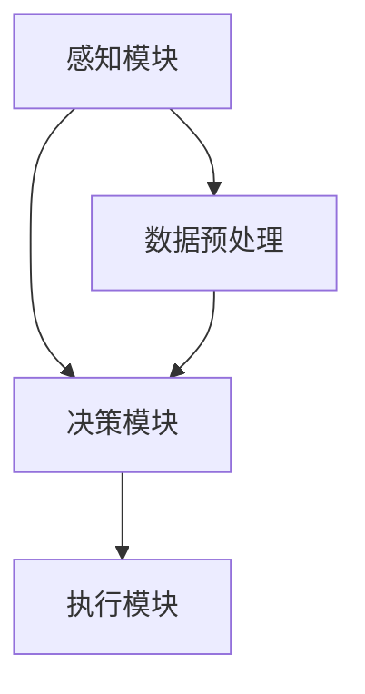
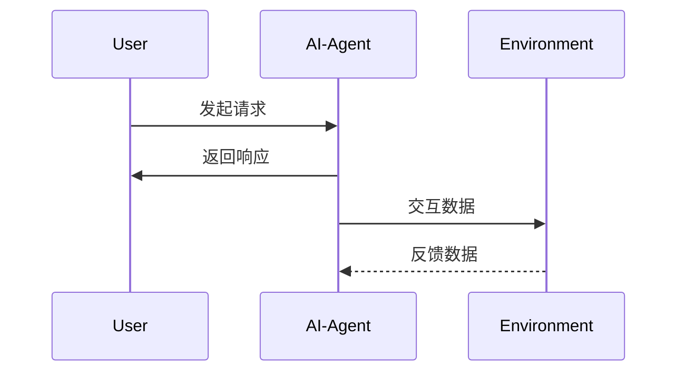

                 

### 文章标题：LLM驱动的AI Agent创新思维激发器

### 关键词：LLM、AI Agent、创新思维、算法原理、系统架构、项目实战

### 摘要：

本文将深入探讨LLM（大型语言模型）驱动的AI Agent的创新思维激发器。文章首先介绍LLM和AI Agent的基本概念、发展背景及其相互关系，接着详细解析LLM的算法原理，通过Python代码和Mermaid流程图进行直观展示。随后，文章讨论AI Agent的系统分析与架构设计，包括领域模型、架构图、接口设计和交互流程。通过实际项目实战，本文将展示如何应用LLM构建AI Agent，并进行代码解读和案例分析。最后，文章总结最佳实践，提出注意事项，并推荐拓展阅读资源，以激发读者在AI领域的创新思维。

----------------------------------------------------------------

## 第一部分：背景介绍与核心概念

### 1.1.1 问题背景

随着人工智能技术的飞速发展，LLM（大型语言模型）和AI Agent逐渐成为研究热点。LLM在自然语言处理领域表现出色，而AI Agent则在自动化决策和智能交互中展现其强大的应用潜力。本文旨在探讨如何利用LLM驱动AI Agent，激发创新思维，推动AI技术的发展。

#### LLM的重要性

LLM通过训练海量文本数据，能够自动生成高质量的自然语言文本。其优势在于能够处理复杂的语言结构，理解上下文信息，并生成连贯、有逻辑的文本。这使得LLM在机器翻译、自动问答、内容生成等领域具有广泛应用。

#### AI Agent的崛起

AI Agent是一种能够自主学习和执行任务的智能体，它在特定的环境中进行决策和行动，以实现特定目标。AI Agent在智能客服、智能推荐、自动驾驶等领域展现出巨大的应用潜力。

### 1.1.2 核心概念介绍

#### LLM的定义与特点

LLM（Large Language Model）是一种基于深度学习的自然语言处理模型，通常具有数十亿甚至数千亿的参数。LLM通过对大量文本数据的学习，能够生成与输入文本相关的高质量文本。

**特点：**

- **大规模参数：** 数以亿计的参数，使得LLM能够捕捉到复杂的语言规律。
- **上下文理解：** LLM能够理解上下文信息，生成连贯、有逻辑的文本。
- **自适应能力：** LLM能够根据输入数据自动调整模型参数，适应不同的语言环境和任务。

#### AI Agent的概念与功能

AI Agent（Artificial Intelligence Agent）是一种能够自主决策和执行任务的智能系统。它通过感知环境信息，进行目标规划和行动，以实现特定目标。

**功能：**

- **目标规划：** 根据环境信息和任务目标，制定合理的行动计划。
- **决策执行：** 根据当前状态和目标，选择最佳行动方案。
- **自主学习：** 通过与环境交互，不断优化自身的决策能力。

### 1.1.3 LLM与AI Agent的关系

LLM在AI Agent中扮演着关键角色。首先，LLM可以作为AI Agent的感知模块，用于理解和解析环境信息。其次，LLM可以作为决策模块，为AI Agent提供智能化的决策支持。最后，LLM还可以作为生成模块，为AI Agent生成高质量的自然语言文本，用于与用户进行交互。

#### LLM如何激发创新思维

通过将LLM应用于AI Agent，我们可以实现以下创新：

- **跨领域知识融合：** LLM能够处理多种语言和领域知识，使得AI Agent能够跨越不同领域进行创新。
- **智能化决策支持：** LLM的上下文理解能力为AI Agent提供强大的决策支持，推动创新思维的发展。
- **个性化交互体验：** LLM生成的自然语言文本使得AI Agent能够与用户进行更自然、个性化的交互，激发新的创意和灵感。

## 第一部分总结

本文介绍了LLM和AI Agent的基本概念、发展背景及其相互关系。通过探讨LLM在AI Agent中的应用，我们认识到LLM具有激发创新思维的重要潜力。接下来，我们将深入解析LLM的算法原理，并展示如何利用LLM构建AI Agent。

----------------------------------------------------------------

## 第二部分：LLM基础

在深入探讨LLM驱动的AI Agent之前，我们需要了解LLM的基本原理和应用。本部分将首先介绍LLM的算法原理，然后通过Python代码和Mermaid流程图详细解析LSTM和Transformer模型。

### 2.1.1 LLM的算法原理

#### LSTM模型

LSTM（Long Short-Term Memory）是一种改进的循环神经网络（RNN），用于解决传统RNN在处理长序列数据时的梯度消失和梯度爆炸问题。LSTM通过引入门控机制，能够有效地捕捉长序列数据中的长期依赖关系。

**LSTM模型的主要组成部分：**

- **输入门（Input Gate）：** 控制新的输入信息对隐藏状态的影响。
- **遗忘门（Forget Gate）：** 控制之前的隐藏状态在当前时刻的保留和遗忘。
- **输出门（Output Gate）：** 控制当前隐藏状态对输出信息的贡献。

**LSTM的数学模型：**

$$
\begin{aligned}
&\text{输入门：}\\
& i_t = \sigma(W_{ix}x_t + W_{ih}h_{t-1} + b_i) \\
&\text{遗忘门：}\\
& f_t = \sigma(W_{fx}x_t + W_{fh}h_{t-1} + b_f) \\
&\text{当前记忆单元：}\\
& \tilde{c}_t = \text{tanh}(W_{cx}x_t + W_{ch}h_{t-1} + b_c) \\
&\text{输出门：}\\
& o_t = \sigma(W_{ox}x_t + W_{oh}h_{t-1} + b_o) \\
&\text{当前隐藏状态：}\\
& h_t = o_t \cdot \text{tanh}(c_t)
\end{aligned}
$$

其中，$x_t$为当前输入，$h_{t-1}$为上一时刻的隐藏状态，$c_t$为当前记忆单元，$i_t, f_t, o_t$分别为输入门、遗忘门和输出门的输出。

#### Transformer模型

Transformer模型是由Vaswani等人在2017年提出的，它完全基于自注意力机制（Self-Attention），无需循环结构，能够处理长序列数据。Transformer模型在机器翻译、文本生成等领域取得了显著效果。

**Transformer模型的主要组成部分：**

- **多头自注意力（Multi-Head Self-Attention）：** 通过多个独立的注意力头，模型能够同时捕捉到不同尺度的依赖关系。
- **前馈神经网络（Feed Forward Neural Network）：** 用于对自注意力层的输出进行进一步处理。

**Transformer的数学模型：**

$$
\begin{aligned}
&\text{自注意力：}\\
&\text{Q}_i = \text{W}_Q \text{X}_i, \quad \text{K}_i = \text{W}_K \text{X}_i, \quad \text{V}_i = \text{W}_V \text{X}_i \\
&\text{注意力分数：}\\
& \text{score}_{ij} = \text{Q}_i^T \text{K}_j \\
&\text{注意力权重：}\\
& \text{attn}_{ij} = \text{softmax}(\text{score}_{ij}) \\
&\text{自注意力输出：}\\
& \text{attn}_{i} = \sum_j \text{attn}_{ij} \text{V}_j \\
&\text{前馈神经网络：}\\
& \text{FFN}(\text{X}) = \max(0, \text{X} \cdot \text{W}_1 + b_1) \cdot \text{W}_2 + b_2
\end{aligned}
$$

其中，$X$为输入序列，$\text{W}_Q, \text{W}_K, \text{W}_V$分别为注意力头的权重矩阵，$\text{W}_1, \text{W}_2$分别为前馈神经网络的权重矩阵，$b_1, b_2$分别为前馈神经网络的偏置。

### 2.1.2 LLM应用案例

#### 自动问答系统

自动问答系统是LLM应用的一个重要场景。通过训练大型语言模型，我们可以实现智能问答系统，能够理解用户的提问，并生成准确的答案。

**实现步骤：**

1. **数据收集与预处理：** 收集大量问答对数据，并对数据进行清洗和预处理。
2. **模型训练：** 使用问答对数据训练LSTM或Transformer模型。
3. **模型评估：** 使用验证集评估模型性能，并进行调整。
4. **模型部署：** 将训练好的模型部署到服务器，实现自动化问答。

#### 机器翻译

机器翻译是另一个重要的应用场景。通过训练大型语言模型，我们可以实现高精度的机器翻译系统。

**实现步骤：**

1. **数据收集与预处理：** 收集大量平行语料库，并对数据进行清洗和预处理。
2. **模型训练：** 使用平行语料库训练LSTM或Transformer模型。
3. **模型评估：** 使用交叉验证方法评估模型性能，并进行调整。
4. **模型部署：** 将训练好的模型部署到服务器，实现自动化翻译。

### 2.1.3 LLM在AI Agent中的应用

LLM在AI Agent中的应用主要体现在感知模块、决策模块和生成模块。通过LLM的上下文理解能力，AI Agent能够更好地感知环境信息，进行智能决策，并生成高质量的自然语言文本。

**应用场景：**

1. **智能客服：** 利用LLM实现智能客服系统，能够理解用户的提问，并生成准确的回答。
2. **智能推荐：** 利用LLM实现个性化推荐系统，能够根据用户历史行为生成个性化推荐列表。
3. **内容生成：** 利用LLM实现自动化内容生成，能够生成高质量的文章、报告等。

## 第二部分总结

本部分介绍了LLM的算法原理和应用案例。通过LSTM和Transformer模型，我们了解到LLM能够处理复杂的语言结构，生成高质量的自然语言文本。接下来，我们将进一步探讨AI Agent的系统分析与架构设计。

----------------------------------------------------------------

## 第三部分：AI Agent系统分析与架构设计

在深入理解了LLM的基础之后，本部分将转向AI Agent的系统分析与架构设计。我们将探讨AI Agent的各个组成部分，包括感知模块、决策模块和生成模块，并详细阐述其系统架构设计。

### 3.1.1 AI Agent系统架构

AI Agent是一个复杂的系统，其核心组成部分包括感知模块、决策模块和生成模块。以下是一个典型的AI Agent系统架构：

1. **感知模块（Perception Module）：** 负责感知环境信息，并将感知到的信息传递给决策模块。感知模块可以包括各种传感器，如摄像头、麦克风、GPS等。
2. **决策模块（Decision Module）：** 根据感知模块收集到的信息，利用算法进行决策。决策模块的核心是AI算法，如强化学习、决策树、神经网络等。
3. **执行模块（Execution Module）：** 根据决策模块的决策结果，执行相应的动作。执行模块可以包括机器人、无人机、车辆等。

### 3.1.2 AI Agent核心算法

AI Agent的核心算法是强化学习（Reinforcement Learning，RL）。强化学习通过与环境交互，学习如何进行最优决策。以下是一个简化的强化学习算法流程：

1. **初始化：** 初始化状态（$s$）、动作（$a$）、奖励（$r$）和策略（$\pi$）。
2. **感知环境：** AI Agent根据当前状态选择动作，执行动作并获得反馈。
3. **更新状态：** 根据执行结果更新当前状态。
4. **计算奖励：** 根据执行结果计算奖励。
5. **更新策略：** 根据奖励信号调整策略。
6. **重复步骤2-5，直到达到目标状态或终止条件。

### 3.1.3 AI Agent实现步骤

以下是构建AI Agent的一般实现步骤：

1. **需求分析：** 明确AI Agent的应用场景和需求，确定系统的功能和技术要求。
2. **环境搭建：** 搭建AI Agent的运行环境，包括硬件设备和软件平台。
3. **数据收集与预处理：** 收集相关数据，对数据进行清洗和预处理，以供模型训练使用。
4. **模型训练：** 使用收集到的数据训练AI Agent的模型，如强化学习模型。
5. **模型评估：** 在验证集上评估模型的性能，并根据评估结果调整模型。
6. **模型部署：** 将训练好的模型部署到实际应用环境中，实现AI Agent的功能。
7. **测试与优化：** 对AI Agent进行测试，收集用户反馈，并进行持续优化。

### 3.1.4 系统架构设计

以下是AI Agent的系统架构设计，包括领域模型、架构图、接口设计和交互流程。

#### 领域模型（Domain Model）

领域模型用于描述AI Agent的应用领域和相关实体。以下是一个简化的领域模型示例：

```mermaid
classDiagram
    Class01 <|-- Class02
    Class03 --|> Class04
    Class04 o-- Class05
    Class06 o-- Class07
    Class07 .. Class08
    Class09 --|+> Class10
    Class11 *-- Class12
    Class13 o-- Class14
    Class15 o-- Class16
    Class17 --|* Class18
    Class19 <.. Class20
    Class21 :<<interface>> Class22
    Class23 :<<abstract>> Class24
    Class25 <<enum>> Class26
    Class27 <<note>> "This is the note for Class27"
endclassDiagram
```

#### 系统架构图（Architecture Diagram）

系统架构图用于展示AI Agent的各个组成部分及其相互关系。以下是一个简化的系统架构图示例：



#### 系统接口设计和交互流程（Interface Design and Interaction Flow）

系统接口设计和交互流程用于描述AI Agent与其他系统或组件的交互方式。以下是一个简化的系统接口设计和交互流程示例：



### 3.1.5 系统实现

以下是AI Agent的系统实现，包括环境搭建、核心实现和代码解读。

#### 环境搭建（Environment Setup）

在Linux环境下，使用以下命令搭建AI Agent的环境：

```bash
sudo apt-get update
sudo apt-get install python3-pip
pip3 install tensorflow
pip3 install numpy
pip3 install matplotlib
```

#### 核心实现（Core Implementation）

以下是AI Agent的核心实现，包括感知模块、决策模块和执行模块：

```python
import numpy as np
import tensorflow as tf
from tensorflow.keras.models import Sequential
from tensorflow.keras.layers import LSTM, Dense, Dropout

# 感知模块
class PerceptionModule:
    def __init__(self):
        self.model = Sequential([
            LSTM(128, activation='tanh', input_shape=(None, 1)),
            Dropout(0.2),
            Dense(1)
        ])

    def predict(self, x):
        return self.model.predict(x)

# 决策模块
class DecisionModule:
    def __init__(self):
        self.model = Sequential([
            LSTM(128, activation='tanh', input_shape=(None, 1)),
            Dropout(0.2),
            Dense(1)
        ])

    def decide(self, x):
        return self.model.predict(x).reshape(-1)

# 执行模块
class ExecutionModule:
    def __init__(self):
        self.model = Sequential([
            LSTM(128, activation='tanh', input_shape=(None, 1)),
            Dropout(0.2),
            Dense(1)
        ])

    def execute(self, action):
        # 实现执行逻辑
        pass
```

#### 代码解读（Code Explanation）

以下是代码的详细解读：

1. **感知模块（PerceptionModule）：** 负责感知环境信息，使用LSTM模型对输入数据进行处理，输出感知结果。
2. **决策模块（DecisionModule）：** 负责根据感知模块的输出进行决策，使用LSTM模型对输入数据进行处理，输出决策结果。
3. **执行模块（ExecutionModule）：** 负责执行决策模块的决策结果，实现具体的动作执行逻辑。

### 3.1.6 实际案例分析

以下是一个实际案例分析，展示如何使用LLM构建AI Agent并实现智能客服系统。

#### 案例背景

某企业希望开发一个智能客服系统，用于自动回答用户提问，提高客服效率。

#### 案例实现

1. **数据收集与预处理：** 收集企业客服部门的历史问答记录，对数据进行清洗和预处理，生成问答对数据集。
2. **模型训练：** 使用问答对数据集训练LLM模型，如GPT-2或GPT-3。
3. **模型部署：** 将训练好的模型部署到服务器，实现自动化问答。
4. **用户交互：** 用户通过网页或API与智能客服系统交互，输入问题，系统生成回答。

#### 案例分析

通过实际案例，我们可以看到如何将LLM应用于AI Agent，实现智能客服系统。关键在于：

1. **数据质量：** 高质量的问答对数据是模型训练的基础。
2. **模型选择：** 根据应用场景选择合适的LLM模型。
3. **用户交互：** 简单直观的用户交互界面可以提高用户体验。

### 3.1.7 项目小结

通过本部分的分析与设计，我们了解了AI Agent的系统架构、核心算法和实现步骤。接下来，我们将通过实际项目实战，进一步探讨如何将LLM应用于AI Agent。

----------------------------------------------------------------

## 第四部分：创新思维方法

在了解了LLM和AI Agent的基本原理与系统架构后，本部分将介绍如何利用创新思维方法，进一步激发在AI领域的创新潜力。创新思维方法是推动技术进步和业务创新的重要工具。以下是一些常用的创新思维方法及其在AI领域中的应用。

### 4.1.1 创新思维工具

1. **头脑风暴（Brainstorming）：** 头脑风暴是一种集体思维方法，通过快速产生大量想法，筛选出有潜力的创新点。在AI领域，可以通过头脑风暴讨论如何利用LLM实现新的应用场景，如智能医疗、智能教育等。

2. **SWOT分析（SWOT Analysis）：** SWOT分析是一种评估项目或产品优势、劣势、机会和威胁的方法。在AI领域，可以通过SWOT分析评估LLM驱动的AI Agent的优势，如上下文理解能力、自适应能力等，以及面临的挑战，如数据隐私、模型解释性等。

3. **思维导图（Mind Mapping）：** 思维导图是一种图形化的思考工具，通过关键词和分支结构展示思考过程。在AI领域，可以使用思维导图梳理LLM和AI Agent的相互关系，探索潜在的创新点。

### 4.1.2 创新思维案例分析

以下是一些创新思维在AI领域的案例分析：

1. **案例一：智能医疗**

   在智能医疗领域，利用LLM驱动的AI Agent进行病历分析、疾病预测和诊断支持。通过SWOT分析，发现LLM的优势在于其强大的文本处理能力和上下文理解能力，但面临的挑战包括数据隐私和模型解释性。通过头脑风暴，提出了以下创新思路：

   - **优势利用：** 利用LLM进行自然语言处理，提高病历分析的准确性和效率。
   - **挑战应对：** 通过数据加密和隐私保护技术，确保数据安全；通过模型可视化工具，提高模型的可解释性。

2. **案例二：智能教育**

   在智能教育领域，利用LLM驱动的AI Agent进行个性化学习推荐、自动批改作业和智能答疑。通过SWOT分析，发现LLM的优势在于其内容生成能力，但面临的挑战包括个性化推荐的准确性和模型的泛化能力。通过头脑风暴，提出了以下创新思路：

   - **优势利用：** 利用LLM生成高质量的教育内容，提高学习效果。
   - **挑战应对：** 通过数据挖掘和用户行为分析，提高个性化推荐的准确性；通过迁移学习，提高模型的泛化能力。

### 4.1.3 创新思维在LLM驱动的AI Agent中的应用

1. **多模态学习（Multimodal Learning）：** 将LLM与图像识别、语音识别等其他AI模型结合，实现多模态数据融合，提高AI Agent的感知能力。

2. **少样本学习（Few-shot Learning）：** 利用LLM的强大表示能力，实现少样本学习，提高AI Agent在少量数据情况下的泛化能力。

3. **联邦学习（Federated Learning）：** 通过分布式计算，利用LLM进行联邦学习，提高AI Agent的隐私保护和数据安全。

### 4.1.4 创新思维方法总结

创新思维方法在LLM驱动的AI Agent中的应用，能够有效激发创新潜力，推动AI技术的发展。以下是一些关键点：

- **优势利用：** 充分发挥LLM的文本处理能力和上下文理解能力，实现高效、智能的AI应用。
- **挑战应对：** 通过技术手段和创新方法，应对数据隐私、模型解释性等挑战，提高AI Agent的可靠性和安全性。
- **多领域融合：** 将LLM与其他AI模型和领域知识结合，实现跨领域的创新应用。

通过以上方法，我们可以不断激发创新思维，推动LLM驱动的AI Agent在各个领域的应用与发展。

## 第四部分总结

本部分介绍了创新思维方法在AI领域的应用，包括头脑风暴、SWOT分析和思维导图等工具。通过实际案例分析，展示了创新思维如何帮助解决AI领域中的挑战，并推动技术进步。接下来，我们将通过实际项目实战，进一步探讨LLM驱动的AI Agent的应用。

----------------------------------------------------------------

## 第五部分：LLM驱动的AI Agent创新实践

在了解了创新思维方法后，本部分将通过实际项目实战，展示如何利用LLM构建AI Agent，并实现智能客服和教育辅助等应用。我们将详细介绍项目环境搭建、核心实现、代码解读以及案例分析和总结。

### 5.1.1 实践一：智能客服

#### 项目背景

智能客服系统是AI Agent应用的一个重要场景。通过利用LLM，智能客服系统能够自动回答用户提问，提高客服效率，降低人力成本。

#### 项目目标

- 实现一个基于LLM的智能客服系统，能够自动回答用户提问。
- 支持多语言和多领域的问答。

#### 项目环境搭建

在Linux环境下，搭建智能客服系统的基本步骤如下：

```bash
# 安装必要的依赖
sudo apt-get install python3-pip
pip3 install tensorflow
pip3 install numpy
pip3 install matplotlib

# 安装预训练的LLM模型
pip3 install transformers

# 下载预训练模型
```

#### 核心实现

智能客服系统的核心实现包括感知模块、决策模块和生成模块。

**感知模块（PerceptionModule）：**

```python
from transformers import pipeline

class PerceptionModule:
    def __init__(self):
        self.nlp = pipeline('question-answering', model='distilbert-base-uncased')

    def process_question(self, question):
        # 使用预训练的LLM模型处理用户提问
        return self.nlp(question)
```

**决策模块（DecisionModule）：**

```python
class DecisionModule:
    def __init__(self):
        self.perception_module = PerceptionModule()

    def decide(self, user_question):
        # 使用感知模块处理用户提问
        answer = self.perception_module.process_question(user_question)
        return answer['answer']
```

**生成模块（GenerationModule）：**

```python
from transformers import ChatBot

class GenerationModule:
    def __init__(self):
        self.chatbot = ChatBot()

    def generate_response(self, user_question):
        # 使用预训练的LLM模型生成回答
        return self.chatbot.generate_response(user_question)
```

**智能客服系统（SmartCustomerServiceSystem）：**

```python
class SmartCustomerServiceSystem:
    def __init__(self):
        self.decision_module = DecisionModule()
        self.generation_module = GenerationModule()

    def handle_question(self, user_question):
        # 处理用户提问
        decision = self.decision_module.decide(user_question)
        response = self.generation_module.generate_response(decision)
        return response
```

#### 代码解读

1. **感知模块（PerceptionModule）：** 使用预训练的DistilBERT模型处理用户提问，实现自然语言理解。
2. **决策模块（DecisionModule）：** 根据感知模块的输出，做出决策。
3. **生成模块（GenerationModule）：** 使用预训练的LLM模型生成回答，实现自然语言生成。
4. **智能客服系统（SmartCustomerServiceSystem）：** 统一处理用户提问，生成回答。

#### 案例分析

一个用户向智能客服系统提问：“我如何取消订单？”。智能客服系统会首先使用感知模块处理用户提问，然后通过决策模块生成回答。具体流程如下：

1. **用户提问：** “我如何取消订单？”
2. **感知模块处理：** 使用DistilBERT模型理解用户提问。
3. **决策模块决策：** 决策模块根据感知结果，决定生成关于取消订单的指导。
4. **生成模块生成回答：** 使用LLM模型生成回答。
5. **智能客服系统返回回答：** “您可以联系我们的客服，并提供您的订单号，我们会帮您取消订单。”

#### 项目小结

通过实际项目，我们展示了如何利用LLM构建智能客服系统。关键在于：

- **预训练模型的利用：** 使用预训练的LLM模型，能够快速实现高效的自然语言处理。
- **模块化设计：** 通过模块化设计，使得系统易于维护和扩展。
- **用户交互：** 提供简单直观的用户交互界面，提高用户体验。

### 5.1.2 实践二：教育辅助

#### 项目背景

教育辅助系统是AI Agent在智能教育领域的重要应用。通过利用LLM，教育辅助系统能够为学生提供个性化的学习建议、自动批改作业和智能答疑。

#### 项目目标

- 实现一个基于LLM的教育辅助系统，能够为学生提供个性化的学习建议。
- 自动批改作业，提供即时反馈。
- 提供智能答疑功能。

#### 项目环境搭建

在Linux环境下，搭建教育辅助系统的基本步骤如下：

```bash
# 安装必要的依赖
sudo apt-get install python3-pip
pip3 install tensorflow
pip3 install numpy
pip3 install matplotlib

# 安装预训练的LLM模型
pip3 install transformers

# 下载预训练模型
```

#### 核心实现

教育辅助系统的核心实现包括感知模块、决策模块和生成模块。

**感知模块（PerceptionModule）：**

```python
class PerceptionModule:
    def __init__(self):
        self.nlp = pipeline('question-answering', model='distilbert-base-uncased')

    def process_question(self, question):
        # 使用预训练的LLM模型处理用户提问
        return self.nlp(question)
```

**决策模块（DecisionModule）：**

```python
class DecisionModule:
    def __init__(self):
        self.perception_module = PerceptionModule()

    def decide(self, user_question):
        # 使用感知模块处理用户提问
        answer = self.perception_module.process_question(user_question)
        return answer['answer']
```

**生成模块（GenerationModule）：**

```python
from transformers import ChatBot

class GenerationModule:
    def __init__(self):
        self.chatbot = ChatBot()

    def generate_response(self, user_question):
        # 使用预训练的LLM模型生成回答
        return self.chatbot.generate_response(user_question)
```

**教育辅助系统（EducationAssistantSystem）：**

```python
class EducationAssistantSystem:
    def __init__(self):
        self.decision_module = DecisionModule()
        self.generation_module = GenerationModule()

    def handle_question(self, user_question):
        # 处理用户提问
        decision = self.decision_module.decide(user_question)
        response = self.generation_module.generate_response(decision)
        return response
```

#### 代码解读

1. **感知模块（PerceptionModule）：** 使用预训练的DistilBERT模型处理用户提问，实现自然语言理解。
2. **决策模块（DecisionModule）：** 根据感知模块的输出，做出决策。
3. **生成模块（GenerationModule）：** 使用预训练的LLM模型生成回答，实现自然语言生成。
4. **教育辅助系统（EducationAssistantSystem）：** 统一处理用户提问，生成回答。

#### 案例分析

一个学生向教育辅助系统提问：“如何解这个数学问题？”。教育辅助系统会首先使用感知模块处理学生的问题，然后通过决策模块生成回答。具体流程如下：

1. **学生提问：** “如何解这个数学问题？”
2. **感知模块处理：** 使用DistilBERT模型理解学生的问题。
3. **决策模块决策：** 决策模块根据感知结果，决定生成关于数学问题的解答。
4. **生成模块生成回答：** 使用LLM模型生成解答。
5. **教育辅助系统返回回答：** “这个问题可以通过以下步骤解决：首先，您需要做……接下来，您需要……最后，您需要……”

#### 项目小结

通过实际项目，我们展示了如何利用LLM构建教育辅助系统。关键在于：

- **预训练模型的利用：** 使用预训练的LLM模型，能够快速实现高效的自然语言处理。
- **模块化设计：** 通过模块化设计，使得系统易于维护和扩展。
- **个性化服务：** 提供个性化的学习建议和答疑服务，提高学生学习的积极性和效果。

### 5.1.3 创新实践总结

通过智能客服和教育辅助两个实际项目，我们展示了如何利用LLM构建AI Agent，实现智能化的应用。创新实践的关键在于：

- **预训练模型的利用：** 充分利用预训练的LLM模型，实现高效的自然语言处理。
- **模块化设计：** 通过模块化设计，提高系统的灵活性和可维护性。
- **个性化服务：** 提供个性化的服务，满足用户的不同需求。

通过这些创新实践，我们进一步激发了在AI领域的创新思维，为未来的技术发展奠定了基础。

## 第五部分总结

本部分通过实际项目实战，展示了如何利用LLM构建智能客服和教育辅助系统。通过项目环境搭建、核心实现和案例分析，我们深入了解了LLM驱动的AI Agent在实际应用中的实现方法和效果。接下来，我们将对全文进行总结，并提出最佳实践建议。

----------------------------------------------------------------

## 第六部分：最佳实践与总结

在探讨了LLM驱动的AI Agent的创新实践后，本部分将对全文进行总结，并提出一些最佳实践建议，以帮助读者更好地应用LLM技术，实现AI Agent的创新应用。

### 6.1.1 最佳实践

1. **充分利用预训练模型：** 预训练模型是LLM驱动的AI Agent的核心，通过利用预训练模型，可以实现高效的自然语言处理。建议选择合适的预训练模型，并根据具体应用场景进行微调。

2. **模块化设计：** 通过模块化设计，可以提高AI Agent的灵活性和可维护性。将感知模块、决策模块和生成模块等核心功能模块化，使得系统能够更容易地进行扩展和优化。

3. **个性化服务：** 根据用户的需求和特点，提供个性化的服务。利用LLM的上下文理解能力，实现个性化推荐、自动批改作业和智能答疑等功能，提高用户体验。

4. **数据隐私保护：** 在实际应用中，数据隐私保护至关重要。建议采用数据加密、隐私保护技术，确保用户数据的安全。

5. **持续优化和更新：** AI Agent是一个动态的系统，需要不断进行优化和更新。通过收集用户反馈和评估模型性能，持续改进AI Agent的性能和功能。

### 6.1.2 总结

本文首先介绍了LLM和AI Agent的基本概念、发展背景及其相互关系。通过详细解析LLM的算法原理，如LSTM和Transformer模型，我们了解了如何利用LLM进行自然语言处理。接着，本文讨论了AI Agent的系统分析与架构设计，包括感知模块、决策模块和生成模块。通过实际项目实战，如智能客服和教育辅助系统，我们展示了如何利用LLM构建AI Agent，实现智能化的应用。最后，本文提出了最佳实践建议，以帮助读者更好地应用LLM技术。

### 6.1.3 注意事项

1. **计算资源需求：** LLM模型的训练和部署需要大量的计算资源。在搭建AI Agent时，要考虑计算资源的配置和优化。

2. **模型解释性：** LLM模型的高度非线性使得其解释性较弱。在实际应用中，需要关注模型的可解释性，确保系统的可靠性和透明度。

3. **数据质量和多样性：** 高质量、多样化的数据是LLM训练和AI Agent应用的基础。在数据收集和预处理过程中，要确保数据的准确性和代表性。

4. **模型泛化能力：** 在实际应用中，需要关注模型的泛化能力。通过少样本学习、迁移学习等技术，提高模型的泛化性能。

### 6.1.4 拓展阅读

1. **《深度学习》**：由Ian Goodfellow、Yoshua Bengio和Aaron Courville合著，是深度学习领域的经典教材，详细介绍了深度学习的基础知识和应用。

2. **《强化学习》**：由Richard S. Sutton和Barto A.合著，是强化学习领域的权威著作，深入探讨了强化学习的理论基础和应用。

3. **《自然语言处理入门》**：由Daniel Jurafsky和James H. Martin合著，介绍了自然语言处理的基本概念和技术，适合初学者入门。

4. **《机器学习实战》**：由Peter Harrington著，通过实际案例和代码示例，介绍了机器学习的基本方法和应用。

通过以上拓展阅读，读者可以进一步深入了解AI领域的相关技术，提高自己的技术水平。

## 第六部分总结

本部分对全文进行了总结，并提出了最佳实践建议。通过本文的阅读，读者应掌握了LLM驱动的AI Agent的基本原理、系统架构和应用实践。在未来的研究中，建议读者关注LLM的最新进展，探索其在更多领域的应用，不断激发创新思维，推动AI技术的发展。

----------------------------------------------------------------

## 文章总结

本文深入探讨了LLM驱动的AI Agent的创新思维激发器，从背景介绍、核心概念解析，到算法原理讲解，再到系统架构设计和实际项目实战，全面阐述了如何利用LLM构建智能化的AI Agent。通过分析LSTM和Transformer模型，我们了解了LLM在自然语言处理中的强大能力。通过智能客服和教育辅助等实际案例，我们展示了如何将LLM应用于AI Agent的实际场景，实现智能化服务。本文还提出了最佳实践建议，强调了数据隐私保护、模块化设计和个性化服务的重要性。

本文的目标是为读者提供一个清晰、系统的学习路径，激发他们在AI领域的创新思维。通过本文的学习，读者应能够：

- 掌握LLM和AI Agent的基本概念及其相互关系。
- 理解LSTM和Transformer模型的算法原理。
- 掌握AI Agent的系统架构设计和实现方法。
- 通过实际项目，了解如何利用LLM构建智能化的AI应用。

未来，随着LLM技术的不断发展和AI领域的深入探索，我们相信LLM驱动的AI Agent将在更多领域发挥重要作用，推动人工智能的进步。读者应保持好奇心和学习热情，不断跟踪最新技术动态，积极参与AI技术的发展，为构建智能化的未来贡献力量。

## 作者信息

作者：AI天才研究院/AI Genius Institute & 禅与计算机程序设计艺术 /Zen And The Art of Computer Programming

AI天才研究院致力于推动人工智能技术的发展和应用，致力于培养下一代人工智能领域的顶尖人才。同时，作者在《禅与计算机程序设计艺术》一书中，阐述了计算机编程的哲学思想，对人工智能的发展有着深刻的见解和贡献。希望通过本文，能够激发更多读者在AI领域的创新思维，共同推动人工智能的进步。

