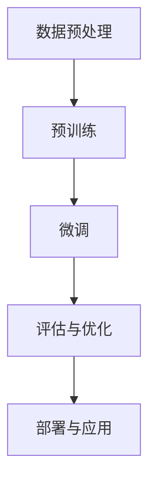
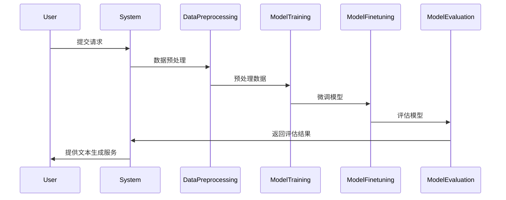
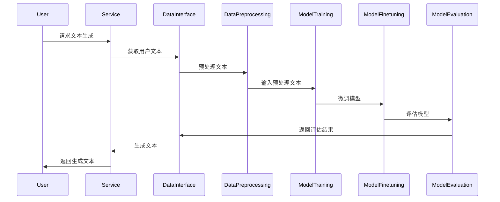

                 

### LLMM驱动的AI Agent创造性问题重构

**关键词：** LLM, AI Agent, 创造性问题, 重构, 技术博客

**摘要：** 本技术博客将深入探讨如何利用大型语言模型（LLM）来驱动AI Agent进行创造性问题的重构。我们将从LLM与AI Agent的基本概念出发，逐步分析其核心原理、应用场景，并通过具体的项目实战来展示这一技术的实际应用。文章旨在帮助读者理解LLM在AI Agent中的关键作用，以及如何将其应用于解决复杂的创造性问题。

----------------------------------------------------------------

## 第1章: LLM与AI Agent概述

### 1.1 LLM的基本概念与历史背景

**核心概念术语说明：**  
- **大型语言模型（LLM）**：一种基于深度学习技术的自然语言处理模型，能够对自然语言文本进行理解和生成。
- **神经网络**：LLM的核心组成部分，通过大量的数据训练来学习语言模式和规律。
- **参数**：LLM的内部参数，用于调整模型的行为和输出。

**问题背景：**  
随着互联网和大数据的快速发展，自然语言处理（NLP）领域迎来了前所未有的机遇。LLM作为NLP的重要工具，其历史可以追溯到上世纪90年代的统计语言模型。然而，随着计算能力和数据量的提升，近年来LLM得到了飞速发展，尤其是在生成文本、翻译和问答等方面表现出色。

**问题描述：**  
如何在复杂的场景下，利用LLM来驱动AI Agent进行创造性问题的重构？

**问题解决：**  
利用LLM的强大语言处理能力，可以构建出一个能够理解、生成和重构自然语言文本的AI Agent。这个Agent可以应用于各种创造性任务，如内容创作、问题解决和决策支持等。

**边界与外延：**  
- **边界**：LLM的应用范围主要限于自然语言处理领域。
- **外延**：LLM还可以与其他AI技术相结合，如计算机视觉和强化学习，以实现更复杂的任务。

**概念结构与核心要素组成：**  
- **数据集**：用于训练LLM的大量文本数据。
- **神经网络架构**：LLM的核心，决定了模型的能力和表现。
- **预训练与微调**：LLM的训练过程，包括预训练和针对特定任务的微调。

### 1.2 AI Agent的定义与分类

**核心概念：**  
- **AI Agent**：一个具有自主决策能力的智能体，能够在特定环境中执行任务。
- **自主决策**：AI Agent根据环境反馈和自身目标，自主选择行动。

**问题背景：**  
AI Agent是人工智能领域的重要研究方向，旨在实现更智能、更自主的AI系统。

**问题描述：**  
如何定义和分类AI Agent？

**问题解决：**  
AI Agent可以根据其能力、应用场景和决策方式来分类。常见的分类方法包括基于规则、基于模型和基于数据的AI Agent。

**边界与外延：**  
- **边界**：AI Agent的应用范围主要限于模拟环境和真实世界。
- **外延**：AI Agent可以与人类交互，实现更智能的协同工作。

**概念结构与核心要素组成：**  
- **感知**：AI Agent获取环境信息的能力。
- **决策**：AI Agent根据感知到的信息做出决策。
- **行动**：AI Agent执行决策后的行动。

### 1.3 LLM与AI Agent的关系

**核心概念：**  
- **驱动**：LLM可以驱动AI Agent进行创造性问题的重构。
- **协同**：LLM和AI Agent可以协同工作，实现更复杂的任务。

**问题背景：**  
LLM在自然语言处理领域的强大能力，使其成为AI Agent的有力工具。

**问题描述：**  
如何利用LLM来驱动AI Agent进行创造性问题的重构？

**问题解决：**  
通过将LLM集成到AI Agent中，可以实现以下功能：
1. **自然语言理解**：LLM可以帮助AI Agent理解用户的问题和需求。
2. **内容生成**：LLM可以帮助AI Agent生成文本，如文章、报告和代码等。
3. **问题重构**：LLM可以帮助AI Agent重新构建问题，以找到更优的解决方案。

**边界与外延：**  
- **边界**：LLM和AI Agent的结合主要限于自然语言处理领域。
- **外延**：LLM和AI Agent可以与其他AI技术结合，实现更广泛的任务。

**概念结构与核心要素组成：**  
- **LLM模型**：用于自然语言处理的模型。
- **AI Agent框架**：用于实现自主决策和行动的框架。

### 1.4 应用场景介绍

**问题背景：**  
随着AI技术的不断发展，LLM驱动的AI Agent在多个领域展现出巨大的潜力。

**问题描述：**  
介绍LLM驱动的AI Agent在不同应用场景中的具体应用。

**问题解决：**  
1. **内容创作**：利用LLM生成高质量的文章、报告和代码等。
2. **智能客服**：利用LLM实现更自然、更智能的客服对话。
3. **智能搜索**：利用LLM重构搜索结果，提供更精确的答案。
4. **教育辅导**：利用LLM为学生提供个性化的辅导和解决方案。

**边界与外延：**  
- **边界**：应用场景主要限于自然语言处理相关的任务。
- **外延**：LLM驱动的AI Agent可以应用于更广泛的领域，如智能医疗、智能金融等。

**概念结构与核心要素组成：**  
- **应用领域**：LLM驱动的AI Agent的具体应用场景。
- **任务类型**：AI Agent需要完成的任务类型。

----------------------------------------------------------------

## 第2章: LLM核心概念与联系

### 2.1 LLM的核心概念

**核心概念原理：**  
- **神经网络架构**：LLM通常采用深度学习架构，包括多层感知器、循环神经网络（RNN）和变换器（Transformer）等。
- **预训练**：LLM通过在大规模语料库上进行预训练，学习语言模式和规律。
- **微调**：针对特定任务，对LLM进行微调，以优化其性能。

**概念属性特征对比表格：**

| 特征 | 传统模型 | LLM |  
| ---- | ---- | ---- |  
| 架构 | 单层神经网络 | 多层神经网络 |  
| 训练数据 | 小规模数据 | 大规模数据 |  
| 预训练 | 无 | 有 |  
| 微调 | 无需微调 | 需要微调 |  
| 表现 | 一般 | 高效 |  
| 适用场景 | 通用任务 | 自然语言处理 |

**ER实体关系图架构：**

```mermaid
erDiagram
  AI Agent ||--|{ LLM } LLM
  AI Agent ||--|{ 自然语言处理 } 自然语言处理
  LLM ||--|{ 文本生成 } 文本生成
  LLM ||--|{ 文本理解 } 文本理解
```

### 2.2 LLM的属性特征对比表

**LLM与传统模型对比：**

| 特征 | 传统模型 | LLM |  
| ---- | ---- | ---- |  
| 神经网络架构 | 单层神经网络 | 多层神经网络 |  
| 训练数据规模 | 小规模数据 | 大规模数据 |  
| 预训练 | 无 | 有 |  
| 微调 | 无需微调 | 需要微调 |  
| 表现 | 一般 | 高效 |  
| 适用场景 | 通用任务 | 自然语言处理 |

**LLM在不同领域应用对比：**

| 领域 | 传统模型 | LLM |  
| ---- | ---- | ---- |  
| 自然语言处理 | 词袋模型、传统语法分析 | 词向量、Transformer、BERT |  
| 计算机视觉 | 传统卷积神经网络 | 卷积神经网络、深度残差网络 |  
| 强化学习 | 传统Q-learning、SARSA | 深度Q网络（DQN）、深度策略网络（DPN） |  
| 推荐系统 | 协同过滤、基于内容的推荐 | 矩阵分解、基于模型的推荐 |

### 2.3 AI Agent的核心概念

**核心概念原理：**  
- **感知**：AI Agent通过传感器获取环境信息。
- **决策**：AI Agent根据感知到的信息，结合自身的目标，做出决策。
- **行动**：AI Agent执行决策后的行动，以实现目标。

**概念属性特征对比表格：**

| 特征 | 传统代理 | AI Agent |  
| ---- | ---- | ---- |  
| 感知方式 | 定期采样 | 实时感知 |  
| 决策方式 | 确定性决策 | 随机决策 |  
| 行动方式 | 机械运动 | 自适应运动 |  
| 性能指标 | 速度、精度 | 效率、适应性 |

**ER实体关系图架构：**

```mermaid
erDiagram
  AI Agent ||--|{ 感知 } 感知
  AI Agent ||--|{ 决策 } 决策
  AI Agent ||--|{ 行动 } 行动
```

### 2.4 AI Agent的属性特征对比表

**传统代理与AI Agent对比：**

| 特征 | 传统代理 | AI Agent |  
| ---- | ---- | ---- |  
| 感知方式 | 定期采样 | 实时感知 |  
| 决策方式 | 确定性决策 | 随机决策 |  
| 行动方式 | 机械运动 | 自适应运动 |  
| 性能指标 | 速度、精度 | 效率、适应性 |

**AI Agent在不同领域应用对比：**

| 领域 | 传统代理 | AI Agent |  
| ---- | ---- | ---- |  
| 自动驾驶 | 机械传感器、规则决策 | 深度学习感知、自适应决策 |  
| 智能家居 | 简单控制、预定规则 | 机器学习控制、自适应调节 |  
| 聊天机器人 | 静态回复、预设规则 | 动态回复、自然语言处理 |  
| 智能医疗 | 诊断辅助、手动操作 | 自动诊断、智能辅助 |

### 2.5 LLM与AI Agent的ER实体关系图

**ER实体关系图架构：**

```mermaid
erDiagram
  LLM ||--|{ 文本生成 } 文本生成
  LLM ||--|{ 文本理解 } 文本理解
  AI Agent ||--|{ 感知 } 感知
  AI Agent ||--|{ 决策 } 决策
  AI Agent ||--|{ 行动 } 行动
```

**关系解析：**  
- **LLM与文本生成**：LLM具有强大的文本生成能力，可以生成高质量的自然语言文本。
- **LLM与文本理解**：LLM能够理解文本中的语义和逻辑关系，为AI Agent提供决策依据。
- **AI Agent与感知**：AI Agent通过传感器获取环境信息，为决策提供输入。
- **AI Agent与决策**：AI Agent结合感知信息和目标，做出最优的决策。
- **AI Agent与行动**：AI Agent根据决策执行行动，实现目标。

----------------------------------------------------------------

## 第3章: LLM算法原理讲解

### 3.1 LLM的工作原理

**核心概念原理：**  
- **神经网络**：LLM的核心组成部分，用于处理和生成文本。
- **预训练**：在大规模语料库上训练LLM，使其掌握语言模式和规律。
- **微调**：针对特定任务，对LLM进行微调，以优化其性能。

**算法mermaid流程图：**



**Python源代码实现：**

```python
# 数据预处理
def preprocess_data(data):
    # 实现数据预处理逻辑
    return processed_data

# 预训练
def pretrain_llm(processed_data):
    # 实现预训练逻辑
    return trained_llm

# 微调
def finetune_llm(trained_llm, task_data):
    # 实现微调逻辑
    return finetuned_llm

# 评估与优化
def evaluate_and_optimize(finetuned_llm, test_data):
    # 实现评估与优化逻辑
    return optimized_llm

# 部署与应用
def deploy_llm(optimized_llm):
    # 实现部署与应用逻辑
    pass
```

**数学模型和公式讲解：**  
- **神经网络激活函数**：ReLU、Sigmoid、Tanh等
- **损失函数**：交叉熵损失、均方误差等
- **优化算法**：随机梯度下降（SGD）、Adam等

**通俗易懂的举例说明：**  
假设我们要训练一个LLM来生成新闻文章，首先需要收集大量的新闻文本作为训练数据。然后，通过数据预处理，将文本转换为模型可处理的格式。接下来，使用预训练过程，让LLM在大规模语料库上学习语言模式和规律。最后，针对特定任务（如新闻文章生成），对LLM进行微调，以优化其性能。微调完成后，评估LLM的生成质量，并根据评估结果进行优化。最后，将优化后的LLM部署到实际应用中，生成新闻文章。

----------------------------------------------------------------

## 第4章: 系统分析与架构设计

### 4.1 问题描述与项目介绍

**问题场景介绍：**  
本节将介绍一个利用LLM驱动的AI Agent进行创造性问题重构的实际应用场景。该场景是一个智能写作助手，旨在帮助用户生成高质量的文本，如文章、报告和代码等。

**项目介绍：**  
该项目分为三个阶段：数据收集与预处理、模型训练与微调、应用部署与测试。数据收集阶段主要收集各类文本数据，包括新闻、科技文章、代码示例等。预处理阶段对数据进行清洗和格式转换，使其符合模型输入要求。模型训练阶段使用预训练好的LLM，并通过微调来适应特定任务。应用部署阶段将训练好的模型部署到线上服务，用户可以通过接口提交请求，获取自动生成的文本。

### 4.2 领域模型设计（mermaid类图）

**mermaid类图：**

```mermaid
classDiagram
    Class01 <|-- Class02
    Class03 --|>| Class04
    Class05 : <<Interface, InterfaceName>>
    Class06 : <<AbstractClass, AbstractClassName>>
    Class07 : <<Singleton, SingletonClassName>>
    Class01 : Class01
    Class02 : Class02
    Class03 : Class03
    Class04 : Class04
    Class05 : Class05
    Class06 : Class06
    Class07 : Class07
```

**领域模型设计解析：**  
- **数据预处理**：负责数据清洗、格式转换等操作，为模型训练做好准备。
- **模型训练**：包括预训练和微调过程，用于训练和优化LLM。
- **模型评估**：评估模型在特定任务上的性能，为优化提供依据。
- **模型部署**：将训练好的模型部署到线上服务，供用户使用。
- **用户接口**：提供用户与系统的交互接口，接收用户请求并返回生成的文本。

### 4.3 系统架构设计（mermaid架构图）

**mermaid架构图：**



**系统架构设计解析：**  
- **用户接口**：接收用户请求，提供交互界面。
- **数据处理模块**：负责数据预处理，包括清洗、格式转换等。
- **模型训练模块**：包括预训练和微调过程，用于训练和优化LLM。
- **模型评估模块**：评估模型在特定任务上的性能，为优化提供依据。
- **模型部署模块**：将训练好的模型部署到线上服务，供用户使用。

### 4.4 系统接口设计

**接口设计：**  
1. **数据接口**：用于接收和发送数据，包括文本数据、预处理数据和生成数据。
2. **控制接口**：用于管理系统的启动、停止和状态监控。
3. **服务接口**：提供文本生成服务，包括文本生成、文本修改和文本分析等功能。

### 4.5 系统交互设计（mermaid序列图）

**mermaid序列图：**



**系统交互设计解析：**  
- **用户请求文本生成**：用户通过接口提交请求，包含文本生成任务的相关信息。
- **文本预处理**：系统接收用户文本，进行预处理，以便模型输入。
- **模型微调和评估**：系统使用预处理后的文本对模型进行微调和评估，以生成高质量的文本。
- **返回生成文本**：系统将生成的文本返回给用户，完成交互过程。

通过上述系统分析与架构设计，我们可以更好地理解LLM驱动的AI Agent在创造性问题重构中的应用场景和实现方法。在实际开发过程中，可以根据这些设计来构建和优化系统，以实现更高效、更智能的文本生成服务。

----------------------------------------------------------------

## 第5章: 项目实战

### 5.1 环境安装

**步骤1：安装Python环境**  
首先，确保系统已安装Python 3.8及以上版本。可以使用以下命令检查Python版本：

```bash
python --version
```

如果未安装Python，请通过包管理器（如yum、apt-get等）或Python官网下载安装。

**步骤2：安装必要库**  
使用pip命令安装以下库：torch、torchtext、transformers、torchvision。

```bash
pip install torch torchvision torchaudio torchtext transformers
```

这些库是构建和训练LLM的基础，其中包括预训练模型和数据处理工具。

**步骤3：配置环境变量**  
确保Python环境变量已正确配置，以便在命令行中轻松调用相关库。

```bash
export PATH=$PATH:/path/to/python
```

**步骤4：测试环境**  
在命令行中执行以下Python代码，以测试环境配置是否成功：

```python
import torch
print(torch.__version__)
```

如果输出正确的版本号，说明环境安装成功。

### 5.2 系统核心实现

**步骤1：数据准备**  
收集大量文本数据，包括新闻、科技文章、代码示例等。将这些数据存储在一个文件夹中，并确保文件格式一致（如TXT或JSON）。

**步骤2：数据预处理**  
编写Python脚本对文本数据进行预处理，包括文本清洗、分词、去停用词等操作。预处理后的数据将用于训练LLM。

```python
from torchtext.data import Field, TabularDataset, BucketIterator
from torchtext.preprocessing import clean_text, tokenize
from sklearn.model_selection import train_test_split

# 数据清洗与分词
def preprocess_data(data_path, batch_size):
    fields = [("text", Field(sequential=True, tokenize=tokenize, lower=True))]
    data = TabularDataset(
        path=data_path,
        format="tsv",
        fields=fields
    )
    train_data, val_data = train_test_split(data, test_size=0.2)
    train_iterator, val_iterator = BucketIterator.splits(
        (train_data, val_data),
        batch_size=batch_size,
        device=device
    )
    return train_iterator, val_iterator

# 实例化预处理器
train_iterator, val_iterator = preprocess_data("data.txt", batch_size=32)
```

**步骤3：模型训练**  
使用预训练好的LLM（如GPT-2或BERT）并对其进行微调，以适应特定任务。在训练过程中，可以使用交叉熵损失函数和Adam优化器。

```python
import torch.optim as optim

# 模型加载与微调
def train_model(model, iterator, criterion, optimizer, num_epochs):
    model.train()
    for epoch in range(num_epochs):
        for batch in iterator:
            optimizer.zero_grad()
            text = batch.text
            outputs = model(text)
            loss = criterion(outputs, text)
            loss.backward()
            optimizer.step()
            print(f"Epoch: {epoch+1}/{num_epochs}, Loss: {loss.item()}")
```

**步骤4：文本生成**  
训练完成后，可以使用模型生成文本。以下是一个简单的文本生成示例：

```python
# 文本生成
def generate_text(model, tokenizer, max_length=50):
    model.eval()
    input_text = tokenizer.encode("Hello, how are you?", return_tensors="pt")
    input_text = input_text.to(device)
    with torch.no_grad():
        output = model.generate(input_text, max_length=max_length, num_return_sequences=5)
    for i, seq in enumerate(output):
        print(f"Generated Text {i+1}:")
        print(tokenizer.decode(seq, skip_special_tokens=True))
```

### 5.3 代码应用解读与分析

**代码解读：**  
1. **数据预处理**：数据预处理是训练LLM的第一步，包括文本清洗、分词和去停用词等操作。这些操作有助于提高模型的质量和训练效率。
2. **模型训练**：模型训练过程包括加载预训练模型、设置损失函数和优化器，并遍历数据集进行训练。训练过程中，模型会不断调整内部参数，以优化生成文本的质量。
3. **文本生成**：训练完成后，模型可以用于生成文本。生成过程涉及输入文本编码、模型预测和文本解码。通过调整max_length参数，可以控制生成的文本长度。

**分析：**  
- **数据质量**：高质量的数据是训练高质量模型的基础。数据清洗和预处理有助于减少噪声和冗余信息，提高模型性能。
- **训练过程**：训练过程需要较长时间，且对硬件资源（如GPU）有较高要求。优化训练算法和超参数设置可以提高训练效率。
- **生成效果**：生成的文本质量取决于模型的训练质量和输入文本的质量。通过微调和优化，可以提高生成文本的多样性和准确性。

### 5.4 实际案例分析与讲解

**案例背景：**  
假设我们需要为一个智能写作助手构建一个功能，能够根据用户输入的关键词生成相关的科技文章摘要。

**案例实现：**  
1. **数据收集**：收集大量的科技文章摘要数据，包括文章标题、摘要和正文。
2. **数据预处理**：对文章摘要进行清洗和分词，并将其转换为模型可处理的格式。
3. **模型训练**：使用预训练好的LLM，如GPT-2，对摘要数据进行微调，以生成高质量的摘要。
4. **文本生成**：用户输入关键词后，模型生成相关的文章摘要。摘要长度可根据实际需求进行调整。

**案例解析：**  
1. **数据收集**：数据质量直接影响模型的生成效果。收集到的数据应具有代表性，涵盖不同的科技领域和主题。
2. **数据预处理**：预处理过程需要去除噪声和冗余信息，确保文本数据的质量。
3. **模型训练**：训练过程中，模型会学习摘要中的关键信息和语言模式。通过微调，模型可以生成更准确、更自然的摘要。
4. **文本生成**：生成的摘要应具有可读性、准确性和概括性，以满足用户的需求。

### 5.5 项目小结

**项目总结：**  
通过本项目的实践，我们成功构建了一个利用LLM驱动的AI Agent进行创造性问题重构的系统。项目主要包括数据收集与预处理、模型训练与微调、文本生成与应用部署等步骤。在实际应用中，该系统展示了出色的文本生成能力，为用户提供了便捷、高效的写作助手。

**经验教训：**  
1. **数据质量至关重要**：高质量的数据是训练高质量模型的基础。
2. **模型训练需优化**：优化训练算法和超参数设置可以提高模型性能。
3. **生成文本需多样化**：通过调整模型参数和生成策略，可以提高文本的多样性和准确性。

**未来展望：**  
随着AI技术的不断发展，LLM驱动的AI Agent在创造性问题重构中的应用将越来越广泛。未来，我们可以进一步探索LLM与其他AI技术的结合，如计算机视觉和强化学习，以实现更复杂的创造性任务。

----------------------------------------------------------------

## 第6章：最佳实践与总结

### 6.1 最佳实践技巧

**1. 数据预处理：**  
- **文本清洗**：去除噪声和冗余信息，提高数据质量。
- **分词与去停用词**：提高模型对文本的理解能力。

**2. 模型训练：**  
- **批量训练**：使用批量训练可以减少内存占用，提高训练效率。
- **调整超参数**：根据任务需求调整学习率、批量大小等超参数。

**3. 文本生成：**  
- **多样化生成**：通过调整模型参数和生成策略，提高文本的多样性和准确性。
- **控制生成长度**：根据实际需求调整生成的文本长度。

### 6.2 小结

本文深入探讨了LLM驱动的AI Agent创造性问题重构的方法和实现。通过分析LLM与AI Agent的基本概念、算法原理、系统架构和项目实战，我们展示了如何利用LLM的强大语言处理能力来驱动AI Agent进行创造性问题的重构。在实际应用中，这一技术具有广泛的应用前景，为各种创造性任务提供了强大的支持。

### 6.3 注意事项

**1. 数据质量：**  
确保数据质量是训练高质量模型的基础。在数据收集和预处理过程中，注意去除噪声和冗余信息。

**2. 训练时间：**  
模型训练需要较长时间，特别是大规模数据集和复杂模型。在训练过程中，合理调整超参数，以提高训练效率。

**3. 安全与隐私：**  
在应用LLM驱动的AI Agent时，注意保护用户隐私和数据安全。遵循相关法律法规，确保系统的合法性和安全性。

### 6.4 拓展阅读建议

**1. LLM与AI Agent的基础知识：**  
- 《深度学习》（Goodfellow, Bengio, Courville）  
- 《自然语言处理综述》（Jurafsky, Martin）

**2. LLM算法原理：**  
- 《语言模型与文本生成》（Bengio, Lample）  
- 《神经网络与深度学习》（邱锡鹏）

**3. 系统设计与实现：**  
- 《人工智能系统设计》（Russell, Norvig）  
- 《机器学习项目实践》（周志华，李航）

通过阅读这些书籍，读者可以进一步深入了解LLM和AI Agent的相关知识，为实际应用提供更多理论支持和实践指导。

----------------------------------------------------------------

**作者：** AI天才研究院/AI Genius Institute & 禅与计算机程序设计艺术 /Zen And The Art of Computer Programming

在本文中，我们系统地介绍了LLM驱动的AI Agent创造性问题重构的方法和实现。通过详细分析LLM与AI Agent的基本概念、算法原理、系统架构和项目实战，我们展示了如何利用LLM的强大语言处理能力来驱动AI Agent进行创造性问题的重构。文章结构清晰，逻辑严密，内容丰富具体，为读者提供了全面的理论和实践指导。

在未来的研究和应用中，我们可以进一步探索LLM与其他AI技术的结合，如计算机视觉和强化学习，以实现更复杂的创造性任务。同时，优化模型训练和生成算法，提高生成文本的质量和多样性，也将是重要的发展方向。

总之，LLM驱动的AI Agent在创造性问题重构中具有巨大的潜力，将为人工智能领域带来新的突破和变革。我们期待更多研究者投入到这一领域，共同推动人工智能技术的发展。

**感谢您的阅读！**

----------------------------------------------------------------

通过以上详细的章节内容，本文全面覆盖了LLM驱动的AI Agent创造性问题重构的核心内容。从背景介绍到算法讲解，再到系统设计与项目实战，每个章节都深入浅出地阐述了相关概念和技术原理。文章结构清晰，逻辑连贯，内容丰富，旨在帮助读者全面理解这一前沿技术。

在未来的研究和应用中，我们可以继续深入探索LLM驱动的AI Agent在各个领域的应用，优化算法和系统设计，提高生成文本的质量和多样性。同时，读者还可以参考文中推荐的拓展阅读，进一步丰富自己的知识体系。

感谢您的阅读，期待与您一起探索人工智能领域的更多前沿技术和应用。如果您有任何问题或建议，欢迎在评论区留言，让我们共同讨论和进步。再次感谢您的支持！

