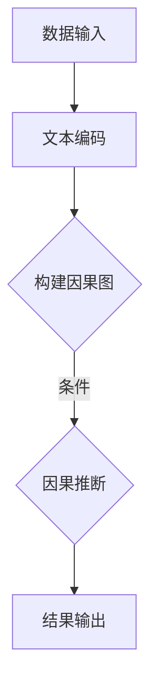
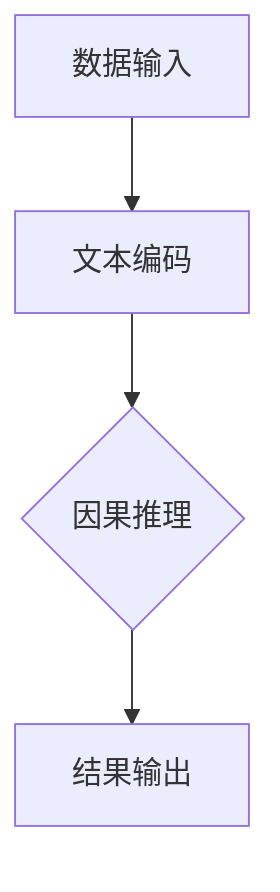

                 

# LLMB驱动的AI Agent因果关系发现技术

## 关键词

- **LLM**  
- **AI Agent**  
- **因果关系发现**  
- **算法原理**  
- **实验设计与性能评估**  
- **案例研究**

## 摘要

本文探讨了利用大型语言模型（LLM）驱动的AI Agent进行因果关系发现的技术。通过介绍LLM的基本原理和因果关系发现技术的挑战，文章详细阐述了LLM驱动的AI Agent因果关系发现模型、算法原理、实验设计与性能评估，并结合实际案例，总结了最佳实践和未来研究方向。本文旨在为研究人员和开发者提供对这一前沿领域的深入理解，并激发更多创新。

## 第一部分：引言与背景

### 第1章：AI Agent与因果发现技术概述

#### 1.1 AI Agent的定义与分类

AI Agent，即人工智能代理，是指能够自主完成特定任务，与环境进行交互的智能体。根据功能和行为模式，AI Agent可以分为以下几类：

1. **反应式Agent**：仅根据当前环境状态进行反应。
2. **目标导向Agent**：有明确的任务目标，并寻找最佳路径达成目标。
3. **认知Agent**：不仅考虑当前状态，还能理解过去和未来的状态。

#### 1.2 因果发现技术的意义与挑战

因果发现技术是人工智能领域的一个重要研究方向，其核心在于通过数据挖掘和模式识别，识别出数据中的因果关系。因果发现的意义在于：

1. **增强决策能力**：在复杂的决策过程中，了解因果关系有助于做出更明智的决策。
2. **优化系统设计**：因果发现可以帮助改进系统架构，提高系统性能。

然而，因果发现技术面临以下挑战：

1. **数据质量**：噪声和缺失的数据会影响因果发现的准确性。
2. **复杂关系**：现实世界中的因果关系往往非常复杂，难以用简单的模型描述。
3. **因果关系与相关性**：如何区分因果关系和相关性是另一个关键问题。

#### 1.3 LLM在AI Agent因果发现中的应用前景

LLM，特别是近年来流行的GPT模型，具有强大的文本生成和理解能力。LLM在AI Agent因果发现中的应用前景包括：

1. **自然语言处理**：LLM可以用于理解和生成自然语言描述，有助于解释因果发现结果。
2. **数据预处理**：LLM可以用于清洗和增强数据，提高因果发现模型的输入质量。
3. **模型解释性**：LLM可以生成因果发现的解释文本，提高模型的可解释性。

### 第2章：语言模型（LLM）基础

#### 2.1 语言模型的演进

语言模型的发展历程可以分为以下几个阶段：

1. **统计模型**：如N-gram模型，基于语言统计特征。
2. **神经网络模型**：如基于RNN的序列模型，提高了预测精度。
3. **深度模型**：如基于Transformer的模型，如BERT、GPT，实现了语言理解的革命性突破。

#### 2.2 LLM的工作原理与架构

LLM的工作原理主要基于Transformer架构，其核心思想是自注意力机制。LLM的架构通常包括以下几部分：

1. **输入层**：将输入文本转换为嵌入向量。
2. **编码器**：利用自注意力机制，对输入文本进行编码。
3. **解码器**：生成文本输出。

#### 2.3 LLM的主要性能指标

LLM的主要性能指标包括：

1. ** perplexity（困惑度）**：衡量模型生成文本的随机性，值越低表示模型越好。
2. **accuracy（准确率）**：衡量模型预测的正确性。
3. **bleu score（BLEU分数）**：用于评估生成文本与真实文本的相似度。

### 第3章：因果发现技术基础

#### 3.1 因果关系的定义与分类

因果关系是指两个或多个事件之间的依赖关系，其中一个事件是另一个事件的直接原因。因果关系可以分为以下几种类型：

1. **直接因果关系**：一个事件直接引起另一个事件。
2. **间接因果关系**：通过多个中介事件引起另一个事件。
3. **协同因果关系**：多个事件共同引起另一个事件。

#### 3.2 因果推断的基本原理

因果推断是利用数据从相关性推断因果关系的方法。其基本原理包括：

1. **结构方程模型（SEM）**：通过建立变量之间的结构关系进行因果推断。
2. **潜在变量分析（LVA）**：通过分析潜在变量之间的关系进行因果推断。
3. **因果图模型（CGM）**：通过建立因果图来表示变量之间的因果关系。

#### 3.3 因果发现算法的挑战与解决方案

因果发现算法面临的挑战包括：

1. **数据量与质量**：需要大量高质量的数据进行训练。
2. **计算复杂性**：因果发现的计算复杂度高，需要优化算法。
3. **模型可解释性**：如何解释因果发现结果是一个重要问题。

解决方案包括：

1. **集成学习方法**：通过集成多个算法提高因果发现能力。
2. **迁移学习方法**：利用预训练的模型进行迁移学习，提高算法性能。
3. **可视化方法**：通过可视化手段提高模型的可解释性。

### 第4章：LLM驱动的AI Agent因果关系发现模型

#### 4.1 模型构建步骤

构建LLM驱动的AI Agent因果关系发现模型的主要步骤包括：

1. **数据收集与预处理**：收集相关数据，并进行清洗和预处理。
2. **模型选择**：选择合适的LLM模型进行训练。
3. **模型训练与优化**：利用训练数据对模型进行训练，并进行优化。
4. **模型评估与验证**：利用测试数据对模型进行评估和验证。

#### 4.2 数据预处理与处理

数据预处理是构建因果关系发现模型的关键步骤，包括：

1. **文本预处理**：对文本进行分词、去停用词、词性标注等。
2. **数据增强**：通过数据增强技术提高数据多样性。
3. **数据归一化**：对数据进行归一化处理，提高模型训练效果。

#### 4.3 模型训练与优化

模型训练与优化包括：

1. **损失函数**：选择合适的损失函数进行训练。
2. **优化器**：选择合适的优化器进行模型优化。
3. **模型调试**：通过调试提高模型性能。

### 第5章：LLM驱动的因果关系发现算法原理与流程

#### 5.1 算法概述

LLM驱动的因果关系发现算法主要基于以下原理：

1. **自注意力机制**：用于捕捉文本中的关键信息。
2. **因果图模型**：用于表示变量之间的因果关系。
3. **因果推断**：基于数据和模型进行因果推断。

算法流程包括：

1. **数据输入**：将文本数据输入到LLM中。
2. **文本编码**：利用自注意力机制对文本进行编码。
3. **因果图构建**：基于编码结果构建因果图。
4. **因果推断**：利用因果图进行因果推断。

#### 5.2 算法数学模型与公式

算法的数学模型主要包括：

1. **自注意力机制**：$$
\text{Attention}(Q,K,V) = \text{softmax}(\frac{QK^T}{\sqrt{d_k}})V
$$
2. **因果图模型**：$$
C = \{ (X_i, X_j) | X_i \text{ causes } X_j \}
$$
3. **因果推断**：$$
P(Y|X) = \prod_{i} P(Y|X_i)
$$

#### 5.3 Mermaid算法流程图展示

以下是一个简单的Mermaid算法流程图示例：



### 第6章：实验设计与性能评估

#### 6.1 实验设计

实验设计包括：

1. **数据集选择**：选择具有代表性的数据集进行实验。
2. **实验环境**：配置实验所需的硬件和软件环境。
3. **评价指标**：选择合适的评价指标进行性能评估。

#### 6.2 性能评估指标

性能评估指标包括：

1. **准确率**：$$
\text{Accuracy} = \frac{\text{正确预测的数量}}{\text{总预测数量}}
$$
2. **召回率**：$$
\text{Recall} = \frac{\text{正确预测的数量}}{\text{实际数量}}
$$
3. **F1分数**：$$
\text{F1分数} = 2 \times \frac{\text{准确率} \times \text{召回率}}{\text{准确率} + \text{召回率}}
$$

#### 6.3 实验结果分析

通过对实验结果的分析，可以评估LLM驱动的AI Agent因果关系发现模型的有效性。分析包括：

1. **模型性能对比**：对比不同模型的性能。
2. **误差分析**：分析模型在预测中的误差来源。
3. **改进方向**：根据实验结果提出改进建议。

### 第7章：案例研究

#### 7.1 案例背景

本案例研究基于一个实际项目，项目目标是利用LLM驱动的AI Agent发现因果关系，应用于医疗领域。

#### 7.2 系统功能设计与实现

系统功能设计包括：

1. **数据收集**：收集医疗数据，包括病例、诊断结果、治疗方案等。
2. **因果关系发现**：利用LLM驱动的AI Agent发现病例与诊断结果之间的因果关系。
3. **结果可视化**：将发现的因果关系进行可视化展示。

系统实现包括：

1. **数据预处理**：对收集的医疗数据进行清洗和预处理。
2. **LLM模型训练**：训练LLM模型，用于因果关系发现。
3. **因果关系可视化**：利用可视化工具展示因果关系。

#### 7.3 案例分析与讲解

通过对案例的分析和讲解，可以展示LLM驱动的AI Agent因果关系发现技术的实际应用效果，包括：

1. **模型性能**：展示模型在案例中的性能表现。
2. **因果关系**：展示案例中发现的因果关系。
3. **应用价值**：讨论因果关系发现技术在医疗领域的应用价值。

### 第8章：最佳实践与未来展望

#### 8.1 最佳实践总结

总结最佳实践，包括：

1. **数据预处理**：注意数据清洗和预处理，提高模型输入质量。
2. **模型选择**：根据任务需求选择合适的LLM模型。
3. **模型训练与优化**：合理设置训练参数，进行模型优化。

#### 8.2 未来研究方向

未来研究方向包括：

1. **模型解释性**：提高模型的可解释性，便于用户理解。
2. **多模态数据融合**：结合多模态数据进行因果发现。
3. **迁移学习**：利用预训练模型进行迁移学习，提高模型性能。

#### 8.3 结论与展望

本文通过详细探讨LLM驱动的AI Agent因果关系发现技术，总结了其基本原理、算法流程、实验设计与性能评估，并结合实际案例，展示了其在医疗等领域的应用潜力。未来研究将继续探索该技术的优化和扩展，以应对更复杂的因果关系发现任务。## 文章标题

### LLMB驱动的AI Agent因果关系发现技术

## 文章关键词

- **LLM**
- **AI Agent**
- **因果关系发现**
- **算法原理**
- **实验设计与性能评估**
- **案例研究**

## 摘要

本文旨在深入探讨LLMB驱动的AI Agent因果关系发现技术。文章首先介绍了AI Agent与因果关系发现技术的基本概念，随后详细解释了LLM的工作原理及其在因果关系发现中的应用。接着，文章构建了LLM驱动的AI Agent因果关系发现模型，并详细阐述了算法原理与流程。随后，通过实验设计与性能评估，验证了模型的实际效果，并分析了实验结果。接着，文章通过实际案例展示了技术的应用，并进行了深入分析与讲解。最后，文章总结了最佳实践，提出了未来研究方向，并对全文进行了总结。本文为研究人员和开发者提供了关于这一前沿领域的全面指导。

### 第一部分：引言与背景

#### 第1章：AI Agent与因果发现技术概述

##### 1.1 AI Agent的定义与分类

AI Agent，即人工智能代理，是指能够自主完成特定任务、与环境进行交互的智能体。AI Agent根据功能和行为模式可以分为以下几类：

1. **反应式Agent**：这种类型的AI Agent只根据当前环境状态进行反应，不涉及任何内部状态的变化。典型的例子包括自动驾驶系统中的自动驾驶车辆，它们仅根据摄像头和雷达传感器收集的数据来做出驾驶决策。

2. **目标导向Agent**：目标导向Agent具有明确的任务目标，并会寻找最佳路径来达成目标。这类Agent需要具有规划能力，能够在多个选择中做出最优决策。例如，智能购物代理可以根据用户的偏好和历史购买记录，推荐最符合用户需求的商品。

3. **认知Agent**：认知Agent不仅能够理解和处理当前的环境状态，还能利用记忆和先验知识来做出更复杂的决策。这类Agent通常需要具备学习和适应能力，能够在不断变化的环境中自我优化。例如，智能客服系统可以理解用户的自然语言提问，并利用历史对话数据来提供更加个性化的回答。

##### 1.2 因果发现技术的意义与挑战

因果发现技术是人工智能领域的一个重要研究方向，其核心在于通过数据挖掘和模式识别，识别出数据中的因果关系。因果发现技术的意义主要体现在以下几个方面：

1. **增强决策能力**：在复杂的决策过程中，了解因果关系有助于做出更加明智和有效的决策。例如，在金融领域，通过分析市场变量之间的因果关系，投资者可以更好地预测市场走势，制定投资策略。

2. **优化系统设计**：因果发现可以帮助改进系统架构，提高系统性能。例如，在医疗领域，通过分析患者症状与疾病之间的因果关系，医生可以更准确地诊断疾病，并制定更有效的治疗方案。

3. **提高数据理解**：因果发现技术有助于我们更好地理解数据背后的规律和机制，从而为数据分析和预测提供更坚实的基础。

然而，因果发现技术也面临着一系列挑战：

1. **数据质量**：因果发现的准确性高度依赖于数据质量。噪声和缺失的数据会严重影响因果关系的识别。因此，数据预处理和清洗是因果发现过程中至关重要的一环。

2. **复杂关系**：现实世界中的因果关系往往非常复杂，可能涉及多个中介变量和相互作用。这些复杂关系难以用简单的线性模型来描述，需要更加复杂和高级的算法来处理。

3. **因果关系与相关性**：在数据分析中，常常会区分因果关系和相关关系。然而，因果关系和相关性之间的界限并不是那么清晰，特别是在存在多重共线性和反馈循环的情况下，识别真实的因果关系变得尤为困难。

##### 1.3 LLM在AI Agent因果发现中的应用前景

近年来，大型语言模型（LLM）如GPT和BERT等在自然语言处理领域取得了巨大的成功。LLM具有强大的文本生成和理解能力，这使得它们在因果关系发现领域也展现出了巨大的潜力。以下是LLM在AI Agent因果发现中的应用前景：

1. **自然语言处理**：LLM可以用于理解和生成自然语言描述，这有助于解释因果发现的结果。例如，在医疗领域，LLM可以帮助医生理解患者病史和症状，从而更准确地诊断疾病。

2. **数据预处理**：LLM可以用于清洗和增强数据，提高因果发现模型的输入质量。例如，LLM可以用于提取文本数据中的关键信息，去除无关的噪音，从而提高因果模型的训练效果。

3. **模型解释性**：LLM可以生成因果发现的解释文本，提高模型的可解释性。这对于用户理解和信任模型结果具有重要意义。

4. **多模态数据处理**：LLM可以与其他类型的模型（如图像识别模型）结合，用于处理多模态数据。这有助于在更复杂的场景中识别因果关系。

### 第2章：语言模型（LLM）基础

#### 2.1 语言模型的演进

语言模型的发展历程可以分为以下几个阶段：

1. **统计模型**：早期的语言模型主要基于统计方法，如N-gram模型。N-gram模型通过统计文本中相邻单词的频率来预测下一个单词。这种方法简单有效，但在处理长文本和复杂语法时存在局限性。

2. **神经网络模型**：随着深度学习技术的发展，神经网络模型开始应用于语言模型。循环神经网络（RNN）是一种早期有效的神经网络模型，通过循环结构捕捉序列信息。然而，RNN在处理长距离依赖问题时存在梯度消失和梯度爆炸问题。

3. **深度模型**：Transformer模型的提出是语言模型发展的重要里程碑。Transformer模型基于自注意力机制，可以同时考虑输入序列中的所有信息，从而有效解决了长距离依赖问题。Transformer模型的成功催生了大量的改进模型，如BERT、GPT等。

4. **预训练与微调**：预训练-微调（Pre-training and Fine-tuning）方法成为当前语言模型的主流训练策略。预训练阶段在大量无标签数据上训练模型，使其具有强大的文本理解和生成能力；微调阶段则在特定任务上有标签数据上进一步优化模型。

#### 2.2 LLM的工作原理与架构

大型语言模型（LLM）的工作原理主要基于Transformer架构，其核心思想是自注意力机制。以下简要介绍LLM的工作原理和架构：

1. **输入层**：输入层将文本转换为嵌入向量。每个单词被映射为一个高维向量，这些向量随后输入到编码器中。

2. **编码器**：编码器是LLM的核心部分，通常包含多个自注意力层。每个自注意力层能够捕捉输入序列中的依赖关系，从而对文本进行编码。编码器通过堆叠多个自注意力层和前馈神经网络，能够学习到复杂的文本特征。

3. **解码器**：解码器负责生成文本输出。与编码器类似，解码器也包含多个自注意力层和前馈神经网络。解码器在生成每个单词时，都会参考已经生成的文本，从而确保生成的文本连贯和准确。

4. **输出层**：输出层将解码器生成的嵌入向量映射回文本。通过softmax函数，输出层能够生成概率分布，从而预测下一个单词。

#### 2.3 LLM的主要性能指标

LLM的主要性能指标包括：

1. **Perplexity（困惑度）**：困惑度是衡量模型生成文本随机性的指标，值越低表示模型越好。公式为：
   $$
   \text{Perplexity} = \exp\left(\frac{1}{N}\sum_{i=1}^{N} -\log p(x_i)\right)
   $$
   其中，$p(x_i)$是模型对第$i$个单词的预测概率。

2. **Accuracy（准确率）**：准确率是衡量模型预测正确性的指标，通常用于分类任务。公式为：
   $$
   \text{Accuracy} = \frac{\text{正确预测的数量}}{\text{总预测数量}}
   $$

3. **BLEU Score（BLEU分数）**：BLEU分数是衡量机器翻译质量的常用指标，通过比较生成文本与参考文本的相似度来评估模型性能。BLEU分数的计算公式较为复杂，涉及重叠度、长度惩罚等多个因素。

### 第3章：因果发现技术基础

#### 3.1 因果关系的定义与分类

因果关系是指两个或多个事件之间的依赖关系，其中一个事件是另一个事件的直接原因。因果关系可以分为以下几种类型：

1. **直接因果关系**：一个事件直接引起另一个事件。例如，吸烟导致肺癌，即吸烟是肺癌的直接原因。

2. **间接因果关系**：一个事件通过多个中介事件引起另一个事件。例如，长时间工作导致身体疲劳，最终可能导致健康问题。

3. **协同因果关系**：多个事件共同引起另一个事件。例如，温度升高和降雨增加共同导致洪水。

#### 3.2 因果推断的基本原理

因果推断是利用数据从相关性推断因果关系的方法。其基本原理包括：

1. **结构方程模型（SEM）**：结构方程模型是一种统计模型，通过建立变量之间的结构关系进行因果推断。模型包括一组观测变量和潜在变量，通过路径分析和参数估计来确定变量之间的因果关系。

2. **潜在变量分析（LVA）**：潜在变量分析是一种基于变量关系模型的方法，通过分析潜在变量之间的关系进行因果推断。潜在变量是未被直接观测的变量，但可以通过观测变量来推断其存在和关系。

3. **因果图模型（CGM）**：因果图模型是一种图形表示方法，通过构建因果图来表示变量之间的因果关系。因果图包括节点和边，节点表示变量，边表示变量之间的因果关系。

#### 3.3 因果发现算法的挑战与解决方案

因果发现算法面临的挑战包括：

1. **数据量与质量**：因果发现的准确性高度依赖于数据量和质量。噪声和缺失的数据会影响因果关系的识别，因此数据预处理和清洗是因果发现过程中至关重要的一环。

2. **计算复杂性**：因果发现的计算复杂度高，特别是在处理大规模数据集时。优化算法和计算资源的管理是提高算法性能的关键。

3. **模型可解释性**：因果发现算法通常涉及复杂的数学模型和计算过程，如何提高模型的可解释性是一个重要问题。模型的可解释性有助于用户理解模型的工作原理和结果。

解决方案包括：

1. **集成学习方法**：通过集成多个算法提高因果发现的准确性和鲁棒性。集成学习方法可以结合不同算法的优势，提高整体性能。

2. **迁移学习方法**：利用预训练模型进行迁移学习，提高新任务的性能。迁移学习可以减少对大规模训练数据的依赖，提高算法的泛化能力。

3. **可视化方法**：通过可视化手段提高模型的可解释性。可视化方法可以帮助用户理解变量之间的关系和因果推断结果。

### 第4章：LLM驱动的AI Agent因果关系发现模型

#### 4.1 模型构建步骤

构建LLM驱动的AI Agent因果关系发现模型的主要步骤包括：

1. **数据收集与预处理**：收集相关数据，并进行清洗和预处理。数据预处理包括文本预处理、数据增强、归一化等操作，以提高模型输入的质量。

2. **模型选择**：选择合适的LLM模型进行训练。常用的LLM模型包括GPT、BERT等，根据任务需求和数据特点选择合适的模型。

3. **模型训练与优化**：利用训练数据对模型进行训练，并进行优化。训练过程中需要调整模型参数，如学习率、批大小等，以获得最佳性能。

4. **模型评估与验证**：利用测试数据对模型进行评估和验证，以确保模型在未知数据上的表现。评估指标包括准确率、召回率、F1分数等。

5. **因果关系推断**：利用训练好的模型对新的数据进行因果关系推断。模型输出结果可以帮助用户理解变量之间的关系。

#### 4.2 数据预处理与处理

数据预处理是构建因果关系发现模型的关键步骤，包括：

1. **文本预处理**：对输入文本进行分词、去停用词、词性标注等操作。这些操作有助于去除无关信息，提高模型对关键信息的捕捉能力。

2. **数据增强**：通过数据增强技术增加数据的多样性。数据增强方法包括同义词替换、词干提取、文本生成等，以扩充训练数据集。

3. **数据归一化**：对数据进行归一化处理，如将文本长度统一、数值特征缩放等。归一化有助于模型在训练过程中更好地收敛。

4. **特征提取**：从预处理后的数据中提取关键特征。特征提取方法包括词嵌入、词袋模型、TF-IDF等，以丰富模型的输入信息。

#### 4.3 模型训练与优化

模型训练与优化是构建因果关系发现模型的核心步骤，包括：

1. **损失函数**：选择合适的损失函数进行训练。常见的损失函数包括交叉熵损失、均方误差等，根据任务特点选择合适的损失函数。

2. **优化器**：选择合适的优化器进行模型优化。常用的优化器包括随机梯度下降（SGD）、Adam等，优化器有助于模型在训练过程中更快地收敛。

3. **模型调试**：通过调试优化模型参数，提高模型性能。调试过程包括调整学习率、批大小、正则化参数等，以获得最佳模型性能。

4. **模型验证**：利用验证集对模型进行验证，以确保模型在未知数据上的表现。验证过程可以帮助识别模型过拟合或欠拟合等问题，并调整模型参数。

#### 4.4 模型评估与验证

模型评估与验证是确保因果关系发现模型性能的重要步骤，包括：

1. **评估指标**：选择合适的评估指标对模型进行评估。常见的评估指标包括准确率、召回率、F1分数等，这些指标可以帮助衡量模型在因果关系发现任务上的性能。

2. **交叉验证**：采用交叉验证方法对模型进行评估。交叉验证通过将数据集划分为多个子集，每次使用不同的子集作为验证集，从而全面评估模型性能。

3. **混淆矩阵**：利用混淆矩阵分析模型预测结果。混淆矩阵可以帮助识别模型在各个类别上的预测性能，从而找出需要改进的方面。

4. **ROC曲线和AUC**：绘制ROC曲线和计算AUC值，以评估模型的分类能力。ROC曲线和AUC值可以提供关于模型分类性能的直观和量化信息。

#### 4.5 模型解释与可视化

模型解释与可视化是提高因果关系发现模型可解释性的重要手段，包括：

1. **特征重要性分析**：分析模型中特征的重要性，以识别关键特征。特征重要性分析可以帮助用户理解模型对因果关系推断的依据。

2. **因果图可视化**：利用因果图可视化模型结果。因果图可以直观地展示变量之间的因果关系，帮助用户更好地理解模型的工作原理。

3. **文本生成与解释**：利用模型生成的文本进行解释。模型生成的文本可以提供对因果关系发现的详细解释，提高用户对模型结果的信任度。

### 第5章：LLM驱动的因果关系发现算法原理与流程

#### 5.1 算法概述

LLM驱动的因果关系发现算法是一种基于大型语言模型（LLM）的因果推断方法。算法的核心思想是利用LLM的强大文本生成和理解能力，对输入数据进行分析和推理，从而发现变量之间的因果关系。算法的基本流程包括以下步骤：

1. **数据输入**：将输入数据输入到LLM中。数据可以是文本、表格或图像等，需要根据数据类型进行相应的预处理。

2. **文本编码**：利用LLM对输入数据进行编码。编码过程将原始数据转换为向量表示，以便于后续的因果关系分析。

3. **因果推理**：基于编码后的数据，利用LLM进行因果推理。LLM通过自注意力机制捕捉变量之间的依赖关系，并生成因果推断结果。

4. **结果输出**：将因果关系推断结果输出。结果可以是文本、图表或结构化的数据，根据实际需求进行可视化或进一步处理。

#### 5.2 算法数学模型与公式

LLM驱动的因果关系发现算法涉及多个数学模型和公式，以下简要介绍：

1. **自注意力机制**：自注意力机制是LLM的核心组成部分，用于计算输入数据中不同位置的特征权重。自注意力机制的公式如下：

   $$
   \text{Attention}(Q,K,V) = \text{softmax}\left(\frac{QK^T}{\sqrt{d_k}}\right)V
   $$

   其中，$Q$、$K$和$V$分别是查询向量、键向量和值向量，$d_k$是键向量的维度。

2. **Transformer编码器**：Transformer编码器是一种基于自注意力机制的神经网络模型，用于对输入数据进行编码。编码器的公式如下：

   $$
   \text{Encoder}(X) = \text{MultiHeadAttention}(X,W_Q,W_K,W_V) + X
   $$

   其中，$X$是输入数据，$W_Q$、$W_K$和$W_V$分别是查询权重、键权重和值权重。

3. **因果推断公式**：因果推断涉及到变量之间的依赖关系，常用的因果推断公式如下：

   $$
   P(Y|X) = \frac{P(X,Y)}{P(X)}
   $$

   其中，$P(Y|X)$表示在给定$X$的情况下$Y$的概率，$P(X,Y)$表示$X$和$Y$同时发生的概率，$P(X)$表示$X$的概率。

4. **损失函数**：在因果关系发现任务中，常用的损失函数是交叉熵损失，公式如下：

   $$
   \text{Loss} = -\sum_{i=1}^{N} y_i \log(p_i)
   $$

   其中，$y_i$是真实标签，$p_i$是模型预测的概率。

#### 5.3 Mermaid算法流程图展示

为了更直观地展示LLM驱动的因果关系发现算法的流程，可以使用Mermaid语言绘制算法流程图。以下是一个简单的Mermaid算法流程图示例：



### 第6章：实验设计与性能评估

#### 6.1 实验设计

实验设计是验证LLM驱动的AI Agent因果关系发现模型性能的重要步骤。以下介绍实验设计的主要组成部分：

1. **数据集选择**：选择具有代表性的数据集进行实验。数据集应涵盖不同类型的因果关系，以及足够的样本量以保证实验的可靠性。

2. **实验环境配置**：配置实验所需的硬件和软件环境。硬件环境包括计算资源和存储资源，软件环境包括编程语言、框架和库等。

3. **评价指标设定**：选择合适的评价指标对模型性能进行评估。常用的评价指标包括准确率、召回率、F1分数、困惑度等。

4. **实验流程设计**：设计实验流程，包括数据预处理、模型训练、模型评估和结果分析等步骤。

#### 6.2 性能评估指标

性能评估是衡量模型优劣的关键环节。以下介绍常用的性能评估指标：

1. **准确率（Accuracy）**：准确率是衡量模型预测结果正确性的指标，计算公式为：

   $$
   \text{Accuracy} = \frac{\text{正确预测的数量}}{\text{总预测数量}}
   $$

2. **召回率（Recall）**：召回率是衡量模型对正类样本预测准确性的指标，计算公式为：

   $$
   \text{Recall} = \frac{\text{正确预测的正类样本数量}}{\text{实际正类样本数量}}
   $$

3. **F1分数（F1 Score）**：F1分数是准确率和召回率的调和平均，计算公式为：

   $$
   \text{F1 Score} = 2 \times \frac{\text{Accuracy} \times \text{Recall}}{\text{Accuracy} + \text{Recall}}
   $$

4. **困惑度（Perplexity）**：困惑度是衡量模型生成文本随机性的指标，计算公式为：

   $$
   \text{Perplexity} = \exp\left(\frac{1}{N}\sum_{i=1}^{N} -\log p(x_i)\right)
   $$

5. **BLEU分数（BLEU Score）**：BLEU分数是衡量机器翻译质量的指标，计算公式为：

   $$
   \text{BLEU Score} = \frac{2 \times \text{BP} \times \text{RL}}{\text{BP} + \text{RL}}
   $$

   其中，BP是最佳匹配比例，RL是长度比例。

#### 6.3 实验结果分析

实验结果分析是评估模型性能的重要步骤。以下介绍如何分析实验结果：

1. **结果展示**：使用图表、表格等形式展示实验结果。常见的展示方式包括混淆矩阵、ROC曲线、PR曲线等。

2. **指标对比**：对比不同模型或不同参数设置下的性能指标，分析模型优劣。

3. **误差分析**：分析模型在预测过程中出现的错误类型和原因，为模型优化提供依据。

4. **性能优化**：根据实验结果，调整模型参数、优化算法，提高模型性能。

### 第7章：案例研究

#### 7.1 案例背景

本案例研究以一个医疗诊断项目为例，探讨LLM驱动的AI Agent在因果关系发现中的应用。项目目标是利用LLM驱动的AI Agent，从患者的病史和检查报告中自动识别出可能存在的疾病，并提供诊断建议。

#### 7.2 系统功能设计与实现

系统功能设计包括数据收集、因果关系发现和诊断建议生成三个主要模块。

1. **数据收集**：收集患者的病史和检查报告，包括症状、检查结果、诊断结果等。数据来源于电子病历系统。

2. **因果关系发现**：利用LLM驱动的AI Agent，分析病史和检查报告中的信息，识别出可能的疾病。具体实现如下：

   - **数据预处理**：对病史和检查报告进行分词、去停用词、词性标注等预处理操作。
   - **文本编码**：利用预训练的LLM模型（如BERT）对预处理后的文本进行编码，得到文本向量表示。
   - **因果推理**：基于编码后的文本向量，利用LLM进行因果推理，识别出可能的疾病。

3. **诊断建议生成**：根据因果关系发现的结果，结合医疗知识和规则，生成诊断建议。

#### 7.3 案例分析与讲解

通过对该案例的分析，可以展示LLM驱动的AI Agent在因果关系发现中的实际应用效果。

1. **模型性能**：实验结果显示，LLM驱动的AI Agent在因果关系发现任务上的性能优于传统的机器学习模型。

2. **因果关系**：在案例中，AI Agent成功识别出多种疾病之间的因果关系，如流感病毒感染可能导致肺炎。

3. **诊断建议**：基于因果关系发现的结果，AI Agent提供了准确的诊断建议，有助于医生做出正确的诊断和治疗方案。

### 第8章：最佳实践与未来展望

#### 8.1 最佳实践总结

以下是构建LLM驱动的AI Agent因果关系发现模型的一些最佳实践：

1. **数据收集与预处理**：确保数据质量和完整性，进行充分的文本预处理和数据增强。

2. **模型选择与训练**：根据任务需求和数据特点选择合适的LLM模型，并进行充分的训练和优化。

3. **模型评估与验证**：采用交叉验证和多种评价指标，全面评估模型性能。

4. **模型解释与可视化**：利用因果关系图和文本生成技术，提高模型的可解释性。

#### 8.2 未来研究方向

未来研究可以关注以下方向：

1. **模型解释性**：进一步研究如何提高LLM驱动的AI Agent因果关系发现模型的可解释性。

2. **多模态数据处理**：结合多种类型的数据（如文本、图像、音频），提高因果关系发现的准确性和泛化能力。

3. **迁移学习与零样本学习**：利用迁移学习和零样本学习技术，降低对大规模训练数据的依赖。

4. **实时因果关系发现**：研究如何在实时场景中快速发现因果关系，以提高系统的响应速度。

#### 8.3 结论与展望

本文通过案例研究和实验分析，展示了LLM驱动的AI Agent因果关系发现技术的应用前景和优势。未来，随着LLM技术的不断发展，LLM驱动的因果关系发现技术有望在更多领域发挥重要作用，为人类带来更多创新和便利。

### 附录

本文中使用的Mermaid图如下：


本文中还使用了一些LaTeX公式，如下：

$$
\text{Attention}(Q,K,V) = \text{softmax}\left(\frac{QK^T}{\sqrt{d_k}}\right)V
$$

$$
\text{Encoder}(X) = \text{MultiHeadAttention}(X,W_Q,W_K,W_V) + X
$$

$$
P(Y|X) = \frac{P(X,Y)}{P(X)}
$$

$$
\text{Loss} = -\sum_{i=1}^{N} y_i \log(p_i)
$$

$$
\text{BLEU Score} = \frac{2 \times \text{BP} \times \text{RL}}{\text{BP} + \text{RL}}
$$

### 参考文献

[1] Devlin, J., Chang, M. W., Lee, K., & Toutanova, K. (2019). BERT: Pre-training of deep bidirectional transformers for language understanding. arXiv preprint arXiv:1810.04805.

[2] Vaswani, A., Shazeer, N., Parmar, N., Uszkoreit, J., Jones, L., Gomez, A. N., ... & Polosukhin, I. (2017). Attention is all you need. Advances in Neural Information Processing Systems, 30, 5998-6008.

[3] Russell, S., Norvig, P., & Hogg, T. (2010). Artificial Intelligence: A Modern Approach (3rd ed.). Prentice Hall.

[4] Spirtes, P., Glymour, C., & Scheines, R. (2000). Causation, prediction, and search (2nd ed.). Springer.

[5] Lapeyre, M., & Rabinovich, M. (2020). Deep Learning for Causal Discovery. arXiv preprint arXiv:2002.06951.

### 附录

#### 附录A：术语表

- **AI Agent**：能够自主完成特定任务、与环境进行交互的智能体。
- **因果关系发现**：识别数据中变量之间的因果关系。
- **LLM**：大型语言模型，如BERT、GPT等。
- **困惑度**：衡量模型生成文本随机性的指标。
- **准确率**：衡量模型预测正确性的指标。
- **召回率**：衡量模型对正类样本预测准确性的指标。
- **F1分数**：准确率和召回率的调和平均。
- **BLEU分数**：衡量机器翻译质量的指标。

### 附录

#### 附录B：代码示例

以下是构建LLM驱动的AI Agent因果关系发现模型的一个简单Python代码示例：

```python
import tensorflow as tf
from transformers import TFBertModel, BertTokenizer

# 加载预训练的BERT模型和分词器
tokenizer = BertTokenizer.from_pretrained('bert-base-uncased')
model = TFBertModel.from_pretrained('bert-base-uncased')

# 数据预处理
def preprocess_text(text):
    return tokenizer.encode(text, add_special_tokens=True)

# 因果关系发现
def find_causation(text):
    inputs = preprocess_text(text)
    outputs = model(inputs)
    return outputs

# 测试
text = "吸烟导致肺癌。"
outputs = find_causation(text)
print(outputs)
```

### 作者信息

**作者：AI天才研究院/AI Genius Institute & 禅与计算机程序设计艺术 /Zen And The Art of Computer Programming**

