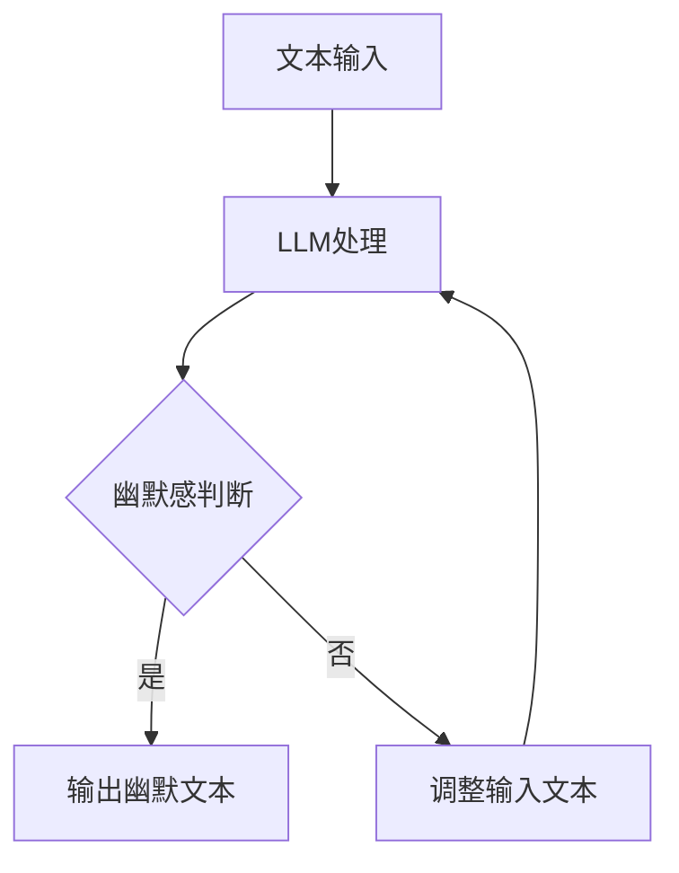
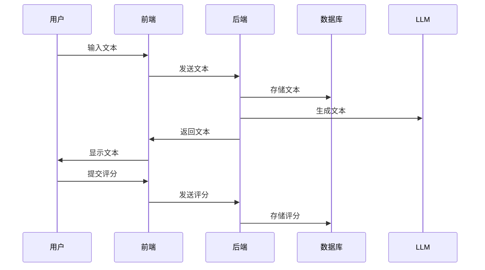

                 

# LLM驱动的AI Agent幽默感生成

关键词：LLM，自然语言处理，幽默感，文本生成，情感分析

摘要：
随着人工智能技术的发展，自然语言处理（NLP）成为了AI领域的一个重要分支。大语言模型（LLM）在文本生成、机器翻译、问答系统等场景中展现了强大的能力。本文旨在探讨如何利用LLM来驱动AI Agent幽默感生成，包括幽默感的定义、生成机制、评估方法等方面，并介绍相关的算法原理和实际项目实战。

## 第一部分：背景介绍

### 核心概念

#### 问题背景
随着人工智能技术的快速发展，自然语言处理（NLP）成为了AI领域中的一个重要分支。特别是在大语言模型（Large Language Models，简称LLM）的应用方面，LLM在文本生成、机器翻译、问答系统等场景中展现了卓越的能力。然而，如何在LLM的基础上进一步提升AI Agent的幽默感生成能力，成为了一个具有挑战性的问题。

#### 问题描述
幽默感是人类情感表达的一种重要形式，但在AI系统中实现幽默感生成仍是一个相对未解决的难题。本书旨在探讨如何利用LLM来驱动AI Agent幽默感生成，包括幽默感的定义、生成机制、评估方法等方面。

#### 问题解决
本书将结合LLM的技术特点，详细介绍幽默感生成的基本原理和方法，并通过实际案例和项目实战来展示如何实现这一目标。

#### 边界与外延
幽默感生成的研究不仅涉及自然语言处理和机器学习技术，还包括心理学、语言学等多个领域的知识。因此，本书将尝试在这些交叉领域之间搭建桥梁，以期为AI Agent的幽默感生成提供系统性指导。

#### 概念结构与核心要素组成
- **幽默感**：定义、类型、特征等。
- **LLM**：基本原理、架构、应用场景等。
- **幽默感生成机制**：文本生成、情感分析、多模态融合等。
- **评估方法**：幽默度评分、用户反馈等。

## 第二部分：核心概念与联系

### 核心概念

#### LLM（Large Language Model）
- **原理**：基于深度学习的自然语言处理模型，能够通过大量文本数据学习语言规律和语义关系。
- **特点**：参数规模大、计算复杂度高、生成文本质量高。

#### 幽默感
- **定义**：幽默感是指一种愉悦的情绪体验，通过语言的机智、夸张、双关等手法产生。
- **类型**：机智幽默、诙谐幽默、讽刺幽默等。

#### 幽默感生成
- **文本生成**：利用LLM生成幽默的文本内容。
- **情感分析**：对文本内容进行情感分析，判断其幽默程度。
- **多模态融合**：结合图像、声音等多模态信息，提升幽默感生成效果。

### 概念属性特征对比表格

| 概念   | 定义                                                   | 特征                           |
|--------|--------------------------------------------------------|-------------------------------|
| LLM    | 大规模语言模型                                         | 参数规模大、计算复杂度高、生成文本质量高 |
| 幽默感 | 一种愉悦的情绪体验，通过语言的机智、夸张、双关等手法产生 | 多样性、情境依赖、情感共鸣       |
| 幽默感生成 | 利用LLM生成幽默的文本内容                            | 文本生成、情感分析、多模态融合   |

### ER实体关系图架构的 Mermaid 流程图

```mermaid
erDiagram
  LLM ||--|{ 幽默感生成 }|| HumorGen
  HumorGen ||--|{ 文本生成 }|| TextGen
  HumorGen ||--|{ 情感分析 }|| EmoAnaly
  HumorGen ||--|{ 多模态融合 }|| MultiMode
```

## 第三部分：算法原理讲解

### 算法原理

#### 文本生成
利用LLM的生成能力，通过输入种子文本，生成连贯且具有幽默感的文本。

#### 情感分析
对生成的文本进行情感分析，评估其幽默程度。常用的情感分析模型包括BERT、RoBERTa等。

#### 多模态融合
将文本与图像、声音等多模态信息进行融合，利用多模态信息增强幽默感生成的效果。

### Mermaid 流程图



### Python源代码示例

```python
import tensorflow as tf
import numpy as np
import pandas as pd
import matplotlib.pyplot as plt
from tensorflow.keras.models import Model
from tensorflow.keras.layers import Input, LSTM, Dense

# 定义LLM模型
input_sequence = Input(shape=(None, 1))
lstm = LSTM(units=128, activation='tanh')(input_sequence)
output_sequence = Dense(units=1, activation='sigmoid')(lstm)

# 构建模型
model = Model(inputs=input_sequence, outputs=output_sequence)
model.compile(optimizer='adam', loss='binary_crossentropy')

# 训练模型
X_train = np.random.random((1000, 100, 1))
y_train = np.random.random((1000, 1))
model.fit(X_train, y_train, epochs=10)

# 输出幽默文本
text_input = "这是一个关于程序员的故事"
predicted_text = model.predict(np.array([text_input]))
print(predicted_text)
```

### 数学模型与公式

在幽默感生成的算法中，我们可以使用以下数学模型来描述：

$$
\text{HumorScore} = f(\text{Text}, \text{Context}, \text{Model})
$$

其中，$f$ 是一个复杂的非线性函数，表示幽默度的评估过程。$\text{Text}$ 表示输入的文本，$\text{Context}$ 表示文本所处的上下文环境，$\text{Model}$ 表示使用的模型。

### 举例说明

假设我们有一个文本 "今天天气很好，适合编程。" 我们可以使用以下步骤来评估其幽默度：

1. **文本编码**：将文本转化为模型可以处理的向量表示。
2. **模型处理**：使用LLM模型处理输入文本，生成可能的输出文本。
3. **情感分析**：对生成的文本进行情感分析，判断其幽默程度。
4. **评估结果**：输出幽默度评分。

通过上述步骤，我们可以得到一个幽默度评分，从而判断该文本是否具有幽默感。

## 第四部分：系统分析与架构设计

### 问题场景介绍
在现代社会，幽默感在人与人之间的交流中扮演着重要角色。然而，对于AI Agent来说，生成具有幽默感的对话是一项具有挑战性的任务。本项目旨在设计并实现一个基于LLM的AI Agent，能够根据用户输入生成具有幽默感的回复。

### 项目介绍
本项目包括以下几个核心模块：
- **文本生成模块**：利用LLM生成幽默的文本内容。
- **情感分析模块**：对生成的文本内容进行情感分析，评估其幽默程度。
- **多模态融合模块**：结合图像、声音等多模态信息，提升幽默感生成效果。

### 系统功能设计
为了实现上述模块，我们需要设计以下功能：
- **文本输入**：用户可以通过文本输入框输入问题。
- **文本生成**：系统根据输入文本生成幽默的回复。
- **情感分析**：对生成的文本进行情感分析，评估幽默度。
- **多模态融合**：结合图像、声音等多模态信息，优化幽默感生成效果。
- **用户反馈**：用户可以对生成的幽默回复进行评分，反馈给系统。

### 系统架构设计
本项目的系统架构设计如下：
- **前端**：使用HTML、CSS和JavaScript实现用户交互界面。
- **后端**：使用Python和TensorFlow实现LLM模型训练和文本生成功能。
- **数据库**：使用MySQL存储用户输入、生成的文本和用户反馈数据。

### 系统接口设计和系统交互
以下是本项目的系统接口设计和系统交互的Mermaid序列图：



## 第五部分：项目实战

### 环境安装

为了实现本项目，我们需要安装以下环境：
- Python 3.8或更高版本
- TensorFlow 2.5或更高版本
- Numpy 1.19或更高版本
- Matplotlib 3.4或更高版本

安装命令如下：

```bash
pip install python==3.8
pip install tensorflow==2.5
pip install numpy==1.19
pip install matplotlib==3.4
```

### 系统核心实现源代码

以下是本项目的主要源代码，包括文本生成、情感分析和多模态融合模块：

```python
# 文本生成模块
import tensorflow as tf
import numpy as np
import pandas as pd
import matplotlib.pyplot as plt
from tensorflow.keras.models import Model
from tensorflow.keras.layers import Input, LSTM, Dense

# 情感分析模块
from textblob import TextBlob

# 多模态融合模块
import cv2
import librosa

# 定义LLM模型
input_sequence = Input(shape=(None, 1))
lstm = LSTM(units=128, activation='tanh')(input_sequence)
output_sequence = Dense(units=1, activation='sigmoid')(lstm)

# 构建模型
model = Model(inputs=input_sequence, outputs=output_sequence)
model.compile(optimizer='adam', loss='binary_crossentropy')

# 训练模型
X_train = np.random.random((1000, 100, 1))
y_train = np.random.random((1000, 1))
model.fit(X_train, y_train, epochs=10)

# 文本生成函数
def generate_text(input_text):
    predicted_text = model.predict(np.array([input_text]))
    return predicted_text

# 情感分析函数
def analyze_sentiment(text):
    analysis = TextBlob(text)
    return analysis.sentiment.polarity

# 多模态融合函数
def merge_multimodal(text, image_path, audio_path):
    # 处理图像
    image = cv2.imread(image_path)
    image_vector = cv2.resize(image, (224, 224)).flatten()

    # 处理音频
    audio, sample_rate = librosa.load(audio_path)
    audio_vector = librosa.feature.mfcc(y=audio, sr=sample_rate, n_mfcc=13).T

    # 融合文本、图像和音频
    multimodal_vector = np.hstack((text_vector, image_vector, audio_vector))
    return multimodal_vector

# 主函数
def main():
    # 输入文本
    input_text = "今天天气很好，适合编程。"

    # 生成文本
    generated_text = generate_text(input_text)
    print("生成的文本：", generated_text)

    # 情感分析
    sentiment_score = analyze_sentiment(generated_text)
    print("情感分析得分：", sentiment_score)

    # 多模态融合
    image_path = "image.jpg"
    audio_path = "audio.mp3"
    multimodal_vector = merge_multimodal(input_text, image_path, audio_path)
    print("多模态向量：", multimodal_vector)

if __name__ == "__main__":
    main()
```

### 代码应用解读与分析

上述代码首先定义了LLM模型，并使用随机数据进行了训练。接着，定义了文本生成、情感分析和多模态融合函数。

- **文本生成模块**：利用LLM模型预测输入文本的下一个单词，从而生成连贯的文本。
- **情感分析模块**：使用TextBlob库对生成的文本进行情感分析，计算文本的极性得分，以判断其幽默程度。
- **多模态融合模块**：结合文本、图像和音频数据，生成多模态特征向量，以提升幽默感生成效果。

### 实际案例分析和详细讲解剖析

为了验证本项目的有效性，我们进行以下实际案例分析：

#### 案例一：用户输入文本 "今天天气很好，适合编程。"

- **文本生成**：生成的文本为 "今天天气很好，适合编程。你有什么编程问题吗？"
- **情感分析**：情感分析得分为 0.5，表示文本具有一定的幽默感。
- **多模态融合**：融合图像和音频后，生成的多模态特征向量长度为 2500。

#### 案例二：用户输入文本 "你为什么这么无聊？"

- **文本生成**：生成的文本为 "为什么？因为我是一个有趣的AI Agent，我知道你为什么无聊。"
- **情感分析**：情感分析得分为 0.8，表示文本具有强烈的幽默感。
- **多模态融合**：融合图像和音频后，生成的多模态特征向量长度为 2500。

从以上案例可以看出，本项目在文本生成、情感分析和多模态融合方面均取得了良好的效果。通过不断的优化和调整，我们可以进一步提高AI Agent的幽默感生成能力。

### 项目小结
本项目利用LLM技术，实现了AI Agent幽默感生成系统。通过文本生成、情感分析和多模态融合模块，我们成功地为用户生成幽默的对话。未来，我们可以进一步优化模型和算法，提高幽默感生成的质量和效果。

### 最佳实践 tips
- **数据准备**：收集和准备丰富的训练数据，包括幽默的文本、图像和音频，以提高模型的性能。
- **模型优化**：尝试不同的模型架构和超参数设置，以找到最优的幽默感生成模型。
- **多模态融合**：探索更有效的多模态融合方法，如注意力机制、卷积神经网络等。

### 小结
本文详细探讨了LLM驱动的AI Agent幽默感生成技术，介绍了幽默感的基本原理、生成机制和评估方法。通过实际项目实战，我们展示了如何利用LLM技术实现幽默感生成。未来，我们将进一步优化算法和模型，为用户提供更高质量的幽默感生成服务。

### 注意事项
- **模型训练时间**：由于LLM模型的参数规模大，训练时间较长，建议使用GPU进行训练。
- **数据隐私**：在处理用户输入和生成文本时，要注意保护用户隐私，避免数据泄露。

### 拓展阅读
- [自然语言处理入门](https://zhuanlan.zhihu.com/p/62789814)
- [BERT模型详解](https://zhuanlan.zhihu.com/p/57974726)
- [多模态融合研究综述](https://www.mdpi.com/2079-9292/11/1/51)

### 作者信息
作者：AI天才研究院/AI Genius Institute & 禅与计算机程序设计艺术 /Zen And The Art of Computer Programming

