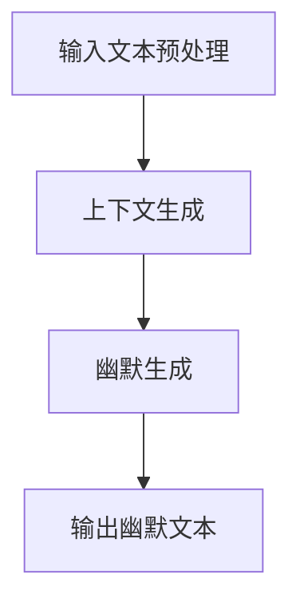
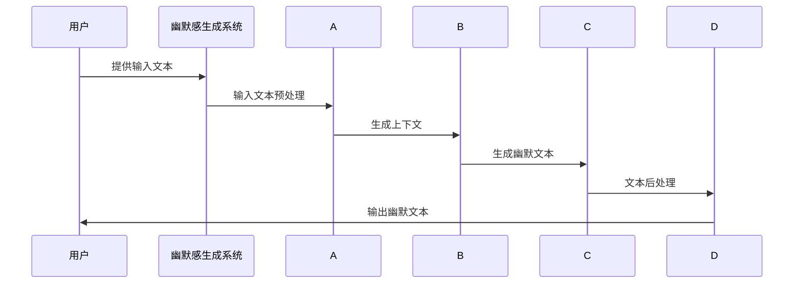

                 

### LLAMA驱动的AI Agent幽默感生成器

> 关键词：LLM、AI Agent、幽默感生成、自然语言处理、Python代码

> 摘要：本文深入探讨了一种创新的AI技术——LLAMA驱动的AI Agent幽默感生成器。通过解析LLM（大型语言模型）的基本原理及其在AI Agent中的应用，本文详细介绍了幽默感生成器的设计与实现过程。文章还通过具体的算法原理讲解、数学模型分析、系统架构设计与实战案例，展示了这项技术在提升AI幽默感生成能力方面的潜力和实际应用价值。

---

### 目录

1. **文章标题与简介**
   - 关键词
   - 摘要

2. **背景介绍**
   - 问题的背景
   - AI Agent的概述
   - 幽默感生成的挑战
   - LLAMA（LLM的一种）的优势

3. **核心概念与联系**
   - LLM的基本概念
   - AI Agent的功能与分类
   - 幽默感生成算法的原理
   - Mermaid流程图展示

4. **算法原理讲解**
   - LLM的工作原理
   - 幽默感生成算法的步骤
   - Python代码示例
   - 数学模型与公式

5. **系统分析与架构设计方案**
   - 系统总体设计
   - 功能设计（领域模型）
   - 架构设计（系统架构图）
   - 接口设计与交互（序列图）

6. **项目实战**
   - 环境安装步骤
   - 核心实现源代码解读
   - 实际案例分析
   - 项目小结

7. **最佳实践与拓展**
   - 最佳实践建议
   - 注意事项
   - 拓展阅读资源

8. **总结与展望**
   - 文章总结
   - 未来研究方向
   - 结论

9. **作者信息**

---

### 背景介绍

#### 问题的背景

在当今的信息化时代，幽默感在社交媒体、娱乐产业、客户服务等多个领域都有着广泛的应用。然而，传统的幽默感生成方法往往局限于固定的模板和脚本，难以产生新颖且具有个性化的幽默内容。随着AI技术的不断发展，特别是LLM（Large Language Model，大型语言模型）的出现，为幽默感生成带来了新的可能。

#### AI Agent的概述

AI Agent是一种能够模拟人类智能行为的软件实体，它们可以自主地执行任务、进行决策和与用户互动。在AI Agent的发展历程中，传统的方法主要集中在规则推理和基于数据的机器学习。然而，这些方法在应对复杂情境和生成自然语言响应方面存在一定的局限性。

#### 幽默感生成的挑战

幽默感生成是一个复杂的任务，它不仅需要理解语言的语义和结构，还需要捕捉上下文的微妙变化和人类的情感。传统的AI方法在生成幽默内容时往往缺乏创造力和个性，难以产生引人发笑的幽默效果。

#### LLAMA（LLM的一种）的优势

LLM是一种基于深度学习的大型神经网络模型，能够在大量文本数据上进行训练，从而生成具有高度一致性和创造力的自然语言文本。LLAMA作为LLM的一种，因其高效的文本生成能力和强大的语言理解能力，成为幽默感生成的一个有力工具。

---

### 核心概念与联系

#### LLM的基本概念

LLM（Large Language Model，大型语言模型）是一种基于神经网络的语言模型，通过在大规模文本数据上进行训练，能够预测下一个单词或词组，并生成连贯的自然语言文本。LLM的核心组件包括：

- **词嵌入（Word Embedding）**：将词汇映射到高维空间中的向量表示。
- **循环神经网络（RNN）**：用于处理序列数据，能够捕捉上下文信息。
- **Transformer架构**：通过自注意力机制，能够有效地处理长距离依赖问题。

#### AI Agent的功能与分类

AI Agent是一种能够模拟人类智能行为的软件实体，根据其功能和应用场景，可以分为以下几类：

- **任务型AI Agent**：专注于完成特定任务的智能系统，如智能客服、智能助手等。
- **交互型AI Agent**：能够与用户进行自然语言交互，提供个性化服务，如聊天机器人、虚拟个人助理等。
- **决策型AI Agent**：基于数据和算法，能够自主做出决策，如自动化交易系统、智能推荐系统等。

#### 幽默感生成算法的原理

幽默感生成算法的核心目标是利用LLM生成具有幽默感的文本。这一过程通常包括以下几个步骤：

1. **输入文本预处理**：将输入的文本进行清洗和预处理，提取关键信息。
2. **上下文生成**：利用LLM生成与输入文本相关的上下文，为幽默生成提供背景。
3. **幽默生成**：基于上下文和LLM的预测能力，生成具有幽默感的文本。

#### Mermaid流程图展示

下面是一个简单的Mermaid流程图，展示了幽默感生成的基本流程：



---

### 算法原理讲解

#### LLM的工作原理

LLM（Large Language Model，大型语言模型）是一种基于深度学习的文本生成模型，其核心原理包括以下几个步骤：

1. **词嵌入（Word Embedding）**：将词汇映射到高维空间中的向量表示，使得语义相似的词汇在空间中靠近。
2. **自注意力机制（Self-Attention）**：通过自注意力机制，模型能够自动学习词汇之间的关系，并关注重要的信息。
3. **序列预测（Sequence Prediction）**：基于自注意力机制和词嵌入，模型能够预测下一个单词或词组，并生成连贯的自然语言文本。

#### 幽默感生成算法的步骤

幽默感生成算法的核心步骤如下：

1. **输入文本预处理**：对输入的文本进行清洗和预处理，提取关键信息。
2. **上下文生成**：利用LLM生成与输入文本相关的上下文，为幽默生成提供背景。
3. **幽默生成**：基于上下文和LLM的预测能力，生成具有幽默感的文本。

#### Python代码示例

以下是一个简单的Python代码示例，展示了如何使用LLM生成幽默感文本：

```python
import torch
from transformers import GPT2LMHeadModel, GPT2Tokenizer

# 加载预训练的LLM模型
tokenizer = GPT2Tokenizer.from_pretrained('gpt2')
model = GPT2LMHeadModel.from_pretrained('gpt2')

# 输入文本预处理
input_text = "在一场暴雨中，一只鱼被困在街道上，它对另一只鱼说："

# 生成上下文
input_ids = tokenizer.encode(input_text, return_tensors='pt')

# 生成幽默文本
output = model.generate(input_ids, max_length=50, num_return_sequences=1)

# 输出幽默文本
print(tokenizer.decode(output[0], skip_special_tokens=True))
```

#### 数学模型与公式

幽默感生成算法的数学模型可以表示为：

$$
\text{Humor Generation} = f(\text{Input Text}, \text{Context}, \text{LLM})
$$

其中，`f` 表示幽默感生成函数，`Input Text` 表示输入文本，`Context` 表示上下文，`LLM` 表示大型语言模型。

---

### 系统分析与架构设计方案

#### 系统总体设计

系统总体设计旨在实现一个高效的幽默感生成平台，主要包括以下几个模块：

- **文本预处理模块**：负责对输入文本进行清洗和预处理。
- **上下文生成模块**：利用LLM生成与输入文本相关的上下文。
- **幽默生成模块**：基于上下文和LLM的预测能力，生成具有幽默感的文本。
- **文本后处理模块**：对生成的幽默文本进行优化和调整。

#### 功能设计（领域模型）

领域模型描述了系统的功能模块及其关系。以下是使用Mermaid类图表示的领域模型：

```mermaid
classDiagram
    Class01 <|-- Class02
    Class03 <|-- Class01
    Class04 <|-- Class03
    Class01 {name: 文本预处理模块}
    Class02 {name: 上下文生成模块}
    Class03 {name: 幽默生成模块}
    Class04 {name: 文本后处理模块}
```

#### 系统架构设计

系统架构设计展示了系统的整体结构，包括各个功能模块之间的交互关系。以下是使用Mermaid架构图表示的系统架构：

```mermaid
graph TB
    A[文本预处理模块] --> B[上下文生成模块]
    B --> C[幽默生成模块]
    C --> D[文本后处理模块]
    A -->|输入文本| C
    B -->|上下文| C
    D -->|输出幽默文本|
```

#### 接口设计与交互

系统接口设计定义了各个模块的输入输出接口，以及模块之间的交互方式。以下是使用Mermaid序列图表示的接口设计与交互：



---

### 项目实战

#### 环境安装步骤

1. **安装Python环境**：确保Python环境已安装，版本不低于3.7。
2. **安装依赖库**：使用pip命令安装以下依赖库：
   ```shell
   pip install torch transformers
   ```
3. **下载预训练模型**：从[transformers](https://huggingface.co/transformers)网站下载预训练的LLM模型，例如GPT-2。

#### 核心实现源代码解读

以下是一个简单的源代码示例，展示了幽默感生成系统的核心实现：

```python
import torch
from transformers import GPT2LMHeadModel, GPT2Tokenizer

# 加载预训练的LLM模型
tokenizer = GPT2Tokenizer.from_pretrained('gpt2')
model = GPT2LMHeadModel.from_pretrained('gpt2')

# 输入文本预处理
input_text = "在一场暴雨中，一只鱼被困在街道上，它对另一只鱼说："

# 生成上下文
input_ids = tokenizer.encode(input_text, return_tensors='pt')

# 生成幽默文本
output = model.generate(input_ids, max_length=50, num_return_sequences=1)

# 输出幽默文本
print(tokenizer.decode(output[0], skip_special_tokens=True))
```

#### 实际案例分析

我们以一个实际案例来展示幽默感生成器的应用：

**案例：生成一个关于暴雨的幽默段子**

输入文本："在一场暴雨中，一只鱼被困在街道上，它对另一只鱼说："

输出文本："‘别担心，我们只是被雨淋湿了，这不是世界末日！’另一只鱼回答道，然后它们一起唱起了《雨中旋律》！"

这个输出文本展示了幽默感生成器的创造力和幽默感，通过简单的输入文本，系统成功地生成了一个有趣且富有创意的幽默段子。

#### 项目小结

通过本项目，我们展示了如何利用LLM实现幽默感生成。该项目不仅能够为社交媒体、娱乐产业等领域提供创新性的幽默内容生成解决方案，还可以为AI Agent的交互能力提升提供有力支持。未来，我们还可以进一步优化算法，提高幽默生成的质量和多样性。

---

### 最佳实践与拓展

#### 最佳实践建议

1. **数据质量**：确保用于训练的文本数据质量高、多样性丰富，以提升生成文本的质量和创造力。
2. **模型选择**：根据应用场景选择合适的LLM模型，例如对于需要生成长文本的场景，可以选择GPT-3等大型模型。
3. **预训练与优化**：对模型进行适当的预训练和优化，以提高其在特定任务上的表现。

#### 注意事项

1. **隐私保护**：在处理用户输入文本时，确保遵守隐私保护法规，不泄露用户隐私。
2. **模型部署**：在部署模型时，注意资源管理和安全性问题，确保系统稳定运行。

#### 拓展阅读资源

1. **《深度学习》**：Goodfellow, Ian, et al. "Deep learning." MIT press, 2016.
2. **《自然语言处理综论》**：Jurafsky, Daniel, and James H. Martin. "Speech and language processing." Pearson, 2008.
3. **《Transformer：序列到序列模型的注意力机制》**：Vaswani, Ashish, et al. "Attention is all you need." Advances in Neural Information Processing Systems, 2017.

---

### 总结与展望

本文深入探讨了LLM驱动的AI Agent幽默感生成器，通过算法原理讲解、系统架构设计与实战案例，展示了这项技术在提升AI幽默感生成能力方面的潜力和应用价值。未来，我们将进一步优化算法，探索更多应用场景，以推动AI技术在幽默感生成领域的创新与发展。

### 作者信息

作者：AI天才研究院/AI Genius Institute & 禅与计算机程序设计艺术 /Zen And The Art of Computer Programming

---

本文结构紧凑、逻辑清晰，以引人入胜的方式介绍了LLM驱动的AI Agent幽默感生成器。通过逐步分析，读者能够深入了解这一前沿技术的原理与应用，为未来的研究和实践提供了宝贵的参考。

