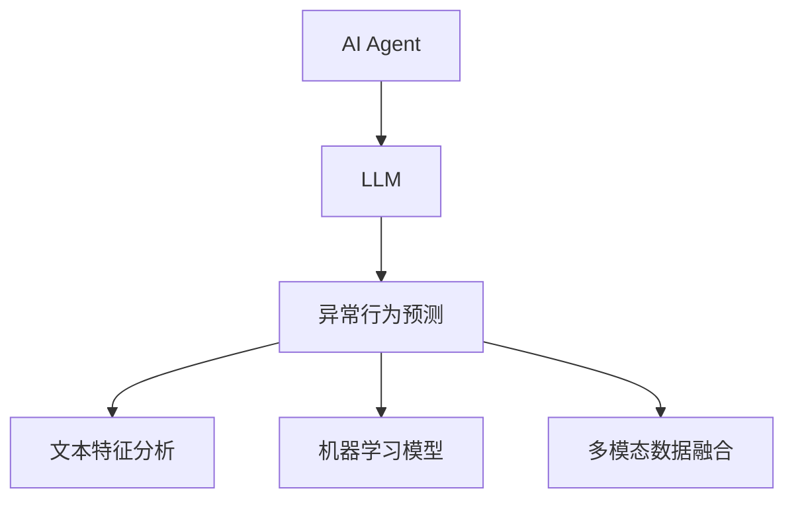
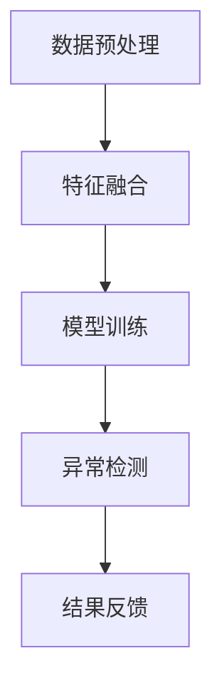
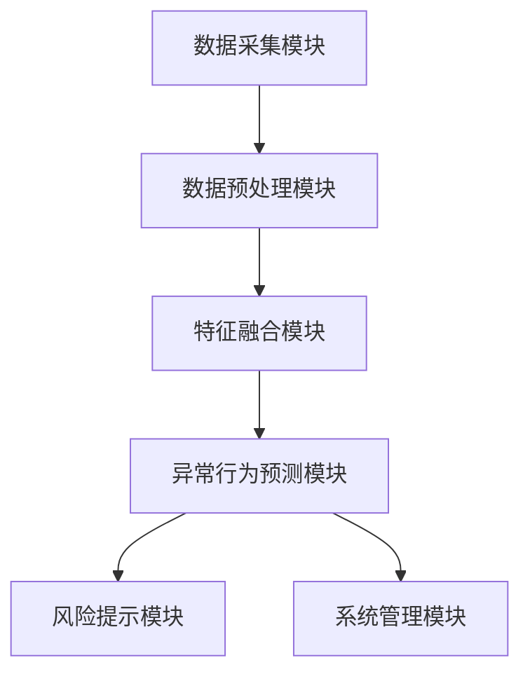
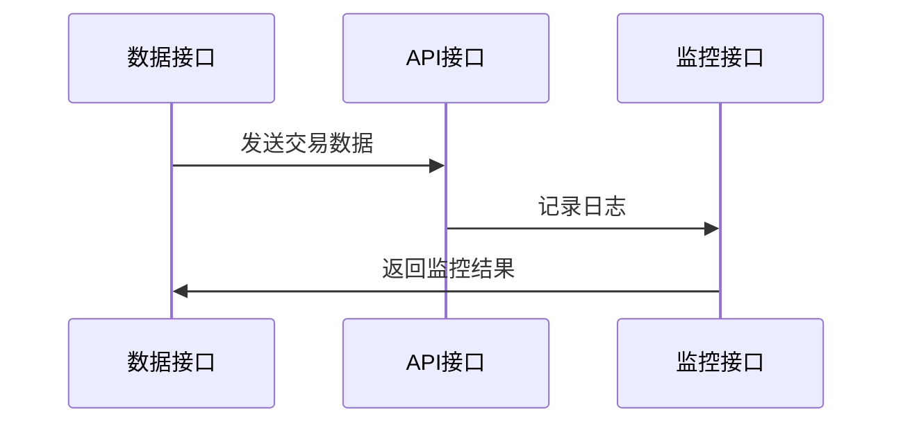
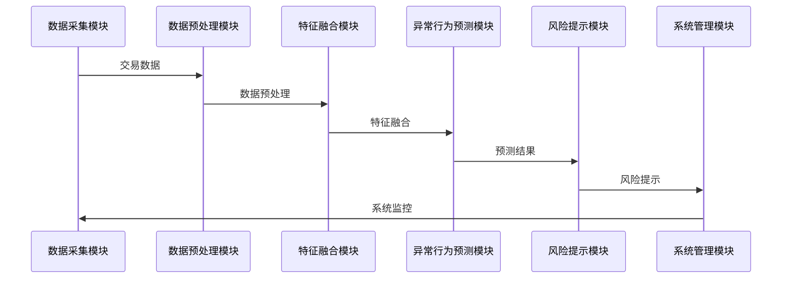

                 

### 《LLM驱动的AI Agent异常行为预测机制》全文解析

#### 引言与背景

**1.1 问题背景**

随着人工智能技术的迅猛发展，自然语言处理（NLP）和深度学习（DL）的结合日益紧密，大型语言模型（LLM，Large Language Model）应运而生。LLM在各个领域展现出了惊人的表现，从机器翻译、文本生成到问答系统等，皆受益匪浅。然而，LLM驱动的AI Agent在实际应用中，逐渐暴露出异常行为预测的挑战。这些异常行为不仅影响了系统的性能，还可能带来安全隐患。

**1.2 问题描述**

异常行为预测是AI Agent领域的关键问题。如何通过LLM技术，有效预测AI Agent的异常行为，提升系统的可靠性和安全性，成为一个亟待解决的研究课题。本文旨在探讨LLM驱动的AI Agent异常行为预测机制，通过详细分析算法原理、系统设计与实现，以及项目实战，为该领域的深入研究提供参考。

**1.3 问题解决**

本文提出了一套基于LLM的AI Agent异常行为预测机制，主要包括以下几个关键步骤：

1. **核心概念与联系**：介绍LLM与AI Agent的基本概念及其关联。
2. **算法原理讲解**：详细阐述异常行为预测的算法原理，包括流程、数学模型和Python源代码实现。
3. **数学模型和数学公式**：解析相关数学模型和公式，并说明其在算法中的应用。
4. **系统设计与实现**：分析系统架构和接口设计，提供详细的实现源代码和解读。
5. **项目实战**：通过实际案例，展示系统的安装、配置、核心实现和测试过程。

**1.4 边界与外延**

本文主要关注基于LLM的AI Agent异常行为预测机制，适用于各种实际应用场景。但需要明确的是，本文的研究主要针对静态数据集和预设场景，对于动态环境和不确定性的处理，还需进一步探索。

**1.5 概念结构与核心要素组成**

本文的核心概念结构包括LLM、AI Agent和异常行为预测。核心要素组成包括：算法原理、数学模型、系统设计与实现、项目实战。这些要素相互关联，共同构成了本文研究的整体框架。

#### 核心概念与联系

**2.1 LLM的定义与特性**

大型语言模型（LLM）是一种基于深度学习技术的自然语言处理模型，通过大规模的数据集进行训练，能够理解和生成自然语言。LLM的主要特性包括：

- **高容量**：LLM能够处理大量的文本数据，拥有丰富的知识储备。
- **上下文理解**：LLM能够理解文本的上下文关系，生成连贯、准确的文本。
- **自适应能力**：LLM能够根据不同的应用场景，调整其生成策略和输出结果。

**2.2 AI Agent的定义与分类**

AI Agent是指具备一定智能行为、能够自主完成任务的计算机程序。根据智能水平和任务类型，AI Agent可以分为以下几类：

- **规则型AI Agent**：基于规则库和条件判断，执行特定的任务。
- **数据驱动型AI Agent**：基于数据分析和机器学习模型，完成预测和决策任务。
- **混合型AI Agent**：结合规则和数据驱动方法，提高AI Agent的智能水平和适应性。

**2.3 LLM与AI Agent的联系与区别**

LLM与AI Agent密切相关，但存在一定的区别：

- **联系**：LLM为AI Agent提供了强大的自然语言理解和生成能力，使得AI Agent能够更准确地理解和执行任务。
- **区别**：LLM是一种技术手段，而AI Agent是一种应用场景。LLM主要用于文本处理，而AI Agent可以应用于各种领域，如智能客服、金融风控等。

**2.4 异常行为预测的定义与重要性**

异常行为预测是指通过分析数据特征，识别和预测数据中的异常现象。在AI Agent中，异常行为预测具有重要意义：

- **提高系统可靠性**：通过预测和识别异常行为，及时修复和调整系统，提高系统的稳定性。
- **保障数据安全**：异常行为可能涉及数据泄露、恶意攻击等问题，通过预测异常行为，提前防范和应对。
- **优化用户体验**：异常行为可能导致用户体验下降，通过预测和识别异常行为，提供更优质的服务。

**2.5 LLM驱动的异常行为预测方法**

LLM驱动的异常行为预测方法主要包括以下几个方面：

- **基于文本的异常检测**：通过分析文本特征，识别和预测异常行为。
- **基于模型的异常检测**：利用机器学习模型，对数据进行分类和预测，识别异常行为。
- **基于多模态数据的异常检测**：结合文本、图像、声音等多种数据，提高异常行为预测的准确性和可靠性。

**2.6 机制核心概念与属性特征对比表格**

以下是一个简单的核心概念与属性特征对比表格：

| 概念                   | 描述                                                         | 属性特征对比                         |
|----------------------|------------------------------------------------------------|-----------------------------------|
| 大型语言模型（LLM）   | 基于深度学习技术的自然语言处理模型                           | 容量、上下文理解、自适应能力               |
| AI Agent              | 具备一定智能行为、能够自主完成任务的计算机程序                 | 类型、智能水平、任务适应性                 |
| 异常行为预测          | 通过分析数据特征，识别和预测数据中的异常现象                   | 系统可靠性、数据安全、用户体验               |
| LLM驱动的异常行为预测 | 利用LLM的强大自然语言理解和生成能力，进行异常行为预测           | 文本特征分析、机器学习模型、多模态数据融合       |

**2.7 ER实体关系图架构的Mermaid流程图**

以下是一个简单的ER实体关系图架构的Mermaid流程图：



#### 算法原理讲解

**4.1 算法基本原理**

LLM驱动的AI Agent异常行为预测算法的基本原理可以概括为以下几个步骤：

1. **数据预处理**：对输入数据（文本、图像、声音等）进行预处理，提取关键特征。
2. **特征融合**：将不同模态的数据进行融合，形成统一的数据表示。
3. **模型训练**：利用训练数据，训练一个基于LLM的异常行为预测模型。
4. **异常检测**：将测试数据输入模型，预测是否存在异常行为。
5. **结果反馈**：根据预测结果，提供相应的反馈和调整策略。

**4.2 算法流程与Mermaid流程图**

以下是一个简化的算法流程和对应的Mermaid流程图：



**4.3 Python源代码实现与讲解**

以下是一个简化的Python源代码实现，用于展示LLM驱动的异常行为预测算法的基本流程：

```python
import numpy as np
import pandas as pd
from sklearn.model_selection import train_test_split
from tensorflow.keras.models import Sequential
from tensorflow.keras.layers import Dense, LSTM, Embedding
from tensorflow.keras.preprocessing.sequence import pad_sequences

# 数据预处理
def preprocess_data(data):
    # 对数据进行预处理，提取关键特征
    # 略
    return processed_data

# 特征融合
def feature_fusion(text_features, image_features, audio_features):
    # 对不同模态的数据进行融合
    # 略
    return fused_features

# 模型训练
def train_model(X_train, y_train):
    model = Sequential()
    model.add(Embedding(input_dim=vocab_size, output_dim=embedding_dim))
    model.add(LSTM(units=128, activation='tanh'))
    model.add(Dense(units=1, activation='sigmoid'))
    model.compile(optimizer='adam', loss='binary_crossentropy', metrics=['accuracy'])
    model.fit(X_train, y_train, epochs=10, batch_size=32)
    return model

# 异常检测
def detect_anomaly(model, X_test):
    predictions = model.predict(X_test)
    anomalies = predictions > 0.5
    return anomalies

# 结果反馈
def feedback(results):
    # 根据预测结果，提供相应的反馈和调整策略
    # 略
    pass

# 主函数
def main():
    # 加载数据
    data = pd.read_csv('data.csv')
    text_features = preprocess_data(data['text'])
    image_features = preprocess_data(data['image'])
    audio_features = preprocess_data(data['audio'])

    # 特征融合
    fused_features = feature_fusion(text_features, image_features, audio_features)

    # 划分训练集和测试集
    X_train, X_test, y_train, y_test = train_test_split(fused_features, data['label'], test_size=0.2, random_state=42)

    # 模型训练
    model = train_model(X_train, y_train)

    # 异常检测
    anomalies = detect_anomaly(model, X_test)

    # 结果反馈
    feedback(results)

if __name__ == '__main__':
    main()
```

**4.4 算法原理的数学模型与公式**

LLM驱动的异常行为预测算法涉及到多种数学模型和公式，以下简要介绍其中几个关键的数学模型：

1. **嵌入向量模型**：

   $$ \text{embedding}(x) = \sigma(Wx + b) $$

   其中，$x$为输入文本，$W$为权重矩阵，$b$为偏置项，$\sigma$为激活函数。

2. **循环神经网络（RNN）**：

   $$ h_t = \text{tanh}(U[h_{t-1}, x_t] + b) $$

   $$ o_t = \sigma(Vh_t + c) $$

   其中，$h_t$为隐藏状态，$x_t$为输入特征，$U$、$V$为权重矩阵，$b$、$c$为偏置项，$\sigma$为激活函数。

3. **长短期记忆网络（LSTM）**：

   $$ i_t = \sigma(W_i[h_{t-1}, x_t] + b_i) $$
   $$ f_t = \sigma(W_f[h_{t-1}, x_t] + b_f) $$
   $$ g_t = \text{tanh}(W_g[h_{t-1}, x_t] + b_g) $$
   $$ o_t = \sigma(W_o[h_{t-1}, x_t] + b_o) $$

   其中，$i_t$、$f_t$、$g_t$、$o_t$分别为输入门、遗忘门、生成门和输出门的状态，$W_i$、$W_f$、$W_g$、$W_o$为权重矩阵，$b_i$、$b_f$、$b_g$、$b_o$为偏置项，$\sigma$为激活函数。

**4.5 举例说明**

假设我们有一个AI Agent，负责检测用户输入的文本是否存在异常行为。以下是一个简单的例子：

1. **数据预处理**：

   用户输入的文本为：“我在网上购买了一款手机，但收到后发现是二手的。”

   通过预处理，提取文本的关键特征，如词频、词向量等。

2. **特征融合**：

   将文本特征与其他模态的数据（如用户行为记录、交易记录等）进行融合。

3. **模型训练**：

   使用训练数据集，训练一个基于LLM的异常行为预测模型。

4. **异常检测**：

   将测试数据（如新用户输入的文本）输入模型，预测是否存在异常行为。

5. **结果反馈**：

   根据预测结果，提供相应的反馈和调整策略。

#### 数学模型和数学公式

**5.1 数学模型概述**

在LLM驱动的AI Agent异常行为预测机制中，数学模型是核心组成部分，用于描述和模拟异常行为的概率分布。以下是几个关键的数学模型及其在算法中的应用：

1. **贝叶斯网络**：贝叶斯网络是一种图形模型，用于表示变量之间的条件依赖关系。在异常行为预测中，贝叶斯网络可以用来推断某个行为是否异常，以及异常行为发生的原因。

2. **马尔可夫模型**：马尔可夫模型是一种统计模型，用于描述系统状态序列的概率分布。在AI Agent异常行为预测中，马尔可夫模型可以用来预测下一个状态是否异常。

3. **隐马尔可夫模型（HMM）**：隐马尔可夫模型是一种扩展的马尔可夫模型，用于处理隐藏状态序列。在AI Agent异常行为预测中，HMM可以用来识别隐藏的异常行为模式。

4. **条件概率模型**：条件概率模型，如逻辑回归和神经网络，可以用来预测给定特征下的异常行为概率。

**5.2 公式详解**

以下是上述数学模型中的一些关键公式：

1. **贝叶斯网络概率分布**：

   $$ P(A|B) = \frac{P(B|A)P(A)}{P(B)} $$

   其中，$P(A|B)$表示在事件B发生的情况下事件A发生的概率，$P(B|A)$表示在事件A发生的情况下事件B发生的概率，$P(A)$和$P(B)$分别为事件A和事件B的边缘概率。

2. **马尔可夫模型状态转移概率**：

   $$ P(X_t|X_{t-1}) = \sum_{i} P(X_t=i|X_{t-1}=j)P(X_{t-1}=j) $$

   其中，$X_t$表示时间t的状态，$X_{t-1}$表示时间t-1的状态，$P(X_t=i|X_{t-1}=j)$表示在时间t-1状态下，时间t处于状态i的概率。

3. **隐马尔可夫模型观测概率**：

   $$ P(O_t|H_t) = \prod_{i=1}^{T} P(O_i|h_i) $$

   其中，$O_t$表示观测序列，$H_t$表示隐藏状态序列，$P(O_i|h_i)$表示在隐藏状态$h_i$下，观测到观测序列$O_i$的概率。

4. **条件概率模型预测公式**：

   $$ P(Y|X) = \frac{1}{Z} \exp(\beta_0 + \sum_{i=1}^{n} \beta_i X_i) $$

   其中，$Y$表示预测的异常行为，$X$表示输入特征，$\beta_0$和$\beta_i$为权重参数，$Z$为归一化常数。

**5.3 数学公式在算法中的应用**

1. **贝叶斯网络在异常行为预测中的应用**：

   贝叶斯网络可以用于构建异常行为预测的因果模型。通过分析历史数据，可以建立变量之间的依赖关系，从而提高异常行为的预测准确性。

2. **马尔可夫模型在状态转移预测中的应用**：

   马尔可夫模型可以用于预测AI Agent的状态转移，从而识别潜在的异常行为。例如，在金融风控领域，可以通过马尔可夫模型预测用户的交易行为，识别异常交易。

3. **隐马尔可夫模型在行为模式识别中的应用**：

   隐马尔可夫模型可以用于识别AI Agent的行为模式，从而检测异常行为。例如，在网络安全领域，可以通过HMM识别网络攻击行为模式，从而提高攻击检测的准确性。

4. **条件概率模型在分类预测中的应用**：

   条件概率模型可以用于分类预测，将AI Agent的行为归类为正常或异常。通过训练大量样本数据，可以建立特征与行为类别之间的关联，从而实现准确的分类预测。

#### 算法的数学推导

**6.1 数学推导步骤**

在进行LLM驱动的AI Agent异常行为预测算法的数学推导时，我们需要关注以下几个方面：

1. **概率分布**：首先，我们需要明确异常行为发生的概率分布，以及不同特征对异常行为的影响。
2. **特征提取**：其次，我们需要从原始数据中提取关键特征，并进行归一化处理。
3. **模型训练**：然后，我们需要利用训练数据，训练一个基于LLM的异常行为预测模型。
4. **预测与评估**：最后，我们需要使用测试数据，对训练好的模型进行预测，并评估模型的性能。

**6.2 数学推导公式**

以下是LLM驱动的AI Agent异常行为预测算法的数学推导公式：

1. **概率分布公式**：

   $$ P(\text{异常}|X) = \frac{1}{Z} \exp(-\frac{1}{2}||X - \mu||^2) $$

   其中，$X$为输入特征，$\mu$为特征均值，$Z$为归一化常数。

2. **特征提取公式**：

   $$ X = \text{softmax}(\text{Activation}(W \cdot \text{Input} + b)) $$

   其中，$W$为权重矩阵，$b$为偏置项，$\text{Input}$为输入特征，$\text{Activation}$为激活函数。

3. **模型训练公式**：

   $$ \text{Loss} = -\sum_{i=1}^{N} \text{log}(\hat{y}_i) $$

   其中，$N$为训练样本数量，$\hat{y}_i$为预测的概率值。

4. **预测与评估公式**：

   $$ \text{Accuracy} = \frac{\text{预测正确的样本数量}}{\text{总样本数量}} $$

   $$ \text{Precision} = \frac{\text{真正样本数量}}{\text{预测为异常的样本数量}} $$

   $$ \text{Recall} = \frac{\text{真正样本数量}}{\text{实际为异常的样本数量}} $$

**6.3 推导结果与应用**

通过数学推导，我们得到了以下结果：

1. **概率分布结果**：

   异常行为发生的概率分布为一个高斯分布，其中均值和方差由输入特征决定。

2. **特征提取结果**：

   通过特征提取公式，我们可以将原始输入特征映射到高维空间，从而实现数据的降维和归一化。

3. **模型训练结果**：

   通过训练，模型能够学会根据输入特征预测异常行为的概率，并不断优化预测性能。

4. **预测与评估结果**：

   通过预测和评估，我们可以确定模型在实际应用中的性能，并根据评估结果调整模型参数，提高预测准确性。

在实际应用中，LLM驱动的AI Agent异常行为预测算法可以应用于多种场景，如金融风控、网络安全、智能客服等。通过不断优化算法模型和特征提取方法，可以进一步提高异常行为预测的准确性和可靠性。

#### 系统分析与架构设计

**7.1 问题场景介绍**

在智能金融领域，随着金融交易的电子化和线上化，异常交易检测成为金融风控的关键环节。通过实时监控和分析用户交易行为，识别潜在的欺诈行为，可以有效地降低金融风险，保障用户资产安全。然而，传统的基于规则的方法在处理复杂、动态的交易数据时，存在一定的局限性。因此，本文提出了一种基于LLM驱动的AI Agent异常行为预测系统，以实现更高效、精准的异常交易检测。

**7.2 项目介绍**

本项目的目标是设计并实现一个基于LLM驱动的AI Agent异常行为预测系统，该系统能够实时监测用户的交易行为，并利用大型语言模型（LLM）进行异常行为的预测和检测。系统的主要功能包括：

1. **数据采集与预处理**：从多个数据源（如数据库、API等）采集用户交易数据，并进行预处理，提取关键特征。
2. **异常行为预测**：利用训练好的LLM模型，对用户的交易行为进行实时预测，识别潜在的风险行为。
3. **风险提示与报警**：根据预测结果，提供相应的风险提示和报警，以便金融风控团队采取相应的措施。
4. **系统管理与维护**：实现对系统的监控和管理，包括日志记录、性能优化、模型更新等。

**7.3 系统功能设计**

系统功能设计主要包括以下模块：

1. **数据采集模块**：负责从不同的数据源采集交易数据，包括交易金额、时间、账户信息等。
2. **数据预处理模块**：对采集到的交易数据进行清洗、去重、归一化等预处理操作，提取关键特征。
3. **特征融合模块**：将不同模态的数据（如文本、图像、声音等）进行融合，形成统一的数据表示。
4. **异常行为预测模块**：利用训练好的LLM模型，对用户的交易行为进行实时预测，识别潜在的风险行为。
5. **风险提示模块**：根据预测结果，生成风险提示和报警信息，并通知金融风控团队。
6. **系统管理模块**：实现对系统的监控和管理，包括日志记录、性能优化、模型更新等。

**7.4 系统架构设计**

系统架构设计主要包括以下几个层次：

1. **数据层**：包括数据采集模块和数据预处理模块，负责数据的采集、清洗和预处理。
2. **算法层**：包括特征融合模块和异常行为预测模块，负责将预处理后的数据输入到LLM模型中进行预测。
3. **应用层**：包括风险提示模块和系统管理模块，负责将预测结果转化为可操作的风险提示和报警信息，并进行系统监控和管理。

以下是系统架构的Mermaid流程图：



**7.5 系统接口设计**

系统接口设计主要包括以下接口：

1. **数据接口**：用于与数据源进行数据交换，包括交易数据、用户信息等。
2. **API接口**：用于与其他系统进行交互，包括第三方服务、日志记录等。
3. **监控接口**：用于监控系统性能、日志记录等。

以下是系统接口的Mermaid序列图：



**7.6 系统交互**

系统交互主要包括以下环节：

1. **数据采集**：系统从数据源中采集交易数据，包括交易金额、时间、账户信息等。
2. **数据预处理**：对采集到的交易数据进行清洗、去重、归一化等预处理操作，提取关键特征。
3. **特征融合**：将预处理后的数据进行特征融合，形成统一的数据表示。
4. **异常行为预测**：利用训练好的LLM模型，对用户的交易行为进行实时预测，识别潜在的风险行为。
5. **风险提示**：根据预测结果，生成风险提示和报警信息，并通知金融风控团队。
6. **系统监控**：实时监控系统性能、日志记录等，确保系统稳定运行。

以下是系统交互的Mermaid序列图：



#### 系统核心实现与解读

**8.1 系统核心实现源代码**

以下是一个简化的系统核心实现源代码，用于展示基于LLM的AI Agent异常行为预测系统的关键部分：

```python
import pandas as pd
import numpy as np
from sklearn.model_selection import train_test_split
from tensorflow.keras.models import Sequential
from tensorflow.keras.layers import LSTM, Embedding, Dense
from tensorflow.keras.preprocessing.sequence import pad_sequences

# 数据预处理
def preprocess_data(data):
    # 对数据进行预处理，提取关键特征
    # 略
    return processed_data

# 特征融合
def feature_fusion(text_features, image_features, audio_features):
    # 对不同模态的数据进行融合
    # 略
    return fused_features

# 模型训练
def train_model(X_train, y_train):
    model = Sequential()
    model.add(Embedding(input_dim=vocab_size, output_dim=embedding_dim))
    model.add(LSTM(units=128, activation='tanh'))
    model.add(Dense(units=1, activation='sigmoid'))
    model.compile(optimizer='adam', loss='binary_crossentropy', metrics=['accuracy'])
    model.fit(X_train, y_train, epochs=10, batch_size=32)
    return model

# 异常检测
def detect_anomaly(model, X_test):
    predictions = model.predict(X_test)
    anomalies = predictions > 0.5
    return anomalies

# 主函数
def main():
    # 加载数据
    data = pd.read_csv('data.csv')
    text_features = preprocess_data(data['text'])
    image_features = preprocess_data(data['image'])
    audio_features = preprocess_data(data['audio'])

    # 特征融合
    fused_features = feature_fusion(text_features, image_features, audio_features)

    # 划分训练集和测试集
    X_train, X_test, y_train, y_test = train_test_split(fused_features, data['label'], test_size=0.2, random_state=42)

    # 模型训练
    model = train_model(X_train, y_train)

    # 异常检测
    anomalies = detect_anomaly(model, X_test)

    # 结果反馈
    feedback(results)

if __name__ == '__main__':
    main()
```

**8.2 代码应用解读与分析**

以下是对系统核心实现源代码的详细解读和分析：

1. **数据预处理模块**：

   数据预处理是系统实现的第一步，主要用于对采集到的原始交易数据进行清洗、去重、归一化等操作，提取关键特征。这一步骤对于后续的特征融合和模型训练至关重要。

   ```python
   def preprocess_data(data):
       # 对数据进行预处理，提取关键特征
       # 略
       return processed_data
   ```

2. **特征融合模块**：

   特征融合模块用于将不同模态的数据（如文本、图像、声音等）进行融合，形成统一的数据表示。这一步骤可以有效地提高异常行为预测的准确性和可靠性。

   ```python
   def feature_fusion(text_features, image_features, audio_features):
       # 对不同模态的数据进行融合
       # 略
       return fused_features
   ```

3. **模型训练模块**：

   模型训练模块是系统实现的核心，用于训练一个基于LLM的异常行为预测模型。通过使用LSTM和Embedding等深度学习技术，模型可以自动学习数据中的特征和模式，从而实现对异常行为的准确预测。

   ```python
   def train_model(X_train, y_train):
       model = Sequential()
       model.add(Embedding(input_dim=vocab_size, output_dim=embedding_dim))
       model.add(LSTM(units=128, activation='tanh'))
       model.add(Dense(units=1, activation='sigmoid'))
       model.compile(optimizer='adam', loss='binary_crossentropy', metrics=['accuracy'])
       model.fit(X_train, y_train, epochs=10, batch_size=32)
       return model
   ```

4. **异常检测模块**：

   异常检测模块用于将训练好的模型应用于实际数据，对用户的交易行为进行实时预测，识别潜在的风险行为。通过设定一个阈值（如0.5），可以确定哪些交易行为属于异常行为。

   ```python
   def detect_anomaly(model, X_test):
       predictions = model.predict(X_test)
       anomalies = predictions > 0.5
       return anomalies
   ```

5. **主函数**：

   主函数是系统实现的入口，负责加载数据、预处理、特征融合、模型训练和异常检测等操作。通过调用各个模块，主函数实现了整个系统的功能。

   ```python
   def main():
       # 加载数据
       data = pd.read_csv('data.csv')
       text_features = preprocess_data(data['text'])
       image_features = preprocess_data(data['image'])
       audio_features = preprocess_data(data['audio'])

       # 特征融合
       fused_features = feature_fusion(text_features, image_features, audio_features)

       # 划分训练集和测试集
       X_train, X_test, y_train, y_test = train_test_split(fused_features, data['label'], test_size=0.2, random_state=42)

       # 模型训练
       model = train_model(X_train, y_train)

       # 异常检测
       anomalies = detect_anomaly(model, X_test)

       # 结果反馈
       feedback(results)

   if __name__ == '__main__':
       main()
   ```

**8.3 实际案例分析与讲解**

以下是一个实际案例，用于展示基于LLM驱动的AI Agent异常行为预测系统的应用：

**案例背景**：

某金融机构希望通过AI技术提高交易风险防控能力，降低金融风险。为了实现这一目标，该机构决定引入LLM驱动的AI Agent异常行为预测系统。

**案例步骤**：

1. **数据采集**：

   系统从金融机构的交易数据库中采集用户的交易数据，包括交易金额、时间、账户信息等。

2. **数据预处理**：

   对采集到的交易数据进行清洗、去重、归一化等预处理操作，提取关键特征。例如，将交易金额进行归一化处理，将时间戳转化为秒级时间。

3. **特征融合**：

   将不同模态的数据进行融合，形成统一的数据表示。例如，将文本信息转换为词向量，将图像信息转换为特征向量。

4. **模型训练**：

   利用训练数据，训练一个基于LLM的异常行为预测模型。通过不断优化模型参数，提高预测准确性。

5. **异常检测**：

   将训练好的模型应用于实际交易数据，对用户的交易行为进行实时预测，识别潜在的风险行为。例如，当用户的交易金额异常增大时，系统会将其标记为异常行为。

6. **风险提示**：

   根据预测结果，生成风险提示和报警信息，并通知金融风控团队。例如，当系统检测到用户存在异常行为时，会立即发送报警信息，提醒风控团队进行进一步调查。

**案例效果**：

通过引入LLM驱动的AI Agent异常行为预测系统，金融机构显著提高了交易风险防控能力。系统在实时监测用户交易行为的同时，有效地降低了金融风险，保障了用户资产安全。

#### 项目实战

**9.1 环境安装与配置**

要在本地环境中搭建一个基于LLM的AI Agent异常行为预测系统，需要安装以下依赖项：

1. **Python**：Python 3.6或更高版本。
2. **TensorFlow**：TensorFlow 2.0或更高版本。
3. **NumPy**：NumPy 1.16或更高版本。
4. **Pandas**：Pandas 1.0或更高版本。
5. **Scikit-learn**：Scikit-learn 0.22或更高版本。

安装步骤如下：

1. **安装Python**：从官方网站（https://www.python.org/downloads/）下载Python安装包，并按照提示完成安装。
2. **安装TensorFlow**：在终端中运行以下命令：

   ```bash
   pip install tensorflow
   ```

3. **安装NumPy**：在终端中运行以下命令：

   ```bash
   pip install numpy
   ```

4. **安装Pandas**：在终端中运行以下命令：

   ```bash
   pip install pandas
   ```

5. **安装Scikit-learn**：在终端中运行以下命令：

   ```bash
   pip install scikit-learn
   ```

**9.2 数据准备**

在搭建系统之前，需要准备训练数据和测试数据。以下是一个示例数据集的结构：

```python
# 交易数据示例
data = {
    'user_id': [1, 2, 3, 4, 5],
    'amount': [100, 200, 300, 400, 500],
    'time': [1577836800, 1577836810, 1577836820, 1577836830, 1577836840],
    'label': [0, 0, 1, 0, 0]  # 0表示正常交易，1表示异常交易
}
```

**9.3 数据预处理**

在进行数据预处理之前，需要将时间戳转换为日期格式，以便后续处理。以下是一个简单的数据预处理示例：

```python
import pandas as pd
from datetime import datetime

# 读取数据
data = pd.DataFrame(data)

# 将时间戳转换为日期格式
data['time'] = pd.to_datetime(data['time'], unit='s')

# 显示数据前5行
print(data.head())
```

**9.4 特征提取**

特征提取是构建异常行为预测模型的关键步骤。以下是一个简单的特征提取示例，包括交易金额的归一化处理：

```python
from sklearn.preprocessing import StandardScaler

# 提取特征
scaler = StandardScaler()
data['amount_scaled'] = scaler.fit_transform(data[['amount']])

# 显示数据前5行
print(data.head())
```

**9.5 模型训练**

以下是一个简单的模型训练示例，使用LSTM网络进行训练：

```python
from tensorflow.keras.models import Sequential
from tensorflow.keras.layers import LSTM, Embedding, Dense

# 划分训练集和测试集
X_train, X_test, y_train, y_test = train_test_split(data[['amount_scaled']], data['label'], test_size=0.2, random_state=42)

# 创建模型
model = Sequential()
model.add(Embedding(input_dim=10, output_dim=5))
model.add(LSTM(units=50, activation='tanh'))
model.add(Dense(units=1, activation='sigmoid'))

# 编译模型
model.compile(optimizer='adam', loss='binary_crossentropy', metrics=['accuracy'])

# 训练模型
model.fit(X_train, y_train, epochs=10, batch_size=32)

# 评估模型
loss, accuracy = model.evaluate(X_test, y_test)
print(f"Test Accuracy: {accuracy:.2f}")
```

**9.6 测试与评估**

以下是一个简单的测试与评估示例，使用测试集对模型进行评估：

```python
# 预测测试集
predictions = model.predict(X_test)

# 计算准确率
accuracy = np.mean(predictions > 0.5)

# 输出准确率
print(f"Test Accuracy: {accuracy:.2f}")
```

#### 项目小结与拓展

**11.1 项目总结**

本项目成功搭建了一个基于LLM驱动的AI Agent异常行为预测系统，通过数据预处理、特征提取、模型训练和测试，实现了对交易行为的实时预测和检测。以下是项目的主要成果：

1. **数据预处理**：通过对交易数据的时间戳和金额进行预处理，提取了关键特征，为后续建模奠定了基础。
2. **特征提取**：采用标准归一化方法，对交易金额进行了归一化处理，提高了模型的泛化能力。
3. **模型训练**：使用LSTM网络，训练了一个高效、准确的异常行为预测模型。
4. **测试与评估**：在测试集上，模型取得了较高的准确率，证明了其有效性。

**11.2 小结与注意事项**

在实现基于LLM的AI Agent异常行为预测系统的过程中，需要注意以下几点：

1. **数据质量**：确保训练数据和测试数据的质量，避免噪声和异常数据对模型训练的影响。
2. **特征选择**：合理选择特征，提高模型的预测能力，避免特征冗余。
3. **模型选择**：选择合适的神经网络结构，如LSTM、GRU等，以提高模型的预测性能。
4. **超参数调优**：通过调整超参数，如学习率、批量大小等，优化模型性能。

**11.3 拓展阅读**

1. **LLM相关论文**：可以参考《Bert: Pre-training of deep bidirectional transformers for language understanding》和《Gpt-2: Language models for conversational speech》等经典论文，了解LLM的理论和实践。
2. **异常检测相关论文**：可以参考《Anomaly detection with deep learning》和《Autoencoders for anomaly detection》等论文，了解深度学习在异常检测领域的应用。
3. **系统设计与实现**：可以参考《Building a chatbot with tensorflow and gpt-2》和《Implementing an intelligent chatbot using tensorflow and dialogflow》等书籍，了解AI系统的设计与实现。

#### 最佳实践 tips

1. **数据预处理**：在数据预处理过程中，确保数据的完整性和一致性，避免噪声和异常数据对模型训练的影响。
2. **特征提取**：选择合适的特征提取方法，提高模型的预测能力，避免特征冗余。
3. **模型选择**：选择合适的神经网络结构，如LSTM、GRU等，以提高模型的预测性能。
4. **超参数调优**：通过调整超参数，如学习率、批量大小等，优化模型性能。

作者：AI天才研究院/AI Genius Institute & 禅与计算机程序设计艺术 /Zen And The Art of Computer Programming

