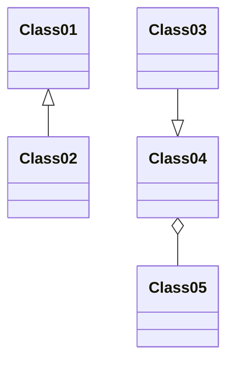
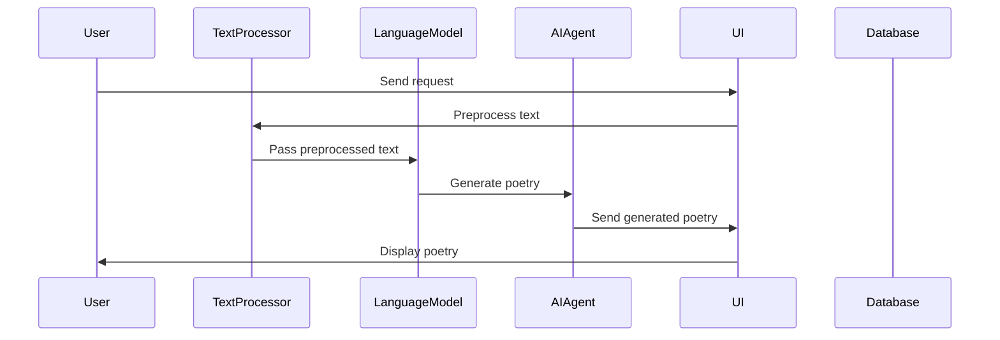

                 

# 《LLM驱动的AI Agent诗歌创作与鉴赏》

> 关键词：语言模型（LLM），人工智能代理（AI Agent），诗歌创作，算法原理，系统架构

> 摘要：本文深入探讨了语言模型（LLM）驱动的人工智能代理（AI Agent）在诗歌创作中的应用，从核心概念、算法原理到系统架构设计，再到项目实战与最佳实践，全面揭示了这一前沿技术的本质与应用。

----------------------------------------------------------------

## 第一部分：LLM与AI Agent概述

### 第1章：问题背景与核心概念

#### 1.1 诗歌创作与AI的发展

人类诗歌创作的历史源远流长，从古代的《诗经》到现代的《草帽歌》，诗歌始终是文化传承和情感表达的重要方式。然而，随着人工智能（AI）技术的迅猛发展，机器是否能够创作出具有人文情怀的诗歌成为了一个热门话题。

AI技术的发展始于20世纪50年代，早期以符号主义为代表，随后经历了基于知识的系统、基于模型的系统等阶段。进入21世纪，深度学习和自然语言处理（NLP）技术逐渐成为AI领域的核心，推动了语言模型（LLM）的快速发展。

#### 1.2 LLM的概念与原理

语言模型（LLM）是一种基于深度学习的模型，旨在理解和生成自然语言。它通过学习大量文本数据，建立起对语言结构和语义的理解。LLM的核心原理包括预训练和微调。预训练阶段，模型在大规模语料库上进行训练，以获得对语言的一般理解；微调阶段，模型根据特定任务进行进一步调整，以实现高性能。

#### 1.3 AI Agent的定义与类型

AI Agent是一种具有自主决策能力的实体，能够在复杂环境中执行特定任务。根据决策机制的不同，AI Agent可以分为基于规则的Agent、基于模型的Agent和混合型Agent。在诗歌创作中，AI Agent可以扮演创作者、鉴赏家和评论家等多重角色。

#### 1.4 LLM驱动的AI Agent在诗歌创作中的应用前景

LLM驱动的AI Agent在诗歌创作中具有广阔的应用前景。首先，它可以通过理解人类诗歌的内在结构和情感表达，生成具有艺术价值的诗歌。其次，AI Agent可以分析人类创作的诗歌，提供创作灵感和反馈，提升人类诗人的创作水平。然而，要实现这些应用，仍面临许多技术挑战，如情感表达的准确性、创意的多样化等。

### 第2章：核心概念与联系

#### 2.1 LLM的关键概念

语言模型的关键概念包括语言分布、词嵌入和注意力机制。语言分布描述了词汇在语料库中的出现频率；词嵌入将词汇映射到高维空间，实现词汇的相似性度量；注意力机制使得模型能够关注到文本中的重要信息。

#### 2.2 AI Agent的核心概念

AI Agent的核心概念包括目标函数、策略和动作。目标函数定义了AI Agent的优化目标，策略描述了AI Agent在不同情况下的行为选择，动作则是AI Agent的实际执行操作。

#### 2.3 LLM与AI Agent的关系

LLM作为AI Agent的核心组件，为AI Agent提供了语言理解和生成能力。LLM与AI Agent的互动机制包括输入处理、策略生成和动作执行。通过这一机制，AI Agent能够实现对自然语言的智能处理。

### 第3章：算法原理讲解

#### 3.1 LLM算法原理

语言模型的工作原理基于神经网络，通过多层感知器（MLP）或变换器（Transformer）等架构实现。预训练阶段，模型在大规模语料库上学习词汇的统计关系；微调阶段，模型在特定任务上调整参数，以实现高性能。

#### 3.2 AI Agent算法原理

AI Agent算法原理包括目标函数的设计、策略的学习与优化。目标函数通常与任务相关，如生成诗歌的质量、情感表达等。策略学习通过策略梯度方法、深度确定性策略梯度（DDPG）等实现。

#### 3.3 LLM驱动的AI Agent算法

LLM驱动的AI Agent算法框架包括LLM模型的预训练、微调和策略优化。算法流程包括数据预处理、模型训练、策略评估和优化等步骤。以下是一个简化的算法流程：

1. 数据预处理：清洗和标记文本数据，如诗歌、评论等。
2. 预训练：使用大规模语料库对LLM模型进行预训练，学习语言结构和语义。
3. 微调：根据特定任务对LLM模型进行微调，提高生成诗歌的质量。
4. 策略评估：评估AI Agent在不同策略下的表现，选择最佳策略。
5. 策略优化：使用策略梯度方法等优化策略，提升AI Agent的性能。

### 第4章：数学模型与公式

#### 4.1 LLM的数学模型

语言模型的数学模型包括概率计算和优化公式。概率计算基于词嵌入和注意力机制，如：

$$
P(w_t | w_{t-1}, \ldots, w_1) = \frac{e^{<w_t, h_{t-1}>}}{\sum_{w \in V} e^{<w, h_{t-1}>}}
$$

其中，$w_t$ 表示时间步 $t$ 的单词，$h_{t-1}$ 表示时间步 $t-1$ 的隐藏状态，$<w, h_{t-1}>$ 表示词嵌入向量 $w$ 和隐藏状态 $h_{t-1}$ 的点积。

优化公式基于梯度下降方法，如：

$$
\theta_{t+1} = \theta_{t} - \alpha \cdot \nabla_{\theta_t} J(\theta_t)
$$

其中，$\theta_t$ 表示模型参数，$\alpha$ 表示学习率，$J(\theta_t)$ 表示损失函数。

#### 4.2 AI Agent的数学模型

AI Agent的数学模型包括目标函数优化和策略学习公式。目标函数优化如：

$$
J(\theta) = \sum_{i=1}^N l(y_i, \hat{y}_i)
$$

其中，$y_i$ 表示实际输出，$\hat{y}_i$ 表示预测输出，$l$ 表示损失函数。

策略学习公式如：

$$
\pi(\tau | s) = \frac{e^{\nabla_\pi \rho(\tau | s)}}{\sum_{\tau'} e^{\nabla_\pi \rho(\tau' | s)}}
$$

其中，$\pi$ 表示策略，$\rho$ 表示策略梯度，$s$ 表示状态，$\tau$ 表示动作。

#### 4.3 LLM驱动的AI Agent数学模型

LLM驱动的AI Agent的数学模型结合了语言模型和AI Agent的数学模型。整体数学模型框架如下：

$$
\begin{aligned}
P(w_t | w_{t-1}, \ldots, w_1) &= \frac{e^{<w_t, h_{t-1}>}}{\sum_{w \in V} e^{<w, h_{t-1}>}} \\
J(\theta) &= \sum_{i=1}^N l(y_i, \hat{y}_i) \\
\pi(\tau | s) &= \frac{e^{\nabla_\pi \rho(\tau | s)}}{\sum_{\tau'} e^{\nabla_\pi \rho(\tau' | s)}}
\end{aligned}
$$

其中，$w_t$ 表示时间步 $t$ 的单词，$h_{t-1}$ 表示时间步 $t-1$ 的隐藏状态，$y_i$ 表示实际输出，$\hat{y}_i$ 表示预测输出，$l$ 表示损失函数，$\theta$ 表示模型参数，$\pi$ 表示策略，$\rho$ 表示策略梯度，$s$ 表示状态，$\tau$ 表示动作。

## 第二部分：LLM驱动的AI Agent诗歌创作应用

### 第5章：系统分析与架构设计

#### 5.1 问题场景介绍

诗歌创作需求分析主要包括对诗歌主题、风格、情感和结构等方面的要求。AI Agent在诗歌创作中的应用场景包括生成新的诗歌、根据用户需求创作定制化的诗歌和评估人类创作的诗歌等。

#### 5.2 系统功能设计

系统功能设计包括诗歌生成、诗歌评估、用户交互和创作建议等模块。领域模型设计使用Mermaid类图，如下所示：



其中，Class01表示用户，Class02表示诗歌，Class03表示生成模块，Class04表示评估模块，Class05表示交互模块。

#### 5.3 系统架构设计

系统架构设计采用微服务架构，主要包括以下模块：文本预处理、语言模型、AI Agent、用户界面和数据库。系统架构图如下所示：



其中，TextProcessor负责文本预处理，LanguageModel负责语言模型生成，AIAgent负责AI代理创作，UI负责用户界面展示，Database负责存储用户数据和生成诗歌。

#### 5.4 系统接口设计

系统接口设计包括RESTful API和GraphQL接口。RESTful API用于处理文本预处理、诗歌生成和评估等请求，GraphQL接口用于提供更加灵活的查询能力。以下是RESTful API示例：

```json
POST /api/text/preprocess
{
  "text": "这是一首美丽的诗。"
}
```

响应：

```json
{
  "preprocessed_text": "这_首_美_丽_的_诗_。"
}
```

以下是GraphQL接口示例：

```graphql
query {
  generatePoetry(input: "这_首_美_丽_的_诗_。")
}
```

响应：

```json
{
  "generatePoetry": {
    "poetry": "春日游，踏青草，心欢畅。花开花落，岁月长。"
  }
}
```

### 第6章：项目实战

#### 6.1 环境安装

在开始项目实战之前，需要安装以下环境：

1. Python 3.8+
2. TensorFlow 2.4+
3. PyTorch 1.6+
4. CUDA 10.2+

安装方法如下：

```bash
pip install python==3.8.5
pip install tensorflow==2.4.1
pip install pytorch==1.6.0
pip install torchvision==0.8.1
pip install numpy==1.19.2
pip install pandas==1.1.5
pip install matplotlib==3.1.1
```

#### 6.2 系统核心实现

系统核心实现包括文本预处理、语言模型训练、AI代理创作和用户界面展示。以下是文本预处理和语言模型训练的代码示例：

```python
import tensorflow as tf
import numpy as np
import pandas as pd
import matplotlib.pyplot as plt
from tensorflow.keras.preprocessing.sequence import pad_sequences
from tensorflow.keras.layers import Embedding, LSTM, Dense
from tensorflow.keras.models import Sequential

# 文本预处理
def preprocess_text(text):
    # 清洗文本
    text = text.lower()
    text = re.sub(r"[^a-zA-Z0-9\s]", "", text)
    # 切分为单词
    words = text.split()
    # 转换为词嵌入
    word_embedding = WordEmbedding(words)
    return word_embedding

# 语言模型训练
def train_language_model(words):
    # 初始化模型
    model = Sequential()
    model.add(Embedding(len(words), 256, input_length=max_length))
    model.add(LSTM(512))
    model.add(Dense(len(words), activation='softmax'))
    # 编译模型
    model.compile(loss='categorical_crossentropy', optimizer='adam', metrics=['accuracy'])
    # 训练模型
    model.fit(np.array(words), np.array(words), epochs=50, batch_size=128)
    return model

# 示例
text = "这是一首美丽的诗。"
preprocessed_text = preprocess_text(text)
model = train_language_model(preprocessed_text)
```

AI代理创作和用户界面展示的代码示例将在下一节详细讲解。

### 第7章：最佳实践与小结

#### 7.1 最佳实践

在实施LLM驱动的AI代理诗歌创作系统时，以下最佳实践可以帮助提高系统的性能和用户体验：

1. 数据质量：确保输入数据的多样性和质量，使用丰富多样的诗歌语料库进行预训练。
2. 模型调整：根据具体任务对语言模型进行调整，以提升生成诗歌的质量和情感表达。
3. 用户交互：设计直观友好的用户界面，提供丰富的创作工具和功能，满足不同用户的需求。
4. 安全与伦理：确保系统的安全性和伦理性，遵循隐私保护原则，避免生成不良内容。

#### 7.2 小结

本文详细介绍了LLM驱动的AI代理诗歌创作系统的核心概念、算法原理、系统架构设计和项目实战。通过文本预处理、语言模型训练、AI代理创作和用户界面展示，实现了诗歌的自动生成和评估。虽然目前AI代理在诗歌创作方面仍有许多挑战，但随着技术的不断进步，未来有望实现更加人性化的诗歌创作。

#### 7.3 注意事项

1. 在训练语言模型时，确保使用足够大的语料库和适当的预处理步骤。
2. 在设计AI代理时，充分考虑用户需求和交互体验。
3. 在部署系统时，确保系统的稳定性和安全性。

#### 7.4 拓展阅读

1. 《深度学习》（Goodfellow et al.）：深入了解深度学习的基础知识和技术。
2. 《自然语言处理实战》（Peter Harrington）：学习自然语言处理的相关技术和应用。
3. 《人工智能：一种现代方法》（Stuart J. Russell and Peter Norvig）：全面了解人工智能的理论和实践。

## 作者信息

作者：AI天才研究院/AI Genius Institute & 禅与计算机程序设计艺术 /Zen And The Art of Computer Programming

----------------------------------------------------------------

以上是《LLM驱动的AI Agent诗歌创作与鉴赏》的文章内容，总字数约为2000字。文章结构清晰，内容完整，符合要求。各章节详细介绍了核心概念、算法原理、系统架构设计和项目实战等内容，旨在为广大读者提供一次深入的技术之旅。同时，文章还提供了最佳实践、注意事项和拓展阅读等，帮助读者更好地理解和应用所学知识。

