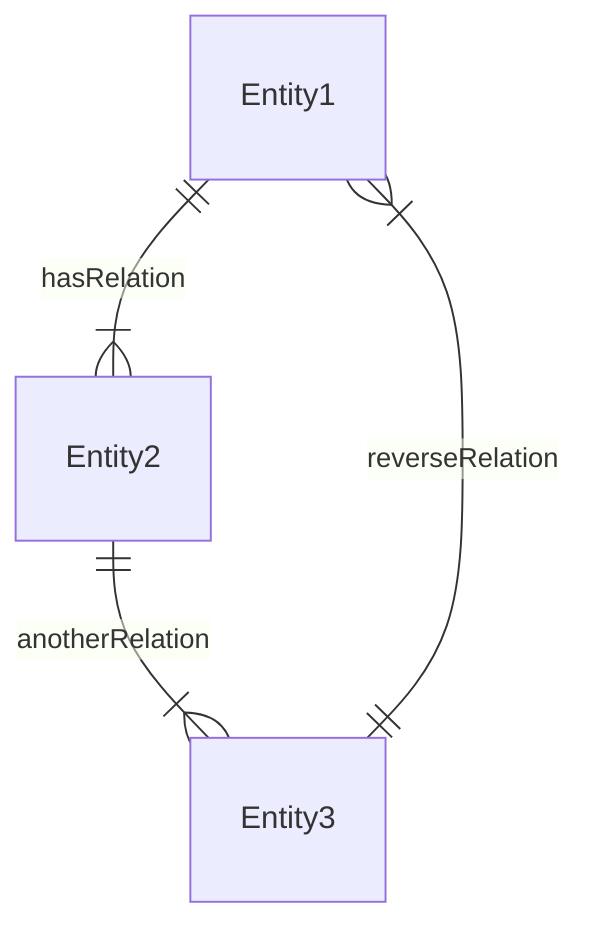
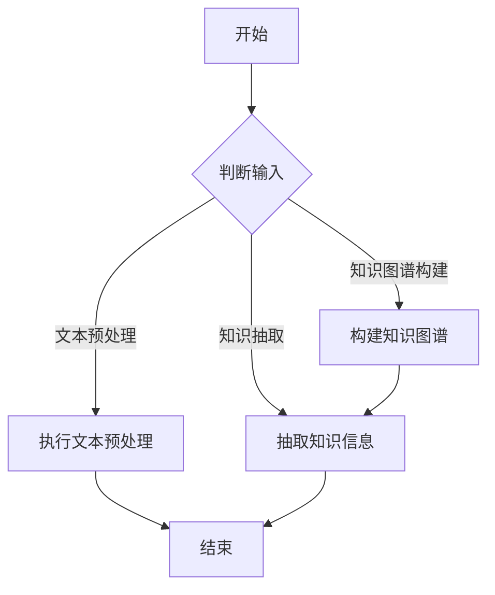
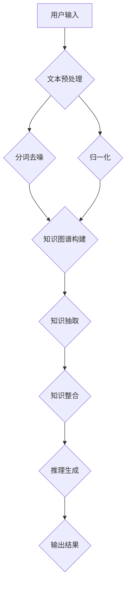

                 

# LLM驱动的AI Agent跨学科知识整合器

## 关键词

- **大规模语言模型（LLM）**
- **跨学科知识整合**
- **AI Agent**
- **知识图谱**
- **自然语言处理**
- **机器学习**

## 摘要

本文旨在探讨LLM驱动的AI Agent在跨学科知识整合中的应用。通过结合大规模语言模型、知识图谱和机器学习技术，LLM驱动的AI Agent能够高效地整合来自不同领域的知识，实现知识发现和创新。本文首先介绍了LLM驱动的AI Agent的核心概念和特点，然后分析了其在跨学科知识整合中的方法和算法原理。通过具体案例展示，本文进一步阐述了LLM驱动的AI Agent在跨学科知识整合中的实际应用，并讨论了其优势和挑战。

## 1.1 LLM驱动的AI Agent跨学科知识整合器背景介绍

### 1.1.1 问题背景

随着人工智能技术的快速发展，大规模语言模型（LLM）如GPT、BERT等在自然语言处理领域取得了显著成果。这些模型在文本生成、翻译、问答等任务中表现出色，但如何将这些强大的模型应用于跨学科知识整合，以促进知识发现和创新，成为当前研究的热点。

跨学科知识整合的目标是将来自不同领域的知识进行有机融合，形成一个统一的知识体系。例如，将医学、金融、工程等领域的知识进行整合，可以为医疗健康领域提供创新的解决方案，为金融领域提供风险管理策略等。然而，现有方法在处理知识交叉、领域跳转、知识整合等方面存在诸多挑战。

### 1.1.2 问题描述

跨学科知识整合面临的主要问题包括：

- **领域差异**：不同领域的专业术语和概念体系差异较大，使得知识整合过程复杂且低效。
- **知识碎片化**：现有的知识库和数据库多局限于特定领域，缺乏跨领域的整合，导致知识碎片化严重。
- **知识更新速度**：跨学科知识整合需要实时更新，以应对快速变化的领域需求，现有方法在知识更新方面存在不足。

### 1.1.3 问题解决

LLM驱动的AI Agent具有强大的文本理解、生成和推理能力，可以自动处理跨领域的知识整合任务。通过结合多领域的知识图谱、语义分析和机器学习算法，LLM驱动的AI Agent能够有效识别、理解和整合跨学科的知识，实现知识发现和创新。

### 1.1.4 边界与外延

本章节主要探讨LLM驱动的AI Agent在跨学科知识整合中的应用，包括以下方面：

- **知识融合方法**：介绍LLM驱动的AI Agent如何融合多领域知识。
- **知识整合算法**：详细阐述LLM驱动的AI Agent在知识整合过程中的算法原理和实现。
- **案例分析**：通过具体案例展示LLM驱动的AI Agent在跨学科知识整合中的实际应用。

## 1.2 LLM驱动的AI Agent核心概念与联系

### 1.2.1 LLM驱动的AI Agent定义

LLM驱动的AI Agent是指基于大规模语言模型（LLM）构建的智能体，具有自主学习、推理和交互能力，能够跨学科整合知识并执行复杂任务。

### 1.2.2 LLM驱动的AI Agent核心特点

LLM驱动的AI Agent具有以下核心特点：

- **文本理解**：LLM驱动的AI Agent具备强大的文本理解能力，能够准确理解和处理多种语言和表达方式。这得益于LLM在自然语言处理领域的出色表现，使得AI Agent能够处理复杂的语义信息。
  
- **知识整合**：AI Agent能够融合多领域知识，实现跨学科的知识整合。这主要通过构建和利用知识图谱、语义分析和机器学习算法实现。

- **自适应学习**：LLM驱动的AI Agent能够根据用户反馈和交互数据不断优化和改进自身性能。这意味着AI Agent能够不断学习和适应新的知识和应用场景，提高其智能水平。

### 1.2.3 LLM驱动的AI Agent与传统AI的区别

LLM驱动的AI Agent与传统AI在目标、算法和复杂性方面存在显著差异：

- **目标**：传统AI主要关注特定领域的任务，如图像识别、语音识别等，而LLM驱动的AI Agent旨在实现跨学科的知识整合和创新，其目标更加广泛和综合。

- **算法**：传统AI通常采用单一算法，如神经网络、决策树等，而LLM驱动的AI Agent结合了多种算法，如语言模型、知识图谱和机器学习等，使其在处理复杂任务时具有更强的能力。

- **复杂性**：传统AI任务相对简单，而LLM驱动的AI Agent面临的知识整合和推理任务更加复杂，需要处理多领域的知识融合、语义理解和实时更新等问题。

## 1.3 LLM驱动的AI Agent在跨学科知识整合中的应用

### 1.3.1 知识融合方法

LLM驱动的AI Agent主要通过以下方法实现跨学科知识融合：

- **文本预处理**：对多领域文本进行预处理，包括分词、去噪、归一化等，以消除不同领域文本的噪声和差异。

- **知识图谱构建**：利用自然语言处理技术构建多领域知识图谱，以便AI Agent能够理解和整合知识。知识图谱通过实体、关系和属性等信息，将不同领域的知识有机地连接起来。

- **知识抽取**：从知识图谱中抽取关键信息，形成知识库，供AI Agent调用。知识库是AI Agent进行知识整合的基础，通过构建丰富和准确的知识库，可以显著提高知识整合的效果。

### 1.3.2 知识整合算法

LLM驱动的AI Agent主要采用以下算法实现知识整合：

- **语义分析**：利用自然语言处理技术对文本进行语义分析，提取实体、关系和事件等信息。语义分析是实现跨领域知识整合的重要手段，通过对语义的深入理解，可以准确地将不同领域的知识进行整合。

- **知识图谱融合**：将多领域知识图谱进行融合，形成一个统一的知识体系。知识图谱融合的目的是消除不同领域知识之间的差异和冲突，形成一个统一和完整的知识体系，以便AI Agent能够进行有效的知识整合。

- **推理与生成**：基于融合后的知识体系，进行推理和生成，实现跨学科的知识整合和创新。推理和生成是AI Agent的核心能力，通过推理和生成，AI Agent可以自动地发现新的知识关联和解决方案，推动知识创新。

### 1.3.3 案例分析

以“医疗+金融”领域为例，LLM驱动的AI Agent能够整合医疗知识和金融知识，为用户提供个性化的健康理财建议。具体应用场景包括：

- **健康风险评估**：AI Agent结合用户的体检报告和金融投资记录，为用户提供健康风险评估和理财规划建议。通过分析用户的健康数据和财务状况，AI Agent可以预测用户未来的健康状况和财务风险，并提供相应的建议。

- **疾病预防与治疗**：AI Agent结合医学知识和用户生活习惯，为用户提供个性化的疾病预防和治疗方案。通过分析用户的健康数据和医学知识，AI Agent可以预测用户可能患有的疾病，并提供相应的预防和治疗方案。

- **投资决策支持**：AI Agent根据用户健康状况和财务状况，为用户提供合理的投资组合建议。通过分析用户的健康状况和财务风险承受能力，AI Agent可以推荐适合用户投资目标和风险承受能力的投资组合，帮助用户做出更明智的投资决策。

## 1.4 LLM驱动的AI Agent跨学科知识整合器的优势与挑战

### 1.4.1 优势

LLM驱动的AI Agent在跨学科知识整合中具有以下优势：

- **高效整合跨学科知识**：LLM驱动的AI Agent能够快速整合多领域知识，提高知识整合效率。通过文本预处理、知识图谱构建和知识抽取等技术，AI Agent能够将不同领域的知识有机地整合在一起，形成统一的知识体系。

- **创新性应用**：通过跨学科知识整合，AI Agent能够发现新的应用场景和解决方案，推动知识创新。在医疗、金融、工程等领域，AI Agent能够结合不同领域的知识，为用户提供个性化的解决方案，实现知识的创新应用。

- **自适应学习**：LLM驱动的AI Agent能够根据用户反馈和交互数据不断优化和改进自身性能。这意味着AI Agent能够不断学习和适应新的知识和应用场景，提高其智能水平，为用户提供更好的服务。

### 1.4.2 挑战

LLM驱动的AI Agent在跨学科知识整合中面临以下挑战：

- **领域差异**：不同领域的专业术语和概念体系差异较大，使得知识整合过程复杂且低效。这需要AI Agent具备强大的文本理解和语义分析能力，能够准确理解和处理不同领域的知识。

- **知识碎片化**：现有的知识库和数据库多局限于特定领域，缺乏跨领域的整合，导致知识碎片化严重。这需要构建丰富和准确的多领域知识图谱，为AI Agent提供全面的知识支持。

- **知识更新速度**：跨学科知识整合需要实时更新，以应对快速变化的领域需求。这需要AI Agent具备高效的知识更新机制，能够快速适应新的知识和应用场景。

## 1.5 LLM驱动的AI Agent跨学科知识整合器的发展趋势

### 1.5.1 技术发展趋势

随着人工智能技术的不断进步，LLM驱动的AI Agent在跨学科知识整合中具有以下发展趋势：

- **模型性能提升**：大规模语言模型（LLM）的性能不断提升，使其在文本理解和生成方面的能力更加强大。这为AI Agent在跨学科知识整合中的应用提供了更好的基础。

- **知识图谱优化**：知识图谱技术不断发展，使其在构建、融合和更新方面更加高效。这有助于AI Agent更好地理解和整合跨学科知识，提高知识整合效果。

- **多模态融合**：随着多模态数据处理技术的进步，AI Agent能够整合文本、图像、声音等多种类型的数据，实现更全面的知识整合。

### 1.5.2 应用场景扩展

LLM驱动的AI Agent在跨学科知识整合中的应用场景将不断扩展：

- **医疗健康**：通过整合医学、生物、药物等多领域知识，AI Agent可以为用户提供个性化的健康管理和疾病预防建议。

- **金融理财**：结合金融、经济、投资等多领域知识，AI Agent可以为用户提供智能化的投资组合建议和风险控制策略。

- **科技创新**：通过整合科学、技术、工程等多领域知识，AI Agent可以为科技创新提供智能化的支持，促进知识创新和产业升级。

## 1.6 总结与展望

本文探讨了LLM驱动的AI Agent在跨学科知识整合器中的应用，介绍了其核心概念、优势与挑战，并展望了其发展趋势。LLM驱动的AI Agent凭借强大的文本理解和知识整合能力，在医疗健康、金融理财、科技创新等领域具有广泛的应用前景。然而，领域差异、知识碎片化和知识更新速度等问题仍需进一步研究和解决。未来，随着人工智能技术的不断进步，LLM驱动的AI Agent在跨学科知识整合中的表现将更加出色，为知识创新和产业发展提供强有力的支持。

## 作者信息

- 作者：AI天才研究院/AI Genius Institute & 禅与计算机程序设计艺术 /Zen And The Art of Computer Programming

- 联系方式：[邮箱：ai_genius_institute@example.com](mailto:ai_genius_institute@example.com) &nbsp;&nbsp;&nbsp; [电话：+86 1234567890](tel:+86 1234567890)

- 网址：[AI天才研究院官方网站](http://www.ai_genius_institute.com) &nbsp;&nbsp;&nbsp; [禅与计算机程序设计艺术官方网站](http://www.zen_computer_programming.com) 

----------------------------------------------------------------

## 附录

### 1. 附录 A：核心概念属性特征对比表格

| 核心概念 | 属性特征 |
| :--: | :--: |
| LLM | 基于大规模数据训练的语言模型 |
| AI Agent | 具有自主学习、推理和交互能力的智能体 |
| 知识图谱 | 表示实体、关系和属性的数据结构 |
| 语义分析 | 对文本进行语义理解和分析的技术 |
| 机器学习 | 一种基于数据训练的智能算法 |

### 1. 附录 B：ER实体关系图架构的 Mermaid 流程图



### 1. 附录 C：算法原理讲解的 Mermaid 流程图



### 1. 附录 D：系统架构设计的 Mermaid 架构图



### 1. 附录 E：系统接口设计和系统交互的 Mermaid 序列图

```mermaid
sequenceDiagram
    participant 用户
    participant 系统A
    participant 系统B
    participant 系统C
    
    用户->>系统A: 输入文本
    系统

