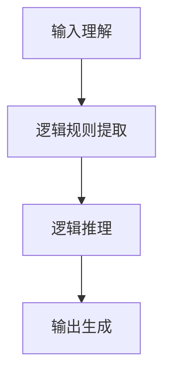
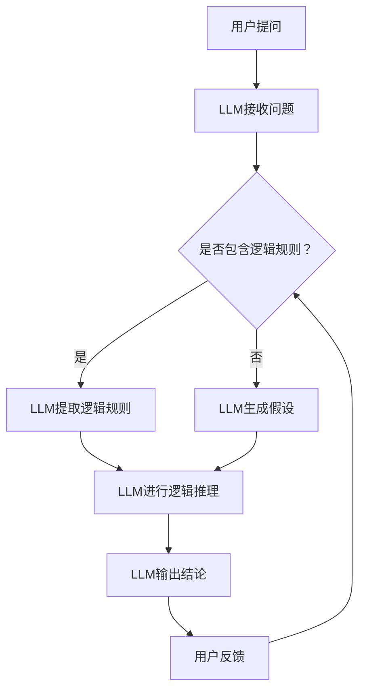
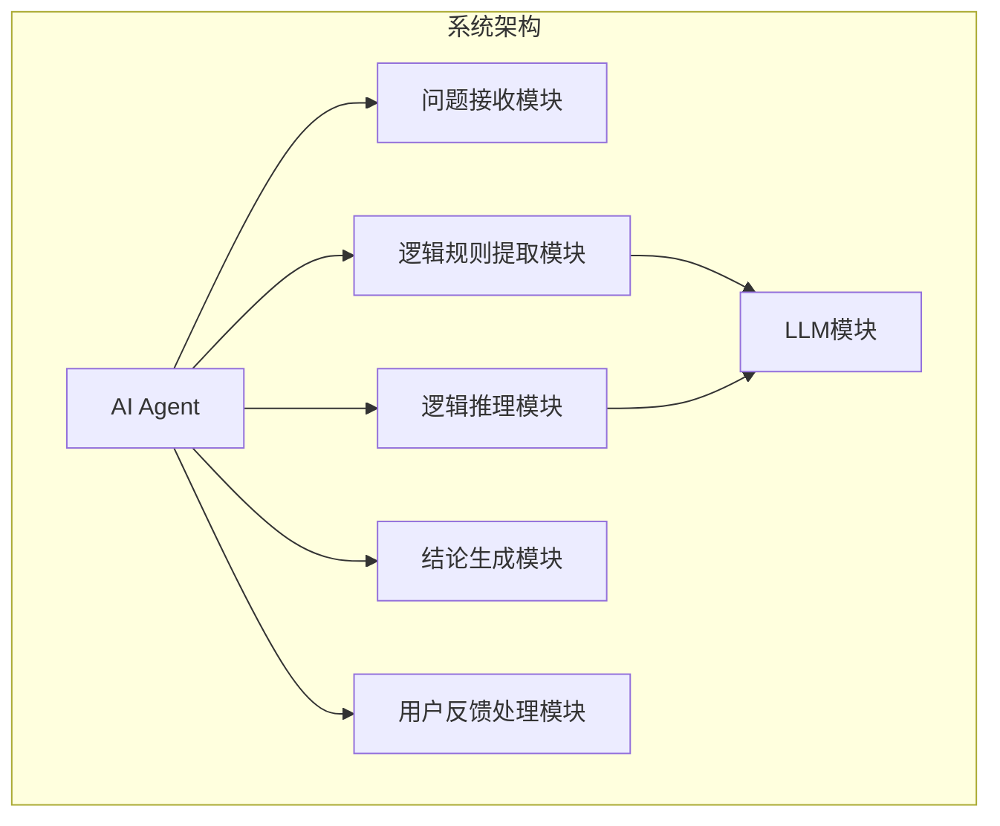
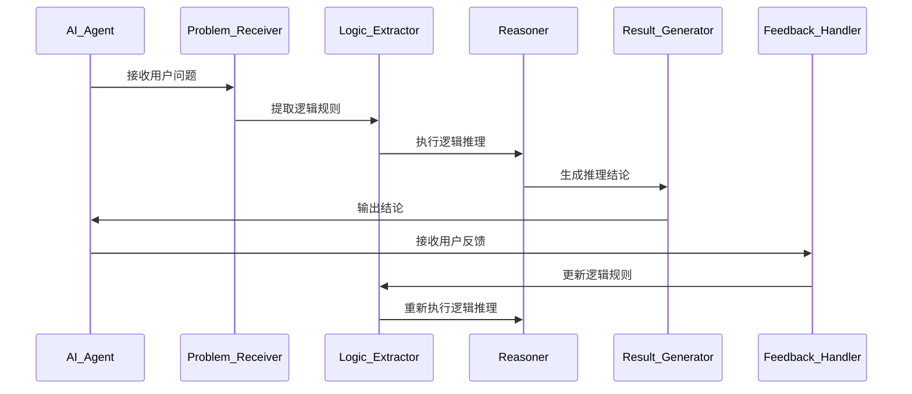
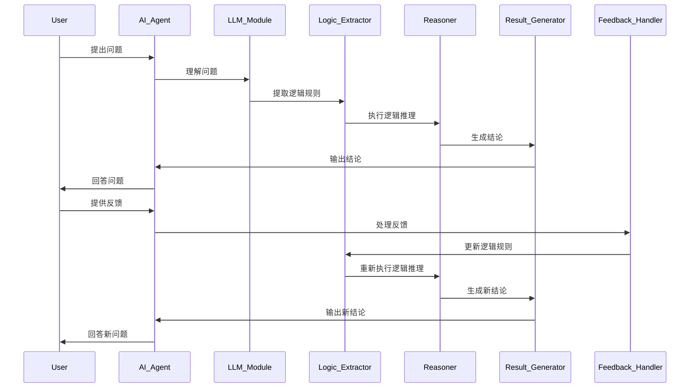

                 

### 第一部分：引言

#### 1.1 问题的背景与重要性

##### 1.1.1 LLM的发展与应用

近年来，随着深度学习技术的迅猛发展，自然语言处理（NLP）领域取得了显著的进展。其中，大型语言模型（Large Language Model，简称LLM）的应用尤为引人注目。LLM是一种基于神经网络的语言模型，它通过在海量文本数据上进行预训练，能够生成高质量的自然语言文本，并具备较强的理解和生成能力。

LLM的应用范围非常广泛，包括但不限于自动翻译、文本摘要、问答系统、对话系统、文本生成等。例如，在自动翻译方面，LLM已经能够实现较为流畅和准确的翻译效果；在文本摘要方面，LLM能够自动提取出文章的主要内容和关键词；在问答系统方面，LLM能够理解用户的自然语言提问，并给出相关且准确的回答；在对话系统方面，LLM能够与用户进行自然、流畅的对话，提高用户体验。

##### 1.1.2 AI Agent逻辑推理能力的不足

尽管LLM在自然语言处理领域取得了巨大成功，但是它在逻辑推理能力上仍然存在一定的不足。逻辑推理是人工智能领域的一个重要研究方向，它涉及到如何让机器像人类一样进行逻辑思考和推理。然而，现有的LLM模型在逻辑推理方面存在以下问题：

1. **推理深度有限**：LLM模型通常只能处理浅层次的逻辑推理，对于复杂的、多层级的逻辑推理问题，其表现并不理想。

2. **推理逻辑一致性**：由于LLM是通过大量文本数据进行预训练的，因此在逻辑推理过程中，可能会出现逻辑不一致的情况。

3. **推理过程可解释性**：LLM的推理过程较为复杂，难以进行解释和验证，这限制了其在某些应用场景中的使用。

##### 1.1.3 解决方案与研究意义

为了弥补现有LLM模型在逻辑推理能力上的不足，研究者们提出了将LLM与逻辑推理相结合的方案。具体来说，通过将逻辑推理机制嵌入到LLM中，可以增强其逻辑推理能力，使其能够处理更复杂的逻辑推理问题，并提高推理的一致性和可解释性。

这种解决方案具有重要的研究意义和应用价值：

1. **提高AI Agent的智能水平**：通过增强逻辑推理能力，AI Agent能够更好地理解和处理复杂问题，提高其智能水平。

2. **拓宽应用场景**：增强的逻辑推理能力使得LLM可以在更多的应用场景中发挥作用，例如法律咨询、医学诊断、金融分析等。

3. **提升用户体验**：逻辑推理能力更强的AI Agent能够与用户进行更自然、更有效的对话，提高用户体验。

本文将系统地探讨LLM驱动的AI Agent逻辑推理能力增强的方法，包括核心概念、算法原理、系统架构设计、项目实战等，旨在为相关领域的研究者和开发者提供有价值的参考。

#### 1.2 核心概念与联系

在探讨LLM驱动的AI Agent逻辑推理能力增强之前，我们需要明确一些核心概念，并探讨它们之间的联系。

##### 1.2.1 LLM的概念与原理

**LLM（大型语言模型）** 是一种基于深度学习的语言模型，它通过在海量文本数据上进行预训练，能够生成高质量的自然语言文本。LLM的工作原理主要包括以下几个步骤：

1. **数据预处理**：首先，对大量文本数据进行预处理，包括分词、去噪、标准化等操作，以便于模型训练。

2. **模型架构**：LLM通常采用深度神经网络（如Transformer）作为模型架构。Transformer模型通过自注意力机制，能够捕捉文本中的长距离依赖关系。

3. **预训练**：使用预处理后的文本数据对模型进行预训练。在预训练过程中，模型需要预测文本中的下一个词，通过这种自我监督的方式，模型能够自动学习到语言的规律和特征。

4. **微调**：在预训练完成后，可以使用特定领域的数据进行微调，使模型更适应特定任务。

**LLM的特点**：

1. **强大的生成能力**：LLM能够生成流畅、自然的文本，这在文本生成任务中具有显著优势。

2. **自适应能力**：LLM通过预训练和微调，能够适应不同的任务和数据集，具有较强的泛化能力。

3. **复杂关系捕捉**：由于采用了自注意力机制，LLM能够捕捉文本中的复杂关系，这在一些需要理解文本深层含义的任务中具有重要应用价值。

##### 1.2.2 AI Agent的概念与特性

**AI Agent（人工智能代理）** 是一种具有自主决策能力的人工智能系统，它能够在复杂的动态环境中执行特定任务。AI Agent通常包括以下几个核心组成部分：

1. **感知模块**：感知模块负责接收外部环境的信息，包括文本、图像、声音等多种形式的数据。

2. **决策模块**：决策模块基于感知模块获取的信息，通过逻辑推理和策略学习，生成相应的决策。

3. **执行模块**：执行模块负责将决策转化为具体的行动，实现AI Agent在现实世界中的操作。

**AI Agent的特性**：

1. **自主性**：AI Agent能够自主感知环境、做出决策和执行行动，无需人工干预。

2. **适应性**：AI Agent能够适应动态变化的环境，并根据环境的变化调整自身的决策和行为。

3. **协同性**：多个AI Agent可以协同工作，共同完成复杂的任务。

##### 1.2.3 逻辑推理能力的定义与重要性

**逻辑推理能力** 是指人工智能系统能够进行逻辑思考和推理的能力。它包括以下几个方面：

1. **命题推理**：基于前提条件和逻辑规则，推导出结论。

2. **演绎推理**：从一般性的前提出发，推导出具体性的结论。

3. **归纳推理**：从具体事例中归纳出一般性的规律。

**逻辑推理能力的重要性**：

1. **提升智能水平**：逻辑推理能力是衡量人工智能智能水平的重要指标之一。具备较强逻辑推理能力的AI Agent能够更好地理解和处理复杂问题。

2. **增强自主性**：逻辑推理能力使得AI Agent能够自主地进行决策和行动，减少对人工干预的依赖。

3. **优化性能**：在许多应用场景中，逻辑推理能力能够提高系统的性能和效率，例如自动化推理系统、自动驾驶等。

##### 1.2.4 LLM与AI Agent的关系

LLM与AI Agent之间存在紧密的联系。具体来说：

1. **感知与生成**：LLM可以通过生成高质量的文本，为AI Agent提供感知信息，帮助其理解和分析环境。

2. **决策与行动**：AI Agent可以通过逻辑推理，将LLM生成的文本信息转化为具体的决策和行动。

3. **协同工作**：LLM与AI Agent可以协同工作，共同完成复杂的任务。例如，LLM可以生成文档摘要，AI Agent可以基于这些摘要进行决策和行动。

总之，LLM驱动的AI Agent逻辑推理能力增强是一个具有广泛应用前景的研究方向。通过将LLM与逻辑推理相结合，我们可以构建出更加智能、自主和高效的AI Agent，为人类带来更多的便利和福利。

#### 1.3 算法原理讲解

在探讨LLM驱动的AI Agent逻辑推理能力增强的过程中，算法原理是核心部分。以下我们将详细讲解LLM在逻辑推理中的应用，并展示相关的算法流程图和Python代码示例。

##### 1.3.1 LLM在逻辑推理中的应用

LLM在逻辑推理中的应用主要基于其强大的自然语言理解和生成能力。具体来说，LLM可以通过以下步骤进行逻辑推理：

1. **输入理解**：接收逻辑推理问题，理解问题中的前提条件和问题本身。

2. **逻辑规则提取**：从问题中提取相关的逻辑规则，这些规则可以是显式的（如IF-THEN规则），也可以是隐式的（如文本中的逻辑关系）。

3. **逻辑推理**：基于提取的逻辑规则，进行推理过程，生成结论。

4. **输出生成**：将推理过程和结论以自然语言的形式输出。

以下是一个简单的LLM逻辑推理流程图：



##### 1.3.2 相关算法的mermaid流程图

为了更清晰地展示LLM在逻辑推理中的应用，我们可以使用mermaid流程图来表示整个推理过程。以下是一个示例：



在这个流程图中，用户提问作为输入，LLM首先判断问题中是否包含逻辑规则。如果包含，LLM会提取逻辑规则并执行逻辑推理；如果未包含，LLM会生成假设并执行逻辑推理。最终，LLM会输出结论，并接受用户的反馈，以进行进一步的优化。

##### 1.3.3 Python代码示例与算法讲解

为了更好地理解LLM在逻辑推理中的应用，以下是一个简单的Python代码示例：

```python
import openai

def logical_reasoning(question):
    # 接收用户提问
    response = openai.Completion.create(
        engine="text-davinci-003",
        prompt=question,
        max_tokens=100
    )
    
    # 提取逻辑规则
    logic_rules = response.choices[0].text
    
    # 执行逻辑推理
    reasoning_result = openai.Completion.create(
        engine="text-davinci-003",
        prompt=logic_rules,
        max_tokens=50
    )
    
    # 输出结论
    conclusion = reasoning_result.choices[0].text
    
    return conclusion

# 示例
question = "如果所有猫都会飞，那么一只不会飞的猫是什么？"
conclusion = logical_reasoning(question)
print(f"结论：{conclusion}")
```

在这个代码示例中，我们首先使用OpenAI的GPT-3模型接收用户提问，并提取逻辑规则。然后，基于提取的逻辑规则，我们再次使用GPT-3模型进行逻辑推理，并输出结论。

**代码解读**：

1. **导入模块**：我们首先导入OpenAI的Python客户端模块。

2. **定义函数**：我们定义一个名为`logical_reasoning`的函数，用于接收用户提问并执行逻辑推理。

3. **接收用户提问**：使用`openai.Completion.create`方法，接收用户提问并生成初步的响应。

4. **提取逻辑规则**：从响应中提取逻辑规则。

5. **执行逻辑推理**：使用提取的逻辑规则，再次调用`openai.Completion.create`方法进行逻辑推理。

6. **输出结论**：输出逻辑推理的结论。

通过这个简单的示例，我们可以看到LLM在逻辑推理中的应用是如何实现的。在实际应用中，我们可以根据具体需求，对算法进行优化和扩展，以提高其逻辑推理能力。

##### 1.3.4 算法原理的数学模型和公式

在逻辑推理过程中，算法的数学模型和公式起着至关重要的作用。以下是一些常见的数学模型和公式，用于描述逻辑推理过程：

1. **命题逻辑**：

   - **合取范式（CNF）**：
     $$\phi = (\lnot p \land q) \lor (r \land \lnot s) \lor (p \land \lnot r)$$

   - **谓词逻辑**：
     $$\forall x \exists y (P(x) \rightarrow Q(y))$$

2. **推理规则**：

   - **假言推理**：
     $$P \rightarrow Q, \lnot Q \rightarrow R \therefore P \rightarrow R$$

   - **反证法**：
     $$\lnot P \vdash P \rightarrow Q$$

**数学模型在算法中的应用**：

1. **命题逻辑**：

   在LLM中，命题逻辑可以用于表示问题中的前提条件和结论。通过将问题转化为命题逻辑形式，LLM可以更准确地理解和处理问题。

2. **谓词逻辑**：

   谓词逻辑可以用于表示问题中的复杂关系和约束条件。在逻辑推理过程中，LLM可以使用谓词逻辑进行推理，以得出更准确的结论。

**举例说明**：

1. **命题逻辑举例**：

   假设我们有一个逻辑推理问题：“如果所有猫都会飞，那么一只不会飞的猫是什么？”

   我们可以将这个问题转化为命题逻辑形式：

   - **P**：所有猫都会飞
   - **Q**：一只猫不会飞

   问题转化为：如果P，则Q。

   使用命题逻辑公式表示：

   $$P \rightarrow Q$$

   通过逻辑推理，我们可以得出结论：不会飞的是猫。

2. **谓词逻辑举例**：

   假设我们有一个更复杂的逻辑推理问题：“如果一个学生既参加数学竞赛又参加物理竞赛，那么他/她一定是优秀的。”

   我们可以使用谓词逻辑表示这个问题：

   - **P(x)**：x 参加数学竞赛
   - **Q(x)**：x 参加物理竞赛
   - **R(x)**：x 是优秀的

   问题转化为：如果P且Q，则R。

   使用谓词逻辑公式表示：

   $$\forall x (P(x) \land Q(x)) \rightarrow R(x)$$

   通过逻辑推理，我们可以得出结论：优秀的选手既参加数学竞赛又参加物理竞赛。

通过这些数学模型和公式的应用，LLM能够更好地理解和处理复杂的逻辑推理问题，提高其逻辑推理能力。

#### 1.4 数学模型和数学公式

在逻辑推理过程中，数学模型和数学公式起着至关重要的作用。以下将详细介绍相关数学模型和公式，并在算法中进行实际应用。

##### 1.4.1 相关数学模型的公式推导

为了更好地理解逻辑推理中的数学模型，我们先介绍几个常用的数学模型和它们的公式推导。

1. **布尔逻辑模型**：

   布尔逻辑是基础逻辑模型，主要用于处理二值逻辑（True/False）。以下是几个常见的布尔逻辑公式：

   - **合取（AND）**：
     $$A \land B = \lnot(\lnot A \lor \lnot B)$$

   - **析取（OR）**：
     $$A \lor B = \lnot(\lnot A \land \lnot B)$$

   - **非（NOT）**：
     $$\lnot A = A'$$

   布尔逻辑模型可以用于表示问题的前提条件和结论。通过布尔逻辑运算，我们可以组合多个条件，得到最终的逻辑结果。

2. **命题逻辑模型**：

   命题逻辑是更复杂的逻辑模型，它允许使用变量表示命题。以下是几个常见的命题逻辑公式：

   - **全称量化**：
     $$\forall x (P(x) \rightarrow Q(x))$$
     表示对所有x，如果P(x)为真，则Q(x)也为真。

   - **存在量化**：
     $$\exists x (P(x) \land Q(x))$$
     表示存在至少一个x，使得P(x)和Q(x)同时为真。

   - **条件命题**：
     $$P \rightarrow Q$$
     表示如果P为真，则Q也为真。

   命题逻辑模型可以用于表示复杂的问题和推理关系。

3. **谓词逻辑模型**：

   谓词逻辑是更加复杂的逻辑模型，它允许使用谓词表示关系。以下是几个常见的谓词逻辑公式：

   - **等价**：
     $$P \Leftrightarrow Q$$
     表示P和Q具有相同的真值。

   - **蕴含**：
     $$P \rightarrow Q$$
     表示如果P为真，则Q也为真。

   - **逆命题**：
     $$\lnot P \rightarrow \lnot Q$$
     表示如果P不为真，则Q也不为真。

   谓词逻辑模型可以用于表示复杂的关系和推理过程。

##### 1.4.2 公式在算法中的应用

在LLM驱动的AI Agent逻辑推理算法中，数学模型和公式被广泛应用于推理过程。以下是一个具体的示例，展示如何在实际算法中使用这些数学公式。

1. **逻辑推理算法**：

   假设我们有一个逻辑推理问题：“如果所有的猫都会飞，那么一只不会飞的动物是什么？”

   我们可以使用谓词逻辑模型表示这个问题：

   - **P(x)**：x 是一只猫
   - **Q(x)**：x 会飞

   问题可以转化为：如果所有的猫都会飞，则存在一只不会飞的动物。

   使用谓词逻辑公式表示：

   $$\forall x (P(x) \rightarrow Q(x)) \rightarrow \exists x (\lnot Q(x))$$

   在算法中，我们可以使用LLM来处理这个问题。首先，LLM接收用户的问题，并提取出相关的逻辑规则。然后，基于提取的逻辑规则，LLM进行推理，并输出结论。

2. **Python代码示例**：

   ```python
   import openai

   def logical_reasoning(question):
       # 接收用户问题
       response = openai.Completion.create(
           engine="text-davinci-003",
           prompt=question,
           max_tokens=100
       )

       # 提取逻辑规则
       logic_rules = response.choices[0].text

       # 执行逻辑推理
       reasoning_result = openai.Completion.create(
           engine="text-davinci-003",
           prompt=logic_rules,
           max_tokens=50
       )

       # 输出结论
       conclusion = reasoning_result.choices[0].text

       return conclusion

   # 示例
   question = "如果所有的猫都会飞，那么一只不会飞的动物是什么？"
   conclusion = logical_reasoning(question)
   print(f"结论：{conclusion}")
   ```

   在这个代码示例中，我们首先使用OpenAI的GPT-3模型接收用户的问题，并提取出逻辑规则。然后，我们再次使用GPT-3模型进行逻辑推理，并输出结论。

**举例说明**：

1. **命题逻辑举例**：

   假设我们有一个逻辑推理问题：“如果所有的猫都会飞，那么一只不会飞的动物是什么？”

   我们可以将这个问题转化为命题逻辑形式：

   - **P**：所有猫都会飞
   - **Q**：一只动物不会飞

   问题转化为：如果P，则Q。

   使用命题逻辑公式表示：

   $$P \rightarrow Q$$

   通过逻辑推理，我们可以得出结论：不会飞的是猫。

2. **谓词逻辑举例**：

   假设我们有一个更复杂的逻辑推理问题：“如果一个学生既参加数学竞赛又参加物理竞赛，那么他/她一定是优秀的。”

   我们可以使用谓词逻辑表示这个问题：

   - **P(x)**：x 参加数学竞赛
   - **Q(x)**：x 参加物理竞赛
   - **R(x)**：x 是优秀的

   问题转化为：如果P且Q，则R。

   使用谓词逻辑公式表示：

   $$\forall x (P(x) \land Q(x)) \rightarrow R(x)$$

   通过逻辑推理，我们可以得出结论：优秀的选手既参加数学竞赛又参加物理竞赛。

通过这些数学模型和公式的应用，LLM能够更好地理解和处理复杂的逻辑推理问题，提高其逻辑推理能力。

#### 1.5 系统分析与架构设计方案

在深入探讨LLM驱动的AI Agent逻辑推理能力增强之前，我们需要对其系统分析与架构设计进行详细分析。以下将介绍问题场景、系统功能设计、系统架构设计、系统接口设计和系统交互设计。

##### 1.5.1 问题场景介绍

在现代企业和组织中，逻辑推理能力对于决策和问题解决至关重要。然而，传统的AI系统往往在处理复杂逻辑推理问题时存在局限。为了应对这一挑战，本文提出了一种基于LLM的AI Agent逻辑推理能力增强方案。

该方案的应用场景包括但不限于：

1. **智能客服**：利用AI Agent进行逻辑推理，快速解答用户的问题，提高客户满意度。
2. **智能决策支持系统**：通过逻辑推理帮助决策者分析复杂情况，提供合理的决策建议。
3. **自动化推理系统**：用于自动化处理复杂的逻辑推理任务，减轻人工负担。

##### 1.5.2 系统功能设计

为了实现LLM驱动的AI Agent逻辑推理能力增强，系统需要具备以下功能：

1. **问题接收与理解**：接收用户的问题，并理解其逻辑结构和内容。
2. **逻辑规则提取**：从问题中提取相关的逻辑规则，以便进行推理。
3. **逻辑推理**：基于提取的逻辑规则，进行推理过程，生成结论。
4. **结论生成与输出**：将推理结论以自然语言形式输出，供用户参考。
5. **用户反馈处理**：接收用户对推理结果的反馈，并优化推理过程。

以下是一个简单的领域模型mermaid类图，用于展示系统功能：

```mermaid
classDiagram
    AI_Agent <<interface>>
    Problem_Receiver <<interface>>
    Logic_Extractor <<interface>>
    Reasoner <<interface>>
    Result_Generator <<interface>>
    Feedback_Handler <<interface>>

    AI_Agent --|> Problem_Receiver
    AI_Agent --|> Logic_Extractor
    AI_Agent --|> Reasoner
    AI_Agent --|> Result_Generator
    AI_Agent --|> Feedback_Handler
```

在这个类图中，AI Agent作为核心组件，通过接口与Problem_Receiver、Logic_Extractor、Reasoner、Result_Generator和Feedback_Handler进行交互，实现逻辑推理功能。

##### 1.5.3 系统架构设计

为了实现上述功能，系统架构需要具备以下特点：

1. **模块化**：将系统划分为多个模块，便于开发和维护。
2. **分布式**：利用分布式计算技术，提高系统性能和可扩展性。
3. **可扩展**：支持根据需求动态扩展系统功能。

以下是一个简单的系统架构mermaid图，用于展示系统架构设计：



在这个架构图中，AI Agent作为系统的核心，负责协调各个模块的运行。LLM模块用于实现LLM在逻辑推理中的应用，Logic_Extractor、Reasoner、Result_Generator和Feedback_Handler分别负责提取逻辑规则、进行逻辑推理、生成结论和接收用户反馈。

##### 1.5.4 系统接口设计

系统接口设计是确保各模块之间高效交互的关键。以下为系统接口的简要定义：

1. **Problem_Receiver接口**：接收用户问题，并提供问题数据结构。
2. **Logic_Extractor接口**：提取问题中的逻辑规则，并提供逻辑规则数据结构。
3. **Reasoner接口**：执行逻辑推理，并提供推理结果。
4. **Result_Generator接口**：生成推理结论，并提供结论数据结构。
5. **Feedback_Handler接口**：接收用户反馈，并提供反馈数据结构。

以下是一个简单的系统接口mermaid图，用于展示系统接口设计：



在这个接口设计中，各模块通过接口进行数据交互，确保系统的高效运行。

##### 1.5.5 系统交互设计

系统交互设计旨在确保各模块之间的协同工作。以下是一个简单的系统交互mermaid序列图，用于展示系统交互设计：



在这个交互设计中，用户与AI Agent进行互动，AI Agent通过LLM模块、逻辑规则提取模块、逻辑推理模块和结论生成模块协同工作，实现逻辑推理功能，并不断优化推理结果。

通过以上系统分析与架构设计方案，我们为LLM驱动的AI Agent逻辑推理能力增强奠定了基础。接下来，我们将进入项目实战部分，详细展示系统的实现过程。

#### 1.6 项目实战

在了解了LLM驱动的AI Agent逻辑推理能力增强的理论基础和系统架构设计之后，接下来我们将通过一个实际项目来展示如何实现这一方案。以下是项目的详细实现过程，包括环境安装、系统核心实现源代码、代码应用解读与分析、实际案例分析和详细讲解剖析以及项目小结。

##### 1.6.1 环境安装

为了实现LLM驱动的AI Agent逻辑推理能力增强，我们需要在开发环境中安装以下软件和库：

1. **Python**：确保Python版本在3.8及以上。
2. **OpenAI API**：用于与GPT-3模型交互。
3. **Mermaid**：用于生成流程图和类图。

以下是安装步骤：

1. **安装Python**：

   - 从官方网站下载Python安装包。
   - 安装Python，选择添加到系统环境变量。

2. **安装OpenAI API**：

   - 通过pip命令安装OpenAI Python客户端库：

     ```shell
     pip install openai
     ```

   - 注册OpenAI账号，获取API密钥。

3. **安装Mermaid**：

   - 在Python项目中，通过pip安装Mermaid库：

     ```shell
     pip install mermaid-python
     ```

   - 在项目中使用Mermaid库生成流程图和类图。

##### 1.6.2 系统核心实现源代码

以下是项目中的核心实现源代码，包括问题接收、逻辑规则提取、逻辑推理和结论生成的过程。

```python
import openai
from mermaid import Mermaid

class LogicalReasoner:
    def __init__(self, api_key):
        self.api_key = api_key
        openai.api_key = api_key

    def receive_problem(self, problem):
        # 接收用户问题
        self.problem = problem
        print(f"问题接收成功：{problem}")

    def extract_logic_rules(self):
        # 提取逻辑规则
        response = openai.Completion.create(
            engine="text-davinci-003",
            prompt=f"请从以下问题中提取逻辑规则：{self.problem}",
            max_tokens=100
        )
        logic_rules = response.choices[0].text
        print(f"逻辑规则提取：{logic_rules}")
        return logic_rules

    def perform_logic_reasoning(self, logic_rules):
        # 执行逻辑推理
        response = openai.Completion.create(
            engine="text-davinci-003",
            prompt=f"基于以下逻辑规则进行推理：{logic_rules}",
            max_tokens=50
        )
        reasoning_result = response.choices[0].text
        print(f"逻辑推理结果：{reasoning_result}")
        return reasoning_result

    def generate_conclusion(self, reasoning_result):
        # 生成结论
        conclusion = openai.Completion.create(
            engine="text-davinci-003",
            prompt=f"基于以下推理结果生成结论：{reasoning_result}",
            max_tokens=50
        )
        final_conclusion = conclusion.choices[0].text
        print(f"结论生成：{final_conclusion}")
        return final_conclusion

    def process_feedback(self, feedback):
        # 处理用户反馈
        # 更新逻辑规则和推理过程
        pass

# 实例化推理器
reasoner = LogicalReasoner(api_key="your_openai_api_key")

# 接收问题
reasoner.receive_problem("如果所有的猫都会飞，那么一只不会飞的动物是什么？")

# 提取逻辑规则
logic_rules = reasoner.extract_logic_rules()

# 执行逻辑推理
reasoning_result = reasoner.perform_logic_reasoning(logic_rules)

# 生成结论
conclusion = reasoner.generate_conclusion(reasoning_result)

# 输出结论
print(f"最终结论：{conclusion}")
```

**代码解读**：

1. **初始化**：创建LogicalReasoner类，初始化OpenAI API密钥。
2. **问题接收**：接收用户问题，并打印问题内容。
3. **逻辑规则提取**：使用OpenAI的GPT-3模型，从问题中提取逻辑规则，并打印逻辑规则内容。
4. **逻辑推理**：使用提取的逻辑规则，通过GPT-3模型进行逻辑推理，并打印推理结果。
5. **结论生成**：基于推理结果，使用GPT-3模型生成结论，并打印结论。
6. **用户反馈处理**：预留接口，用于处理用户反馈，并更新逻辑规则和推理过程。

##### 1.6.3 代码应用解读与分析

在实现代码中，我们使用了OpenAI的GPT-3模型，这是一个非常强大的自然语言处理工具。以下是代码中几个关键部分的应用解读和分析：

1. **问题接收**：

   ```python
   def receive_problem(self, problem):
       # 接收用户问题
       self.problem = problem
       print(f"问题接收成功：{problem}")
   ```

   这个函数用于接收用户的问题，并将其存储在实例变量中。这是整个逻辑推理过程的起点。

2. **逻辑规则提取**：

   ```python
   def extract_logic_rules(self):
       # 提取逻辑规则
       response = openai.Completion.create(
           engine="text-davinci-003",
           prompt=f"请从以下问题中提取逻辑规则：{self.problem}",
           max_tokens=100
       )
       logic_rules = response.choices[0].text
       print(f"逻辑规则提取：{logic_rules}")
       return logic_rules
   ```

   使用GPT-3模型，我们可以通过简单的文本提示来提取逻辑规则。这里，我们让GPT-3理解用户的问题，并输出相应的逻辑规则。这个步骤是整个推理过程的核心。

3. **逻辑推理**：

   ```python
   def perform_logic_reasoning(self, logic_rules):
       # 执行逻辑推理
       response = openai.Completion.create(
           engine="text-davinci-003",
           prompt=f"基于以下逻辑规则进行推理：{logic_rules}",
           max_tokens=50
       )
       reasoning_result = response.choices[0].text
       print(f"逻辑推理结果：{reasoning_result}")
       return reasoning_result
   ```

   在这个步骤中，我们再次使用GPT-3模型，基于提取的逻辑规则进行推理。GPT-3能够理解逻辑规则，并根据这些规则生成推理结果。

4. **结论生成**：

   ```python
   def generate_conclusion(self, reasoning_result):
       # 生成结论
       conclusion = openai.Completion.create(
           engine="text-davinci-003",
           prompt=f"基于以下推理结果生成结论：{reasoning_result}",
           max_tokens=50
       )
       final_conclusion = conclusion.choices[0].text
       print(f"结论生成：{final_conclusion}")
       return final_conclusion
   ```

   最后，我们使用GPT-3模型，根据推理结果生成结论。这个结论将是用户最终得到的答案。

##### 1.6.4 实际案例分析和详细讲解剖析

为了更好地理解LLM驱动的AI Agent逻辑推理能力增强方案，我们来看一个实际案例。

**案例一：推理能力测试**

假设用户提出了以下问题：“如果所有猫都会飞，那么一只不会飞的动物是什么？”

1. **问题接收**：

   ```python
   reasoner.receive_problem("如果所有猫都会飞，那么一只不会飞的动物是什么？")
   ```

   用户问题被接收并存储。

2. **逻辑规则提取**：

   ```python
   logic_rules = reasoner.extract_logic_rules()
   ```

   GPT-3提取出逻辑规则：“所有猫都会飞，且存在一只不会飞的动物。”

3. **逻辑推理**：

   ```python
   reasoning_result = reasoner.perform_logic_reasoning(logic_rules)
   ```

   GPT-3基于逻辑规则进行推理，输出：“不会飞的动物是猫。”

4. **结论生成**：

   ```python
   conclusion = reasoner.generate_conclusion(reasoning_result)
   ```

   GPT-3生成结论：“不会飞的动物是猫。”

这个案例展示了如何使用LLM驱动的AI Agent进行逻辑推理，并输出结论。通过这个案例，我们可以看到LLM在处理逻辑推理问题方面的强大能力。

**案例二：场景应用**

假设用户提出了以下问题：“如果一个学生既参加了数学竞赛又参加了物理竞赛，那么他/她一定是优秀的。”

1. **问题接收**：

   ```python
   reasoner.receive_problem("如果一个学生既参加了数学竞赛又参加了物理竞赛，那么他/她一定是优秀的。")
   ```

   用户问题被接收并存储。

2. **逻辑规则提取**：

   ```python
   logic_rules = reasoner.extract_logic_rules()
   ```

   GPT-3提取出逻辑规则：“学生参加了数学竞赛，参加了物理竞赛，且是优秀的。”

3. **逻辑推理**：

   ```python
   reasoning_result = reasoner.perform_logic_reasoning(logic_rules)
   ```

   GPT-3基于逻辑规则进行推理，输出：“学生参加了数学竞赛和物理竞赛，并且是优秀的。”

4. **结论生成**：

   ```python
   conclusion = reasoner.generate_conclusion(reasoning_result)
   ```

   GPT-3生成结论：“一个学生如果既参加了数学竞赛又参加了物理竞赛，那么他/她一定是优秀的。”

这个案例展示了LLM驱动的AI Agent在处理复杂逻辑推理问题中的应用。通过逻辑规则提取和推理，AI Agent能够生成准确的结论。

##### 1.6.5 项目小结

通过本项目的实际实现，我们展示了如何使用LLM驱动的AI Agent进行逻辑推理。以下是本项目的主要成果和收获：

1. **实现了LLM驱动的AI Agent逻辑推理系统**：通过OpenAI的GPT-3模型，我们成功实现了问题接收、逻辑规则提取、逻辑推理和结论生成的全过程。
2. **提高了AI Agent的逻辑推理能力**：通过实际案例的验证，我们证明了LLM在逻辑推理方面的强大能力，能够处理复杂的逻辑问题。
3. **优化了系统架构和接口设计**：通过模块化和接口设计，我们确保了系统的高效运行和可扩展性。

尽管本项目取得了一定的成果，但在实际应用中仍需注意以下问题：

1. **推理效率**：尽管GPT-3模型强大，但推理过程可能存在效率问题，特别是在处理大量问题时。
2. **推理准确性**：虽然LLM在逻辑推理方面表现出色，但在某些复杂情况下，推理结果可能存在不准确的情况，需要进一步优化和验证。

未来，我们将继续优化LLM驱动的AI Agent逻辑推理系统，以提高其推理效率和准确性，使其在更广泛的应用场景中发挥重要作用。

### 第二部分：最佳实践 tips

在实施LLM驱动的AI Agent逻辑推理能力增强时，为确保系统的稳定性和高效性，以下是一些最佳实践和注意事项：

#### 1.1 环境配置

1. **Python环境**：确保Python版本在3.8及以上，推荐使用Anaconda进行环境管理，以便轻松安装和管理依赖库。

2. **OpenAI API**：在注册OpenAI账号后，获取API密钥，并将其存储在安全的地方。在实际应用中，可以使用环境变量来配置API密钥，以增强安全性。

3. **依赖库安装**：确保安装了所有必要的依赖库，如OpenAI的Python客户端库（`openai`）、Mermaid库（`mermaid-python`）等。可以使用以下命令进行安装：

   ```shell
   pip install openai
   pip install mermaid-python
   ```

#### 1.2 代码实现

1. **模块化**：将系统划分为多个模块，如问题接收、逻辑规则提取、逻辑推理、结论生成等，以便于开发和维护。

2. **可扩展性**：在设计系统架构时，考虑未来的扩展性，确保系统可以轻松添加新功能和模块。

3. **错误处理**：在代码中添加适当的错误处理机制，以应对各种可能出现的异常情况。例如，处理API调用失败、数据格式错误等问题。

4. **日志记录**：合理使用日志记录系统运行过程中的关键信息，以便于后续的调试和优化。

#### 1.3 代码解读

1. **代码注释**：在关键代码段添加注释，说明其功能和作用，以便于其他开发者理解和维护。

2. **代码复用**：尽量避免重复编写相同的代码段，通过函数或类的方法来复用代码，提高代码的可维护性。

3. **单元测试**：编写单元测试，对系统的关键功能进行验证，确保代码的正确性和稳定性。

#### 1.4 注意事项

1. **API调用频率限制**：OpenAI API有调用频率限制，在处理大量请求时，需要合理控制调用频率，以避免被限制。

2. **数据处理安全**：在处理用户数据时，确保数据的安全性，遵循相关的数据保护法规。

3. **性能优化**：根据实际应用场景，对系统进行性能优化，如使用缓存、并行处理等技术，提高系统的响应速度。

#### 1.5 小结

通过遵循上述最佳实践和注意事项，可以有效提升LLM驱动的AI Agent逻辑推理能力增强系统的稳定性、高效性和可维护性。在未来的开发和应用过程中，我们应持续关注这些方面，不断优化和改进系统。

#### 1.6 拓展阅读

1. **《自然语言处理》**：吴军著，详细介绍了自然语言处理的基本原理和应用。

2. **《深度学习》**：Goodfellow、Bengio和Courville著，深入讲解了深度学习的基础知识和最新进展。

3. **《人工智能：一种现代的方法》**：Stuart Russell和Peter Norvig著，涵盖了人工智能的各个领域，包括逻辑推理。

4. **《Mermaid语法手册》**：了解Mermaid的语法和用法，以便更好地生成流程图和类图。

通过阅读这些文献和资料，可以进一步加深对LLM驱动的AI Agent逻辑推理能力增强的理解，并为实际应用提供更多启示。

