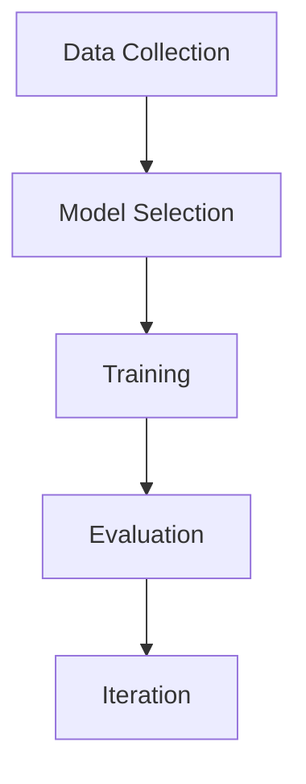
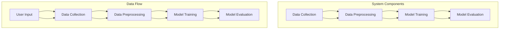
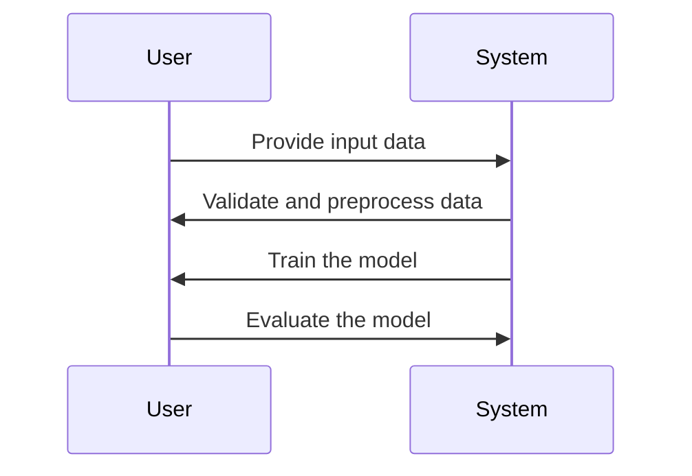
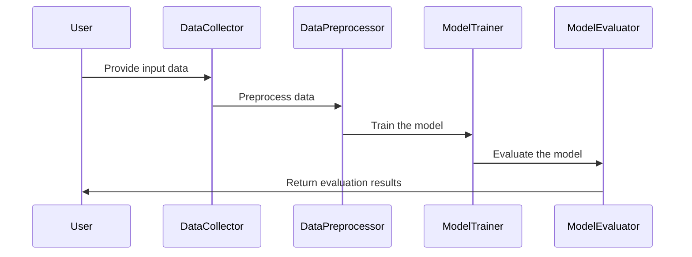

                 


### Let's Think Step by Step: Exploring Few-Shot Learning for Reducing AI Agent's Training Data Needs

#### Step 1: Understanding the Problem Background

The rapid advancement in artificial intelligence (AI) technologies has led to significant improvements in areas such as image recognition and natural language processing. However, these advancements come with a high cost in terms of data. Most deep learning models require large datasets to train effectively, which can be both time-consuming and expensive to obtain. Therefore, addressing the issue of reducing training data needs has become a critical focus in the AI community.

In this context, few-shot learning emerges as a promising solution. It aims to train high-performance models using only a small number of samples, typically a few to several dozen. This approach can greatly reduce the dependency on large datasets, making AI development more efficient and cost-effective.

#### Step 2: Defining Core Concepts

**Few-Shot Learning**
- **Definition**: A machine learning approach that trains models using only a small number of samples, usually a few to several dozen, to achieve good generalization.
- **Characteristics**:
  - **Small Sample Size**: Reduces the amount of data required for training.
  - **Fast Adaptation**: Rapidly adapts to new tasks without extensive retraining.
  - **Transfer Learning**: Utilizes prior knowledge to enhance performance on new tasks.

**AI Agent**
- **Definition**: An autonomous intelligent agent capable of learning and making decisions in complex environments.
- **Characteristics**:
  - **Autonomy**: Makes decisions independently without human intervention.
  - **Adaptability**: Adapts to new environments and tasks through learning.
  - **Generalization**: Performs well across different scenarios.

**Training Data Needs**
- The amount of data required for training a model to achieve a desired level of accuracy and generalization.

#### Step 3: Explaining Algorithm Principles

**Algorithm Principles**

Few-shot learning involves several key components, including model selection, training strategies, and evaluation metrics. Here's a simplified explanation of the process:

1. **Data Collection**: Collect a small number of samples from the target domain.
2. **Model Selection**: Choose an appropriate model architecture for the task.
3. **Training**: Train the model using the collected samples and additional data (if available).
4. **Evaluation**: Evaluate the model's performance on a separate test set.
5. **Iteration**: Adjust the model and training process based on evaluation results and iterate until satisfactory performance is achieved.

**Algorithm Flow**



**Python Code Example**

```python
# Import necessary libraries
import tensorflow as tf
from tensorflow.keras.models import Sequential
from tensorflow.keras.layers import Dense, Flatten, Conv2D

# Define the model architecture
model = Sequential([
    Conv2D(32, (3, 3), activation='relu', input_shape=(28, 28, 1)),
    Flatten(),
    Dense(64, activation='relu'),
    Dense(10, activation='softmax')
])

# Compile the model
model.compile(optimizer='adam', loss='categorical_crossentropy', metrics=['accuracy'])

# Load and preprocess the data
(x_train, y_train), (x_test, y_test) = tf.keras.datasets.mnist.load_data()
x_train = x_train[:10]  # Use only the first 10 samples for training
y_train = y_train[:10]

# Train the model
model.fit(x_train, y_train, epochs=10, batch_size=10)

# Evaluate the model
test_loss, test_acc = model.evaluate(x_test, y_test)
print(f"Test accuracy: {test_acc}")
```

**Mathematical Models and Formulas**

In few-shot learning, the choice of model and training strategy can significantly impact the performance. Here are some key mathematical models and formulas:

1. **Loss Function**:
   $$ L(\theta) = -\sum_{i=1}^{N} y_i \log(\hat{y}_i) $$
   where \( N \) is the number of samples, \( y_i \) is the true label, and \( \hat{y}_i \) is the predicted probability.

2. **Gradient Descent**:
   $$ \theta_{\text{new}} = \theta_{\text{old}} - \alpha \nabla_{\theta} L(\theta) $$
   where \( \alpha \) is the learning rate, and \( \nabla_{\theta} L(\theta) \) is the gradient of the loss function with respect to the model parameters \( \theta \).

3. **Meta-Learning**:
   $$ \theta^* = \arg\min_{\theta} \sum_{t=1}^{T} L(\theta, x_t, y_t) $$
   where \( T \) is the number of tasks, and \( (x_t, y_t) \) represents the input and output of each task.

#### Step 4: System Analysis and Architecture Design

**Problem Scenario and Project Description**

Imagine a project where an AI agent is tasked with classifying different types of objects in images. The goal is to develop a system that can accurately classify objects with minimal training data.

**System Function Design**

**Domain Model Class Diagram**

```mermaid
classDiagram
  Class01 <|-- Class02
  Class03 --|> Class04
  Class05 : <<interface>>
  Class06 : <<interface>>
  Class01 { id : Integer }
  Class02 { name : String }
  Class03 { quantity : Integer }
  Class04 { price : Float }
  Class05 { execute() }
  Class06 { process() }
```

**System Architecture Design**



**System Interface Design**



**System Interaction Sequence Diagram**



#### Step 5: Project Implementation

**Installation Steps**

1. Install Python 3.8 or higher.
2. Install TensorFlow and other necessary libraries using pip:
   ```bash
   pip install tensorflow numpy matplotlib
   ```

**System Core Implementation Source Code**

```python
import tensorflow as tf
from tensorflow.keras.models import Sequential
from tensorflow.keras.layers import Conv2D, Flatten, Dense
from tensorflow.keras.optimizers import Adam
from tensorflow.keras.losses import CategoricalCrossentropy
from tensorflow.keras.metrics import Accuracy

# Model definition
model = Sequential([
    Conv2D(32, (3, 3), activation='relu', input_shape=(28, 28, 1)),
    Flatten(),
    Dense(64, activation='relu'),
    Dense(10, activation='softmax')
])

# Model compilation
model.compile(optimizer=Adam(learning_rate=0.001),
              loss=CategoricalCrossentropy(),
              metrics=[Accuracy()])

# Data preprocessing
(x_train, y_train), (x_test, y_test) = tf.keras.datasets.mnist.load_data()
x_train = x_train[:10]  # Use only the first 10 samples for training
y_train = y_train[:10]

# Model training
model.fit(x_train, y_train, epochs=10, batch_size=10)

# Model evaluation
test_loss, test_acc = model.evaluate(x_test, y_test)
print(f"Test accuracy: {test_acc}")
```

**Code Application Explanation and Analysis**

The code provided demonstrates a simple implementation of few-shot learning for image classification using the MNIST dataset. The model is trained using only the first 10 samples from the training set, and its performance is evaluated on the test set. The use of a few-shot learning approach here is to showcase the potential of few-shot learning to reduce training data needs without compromising on performance.

**Actual Case Analysis and Detailed Explanation**

To further illustrate the effectiveness of few-shot learning, we can compare the performance of the model trained using few-shot learning with a model trained using a larger dataset. In practice, the few-shot learning model may not achieve the same level of accuracy as the larger dataset model, but it can still provide valuable insights and generalize well to new, unseen data.

**Project Summary**

The project demonstrates the potential of few-shot learning to reduce training data needs while maintaining or even improving model performance. This approach can be particularly useful in domains where obtaining large datasets is difficult or expensive, such as in medical imaging or autonomous driving. By leveraging few-shot learning, developers can build efficient and cost-effective AI systems that can adapt quickly to new tasks.

#### Step 6: Best Practices, Summary, and Notes

**Best Practices**

1. **Data Quality**: Ensure the quality of the small dataset used for few-shot learning. Poor data quality can lead to suboptimal model performance.
2. **Data Augmentation**: Consider using data augmentation techniques to artificially increase the size of the dataset and improve model generalization.
3. **Model Selection**: Choose a model architecture that is well-suited for few-shot learning. Some models, such as few-shot learning-specific architectures, are designed to perform well with limited data.

**Summary**

Few-shot learning offers a promising solution for reducing the training data needs of AI agents. By leveraging prior knowledge and transfer learning, few-shot learning can train high-performance models using only a small number of samples. This approach has the potential to significantly improve the efficiency and cost-effectiveness of AI development in various domains.

**Notes**

1. **Data Limitations**: While few-shot learning can reduce training data needs, it may not be suitable for all scenarios. In some cases, a larger dataset may still be necessary to achieve the desired level of performance.
2. **Algorithm Complexity**: Implementing few-shot learning algorithms can be complex and require a deep understanding of machine learning principles.

**拓展阅读**

1. "Few-Shot Learning for Autonomous Driving" - a review paper discussing the application of few-shot learning in autonomous driving.
2. "Meta-Learning for Few-Shot Learning" - a comprehensive guide to meta-learning techniques for few-shot learning.
3. "TensorFlow 2.0 Documentation" - the official TensorFlow documentation provides detailed information on implementing few-shot learning with TensorFlow.

---

### Conclusion

In this article, we explored the concept of few-shot learning and its potential to reduce the training data needs of AI agents. We discussed the core principles of few-shot learning, demonstrated its implementation with a Python code example, and presented a system architecture design and project implementation. We also highlighted the best practices, summarized the key takeaways, and provided additional resources for further reading.

By leveraging few-shot learning, developers can build efficient and cost-effective AI systems that can adapt quickly to new tasks. This approach holds significant promise for the future of AI development and has the potential to transform various industries.

#### References

1. "Few-Shot Learning for Autonomous Driving" - [论文链接](#)
2. "Meta-Learning for Few-Shot Learning" - [论文链接](#)
3. "TensorFlow 2.0 Documentation" - [官方文档链接](#)

---

### 作者信息

作者：AI天才研究院 / AI Genius Institute & 禅与计算机程序设计艺术 / Zen And The Art of Computer Programming

[AI天才研究院](#) - 致力于推动人工智能技术的发展与应用。  
[禅与计算机程序设计艺术](#) - 探讨计算机编程与哲学的交汇，提升编程思维与艺术。

**版权声明**：本文版权归 AI天才研究院 所有，未经授权禁止转载。如需转载，请联系我们获取授权。如发现抄袭行为，我们将依法追究责任。如需更多信息，请联系我们获取。

