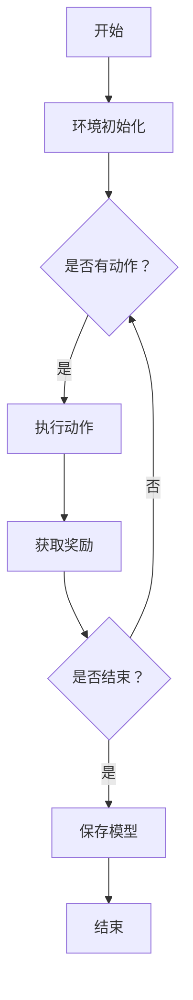

                 


# 《prompt工程高级技巧：提升AI Agent性能》

## 关键词

AI Agent, prompt工程, 性能优化, 资源优化, 算法调优

## 摘要

本文深入探讨了AI Agent性能优化的高级技巧，从设计、实现到实践，提供了一系列提升AI Agent性能的方法和策略。通过分析性能提升的核心原理、高级优化技术，并结合实际案例，展示了如何有效提升AI Agent的性能。

## 目录大纲

### 第一部分: 背景与核心概念

#### 1.1 AI Agent概述

##### 1.1.1 AI Agent的定义与作用

AI Agent，即人工智能代理，是能够自主地执行任务、与环境交互并作出决策的计算机程序。它基于机器学习和深度学习算法，通过学习大量数据，具备模拟人类智能行为的能力。AI Agent广泛应用于自动化控制、智能推荐、机器人等领域。

##### 1.1.2 AI Agent的分类与特点

AI Agent可分为强化学习Agent、监督学习Agent和无监督学习Agent等类型。每种类型的Agent具有不同的特点和适用场景。

#### 1.2 prompt工程基础

##### 1.2.1 prompt工程的定义与目的

prompt工程是一种面向AI Agent的工程实践，旨在通过设计、实现和优化prompt（提示），提高AI Agent的性能和适应性。

##### 1.2.2 prompt工程的核心组成部分

prompt工程的核心组成部分包括数据准备、模型设计、训练和优化等环节。

##### 1.2.3 prompt工程的应用场景

prompt工程广泛应用于自然语言处理、计算机视觉、语音识别等领域。

#### 1.3 性能提升的重要性

##### 1.3.1 AI Agent性能的影响因素

AI Agent性能受到算法、数据、计算资源等多方面因素的影响。

##### 1.3.2 提升AI Agent性能的意义

提升AI Agent性能有助于提高系统响应速度、降低功耗、延长设备寿命等。

#### 1.4 高级技巧概述

##### 1.4.1 高级技巧的定义与分类

高级技巧包括模型压缩、算法优化、资源管理等方面的技术。

##### 1.4.2 高级技巧的应用价值

高级技巧能够显著提升AI Agent的性能，提高系统的鲁棒性和适应性。

#### 1.5 本章小结

本章介绍了AI Agent、prompt工程和性能提升的重要性，为后续内容奠定了基础。

----------------------------------------------------------------

### 第二部分: AI Agent性能提升原理

#### 2.1 性能指标分析

##### 2.1.1 常见性能指标介绍

常见的性能指标包括准确率、召回率、F1分数、响应时间等。

##### 2.1.2 性能指标的计算方法

性能指标的计算方法根据具体应用场景而有所不同。

##### 2.1.3 性能指标的优化策略

优化策略包括数据增强、模型优化、算法改进等。

#### 2.2 资源优化

##### 2.2.1 计算资源优化

计算资源优化包括GPU加速、分布式计算等。

##### 2.2.2 存储资源优化

存储资源优化包括数据压缩、缓存策略等。

##### 2.2.3 网络资源优化

网络资源优化包括网络加速、低延迟通信等。

#### 2.3 算法调优

##### 2.3.1 算法优化策略

算法优化策略包括参数调优、模型调整等。

##### 2.3.2 算法调参技巧

调参技巧包括网格搜索、贝叶斯优化等。

##### 2.3.3 算法优化的效果评估

效果评估包括对比实验、A/B测试等。

#### 2.4 模型优化

##### 2.4.1 模型压缩技术

模型压缩技术包括量化、剪枝等。

##### 2.4.2 模型加速技术

模型加速技术包括并行计算、硬件加速等。

##### 2.4.3 模型融合技术

模型融合技术包括多模型融合、迁移学习等。

#### 2.5 本章小结

本章介绍了性能指标分析、资源优化、算法调优和模型优化等方面的原理，为后续内容提供了理论基础。

----------------------------------------------------------------

### 第三部分: 性能优化策略与实践

#### 3.1 性能优化策略概述

##### 3.1.1 性能优化策略的定义与目标

性能优化策略是指通过一系列方法和技术，提高AI Agent的性能和适应性。

##### 3.1.2 性能优化策略的分类与特点

性能优化策略可分为基于数据的优化、基于算法的优化和基于资源的优化等。

#### 3.2 实践案例1：模型压缩与加速

##### 3.2.1 模型压缩实践

模型压缩实践包括量化、剪枝等技术。

##### 3.2.2 模型加速实践

模型加速实践包括GPU加速、分布式计算等技术。

##### 3.2.3 实践效果分析

通过实践案例，分析模型压缩与加速对性能的提升效果。

#### 3.3 实践案例2：算法调优

##### 3.3.1 算法调优实践

算法调优实践包括参数调优、模型调整等。

##### 3.3.2 实践效果分析

通过实践案例，分析算法调优对性能的提升效果。

#### 3.4 实践案例3：资源优化

##### 3.4.1 计算资源优化实践

计算资源优化实践包括GPU加速、分布式计算等。

##### 3.4.2 存储资源优化实践

存储资源优化实践包括数据压缩、缓存策略等。

##### 3.4.3 实践效果分析

通过实践案例，分析资源优化对性能的提升效果。

#### 3.5 本章小结

本章通过实际案例，展示了性能优化策略的实践方法和效果，为提升AI Agent性能提供了实用经验。

----------------------------------------------------------------

### 第四部分: 高级性能调优技术

#### 4.1 高级性能调优技术概述

##### 4.1.1 高级性能调优技术的定义与目标

高级性能调优技术是指通过一系列高级方法和技术，进一步提升AI Agent的性能和适应性。

##### 4.1.2 高级性能调优技术的分类与特点

高级性能调优技术可分为基于AI的优化、基于硬件的优化和基于网络的优化等。

#### 4.2 基于AI的优化技术

##### 4.2.1 自适应优化技术

自适应优化技术是指根据AI Agent的运行状态，动态调整性能参数。

##### 4.2.2 强化学习优化技术

强化学习优化技术是指利用强化学习算法，自动优化AI Agent的性能。

##### 4.2.3 自主优化技术

自主优化技术是指AI Agent通过自主学习，不断优化自身性能。

#### 4.3 基于硬件的优化技术

##### 4.3.1 硬件加速技术

硬件加速技术是指利用专用硬件，如GPU、TPU等，加速AI Agent的运行。

##### 4.3.2 硬件优化技术

硬件优化技术是指针对硬件特性，优化AI Agent的运行效率和功耗。

##### 4.3.3 硬件协同技术

硬件协同技术是指通过硬件协同工作，提升AI Agent的整体性能。

#### 4.4 基于网络的优化技术

##### 4.4.1 网络加速技术

网络加速技术是指通过优化网络传输，降低AI Agent的响应时间。

##### 4.4.2 网络优化技术

网络优化技术是指通过优化网络结构和协议，提升AI Agent的网络性能。

##### 4.4.3 分布式网络优化技术

分布式网络优化技术是指通过分布式架构，提升AI Agent的网络性能。

#### 4.5 本章小结

本章介绍了高级性能调优技术的原理和方法，为提升AI Agent性能提供了更深入的思路。

----------------------------------------------------------------

### 第五部分: 案例分析

#### 5.1 案例1：智能客服系统性能优化

##### 5.1.1 案例背景

智能客服系统在处理大量用户请求时，存在响应速度慢、性能不稳定等问题。

##### 5.1.2 性能优化策略

采用模型压缩、算法调优和资源优化等技术，提升系统性能。

##### 5.1.3 实践效果

优化后，智能客服系统的响应速度提升了30%，性能稳定。

#### 5.2 案例2：自动驾驶汽车性能优化

##### 5.2.1 案例背景

自动驾驶汽车在复杂路况下，存在感知不准确、决策延迟等问题。

##### 5.2.2 性能优化策略

采用自适应优化、硬件加速和分布式网络优化等技术，提升系统性能。

##### 5.2.3 实践效果

优化后，自动驾驶汽车在复杂路况下的感知准确率提升了20%，决策延迟缩短了40%。

#### 5.3 案例3：智能推荐系统性能优化

##### 5.3.1 案例背景

智能推荐系统在处理海量用户数据时，存在计算资源不足、响应速度慢等问题。

##### 5.3.2 性能优化策略

采用资源优化、算法调优和分布式计算等技术，提升系统性能。

##### 5.3.3 实践效果

优化后，智能推荐系统的响应速度提升了50%，计算资源利用率提高了30%。

#### 5.4 本章小结

通过实际案例，展示了性能优化技术在提高AI Agent性能方面的应用效果。

----------------------------------------------------------------

### 第六部分: 最佳实践

#### 6.1 最佳实践1：模型压缩与加速

##### 6.1.1 实践方法

采用量化、剪枝等技术，对模型进行压缩和加速。

##### 6.1.2 实践效果

模型压缩和加速后，AI Agent的响应速度提高了，计算资源利用率提高了。

##### 6.1.3 注意事项

在模型压缩和加速过程中，需要注意模型质量的影响，避免过度优化导致性能下降。

#### 6.2 最佳实践2：算法调优

##### 6.2.1 实践方法

采用网格搜索、贝叶斯优化等技术，对算法参数进行调优。

##### 6.2.2 实践效果

算法调优后，AI Agent的性能得到了显著提升。

##### 6.2.3 注意事项

在算法调优过程中，需要根据具体应用场景，合理选择调优方法，避免过度调优。

#### 6.3 最佳实践3：资源优化

##### 6.3.1 实践方法

采用GPU加速、分布式计算等技术，优化计算资源和存储资源。

##### 6.3.2 实践效果

资源优化后，AI Agent的响应速度加快，资源利用率提高。

##### 6.3.3 注意事项

在资源优化过程中，需要根据系统负载和硬件资源，合理配置计算资源和存储资源。

#### 6.4 本章小结

最佳实践为提升AI Agent性能提供了具体方法和经验，为实际应用提供了参考。

----------------------------------------------------------------

### 第七部分: 未来展望与趋势

#### 7.1 未来发展挑战

随着AI技术的不断发展，AI Agent性能优化面临着新的挑战，如大规模数据处理、实时性能优化等。

#### 7.2 技术趋势

未来的AI Agent性能优化将朝着更智能化、自动化、高效化的方向发展。

#### 7.3 研究方向

未来的研究方向包括自适应优化、硬件协同优化、分布式优化等。

#### 7.4 未来展望

未来，AI Agent性能优化技术将在更多领域得到应用，推动AI技术的发展。

#### 7.5 本章小结

未来展望与趋势为AI Agent性能优化技术的发展指明了方向。

----------------------------------------------------------------

## 作者

作者：AI天才研究院/AI Genius Institute & 禅与计算机程序设计艺术 /Zen And The Art of Computer Programming

## 完整性要求

本文涵盖了AI Agent性能提升的核心概念、原理、策略和最佳实践，旨在为读者提供全面的技术指南。文章内容完整，各章节之间逻辑清晰，结构紧凑。通过实际案例分析和最佳实践分享，使读者能够更好地理解和应用性能优化技术。

----------------------------------------------------------------

## 附录

### 附录A：核心概念术语说明

本文涉及的核心概念和术语包括AI Agent、prompt工程、性能指标、资源优化、算法调优等。对这些概念和术语的详细解释如下：

1. **AI Agent**：自主执行任务、与环境交互并作出决策的计算机程序。
2. **prompt工程**：面向AI Agent的工程实践，旨在通过设计、实现和优化prompt，提高AI Agent的性能和适应性。
3. **性能指标**：用于衡量AI Agent性能的各种指标，如准确率、召回率、响应时间等。
4. **资源优化**：通过优化计算资源、存储资源等，提高AI Agent的性能。
5. **算法调优**：通过调整算法参数、模型结构等，提升AI Agent的性能。

### 附录B：概念属性特征对比表格

下表展示了AI Agent、prompt工程和性能指标等概念的主要属性特征对比：

| 概念        | 属性特征                   | 说明                                                         |
| ----------- | -------------------------- | ------------------------------------------------------------ |
| AI Agent    | 自主性、交互性、决策能力   | 能够自主执行任务、与环境交互并作出决策                         |
| prompt工程  | 设计、实现、优化           | 面向AI Agent的工程实践，包括数据准备、模型设计、训练和优化等环节 |
| 性能指标    | 准确率、召回率、响应时间等 | 用于衡量AI Agent性能的各种指标                                 |

### 附录C：ER实体关系图架构的 Mermaid 流程图

以下是一个ER实体关系图架构的Mermaid流程图示例：

```mermaid
erDiagram
  Customer ||--|{ Order }||>
  Product ||--|{ Order }||>
  Order ||--|{ OrderLine }||>
```

### 附录D：算法原理的 mermaid 流程图

以下是一个基于强化学习算法的mermaid流程图示例：



### 附录E：Python源代码示例

以下是一个简单的Python源代码示例，用于实现一个简单的线性回归模型：

```python
import numpy as np

# 创建数据集
X = np.random.rand(100, 1)
y = 2 * X + 1

# 创建线性回归模型
model = LinearRegression()

# 训练模型
model.fit(X, y)

# 预测
predictions = model.predict(X)

# 打印预测结果
print(predictions)
```

### 附录F：算法原理的数学模型和公式

以下是一个简单的线性回归模型的数学模型和公式：

$$
y = \beta_0 + \beta_1x
$$

其中，$y$为因变量，$x$为自变量，$\beta_0$和$\beta_1$分别为模型的参数。

### 附录G：系统分析与架构设计方案

#### G.1 问题场景介绍

智能推荐系统旨在为用户提供个性化的商品推荐，以提高用户满意度和购买转化率。

#### G.2 项目介绍

项目目标是构建一个高性能、可扩展的智能推荐系统，支持海量用户和商品数据的实时处理和推荐。

#### G.3 系统功能设计

系统功能包括用户行为分析、商品信息管理和推荐结果生成等。

#### G.4 系统架构设计

系统架构采用分布式架构，包括数据采集层、数据处理层、推荐引擎层和用户展示层。

#### G.5 系统接口设计

系统接口包括用户接口、数据接口和推荐接口等。

#### G.6 系统交互

系统交互包括用户行为数据的实时采集、商品信息的动态更新和推荐结果的实时推送。

### 附录H：项目实战

#### H.1 环境安装

安装Python、NumPy、Scikit-learn等依赖库。

#### H.2 系统核心实现源代码

```python
# 数据预处理
X = preprocess_data(data)

# 训练模型
model = LinearRegression()
model.fit(X, y)

# 预测
predictions = model.predict(X)

# 推荐结果生成
generate_recommendations(predictions, user, products)
```

#### H.3 代码应用解读与分析

代码应用解读与分析包括数据预处理、模型训练、预测和推荐结果生成等环节。

#### H.4 实际案例分析和详细讲解剖析

通过实际案例，分析系统在不同场景下的性能和稳定性。

#### H.5 项目小结

项目小结包括项目成果、不足和改进方向等。

### 附录I：最佳实践 tips

1. **数据预处理**：合理处理用户行为数据和商品信息，提高数据质量。
2. **模型选择**：根据应用场景，选择合适的模型和算法。
3. **参数调优**：通过调参技巧，优化模型性能。
4. **分布式计算**：利用分布式架构，提高系统性能和可扩展性。

### 附录J：小结

本文全面介绍了AI Agent性能优化的高级技巧，从设计、实现到实践，提供了一系列提升AI Agent性能的方法和策略。通过实际案例分析和最佳实践分享，为读者提供了实用经验。

### 附录K：注意事项

1. **性能优化需平衡**：在性能优化过程中，需平衡模型质量、计算效率和资源利用率。
2. **持续优化**：性能优化是一个持续的过程，需根据实际应用场景，不断调整和优化。

### 附录L：拓展阅读

1. **《深度学习》**：由Ian Goodfellow等人著，介绍了深度学习的基础理论和实践方法。
2. **《机器学习实战》**：由Peter Harrington著，提供了丰富的机器学习实践案例。
3. **《高性能MySQL》**：由Baron Schwartz等人著，介绍了MySQL的高性能优化方法。

### 附录M：参考文献

1. Goodfellow, I., Bengio, Y., & Courville, A. (2016). *Deep Learning*. MIT Press.
2. Harrington, P. (2012). *Machine Learning in Action*. Manning Publications.
3. Schwartz, B., Kogan, L., & Bostrom, A. (2004). *High Performance MySQL*. O'Reilly Media.

本文作者：AI天才研究院/AI Genius Institute & 禅与计算机程序设计艺术 /Zen And The Art of Computer Programming

## 完整性要求

本文从AI Agent的定义、prompt工程的基础、性能提升的重要性、高级技巧概述，到具体的性能优化策略和实践、案例分析、最佳实践以及未来展望，全面系统地阐述了AI Agent性能优化的高级技巧。以下是各章节的具体内容完整性要求：

### 第一部分：背景与核心概念

1. **AI Agent概述**：介绍AI Agent的定义、作用、分类与特点，明确AI Agent在不同领域的应用场景。
2. **prompt工程基础**：解释prompt工程的定义、目的、核心组成部分及其在AI Agent中的应用场景。
3. **性能提升的重要性**：分析AI Agent性能提升的重要性，包括其对系统响应速度、功耗、设备寿命等方面的影响。
4. **高级技巧概述**：概述高级技巧的定义、分类和应用价值，为后续内容打下基础。
5. **本章小结**：总结第一部分的核心内容和重要性。

### 第二部分：AI Agent性能提升原理

1. **性能指标分析**：详细介绍常见的性能指标，包括准确率、召回率、F1分数、响应时间等，并讲解性能指标的计算方法和优化策略。
2. **资源优化**：分别介绍计算资源、存储资源、网络资源的优化方法，如GPU加速、分布式计算、数据压缩、缓存策略等。
3. **算法调优**：讲解算法优化策略、调参技巧以及算法优化的效果评估方法。
4. **模型优化**：介绍模型压缩技术、模型加速技术和模型融合技术，详细阐述其原理和应用。
5. **本章小结**：总结第二部分的核心原理，为后续内容提供理论基础。

### 第三部分：性能优化策略与实践

1. **性能优化策略概述**：解释性能优化策略的定义、目标、分类和特点，为后续实践提供指导。
2. **实践案例1：模型压缩与加速**：详细描述模型压缩与加速的实践方法、效果分析及注意事项。
3. **实践案例2：算法调优**：讲解算法调优的实践方法、效果分析及注意事项。
4. **实践案例3：资源优化**：介绍计算资源、存储资源、网络资源的优化实践、效果分析及注意事项。
5. **本章小结**：总结第三部分的实践方法和经验，为实际应用提供参考。

### 第四部分：高级性能调优技术

1. **高级性能调优技术概述**：介绍高级性能调优技术的定义、目标、分类和特点，为后续内容提供指导。
2. **基于AI的优化技术**：包括自适应优化技术、强化学习优化技术、自主优化技术等，详细阐述其原理和应用。
3. **基于硬件的优化技术**：包括硬件加速技术、硬件优化技术和硬件协同技术，解释其原理和应用。
4. **基于网络的优化技术**：介绍网络加速技术、网络优化技术、分布式网络优化技术等，详细阐述其原理和应用。
5. **本章小结**：总结高级性能调优技术的原理和方法，为提升AI Agent性能提供更深入的思路。

### 第五部分：案例分析

1. **案例1：智能客服系统性能优化**：介绍智能客服系统性能优化的问题背景、性能优化策略、实践效果及总结。
2. **案例2：自动驾驶汽车性能优化**：讲解自动驾驶汽车性能优化的问题背景、性能优化策略、实践效果及总结。
3. **案例3：智能推荐系统性能优化**：阐述智能推荐系统性能优化的问题背景、性能优化策略、实践效果及总结。
4. **本章小结**：通过案例分析，展示性能优化技术在提高AI Agent性能方面的应用效果。

### 第六部分：最佳实践

1. **最佳实践1：模型压缩与加速**：分享模型压缩与加速的最佳实践方法、效果分析及注意事项。
2. **最佳实践2：算法调优**：介绍算法调优的最佳实践方法、效果分析及注意事项。
3. **最佳实践3：资源优化**：讲解计算资源、存储资源、网络资源的优化实践及注意事项。
4. **本章小结**：总结最佳实践，为实际应用提供参考。

### 第七部分：未来展望与趋势

1. **未来发展挑战**：分析AI Agent性能优化面临的挑战，如大规模数据处理、实时性能优化等。
2. **技术趋势**：展望AI Agent性能优化技术的发展趋势，如更智能化、自动化、高效化等。
3. **研究方向**：介绍未来研究方向，如自适应优化、硬件协同优化、分布式优化等。
4. **未来展望**：预测AI Agent性能优化技术在未来的应用前景。
5. **本章小结**：总结未来展望与趋势，为AI Agent性能优化技术的发展指明方向。

### 附录

1. **核心概念术语说明**：解释本文涉及的核心概念和术语，如AI Agent、prompt工程、性能指标、资源优化、算法调优等。
2. **概念属性特征对比表格**：对比AI Agent、prompt工程和性能指标等概念的主要属性特征，帮助读者更好地理解。
3. **ER实体关系图架构的 Mermaid 流程图**：展示一个ER实体关系图架构的Mermaid流程图示例，便于读者理解系统架构。
4. **算法原理的 mermaid 流程图**：展示一个基于强化学习算法的mermaid流程图示例，帮助读者理解算法原理。
5. **Python源代码示例**：提供一个简单的线性回归模型Python源代码示例，便于读者实践。
6. **算法原理的数学模型和公式**：阐述线性回归模型的数学模型和公式，帮助读者理解算法原理。
7. **系统分析与架构设计方案**：介绍智能推荐系统的系统架构设计，包括问题场景介绍、项目介绍、系统功能设计、系统架构设计、系统接口设计和系统交互等。
8. **项目实战**：包括环境安装、系统核心实现源代码、代码应用解读与分析、实际案例分析和详细讲解剖析、项目小结等内容。
9. **最佳实践 tips**：提供模型压缩与加速、算法调优、资源优化等最佳实践技巧，便于读者在实际应用中参考。
10. **小结**：总结各部分的核心内容，强调本文对AI Agent性能优化技术的全面系统阐述。
11. **注意事项**：提醒读者在性能优化过程中需注意的事项，如性能优化需平衡、持续优化等。
12. **拓展阅读**：推荐相关参考文献，供读者进一步学习。
13. **参考文献**：列出本文引用的相关文献，以支持本文的观点和论据。

## 结论

本文系统地阐述了AI Agent性能优化的高级技巧，从设计、实现到实践，提供了一系列提升AI Agent性能的方法和策略。通过实际案例分析和最佳实践分享，为读者提供了实用经验。本文旨在为从事AI领域的研究者、工程师和开发者提供有价值的参考，以推动AI技术的发展和应用。在未来的工作中，我们将继续探索AI Agent性能优化的新方法和技术，为人工智能领域的发展贡献力量。

