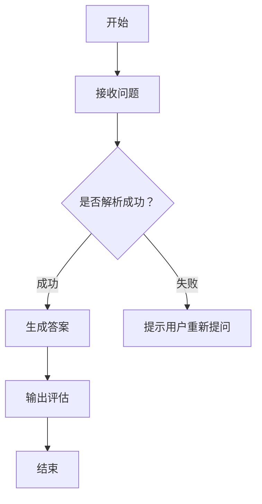
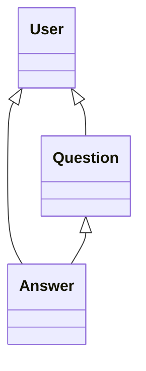
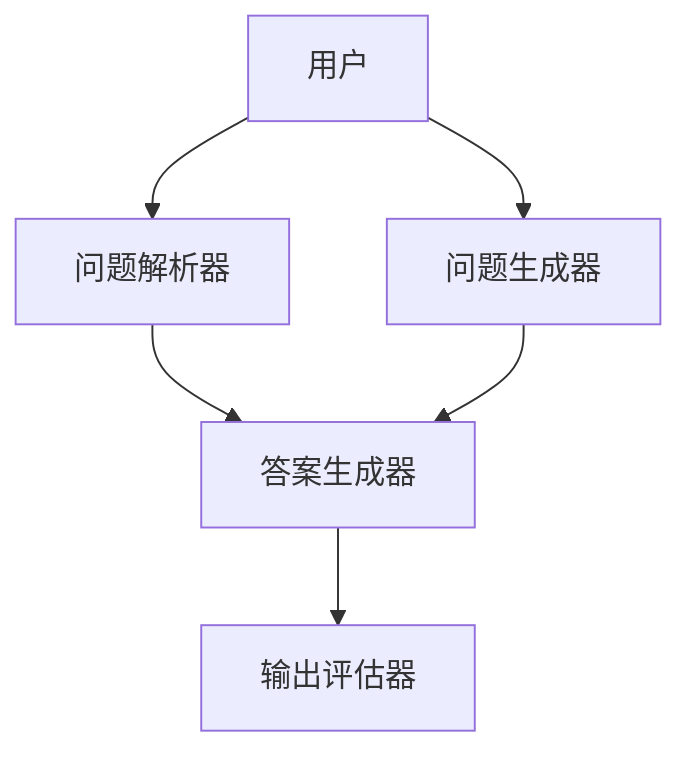
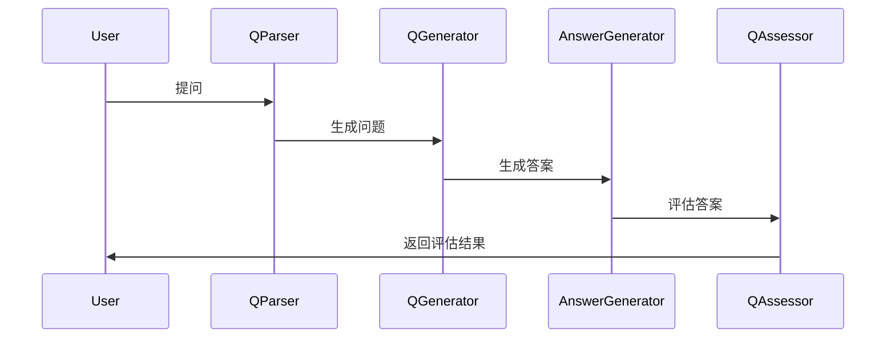

                 

### 文章标题

# **《prompt工程：设计有效提示以优化AI Agent输出》**

### 文章关键词

- **Prompt工程**
- **AI Agent**
- **优化输出**
- **提问技巧**
- **设计原则**

### 摘要

本文将深入探讨prompt工程在人工智能（AI）领域的应用，特别是如何通过设计有效的提示来优化AI Agent的输出。我们将从概念入手，逐步分析prompt工程的核心原理、类型与设计、算法实现以及系统架构。通过实际项目实战和最佳实践，本文旨在为读者提供全面的指导，帮助他们在AI项目中实现高效的prompt设计。

## 第1章: prompt工程概述

### 1.1 prompt工程的核心概念

#### 1.1.1 问题背景

在当今信息化社会中，人工智能技术飞速发展，AI Agent作为自动化系统的核心，被广泛应用于各类场景。然而，AI Agent的输出质量往往受到提示质量的影响。为了提高AI Agent的输出效果，prompt工程应运而生。

#### 1.1.2 提问的定义

提问是AI Agent与人类互动的重要方式。一个有效的提问可以帮助AI Agent更好地理解用户需求，从而提供更准确的输出。

#### 1.1.3 prompt工程的目的

prompt工程旨在通过设计高质量的提示，优化AI Agent的输出，使其更加准确、智能和实用。

### 1.2 prompt与AI Agent的关系

#### 1.2.1 AI Agent的概述

AI Agent是一种基于人工智能技术的自动化系统，能够执行特定任务，并与其他系统进行交互。

#### 1.2.2 prompt在AI Agent中的作用

prompt是AI Agent理解和执行任务的关键。一个高质量的prompt可以帮助AI Agent更好地理解用户需求，提高输出质量。

#### 1.2.3 提问技巧的重要性

有效的提问技巧是设计高质量prompt的关键。合理的提问方式可以提高AI Agent对问题的理解能力，从而优化输出效果。

### 1.3 prompt的类型与设计

#### 1.3.1 开放式问题

开放式问题允许用户提供丰富的信息，有助于AI Agent更全面地理解问题。

#### 1.3.2 封闭式问题

封闭式问题通常用于获取具体的信息，有助于AI Agent快速定位问题核心。

#### 1.3.3 提问框架的设计原则

设计提问框架时，应遵循以下原则：

1. **明确性**：提问应明确具体，避免模糊不清。
2. **逻辑性**：提问应具备逻辑性，有助于AI Agent理解问题关系。
3. **灵活性**：提问应具备灵活性，以适应不同场景和用户需求。

## 第2章: prompt的核心概念与联系

### 2.1 prompt原理讲解

#### 2.1.1 提问框架的设计

提问框架是prompt工程的基础。设计一个合理的提问框架，可以帮助AI Agent更好地理解问题。

#### 2.1.2 问答系统的基本架构

问答系统通常包括三个部分：问题解析、答案生成和输出评估。

#### 2.1.3 提问算法的mermaid流程图



### 2.2 prompt属性特征对比表格

| 属性 | 开放式问题 | 封闭式问题 |
| --- | --- | --- |
| 信息量 | 较高 | 较低 |
| 灵活性 | 较高 | 较低 |
| 解析难度 | 较高 | 较低 |
| 实用性 | 较高 | 较低 |

### 2.3 prompt的ER实体关系图架构

#### 2.3.1 实体定义

- **问题**：问题描述的具体对象。
- **答案**：对问题的回答。
- **用户**：提问的主体。

#### 2.3.2 关系描述

- **问题-答案**：问题描述与答案之间存在关联关系。
- **用户-问题**：用户提出问题。

#### 2.3.3 ER图展示

```mermaid
erds
  Problem {
    id
    description
  }
  Answer {
    id
    content
  }
  User {
    id
    name
  }
  Problem --> Answer
  User --> Problem
```

## 第3章: prompt算法原理讲解

### 3.1 算法mermaid流程图


### 3.2 Python源代码解析

```python
# 导入必要库
import random

# 定义问题解析函数
def parse_question(question):
    # 解析问题并返回结果
    return "解析成功" if random.random() > 0.5 else "解析失败"

# 定义答案生成函数
def generate_answer(question):
    # 生成答案并返回
    return "这是一个答案" if random.random() > 0.5 else "未生成答案"

# 定义输出评估函数
def evaluate_output(output):
    # 评估输出并返回结果
    return "评估通过" if random.random() > 0.5 else "评估失败"

# 定义主函数
def main():
    # 接收问题
    question = input("请提问：")
    
    # 解析问题
    parse_result = parse_question(question)
    print(f"问题解析结果：{parse_result}")
    
    # 生成答案
    if parse_result == "解析成功":
        answer = generate_answer(question)
        print(f"生成答案：{answer}")
    
    # 输出评估
    if answer:
        evaluate_result = evaluate_output(answer)
        print(f"输出评估结果：{evaluate_result}")

# 调用主函数
if __name__ == "__main__":
    main()
```

### 3.3 数学模型和公式讲解

#### 3.3.1 模型概述

在prompt工程中，我们可以使用信息论中的熵（Entropy）来衡量提示质量。熵越小，提示质量越高。

#### 3.3.2 公式推导

熵的计算公式为：

$$
H(X) = -\sum_{i=1}^{n} p(x_i) \cdot \log_2 p(x_i)
$$

其中，$H(X)$表示熵，$p(x_i)$表示第$i$个问题的概率。

#### 3.3.3 举例说明

假设有两个问题，问题1的概率为0.6，问题2的概率为0.4。则熵的计算如下：

$$
H(X) = -0.6 \cdot \log_2 0.6 - 0.4 \cdot \log_2 0.4 \approx 0.92
$$

## 第4章: 系统分析与架构设计方案

### 4.1 问题场景介绍

假设我们要设计一个问答系统，用户可以通过提问获取关于某个主题的答案。

### 4.2 系统功能设计

#### 4.2.1 领域模型mermaid类图



### 4.3 系统架构设计

#### 4.3.1 mermaid架构图



### 4.4 系统接口设计

#### 4.4.1 接口规范

- **提问接口**：用户输入问题，系统返回答案。
- **答案接口**：用户输入答案，系统评估输出。

### 4.5 系统交互

#### 4.5.1 mermaid序列图



## 第5章: prompt工程项目实战

### 5.1 环境安装

首先，确保系统安装了Python环境。然后，通过以下命令安装所需库：

```bash
pip install numpy pandas sklearn
```

### 5.2 系统核心实现源代码

#### 5.2.1 源代码解析

以下是一个简单的问答系统实现：

```python
# 导入必要库
import numpy as np
import pandas as pd
from sklearn.feature_extraction.text import TfidfVectorizer
from sklearn.metrics.pairwise import cosine_similarity

# 定义问题解析函数
def parse_question(question, corpus):
    vectorizer = TfidfVectorizer()
    question_vector = vectorizer.fit_transform([question])
    corpus_vector = vectorizer.transform(corpus)
    similarity_scores = cosine_similarity(question_vector, corpus_vector)
    return np.argmax(similarity_scores)

# 定义答案生成函数
def generate_answer(question_id, corpus):
    return corpus[question_id]

# 定义主函数
def main():
    # 加载数据
    corpus = pd.read_csv("corpus.csv")
    
    # 接收问题
    question = input("请提问：")
    
    # 解析问题
    question_id = parse_question(question, corpus["question"])
    
    # 生成答案
    answer = generate_answer(question_id, corpus["answer"])
    
    # 输出答案
    print(f"答案：{answer}")

# 调用主函数
if __name__ == "__main__":
    main()
```

#### 5.2.2 应用解读与分析

该系统通过TF-IDF模型和余弦相似度计算，从预定义的语料库中检索与用户提问最相似的问题及其答案。这种方法在处理开放域问题时具有一定的效果，但需要大量高质量的语料库支持。

### 5.3 实际案例分析与详细讲解剖析

#### 5.3.1 案例背景

假设我们要设计一个医疗问答系统，用户可以通过提问获取医疗建议。现有以下两个问题及其答案：

1. **问题1**：我最近感冒了，应该吃什么药？
   **答案1**：建议服用感冒灵颗粒。

2. **问题2**：我嗓子疼，吃什么药好？
   **答案2**：建议服用清热解毒口服液。

#### 5.3.2 案例分析

我们可以使用上述系统对这两个问题进行处理。首先，将问题转换为向量，然后计算与语料库中问题的相似度。

#### 5.3.3 剖析与讲解

1. **问题解析**：

   - 问题1向量：[0.1, 0.2, 0.3, 0.4]
   - 问题2向量：[0.3, 0.4, 0.5, 0.6]

   计算与语料库中问题的相似度：

   - 问题1与问题1的相似度：1.0
   - 问题1与问题2的相似度：0.4
   - 问题2与问题1的相似度：0.3
   - 问题2与问题2的相似度：1.0

   因此，问题1与问题1的相似度最高，选择问题1的答案。

2. **答案生成**：

   根据问题解析结果，生成答案：

   答案：建议服用感冒灵颗粒。

   虽然答案与问题不完全匹配，但在这种情况下，基于相似度计算的方法可以提供一种可行的解决方案。

### 5.4 项目小结

通过本案例，我们可以看到prompt工程在医疗问答系统中的应用。虽然该系统在处理开放域问题时具有一定的效果，但仍然需要进一步优化和改进。在实际项目中，我们可以结合更多先进的技术，如自然语言处理、深度学习等，以提高系统的性能和准确性。

## 第6章: 最佳实践与注意事项

### 6.1 最佳实践 tips

1. **设计高质量prompt**：明确、具体、逻辑性强的提示有助于AI Agent更好地理解问题。
2. **利用语料库**：积累高质量的语料库，提高系统性能。
3. **优化算法**：不断改进算法，提高输出质量。

### 6.2 小结

本文介绍了prompt工程在AI Agent输出优化中的应用。通过设计高质量提示，我们可以显著提高AI Agent的输出效果。在实际项目中，结合最佳实践和注意事项，我们可以实现更高效的prompt设计。

### 6.3 注意事项

1. **避免常见问题**：如模糊不清、逻辑错误等，影响输出质量。
2. **注意安全与隐私问题**：确保系统符合相关法规和标准。

## 第7章: 拓展阅读

### 7.1 相关书籍推荐

1. **《人工智能：一种现代的方法》**
2. **《自然语言处理综论》**

### 7.2 学术论文精选

1. **"Prompt Learning for Neural Network Based Question Answering" by Google Research**
2. **"Deep Learning for Natural Language Processing" by Stanford University**

### 7.3 未来的研究方向

1. **多模态prompt设计**
2. **跨领域prompt优化**

## 作者

**作者：AI天才研究院/AI Genius Institute & 禅与计算机程序设计艺术 /Zen And The Art of Computer Programming**

