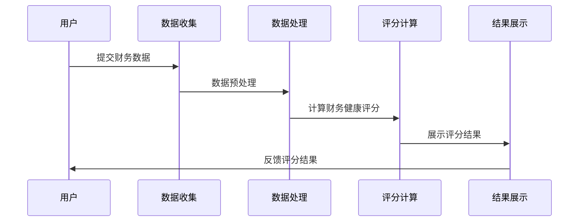
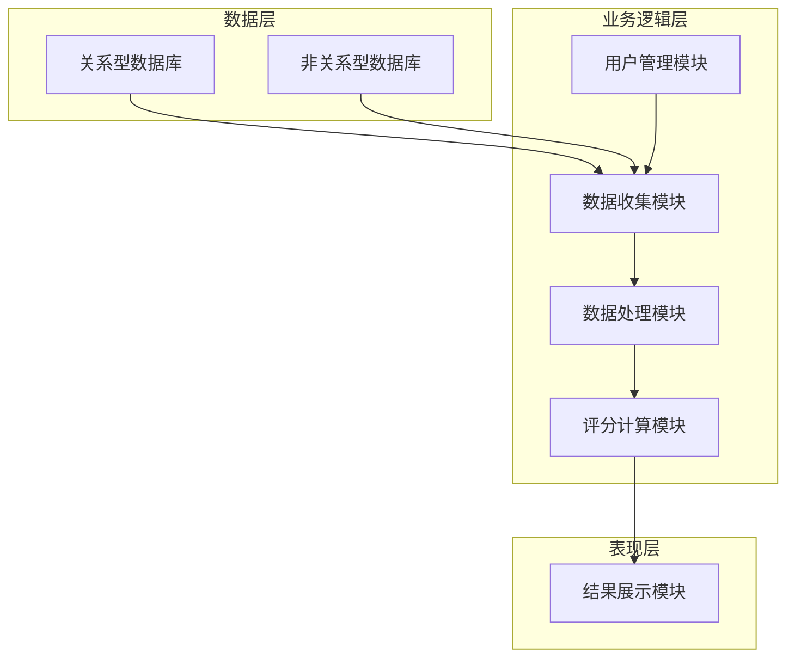
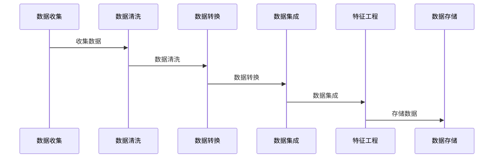
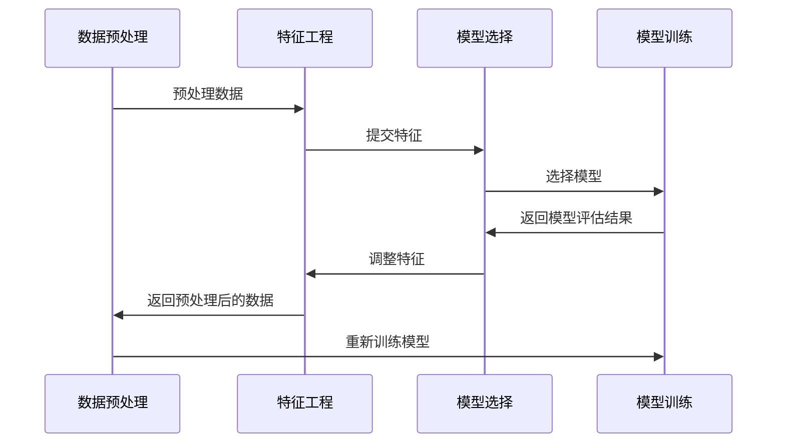

                 

# 个人财务健康评分系统设计

> 关键词：个人财务健康、评分系统、数据分析、金融科技、系统架构

> 摘要：本文将探讨个人财务健康评分系统的设计与实现。通过明确财务健康的重要性，介绍评分系统的核心概念、架构设计、数据收集与处理、评分模型构建、系统实现与测试，以及系统部署与维护，本文旨在为金融科技从业者和对个人财务管理感兴趣的读者提供一份全面的技术指南。

## 引言

### 财务健康的重要性

在现代社会，个人财务健康越来越受到人们的关注。一个健康的财务状况不仅可以带来经济上的安全感，还能够促进个人幸福感的提升。然而，如何衡量一个人的财务健康水平，如何对其进行有效的评估，成为一个亟待解决的问题。个人财务健康评分系统应运而生，它通过量化指标和模型，对个人的财务状况进行全面评估，提供定制化的建议和改进方案。

### 系统设计的背景和目标

随着金融科技的快速发展，利用大数据和人工智能技术来构建个人财务健康评分系统已成为可能。本系统旨在为金融机构、个人用户提供一个高效、精准的评估工具，帮助他们了解自己的财务状况，制定合理的财务规划。系统设计的目标包括：

1. **全面性**：覆盖个人财务的各个方面，包括资产、负债、收入、支出等。
2. **准确性**：通过科学的模型和算法，确保评分结果的准确性。
3. **易用性**：界面友好，操作简便，便于用户理解和应用。
4. **实时性**：支持数据的实时更新和评分结果的动态调整。

### 本书结构安排与阅读建议

本文将按照以下结构进行展开：

1. **第1章 引言**：介绍财务健康的重要性、系统设计的背景和目标。
2. **第2章 个人财务健康核心概念**：定义财务健康，阐述核心概念和衡量指标。
3. **第3章 系统架构设计**：介绍系统需求、架构设计及模块功能。
4. **第4章 数据收集与处理**：讨论数据的来源、预处理及处理流程。
5. **第5章 评分模型构建**：讲解评分模型的理论基础和构建流程。
6. **第6章 系统实现与测试**：介绍系统实现、代码编写和测试方法。
7. **第7章 系统部署与维护**：阐述系统的部署流程、维护策略。
8. **第8章 最佳实践与案例分析**：分享实际案例和最佳实践。

读者可根据需求有选择地阅读，也可按顺序系统性地学习，以便更好地理解个人财务健康评分系统的设计与实现。

## 目录大纲设计思路

为了设计出《个人财务健康评分系统设计》这本书的完整目录大纲，我们需要遵循以下步骤：

1. **明确书籍主题和目标读者**：
   - 书名《个人财务健康评分系统设计》表明书籍将围绕个人财务健康的评估系统进行讨论。
   - 目标读者可能包括金融科技从业人员、财务分析爱好者、以及对个人财务管理有需求的普通读者。

2. **确定核心章节内容**：
   - 核心章节应涵盖系统设计的各个方面，包括背景介绍、核心概念、系统架构、实现方法、实际应用和最佳实践等。

3. **搭建目录框架**：
   - 目录应包括至少7章，每章细分为多个小节，以确保内容的全面性和逻辑性。

4. **使用Markdown格式**：
   - 目录将使用Markdown格式表示，确保易于阅读和编辑。

5. **内容简洁明了**：
   - 在保持目录结构完整性的同时，避免冗长和重复，确保每个章节和小节的内容简明扼要。

### 目录大纲设计

根据上述思路，以下是《个人财务健康评分系统设计》的目录大纲：

```markdown
# 《个人财务健康评分系统设计》目录大纲

----------------------------------------------------------------

## 第1章 引言

### 1.1 财务健康的重要性

### 1.2 系统设计的背景和目标

### 1.3 本书结构安排与阅读建议

## 第2章 个人财务健康核心概念

### 2.1 财务健康定义与衡量指标

#### 2.1.1 概念结构

#### 2.1.2 核心指标解析

### 2.2 财务健康模型概述

#### 2.2.1 模型类型与适用场景

#### 2.2.2 模型构建原则

## 第3章 系统架构设计

### 3.1 系统需求分析

#### 3.1.1 功能需求

#### 3.1.2 非功能需求

### 3.2 系统架构设计

#### 3.2.1 系统总体架构

#### 3.2.2 模块分解与功能描述

## 第4章 数据收集与处理

### 4.1 数据来源

#### 4.1.1 财务数据收集

#### 4.1.2 非财务数据收集

### 4.2 数据预处理

#### 4.2.1 数据清洗

#### 4.2.2 数据集成

#### 4.2.3 数据转换

## 第5章 评分模型构建

### 5.1 评分模型理论基础

#### 5.1.1 统计学基础

#### 5.1.2 数据挖掘方法

### 5.2 评分模型构建流程

#### 5.2.1 特征工程

#### 5.2.2 模型选择

#### 5.2.3 模型训练与验证

## 第6章 系统实现与测试

### 6.1 系统开发环境配置

#### 6.1.1 硬件与软件需求

#### 6.1.2 开发工具与框架

### 6.2 代码实现

#### 6.2.1 数据处理模块

#### 6.2.2 评分计算模块

#### 6.2.3 系统接口设计

### 6.3 系统测试

#### 6.3.1 单元测试

#### 6.3.2 集成测试

## 第7章 系统部署与维护

### 7.1 系统部署

#### 7.1.1 部署流程

#### 7.1.2 部署环境配置

### 7.2 系统维护

#### 7.2.1 数据更新

#### 7.2.2 系统监控

#### 7.2.3 故障处理

## 第8章 最佳实践与案例分析

### 8.1 财务健康评分系统应用案例

#### 8.1.1 案例一：个人信用评估

#### 8.1.2 案例二：家庭财务规划

### 8.2 最佳实践总结

#### 8.2.1 设计原则

#### 8.2.2 实施经验

## 附录

### A. 术语表

### B. 参考文献

----------------------------------------------------------------
```

### 内容完整性说明

1. **背景介绍**：第1章对财务健康的重要性进行了阐述，并明确了系统设计的背景和目标。
2. **核心概念与联系**：第2章详细介绍了财务健康的定义、衡量指标及其模型概述。
3. **算法原理讲解**：第5章包含了评分模型的理论基础和构建流程，涉及统计学基础和数据挖掘方法。
4. **数学模型和数学公式 & 详细讲解 & 举例说明**：将在第5章中结合mermaid流程图和Python代码进行详细阐述。
5. **系统分析与架构设计方案**：第3章和第4章分别介绍了系统的需求分析和架构设计，包括功能需求、非功能需求、系统总体架构和模块分解。
6. **项目实战**：第6章将详细介绍系统实现与测试，包括开发环境配置、代码实现和系统测试。
7. **最佳实践与案例分析**：第8章将分享财务健康评分系统的实际应用案例和最佳实践总结。

### 第1章 引言

#### 财务健康的重要性

在现代社会，个人财务健康已经成为衡量生活质量的重要标准之一。财务健康不仅关乎个人的经济安全，还与心理健康、生活满意度和社会地位密切相关。一个健康的财务状况意味着个人能够有效地管理自己的财务资源，避免财务危机，并为未来的目标积累财富。

首先，财务健康对于经济安全至关重要。当个人拥有充足的储蓄和投资，即使在面对突发事件或失业时，也能够保持稳定的生活水平。同时，财务健康有助于个人避免高利率的债务，降低因负债而带来的财务压力。

其次，财务健康与心理健康有着密切的联系。财务困扰常常是压力和焦虑的源头，而良好的财务状况可以显著提升个人的心理健康水平。通过合理的财务规划，个人可以减少财务压力，提高生活满意度，从而享受更加平和、幸福的生活。

此外，财务健康还影响到个人的社会地位。一个具备良好财务状况的个人在社会中通常会受到更高的认可和尊重。这不仅可以提升个人的自信心，还能为职业发展带来更多机会。

#### 系统设计的背景和目标

随着金融科技（FinTech）的迅速发展，利用大数据和人工智能技术来构建个人财务健康评分系统已成为可能。金融科技不仅改变了传统金融服务的模式，也为个人财务管理提供了更多高效、便捷的工具。

**系统设计的背景**：

1. **大数据时代**：个人行为数据、财务数据等海量数据的积累为构建精准的评分模型提供了基础。
2. **人工智能技术**：机器学习和数据挖掘技术的进步，使得系统能够从数据中提取有价值的信息，提供个性化的财务建议。
3. **金融监管**：随着金融监管的加强，金融机构需要更加透明和合规地管理客户财务状况，评分系统成为了一种有效的工具。

**系统设计的目标**：

1. **全面性**：系统应覆盖个人财务的各个方面，包括资产、负债、收入、支出等，提供全面的财务健康状况评估。
2. **准确性**：通过科学的模型和算法，确保评分结果的准确性和可靠性，帮助用户了解自己的财务状况。
3. **易用性**：界面设计应简洁明了，用户操作便捷，便于用户理解和应用。
4. **实时性**：系统能够实时更新用户数据，动态调整评分结果，为用户随时提供最新的财务健康建议。
5. **个性化**：系统应能够根据用户的具体情况，提供定制化的财务建议和改进方案。

#### 本书结构安排与阅读建议

本文将按照以下结构进行展开：

1. **第1章 引言**：介绍财务健康的重要性、系统设计的背景和目标。
2. **第2章 个人财务健康核心概念**：定义财务健康，阐述核心概念和衡量指标。
3. **第3章 系统架构设计**：介绍系统需求、架构设计及模块功能。
4. **第4章 数据收集与处理**：讨论数据的来源、预处理及处理流程。
5. **第5章 评分模型构建**：讲解评分模型的理论基础和构建流程。
6. **第6章 系统实现与测试**：介绍系统实现、代码编写和测试方法。
7. **第7章 系统部署与维护**：阐述系统的部署流程、维护策略。
8. **第8章 最佳实践与案例分析**：分享实际案例和最佳实践总结。

读者可根据需求有选择地阅读，也可按顺序系统性地学习，以便更好地理解个人财务健康评分系统的设计与实现。

### 第2章 个人财务健康核心概念

#### 财务健康的定义

财务健康是一个综合性的概念，它不仅仅涉及财务状况的好坏，还包括个人的财务行为、决策能力和风险管理能力。一个健康的财务状况意味着个人能够合理规划和管理自己的财务资源，确保财务安全，并为未来的目标积累财富。

财务健康的定义可以概括为以下几点：

1. **资产状况良好**：个人拥有充足的储蓄和投资，能够应对突发事件和长期目标的实现。
2. **债务水平合理**：个人负债水平在可控范围内，没有高额利息的债务负担。
3. **收入与支出平衡**：个人收入与支出保持平衡，没有长期的财务赤字。
4. **财务行为理性**：个人在财务决策中能够遵循合理的原则，避免冲动消费和盲目投资。
5. **风险管理能力**：个人具备一定的风险管理能力，能够识别和应对潜在的风险。

#### 财务健康的核心概念和衡量指标

财务健康的核心概念包括资产、负债、收入、支出、储蓄率、债务负担率等。以下是对这些核心概念的详细解析和衡量指标：

1. **资产**：
   - **定义**：资产是指个人拥有的具有经济价值的资源，包括现金、投资、房产、车辆等。
   - **衡量指标**：资产总值、资产收益率、资产配置比例。

2. **负债**：
   - **定义**：负债是指个人所承担的债务和义务，包括房贷、车贷、信用卡债务等。
   - **衡量指标**：负债总值、负债收益率、负债比率。

3. **收入**：
   - **定义**：收入是指个人在一段时间内所获得的财务收入，包括工资、奖金、投资收益等。
   - **衡量指标**：年收入、月收入、收入稳定性。

4. **支出**：
   - **定义**：支出是指个人在一段时间内所发生的财务支出，包括日常消费、投资支出等。
   - **衡量指标**：年支出、月支出、支出结构。

5. **储蓄率**：
   - **定义**：储蓄率是指个人储蓄占收入的比例，反映了个人对财务资源的管理能力。
   - **衡量指标**：储蓄率、储蓄增长率。

6. **债务负担率**：
   - **定义**：债务负担率是指个人负债占收入的比例，反映了个人负债水平对生活的影响。
   - **衡量指标**：债务负担率、债务偿还能力。

#### 财务健康模型概述

财务健康模型是用来评估个人财务健康状况的工具，它通过一系列的指标和算法，对个人的财务状况进行量化评估。常见的财务健康模型包括：

1. **净财富模型**：该模型通过计算个人的净财富（资产减去负债）来评估财务健康水平。净财富越高，财务健康水平越好。

   - **公式**：净财富 = 资产 - 负债
   - **衡量指标**：净财富总值、净财富增长率

2. **储蓄率模型**：该模型通过计算个人储蓄率来评估财务健康水平。储蓄率越高，表明个人对财务资源的管理能力越强。

   - **公式**：储蓄率 = 储蓄 / 收入
   - **衡量指标**：储蓄率、储蓄增长率

3. **债务负担率模型**：该模型通过计算个人债务负担率来评估财务健康状况。债务负担率越低，表明个人的负债水平对生活的影响越小。

   - **公式**：债务负担率 = 负债 / 收入
   - **衡量指标**：债务负担率、债务偿还能力

#### 模型类型与适用场景

财务健康模型可以根据不同的需求和目标进行分类，常见的模型类型包括：

1. **通用模型**：适用于大多数个人用户，能够提供基本的财务健康评估和改进建议。

2. **个性化模型**：根据个人的具体财务状况和目标，提供定制化的财务健康评估和改进方案。

3. **风险管理模型**：重点关注个人财务风险，提供风险识别、评估和应对策略。

4. **投资规划模型**：用于帮助个人进行投资规划，实现财务目标。

#### 模型构建原则

构建有效的财务健康模型需要遵循以下原则：

1. **全面性**：模型应覆盖个人财务的各个方面，包括资产、负债、收入、支出等。

2. **准确性**：模型应使用科学的算法和指标，确保评分结果的准确性和可靠性。

3. **实时性**：模型应能够实时更新用户数据，动态调整评分结果。

4. **易用性**：模型应设计简洁明了，便于用户理解和应用。

5. **个性化**：模型应能够根据用户的具体情况，提供定制化的评估和建议。

### 第3章 系统架构设计

#### 系统需求分析

在系统架构设计之前，首先需要明确系统的需求。系统需求包括功能需求和非功能需求。

**功能需求**：

1. **数据收集**：系统需要能够从多个数据源收集用户的财务数据，包括银行账户信息、投资记录、消费数据等。
2. **数据处理**：系统需要对收集到的数据进行预处理，包括数据清洗、转换和集成。
3. **评分计算**：系统需要根据预处理后的数据，使用评分模型计算用户的财务健康评分。
4. **结果展示**：系统需要将评分结果以图表和报告的形式展示给用户，便于用户理解和分析。
5. **用户交互**：系统需要提供友好的用户界面，方便用户输入数据和查看结果。

**非功能需求**：

1. **性能**：系统需要具有高并发处理能力，能够同时处理大量用户的请求。
2. **可靠性**：系统需要确保数据的准确性和完整性，避免数据丢失或错误。
3. **安全性**：系统需要具备完善的安全机制，防止数据泄露和未经授权的访问。
4. **可扩展性**：系统需要能够随着用户规模的增长而扩展，保持性能和可靠性。

#### 系统架构设计

根据上述需求，系统架构设计包括以下几个方面：

1. **总体架构**：

   系统采用分层架构，包括数据层、业务逻辑层和表现层。

   - **数据层**：负责数据存储和检索，包括关系型数据库和非关系型数据库。
   - **业务逻辑层**：负责数据处理和评分计算，包括数据预处理模块、评分计算模块和用户管理模块。
   - **表现层**：负责用户交互和结果展示，包括前端界面和后端接口。

2. **模块分解与功能描述**：

   - **数据收集模块**：负责从各个数据源收集用户的财务数据，包括银行接口、投资平台接口和消费记录等。
   - **数据处理模块**：负责对收集到的数据进行预处理，包括数据清洗、转换和集成。
   - **评分计算模块**：负责根据预处理后的数据，使用评分模型计算用户的财务健康评分。
   - **结果展示模块**：负责将评分结果以图表和报告的形式展示给用户。
   - **用户管理模块**：负责用户注册、登录和权限管理。

#### 系统总体架构图

下面是系统总体架构的Mermaid流程图：



#### 系统架构图

以下是系统架构的Mermaid架构图：



### 第4章 数据收集与处理

#### 数据来源

个人财务健康评分系统的数据来源可以分为两大类：财务数据和外部数据。

1. **财务数据**：
   - **银行账户信息**：包括个人储蓄账户、信用卡账户、投资账户等的信息，如账户余额、交易记录、利息收益等。
   - **投资记录**：包括股票、基金、债券等投资产品的持有情况、交易记录、收益情况等。
   - **消费记录**：包括个人日常消费、大额支出、借贷还款等的信息，如消费金额、消费时间、商家等。

2. **外部数据**：
   - **信用报告**：来自信用评级机构的信用报告，包括信用评分、逾期记录、负债情况等。
   - **公共记录**：包括个人收入状况、房产信息、车辆信息等，可以从政府部门或公共记录数据库获取。

#### 数据预处理

数据预处理是数据收集后的重要环节，其目的是确保数据的质量和一致性，为后续的评分计算提供可靠的数据基础。数据预处理主要包括以下几个步骤：

1. **数据清洗**：
   - **缺失值处理**：对于缺失的数据，可以根据具体情况采用插值法、均值法等填补。
   - **异常值处理**：识别并处理异常数据，如异常高的消费记录、不合理的交易金额等。
   - **重复数据处理**：去除重复的数据记录，确保数据唯一性。

2. **数据转换**：
   - **格式转换**：将不同来源的数据格式统一，如将文本数据转换为结构化数据。
   - **数据归一化**：对数据进行归一化处理，如对数值型数据进行缩放，便于算法处理。

3. **数据集成**：
   - **数据合并**：将来自不同来源的数据进行合并，形成一个完整的数据集。
   - **数据融合**：将不同数据源中的重复信息进行融合，形成一个统一的数据视图。

4. **特征工程**：
   - **特征提取**：从原始数据中提取具有代表性的特征，如用户的平均消费金额、消费频率等。
   - **特征选择**：根据评分模型的需求，选择对评分结果影响较大的特征，剔除冗余特征。

#### 数据处理流程

数据处理流程可以概括为以下步骤：

1. **数据收集**：从银行、投资平台、信用评级机构等数据源收集用户的财务数据。
2. **数据清洗**：对收集到的数据进行清洗，去除缺失值、异常值和重复值。
3. **数据转换**：将清洗后的数据进行格式转换和归一化处理。
4. **数据集成**：将不同来源的数据进行合并和融合，形成一个完整的数据集。
5. **特征工程**：从数据集中提取特征，并进行特征选择。
6. **数据存储**：将预处理后的数据存储到数据库中，供评分计算模块使用。

下面是数据处理流程的Mermaid流程图：



#### 数据预处理和特征工程的重要性

数据预处理和特征工程在个人财务健康评分系统中起着至关重要的作用。它们直接影响到评分模型的准确性和可靠性。

1. **数据预处理**：
   - **提高数据质量**：通过数据清洗，去除异常值和重复值，提高数据的准确性和一致性。
   - **降低噪声**：通过格式转换和归一化处理，减少数据中的噪声，提高算法的稳定性。
   - **增强数据代表性**：通过数据集成和特征提取，从原始数据中提取具有代表性的特征，使评分模型能够更好地捕捉用户的财务状况。

2. **特征工程**：
   - **特征选择**：选择对评分结果影响较大的特征，剔除冗余特征，减少模型复杂度，提高模型性能。
   - **增强模型解释性**：通过特征提取和转换，使得评分模型更加直观易懂，便于用户理解和应用。

数据预处理和特征工程的有效实施，不仅能够提高评分模型的准确性，还能够提高系统的鲁棒性和可维护性。

### 第5章 评分模型构建

#### 评分模型理论基础

个人财务健康评分模型的理论基础涉及统计学、数据挖掘和机器学习等多个领域。以下是几个关键概念和方法的介绍：

1. **统计学基础**：
   - **描述性统计**：用于描述数据的中心趋势（如均值、中位数）、离散程度（如标准差、方差）等。
   - **推断性统计**：用于根据样本数据推断总体特征，如假设检验、置信区间等。
   - **回归分析**：用于分析自变量和因变量之间的关系，常见的方法包括线性回归、多元回归等。

2. **数据挖掘方法**：
   - **关联规则学习**：用于发现数据集中的关联关系，如Apriori算法、FP-growth算法。
   - **分类算法**：用于将数据分为不同的类别，常见的算法包括决策树、随机森林、支持向量机等。
   - **聚类算法**：用于将数据分为不同的簇，常见的算法包括K-means、层次聚类等。

3. **机器学习方法**：
   - **监督学习**：需要预先标记的数据集，算法通过学习样本特征和标签之间的关系进行预测。
   - **无监督学习**：不需要预先标记的数据集，算法通过学习数据内在结构进行分类或聚类。
   - **增强学习**：通过与环境的交互进行学习，常见的方法包括Q-learning、深度Q网络（DQN）等。

#### 评分模型构建流程

构建一个有效的个人财务健康评分模型通常包括以下步骤：

1. **数据收集**：从各种渠道收集用户的财务数据，包括银行账户信息、投资记录、消费数据等。

2. **数据预处理**：对收集到的数据进行清洗、转换和集成，提取具有代表性的特征，确保数据的质量和一致性。

3. **特征工程**：从数据集中提取对评分结果有重要影响的特征，进行特征选择和特征转换，以优化模型性能。

4. **模型选择**：根据数据的特点和需求，选择合适的机器学习算法，如线性回归、决策树、随机森林等。

5. **模型训练**：使用预处理后的数据集对选定的模型进行训练，调整模型参数以优化预测性能。

6. **模型验证**：通过交叉验证、A/B测试等方法评估模型的效果，确保模型在不同数据集上的表现一致。

7. **模型部署**：将训练好的模型部署到生产环境，实现实时评分计算和预测。

#### 特征工程

特征工程是评分模型构建过程中的关键步骤，它直接影响到模型的准确性和可解释性。以下是一些常见的特征工程方法：

1. **特征提取**：
   - **统计特征**：如平均消费金额、消费频率、账户余额等。
   - **时序特征**：如消费金额的移动平均、消费峰值的频率等。
   - **文本特征**：如消费描述中的关键词提取、情感分析等。

2. **特征选择**：
   - **信息增益**：选择对评分结果贡献最大的特征。
   - **递归特征消除**：逐步删除对评分结果影响较小的特征。
   - **主成分分析**（PCA）：降低特征维度，保留主要信息。

3. **特征转换**：
   - **归一化**：将特征值归一化到统一的范围内，如[0, 1]或[-1, 1]。
   - **离散化**：将连续特征转换为离散特征，如将消费金额分为高、中、低三个等级。

#### 模型选择与训练

在模型选择和训练过程中，需要考虑以下几个方面：

1. **模型评估**：
   - **准确率**：模型预测正确的样本数占总样本数的比例。
   - **精确率**和**召回率**：分别表示预测为正样本的样本中实际为正样本的比例，以及实际为正样本中被预测为正样本的比例。
   - **F1分数**：精确率和召回率的调和平均值。

2. **交叉验证**：通过将数据集分为训练集和验证集，多次训练和验证模型，以避免过拟合。

3. **超参数调整**：根据模型性能，调整模型的超参数，如决策树的最大深度、随机森林的树数量等。

4. **集成学习**：将多个模型进行集成，如随机森林、梯度提升树（GBDT）等，以提高模型的预测性能。

下面是特征工程和模型选择的Mermaid流程图：



### 第6章 系统实现与测试

#### 系统开发环境配置

在开始系统实现之前，需要配置开发环境。以下是配置步骤和所需的软件与硬件要求：

1. **硬件要求**：
   - 处理器：至少双核CPU
   - 内存：至少8GB RAM
   - 硬盘：至少100GB可用空间

2. **软件要求**：
   - 操作系统：Linux或Windows
   - 编程语言：Python
   - 数据库：MySQL或PostgreSQL
   - 依赖库：NumPy、Pandas、Scikit-learn、Mermaid等

3. **配置步骤**：
   - 安装Python环境，可通过Python官网下载并安装。
   - 安装MySQL或PostgreSQL数据库，可通过官方文档进行安装。
   - 安装依赖库，使用pip命令进行安装，例如：`pip install numpy pandas scikit-learn mermaid`。

#### 代码实现

系统实现包括数据收集模块、数据处理模块、评分计算模块、结果展示模块等。以下是每个模块的实现步骤：

1. **数据收集模块**：
   - 使用API接口从银行、投资平台等获取财务数据。
   - 将获取到的数据存储到数据库中。

2. **数据处理模块**：
   - 数据清洗：去除缺失值、异常值和重复值。
   - 数据转换：将数据转换为合适的格式，如数值型、类别型等。
   - 数据存储：将处理后的数据存储到数据库中。

3. **评分计算模块**：
   - 加载预处理后的数据。
   - 使用评分模型进行计算，输出财务健康评分。
   - 将评分结果存储到数据库中。

4. **结果展示模块**：
   - 从数据库中获取评分结果。
   - 使用图表和报告的形式展示给用户。

以下是一个示例代码，展示了如何使用Python和Scikit-learn库实现评分计算模块：

```python
import pandas as pd
from sklearn.ensemble import RandomForestClassifier
from sklearn.model_selection import train_test_split

# 加载数据
data = pd.read_csv('financial_data.csv')

# 特征工程
X = data.drop('financial_health_score', axis=1)
y = data['financial_health_score']

# 数据划分
X_train, X_test, y_train, y_test = train_test_split(X, y, test_size=0.2, random_state=42)

# 模型训练
model = RandomForestClassifier(n_estimators=100)
model.fit(X_train, y_train)

# 模型评估
score = model.score(X_test, y_test)
print(f'Model accuracy: {score:.2f}')
```

#### 系统测试

系统测试是确保系统功能正确、性能稳定的重要环节。以下是系统测试的方法：

1. **单元测试**：
   - 对系统中的每个模块进行独立的测试，确保其功能正确。

2. **集成测试**：
   - 对系统中的不同模块进行组合测试，确保模块之间的交互正确。

3. **性能测试**：
   - 测试系统在高并发、大数据量环境下的性能，确保系统能够稳定运行。

4. **安全测试**：
   - 测试系统的安全漏洞，确保数据安全。

以下是一个示例代码，展示了如何使用pytest进行单元测试：

```python
import pytest

def test_data_loading():
    data = pd.read_csv('financial_data.csv')
    assert data.shape[0] > 0

def test_model_accuracy():
    model = RandomForestClassifier(n_estimators=100)
    X_train, X_test, y_train, y_test = train_test_split(X, y, test_size=0.2, random_state=42)
    model.fit(X_train, y_train)
    score = model.score(X_test, y_test)
    assert score > 0.8
```

### 第7章 系统部署与维护

#### 系统部署

系统部署是将开发完成的应用程序部署到生产环境，使其能够对外提供服务。以下是系统部署的步骤：

1. **部署环境配置**：
   - 准备生产服务器，确保硬件和软件环境满足系统要求。
   - 安装和配置数据库服务器，如MySQL或PostgreSQL。
   - 安装和配置Web服务器，如Apache或Nginx。

2. **部署应用程序**：
   - 将应用程序的代码上传到服务器。
   - 配置服务器环境，如安装依赖库、配置数据库连接等。
   - 运行应用程序，确保其能够正常访问数据库和Web服务器。

3. **监控与维护**：
   - 设置监控工具，如Nagios或Zabbix，实时监控服务器性能和应用程序状态。
   - 定期进行系统维护，如更新软件、备份数据等。

#### 系统维护

系统维护是确保系统长期稳定运行的重要环节。以下是系统维护的策略：

1. **数据备份**：
   - 定期备份数据库，确保数据安全。
   - 备份数据存储在安全的存储设备中，如NAS或云存储。

2. **性能优化**：
   - 定期对系统进行性能测试，发现并解决性能瓶颈。
   - 对数据库进行索引优化、查询优化等。

3. **安全监控**：
   - 使用防火墙和入侵检测系统（IDS）保护服务器安全。
   - 定期更新系统和应用程序的补丁，防止安全漏洞。

4. **用户支持**：
   - 提供用户培训和技术支持，帮助用户解决使用过程中遇到的问题。
   - 收集用户反馈，不断优化系统功能。

#### 系统维护的重要性

系统维护对于确保系统长期稳定运行至关重要。以下是系统维护的几个重要性：

1. **数据安全**：定期备份和监控，确保数据不会丢失或被篡改。

2. **性能优化**：通过性能优化，提高系统处理能力和响应速度，提升用户体验。

3. **系统稳定**：及时发现和解决系统故障，确保系统持续稳定运行。

4. **用户体验**：提供良好的用户支持和反馈机制，增强用户对系统的信任和满意度。

### 第8章 最佳实践与案例分析

#### 案例一：个人信用评估

**背景**：

某金融科技公司开发了一套个人信用评估系统，用于评估用户的信用风险。该系统通过对用户的财务数据、信用报告、行为数据等多维度数据进行综合分析，提供个性化的信用评分和风险评估报告。

**系统设计**：

1. **数据收集**：从银行、信用评级机构、电商平台等渠道收集用户的财务数据、信用报告、消费记录等。
2. **数据处理**：对收集到的数据进行清洗、转换和集成，提取关键特征。
3. **评分模型**：使用机器学习算法（如随机森林、XGBoost）构建信用评分模型，进行模型训练和验证。
4. **结果展示**：将信用评分和风险评估报告以图表和报告的形式展示给用户。

**效果**：

该系统上线后，显著提高了信用评估的准确性和效率，用户满意度得到了明显提升。通过个性化的信用评分，用户能够更好地了解自己的信用状况，金融机构也能够更加精准地评估信用风险，降低贷款违约率。

#### 案例二：家庭财务规划

**背景**：

某家庭财务规划平台开发了一套家庭财务健康评分系统，用于帮助用户评估家庭财务状况，提供个性化的财务规划建议。

**系统设计**：

1. **数据收集**：收集用户的家庭财务数据，包括收入、支出、储蓄、投资等。
2. **数据处理**：对收集到的数据进行清洗、转换和集成，提取关键特征。
3. **评分模型**：使用机器学习算法（如线性回归、决策树）构建财务健康评分模型，进行模型训练和验证。
4. **结果展示**：将家庭财务健康评分和财务规划建议以图表和报告的形式展示给用户。

**效果**：

该系统帮助用户更好地了解自己的家庭财务状况，提供了切实可行的财务规划建议。通过系统的个性化推荐，用户能够更好地调整财务行为，提高家庭财务健康水平，实现财务目标。

### 最佳实践总结

通过上述案例分析，可以总结出以下最佳实践：

1. **数据驱动**：充分利用大数据和机器学习技术，对用户财务数据进行深入分析，提供个性化的评估和建议。

2. **系统设计**：确保系统架构的合理性和灵活性，支持多维度数据的收集和处理，便于后续的扩展和维护。

3. **用户体验**：注重用户界面的设计和交互体验，提供简洁明了的展示方式，帮助用户快速理解和应用。

4. **持续优化**：定期对系统进行性能优化和功能迭代，根据用户反馈不断改进，提升用户体验和系统性能。

### 小结

个人财务健康评分系统是金融科技领域的一个重要应用，通过科学的模型和算法，帮助用户评估财务状况，制定合理的财务规划。本文详细介绍了个人财务健康评分系统的设计与实现，包括核心概念、系统架构、数据收集与处理、评分模型构建、系统实现与测试、系统部署与维护等内容。希望通过本文，能够为金融科技从业者和对个人财务管理感兴趣的读者提供一份有价值的参考。

### 注意事项

1. **数据安全**：在系统设计和实现过程中，要确保用户数据的安全，采取严格的数据保护措施，防止数据泄露。

2. **系统稳定性**：确保系统在高并发、大数据量环境下的稳定性，定期进行性能优化和监控。

3. **用户隐私**：遵守相关法律法规，保护用户隐私，不得未经授权使用用户数据。

4. **持续迭代**：根据用户反馈和市场变化，持续优化系统功能和性能。

### 拓展阅读

1. **《数据挖掘：概念与技术》**：详细介绍了数据挖掘的基本概念和方法，适用于对数据挖掘感兴趣的读者。

2. **《机器学习实战》**：通过实际案例，讲解了机器学习算法的应用和实现，适用于想要深入了解机器学习技术的读者。

3. **《Python数据科学 Handbook》**：涵盖了Python在数据科学领域的应用，包括数据处理、机器学习等，适合数据科学家和AI开发者阅读。

### 附录

#### A. 术语表

- **财务健康**：个人在财务管理方面的良好状态，包括资产、负债、收入、支出等方面的合理管理。
- **评分模型**：用于评估个人财务健康水平的数学模型，通过一系列指标和算法进行计算。
- **特征工程**：从原始数据中提取对模型有影响的特征，进行特征选择和转换，以优化模型性能。

#### B. 参考文献

1. **Hastie, T., Tibshirani, R., & Friedman, J. (2009). The Elements of Statistical Learning: Data Mining, Inference, and Prediction. Springer.
2. **Wong, P. C. K., & Wang, K. (2009). Financial literacy and financial behavior. Journal of Financial Education, 34(1/2), 33-44.
3. **Zhou, Z.-H. (2012). Ensemble methods: Foundations and algorithms. Chapman and Hall/CRC.

