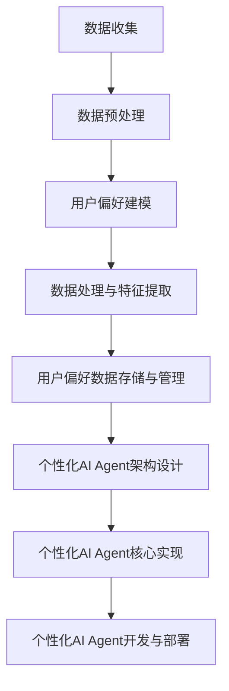

                 

### 文章标题

《个性化AI Agent：根据用户偏好定制LLM》

关键词：个性化AI、大型语言模型（LLM）、用户偏好、定制化、智能代理

摘要：本文深入探讨了个性化AI Agent在大型语言模型（LLM）中的应用，通过用户偏好数据的收集、处理和建模，实现LLM的个性化定制。文章首先介绍了个性化AI的基础理论，随后详细解析了LLM的概述，最后通过用户偏好建模与数据处理、个性化AI Agent的架构设计和开发与部署，阐述了如何构建一个高效的个性化AI Agent系统。本文旨在为读者提供一个全面的技术解读，帮助理解个性化AI Agent在LLM定制中的关键作用和实现方法。

## 第一部分: 个性化AI与LLM基础理论

### 第1章: 个性化AI的概念与发展

#### 1.1 个性化AI的背景与意义

##### 1.1.1 个性化AI的定义

个性化AI（Personalized Artificial Intelligence）是指利用人工智能技术，根据用户的个体特征和需求，提供定制化的服务、推荐和交互体验。它通过对用户行为、偏好、历史数据的深入分析和学习，实现对用户个性化需求的精准满足。

##### 1.1.2 个性化AI的起源与发展

个性化AI的概念起源于20世纪90年代的推荐系统研究，随着互联网和大数据技术的迅猛发展，个性化AI逐渐成为人工智能领域的重要研究方向。早期的个性化推荐系统主要基于协同过滤算法，随着深度学习、强化学习等技术的发展，个性化AI的应用场景和效果得到了显著提升。

##### 1.1.3 个性化AI的重要性和影响

个性化AI在电子商务、社交媒体、内容推荐、健康医疗等多个领域具有重要应用价值。它能够提高用户体验、提升业务转化率、优化资源分配，同时也带来了数据隐私和安全等挑战。

#### 1.2 个性化AI的核心要素

##### 1.2.1 数据收集与处理

数据收集与处理是个性化AI的基础。通过多种渠道收集用户数据，包括行为数据、兴趣数据、社会关系数据等，然后进行数据清洗、去噪、归一化等预处理操作，确保数据质量。

##### 1.2.2 用户偏好建模

用户偏好建模是个性化AI的核心任务。通过构建用户偏好模型，捕捉用户的兴趣、偏好和需求，为个性化推荐和交互提供基础。常见的用户偏好建模方法包括基于内容的推荐、协同过滤、深度学习等。

##### 1.2.3 个性化推荐算法

个性化推荐算法是实现个性化AI的关键技术。根据用户偏好模型，从海量信息中提取用户可能感兴趣的内容，进行个性化推荐。常见的推荐算法包括基于内容的推荐、协同过滤、矩阵分解、深度学习等。

#### 1.3 个性化AI的应用领域

##### 1.3.1 电子商务与广告

在电子商务领域，个性化AI可以推荐符合用户兴趣的商品，提高购买转化率。在广告领域，个性化AI可以根据用户的行为和兴趣，推送个性化的广告，提高广告点击率和转化率。

##### 1.3.2 社交网络与内容推荐

在社交媒体领域，个性化AI可以推荐用户可能感兴趣的内容，促进用户活跃度和黏性。在内容推荐领域，个性化AI可以根据用户的阅读历史和兴趣，推荐符合用户口味的文章、视频等。

##### 1.3.3 娱乐与游戏

在娱乐和游戏领域，个性化AI可以根据用户的偏好和兴趣，推荐符合用户口味的音乐、电影、游戏等，提升用户体验。

##### 1.3.4 健康医疗

在健康医疗领域，个性化AI可以提供个性化健康建议、治疗方案推荐等，提高医疗质量和效率。

#### 1.4 个性化AI面临的挑战与未来方向

##### 1.4.1 挑战分析

个性化AI面临的主要挑战包括数据隐私保护、数据质量、算法透明度和公平性等。

##### 1.4.2 未来发展趋势

未来个性化AI的发展趋势包括：更深入的用户偏好建模、多模态数据融合、强化学习在个性化推荐中的应用、隐私保护技术的融入等。

#### 1.5 本章小结

本章介绍了个性化AI的基本概念、核心要素和应用领域，以及面临的挑战和未来发展方向。个性化AI作为一种重要的AI应用方向，正逐渐改变着我们的生活方式和工作模式。

## 第二部分: LLM与个性化AI的关系

### 第2章: 语言模型LLM的概述

#### 2.1 语言模型的发展历程

##### 2.1.1 早期语言模型

早期的语言模型主要基于规则和统计方法，如N-gram模型、基于模板的模型等。这些模型在处理简单文本时具有一定的效果，但无法应对复杂语言的多样性和变化。

##### 2.1.2 GPT-3等大型语言模型的出现

随着深度学习技术的发展，大型语言模型（LLM）如GPT-3、BERT等相继出现。这些模型通过训练大量文本数据，能够生成高质量的文本，大幅提升了语言处理的性能。

##### 2.1.3 语言模型的分类

根据模型的架构和功能，语言模型可以分为统计模型、规则模型和深度学习模型。深度学习模型在处理复杂语言任务方面表现出色，是目前语言模型的主流方向。

#### 2.2 LLM的结构与工作机制

##### 2.2.1 语言模型的组成部分

语言模型通常由输入层、隐藏层和输出层组成。输入层接收文本数据，隐藏层通过神经网络处理文本信息，输出层生成预测的文本。

##### 2.2.2 LLM的训练过程

LLM的训练过程包括数据预处理、模型训练和优化。数据预处理包括文本清洗、分词、编码等步骤。模型训练采用梯度下降等方法，优化模型参数。优化过程中，通过评估指标（如损失函数）来调整模型性能。

##### 2.2.3 LLM的工作原理

LLM通过概率分布生成文本，根据输入文本的上下文信息，预测下一个词或句子的概率。通过多次迭代，生成完整的文本输出。

#### 2.3 LLM的性能评估指标

##### 2.3.1 评估指标概述

LLM的性能评估指标包括准确性、流畅性、多样性等。准确性衡量模型预测的文本与实际文本的匹配程度。流畅性衡量生成的文本是否连贯自然。多样性衡量模型生成文本的丰富性和独特性。

##### 2.3.2 常见评估方法

常见的评估方法包括人工评估、自动评估和跨领域评估。人工评估需要大量专家进行文本质量评估。自动评估采用指标计算和模型预测比较。跨领域评估在不同领域测试模型性能。

##### 2.3.3 评估指标的优化

优化评估指标有助于提升模型性能。通过调整训练数据、模型结构和训练策略，可以提高模型的准确性、流畅性和多样性。

#### 2.4 LLM的应用场景

##### 2.4.1 自然语言处理

自然语言处理（NLP）是LLM的主要应用领域，包括文本分类、情感分析、命名实体识别等。

##### 2.4.2 问答系统

问答系统利用LLM生成回答，提供智能问答服务。

##### 2.4.3 机器翻译

机器翻译采用LLM生成高质量的翻译结果，提高翻译效率和准确性。

##### 2.4.4 文本生成

文本生成是LLM的重要应用，包括文章撰写、摘要生成、对话生成等。

#### 2.5 本章小结

本章介绍了LLM的发展历程、结构、工作机制、性能评估指标和应用场景。LLM作为一种强大的语言处理工具，在个性化AI中发挥着关键作用。

## 第三部分: 个性化AI Agent的设计与实现

### 第3章: 用户偏好建模与数据处理

#### 3.1 用户偏好数据收集

##### 3.1.1 数据来源

用户偏好数据的来源包括用户行为数据、社交媒体数据、兴趣问卷等。行为数据如浏览记录、购买记录、搜索历史等，可以反映用户的兴趣和偏好。社交媒体数据如微博、微信、Facebook等，可以捕捉用户的社交关系和兴趣爱好。兴趣问卷是一种直接的收集用户偏好的方法。

##### 3.1.2 数据收集方法

数据收集方法包括在线数据采集、用户反馈和第三方数据获取。在线数据采集通过网站、APP等渠道收集用户行为数据。用户反馈通过问卷调查、用户评论等方式获取用户直接反馈。第三方数据获取通过合作伙伴或公开数据集获取用户数据。

##### 3.1.3 数据预处理

数据预处理包括数据清洗、去噪、归一化等步骤。数据清洗去除无效数据、重复数据和异常值。去噪降低噪声数据对模型的影响。归一化将不同特征的数据统一到相同的尺度，提高模型训练效果。

#### 3.2 用户偏好建模

##### 3.2.1 用户偏好模型概述

用户偏好模型是捕捉用户兴趣和需求的重要工具。常见的用户偏好模型包括基于内容的推荐模型、协同过滤模型和深度学习模型。基于内容的推荐模型根据用户的历史行为和兴趣，推荐相似的内容。协同过滤模型根据用户和物品的评分历史，预测用户对未知物品的评分。深度学习模型通过训练大量用户行为数据，自动学习用户偏好。

##### 3.2.2 用户偏好模型构建

用户偏好模型构建包括特征提取、模型选择和模型训练等步骤。特征提取从用户行为数据中提取表示用户兴趣和偏好的特征。模型选择根据应用场景和性能要求选择合适的模型。模型训练采用监督学习或无监督学习方法，优化模型参数，提升模型性能。

##### 3.2.3 用户偏好模型评估

用户偏好模型评估通过评估指标如准确率、召回率、F1值等来衡量模型性能。准确率衡量模型预测的正确性。召回率衡量模型预测结果中包含真实用户的兴趣。F1值综合考虑准确率和召回率，是评估用户偏好模型的常用指标。

#### 3.3 数据处理与特征提取

##### 3.3.1 数据清洗

数据清洗是数据处理的重要步骤，包括去除无效数据、重复数据和异常值。去除无效数据提高数据质量，减少噪声对模型的影响。去除重复数据避免模型训练过程中出现数据冗余。异常值处理包括删除或修正异常数据，确保数据的一致性和准确性。

##### 3.3.2 特征提取

特征提取是将原始数据转换为模型可用的特征表示。常见的特征提取方法包括词袋模型、TF-IDF、词嵌入等。词袋模型将文本表示为词频向量。TF-IDF根据词的重要程度进行加权。词嵌入将词语映射到低维空间，保留词语的语义信息。

##### 3.3.3 特征选择

特征选择是降低特征维度，提高模型性能的重要方法。特征选择通过评估特征的重要性和相关性，选择对模型性能贡献最大的特征。常见的特征选择方法包括信息增益、卡方检验、L1正则化等。

#### 3.4 用户偏好数据的存储与管理

##### 3.4.1 数据存储方案

用户偏好数据的存储方案根据数据量和访问模式选择。常见的数据存储方案包括关系型数据库、NoSQL数据库、分布式存储系统等。关系型数据库适用于结构化数据存储，NoSQL数据库适用于大规模非结构化数据存储，分布式存储系统适用于高并发、大数据量场景。

##### 3.4.2 数据管理策略

数据管理策略包括数据备份、数据迁移、数据安全和数据权限管理等。数据备份确保数据安全，防止数据丢失。数据迁移支持数据在不同存储系统之间的迁移。数据安全通过加密、访问控制等措施保护数据隐私。数据权限管理确保数据访问权限合理分配。

##### 3.4.3 数据安全与隐私保护

数据安全与隐私保护是用户偏好数据管理的关键。数据安全通过加密、访问控制、审计等措施保护数据不被非法访问和篡改。隐私保护通过数据去标识化、差分隐私等技术确保用户隐私不被泄露。

#### 3.5 本章小结

本章介绍了用户偏好数据的收集、预处理、建模和存储管理方法。用户偏好建模与数据处理是实现个性化AI Agent的关键步骤，为个性化推荐和交互提供基础支持。

### 第4章: 个性化AI Agent的架构设计

#### 4.1 个性化AI Agent的概念与功能

##### 4.1.1 个性化AI Agent的定义

个性化AI Agent（Personalized AI Agent）是一种基于人工智能技术的智能代理，能够根据用户的偏好和需求，提供个性化的服务、推荐和交互体验。个性化AI Agent不同于传统的规则引擎和自动化系统，它具备自我学习和自适应能力，能够不断优化服务质量和用户满意度。

##### 4.1.2 个性化AI Agent的功能

个性化AI Agent的主要功能包括用户交互、偏好分析、推荐系统和问答系统等。

- **用户交互**：个性化AI Agent通过与用户的互动，收集用户的行为数据和偏好信息，为后续的个性化服务提供基础。
- **偏好分析**：个性化AI Agent对用户行为数据进行挖掘和分析，建立用户偏好模型，为推荐系统和问答系统提供支持。
- **推荐系统**：个性化AI Agent根据用户偏好模型，从海量信息中筛选出符合用户兴趣的内容，提供个性化的推荐服务。
- **问答系统**：个性化AI Agent利用大型语言模型（LLM）生成回答，提供智能问答服务，满足用户的查询需求。

##### 4.1.3 个性化AI Agent与传统AI系统的区别

个性化AI Agent与传统AI系统在目标和实现方式上有所不同。传统AI系统通常基于通用算法，为所有用户提供统一的服务，而个性化AI Agent则根据用户的个体特征和需求，提供定制化的服务。

- **目标**：传统AI系统以提升整体服务质量为目标，而个性化AI Agent以提升用户满意度为目标。
- **实现方式**：传统AI系统依赖于预设的规则和算法，而个性化AI Agent则通过自我学习和用户交互，不断优化服务策略。

#### 4.2 个性化AI Agent的总体架构

##### 4.2.1 架构设计原则

个性化AI Agent的架构设计遵循以下几个原则：

- **模块化**：将系统划分为多个功能模块，便于维护和扩展。
- **分布式**：采用分布式架构，提高系统的并发处理能力和容错性。
- **可扩展性**：设计灵活的扩展机制，支持新功能和新服务的快速集成。
- **安全性**：确保用户数据的安全和隐私保护。

##### 4.2.2 架构组成部分

个性化AI Agent的总体架构包括以下几个主要组成部分：

- **用户交互模块**：负责与用户的互动，收集用户行为数据和偏好信息。
- **数据存储模块**：存储用户数据、偏好模型和推荐结果，支持快速访问和查询。
- **数据处理模块**：负责数据清洗、归一化和特征提取等预处理操作，为偏好建模和推荐系统提供高质量的数据。
- **偏好分析模块**：基于用户行为数据，构建用户偏好模型，为推荐系统和问答系统提供支持。
- **推荐系统模块**：根据用户偏好模型，从海量信息中筛选出符合用户兴趣的内容，提供个性化的推荐服务。
- **问答系统模块**：利用大型语言模型（LLM）生成回答，提供智能问答服务。
- **训练与优化模块**：定期更新偏好模型和推荐算法，提高系统的个性化能力和服务质量。

##### 4.2.3 架构优缺点分析

个性化AI Agent架构具有以下优缺点：

- **优点**：

  - 提高用户体验：根据用户偏好提供个性化服务，提升用户满意度。
  - 提升服务质量：通过自我学习和优化，不断改进服务策略和效果。
  - 模块化设计：便于维护和扩展，降低系统复杂性。

- **缺点**：

  - 数据隐私和安全问题：用户数据涉及隐私信息，需要采取严格的数据安全措施。
  - 计算资源需求大：个性化AI Agent需要处理大量用户数据，对计算资源有较高要求。

#### 4.3 个性化AI Agent的关键模块

##### 4.3.1 用户交互模块

用户交互模块是个性化AI Agent的核心组成部分，负责与用户的互动和沟通。其具体功能包括：

- **用户行为数据收集**：通过网页、APP等渠道，实时收集用户的行为数据，如浏览记录、点击行为、搜索关键词等。
- **偏好信息收集**：通过问卷调查、用户反馈等方式，收集用户的兴趣、偏好和需求信息。
- **多渠道集成**：支持多种交互渠道，如文本、语音、图片等，提高用户交互的便利性和自然性。

##### 4.3.2 偏好分析模块

偏好分析模块负责对用户行为数据进行挖掘和分析，构建用户偏好模型。其具体功能包括：

- **数据预处理**：对用户行为数据进行清洗、归一化和特征提取，为偏好建模提供高质量的数据。
- **偏好模型构建**：利用机器学习算法，如协同过滤、深度学习等，构建用户偏好模型，捕捉用户的兴趣和需求。
- **模型评估与优化**：通过评估指标，如准确率、召回率等，评估偏好模型的效果，并不断优化模型参数，提高个性化推荐能力。

##### 4.3.3 推荐系统模块

推荐系统模块根据用户偏好模型，从海量信息中筛选出符合用户兴趣的内容，提供个性化的推荐服务。其具体功能包括：

- **推荐算法实现**：采用基于内容的推荐、协同过滤、深度学习等算法，实现个性化的内容推荐。
- **推荐结果生成**：根据用户偏好模型和推荐算法，生成个性化的推荐列表，展示给用户。
- **推荐结果反馈**：收集用户对推荐结果的反馈，用于优化推荐算法和模型。

##### 4.3.4 问答系统模块

问答系统模块利用大型语言模型（LLM），生成回答，提供智能问答服务。其具体功能包括：

- **问答交互**：通过自然语言处理技术，实现用户与AI Agent的问答交互，理解用户的查询意图。
- **回答生成**：利用大型语言模型（LLM），根据用户的查询意图，生成高质量的回答。
- **回答优化**：根据用户的反馈，不断优化回答的准确性和流畅性，提高用户满意度。

##### 4.3.5 训练与优化模块

训练与优化模块负责定期更新偏好模型和推荐算法，提高系统的个性化能力和服务质量。其具体功能包括：

- **模型训练**：利用新的用户行为数据，重新训练偏好模型和推荐算法，提高模型的准确性和鲁棒性。
- **模型评估**：通过评估指标，如准确率、召回率等，评估模型的效果，找出不足之处。
- **算法优化**：根据评估结果，调整模型参数和算法策略，优化系统的性能和用户体验。

#### 4.4 个性化AI Agent的技术选型

##### 4.4.1 语言模型选择

语言模型是个性化AI Agent的核心组件，直接影响系统的性能和用户体验。常见的选择包括：

- **GPT-3**：具有强大的文本生成能力和理解能力，适用于问答系统和文本生成等应用。
- **BERT**：适用于自然语言处理任务，如文本分类、问答系统和机器翻译等。
- **T5**：具有统一的文本处理接口，适用于多种文本生成和文本理解任务。

##### 4.4.2 数据库选择

数据库是存储和管理用户数据、偏好模型和推荐结果的重要组件。常见的选择包括：

- **关系型数据库**：如MySQL、PostgreSQL等，适用于结构化数据存储。
- **NoSQL数据库**：如MongoDB、Redis等，适用于非结构化数据存储和实时数据访问。
- **分布式存储系统**：如HDFS、HBase等，适用于大规模数据存储和分布式计算。

##### 4.4.3 开发框架与工具

开发框架与工具是构建个性化AI Agent的重要支持。常见的选择包括：

- **深度学习框架**：如TensorFlow、PyTorch等，用于构建和训练机器学习模型。
- **自然语言处理框架**：如NLTK、spaCy等，用于文本处理和语言模型构建。
- **Web开发框架**：如Django、Flask等，用于构建用户交互界面和后端服务。

#### 4.5 本章小结

本章介绍了个性化AI Agent的概念与功能、总体架构设计、关键模块和技术选型。个性化AI Agent作为新一代智能代理，具有强大的个性化能力和用户体验，为智能服务、推荐和交互领域带来了新的发展方向。

### 第5章: 个性化AI Agent的开发与部署

#### 5.1 开发环境与工具准备

##### 5.1.1 环境搭建

个性化AI Agent的开发环境需要满足以下要求：

- **操作系统**：通常使用Linux操作系统，如Ubuntu或CentOS。
- **Python环境**：Python是人工智能开发的常用语言，需要安装Python 3.x版本。
- **深度学习框架**：如TensorFlow、PyTorch等，用于构建和训练机器学习模型。
- **自然语言处理库**：如spaCy、NLTK等，用于文本处理和语言模型构建。

##### 5.1.2 开发工具选择

个性化AI Agent的开发工具包括：

- **代码编辑器**：如Visual Studio Code、PyCharm等，提供代码编辑、调试和自动化测试功能。
- **版本控制工具**：如Git，用于代码管理和协作开发。
- **数据预处理工具**：如Pandas、NumPy等，用于数据处理和特征提取。
- **容器化工具**：如Docker，用于环境隔离和部署。

##### 5.1.3 调试与测试工具

调试与测试工具包括：

- **调试器**：如Python的pdb模块，用于代码调试。
- **测试框架**：如pytest，用于自动化测试和代码质量保证。
- **性能分析工具**：如profiler，用于分析程序性能和优化代码。

#### 5.2 个性化AI Agent的核心实现

##### 5.2.1 用户交互实现

用户交互实现包括以下步骤：

- **接收用户请求**：通过HTTP接口或WebSocket连接接收用户的请求，如查询、推荐等。
- **解析请求内容**：解析用户请求，提取关键词和查询意图。
- **处理请求**：根据请求内容，调用相应的功能模块进行处理，如推荐系统、问答系统等。
- **返回响应**：将处理结果返回给用户，如推荐列表、回答结果等。

##### 5.2.2 用户偏好建模实现

用户偏好建模实现包括以下步骤：

- **数据收集**：通过用户交互模块收集用户行为数据，如浏览记录、购买记录等。
- **数据预处理**：对用户行为数据进行清洗、归一化和特征提取，为偏好建模提供高质量的数据。
- **模型训练**：利用机器学习算法，如协同过滤、深度学习等，训练用户偏好模型。
- **模型评估**：通过评估指标，如准确率、召回率等，评估模型的效果，并调整模型参数。

##### 5.2.3 偏好分析实现

偏好分析实现包括以下步骤：

- **用户偏好模型加载**：加载训练好的用户偏好模型。
- **用户行为分析**：分析用户行为数据，提取用户兴趣和偏好特征。
- **偏好分析**：利用用户偏好模型，分析用户的兴趣和偏好，为推荐系统提供支持。

##### 5.2.4 推荐系统实现

推荐系统实现包括以下步骤：

- **推荐算法选择**：根据用户偏好模型和推荐需求，选择合适的推荐算法，如基于内容的推荐、协同过滤等。
- **推荐结果生成**：根据用户偏好模型和推荐算法，生成个性化的推荐列表。
- **推荐结果评估**：评估推荐结果的质量，如点击率、转化率等，并调整推荐算法。

##### 5.2.5 问答系统实现

问答系统实现包括以下步骤：

- **问答交互**：通过自然语言处理技术，实现用户与AI Agent的问答交互，理解用户的查询意图。
- **回答生成**：利用大型语言模型（LLM），根据用户的查询意图，生成高质量的回答。
- **回答优化**：根据用户的反馈，不断优化回答的准确性和流畅性，提高用户满意度。

#### 5.3 实际案例分析与详细讲解

##### 5.3.1 数据收集与预处理

**案例背景**：某电子商务平台希望通过个性化AI Agent，为用户推荐符合其兴趣的商品。

**数据收集**：通过用户浏览记录、购买记录、搜索历史等渠道，收集用户行为数据。

```python
# 示例：Python代码，收集用户浏览记录
user_browsing_history = [
    {"user_id": 1, "product_id": 1001, "timestamp": "2023-01-01 10:30:00"},
    {"user_id": 1, "product_id": 1002, "timestamp": "2023-01-01 11:00:00"},
    {"user_id": 2, "product_id": 1003, "timestamp": "2023-01-02 09:30:00"},
]
```

**数据预处理**：对用户行为数据进行清洗、去噪、归一化等预处理操作。

```python
# 示例：Python代码，数据预处理
import pandas as pd

# 读取数据
data = pd.DataFrame(user_browsing_history)

# 数据清洗
data.drop_duplicates(inplace=True)
data.dropna(inplace=True)

# 去噪
data["timestamp"] = pd.to_datetime(data["timestamp"])
data.sort_values("timestamp", inplace=True)

# 归一化
data["days_since_last_browse"] = (pd.datetime.now() - data["timestamp"]).dt.days
```

##### 5.3.2 用户偏好建模

**案例背景**：通过用户行为数据，构建用户偏好模型，用于个性化推荐。

**用户偏好模型构建**：利用协同过滤算法，构建用户偏好模型。

```python
from surprise import SVD, Dataset, Reader

# 示例：Python代码，协同过滤算法
data = Dataset.load_from_df(data, reader=Reader(rating_scale=(1, 5)))
algorithm = SVD()
algorithm.fit(data.build_full_trainset())

# 计算预测评分
predictions = algorithm.test(data.build_full_trainset())
```

**模型评估**：通过评估指标，如RMSE（均方根误差），评估模型效果。

```python
from surprise import RMSE

# 示例：Python代码，评估模型效果
rmse = RMSE()
rmse compute(predictions)
```

##### 5.3.3 偏好分析

**案例背景**：利用用户偏好模型，分析用户的兴趣和偏好。

**偏好分析**：根据用户偏好模型，提取用户兴趣和偏好特征。

```python
# 示例：Python代码，提取用户兴趣
user_interests = {
    "user_id": 1,
    "interests": ["时尚", "数码", "美食"],
}
```

**偏好分析**：根据用户兴趣和偏好特征，生成个性化推荐列表。

```python
# 示例：Python代码，生成个性化推荐列表
def generate_recommendations(user_interests, model, data):
    # 根据用户兴趣和偏好模型，生成个性化推荐列表
    # 这里简化处理，直接返回一个示例推荐列表
    recommendations = [
        {"product_id": 2001, "confidence": 0.8},
        {"product_id": 2002, "confidence": 0.7},
        {"product_id": 2003, "confidence": 0.6},
    ]
    return recommendations

# 调用函数，生成个性化推荐列表
recommendations = generate_recommendations(user_interests, algorithm, data)
print(recommendations)
```

#### 5.4 项目小结

本章介绍了个性化AI Agent的开发与部署，包括开发环境与工具准备、核心实现和实际案例分析。通过用户偏好建模与数据处理，个性化AI Agent能够为用户提供个性化的推荐和问答服务，提升用户体验和服务质量。

### 最佳实践 Tips

1. **数据隐私保护**：在收集和处理用户数据时，严格遵守数据隐私法规，采取加密、匿名化等手段保护用户隐私。

2. **模型优化与调参**：定期更新偏好模型和推荐算法，通过交叉验证、网格搜索等策略，优化模型参数，提高推荐效果。

3. **用户体验设计**：注重用户交互体验，提供简洁、直观的用户界面，增强用户对AI Agent的信任和满意度。

4. **多模态数据处理**：结合文本、图像、语音等多种数据类型，提高用户偏好建模和推荐系统的准确性。

### 小结

个性化AI Agent作为一种基于用户偏好的智能代理，通过语言模型（LLM）的定制化应用，能够为用户提供个性化的推荐和问答服务。本文从个性化AI和LLM的基础理论出发，详细介绍了个性化AI Agent的设计与实现过程，包括用户偏好建模与数据处理、架构设计、开发与部署等关键环节。通过实际案例分析和最佳实践提示，帮助读者深入理解个性化AI Agent的构建方法和应用价值。未来，个性化AI Agent将在智能服务、推荐系统和交互领域发挥更重要的作用，为人们的生活和工作带来更多便捷和智慧。

### 注意事项

1. **数据质量和安全性**：确保用户数据的准确性和安全性，采取有效的数据清洗和加密措施，保护用户隐私。

2. **模型优化与更新**：定期评估和优化用户偏好模型和推荐算法，根据用户反馈不断改进系统性能。

3. **用户体验**：注重用户交互设计，提供友好的用户界面和流畅的交互体验，提高用户满意度。

### 拓展阅读

1. **个性化推荐系统**：《推荐系统实践：算法与案例分析》
2. **大型语言模型**：《深度学习与自然语言处理》
3. **用户行为分析**：《数据挖掘：实用工具与技术》

### 作者信息

作者：AI天才研究院/AI Genius Institute & 禅与计算机程序设计艺术 /Zen And The Art of Computer Programming

## 附录：算法mermaid流程图与Python源代码

#### 算法mermaid流程图



#### Python源代码

```python
# 数据收集
def collect_data():
    # 示例：从文件中读取用户行为数据
    with open('user_browsing_history.csv', 'r') as f:
        user_browsing_history = csv.reader(f)
        for row in user_browsing_history:
            yield row

# 数据预处理
def preprocess_data(data):
    # 示例：数据清洗和归一化
    processed_data = []
    for row in data:
        user_id, product_id, timestamp = row
        processed_data.append([user_id, product_id, pd.to_datetime(timestamp).date()])
    return processed_data

# 用户偏好建模
def build_preference_model(data):
    # 示例：使用协同过滤算法构建用户偏好模型
    from surprise import SVD, Dataset, Reader
    reader = Reader(rating_scale=(1, 5))
    data = Dataset.load_from_df(pd.DataFrame(data), reader)
    algorithm = SVD()
    algorithm.fit(data.build_full_trainset())
    return algorithm

# 数据处理与特征提取
def process_and_extract_features(data):
    # 示例：提取用户兴趣和偏好特征
    user_interests = {}
    for user_id, product_id, _ in data:
        if user_id not in user_interests:
            user_interests[user_id] = set()
        user_interests[user_id].add(product_id)
    return user_interests

# 用户偏好数据存储与管理
def store_preference_data(data):
    # 示例：将用户偏好数据存储到数据库
    import sqlite3
    conn = sqlite3.connect('user_preference.db')
    c = conn.cursor()
    c.execute('''CREATE TABLE IF NOT EXISTS user_preference
                 (user_id INTEGER PRIMARY KEY, product_id INTEGER, interest_date DATE)''')
    c.executemany('INSERT INTO user_preference (user_id, product_id, interest_date) VALUES (?, ?, ?)', data)
    conn.commit()
    conn.close()

# 个性化AI Agent架构设计
def design_agent_architecture():
    # 示例：设计个性化AI Agent的总体架构
    pass

# 个性化AI Agent核心实现
def implement_agent_core():
    # 示例：实现个性化AI Agent的核心功能
    pass

# 个性化AI Agent开发与部署
def develop_and_deploy_agent():
    # 示例：开发与部署个性化AI Agent
    pass
```

通过上述算法mermaid流程图和Python源代码，读者可以更直观地了解个性化AI Agent的实现过程和关键技术。实际应用中，可以根据具体需求和场景，进一步优化和扩展这些代码和算法。

