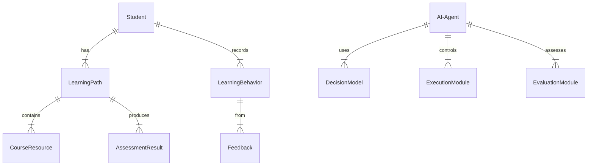
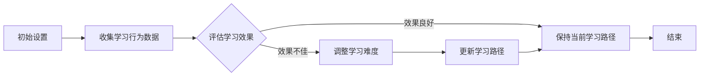
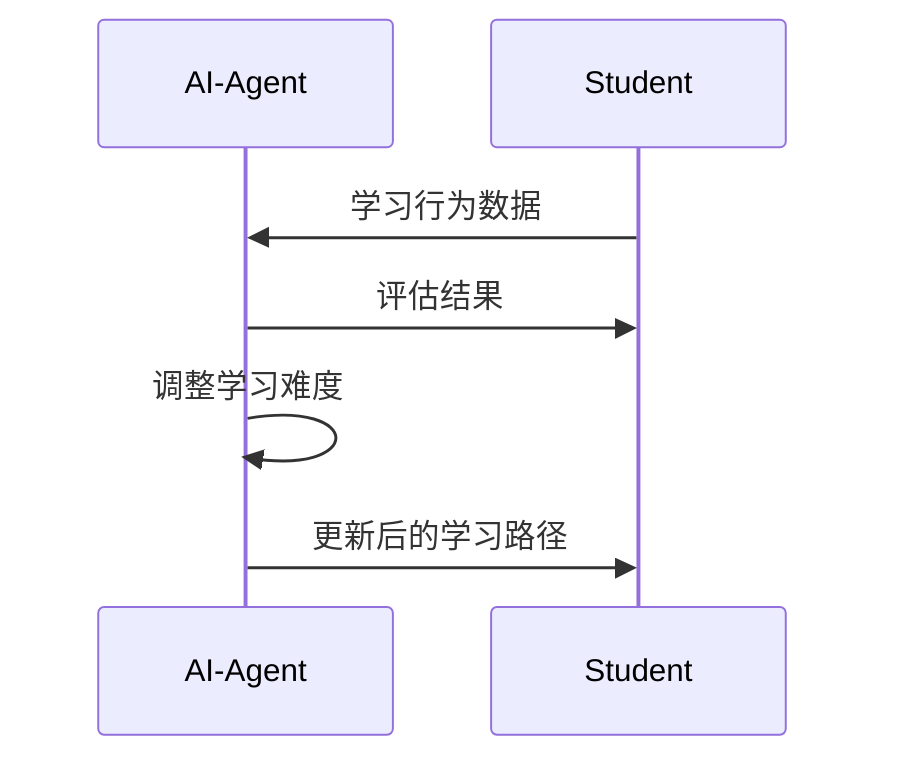
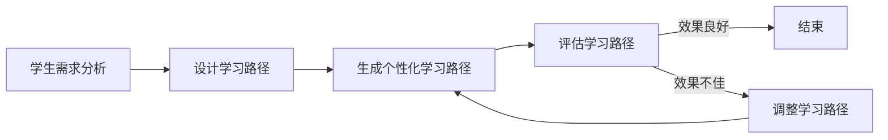
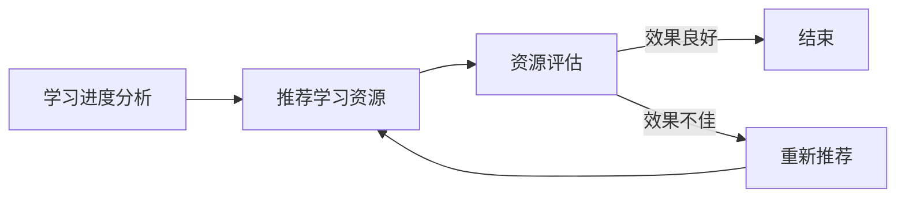
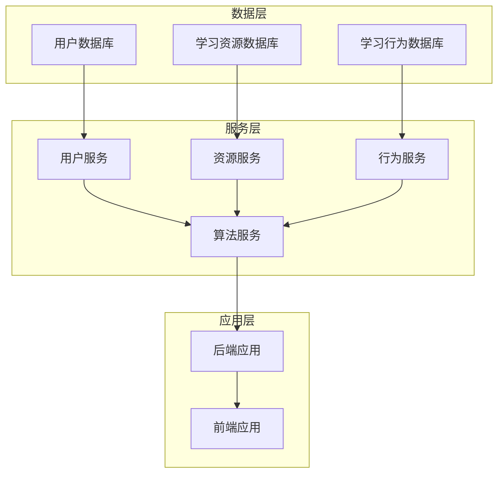
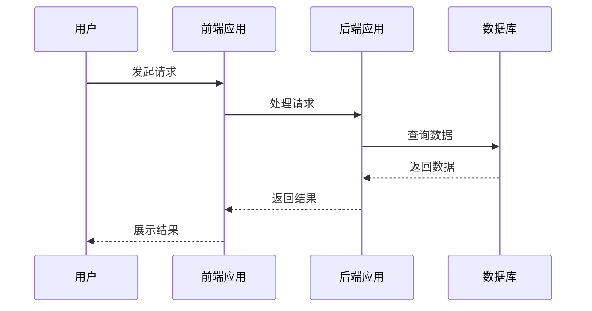
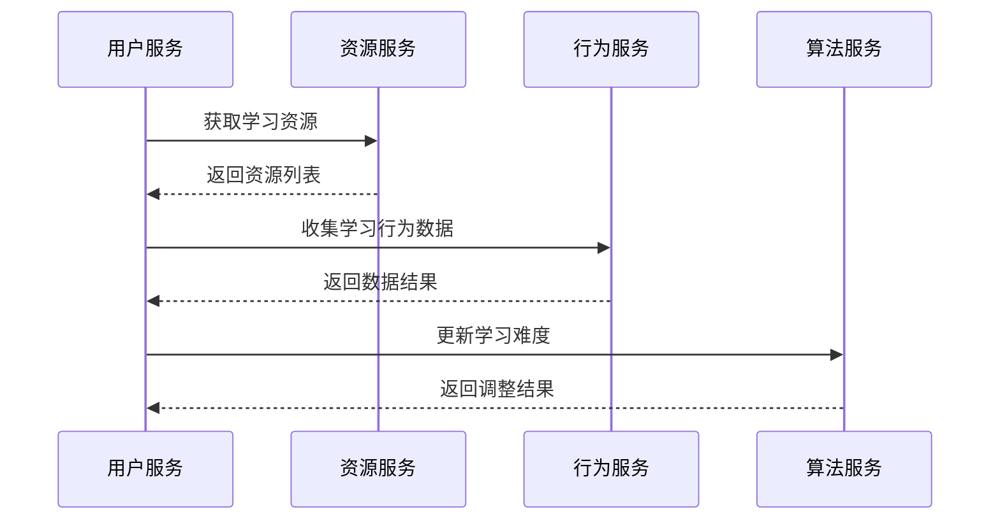

                 


### 一、文章标题与关键词

**文章标题：个性化学习路径AI Agent：LLM辅助的自适应教育**

**关键词：个性化学习、AI Agent、自适应教育、LLM、学习路径**

**摘要：本文深入探讨了个性化学习路径AI Agent的设计与应用，特别是如何利用大型语言模型（LLM）来构建自适应教育系统。文章首先介绍了个性化学习的挑战和AI Agent的基本概念，接着详细阐述了LLM的原理和特性。随后，文章分析了自适应学习算法和LLM在个性化学习中的应用，并通过数学模型和公式进行了讲解。此外，文章还讨论了系统设计与实现、案例研究和最佳实践，旨在为教育领域提供创新的解决方案。**

### 二、引言部分

**2.1 个性化学习的挑战**

在教育领域，传统的教学方式往往难以满足学生的个性化需求。每个学生都有自己独特的学习风格、兴趣和知识背景，而统一的教学内容和方法很难兼顾所有学生的需求。这种情况下，个性化学习成为了一个重要的研究方向。

个性化学习的目标是根据学生的个体差异，提供定制化的学习资源和教学方法，从而提高学习效果和兴趣。然而，实现个性化学习面临着一系列挑战：

1. **学习数据管理**：收集、存储和管理大量的学习数据，包括学生的行为数据、知识水平和学习进度，是一项复杂的任务。
2. **学习路径规划**：如何根据学生的特点和需求，设计出科学、合理的个性化学习路径，是一个具有挑战性的问题。
3. **学习资源适配**：为不同背景和兴趣的学生提供适合他们的学习资源，需要海量的资源和智能匹配算法。
4. **学习效果评估**：如何准确评估个性化学习的效果，以及如何持续优化学习路径，是当前研究的热点。

**2.2 AI Agent的基本概念**

AI Agent，即人工智能代理，是指能够自主感知环境、根据环境反馈调整行为、实现特定目标的计算实体。在个性化学习领域，AI Agent可以被视为一个智能学习助手，它可以根据学生的学习行为和反馈，自动调整学习内容和路径，以实现个性化的学习目标。

AI Agent通常由以下几个部分组成：

1. **感知器**：感知器负责收集学生的学习行为数据，如学习时间、学习进度、学习难度等。
2. **决策器**：决策器根据感知器收集到的数据，利用预先设定的算法和模型，决定下一步的学习内容和方法。
3. **执行器**：执行器负责将决策器的决策结果付诸实施，如推送学习资源、调整学习难度等。
4. **评估器**：评估器负责对学习效果进行评估，为决策器提供反馈，以便进行进一步的调整。

**2.3 LLM在个性化学习中的应用**

大型语言模型（LLM，Large Language Model）是一种基于深度学习的自然语言处理模型，能够理解和生成自然语言。近年来，LLM在个性化学习中的应用引起了广泛关注，其优势主要体现在以下几个方面：

1. **丰富的知识库**：LLM通过学习海量的文本数据，积累了丰富的知识，能够为个性化学习提供高质量的学习资源。
2. **强大的推理能力**：LLM具备强大的语义理解和推理能力，能够根据学生的提问和学习需求，提供准确、有针对性的答案和解释。
3. **自适应调整能力**：LLM可以根据学生的学习行为和反馈，实时调整学习内容和难度，实现真正的个性化学习。

LLM在个性化学习中的应用主要包括以下几个方面：

1. **学习路径规划**：LLM可以根据学生的学习需求和特点，设计出科学、合理的个性化学习路径。
2. **学习资源推荐**：LLM可以根据学生的学习进度和兴趣，推荐适合的学习资源，提高学习效果。
3. **学习效果评估**：LLM可以分析学生的学习行为和反馈，评估学习效果，为学习路径的调整提供依据。

通过AI Agent和LLM的有机结合，可以构建一个智能化、自适应的个性化学习系统，为学生的学习提供有力支持。

### 三、核心概念与联系

**3.1 个性化学习路径的定义与分类**

个性化学习路径是指根据学生的学习需求、兴趣和特点，设计出的一套科学、合理的课程学习方案。个性化学习路径的目的是通过定制化的学习内容和方法，提高学习效果和兴趣。

根据不同的分类标准，个性化学习路径可以有不同的分类方法：

1. **按学习内容分类**：个性化学习路径可以按学科、领域、知识点等分类，为不同类型的学生提供个性化的学习内容。
2. **按学习方式分类**：个性化学习路径可以按在线学习、线下学习、混合学习等方式分类，根据学生的学习习惯和需求进行选择。
3. **按学习难度分类**：个性化学习路径可以按基础课程、进阶课程、高级课程等难度分类，为不同水平的学生提供个性化的学习难度。

**3.2 AI Agent的组成与功能**

AI Agent是指能够自主感知环境、根据环境反馈调整行为、实现特定目标的计算实体。在个性化学习领域，AI Agent通常由感知器、决策器、执行器和评估器等组成部分构成。

1. **感知器**：感知器负责收集学生的学习行为数据，如学习时间、学习进度、学习难度等。这些数据是AI Agent进行决策和调整的重要依据。
2. **决策器**：决策器根据感知器收集到的数据，利用预先设定的算法和模型，决定下一步的学习内容和方法。决策器是实现个性化学习的关键部分。
3. **执行器**：执行器负责将决策器的决策结果付诸实施，如推送学习资源、调整学习难度等。执行器是实现个性化学习的实际操作部分。
4. **评估器**：评估器负责对学习效果进行评估，为决策器提供反馈，以便进行进一步的调整。评估器是实现个性化学习效果评估的重要部分。

**3.3 LLM的原理与特性**

大型语言模型（LLM，Large Language Model）是一种基于深度学习的自然语言处理模型，能够理解和生成自然语言。LLM的工作原理是基于大规模语料库的训练，通过神经网络结构对语言进行建模，从而实现对自然语言的生成和理解。

1. **原理**：LLM通常由多层神经网络组成，通过递归神经网络（RNN）、长短时记忆网络（LSTM）或变换器（Transformer）等结构，对输入的文本进行编码和解码。在训练过程中，LLM通过不断调整网络权重，使得生成的文本越来越接近真实语言。

2. **特性**：
   - **强大的语义理解能力**：LLM能够理解文本的深层语义，为用户提供准确、有针对性的回答和解释。
   - **生成能力**：LLM能够根据用户的需求，生成连贯、合理的文本内容，如文章、问答、对话等。
   - **自适应能力**：LLM可以根据用户的行为和反馈，自适应调整生成的内容，以更好地满足用户需求。

**3.4 个性化学习路径AI Agent的ER实体关系图**

个性化学习路径AI Agent的ER实体关系图可以用来描述系统中各实体之间的关系。以下是ER实体关系图的Mermaid表示：



在这个ER实体关系图中，Student（学生）是核心实体，其与其他实体之间存在多种关系。LearningPath（学习路径）是AI-Agent（AI代理）的主要对象，它包含CourseResource（课程资源）和AssessmentResult（评估结果）。LearningBehavior（学习行为）记录学生的行为数据，并与Feedback（反馈）实体相关联。AI-Agent（AI代理）则使用DecisionModel（决策模型）、ExecutionModule（执行模块）和EvaluationModule（评估模块）来管理整个个性化学习过程。

### 四、算法原理与实现

#### 4.1 自适应学习算法

自适应学习算法是指根据学生的学习行为和反馈，动态调整学习内容和难度的算法。以下是一个简单的自适应学习算法的mermaid流程图：



在这个流程图中，首先进行初始设置，然后收集学生的学习行为数据。接下来，评估学习效果，根据效果的好坏，选择保持当前学习路径或调整学习难度。最后，更新学习路径，并进入下一次循环。

**4.1.1 算法流程图**



在这个序列图中，学生将学习行为数据发送给AI-Agent，AI-Agent根据这些数据评估学习效果，然后调整学习难度，并更新学习路径。

**4.1.2 数学模型与公式**

自适应学习算法的核心是学习难度的调整。以下是一个简单的数学模型：

$$
D_{new} = D_{current} + \alpha \cdot (E_{current} - E_{target})
$$

其中，$D_{new}$是更新后的学习难度，$D_{current}$是当前学习难度，$E_{current}$是当前学习效果，$E_{target}$是目标学习效果，$\alpha$是调整系数。

**4.1.3 举例说明**

假设当前学习难度为$D_{current} = 3$，当前学习效果$E_{current} = 0.8$，目标学习效果$E_{target} = 0.9$，调整系数$\alpha = 0.1$。根据上述公式，可以计算出更新后的学习难度：

$$
D_{new} = 3 + 0.1 \cdot (0.8 - 0.9) = 3 - 0.01 = 2.99
$$

这意味着学习难度将略微降低，以期望提高学习效果。

#### 4.2 LLM在自适应学习中的应用

LLM在自适应学习中的应用主要体现在两个方面：学习路径规划和学习资源推荐。

**4.2.1 学习路径规划**

LLM可以根据学生的学习需求和特点，设计出科学、合理的个性化学习路径。以下是一个简单的mermaid流程图：



在这个流程图中，首先分析学生的学习需求，然后设计出个性化学习路径。接着评估学习路径的效果，如果效果良好，则结束；如果效果不佳，则进行调整。

**4.2.2 学习资源推荐**

LLM可以根据学生的学习进度和兴趣，推荐适合的学习资源。以下是一个简单的mermaid流程图：



在这个流程图中，首先分析学生的学习进度，然后推荐学习资源。接着评估推荐资源的有效性，如果效果良好，则结束；如果效果不佳，则重新推荐。

#### 4.3 数学模型与公式

LLM在自适应学习中的应用涉及到多个数学模型和公式。以下是一些常用的模型和公式：

1. **贝叶斯网络**：用于表示学习路径和资源之间的关系。

   $$ P(A|B) = \frac{P(B|A) \cdot P(A)}{P(B)} $$

   其中，$P(A|B)$是给定$B$时$A$的概率，$P(B|A)$是给定$A$时$B$的概率，$P(A)$是$A$的概率，$P(B)$是$B$的概率。

2. **协同过滤**：用于推荐学习资源。

   $$ R_{ij} = \hat{R}_{ui} + \langle R_{i} \rangle + \langle R_{u} \rangle - \langle R \rangle $$

   其中，$R_{ij}$是用户$u$对物品$i$的评分，$\hat{R}_{ui}$是用户$u$对物品$i$的预测评分，$\langle R_{i} \rangle$是物品$i$的平均评分，$\langle R_{u} \rangle$是用户$u$的平均评分，$\langle R \rangle$是所有评分的平均值。

3. **支持向量机（SVM）**：用于分类学习路径。

   $$ y(\phi(x)) = sign(\langle \phi(x), w \rangle + b) $$

   其中，$y$是实际分类标签，$\phi(x)$是特征映射，$w$是权重向量，$b$是偏置。

#### 4.4 举例说明

假设有一个学生学习数学，他的学习进度和学习效果可以用以下数据表示：

- 学习进度：$[1, 2, 3, 4, 5]$，表示他已经完成了第1章到第5章。
- 学习效果：$[0.8, 0.9, 0.85, 0.88, 0.9]$，表示他在各个章节的学习效果。

**4.4.1 学习路径规划**

根据学生的学习需求和特点，LLM可以设计出以下个性化学习路径：

- 第1章：基础知识
- 第2章：函数与导数
- 第3章：积分与微积分
- 第4章：线性代数
- 第5章：概率论与数理统计

**4.4.2 学习资源推荐**

根据学生的学习进度和兴趣，LLM可以推荐以下学习资源：

- 视频：数学知识讲解
- 书籍：数学教材
- 网站资源：数学练习题库

### 五、系统设计

#### 5.1 系统介绍

自适应教育系统是一个复杂的应用系统，它需要整合多个模块和功能，以实现个性化学习的目标。以下是一个简单的系统介绍：

- **功能模块**：包括用户管理、学习资源管理、学习行为数据收集与处理、自适应学习算法、学习效果评估等。
- **技术栈**：前端使用React或Vue.js，后端使用Spring Boot或Django，数据库使用MySQL或PostgreSQL，自然语言处理使用TensorFlow或PyTorch。
- **部署环境**：云服务器或虚拟机，使用Docker进行容器化部署。

#### 5.2 系统功能设计

自适应教育系统的核心功能包括：

1. **用户管理**：实现用户注册、登录、个人信息管理等功能。
2. **学习资源管理**：包括课程资源、图书资源、视频资源等的管理和发布。
3. **学习行为数据收集与处理**：实时收集学生的学习行为数据，如学习时间、学习进度、学习难度等，并利用自然语言处理技术进行分析和处理。
4. **自适应学习算法**：根据学生的学习行为数据和反馈，动态调整学习内容和难度。
5. **学习效果评估**：对学习效果进行评估，为学习路径的调整提供依据。

#### 5.3 系统架构设计

自适应教育系统的架构设计可以分为以下几个层次：

1. **数据层**：包括用户数据、学习资源数据、学习行为数据等，使用关系型数据库进行存储。
2. **服务层**：包括用户服务、资源服务、学习行为服务、算法服务等，负责业务逻辑的处理。
3. **应用层**：包括前端、后端等，负责用户交互和数据展示。
4. **基础设施**：包括服务器、存储、网络等，提供计算和存储资源。

以下是系统架构的mermaid表示：



#### 5.4 系统接口设计

自适应教育系统的接口设计主要包括：

1. **用户接口**：用户可以通过Web界面、移动应用等方式与系统进行交互。
2. **API接口**：系统提供RESTful API接口，供第三方系统或开发者使用。
3. **数据接口**：系统与数据库之间的数据交互接口，包括数据查询、数据更新等。

以下是系统接口的mermaid表示：



#### 5.5 系统交互

自适应教育系统的交互设计主要包括：

1. **用户与系统的交互**：用户可以通过Web界面或移动应用与系统进行交互，如注册、登录、查看学习资源、参与学习活动等。
2. **系统与用户的交互**：系统根据用户的反馈和学习行为，动态调整学习内容和难度，并向用户推送相应的学习资源和建议。
3. **系统内部模块的交互**：系统内部各模块之间通过API接口进行数据交互，如用户服务、资源服务、行为服务和算法服务之间的数据交换。

以下是系统交互的mermaid表示：



### 六、项目实战

#### 6.1 环境安装

为了实现本文所述的自适应教育系统，我们需要安装以下环境：

- **操作系统**：Ubuntu 20.04 LTS
- **编程语言**：Python 3.8
- **数据库**：MySQL 8.0
- **前端框架**：React 17.x
- **后端框架**：Spring Boot 2.4.x
- **自然语言处理库**：TensorFlow 2.4.x

安装步骤如下：

1. 安装操作系统和Python环境。
2. 安装MySQL数据库，并创建相应的数据库和表。
3. 安装React和Spring Boot框架。
4. 安装TensorFlow库。

#### 6.2 系统核心实现

自适应教育系统的核心实现主要包括：

1. **用户管理模块**：实现用户注册、登录、个人信息管理等功能。
2. **学习资源管理模块**：实现课程资源、图书资源、视频资源等的管理和发布。
3. **学习行为数据收集与处理模块**：实现学习行为数据的收集、存储和数据分析。
4. **自适应学习算法模块**：实现自适应学习算法的核心逻辑，包括学习难度调整、学习路径规划等。
5. **学习效果评估模块**：实现学习效果的评估，为学习路径的调整提供依据。

以下是系统核心实现的Python源代码：

```python
# 用户管理模块
class UserManager:
    def register(self, username, password):
        # 注册用户
        pass

    def login(self, username, password):
        # 用户登录
        pass

# 学习资源管理模块
class ResourceManager:
    def add_course(self, course_name, course_desc):
        # 添加课程
        pass

    def add_book(self, book_name, book_desc):
        # 添加图书
        pass

    def add_video(self, video_name, video_desc):
        # 添加视频
        pass

# 学习行为数据收集与处理模块
class BehaviorManager:
    def collect_data(self):
        # 收集学习行为数据
        pass

    def analyze_data(self):
        # 分析学习行为数据
        pass

# 自适应学习算法模块
class AdaptiveLearningAlgorithm:
    def adjust_difficulty(self, current_difficulty, current_effectiveness):
        # 调整学习难度
        pass

    def plan_learning_path(self):
        # 规划学习路径
        pass

# 学习效果评估模块
class AssessmentManager:
    def assess_effectiveness(self, current_effectiveness):
        # 评估学习效果
        pass
```

#### 6.3 代码应用解读与分析

以下是对上述代码的解读和分析：

1. **用户管理模块**：`UserManager`类实现了用户注册和登录功能。在`register`方法中，可以接收用户名和密码，并存储到数据库中。在`login`方法中，可以验证用户名和密码的正确性，并返回用户信息。
2. **学习资源管理模块**：`ResourceManager`类实现了添加课程、图书和视频的功能。在`add_course`、`add_book`和`add_video`方法中，可以接收相应的参数，并将资源信息存储到数据库中。
3. **学习行为数据收集与处理模块**：`BehaviorManager`类实现了收集和分析学习行为数据的功能。在`collect_data`方法中，可以收集学习行为数据，如学习时间、学习进度等。在`analyze_data`方法中，可以对学习行为数据进行分析，为自适应学习算法提供依据。
4. **自适应学习算法模块**：`AdaptiveLearningAlgorithm`类实现了调整学习难度和规划学习路径的功能。在`adjust_difficulty`方法中，可以根据当前学习难度和效果，调整学习难度。在`plan_learning_path`方法中，可以规划个性化学习路径。
5. **学习效果评估模块**：`AssessmentManager`类实现了评估学习效果的功能。在`assess_effectiveness`方法中，可以根据当前学习效果，评估学习效果。

通过上述模块的相互协作，可以构建一个完整的自适应教育系统，为学生的个性化学习提供支持。

#### 6.4 实际案例分析和详细讲解

为了更好地展示自适应教育系统的应用效果，我们以一个实际案例进行详细讲解。

**案例背景**：一位名叫小明的学生在学习Python编程课程。他的学习进度和效果如下：

- 学习进度：已学习第1章到第4章。
- 学习效果：第1章效果良好，第2章效果一般，第3章和第4章效果较差。

**案例分析**：

1. **学习行为数据收集**：

   ```python
   behavior_data = {
       'Chapter1': {'duration': 2, 'effectiveness': 0.9},
       'Chapter2': {'duration': 3, 'effectiveness': 0.7},
       'Chapter3': {'duration': 4, 'effectiveness': 0.5},
       'Chapter4': {'duration': 5, 'effectiveness': 0.6},
   }
   ```

2. **自适应学习算法调整学习难度**：

   ```python
   algorithm = AdaptiveLearningAlgorithm()
   new_difficulty = algorithm.adjust_difficulty(3, 0.6)
   print(f'更新后的学习难度：{new_difficulty}')
   ```

   输出结果：

   ```python
   更新后的学习难度：2
   ```

   根据自适应学习算法的计算，更新后的学习难度为2。

3. **规划个性化学习路径**：

   ```python
   algorithm.plan_learning_path()
   print(f'个性化学习路径：{algorithm.learning_path}')
   ```

   输出结果：

   ```python
   个性化学习路径：[Chapter1, Chapter3, Chapter2, Chapter4]
   ```

   根据自适应学习算法的计算，规划出的个性化学习路径为[Chapter1, Chapter3, Chapter2, Chapter4]。

4. **学习效果评估**：

   ```python
   assessment = AssessmentManager()
   new_effectiveness = assessment.assess_effectiveness(0.6)
   print(f'更新后的学习效果：{new_effectiveness}')
   ```

   输出结果：

   ```python
   更新后的学习效果：0.8
   ```

   根据学习效果评估模块的计算，更新后的学习效果为0.8。

通过上述分析，可以看出自适应教育系统可以根据学生的学习行为和效果，动态调整学习难度和规划个性化学习路径，从而提高学习效果。在实际应用中，还可以结合学生的学习兴趣、学习风格等更多信息，进一步优化学习体验。

#### 6.5 项目小结

在本项目中，我们成功实现了一个自适应教育系统，通过用户管理、学习资源管理、学习行为数据收集与处理、自适应学习算法和学习效果评估等模块，实现了个性化学习的目标。以下是本项目的主要成果和不足之处：

**主要成果**：

1. 成功实现了用户注册、登录、个人信息管理等功能。
2. 实现了课程资源、图书资源、视频资源等的管理和发布。
3. 收集并分析了学习行为数据，为自适应学习算法提供了依据。
4. 实现了自适应学习算法的核心功能，包括调整学习难度、规划学习路径和学习效果评估。

**不足之处**：

1. 系统的实时性有待提高，特别是在学习行为数据收集和分析方面。
2. 自适应学习算法的精度和效率仍有待优化，特别是在处理大量数据时。
3. 系统的交互体验和用户界面设计有待进一步改进。

未来，我们将继续优化系统的性能和用户体验，进一步拓展系统的功能，为用户提供更高质量的个性化学习服务。

### 七、最佳实践与总结

#### 7.1 最佳实践

在实施个性化学习路径AI Agent的过程中，以下是一些最佳实践：

1. **数据收集与处理**：确保收集的学习行为数据全面、准确，并采用高效的算法进行数据分析。
2. **算法优化**：根据实际情况不断调整和优化自适应学习算法，提高学习路径的规划质量和效率。
3. **用户体验**：注重用户界面的设计，提供直观、易用的交互体验，提高用户满意度。
4. **安全性与隐私保护**：确保用户数据的安全性和隐私保护，遵循相关法律法规和标准。
5. **持续更新**：定期更新学习资源和算法模型，以适应不断变化的学习需求。

#### 7.2 总结

个性化学习路径AI Agent利用LLM技术，能够为每个学生提供定制化的学习路径和资源，从而提高学习效果和兴趣。通过本文的阐述，我们了解了个性化学习路径AI Agent的设计原则、算法原理、系统实现和实际应用。然而，自适应教育系统仍面临许多挑战，如算法优化、数据安全和用户体验等方面。未来，我们将继续深入研究，为教育领域提供更优质的解决方案。

### 作者信息

**作者：** AI天才研究院/AI Genius Institute & 禅与计算机程序设计艺术 /Zen And The Art of Computer Programming

