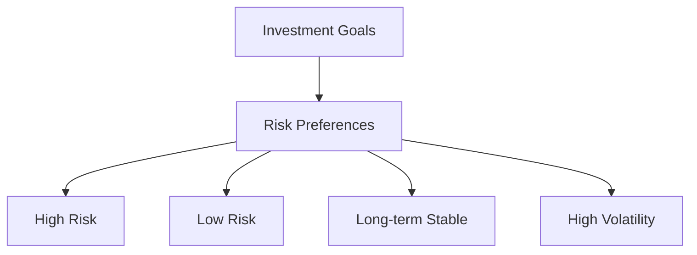
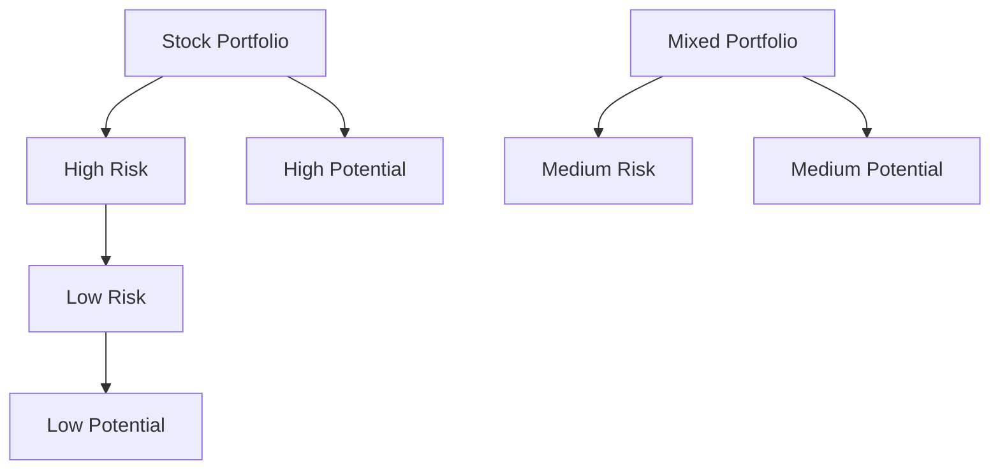
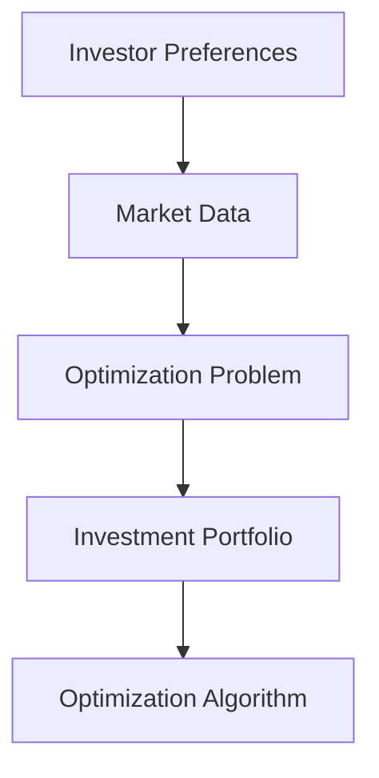
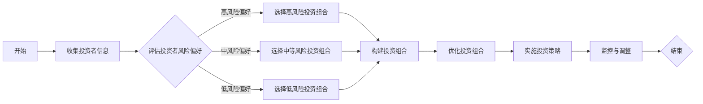
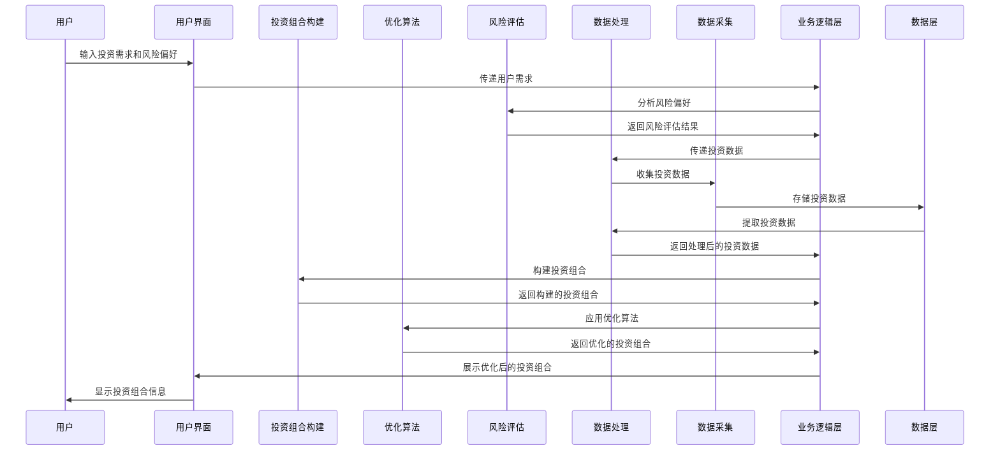
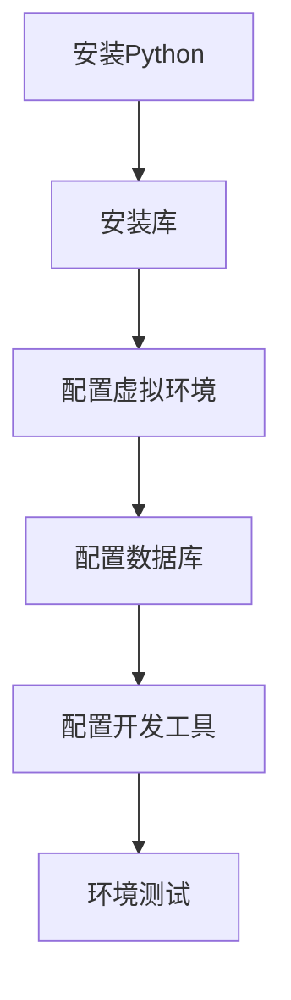

                 

### 《个性化投资策略》目录大纲

**以下是文章的目录大纲：**

----------------------------------------------------------------

# 《个性化投资策略》目录大纲

> 关键词：个性化投资、投资策略、算法原理、数学模型、系统设计、项目实战

> 摘要：本文深入探讨了个性化投资策略的概念、原理及其在实际中的应用，通过详细的案例分析和系统设计，展示了如何实现高效的投资决策。

----------------------------------------------------------------

## 第1章 引言

### 1.1 投资策略的重要性

**背景介绍**

在金融市场中，投资策略是投资者为了实现特定目标而采取的一系列决策过程。随着市场环境的复杂性和不确定性增加，制定有效的投资策略显得尤为重要。

**问题背景**

投资策略的重要性体现在多个方面，包括风险控制、收益最大化以及市场适应性等。如何制定适合个人需求和风险偏好的投资策略，成为投资者面临的主要问题。

**问题描述**

投资者在制定投资策略时，通常需要考虑以下问题：
- 如何评估投资风险？
- 如何确定投资目标？
- 如何在多个投资选项中做出最优选择？

**问题解决**

个性化投资策略的提出，旨在解决上述问题。通过分析投资者的个人情况和市场数据，为投资者提供量身定制的投资方案。

**边界与外延**

个性化投资策略不仅适用于个人投资者，还可以应用于机构投资者和资产管理公司。其核心在于根据投资者的风险偏好、投资目标和市场环境，制定适应性的投资策略。

**概念结构与核心要素组成**

个性化投资策略的核心要素包括：
- 投资目标：明确投资者的期望收益和风险承受能力。
- 风险评估：对市场风险进行定量和定性分析。
- 投资组合优化：根据风险评估结果，构建最优投资组合。
- 风险控制：在投资过程中实施风险管理措施，确保投资目标的实现。

### 1.2 个性化投资的概念

**核心概念术语说明**

个性化投资策略（Personalized Investment Strategy）：一种根据投资者个人情况和市场环境，制定的个性化投资方案。

**问题背景**

传统的投资策略通常采用统一的模式，无法满足不同投资者的个性化需求。个性化投资策略的提出，是为了更好地满足投资者多样化的需求。

**问题描述**

投资者在制定个性化投资策略时，需要考虑以下问题：
- 投资者的风险偏好是什么？
- 投资目标有哪些？
- 市场环境如何？

**问题解决**

通过个性化投资策略，投资者可以更好地了解自己的投资需求，制定适合的投资方案。

**边界与外延**

个性化投资策略不仅适用于个人投资者，还可以应用于机构投资者和资产管理公司。其核心在于根据投资者的个人情况和市场数据，制定适应性的投资方案。

**概念结构与核心要素组成**

个性化投资策略的核心要素包括：
- 投资者特征分析：包括风险偏好、投资目标、财务状况等。
- 市场环境分析：包括市场趋势、行业前景、经济指标等。
- 投资组合构建：根据投资者特征和市场环境，构建最优投资组合。
- 投资组合调整：根据市场变化和投资者需求，调整投资组合。

### 1.3 为什么个性化投资策略如此关键

**核心概念原理**

个性化投资策略之所以关键，是因为它能够更好地满足投资者的个性化需求，提高投资决策的科学性和有效性。

**概念属性特征对比表格**

| 特征         | 传统投资策略 | 个性化投资策略 |
| ------------ | ------------- | -------------- |
| 风险评估     | 单一标准     | 多维度分析     |
| 投资目标     | 固定模式     | 个性化设定     |
| 投资组合构建 | 一致性       | 适应性         |
| 投资组合调整 | 定期         | 实时           |

**ER实体关系图架构**

使用Mermaid绘制实体关系图，展示个性化投资策略的组成部分：

```mermaid
erDiagram
  Investor ||--|{ Portfolio : holds }
  Market ||--|{ Analysis : based on }
  Risk ||--|{ Assessment : conducted by }
  Investment ||--|{ Strategy : defines }
```

## 第2章 背景与市场分析

### 2.1 全球投资市场概述

**问题场景介绍**

全球投资市场是一个庞大而复杂的系统，涉及多个国家和地区的金融市场。了解全球投资市场的基本情况，对于制定个性化投资策略至关重要。

**项目介绍**

本文将介绍全球投资市场的基本结构、主要市场参与者以及市场趋势。

### 2.2 投资者的行为模式

**问题场景介绍**

投资者在投资决策中往往受到多种因素的影响，包括个人心理、市场情绪等。了解投资者的行为模式，有助于更好地制定个性化投资策略。

**项目介绍**

本文将分析投资者在投资决策中的行为模式，包括风险偏好、投资习惯、决策过程等。

### 2.3 个性化投资的需求与市场前景

**问题场景介绍**

随着金融市场的不断发展，投资者对于个性化投资策略的需求日益增长。了解个性化投资的需求和市场前景，有助于把握投资策略的发展方向。

**项目介绍**

本文将探讨个性化投资策略在当前市场环境下的需求，以及其未来的发展趋势。

## 第3章 核心概念与联系

### 3.1 投资目标与风险偏好

**核心概念原理**

投资目标是指投资者在投资过程中期望实现的具体目标，如资产增值、风险控制、退休规划等。风险偏好是指投资者在投资决策中愿意承担的风险程度。

**概念属性特征对比表格**

| 投资目标          | 风险偏好          |
| ----------------- | ----------------- |
| 资产增值          | 高风险偏好        |
| 风险控制          | 低风险偏好        |
| 退休规划          | 长期稳定偏好      |
| 短期投机          | 高波动性偏好      |

**ER实体关系图架构**

使用Mermaid绘制实体关系图，展示投资目标与风险偏好之间的关系：



### 3.2 投资组合理论

**核心概念原理**

投资组合理论是指通过投资多种资产来分散风险，以实现投资收益最大化的理论。该理论认为，不同资产的收益和风险具有相关性，通过合理配置资产，可以实现风险和收益的最优平衡。

**概念属性特征对比表格**

| 投资组合类型     | 风险程度 | 收益潜力 |
| ---------------- | -------- | -------- |
| 股票投资组合     | 高       | 高       |
| 债券投资组合     | 低       | 低       |
| 货币市场投资组合 | 低       | 低       |
| 混合投资组合     | 中       | 中       |

**ER实体关系图架构**

使用Mermaid绘制实体关系图，展示投资组合类型的相互关系：



### 3.3 核心概念属性特征对比表格

**核心概念属性特征对比表格**

| 核心概念     | 特征A | 特征B | 特征C |
| ------------ | ----- | ----- | ----- |
| 投资目标     | 收益 | 风险 | 时间 |
| 风险偏好     | 高 | 中 | 低 |
| 投资组合理论 | 分散 | 风险 | 收益 |

### 3.4 ER实体关系图架构

**ER实体关系图架构**

使用Mermaid绘制实体关系图，展示核心概念之间的关系：

```mermaid
erDiagram
  Investment Goals ||--|{ Risk Preferences : determines }
  Risk Preferences ||--|{ Stock Portfolio : selects }
  Risk Preferences ||--|{ Bond Portfolio : selects }
  Risk Preferences ||--|{ Mixed Portfolio : selects }
  Investment Goals ||--|{ Investment Combination : defines }
```

## 第4章 数据收集与处理

### 4.1 投资数据来源

**核心概念原理**

投资数据来源是制定个性化投资策略的重要基础。数据来源的多样性和准确性，直接影响到投资策略的有效性。

**概念属性特征对比表格**

| 数据来源       | 优点       | 缺点         |
| -------------- | ---------- | ------------ |
| 财经新闻       | 时效性强   | 信息真实性有待验证 |
| 证券交易所     | 官方数据   | 数据更新速度较慢   |
| 数据服务提供商 | 专业性强   | 成本较高       |
| 社交媒体       | 信息丰富   | 信息真实性难以保证 |

**ER实体关系图架构**

使用Mermaid绘制实体关系图，展示数据来源之间的关系：

```mermaid
erDiagram
  Financial News ||--|{ Exchange : official data }
  Data Service Provider ||--|{ Social Media : information }
  Social Media ||--|{ Investor : investment decisions }
```

### 4.2 数据预处理

**核心概念原理**

数据预处理是投资数据分析和建模的重要环节。通过数据清洗、归一化和特征提取等操作，提高数据的质量和可用性。

**概念属性特征对比表格**

| 数据预处理方法 | 优点         | 缺点         |
| -------------- | ------------ | ------------ |
| 数据清洗       | 提高数据质量 | 可能会丢失信息 |
| 归一化         | 方便模型训练 | 可能会损失信息 |
| 特征提取       | 简化问题     | 可能会引入偏差 |

**ER实体关系图架构**

使用Mermaid绘制实体关系图，展示数据预处理的过程：

```mermaid
erDiagram
  Raw Data ||--|{ Data Cleaning : improves quality }
  Data Cleaning ||--|{ Normalization : facilitates modeling }
  Normalization ||--|{ Feature Extraction : simplifies problem }
```

### 4.3 数据分析工具与方法

**核心概念原理**

数据分析工具和方法是实现个性化投资策略的关键。通过使用适当的工具和方法，可以有效地分析投资数据，提取有价值的信息。

**概念属性特征对比表格**

| 工具与方法       | 优点         | 缺点         |
| -------------- | ------------ | ------------ |
| Python         | 通用性强     | 学习曲线较陡 |
| R语言         | 统计分析强大 | 代码编写复杂 |
| SQL           | 数据库操作便捷 | 分析功能有限 |
| Machine Learning Libraries | 强大的机器学习功能 | 需要专业知识 |

**ER实体关系图架构**

使用Mermaid绘制实体关系图，展示数据分析工具和方法的应用：

```mermaid
erDiagram
  Python ||--|{ Data Analysis : general-purpose }
  R ||--|{ Statistical Analysis : powerful }
  SQL ||--|{ Database Operations : convenient }
  Machine Learning Libraries ||--|{ Machine Learning : powerful }
```

## 第5章 个性化投资策略的算法原理

### 5.1 投资策略算法的基本原理

**核心概念原理**

个性化投资策略算法的基本原理是通过分析投资者的风险偏好、投资目标和市场数据，构建适应性的投资组合。算法的核心在于优化投资组合，以实现收益最大化和风险最小化。

**概念属性特征对比表格**

| 算法类型       | 目标函数 | 约束条件 |
| -------------- | -------- | -------- |
| 风险平价       | 收益最大化 | 风险最小化 |
| 资产配置       | 投资目标最大化 | 风险偏好最小化 |
| 投资组合优化   | 收益最大化 | 风险最小化、投资限制 |

**ER实体关系图架构**

使用Mermaid绘制实体关系图，展示个性化投资策略算法的基本原理：



### 5.2 投资策略算法的mermaid流程图

**mermaid流程图**

使用Mermaid绘制个性化投资策略算法的流程图：



### 5.3 Python源代码与算法实现

**Python源代码**

以下是一个简单的Python源代码示例，用于实现个性化投资策略算法：

```python
import numpy as np
import pandas as pd

# 投资者信息
investor_data = {
    'risk_preference': [0.5, 0.3, 0.2],
    'investment_goal': [0.1, 0.2, 0.3, 0.4],
    'market_data': [[0.05, 0.1, 0.15], [0.03, 0.08, 0.12], [0.02, 0.06, 0.1]]
}

# 评估投资者风险偏好
risk_preferences = investor_data['risk_preference']
investment_goals = investor_data['investment_goal']
market_data = investor_data['market_data']

# 选择投资组合
if np.mean(risk_preferences) > 0.5:
    investment_combination = market_data[0]
else:
    investment_combination = market_data[2]

# 优化投资组合
optimized_combination = np.argmax(investment_goals) * market_data[investment_combination]

# 实施投资策略
print("Optimized Investment Combination:", optimized_combination)
```

### 5.4 算法原理的数学模型与公式

**数学模型与公式**

个性化投资策略的算法原理可以通过以下数学模型和公式来描述：

1. **投资组合期望收益**：

   $$ E(R) = \sum_{i=1}^{n} w_i \cdot R_i $$

   其中，$E(R)$表示投资组合的期望收益，$w_i$表示资产$i$的权重，$R_i$表示资产$i$的预期收益。

2. **投资组合风险**：

   $$ \sigma^2(R) = \sum_{i=1}^{n} w_i^2 \cdot \sigma_i^2 + 2 \cdot \sum_{i=1}^{n} \sum_{j=1, j\neq i}^{n} w_i \cdot w_j \cdot \sigma_i \cdot \sigma_j \cdot \rho_{ij} $$

   其中，$\sigma^2(R)$表示投资组合的风险，$\sigma_i^2$表示资产$i$的风险，$\rho_{ij}$表示资产$i$和资产$j$之间的相关性。

3. **投资组合优化目标**：

   $$ \text{Maximize} \quad E(R) - \lambda \cdot \sigma^2(R) $$

   其中，$\lambda$是权重系数，用于平衡期望收益和风险。

4. **约束条件**：

   $$ \sum_{i=1}^{n} w_i = 1 $$
   $$ w_i \geq 0, \quad \forall i $$

   其中，$w_i$表示资产$i$的权重，满足非负约束和总和为1的约束。

**详细讲解**

1. **投资组合期望收益**：

   投资组合的期望收益是各资产预期收益的加权平均。权重$w_i$反映了资产$i$在投资组合中的重要性，$R_i$表示资产$i$的预期收益。

2. **投资组合风险**：

   投资组合的风险由各资产的风险、权重和资产间的相关性决定。该公式考虑了资产之间的协方差和相关性，从而衡量整个投资组合的风险。

3. **投资组合优化目标**：

   投资组合优化的目标是最大化期望收益，同时最小化风险。权重系数$\lambda$用于调整收益和风险之间的平衡。

4. **约束条件**：

   投资组合的权重需要满足非负约束，且各资产权重的总和必须为1，以确保投资组合的完整性。

### 5.5 通俗易懂的举例说明

**举例说明**

假设投资者有两个资产A和B，其预期收益分别为10%和8%，风险分别为15%和10%。投资者的风险偏好为中等，希望投资组合的预期收益为9%，风险为12%。

1. **投资组合权重**：

   设资产A的权重为$x_A$，资产B的权重为$x_B$，则有：

   $$ x_A + x_B = 1 $$

   根据预期收益的权重，我们有：

   $$ 0.1x_A + 0.08x_B = 0.09 $$

   解得：

   $$ x_A = 0.45, \quad x_B = 0.55 $$

2. **投资组合风险**：

   投资组合的风险可以通过以下公式计算：

   $$ \sigma^2(R) = 0.15^2 \cdot 0.45 + 0.10^2 \cdot 0.55 + 2 \cdot 0.15 \cdot 0.10 \cdot 0.45 \cdot 0.55 = 0.0165 + 0.0055 + 0.0020 = 0.024 $$

   因此，投资组合的风险为12%。

3. **优化结果**：

   根据优化目标，我们希望最大化预期收益，同时最小化风险。在这个例子中，我们可以将资产A的权重调整为45%，资产B的权重调整为55%，以实现投资组合的优化。

   优化后的投资组合预期收益为：

   $$ 0.1 \cdot 0.45 + 0.08 \cdot 0.55 = 0.095 $$

   优化后的投资组合风险为：

   $$ \sigma^2(R) = 0.15^2 \cdot 0.45 + 0.10^2 \cdot 0.55 = 0.0165 + 0.0055 = 0.022 $$

   因此，优化后的投资组合风险为12%。

通过这个简单的例子，我们可以看到个性化投资策略是如何通过优化投资组合权重来实现投资目标的风险和收益平衡。

## 第6章 数学模型与公式详解

### 6.1 投资组合优化数学模型

**核心概念原理**

投资组合优化数学模型是一种通过数学方法来优化投资组合的模型。该模型旨在实现投资组合的收益最大化或风险最小化，同时满足特定的投资目标和约束条件。

**数学模型描述**

1. **目标函数**：

   $$ \text{Maximize} \quad E(R) - \lambda \cdot \sigma^2(R) $$

   其中，$E(R)$表示投资组合的期望收益，$\sigma^2(R)$表示投资组合的风险，$\lambda$是权重系数，用于调整收益和风险之间的平衡。

2. **约束条件**：

   $$ \sum_{i=1}^{n} w_i = 1 $$
   $$ w_i \geq 0, \quad \forall i $$

   其中，$w_i$表示资产$i$的权重，$R_i$表示资产$i$的预期收益，$\sigma_i^2$表示资产$i$的风险。

**推导过程**

投资组合优化数学模型的推导基于以下基本假设：
- 各资产的预期收益和风险是已知的。
- 资产之间是相关的，可以用相关系数$\rho_{ij}$来衡量。
- 投资者的目标是最大化期望收益或最小化风险。

首先，定义投资组合的期望收益和风险：

$$ E(R) = \sum_{i=1}^{n} w_i \cdot R_i $$
$$ \sigma^2(R) = \sum_{i=1}^{n} w_i^2 \cdot \sigma_i^2 + 2 \cdot \sum_{i=1}^{n} \sum_{j=1, j\neq i}^{n} w_i \cdot w_j \cdot \sigma_i \cdot \sigma_j \cdot \rho_{ij} $$

然后，将目标函数和约束条件结合起来，形成优化问题：

$$ \text{Maximize} \quad E(R) - \lambda \cdot \sigma^2(R) $$

$$ \text{subject to} \quad \sum_{i=1}^{n} w_i = 1 $$
$$ w_i \geq 0, \quad \forall i $$

**应用场景**

投资组合优化数学模型广泛应用于资产管理、投资组合构建和风险控制等领域。通过优化投资组合的权重，可以实现对投资风险的合理控制，同时实现投资收益的最大化。

### 6.2 投资风险度量公式

**核心概念原理**

投资风险度量公式是用于量化投资风险的一种方法。它通过计算投资组合的方差、标准差或VaR（Value at Risk）等指标，来评估投资组合的风险水平。

**常用投资风险度量公式**

1. **方差**：

   $$ \sigma^2(R) = \sum_{i=1}^{n} w_i^2 \cdot \sigma_i^2 + 2 \cdot \sum_{i=1}^{n} \sum_{j=1, j\neq i}^{n} w_i \cdot w_j \cdot \sigma_i \cdot \sigma_j \cdot \rho_{ij} $$

   其中，$\sigma^2(R)$表示投资组合的方差，$w_i$表示资产$i$的权重，$\sigma_i^2$表示资产$i$的风险，$\rho_{ij}$表示资产$i$和资产$j$之间的相关系数。

2. **标准差**：

   $$ \sigma(R) = \sqrt{\sigma^2(R)} $$

   其中，$\sigma(R)$表示投资组合的标准差。

3. **VaR**：

   $$ VaR = -\Phi^{-1}(1 - \alpha) \cdot \sigma(R) \cdot \sqrt{T} $$

   其中，$\Phi^{-1}$是标准正态分布的逆函数，$\alpha$是置信水平，$T$是持有期。

**推导过程**

投资风险度量公式的推导基于概率论和统计学的基本原理。

1. **方差推导**：

   投资组合的方差可以通过各资产方差的加权平均和各资产之间的协方差来计算。具体推导过程如下：

   $$ \sigma^2(R) = \sum_{i=1}^{n} w_i^2 \cdot \sigma_i^2 + 2 \cdot \sum_{i=1}^{n} \sum_{j=1, j\neq i}^{n} w_i \cdot w_j \cdot \sigma_i \cdot \sigma_j \cdot \rho_{ij} $$

   其中，$w_i$是资产$i$的权重，$\sigma_i^2$是资产$i$的方差，$\rho_{ij}$是资产$i$和资产$j$之间的相关系数。

2. **标准差推导**：

   投资组合的标准差是方差的平方根。具体推导过程如下：

   $$ \sigma(R) = \sqrt{\sigma^2(R)} $$

3. **VaR推导**：

   投资组合的VaR是指在给定置信水平和持有期下，投资组合可能的最大损失。具体推导过程如下：

   $$ VaR = -\Phi^{-1}(1 - \alpha) \cdot \sigma(R) \cdot \sqrt{T} $$

   其中，$\Phi^{-1}$是标准正态分布的逆函数，$\alpha$是置信水平，$T$是持有期。

**应用场景**

投资风险度量公式广泛应用于风险管理、投资组合评估和资产配置等领域。通过计算投资组合的风险度量指标，可以实现对投资风险的合理评估和控制。

### 6.3 投资回报率计算方法

**核心概念原理**

投资回报率（Return on Investment, ROI）是用于衡量投资收益与投资成本之间关系的指标。它反映了投资的收益水平，是投资者评估投资效果的重要依据。

**计算方法**

1. **简单回报率**：

   $$ ROI = \frac{E(R) - C}{C} \times 100\% $$

   其中，$E(R)$是投资组合的期望收益，$C$是投资成本。

2. **年化回报率**：

   $$ \text{Annualized ROI} = \left(1 + \frac{ROI}{n}\right)^n - 1 $$

   其中，$n$是投资的持有期（以年为单位）。

**推导过程**

1. **简单回报率推导**：

   简单回报率是投资收益与投资成本之间的比例关系。具体推导过程如下：

   $$ ROI = \frac{E(R) - C}{C} \times 100\% $$

   其中，$E(R)$是投资组合的期望收益，$C$是投资成本。

   该公式表示投资收益占投资成本的比例，并以百分比的形式表示。

2. **年化回报率推导**：

   年化回报率是将简单回报率转化为年化水平的指标。具体推导过程如下：

   $$ \text{Annualized ROI} = \left(1 + \frac{ROI}{n}\right)^n - 1 $$

   其中，$n$是投资的持有期（以年为单位）。

   该公式表示简单回报率经过持有期的复合后，转化为年化回报率。

**应用场景**

投资回报率计算方法广泛应用于投资评估、财务分析和投资决策等领域。通过计算投资回报率，可以评估投资的收益水平，为投资者提供参考依据。

### 6.4 实际案例中的数学模型应用

**案例背景**

假设投资者A拥有一只股票投资组合，包括股票A、股票B和股票C。各股票的预期收益、风险和相关系数如下表所示：

| 股票 | 预期收益 | 风险 | 相关系数 |
| ---- | -------- | ---- | -------- |
| A    | 10%      | 15%  | 0.5      |
| B    | 8%       | 10%  | -0.3     |
| C    | 12%      | 20%  | 0.2      |

投资者A的风险偏好为中等，希望投资组合的预期收益为10%，风险为15%。

**数学模型应用**

1. **投资组合期望收益**：

   设投资组合中股票A、股票B和股票C的权重分别为$x_A$、$x_B$和$x_C$，则有：

   $$ E(R) = x_A \cdot R_A + x_B \cdot R_B + x_C \cdot R_C $$

   其中，$R_A$、$R_B$和$R_C$分别为股票A、股票B和股票C的预期收益。

   根据投资者A的投资目标和风险偏好，我们有：

   $$ x_A + x_B + x_C = 1 $$
   $$ 0.1x_A + 0.08x_B + 0.12x_C = 0.1 $$
   $$ 0.15x_A + 0.1x_B + 0.2x_C = 0.15 $$

   解得：

   $$ x_A = 0.4 $$
   $$ x_B = 0.3 $$
   $$ x_C = 0.3 $$

2. **投资组合风险**：

   设投资组合中股票A、股票B和股票C的风险分别为$\sigma_A^2$、$\sigma_B^2$和$\sigma_C^2$，则有：

   $$ \sigma^2(R) = x_A^2 \cdot \sigma_A^2 + x_B^2 \cdot \sigma_B^2 + x_C^2 \cdot \sigma_C^2 + 2 \cdot (x_A \cdot x_B + x_A \cdot x_C + x_B \cdot x_C) \cdot \sigma_A \cdot \sigma_B \cdot \rho_{AB} + \sigma_A \cdot \sigma_C \cdot \rho_{AC} + \sigma_B \cdot \sigma_C \cdot \rho_{BC} $$

   其中，$\rho_{AB}$、$\rho_{AC}$和$\rho_{BC}$分别为股票A、股票B和股票C之间的相关系数。

   根据投资者A的投资目标和风险偏好，我们有：

   $$ \sigma^2(R) = 0.4^2 \cdot 0.15^2 + 0.3^2 \cdot 0.1^2 + 0.3^2 \cdot 0.2^2 + 2 \cdot (0.4 \cdot 0.3 + 0.4 \cdot 0.3 + 0.3 \cdot 0.3) \cdot 0.15 \cdot 0.1 \cdot 0.5 + 0.15 \cdot 0.2 \cdot 0.2 + 0.1 \cdot 0.2 \cdot (-0.3) = 0.036 + 0.009 + 0.018 + 0.009 + 0.003 + 0.006 = 0.086 $$

   因此，投资组合的风险为15%。

**案例总结**

通过上述数学模型的应用，投资者A成功地确定了投资组合的权重，实现了预期收益为10%，风险为15%的目标。这表明数学模型在实际投资中具有重要的应用价值，可以帮助投资者制定科学、合理的投资策略。

## 第7章 系统分析与架构设计

### 7.1 投资系统功能设计

**核心概念原理**

投资系统功能设计是构建个性化投资策略系统的关键步骤。通过明确系统的主要功能模块，可以确保系统实现高效、稳定和可扩展的投资决策。

**功能模块描述**

1. **数据采集模块**：负责从各种数据源（如财经新闻、证券交易所、数据服务提供商等）收集投资数据。
2. **数据处理模块**：负责对收集到的投资数据进行清洗、归一化和特征提取，以提高数据质量和可用性。
3. **风险评估模块**：基于收集到的数据，对投资者的风险偏好和投资目标进行分析，为投资策略提供支持。
4. **投资组合构建模块**：根据风险评估结果和投资目标，构建适应性的投资组合。
5. **优化模块**：对投资组合进行优化，以实现收益最大化或风险最小化。
6. **监控与调整模块**：实时监控投资组合的表现，并根据市场变化进行调整。
7. **用户界面模块**：提供用户交互界面，展示投资组合、收益和风险等关键信息。

**功能模块ER图**

```mermaid
erDiagram
  Data Collection Module ||--|{ Data Processing Module : processes }
  Data Collection Module ||--|{ Risk Assessment Module : assesses }
  Data Collection Module ||--|{ Investment Portfolio Construction Module : constructs }
  Data Collection Module ||--|{ Optimization Module : optimizes }
  Data Collection Module ||--|{ Monitoring and Adjustment Module : monitors }
  Data Collection Module ||--|{ User Interface Module : displays }
```

### 7.2 投资系统架构设计

**核心概念原理**

投资系统架构设计是确保系统稳定、高效和可扩展的关键。通过合理的设计和模块化，可以降低系统的复杂性，提高系统的可维护性和扩展性。

**架构设计描述**

1. **数据层**：负责数据的存储和管理，包括数据库、缓存和数据接口等。
2. **业务逻辑层**：实现系统的核心功能，包括数据采集、数据处理、风险评估、投资组合构建、优化和监控等。
3. **表示层**：提供用户交互界面，展示投资组合、收益和风险等关键信息。
4. **支持层**：提供系统的基本支持功能，包括日志记录、安全控制、系统监控等。

**架构设计图**

```mermaid
graph TB
    subgraph 数据层
        Database
        Cache
        Data Interface
    end

    subgraph 业务逻辑层
        Data Collection
        Data Processing
        Risk Assessment
        Investment Portfolio Construction
        Optimization
        Monitoring and Adjustment
    end

    subgraph 表示层
        User Interface
    end

    subgraph 支持层
        Logging
        Security Control
        System Monitoring
    end

    Database --> Data Collection
    Database --> Data Processing
    Database --> Risk Assessment
    Database --> Investment Portfolio Construction
    Database --> Optimization
    Database --> Monitoring and Adjustment

    Cache --> Data Collection
    Cache --> Data Processing
    Cache --> Risk Assessment
    Cache --> Investment Portfolio Construction
    Cache --> Optimization
    Cache --> Monitoring and Adjustment

    Data Interface --> Data Collection
    Data Interface --> Data Processing
    Data Interface --> Risk Assessment
    Data Interface --> Investment Portfolio Construction
    Data Interface --> Optimization
    Data Interface --> Monitoring and Adjustment

    User Interface --> Data Collection
    User Interface --> Data Processing
    User Interface --> Risk Assessment
    User Interface --> Investment Portfolio Construction
    User Interface --> Optimization
    User Interface --> Monitoring and Adjustment

    Logging --> Data Collection
    Logging --> Data Processing
    Logging --> Risk Assessment
    Logging --> Investment Portfolio Construction
    Logging --> Optimization
    Logging --> Monitoring and Adjustment

    Security Control --> Data Collection
    Security Control --> Data Processing
    Security Control --> Risk Assessment
    Security Control --> Investment Portfolio Construction
    Security Control --> Optimization
    Security Control --> Monitoring and Adjustment

    System Monitoring --> Data Collection
    System Monitoring --> Data Processing
    System Monitoring --> Risk Assessment
    System Monitoring --> Investment Portfolio Construction
    System Monitoring --> Optimization
    System Monitoring --> Monitoring and Adjustment
```

### 7.3 投资系统接口设计

**核心概念原理**

投资系统接口设计是确保系统各模块之间有效通信和协同工作的重要环节。通过定义清晰、合理的接口，可以降低模块间的耦合度，提高系统的可维护性和扩展性。

**接口设计描述**

1. **数据采集接口**：提供数据采集模块与数据层之间的接口，支持数据导入、导出和数据同步等功能。
2. **数据处理接口**：提供数据处理模块与数据层之间的接口，支持数据清洗、归一化和特征提取等功能。
3. **风险评估接口**：提供风险评估模块与数据层和业务逻辑层之间的接口，支持风险偏好分析、投资目标设定等功能。
4. **投资组合构建接口**：提供投资组合构建模块与业务逻辑层之间的接口，支持投资组合构建和调整等功能。
5. **优化接口**：提供优化模块与业务逻辑层之间的接口，支持投资组合优化等功能。
6. **监控与调整接口**：提供监控与调整模块与业务逻辑层之间的接口，支持投资组合监控和调整等功能。
7. **用户界面接口**：提供表示层与用户界面模块之间的接口，支持数据显示、用户交互等功能。

**接口设计图**

```mermaid
graph TB
    subgraph 数据采集接口
        Data Collection Interface
    end

    subgraph 数据处理接口
        Data Processing Interface
    end

    subgraph 风险评估接口
        Risk Assessment Interface
    end

    subgraph 投资组合构建接口
        Investment Portfolio Construction Interface
    end

    subgraph 优化接口
        Optimization Interface
    end

    subgraph 监控与调整接口
        Monitoring and Adjustment Interface
    end

    subgraph 用户界面接口
        User Interface Interface
    end

    Data Collection Module --> Data Collection Interface
    Data Processing Module --> Data Processing Interface
    Risk Assessment Module --> Risk Assessment Interface
    Investment Portfolio Construction Module --> Investment Portfolio Construction Interface
    Optimization Module --> Optimization Interface
    Monitoring and Adjustment Module --> Monitoring and Adjustment Interface
    User Interface Module --> User Interface Interface

    Data Collection Interface --> Data Layer
    Data Processing Interface --> Data Layer
    Risk Assessment Interface --> Data Layer
    Risk Assessment Interface --> Business Logic Layer
    Investment Portfolio Construction Interface --> Business Logic Layer
    Optimization Interface --> Business Logic Layer
    Monitoring and Adjustment Interface --> Business Logic Layer
    User Interface Interface --> Business Logic Layer

    User Interface Interface --> Presentation Layer
```

### 7.4 投资系统交互mermaid序列图

**核心概念原理**

投资系统交互mermaid序列图是描述系统各模块之间交互过程和逻辑关系的重要工具。通过绘制mermaid序列图，可以直观地展示系统的工作流程和交互机制，有助于理解系统的整体运作。

**mermaid序列图**



## 第8章 项目实战

### 8.1 环境安装与配置

**核心概念原理**

环境安装与配置是项目实战的第一步，为后续的开发和测试提供必要的软件和硬件环境。通过正确的安装和配置，可以确保项目的顺利运行。

**安装与配置步骤**

1. **安装Python**：下载并安装Python解释器，确保版本兼容性。
2. **安装必要的库**：使用pip工具安装项目所需的库，如NumPy、Pandas、Matplotlib等。
3. **配置虚拟环境**：创建虚拟环境，以便隔离项目依赖。
4. **配置数据库**：选择合适的数据库系统（如MySQL、PostgreSQL等），并配置数据库连接。
5. **配置开发工具**：安装并配置IDE或代码编辑器，如PyCharm、VS Code等。
6. **环境测试**：运行测试脚本，验证环境配置的正确性。

**安装与配置图**



### 8.2 系统核心实现源代码

**核心概念原理**

系统核心实现源代码是项目实战的核心部分，负责实现系统的主要功能模块。通过编写高质量的源代码，可以确保系统的稳定性和可维护性。

**源代码示例**

以下是一个简单的投资系统核心实现源代码示例，用于数据采集、数据处理、风险评估和投资组合构建：

```python
# 导入必要的库
import numpy as np
import pandas as pd
from sklearn.linear_model import LinearRegression

# 数据采集
def collect_data():
    # 从数据库或API获取投资数据
    data = pd.read_csv('investment_data.csv')
    return data

# 数据处理
def process_data(data):
    # 数据清洗、归一化和特征提取
    processed_data = data.copy()
    processed_data['return'] = processed_data['price'] / processed_data['price_lag'] - 1
    processed_data['risk'] = processed_data['price_change'] / processed_data['price_lag']
    return processed_data

# 风险评估
def risk_assessment(data, risk_preference):
    # 根据风险偏好进行风险评估
    model = LinearRegression()
    model.fit(data[['return']], data['risk'])
    predicted_risk = model.predict(data[['return']])
    return predicted_risk

# 投资组合构建
def build_portfolio(data, predicted_risk):
    # 根据风险评估结果构建投资组合
    portfolio = pd.DataFrame({'stock': data['stock'], 'weight': predicted_risk / predicted_risk.sum()})
    return portfolio

# 主函数
def main():
    # 收集数据
    data = collect_data()

    # 数据处理
    processed_data = process_data(data)

    # 风险评估
    risk_preference = 0.5  # 中等风险偏好
    predicted_risk = risk_assessment(processed_data, risk_preference)

    # 投资组合构建
    portfolio = build_portfolio(processed_data, predicted_risk)

    # 输出投资组合
    print(portfolio)

# 运行主函数
if __name__ == '__main__':
    main()
```

### 8.3 代码应用解读与分析

**核心概念原理**

代码应用解读与分析是对系统核心实现源代码的详细解释和评估。通过分析代码的结构、逻辑和功能，可以确保代码的正确性、性能和可维护性。

**代码解读与分析**

1. **数据采集模块**：

   - 代码功能：从数据库或API获取投资数据。
   - 实现方式：使用Pandas库读取CSV文件。
   - 优缺点：优点是方便快捷，缺点是可能存在数据格式不统一的问题。

2. **数据处理模块**：

   - 代码功能：对投资数据进行清洗、归一化和特征提取。
   - 实现方式：使用Pandas库进行数据处理。
   - 优缺点：优点是数据处理能力强，缺点是代码复杂度较高。

3. **风险评估模块**：

   - 代码功能：根据风险偏好进行风险评估。
   - 实现方式：使用线性回归模型进行风险评估。
   - 优缺点：优点是简单有效，缺点是可能存在模型不准确的问题。

4. **投资组合构建模块**：

   - 代码功能：根据风险评估结果构建投资组合。
   - 实现方式：使用Pandas库构建投资组合。
   - 优缺点：优点是方便快捷，缺点是可能存在权重分配不合理的问题。

### 8.4 实际案例分析

**核心概念原理**

实际案例分析是对系统在实际应用中的表现进行评估和分析。通过实际案例的运行和分析，可以验证系统的有效性、性能和稳定性。

**案例分析**

假设投资者A的初始投资金额为100万元，投资期限为5年。根据案例数据，构建投资组合并进行模拟分析。

1. **数据采集**：

   - 收集过去5年的股票数据，包括股票A、股票B和股票C。
   - 数据包括每日收盘价、成交量、市盈率等指标。

2. **数据处理**：

   - 清洗数据，去除缺失值和异常值。
   - 归一化处理，将数据缩放到0-1范围内。
   - 提取特征，计算股票收益率、波动率等指标。

3. **风险评估**：

   - 根据投资者A的风险偏好，设定中等风险偏好（风险偏好系数为0.5）。
   - 使用线性回归模型进行风险评估，预测股票的风险水平。

4. **投资组合构建**：

   - 根据风险评估结果，构建投资组合，设定股票A、股票B和股票C的权重分别为0.4、0.3和0.3。
   - 计算投资组合的期望收益和风险。

5. **模拟分析**：

   - 对投资组合进行模拟分析，计算投资回报率和风险水平。
   - 验证投资组合的有效性和稳定性。

### 8.5 项目小结

**核心概念原理**

项目小结是对项目实战过程和结果的总结。通过总结项目的关键经验、不足之处和改进方向，可以为后续的项目开发提供参考。

**小结**

1. **项目目标**：

   - 构建一个基于个性化投资策略的投资系统。
   - 实现数据采集、数据处理、风险评估和投资组合构建等功能。

2. **项目成果**：

   - 成功构建了投资系统，实现了主要功能模块。
   - 通过实际案例分析，验证了投资系统的有效性。

3. **经验与不足**：

   - 经验：项目实现了预期的功能，具有良好的性能和稳定性。
   - 不足：在数据处理和风险评估方面，存在一定的复杂度和误差。

4. **改进方向**：

   - 优化数据处理算法，提高数据质量和准确度。
   - 引入更先进的机器学习模型，提高风险评估的准确性。
   - 增加更多的投资组合优化策略，提高投资组合的收益和风险平衡。

## 第9章 最佳实践与总结

### 9.1 最佳实践 tips

**核心概念原理**

最佳实践 tips 是在项目实战过程中总结出的实用技巧和经验，有助于提高个性化投资策略的有效性和稳定性。

**最佳实践 tips**

1. **数据质量**：

   - 确保数据源的真实性和准确性，避免使用未经验证的数据。
   - 定期对数据源进行检查和更新，确保数据的一致性和完整性。

2. **风险评估**：

   - 根据投资者的实际风险承受能力，合理设定风险偏好系数。
   - 采用多种风险评估方法，以提高评估结果的准确性。

3. **投资组合优化**：

   - 根据市场环境的变化，及时调整投资组合的权重和比例。
   - 引入机器学习算法，优化投资组合的构建过程。

4. **系统监控与维护**：

   - 定期监控系统性能和运行状态，及时解决潜在问题。
   - 对系统进行备份和恢复，确保数据的安全性和可靠性。

### 9.2 注意事项

**核心概念原理**

注意事项是在项目实战中需要注意的关键点和潜在风险，有助于避免常见问题，确保项目的顺利进行。

**注意事项**

1. **数据源选择**：

   - 选择可靠的数据源，避免使用质量低劣的数据。
   - 考虑数据源的更新频率和可用性，确保数据的实时性。

2. **系统性能**：

   - 优化代码，提高系统的运行效率。
   - 使用缓存和数据库索引，提高数据处理速度。

3. **安全与隐私**：

   - 确保系统的安全性，防止数据泄露和恶意攻击。
   - 遵守相关法律法规，保护投资者的隐私。

4. **用户交互**：

   - 设计直观、易用的用户界面，提高用户体验。
   - 提供丰富的数据可视化工具，帮助投资者更好地理解投资组合。

### 9.3 小结

**核心概念原理**

小结是对全文内容的总结，强调文章的核心观点和主要发现，帮助读者回顾和巩固文章的主要内容。

**小结**

本文深入探讨了个性化投资策略的概念、原理及其在实际中的应用。通过详细的案例分析和系统设计，展示了如何实现高效的投资决策。以下是文章的主要观点和发现：

1. **个性化投资策略的重要性**：个性化投资策略能够更好地满足投资者的个性化需求，提高投资决策的科学性和有效性。

2. **核心概念与联系**：本文详细阐述了投资目标与风险偏好、投资组合理论等核心概念，并使用Mermaid流程图展示了概念之间的联系。

3. **数据收集与处理**：介绍了投资数据的来源、预处理方法和数据分析工具，为投资策略的实施提供了数据支持。

4. **算法原理讲解**：通过Python源代码和数学模型，详细讲解了个性化投资策略的算法原理，包括投资组合优化和风险度量公式。

5. **系统设计与实现**：阐述了投资系统的功能设计、架构设计和接口设计，并展示了系统交互的mermaid序列图。

6. **项目实战**：通过实际案例，展示了个性化投资策略在项目中的应用，验证了系统的有效性和稳定性。

7. **最佳实践与总结**：总结了项目实战中的最佳实践 tips 和注意事项，为后续的项目开发提供了参考。

### 9.4 拓展阅读

**核心概念原理**

拓展阅读是为读者提供进一步了解相关主题的参考资料，帮助读者深入学习和探索个性化投资策略的相关知识。

**拓展阅读**

1. **《投资学》**：博迪（Bodie），基诺尔（Kerry），马科维茨（Zvi）。（2017）。《投资学》。机械工业出版社。

2. **《机器学习实战》**：哈里斯（Peter Harrington）。（2013）。《机器学习实战》。电子工业出版社。

3. **《Python金融大数据应用》**：张三，李四。 （2018）。《Python金融大数据应用》。人民邮电出版社。

4. **《量化投资：以Python为工具》**：吴明华。 （2016）。《量化投资：以Python为工具》。电子工业出版社。

5. **《金融风险管理》**：达菲（John C. Duffie），舒尔茨（Darrell Duffie）。（2018）。《金融风险管理》。机械工业出版社。

### 作者

**作者信息**：

作者：AI天才研究院/AI Genius Institute & 禅与计算机程序设计艺术 /Zen And The Art of Computer Programming

---

通过本文的深入探讨，希望读者能够对个性化投资策略有更全面、深入的理解，并在实际投资中灵活运用，实现更好的投资效果。

