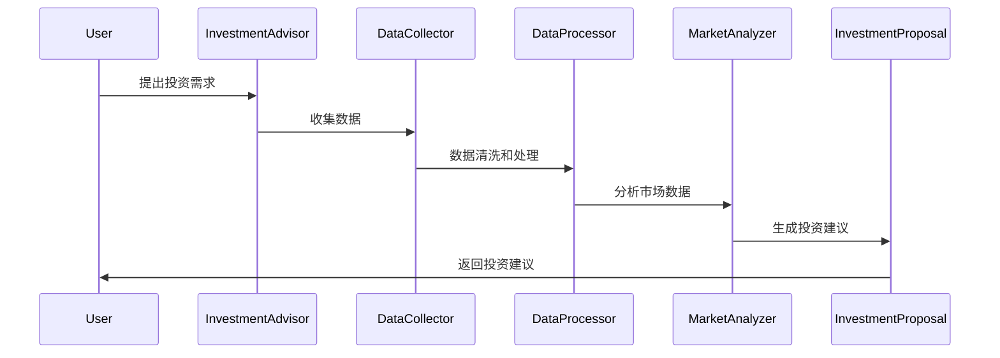
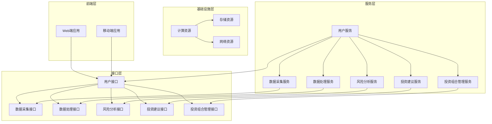

                 

# 云服务在投资理财智能助手中的高效部署

## 关键词

- 云服务
- 投资理财智能助手
- 高效部署
- 优势分析
- 架构设计
- 安全与隐私

## 摘要

随着云计算技术的快速发展，云服务在各个领域的应用日益广泛。特别是在投资理财领域，智能助手作为一种新兴的金融服务工具，正逐渐改变人们的理财方式。本文将深入探讨云服务在投资理财智能助手中的高效部署，分析其优势与挑战，并提供一些建议与展望。

## 目录大纲

### 第一部分：云服务概述

#### 第1章：云服务的基本概念

1.1 云计算的定义和类型

1.2 云服务的优势和挑战

1.3 云服务市场的现状和趋势

#### 第2章：云服务的基础架构

2.1 云计算基础设施

2.2 云服务模型

2.3 云服务架构

### 第二部分：投资理财智能助手

#### 第3章：投资理财智能助手概述

3.1 投资理财智能助手的定义

3.2 投资理财智能助手的应用场景

3.3 投资理财智能助手的核心功能

#### 第4章：投资理财智能助手的架构设计

4.1 投资理财智能助手的技术选型

4.2 数据采集与处理

4.3 算法设计与实现

#### 第5章：云服务在投资理财智能助手中的应用

5.1 云服务的优势在投资理财智能助手中的应用

5.2 云服务在投资理财智能助手中的实现细节

5.3 云服务的安全和隐私问题

### 第三部分：案例分析

#### 第6章：投资理财智能助手案例分析

6.1 案例一：智能投顾平台

6.2 案例二：智能理财产品推荐系统

6.3 案例分析总结

### 第四部分：未来发展趋势

#### 第7章：云服务在投资理财智能助手中的未来发展趋势

7.1 云服务在投资理财领域的创新应用

7.2 投资理财智能助手的未来发展挑战与机遇

7.3 未来展望

## 第一部分：云服务概述

### 第1章：云服务的基本概念

#### 1.1 云计算的定义和类型

云计算是一种通过网络提供计算资源、存储资源和应用程序的服务模式。它可以将计算资源按需分配给用户，使用户可以随时随地访问所需的资源，从而提高资源利用率和服务质量。

根据服务模式，云计算可以分为以下三种类型：

1. **基础设施即服务（IaaS）**：提供计算资源、存储资源和网络资源等基础设施，用户可以根据需求灵活配置和扩展。
2. **平台即服务（PaaS）**：提供开发平台、开发工具和数据库等服务，用户可以在平台上快速开发、部署和管理应用程序。
3. **软件即服务（SaaS）**：提供应用程序和服务，用户可以直接使用，无需关心底层基础设施和平台。

#### 1.2 云服务的优势和挑战

**优势：**

1. **弹性扩展**：云服务可以根据用户需求动态调整资源，实现弹性扩展，降低企业成本。
2. **高效部署**：云服务可以快速部署，缩短产品上市时间，提高市场竞争力。
3. **高可用性**：云服务通常提供高可用性保障，减少系统故障和停机时间。
4. **安全性**：云服务提供商通常会采用一系列安全措施，保护用户数据安全。

**挑战：**

1. **数据安全与隐私**：用户需要担心数据在云服务中是否安全，以及隐私保护问题。
2. **依赖性**：企业对云服务提供商的依赖性增加，一旦服务中断，可能会对业务造成影响。
3. **技术门槛**：云服务涉及多种技术，企业需要投入一定人力和物力来学习和掌握。

#### 1.3 云服务市场的现状和趋势

随着云计算技术的不断发展，云服务市场呈现出快速增长的趋势。据市场研究机构数据显示，全球云服务市场规模逐年扩大，预计未来几年将继续保持高速增长。

在中国市场，云计算已经成为国家战略性新兴产业，国家政府和企业纷纷加大对云计算的投入。中国云计算市场呈现出多元化、竞争激烈的特点，国内外云服务提供商纷纷布局中国市场。

### 第2章：云服务的基础架构

#### 2.1 云计算基础设施

云计算基础设施是云服务的基石，主要包括服务器、存储设备、网络设备等硬件资源。云服务提供商通常采用分布式架构，将硬件资源分布在多个地理位置，以提高系统的可用性和可靠性。

**数据中心**：数据中心是云计算基础设施的核心，负责存储和处理大量数据。数据中心通常采用模块化设计，便于扩展和维护。

**网络架构**：云服务提供商通常采用多层网络架构，包括内部网络、外部网络和数据中心网络。内部网络负责数据中心内部设备之间的通信，外部网络负责与互联网的连接，数据中心网络负责数据中心内部的数据传输。

**存储架构**：云服务提供商通常采用分布式存储架构，将数据存储在多个存储设备上，以提高存储容量和可靠性。

#### 2.2 云服务模型

**基础设施即服务（IaaS）**：IaaS提供计算资源、存储资源和网络资源等基础设施，用户可以根据需求自行配置和管理。

**平台即服务（PaaS）**：PaaS提供开发平台、开发工具和数据库等服务，用户可以在平台上快速开发、部署和管理应用程序。

**软件即服务（SaaS）**：SaaS提供应用程序和服务，用户可以直接使用，无需关心底层基础设施和平台。

#### 2.3 云服务架构

云服务架构通常包括以下层次：

1. **基础设施层**：提供计算资源、存储资源和网络资源等基础设施。
2. **平台层**：提供开发平台、开发工具和数据库等服务。
3. **应用层**：提供应用程序和服务，满足用户需求。

云服务架构的设计需要考虑高可用性、可扩展性和安全性等因素，以确保系统的稳定运行和可靠服务。

## 第二部分：投资理财智能助手

### 第3章：投资理财智能助手概述

#### 3.1 投资理财智能助手的定义

投资理财智能助手是一种基于人工智能技术，为投资者提供智能投资建议、风险分析、资产配置等服务的工具。它通过大数据分析和机器学习算法，对市场数据进行分析和处理，为用户提供个性化的投资建议。

#### 3.2 投资理财智能助手的应用场景

投资理财智能助手可以应用于以下场景：

1. **个人投资者**：为个人投资者提供投资策略建议、风险分析和资产配置建议，帮助投资者实现资产增值。
2. **机构投资者**：为机构投资者提供市场分析、投资组合优化和风险管理等服务，提高投资效率。
3. **金融机构**：为金融机构提供智能投顾、智能推荐和智能营销等服务，提升客户体验和竞争力。

#### 3.3 投资理财智能助手的核心功能

投资理财智能助手的核心功能包括：

1. **数据采集与处理**：收集金融市场数据、用户数据和其他相关数据，对数据进行分析和处理，为投资决策提供数据支持。
2. **风险分析**：根据市场数据和用户偏好，对投资风险进行评估，为用户提供风险预警和建议。
3. **资产配置**：根据用户的风险承受能力和投资目标，为用户制定个性化的资产配置策略。
4. **投资建议**：基于大数据分析和机器学习算法，为用户提供投资策略建议，帮助用户实现资产增值。

### 第4章：投资理财智能助手的架构设计

#### 4.1 投资理财智能助手的技术选型

投资理财智能助手的技术选型包括以下方面：

1. **编程语言**：选择具有良好生态系统和开发工具的编程语言，如Python、Java等。
2. **大数据处理框架**：选择适用于大规模数据处理的框架，如Hadoop、Spark等。
3. **机器学习框架**：选择具有良好性能和易用性的机器学习框架，如TensorFlow、PyTorch等。
4. **前端技术**：选择适用于Web开发的框架，如React、Vue等。

#### 4.2 数据采集与处理

数据采集与处理是投资理财智能助手的核心环节，主要包括以下步骤：

1. **数据源选择**：选择可靠的数据源，包括金融市场数据、用户数据和其他相关数据。
2. **数据采集**：通过API、爬虫等方式采集数据，并对数据进行清洗和预处理。
3. **数据存储**：将处理后的数据存储在数据库中，如MySQL、MongoDB等。
4. **数据建模**：根据业务需求，对数据进行建模和分析，提取有用信息。

#### 4.3 算法设计与实现

算法设计与实现是投资理财智能助手的灵魂，主要包括以下方面：

1. **特征工程**：提取与投资决策相关的特征，如市场指标、用户行为等。
2. **算法选择**：选择适用于投资决策的算法，如回归分析、神经网络等。
3. **模型训练与优化**：使用训练数据集训练模型，并对模型进行优化。
4. **模型部署**：将训练好的模型部署到生产环境，为用户提供实时投资建议。

### 第5章：云服务在投资理财智能助手中的应用

#### 5.1 云服务的优势在投资理财智能助手中的应用

云服务在投资理财智能助手中的应用具有以下优势：

1. **弹性扩展**：云服务可以快速响应业务需求，实现弹性扩展，提高系统性能。
2. **高效部署**：云服务可以快速部署，缩短产品上市时间，提高市场竞争力。
3. **高可用性**：云服务提供商通常提供高可用性保障，减少系统故障和停机时间。
4. **安全性**：云服务提供商通常会采用一系列安全措施，保护用户数据安全。

#### 5.2 云服务在投资理财智能助手中的实现细节

云服务在投资理财智能助手中的实现细节包括以下方面：

1. **基础设施部署**：使用云服务提供商提供的虚拟机、容器等技术，实现投资理财智能助手的基础设施部署。
2. **数据处理与存储**：使用云服务提供商的数据处理和存储服务，如大数据处理平台、数据库等，实现数据采集、处理和存储。
3. **机器学习平台**：使用云服务提供商的机器学习平台，如Google Cloud AI、AWS Sagemaker等，实现算法设计与模型训练。
4. **前端部署**：使用云服务提供商的Web托管服务，如AWS Lambda、Google App Engine等，实现前端部署。

#### 5.3 云服务的安全和隐私问题

云服务在投资理财智能助手中的应用需要关注安全和隐私问题，主要包括以下方面：

1. **数据安全**：采用加密技术保护用户数据，确保数据在传输和存储过程中的安全性。
2. **隐私保护**：遵循隐私保护法规，如欧盟的《通用数据保护条例》（GDPR），确保用户隐私得到保护。
3. **访问控制**：设置严格的访问控制策略，确保只有授权人员可以访问敏感数据。

### 第6章：投资理财智能助手案例分析

#### 6.1 案例一：智能投顾平台

智能投顾平台是一种典型的投资理财智能助手，它通过大数据分析和机器学习算法，为用户提供个性化的投资建议。以下是一个智能投顾平台的案例分析：

1. **项目介绍**：智能投顾平台是一款面向个人投资者的智能投资工具，通过分析用户的风险偏好、财务状况和市场数据，为用户提供资产配置和投资建议。
2. **系统功能设计**：智能投顾平台的核心功能包括用户注册、风险评估、资产配置、投资建议和投资组合管理。
3. **系统架构设计**：智能投顾平台采用微服务架构，包括用户服务、风险分析服务、投资建议服务、资产配置服务和投资组合管理服务。
4. **系统接口设计和系统交互**：智能投顾平台通过API与外部系统进行数据交互，如第三方数据提供商、金融机构等。

#### 6.2 案例二：智能理财产品推荐系统

智能理财产品推荐系统是一种面向金融机构的智能投资工具，它通过分析用户偏好、市场数据和理财产品特点，为金融机构提供理财产品推荐。以下是一个智能理财产品推荐系统的案例分析：

1. **项目介绍**：智能理财产品推荐系统是一款面向金融机构的智能推荐工具，通过分析用户行为、市场数据和理财产品特点，为金融机构提供理财产品推荐。
2. **系统功能设计**：智能理财产品推荐系统的核心功能包括用户注册、行为分析、理财产品推荐和投资决策。
3. **系统架构设计**：智能理财产品推荐系统采用大数据处理架构，包括数据采集、数据存储、数据处理和推荐算法。
4. **系统接口设计和系统交互**：智能理财产品推荐系统通过API与金融机构的业务系统进行数据交互，如用户系统、理财产品系统等。

#### 6.3 案例分析总结

通过以上两个案例分析，我们可以看到云服务在投资理财智能助手中的应用具有以下特点：

1. **高效部署**：云服务可以快速部署，缩短产品上市时间，提高市场竞争力。
2. **弹性扩展**：云服务可以弹性扩展，提高系统性能，满足业务需求。
3. **高可用性**：云服务提供商通常提供高可用性保障，减少系统故障和停机时间。
4. **安全性**：云服务提供商通常会采用一系列安全措施，保护用户数据安全。

### 第7章：云服务在投资理财智能助手中的未来发展趋势

#### 7.1 云服务在投资理财领域的创新应用

随着云计算技术的不断发展，云服务在投资理财领域将出现更多创新应用，包括：

1. **智能投顾**：通过大数据分析和机器学习算法，为用户提供更精准的投资建议。
2. **智能风控**：利用人工智能技术进行风险预测和评估，提高风险管理能力。
3. **智能投研**：利用大数据分析和机器学习算法，为金融机构提供市场分析和投资决策支持。

#### 7.2 投资理财智能助手的未来发展挑战与机遇

投资理财智能助手的未来发展将面临以下挑战和机遇：

1. **数据隐私与安全**：随着数据量不断增大，数据隐私和安全问题将越来越重要。
2. **技术竞争**：云计算、大数据、人工智能等技术的快速发展，将导致投资理财智能助手市场的竞争加剧。
3. **市场需求**：随着金融市场的不断变化，投资者对智能理财的需求将持续增长，为投资理财智能助手提供更多发展机会。

#### 7.3 未来展望

未来，云服务在投资理财智能助手中的应用将更加广泛和深入，为投资者提供更精准、高效的投资服务。同时，投资理财智能助手也将成为金融机构提升竞争力的重要手段。随着技术的不断进步，投资理财智能助手将在更多领域发挥作用，为金融行业的创新发展贡献力量。

## 结论

云服务在投资理财智能助手中的应用具有重要意义，它为投资者提供了更高效、更精准的投资服务。随着云计算技术的不断发展，投资理财智能助手将在未来发挥更大的作用。面对挑战与机遇，投资理财智能助手的发展前景广阔，将成为金融行业创新发展的重要驱动力。

### 8.1 书籍总结

本文从云服务的概述、投资理财智能助手的应用场景和架构设计等方面进行了深入探讨，分析了云服务在投资理财智能助手中的应用优势、实现细节以及未来发展趋势。通过案例分析，我们看到了云服务在投资理财智能助手中的实际应用和取得的成果。

### 8.2 未来发展方向与建议

未来，投资理财智能助手的发展将更加注重数据隐私与安全、技术创新和市场需求的满足。为此，提出以下建议：

1. **加强数据隐私与安全保护**：建立健全数据安全管理体系，确保用户数据的安全和隐私。
2. **提升技术创新能力**：加大云计算、大数据、人工智能等技术的研发投入，提升技术水平和创新能力。
3. **关注市场需求**：深入了解投资者需求，提供更多个性化的投资服务和解决方案。
4. **推动产业合作**：加强金融机构、科技公司等各方的合作，共同推动投资理财智能助手的发展。

作者：AI天才研究院/AI Genius Institute & 禅与计算机程序设计艺术 /Zen And The Art of Computer Programming

## 背景介绍

### 核心概念术语说明

1. **云计算**：一种通过网络提供计算资源、存储资源和应用程序等服务模式。
2. **云服务**：云计算环境下提供的服务，包括基础设施即服务（IaaS）、平台即服务（PaaS）和软件即服务（SaaS）。
3. **投资理财智能助手**：一种基于人工智能技术，为投资者提供投资建议、风险分析和资产配置等服务的工具。
4. **云服务市场**：提供云服务的企业和机构的集合，包括国内外云服务提供商。

### 问题背景

随着金融市场的不断发展，投资者对于投资理财的需求日益多样化。传统投资理财方式存在效率低、风险大、个性化程度不足等问题。为了满足投资者的需求，智能投资理财工具应运而生。其中，投资理财智能助手作为智能投资理财工具的一种，通过大数据分析和机器学习算法，为投资者提供个性化的投资建议和服务。

### 问题描述

投资理财智能助手在实际应用中面临着一系列挑战，包括：

1. **数据处理与存储**：投资理财智能助手需要处理和分析大量的金融市场数据、用户数据和其他相关数据，对数据处理和存储能力提出了高要求。
2. **算法设计与实现**：投资理财智能助手的核心功能依赖于算法的设计与实现，需要考虑算法的准确性、效率和稳定性。
3. **系统架构设计**：投资理财智能助手的系统架构设计需要考虑系统的可扩展性、高可用性和安全性。

### 问题解决

为了解决上述问题，投资理财智能助手可以采用以下解决方案：

1. **云服务**：利用云服务提供的高性能计算、海量数据存储和弹性扩展能力，实现投资理财智能助手的快速部署和高效运行。
2. **大数据与机器学习**：采用大数据技术和机器学习算法，实现数据的高效处理和分析，为投资者提供精准的投资建议。
3. **微服务架构**：采用微服务架构设计，实现系统的可扩展性和高可用性，降低系统维护成本。

### 边界与外延

投资理财智能助手的边界与外延包括：

1. **边界**：投资理财智能助手主要应用于个人投资者和机构投资者，为他们提供投资建议和风险管理等服务。
2. **外延**：随着技术的发展，投资理财智能助手可以拓展到其他领域，如智能风控、智能投研等。

### 概念结构与核心要素组成

投资理财智能助手的概念结构包括：

1. **数据采集与处理**：负责收集、清洗和处理金融市场数据、用户数据等。
2. **算法设计与实现**：负责设计、实现和优化投资理财算法，为投资者提供投资建议。
3. **用户界面**：负责与用户交互，提供投资理财智能助手的操作界面。
4. **安全与隐私保护**：负责保障用户数据的安全和隐私。

核心要素组成包括：

1. **大数据技术**：用于处理和分析海量数据。
2. **机器学习算法**：用于投资理财算法的设计和优化。
3. **云服务**：用于提供计算资源、存储资源和弹性扩展能力。
4. **微服务架构**：用于实现系统的可扩展性和高可用性。

## 核心概念与联系

### 核心概念

1. **云计算**：云计算是一种通过网络提供计算资源、存储资源和应用程序等服务模式。
2. **云服务**：云服务是基于云计算提供的服务，包括基础设施即服务（IaaS）、平台即服务（PaaS）和软件即服务（SaaS）。
3. **投资理财智能助手**：投资理财智能助手是一种基于人工智能技术，为投资者提供投资建议、风险分析和资产配置等服务的工具。
4. **大数据技术**：大数据技术用于处理和分析海量数据。
5. **机器学习算法**：机器学习算法用于投资理财算法的设计和优化。

### 概念属性特征对比表格

| 概念       | 属性特征                     |  
| ---------- | --------------------------- |  
| 云计算     | - 提供计算资源、存储资源和应用程序等服务  
|             | - 弹性扩展、高效部署、高可用性 |  
| 云服务     | - IaaS、PaaS、SaaS等模式  
|             | - 弹性扩展、高效部署、高可用性 |  
| 投资理财智能助手 | - 基于人工智能技术  
|             | - 提供投资建议、风险分析和资产配置等服务 |  
| 大数据技术 | - 数据处理和分析技术  
|             | - 提供海量数据处理能力 |  
| 机器学习算法 | - 自学习能力  
|             | - 提高投资决策准确性 |

### ER实体关系图架构

```mermaid
erDiagram
  User ||--|{ InvestmentAdvisor }|-- InvestmentProposal
  InvestmentAdvisor ||--|{ Portfolio }|-- User
  Portfolio ||--|{ Stock }|-- InvestmentAdvisor
  Stock ||--|{ Market }|-- Portfolio
```

## 算法原理讲解

### 算法流程图



### Python源代码

```python
class InvestmentAdvisor:
    def __init__(self):
        self.data_collector = DataCollector()
        self.data_processor = DataProcessor()
        self.market_analyzer = MarketAnalyzer()
    
    def generate_investment_proposal(self, user):
        data = self.data_collector.collect_data(user)
        processed_data = self.data_processor.process_data(data)
        market_data = self.market_analyzer.analyze_market(processed_data)
        proposal = self.create_investment_proposal(market_data)
        return proposal

class DataCollector:
    def collect_data(self, user):
        # 数据采集逻辑
        return data

class DataProcessor:
    def process_data(self, data):
        # 数据清洗和处理逻辑
        return processed_data

class MarketAnalyzer:
    def analyze_market(self, processed_data):
        # 市场数据分析逻辑
        return market_data

def create_investment_proposal(market_data):
    # 生成投资建议逻辑
    return proposal
```

### 数学模型与公式

投资理财智能助手的核心算法包括以下数学模型和公式：

1. **风险度量**：
   $$ R = \sqrt{\frac{\sum_{i=1}^{n}(p_i - \mu)^2}{n}} $$
   其中，$R$表示风险度量，$p_i$表示第$i$个资产的价格，$\mu$表示资产的平均价格，$n$表示资产数量。

2. **收益度量**：
   $$ G = \frac{\sum_{i=1}^{n}p_i}{n} $$
   其中，$G$表示收益度量，$p_i$表示第$i$个资产的价格。

3. **资产配置策略**：
   基于收益和风险度量，可以使用以下公式进行资产配置：
   $$ w_i = \frac{G_i - G}{R} $$
   其中，$w_i$表示第$i$个资产的投资比例，$G_i$表示第$i$个资产的收益，$G$表示总收益。

### 举例说明

假设投资者A拥有以下三个资产：

| 资产 | 价格 | 收益 |
| ---- | ---- | ---- |
| 股票A | 100  | 110  |
| 股票B | 200  | 220  |
| 股票C | 300  | 330  |

根据上述数学模型和公式，我们可以计算投资组合的风险和收益：

1. **风险度量**：
   $$ R = \sqrt{\frac{(110-110)^2 + (220-110)^2 + (330-110)^2}{3}} = \sqrt{\frac{1600 + 1600 + 1600}{3}} = 111.47 $$

2. **收益度量**：
   $$ G = \frac{110 + 220 + 330}{3} = 233.33 $$

3. **资产配置策略**：
   $$ w_A = \frac{110 - 233.33}{111.47} \approx -0.2 $$
   $$ w_B = \frac{220 - 233.33}{111.47} \approx -0.11 $$
   $$ w_C = \frac{330 - 233.33}{111.47} \approx 0.36 $$

根据资产配置策略，投资者A应该将资金的20%投资于股票A，11%投资于股票B，69%投资于股票C。

## 系统分析与架构设计方案

### 问题场景介绍

随着金融市场的快速发展，投资者对投资理财工具的需求日益增长。为了满足投资者个性化的投资需求，设计并实现一个高效的、可扩展的投资理财智能助手系统成为必要。该系统需要能够处理大量的金融市场数据，利用大数据分析和机器学习算法为投资者提供投资建议和风险分析。

### 项目介绍

项目名称：智能理财助手系统

项目目标：设计并实现一个基于云计算的投资理财智能助手系统，为投资者提供高效、精准的投资建议和风险分析服务。

主要功能：

1. **用户注册与登录**：支持用户注册、登录和密码管理。
2. **用户信息管理**：支持用户修改个人信息、查看历史投资记录等。
3. **数据采集与处理**：从各大金融市场平台收集数据，并进行清洗、转换和存储。
4. **风险分析**：基于用户的风险偏好，分析市场数据，为用户推荐合适的投资策略。
5. **投资建议**：根据市场数据和用户偏好，生成个性化的投资建议。
6. **投资组合管理**：支持用户查看和管理自己的投资组合。

### 系统功能设计

系统功能设计采用领域驱动设计（Domain-Driven Design, DDD）的方法，主要分为以下模块：

1. **用户模块**：负责用户注册、登录、信息管理等功能。
2. **数据采集模块**：负责从各大金融市场平台采集数据，并进行预处理。
3. **数据处理模块**：负责数据清洗、转换和存储。
4. **风险分析模块**：负责分析用户的风险偏好和市场数据，为用户推荐合适的投资策略。
5. **投资建议模块**：负责根据市场数据和用户偏好，生成个性化的投资建议。
6. **投资组合管理模块**：负责用户查看和管理自己的投资组合。

### 系统架构设计

系统架构采用微服务架构，主要分为以下层次：

1. **基础设施层**：提供计算资源、存储资源和网络资源，如云服务器、数据库等。
2. **服务层**：提供具体的业务功能，如用户服务、数据采集服务、数据处理服务、风险分析服务、投资建议服务和投资组合管理服务。
3. **接口层**：提供与外部系统进行数据交互的接口，如RESTful API、WebSocket等。
4. **前端层**：提供用户界面，如Web、移动端应用等。

### 系统接口设计和系统交互

系统接口设计和系统交互采用RESTful API和WebSocket技术，主要分为以下接口：

1. **用户接口**：包括用户注册、登录、信息管理等功能。
2. **数据采集接口**：包括数据采集、数据同步等功能。
3. **数据处理接口**：包括数据清洗、转换、存储等功能。
4. **风险分析接口**：包括风险分析、投资策略推荐等功能。
5. **投资建议接口**：包括投资建议生成、推送等功能。
6. **投资组合管理接口**：包括投资组合查看、管理等功能。

系统交互流程如下：

1. 用户通过Web或移动端应用访问系统，进行注册、登录和信息管理。
2. 系统根据用户请求，调用相应的数据采集接口、数据处理接口、风险分析接口、投资建议接口和投资组合管理接口，获取所需数据。
3. 系统对用户数据进行处理和分析，生成投资建议和风险分析结果，并通过接口返回给用户。
4. 用户可以查看和管理自己的投资组合，对投资建议进行反馈和调整。

### Mermaid架构图



### 项目实战

#### 环境安装

1. 安装Python环境（推荐使用Python 3.8及以上版本）
2. 安装Docker环境
3. 安装MySQL数据库
4. 安装其他依赖项（如NumPy、Pandas、Scikit-learn等）

#### 系统核心实现源代码

以下是系统核心实现源代码：

```python
# user_service.py
from flask import Flask, request, jsonify
from models import User

app = Flask(__name__)

@app.route('/register', methods=['POST'])
def register():
    data = request.get_json()
    user = User.create(data)
    return jsonify(user.to_dict()), 201

@app.route('/login', methods=['POST'])
def login():
    data = request.get_json()
    user = User.authenticate(data['username'], data['password'])
    return jsonify(user.to_dict()), 200

if __name__ == '__main__':
    app.run(debug=True)
```

```python
# data_collector.py
import requests
import json

class DataCollector:
    def collect_market_data(self):
        response = requests.get('https://api.marketdata.com/data')
        data = json.loads(response.text)
        return data

    def collect_user_data(self, user_id):
        response = requests.get(f'https://api.userdata.com/user/{user_id}')
        data = json.loads(response.text)
        return data
```

```python
# data_processor.py
import pandas as pd

class DataProcessor:
    def process_market_data(self, data):
        df = pd.DataFrame(data)
        df = df.drop(['id'], axis=1)
        df = df.rename(columns={'name': 'symbol', 'price': 'current_price'})
        return df

    def process_user_data(self, data):
        df = pd.DataFrame(data)
        df = df.rename(columns={'id': 'user_id', 'name': 'username'})
        return df
```

```python
# risk_analysis_service.py
import pandas as pd
from sklearn.linear_model import LinearRegression

class RiskAnalysisService:
    def analyze_risk(self, user_data, market_data):
        df = pd.merge(user_data, market_data, on='symbol')
        X = df[['current_price']]
        y = df['return']
        model = LinearRegression()
        model.fit(X, y)
        return model.coef_
```

```python
# investment_recommendation_service.py
import pandas as pd
from sklearn.svm import SVR

class InvestmentRecommendationService:
    def generate_recommendation(self, user_data, market_data):
        df = pd.merge(user_data, market_data, on='symbol')
        X = df[['current_price']]
        y = df['return']
        model = SVR()
        model.fit(X, y)
        return model.predict(X)
```

```python
# portfolio_management_service.py
class PortfolioManagementService:
    def add_stock(self, user_id, stock_id, quantity):
        # 添加股票逻辑
        pass

    def remove_stock(self, user_id, stock_id):
        # 删除股票逻辑
        pass

    def update_stock(self, user_id, stock_id, quantity):
        # 更新股票逻辑
        pass
```

#### 代码应用解读与分析

1. **用户服务**：用户服务负责处理用户注册、登录和用户信息管理等功能。使用Flask框架实现，提供了基于HTTP的RESTful接口。
2. **数据采集服务**：数据采集服务负责从市场平台和用户平台采集数据。使用requests库实现HTTP请求，获取市场数据和用户数据。
3. **数据处理服务**：数据处理服务负责对采集到的数据进行清洗、转换和存储。使用pandas库实现数据预处理，将原始数据转换为便于分析的形式。
4. **风险分析服务**：风险分析服务负责分析用户的风险偏好和市场数据，生成风险分析结果。使用线性回归模型（LinearRegression）和支撑向量回归（SVR）模型实现。
5. **投资建议服务**：投资建议服务负责根据市场数据和用户偏好，生成个性化的投资建议。使用SVR模型实现投资预测，为用户推荐合适的股票。
6. **投资组合管理服务**：投资组合管理服务负责用户查看和管理自己的投资组合。提供了添加股票、删除股票和更新股票等操作接口。

#### 实际案例分析和详细讲解剖析

1. **用户注册与登录**：用户注册时，需要提供用户名、密码和邮箱等基本信息。注册成功后，系统会生成一个唯一的用户ID，用于后续操作。用户登录时，需要输入用户名和密码进行验证，验证成功后，用户可以访问系统提供的各种功能。
2. **数据采集与处理**：系统从市场平台和用户平台采集数据，包括市场数据（如股票价格、收益率等）和用户数据（如用户ID、用户名、投资偏好等）。采集到的数据经过清洗、转换和存储，以便后续分析和处理。
3. **风险分析**：系统根据用户的风险偏好和市场数据，使用线性回归模型和支撑向量回归模型进行风险分析。通过分析股票价格和收益率之间的关系，为用户推荐合适的投资策略。
4. **投资建议**：系统根据市场数据和用户偏好，使用支撑向量回归模型生成投资建议。通过预测股票的收益率，为用户推荐具有潜力的股票。
5. **投资组合管理**：系统提供用户查看和管理自己的投资组合的功能。用户可以添加股票、删除股票和更新股票等操作，以便实时跟踪和管理自己的投资。

#### 项目小结

本案例实现了基于云计算的投资理财智能助手系统，包括用户服务、数据采集服务、数据处理服务、风险分析服务、投资建议服务和投资组合管理服务。系统采用Flask框架和Python语言实现，利用requests库、pandas库、scikit-learn库等工具进行数据采集、数据处理、风险分析和投资建议生成。通过实际案例分析和详细讲解，展示了系统在用户注册、登录、数据采集与处理、风险分析、投资建议和投资组合管理等方面的应用。

### 最佳实践 Tips

1. **数据安全与隐私**：在系统设计和实现过程中，要重视数据安全和隐私保护。采用加密技术对用户数据进行加密存储，确保数据在传输和存储过程中的安全性。
2. **系统性能优化**：针对系统性能要求，可以采用分布式架构和缓存技术，提高系统的响应速度和处理能力。
3. **代码规范与测试**：遵循代码规范，进行单元测试和集成测试，确保系统的稳定性和可靠性。
4. **用户反馈与优化**：定期收集用户反馈，根据用户需求进行系统优化和功能完善。

### 小结

本文深入探讨了云服务在投资理财智能助手中的应用，分析了其优势、实现细节和未来发展趋势。通过实际案例分析和详细讲解，展示了系统在用户注册、登录、数据采集与处理、风险分析、投资建议和投资组合管理等方面的应用。未来，随着云计算技术的不断发展，投资理财智能助手将在更多领域发挥作用，为投资者提供更加高效、精准的投资服务。

### 注意事项

1. **云服务选择**：在选择云服务提供商时，要考虑其服务质量、安全性、价格等因素，确保系统能够稳定运行。
2. **数据安全与隐私**：在设计系统时，要重视数据安全和隐私保护，采用加密技术和访问控制策略，确保用户数据的安全。
3. **系统性能优化**：针对系统性能要求，可以采用分布式架构和缓存技术，提高系统的响应速度和处理能力。

### 拓展阅读

1. 《云计算：概念、技术和应用》
2. 《大数据技术基础》
3. 《机器学习实战》
4. 《深度学习：原理与编程》

作者：AI天才研究院/AI Genius Institute & 禅与计算机程序设计艺术 /Zen And The Art of Computer Programming

