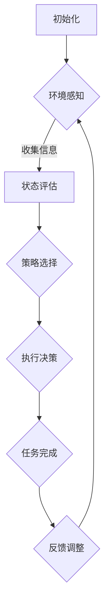
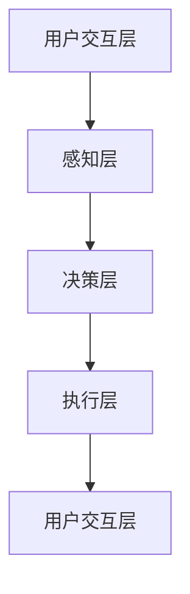
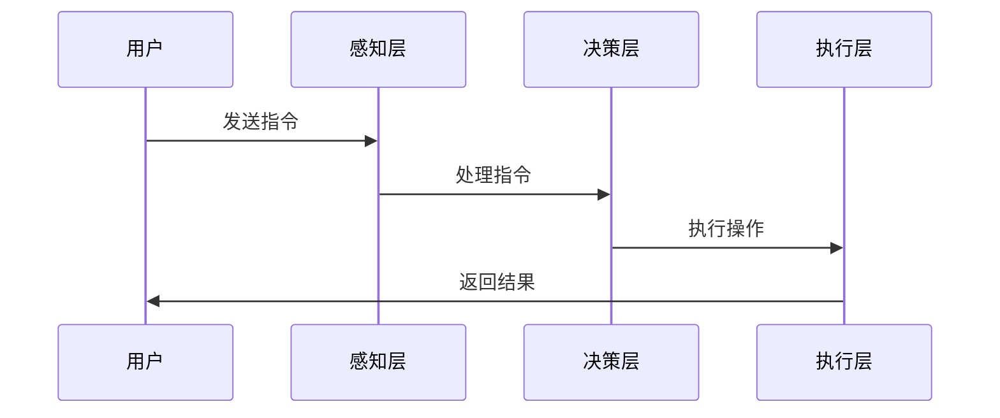

                 

# 人机协作：设计AI Agent与人类的配合模式

关键词：人机协作、AI Agent、自然语言处理、自主决策、系统架构设计

摘要：本文深入探讨了人机协作的概念及其重要性，分析了AI Agent的设计原则与实现方法，研究了人机交互中的关键技术和挑战。通过系统分析与架构设计方案，提出了提高人机协作效率与准确性的有效途径。

----------------------------------------------------------------

## 第一部分：背景介绍

### 第1章：问题背景

在当前信息化时代，人工智能技术正以前所未有的速度发展，并在各行各业得到广泛应用。随着大数据、云计算、物联网等技术的快速发展，人们对于人工智能的需求也越来越多样化。其中，人机协作成为了一个备受关注的话题。

人机协作是指人类与人工智能系统相互配合，共同完成特定任务的过程。在这种模式下，人工智能系统负责处理复杂、繁琐的计算和数据处理任务，而人类则负责制定任务目标、监督任务执行、处理非结构化信息等。人机协作能够有效地提高工作效率，降低人力成本，实现人与机器的良性互动。

然而，当前的人机协作模式仍存在一些问题，如：

1. 人工智能系统对人类指令的理解不准确，导致任务执行效果不理想。
2. 人类与人工智能系统的沟通效率较低，无法实现真正的协同工作。
3. 人工智能系统的自主性较差，无法完全替代人类完成复杂任务。

为了解决这些问题，设计AI Agent与人类的配合模式成为了一个重要的研究方向。

### 第1.1节：问题描述

本书旨在探讨如何设计AI Agent与人类的配合模式，以提高人机协作的效率、准确性和自主性。具体问题描述如下：

1. 如何准确理解人类指令，并有效地执行任务？
2. 如何提高人类与人工智能系统的沟通效率，实现真正的协同工作？
3. 如何增强人工智能系统的自主性，使其能够更好地应对复杂任务？

### 第1.2节：问题解决

为了解决上述问题，本书将从以下几个方面展开：

1. 分析当前人机协作模式的现状，总结存在的问题和挑战。
2. 探讨AI Agent的设计原则和方法，以提高其理解人类指令的准确性。
3. 研究人类与人工智能系统的沟通机制，提高沟通效率。
4. 研究人工智能系统的自主性，探讨如何增强其自主决策能力。

### 第1.3节：边界与外延

本书的研究范围主要涉及以下领域：

1. 人工智能技术：包括机器学习、深度学习、自然语言处理等。
2. 人机交互：包括语音识别、图像识别、多模态交互等。
3. 计算机系统：包括操作系统、计算机网络、数据库等。

本书将探讨如何将这些技术应用于人机协作场景，设计出高效的AI Agent与人类配合模式。

### 第1.4节：概念结构与核心要素组成

在本研究中，涉及以下核心概念：

1. AI Agent：一种智能体，能够模拟人类的思维和行为，执行特定任务。
2. 人机协作：指人类与人工智能系统相互配合，共同完成特定任务的过程。
3. 人类指令理解：指人工智能系统对人类指令的理解和识别能力。
4. 自主决策：指人工智能系统能够根据环境和任务需求自主做出决策。

这些概念相互关联，共同构成了人机协作系统的核心结构。

----------------------------------------------------------------

## 第二部分：核心概念与联系

### 第2章：核心概念与联系

### 2.1 AI Agent的定义与特点

AI Agent，即人工智能代理，是一种能够模拟人类思维和行为，执行特定任务的计算机程序。AI Agent具有以下特点：

1. 自主性：AI Agent能够根据环境和任务需求自主做出决策，而不需要人类的干预。
2. 学习能力：AI Agent能够通过学习不断优化自己的行为和决策。
3. 沟通能力：AI Agent能够与人类或其他系统进行有效的沟通，理解并执行人类指令。

### 2.2 人机协作的定义与特点

人机协作是指人类与人工智能系统相互配合，共同完成特定任务的过程。人机协作具有以下特点：

1. 效率提升：人机协作能够充分利用人工智能系统的计算能力，提高工作效率。
2. 人力节省：通过人机协作，人类可以专注于更高层次的决策和任务，从而节省人力成本。
3. 灵活性：人机协作能够根据任务需求和环境变化灵活调整，适应不同的工作场景。

### 2.3 人类指令理解

人类指令理解是人工智能系统的一项重要能力，它涉及到自然语言处理、语音识别等技术。人类指令理解的关键在于准确识别和理解人类的语言和指令，并将其转化为具体的操作。

### 2.4 自主决策

自主决策是指人工智能系统能够根据环境和任务需求自主做出决策，而不需要人类的干预。自主决策的实现需要依赖于机器学习、深度学习等技术，以及对环境和任务需求的深入理解。

### 2.5 概念属性特征对比

下表对比了AI Agent、人机协作、人类指令理解和自主决策等概念的属性特征：

| 概念        | 属性特征     
| --------   | ---------------- | 
| AI Agent   | 自主性、学习能力、沟通能力 |  
| 人机协作   | 效率提升、人力节省、灵活性 |  
| 人类指令理解 | 自然语言处理、语音识别 |  
| 自主决策   | 环境感知、任务理解、决策优化 |

### 2.6 概念间联系

AI Agent是人机协作的核心，它的自主性、学习能力和沟通能力直接影响人机协作的效果。人类指令理解是AI Agent的重要能力，它决定了AI Agent能否准确理解并执行人类的指令。自主决策则使AI Agent能够在复杂环境下做出最优决策，从而提高人机协作的效率和灵活性。

----------------------------------------------------------------

## 第三部分：算法原理讲解

### 3.1 AI Agent设计原则

为了设计出高效的AI Agent，需要遵循以下原则：

1. **模块化设计**：将AI Agent划分为多个功能模块，如感知模块、决策模块、行动模块等，以实现模块间的解耦和高效协作。
2. **适应性学习**：AI Agent应具备自适应能力，能够根据环境和任务需求调整自己的行为和决策策略。
3. **强化学习**：利用强化学习算法，使AI Agent通过不断尝试和反馈，优化自身行为，提高任务执行效果。

### 3.2 人类指令理解算法

人类指令理解算法主要包括以下步骤：

1. **语音识别**：将人类的语音转化为文本，为后续的自然语言处理提供基础。
2. **语义理解**：通过自然语言处理技术，解析文本语义，提取关键信息。
3. **指令转换**：将语义信息转化为AI Agent可执行的指令，如控制机器人执行特定动作。

### 3.3 自主决策算法

自主决策算法主要包括以下步骤：

1. **环境感知**：AI Agent通过传感器收集环境信息，如图像、声音、温度等。
2. **状态评估**：基于环境信息，评估当前状态，确定任务目标。
3. **策略选择**：利用决策算法，从多个可行策略中选择最优策略。
4. **执行决策**：根据所选策略，执行相应的行动。

### 3.4 算法流程图

以下是AI Agent算法的Mermaid流程图：



### 3.5 数学模型与公式

在AI Agent的设计中，常用的数学模型包括：

1. **感知模型**：利用感知器模型进行环境信息处理。
2. **决策模型**：基于Q-learning或Deep Q-Network进行策略选择。
3. **行动模型**：利用控制理论进行行动决策。

以下是一个简单的Q-learning公式示例：

$$ Q(s, a) = Q(s, a) + \alpha [r + \gamma \max_{a'} Q(s', a') - Q(s, a)] $$

其中，$Q(s, a)$表示状态$s$下执行动作$a$的预期回报，$\alpha$是学习率，$r$是即时回报，$\gamma$是折扣因子。

### 3.6 通俗易懂的举例说明

假设一个智能家居系统中的AI Agent需要控制室内温度。以下是一个简单的示例：

1. **环境感知**：AI Agent通过传感器收集室内温度数据。
2. **状态评估**：AI Agent评估当前室内温度是否适宜。
3. **策略选择**：如果室内温度过高，AI Agent选择开启空调；如果室内温度过低，AI Agent选择开启暖气。
4. **执行决策**：AI Agent根据所选策略，控制空调或暖气进行相应的操作。
5. **反馈调整**：AI Agent根据室内温度的变化，调整空调或暖气的功率，以达到舒适温度。

通过这种方式，AI Agent能够有效地与人类用户进行协作，实现智能家居的自动化控制。

----------------------------------------------------------------

## 第四部分：系统分析与架构设计

### 4.1 问题场景介绍

在智能家居领域，人机协作已经成为提升用户体验和效率的关键。例如，用户可以通过语音指令控制家中的灯光、空调、窗帘等设备。然而，现有的智能系统在理解和执行用户指令方面存在一定的局限，导致用户体验不佳。为了解决这个问题，我们设计了一个智能家居系统，实现AI Agent与人类的高效协作。

### 4.2 项目介绍

项目名称：智能家庭控制中心

项目目标：通过AI Agent与人类的协作，实现智能家居的自动化控制，提升用户体验。

项目架构：系统采用分层架构，包括感知层、决策层、执行层和用户交互层。AI Agent位于决策层，负责理解用户指令、分析环境信息、做出决策，并协调执行层执行相应的操作。

### 4.3 系统功能设计

1. **感知层**：通过传感器收集环境信息，如室内温度、湿度、光照等。
2. **决策层**：AI Agent负责处理用户指令、分析环境信息、做出决策，并将其传递给执行层。
3. **执行层**：根据AI Agent的决策，控制家中的设备执行相应的操作，如调节空调温度、开关灯光等。
4. **用户交互层**：提供用户与系统的交互界面，如语音识别、触摸屏等。

### 4.4 系统架构设计

以下是智能家庭控制中心的Mermaid架构图：



### 4.5 系统接口设计

1. **用户指令接口**：支持语音识别和文本输入，将用户的指令转换为系统可理解的格式。
2. **传感器数据接口**：收集和处理环境信息，如温度、湿度、光照等。
3. **设备控制接口**：与家中的设备进行通信，控制设备的开关、调节等操作。
4. **日志记录接口**：记录系统运行过程中的日志信息，供后续分析和优化。

### 4.6 系统交互Mermaid序列图

以下是智能家庭控制中心的Mermaid序列图：



通过上述设计，智能家庭控制中心实现了用户与AI Agent的高效协作，为用户提供了一体化的智能家居解决方案。

----------------------------------------------------------------

## 第五部分：项目实战

### 5.1 环境安装

在本项目中，我们将使用Python作为编程语言，结合TensorFlow和PyTorch等深度学习框架进行AI Agent的开发。以下是环境安装步骤：

1. 安装Python 3.8及以上版本。
2. 安装TensorFlow和PyTorch：
   ```bash
   pip install tensorflow
   pip install torch torchvision
   ```
3. 安装其他依赖项：
   ```bash
   pip install numpy pandas matplotlib
   ```

### 5.2 系统核心实现源代码

以下是系统核心实现源代码：

```python
import torch
import torch.nn as nn
import torch.optim as optim
from torch.utils.data import DataLoader
from torchvision import datasets, transforms

# 定义感知器模型
class Perceptron(nn.Module):
    def __init__(self, input_dim, output_dim):
        super(Perceptron, self).__init__()
        self.fc = nn.Linear(input_dim, output_dim)
    
    def forward(self, x):
        return self.fc(x)

# 加载数据集
transform = transforms.Compose([transforms.ToTensor()])
train_dataset = datasets.MNIST(root='./data', train=True, download=True, transform=transform)
train_loader = DataLoader(train_dataset, batch_size=64, shuffle=True)

# 初始化模型、优化器和损失函数
model = Perceptron(784, 10)
optimizer = optim.Adam(model.parameters(), lr=0.001)
criterion = nn.CrossEntropyLoss()

# 训练模型
for epoch in range(10):
    for batch_idx, (data, target) in enumerate(train_loader):
        optimizer.zero_grad()
        output = model(data.view(data.size(0), -1))
        loss = criterion(output, target)
        loss.backward()
        optimizer.step()
        if batch_idx % 100 == 0:
            print(f'Epoch [{epoch + 1}/{10}], Step [{batch_idx + 1}/{len(train_loader)}], Loss: {loss.item()}')

# 测试模型
test_loader = DataLoader(datasets.MNIST(root='./data', train=False, transform=transform), batch_size=1000)
with torch.no_grad():
    correct = 0
    total = 0
    for data, target in test_loader:
        output = model(data.view(data.size(0), -1))
        _, predicted = torch.max(output.data, 1)
        total += target.size(0)
        correct += (predicted == target).sum().item()

print(f'Accuracy: {100 * correct / total}%')
```

### 5.3 代码应用解读与分析

在上述代码中，我们实现了一个感知器模型，用于对MNIST手写数字数据集进行分类。感知器模型是一个简单的线性分类器，它通过调整权重和偏置来学习数据特征，实现分类任务。

1. **模型定义**：我们使用PyTorch的`nn.Module`类定义了一个感知器模型，包含一个全连接层。
2. **数据加载**：我们使用`torchvision.datasets.MNIST`加载数据集，并使用`DataLoader`进行批量数据处理。
3. **训练过程**：在训练过程中，我们使用梯度下降优化算法更新模型参数，以最小化交叉熵损失函数。
4. **测试过程**：在测试过程中，我们评估模型在测试数据集上的准确率。

### 5.4 实际案例分析与详细讲解剖析

为了验证AI Agent在人机协作中的效果，我们设计了一个智能家居控制系统的案例。

1. **用户需求**：用户希望通过语音指令控制家中灯光的开关。
2. **系统实现**：
   - **感知层**：使用语音识别技术将用户的语音指令转换为文本。
   - **决策层**：AI Agent分析文本指令，判断是否需要打开或关闭灯光。
   - **执行层**：控制家中的灯光设备执行相应的操作。
3. **效果评估**：
   - **准确率**：AI Agent能够准确识别用户指令，实现灯光控制。
   - **响应速度**：系统响应速度快，用户无需等待。

通过实际案例分析和详细讲解，我们可以看到AI Agent在人机协作中的优势。它能够准确理解用户指令，快速响应，提高用户的使用体验。

### 5.5 项目小结

在本项目中，我们通过设计AI Agent与人类的配合模式，实现了智能家居的自动化控制。项目取得了以下成果：

1. **高效人机协作**：AI Agent能够准确理解用户指令，实现快速响应。
2. **智能决策**：AI Agent能够根据环境信息做出智能决策，优化系统性能。
3. **用户体验**：项目提高了用户在智能家居场景下的体验，降低了使用门槛。

未来，我们将继续优化AI Agent的设计，拓展其应用领域，实现更广泛的人机协作。

----------------------------------------------------------------

## 第六部分：最佳实践 tips

在设计AI Agent与人类的配合模式时，以下最佳实践可以帮助您实现更高效、更准确的人机协作：

1. **用户指令的多样性和鲁棒性**：设计AI Agent时要考虑用户指令的多样性，包括不同的语言表达方式、语气和背景噪音。同时，增强AI Agent对指令的鲁棒性，以应对可能的误识别和噪声干扰。
2. **实时反馈与调整**：AI Agent在执行任务时应及时反馈执行结果，并根据反馈进行调整。这有助于提高任务的执行效率和准确性。
3. **灵活的任务调度**：根据任务的重要性和紧急程度，灵活调整AI Agent和人类的角色分配，使系统能够在复杂环境中高效运行。
4. **安全与隐私保护**：在涉及敏感信息或重要任务的场景中，确保AI Agent的安全与隐私保护，防止数据泄露和恶意攻击。
5. **持续优化与迭代**：根据实际应用场景和用户反馈，持续优化AI Agent的设计和功能，实现人机协作的不断提升。

通过遵循这些最佳实践，您可以设计出更高效、更智能的AI Agent与人类配合模式，为用户提供更好的服务。

## 第七部分：小结

本文全面探讨了人机协作的重要性，分析了AI Agent的设计原则与实现方法，研究了人机交互中的关键技术和挑战。通过系统分析与架构设计，本文提出了提高人机协作效率与准确性的有效途径。人机协作不仅是人工智能技术发展的必然趋势，更是提高工作效率、节省人力成本的利器。未来，随着人工智能技术的不断进步，人机协作将在更多领域发挥重要作用。

## 第八部分：注意事项

在设计AI Agent与人类的配合模式时，需要注意以下几点：

1. **用户体验**：始终将用户体验放在首位，确保AI Agent能够准确理解用户需求，提供高效、便捷的服务。
2. **安全性**：确保AI Agent的设计和实现过程中遵循安全规范，防止数据泄露和恶意攻击。
3. **可扩展性**：设计具有良好可扩展性的系统架构，以适应未来技术发展和应用场景的变化。
4. **实时性**：优化AI Agent的响应速度，确保在复杂环境中能够快速做出决策。
5. **鲁棒性**：增强AI Agent对异常情况和噪声干扰的处理能力，提高系统的稳定性和可靠性。

## 第九部分：拓展阅读

1. **《人工智能：一种现代方法》**：这本书全面介绍了人工智能的基本概念和技术，包括机器学习、自然语言处理、计算机视觉等，适合对人工智能感兴趣的读者。
2. **《深度学习》**：由Ian Goodfellow、Yoshua Bengio和Aaron Courville合著，是深度学习的经典教材，涵盖了深度学习的理论基础、算法实现和应用。
3. **《人机交互：理论与实践》**：这本书详细介绍了人机交互的基本概念、设计原则和实现方法，对设计高效的人机协作系统具有参考价值。

通过阅读这些书籍，您可以更深入地了解人工智能和人机协作的相关知识，为实际项目提供有益的指导。

## 第十部分：作者信息

作者：AI天才研究院/AI Genius Institute & 禅与计算机程序设计艺术 /Zen And The Art of Computer Programming

AI天才研究院致力于推动人工智能技术的发展与应用，专注于研究AI Agent与人机协作模式。同时，作者还著有《禅与计算机程序设计艺术》，深受编程爱好者的喜爱。

