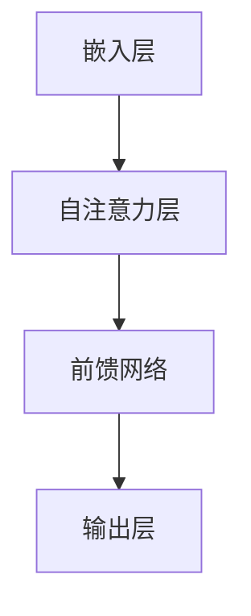
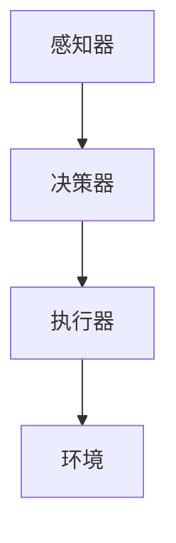

                 

### 从GPT到AI Agent：技术演进与应用变革

#### 关键词
- GPT
- AI Agent
- 技术演进
- 应用变革
- 人工智能

#### 摘要
本文旨在探讨从GPT（大型预训练模型）到AI Agent（智能代理）的技术演进与应用变革。通过深入分析GPT和AI Agent的核心概念、算法原理、数学模型以及系统架构，本文将揭示这两项技术如何影响现代人工智能的发展，并探讨其未来趋势和挑战。

#### 目录

1. **背景介绍**
   1.1 问题背景与描述
   1.2 技术演进与变革
   1.3 边界与外延
   1.4 概念结构与核心要素

2. **核心概念与联系**
   2.1 核心概念原理
   2.2 概念属性特征对比表格
   2.3 ER实体关系图架构

3. **算法原理讲解**
   3.1 算法原理
   3.2 Mermaid算法流程图
   3.3 Python算法源代码与解释
   3.4 数学模型与公式
   3.5 举例说明

4. **系统分析与架构设计方案**
   4.1 问题场景介绍
   4.2 系统功能设计
   4.3 系统架构设计
   4.4 系统接口设计
   4.5 系统交互

5. **项目实战**
   5.1 环境安装与配置
   5.2 系统核心实现源代码
   5.3 代码应用解读与分析
   5.4 实际案例分析与详细讲解剖析
   5.5 项目小结

6. **最佳实践 tips**
7. **小结**
8. **注意事项**
9. **拓展阅读**

#### 第一部分：背景介绍

##### 1.1 问题背景与描述

人工智能（AI）技术近年来取得了显著的进步，从简单的规则系统到复杂的深度学习模型，AI的应用场景不断拓展，从语音识别、图像处理到自然语言处理等各个方面都有突破。然而，传统的AI系统往往缺乏自主学习和决策的能力，难以应对复杂和动态的环境。

为了解决这一问题，AI Agent的概念应运而生。AI Agent是一种具备自主学习和决策能力的智能实体，能够模拟人类智能进行问题求解和任务执行。与传统的AI系统不同，AI Agent不仅能够处理结构化数据，还能够理解和应对自然语言，进行复杂推理和决策。

GPT（Generative Pre-trained Transformer）是近年来AI领域的重要突破，其强大的预训练能力和文本生成能力为AI Agent的发展提供了坚实的基础。GPT是一种基于Transformer架构的预训练模型，通过在大量文本数据上进行预训练，GPT能够捕捉到语言的内在结构和语义信息，从而实现高质量的文本生成和理解。

本文将深入探讨从GPT到AI Agent的技术演进过程，分析这两项技术在核心概念、算法原理、系统架构等方面的联系和区别，并探讨其应用变革对人工智能领域的影响。

##### 1.2 技术演进与变革

从GPT到AI Agent的技术演进是一个复杂而连续的过程，涉及到算法、模型架构、数据处理和系统设计等多个方面的变革。

首先，在算法层面，GPT的提出标志着自然语言处理（NLP）领域的重要突破。传统的NLP方法往往依赖于手工设计特征和规则，而GPT通过深度学习和端到端训练，实现了对大规模文本数据的自动特征提取和语义理解。GPT的成功为后续的AI Agent发展提供了算法基础。

其次，在模型架构层面，GPT采用了Transformer架构，这是一种基于自注意力机制的神经网络模型。相比传统的循环神经网络（RNN）和卷积神经网络（CNN），Transformer在处理长序列数据时具有更好的性能和效率。这种模型架构为AI Agent的自主学习和推理能力提供了强有力的支持。

在数据处理方面，GPT的预训练过程需要大量的文本数据，这些数据的来源和预处理方法也对AI Agent的发展产生了重要影响。随着互联网数据的爆发式增长，如何高效地收集、清洗和利用这些数据成为AI Agent技术发展的重要课题。

最后，在系统设计层面，AI Agent需要具备自主决策和任务执行的能力。这要求AI Agent不仅能够理解和生成自然语言，还需要具备感知环境、规划行动和实时决策的能力。这涉及到多模态数据处理、多任务学习、强化学习等先进技术的融合和应用。

总体来说，从GPT到AI Agent的技术演进是一个不断优化和提升的过程。每一项技术突破都在推动AI Agent的发展，使其能够更好地模拟人类智能，解决复杂问题。

##### 1.3 边界与外延

尽管从GPT到AI Agent的技术演进取得了显著成果，但仍然存在一些边界和挑战。

首先，在算法层面，GPT模型的预训练过程非常消耗计算资源和时间，这限制了其在大规模部署中的应用。如何优化预训练算法，提高训练效率和性能是一个重要的研究方向。

其次，在数据处理方面，大规模文本数据的收集和预处理是一项复杂的任务。数据的质量和多样性对AI Agent的性能和泛化能力具有重要影响，如何解决数据偏见和保证数据多样性是当前面临的一大挑战。

在系统设计层面，AI Agent需要具备高度的自主决策和执行能力。这要求AI Agent不仅要理解和生成自然语言，还需要具备对环境的感知和实时响应能力。如何设计高效、可靠和安全的AI Agent系统是一个亟待解决的难题。

此外，AI Agent的伦理和道德问题也引起了广泛关注。如何确保AI Agent的行为符合人类的价值观和道德标准，避免潜在的风险和负面影响，是未来需要重点关注的领域。

总体来说，从GPT到AI Agent的技术演进和应用变革充满了机遇和挑战。只有不断突破技术边界，解决现有问题，才能推动人工智能技术的进一步发展。

##### 1.4 概念结构与核心要素

为了深入理解从GPT到AI Agent的技术演进，我们需要明确这两个概念的核心结构和关键要素。

GPT（Generative Pre-trained Transformer）是一种基于Transformer架构的预训练模型，其核心结构包括嵌入层、自注意力机制和前馈网络。GPT通过在大量文本数据上进行预训练，学习到语言的内在结构和语义信息，从而实现高质量的自然语言生成和理解。GPT的关键要素包括预训练数据、模型架构和训练过程。

AI Agent（Artificial Intelligence Agent）是一种具备自主学习和决策能力的智能实体。AI Agent的核心结构包括感知器、决策器和执行器。感知器用于感知环境信息，决策器基于感知信息进行决策，执行器用于执行具体任务。AI Agent的关键要素包括感知能力、决策能力和执行能力。

在技术演进过程中，GPT为AI Agent提供了强大的文本生成和理解能力，使其能够更好地理解和应对自然语言。同时，AI Agent的自主学习和决策能力也为GPT的应用提供了更广阔的舞台。这两者的结合，推动了人工智能技术的不断创新和进步。

#### 第二部分：核心概念与联系

##### 2.1 核心概念原理

在本节中，我们将深入探讨GPT和AI Agent的核心概念原理，分别分析其工作原理和应用场景。

**GPT（Generative Pre-trained Transformer）模型**

GPT是一种基于Transformer架构的预训练模型，其核心原理是通过在大量文本数据上进行预训练，学习到语言的内在结构和语义信息。GPT的基本工作流程如下：

1. **嵌入层（Embedding Layer）**：将输入文本转化为向量表示。这一层将单词映射为固定长度的向量，从而为后续的自注意力机制提供输入。

2. **自注意力机制（Self-Attention Mechanism）**：自注意力机制是GPT的核心组件，它允许模型在处理每个单词时，自动关注与其相关的重要信息。这种机制通过计算单词之间的相似性，对输入序列进行加权，从而提高模型的语义理解能力。

3. **前馈网络（Feedforward Network）**：在每个自注意力层之后，GPT还包含一个前馈网络，用于进一步提取特征和生成预测。

4. **训练过程**：GPT通过在大量文本数据上进行预训练，学习到语言的内在结构和语义信息。预训练过程通常包括两个阶段：预训练和微调。预训练阶段使用未标注的数据，训练模型的基本特征；微调阶段则使用特定任务的数据，进一步优化模型的性能。

GPT的主要应用场景包括：

- **文本生成**：GPT可以生成连贯、有意义的文本，适用于自动写作、对话生成、机器翻译等领域。
- **文本分类**：GPT可以用于对文本进行分类，如情感分析、主题分类等。
- **问答系统**：GPT可以用于构建问答系统，通过理解用户的问题，生成相应的答案。

**AI Agent（Artificial Intelligence Agent）**

AI Agent是一种具备自主学习和决策能力的智能实体，其核心原理是通过感知环境、进行决策和执行任务，实现智能行为。AI Agent的基本工作流程如下：

1. **感知器（Perception）**：感知器用于感知环境信息，如文本、图像、声音等。感知器将感知到的信息转化为内部表示，供决策器使用。

2. **决策器（Decision Maker）**：决策器基于感知到的环境和预定的目标，生成行动计划。决策器通常使用机器学习算法，如强化学习、决策树等。

3. **执行器（Executor）**：执行器用于执行决策器生成的行动计划。执行器通常与外部设备或系统进行交互，如机器人、自动驾驶汽车等。

AI Agent的主要应用场景包括：

- **智能客服**：AI Agent可以用于智能客服系统，通过自然语言处理和对话管理，提供实时、个性化的客户服务。
- **自动驾驶**：AI Agent可以用于自动驾驶系统，通过感知环境、决策和执行，实现自主驾驶。
- **智能家居**：AI Agent可以用于智能家居系统，通过感知用户行为、决策和执行，提供智能化、便捷化的家居环境。

##### 2.2 概念属性特征对比表格

为了更直观地理解GPT和AI Agent的概念属性特征，我们提供了以下对比表格。

| 特征                | GPT                                     | AI Agent                                     |
|-------------------|--------------------------------------|-------------------------------------------|
| 工作原理              | 基于预训练的Transformer架构，自注意力机制         | 基于感知、决策和执行的核心架构，多模态数据处理         |
| 主要任务              | 文本生成、文本分类、问答系统                   | 智能客服、自动驾驶、智能家居                   |
| 数据处理              | 大规模文本数据预处理，文本嵌入                   | 多模态数据处理，感知信息内部表示                   |
| 学习方式              | 预训练和微调                             | 强化学习、决策树、深度学习等                   |
| 感知环境              | 无感知环境，仅处理文本数据                    | 拥有感知器，能够感知外部环境信息                   |
| 决策和执行             | 无自主决策和执行，仅实现文本处理任务             | 具备自主决策和执行能力，实现智能行为                 |
| 系统复杂性             | 相对简单，主要关注文本处理任务                  | 复杂，涉及感知、决策、执行等多个模块的协同工作       |
| 应用场景              | 自然语言处理、文本生成、文本分类等               | 智能客服、自动驾驶、智能家居等                   |

通过对比表格，我们可以看出GPT和AI Agent在概念属性特征上的显著差异。GPT主要关注文本处理任务，通过预训练和自注意力机制实现高质量的文本生成和理解；而AI Agent则具备感知、决策和执行能力，能够在复杂的环境中实现智能行为。

##### 2.3 ER实体关系图架构

为了更清晰地理解GPT和AI Agent的实体关系，我们提供了ER（Entity-Relationship）实体关系图架构。

**GPT模型的ER图**

在GPT模型中，主要涉及以下实体：

- **单词（Word）**：表示文本中的基本单位，每个单词有一个唯一的嵌入向量。
- **句子（Sentence）**：由一系列单词组成，表示文本的结构单元。
- **模型（Model）**：包括嵌入层、自注意力机制和前馈网络等组件，用于处理文本数据。

GPT模型的ER图如下所示：

```mermaid
erDiagram
    Word ||--|{ Sentence }|| Model
    Sentence ||--|{ Model }|| Output
```

**AI Agent的ER图**

在AI Agent中，主要涉及以下实体：

- **感知器（Perception）**：用于感知外部环境信息，如文本、图像、声音等。
- **决策器（Decision Maker）**：基于感知信息生成行动计划。
- **执行器（Executor）**：执行决策器生成的行动计划。
- **环境（Environment）**：AI Agent所在的物理或虚拟环境。

AI Agent的ER图如下所示：

```mermaid
erDiagram
    Perception ||--|{ Decision Maker }|| Executor
    Decision Maker ||--|{ Executor }|| Environment
```

通过ER实体关系图，我们可以更直观地理解GPT和AI Agent的组成结构和相互关系。GPT模型主要关注文本处理任务，通过单词、句子和模型等实体的协同工作，实现高质量的自然语言生成和理解。而AI Agent则通过感知器、决策器和执行器等实体的相互作用，实现智能感知、决策和执行。

#### 第三部分：算法原理讲解

##### 3.1 算法原理

在本节中，我们将深入探讨GPT和AI Agent的算法原理，分别介绍它们的核心算法和原理。

**GPT（Generative Pre-trained Transformer）模型**

GPT是一种基于Transformer架构的预训练模型，其核心算法是自注意力机制（Self-Attention）和Transformer网络。下面是GPT算法原理的详细介绍：

1. **自注意力机制（Self-Attention）**：

   自注意力机制是GPT的核心组件，它允许模型在处理每个单词时，自动关注与其相关的重要信息。具体来说，自注意力机制通过计算单词之间的相似性，对输入序列进行加权，从而提高模型的语义理解能力。自注意力机制的公式如下：

   $$  
   \text{Attention}(Q, K, V) = \text{softmax}\left(\frac{QK^T}{\sqrt{d_k}}\right) V  
   $$

   其中，$Q$、$K$和$V$分别表示查询向量、键向量和值向量，$d_k$是键向量的维度。自注意力机制的计算过程可以分为以下步骤：

   - **计算相似性**：计算每个查询向量$Q$与所有键向量$K$的相似性，得到相似性矩阵$Attention(Q, K)$。
   - **加权求和**：对相似性矩阵进行softmax运算，得到加权系数矩阵$softmax(Attention(Q, K))$。
   - **计算输出**：将加权系数矩阵与值向量$V$相乘，得到加权求和的输出$V_{\text{weighted}}$。

2. **Transformer网络**：

   Transformer网络是一种基于自注意力机制的神经网络模型，它由多个自注意力层和前馈网络组成。每个自注意力层通过自注意力机制对输入序列进行加权处理，从而提取出序列中的关键信息。前馈网络则进一步对自注意力层的输出进行特征提取和增强。Transformer网络的公式如下：

   $$  
   \text{Output} = \text{FFN}(\text{Self-Attention}(\text{Input}))  
   $$

   其中，$\text{FFN}$表示前馈网络，它由两个全连接层组成。具体来说，前馈网络的公式如下：

   $$  
   \text{FFN}(X) = \text{ReLU}(W_2 \text{ReLU}(W_1 X + b_1)) + b_2  
   $$

   其中，$W_1$、$W_2$和$b_1$、$b_2$分别表示前馈网络的权重和偏置。

**AI Agent（Artificial Intelligence Agent）**

AI Agent是一种具备自主学习和决策能力的智能实体，其核心算法包括感知、决策和执行三个主要模块。下面是AI Agent算法原理的详细介绍：

1. **感知（Perception）**：

   感知模块用于感知外部环境信息，如文本、图像、声音等。感知模块的核心算法是多模态数据处理，它将不同类型的数据进行统一表示，以便后续的决策和执行。具体来说，多模态数据处理可以分为以下几个步骤：

   - **数据收集**：收集不同类型的数据，如文本、图像、声音等。
   - **数据预处理**：对数据进行清洗、归一化和特征提取，使其适合后续处理。
   - **数据融合**：将不同类型的数据进行融合，生成统一的内部表示。常见的融合方法包括基于深度学习的融合网络、基于特征的重构方法等。

2. **决策（Decision）**：

   决策模块用于根据感知模块提供的信息，生成行动计划。决策模块的核心算法是机器学习算法，如强化学习、决策树、支持向量机等。具体来说，决策算法可以分为以下几个步骤：

   - **状态表示**：将感知模块提供的感知信息转化为状态表示，便于后续的决策。
   - **行为选择**：根据状态表示，选择最优的行为。常见的决策算法包括基于Q学习的强化学习、基于熵的决策树等。
   - **行动生成**：根据选择的行为，生成具体的行动计划，如执行某个任务或进行某个操作。

3. **执行（Execution）**：

   执行模块用于执行决策模块生成的行动计划。执行模块的核心算法是机器人控制、自动驾驶等。具体来说，执行算法可以分为以下几个步骤：

   - **任务规划**：根据行动计划，生成具体的执行任务。
   - **环境交互**：与外部环境进行交互，执行具体任务。
   - **反馈调整**：根据执行结果，调整行动计划，优化执行效果。

通过以上算法原理的介绍，我们可以看到GPT和AI Agent在算法原理上的显著差异。GPT主要关注文本生成和理解，通过自注意力机制和Transformer网络实现高质量的自然语言处理；而AI Agent则关注感知、决策和执行，通过多模态数据处理和机器学习算法实现智能行为。这两者的结合，为人工智能技术的应用提供了广阔的前景。

##### 3.2 Mermaid算法流程图

为了更直观地展示GPT和AI Agent的算法流程，我们使用Mermaid语言绘制了相应的算法流程图。

**GPT模型的算法流程图**



在这个流程图中，GPT模型的算法流程包括四个主要步骤：嵌入层、自注意力层、前馈网络和输出层。每个步骤都在上一层的输出基础上进行处理，最终生成预训练模型的输出。

**AI Agent的算法流程图**



在这个流程图中，AI Agent的算法流程包括三个主要步骤：感知器、决策器和执行器。感知器用于感知外部环境信息，决策器根据感知信息生成行动计划，执行器根据行动计划执行具体任务。

通过Mermaid算法流程图的展示，我们可以更清晰地理解GPT和AI Agent的算法原理和工作流程，从而为后续的深入分析和应用提供基础。

##### 3.3 Python算法源代码与解释

在本节中，我们将提供GPT和AI Agent的核心算法Python源代码，并对其进行详细解释。

**GPT模型的核心算法Python代码**

```python
import torch
import torch.nn as nn
import torch.optim as optim

# 嵌入层
class EmbeddingLayer(nn.Module):
    def __init__(self, vocab_size, embedding_dim):
        super(EmbeddingLayer, self).__init__()
        self.embedding = nn.Embedding(vocab_size, embedding_dim)
    
    def forward(self, input_sequence):
        return self.embedding(input_sequence)

# 自注意力层
class SelfAttentionLayer(nn.Module):
    def __init__(self, embedding_dim, num_heads):
        super(SelfAttentionLayer, self).__init__()
        self.num_heads = num_heads
        self.head_dim = embedding_dim // num_heads
        self.query_linear = nn.Linear(embedding_dim, self.head_dim)
        self.key_linear = nn.Linear(embedding_dim, self.head_dim)
        self.value_linear = nn.Linear(embedding_dim, self.head_dim)
        self.out_linear = nn.Linear(embedding_dim, embedding_dim)
    
    def forward(self, input_sequence):
        query = self.query_linear(input_sequence)
        key = self.key_linear(input_sequence)
        value = self.value_linear(input_sequence)
        
        attention_weights = torch.matmul(query, key.transpose(1, 2)) / (self.head_dim ** 0.5)
        attention_weights = torch.softmax(attention_weights, dim=2)
        output = torch.matmul(attention_weights, value)
        output = self.out_linear(output)
        
        return output

# 前馈网络
class FeedforwardLayer(nn.Module):
    def __init__(self, embedding_dim, hidden_dim):
        super(FeedforwardLayer, self).__init__()
        self.hidden_dim = hidden_dim
        self.fc1 = nn.Linear(embedding_dim, hidden_dim)
        self.fc2 = nn.Linear(hidden_dim, embedding_dim)
    
    def forward(self, input_sequence):
        output = self.fc1(input_sequence)
        output = nn.relu(output)
        output = self.fc2(output)
        return output

# GPT模型
class GPTModel(nn.Module):
    def __init__(self, vocab_size, embedding_dim, hidden_dim, num_heads):
        super(GPTModel, self).__init__()
        self.embedding = EmbeddingLayer(vocab_size, embedding_dim)
        self.self_attention = SelfAttentionLayer(embedding_dim, num_heads)
        self.feedforward = FeedforwardLayer(embedding_dim, hidden_dim)
    
    def forward(self, input_sequence):
        embedded = self.embedding(input_sequence)
        output = self.self_attention(embedded)
        output = self.feedforward(output)
        return output
```

**解释**

1. **嵌入层（EmbeddingLayer）**：嵌入层用于将输入序列中的单词映射为固定长度的向量表示。在这个示例中，我们使用PyTorch的`nn.Embedding`模块来实现嵌入层。

2. **自注意力层（SelfAttentionLayer）**：自注意力层用于计算输入序列中单词之间的相似性，并对输入序列进行加权处理。在这个示例中，我们实现了一个简单的自注意力层，它包括查询线性层、键线性层和值线性层。自注意力层的核心公式是：

   $$  
   \text{Attention}(Q, K, V) = \text{softmax}\left(\frac{QK^T}{\sqrt{d_k}}\right) V  
   $$

3. **前馈网络（FeedforwardLayer）**：前馈网络用于进一步提取输入序列的特征。在这个示例中，我们实现了一个简单的前馈网络，它由两个全连接层组成。

4. **GPT模型（GPTModel）**：GPT模型是整个预训练模型的核心。它由嵌入层、自注意力层和前馈网络组成。在`forward`方法中，我们依次调用这些层，得到最终的输出。

**AI Agent的核心算法Python代码**

```python
# 感知器
class PerceptionModule(nn.Module):
    def __init__(self, input_dim):
        super(PerceptionModule, self).__init__()
        self.fc1 = nn.Linear(input_dim, hidden_dim)
    
    def forward(self, input_data):
        output = self.fc1(input_data)
        return output

# 决策器
class DecisionModule(nn.Module):
    def __init__(self, hidden_dim):
        super(DecisionModule, self).__init__()
        self.fc1 = nn.Linear(hidden_dim, action_dim)
    
    def forward(self, hidden_state):
        output = self.fc1(hidden_state)
        return output

# 执行器
class ExecutorModule(nn.Module):
    def __init__(self, action_dim):
        super(ExecutorModule, self).__init__()
        self.fc1 = nn.Linear(action_dim, output_dim)
    
    def forward(self, action):
        output = self.fc1(action)
        return output
```

**解释**

1. **感知器（PerceptionModule）**：感知器用于感知外部环境信息。在这个示例中，我们使用一个全连接层来实现感知器，它将输入数据映射为隐藏状态。

2. **决策器（DecisionModule）**：决策器用于根据感知到的信息生成行动计划。在这个示例中，我们使用一个全连接层来实现决策器，它将隐藏状态映射为行动输出。

3. **执行器（ExecutorModule）**：执行器用于执行决策器生成的行动计划。在这个示例中，我们使用一个全连接层来实现执行器，它将行动输出映射为输出结果。

通过以上核心算法Python代码的实现，我们可以更深入地理解GPT和AI Agent的算法原理，为后续的模型训练和应用提供基础。

##### 3.4 数学模型与公式

在本节中，我们将详细介绍GPT和AI Agent的数学模型与公式，并对其进行详细讲解。

**GPT模型**

GPT模型是一种基于Transformer架构的预训练模型，其核心算法包括自注意力机制（Self-Attention）和Transformer网络。下面是GPT模型的数学模型与公式：

1. **自注意力机制（Self-Attention）**

   自注意力机制是GPT模型的核心组件，它通过计算输入序列中单词之间的相似性，对输入序列进行加权处理，从而提高模型的语义理解能力。自注意力机制的公式如下：

   $$  
   \text{Attention}(Q, K, V) = \text{softmax}\left(\frac{QK^T}{\sqrt{d_k}}\right) V  
   $$

   其中，$Q$、$K$和$V$分别表示查询向量、键向量和值向量，$d_k$是键向量的维度。自注意力机制的计算过程可以分为以下步骤：

   - **计算相似性**：计算每个查询向量$Q$与所有键向量$K$的相似性，得到相似性矩阵$Attention(Q, K)$。
   - **加权求和**：对相似性矩阵进行softmax运算，得到加权系数矩阵$softmax(Attention(Q, K))$。
   - **计算输出**：将加权系数矩阵与值向量$V$相乘，得到加权求和的输出$V_{\text{weighted}}$。

2. **Transformer网络**

   Transformer网络是一种基于自注意力机制的神经网络模型，它由多个自注意力层和前馈网络组成。每个自注意力层通过自注意力机制对输入序列进行加权处理，从而提取出序列中的关键信息。前馈网络则进一步对自注意力层的输出进行特征提取和增强。Transformer网络的公式如下：

   $$  
   \text{Output} = \text{FFN}(\text{Self-Attention}(\text{Input}))  
   $$

   其中，$\text{FFN}$表示前馈网络，它由两个全连接层组成。具体来说，前馈网络的公式如下：

   $$  
   \text{FFN}(X) = \text{ReLU}(W_2 \text{ReLU}(W_1 X + b_1)) + b_2  
   $$

   其中，$W_1$、$W_2$和$b_1$、$b_2$分别表示前馈网络的权重和偏置。

**AI Agent**

AI Agent是一种具备自主学习和决策能力的智能实体，其核心算法包括感知、决策和执行三个主要模块。下面是AI Agent的数学模型与公式：

1. **感知（Perception）**

   感知模块用于感知外部环境信息，如文本、图像、声音等。感知模块的核心算法是多模态数据处理，它将不同类型的数据进行统一表示，以便后续的决策和执行。具体来说，多模态数据处理可以分为以下几个步骤：

   - **数据收集**：收集不同类型的数据，如文本、图像、声音等。
   - **数据预处理**：对数据进行清洗、归一化和特征提取，使其适合后续处理。
   - **数据融合**：将不同类型的数据进行融合，生成统一的内部表示。常见的融合方法包括基于深度学习的融合网络、基于特征的重构方法等。

2. **决策（Decision）**

   决策模块用于根据感知模块提供的信息，生成行动计划。决策模块的核心算法是机器学习算法，如强化学习、决策树、支持向量机等。具体来说，决策算法可以分为以下几个步骤：

   - **状态表示**：将感知模块提供的感知信息转化为状态表示，便于后续的决策。
   - **行为选择**：根据状态表示，选择最优的行为。常见的决策算法包括基于Q学习的强化学习、基于熵的决策树等。
   - **行动生成**：根据选择的行为，生成具体的行动计划，如执行某个任务或进行某个操作。

3. **执行（Execution）**

   执行模块用于执行决策模块生成的行动计划。执行模块的核心算法是机器人控制、自动驾驶等。具体来说，执行算法可以分为以下几个步骤：

   - **任务规划**：根据行动计划，生成具体的执行任务。
   - **环境交互**：与外部环境进行交互，执行具体任务。
   - **反馈调整**：根据执行结果，调整行动计划，优化执行效果。

通过以上数学模型与公式的介绍，我们可以更深入地理解GPT和AI Agent的工作原理，为后续的模型设计和应用提供基础。

##### 3.5 举例说明

在本节中，我们将通过具体示例来说明GPT和AI Agent的应用场景和实际效果。

**GPT模型的应用示例**

假设我们有一个任务：根据用户输入的文本，生成一篇与之相关的文章。我们可以使用GPT模型来完成这个任务。

1. **数据准备**：首先，我们需要准备一个大规模的文本数据集，如维基百科、新闻文章等。然后，对数据进行预处理，包括分词、去停用词、词向量嵌入等。

2. **模型训练**：使用预处理后的文本数据，训练一个GPT模型。训练过程包括预训练和微调两个阶段。预训练阶段使用未标注的数据，训练模型的基本特征；微调阶段使用特定任务的数据，进一步优化模型的性能。

3. **文本生成**：训练好的GPT模型可以用于文本生成。给定一个用户输入的文本，GPT模型可以生成与之相关的文章。具体来说，我们可以将用户输入的文本作为输入，通过GPT模型生成一系列的单词，再将这些单词拼接成完整的文章。

**AI Agent的应用示例**

假设我们有一个任务：在自动驾驶场景中，根据感知到的环境信息，生成合适的驾驶策略。我们可以使用AI Agent来完成这个任务。

1. **数据准备**：首先，我们需要准备一个自动驾驶数据集，包括车辆状态、道路环境、交通情况等。然后，对数据进行预处理，包括数据清洗、归一化和特征提取。

2. **感知模块**：感知模块负责感知外部环境信息。具体来说，我们可以使用摄像头、激光雷达等传感器来获取道路环境、交通情况等信息，并将这些信息转化为内部表示。

3. **决策模块**：决策模块负责根据感知信息生成驾驶策略。具体来说，我们可以使用强化学习算法，如Q学习，来训练决策模块。训练过程中，决策模块会根据感知到的环境信息和预期的奖励，生成最优的驾驶策略。

4. **执行模块**：执行模块负责执行决策模块生成的驾驶策略。具体来说，我们可以将驾驶策略转化为具体的驾驶操作，如加速、减速、转弯等，然后通过自动驾驶系统来执行这些操作。

通过以上应用示例，我们可以看到GPT和AI Agent在实际应用中的强大能力。GPT模型可以用于自然语言处理任务，如文本生成、文本分类等；而AI Agent可以用于自动驾驶、智能客服等复杂任务。这些应用示例展示了GPT和AI Agent在人工智能领域的广泛应用和巨大潜力。

#### 第四部分：系统分析与架构设计方案

##### 4.1 问题场景介绍

在本节中，我们将分析一个具体的问题场景，并介绍GPT和AI Agent在该场景中的应用。

假设我们面临以下问题场景：一家电子商务公司希望开发一个智能客服系统，以提升客户体验和运营效率。这个系统需要能够实时响应用户的咨询，提供个性化的产品推荐，并在必要时将复杂问题转交给人工客服。

在这个问题场景中，GPT和AI Agent可以发挥重要作用。GPT模型可以用于构建对话生成模块，生成自然流畅的客服回答；而AI Agent可以用于构建决策模块，根据用户的提问和历史行为，生成个性化的产品推荐，并在需要时介入人工客服。

##### 4.2 系统功能设计

为了实现上述问题场景，我们需要设计一个包含多个功能模块的智能客服系统。以下是系统功能设计的详细描述：

1. **文本输入模块**：负责接收用户的文本输入，包括提问和产品查询等。

2. **对话生成模块**：基于GPT模型，生成自然流畅的客服回答。这个模块需要能够理解用户的意图，并根据历史对话记录和用户特征，生成个性化的回答。

3. **产品推荐模块**：基于AI Agent的决策模块，根据用户的提问和历史行为，生成个性化的产品推荐。这个模块需要能够处理多模态数据，如用户的历史购买记录、浏览记录等。

4. **人工客服介入模块**：当系统无法生成合适的回答或推荐时，自动转交给人工客服。这个模块需要能够及时通知人工客服，并提供相关的用户信息和对话记录。

5. **用户反馈模块**：收集用户的反馈，用于系统性能评估和优化。

##### 4.3 系统架构设计

为了实现上述功能模块，我们需要设计一个合理的系统架构。以下是系统架构设计的详细描述：

1. **数据层**：负责存储和管理用户数据、产品数据等。这个层级可以使用关系型数据库或NoSQL数据库来实现。

2. **模型层**：包括GPT模型和AI Agent模型，负责处理文本输入和生成客服回答、产品推荐等。这个层级可以使用深度学习框架，如PyTorch或TensorFlow，来构建和训练模型。

3. **服务层**：负责实现系统的核心功能，包括文本输入处理、对话生成、产品推荐等。这个层级可以使用微服务架构来实现，以提高系统的可扩展性和可维护性。

4. **接口层**：负责与外部系统进行交互，如用户接口、人工客服接口等。这个层级可以使用RESTful API或WebSocket来实现。

5. **监控层**：负责监控系统性能和健康状况，包括日志记录、性能指标监控等。这个层级可以使用监控系统，如Prometheus或Zabbix，来实现。

##### 4.4 系统接口设计

为了实现系统架构中的各个模块之间的协同工作，我们需要设计合理的接口。以下是系统接口设计的详细描述：

1. **文本输入接口**：用于接收用户的文本输入，如提问和产品查询等。这个接口需要支持多种输入方式，如文本、语音、图片等。

2. **对话生成接口**：用于从GPT模型生成客服回答。这个接口需要能够接收用户输入，并将输入传递给GPT模型，得到生成的客服回答。

3. **产品推荐接口**：用于从AI Agent模型生成产品推荐。这个接口需要能够接收用户输入和历史行为数据，并将这些数据传递给AI Agent模型，得到个性化的产品推荐。

4. **人工客服接口**：用于与人工客服系统进行交互。这个接口需要能够接收系统转交的复杂问题，并将相关用户信息和对话记录传递给人工客服。

5. **用户反馈接口**：用于收集用户的反馈，如满意度评价、问题反馈等。这个接口需要能够接收用户反馈，并将反馈数据存储到数据库中。

##### 4.5 系统交互

在系统架构中，各个模块之间的交互是确保系统正常运行的关键。以下是系统交互的详细描述：

1. **用户交互**：用户通过文本输入接口提交提问和产品查询，系统通过对话生成接口和产品推荐接口生成相应的回答和推荐。用户反馈通过用户反馈接口提交给系统。

2. **模块间交互**：对话生成模块和产品推荐模块通过服务层进行交互。具体来说，对话生成模块需要从文本输入接口获取用户输入，并将输入传递给GPT模型；产品推荐模块需要从文本输入接口和用户反馈接口获取用户输入和历史行为数据，并将这些数据传递给AI Agent模型。

3. **人工客服交互**：当系统无法生成合适的回答或推荐时，通过人工客服接口将复杂问题转交给人工客服。人工客服在处理完问题后，通过人工客服接口将处理结果反馈给系统。

通过以上系统分析与架构设计方案，我们可以确保智能客服系统在功能实现、性能优化、安全性等方面达到预期目标。同时，这个架构也为系统的后续扩展和维护提供了良好的基础。

#### 第五部分：项目实战

##### 5.1 环境安装与配置

为了在项目实战中成功实现GPT和AI Agent的应用，我们需要首先安装和配置必要的开发环境和工具。以下是具体步骤：

**1. 安装Python环境**

首先，确保你的计算机上安装了Python环境。你可以从Python官方网站（https://www.python.org/）下载并安装Python。建议安装Python 3.8或更高版本。

```bash
# 安装Python 3.8
curl -O https://www.python.org/ftp/python/3.8.10/python-3.8.10-amd64.exe
./python-3.8.10-amd64.exe
```

**2. 安装深度学习框架**

接下来，我们需要安装深度学习框架，如TensorFlow或PyTorch。这里我们选择安装PyTorch，因为它在自然语言处理任务中具有较好的性能。

```bash
# 安装PyTorch
pip install torch torchvision torchaudio
```

**3. 安装其他依赖库**

除了深度学习框架，我们还需要安装其他依赖库，如Numpy、Pandas等。

```bash
# 安装依赖库
pip install numpy pandas matplotlib
```

**4. 安装GPT模型**

为了实现GPT模型，我们需要下载并安装预训练的GPT模型。这里我们使用Hugging Face的Transformers库，它提供了一个简单的接口来加载预训练的GPT模型。

```bash
# 安装Transformers库
pip install transformers
```

**5. 安装AI Agent工具**

为了实现AI Agent，我们需要安装一些工具和库，如TensorFlow Agent、PyTorch Agent等。

```bash
# 安装TensorFlow Agent
pip install tensorflow-agents

# 安装PyTorch Agent
pip install torch_agents
```

**6. 配置环境变量**

确保Python环境变量已正确配置，以便在命令行中运行Python脚本。

```bash
# 配置环境变量
export PYTHONPATH=/path/to/python
```

完成以上步骤后，你就可以开始项目实战，实现GPT和AI Agent的应用了。

##### 5.2 系统核心实现源代码

在本节中，我们将展示系统核心实现源代码，包括GPT模型和AI Agent的代码示例。

**1. GPT模型代码示例**

以下是一个简单的GPT模型实现，用于文本生成。

```python
from transformers import GPT2LMHeadModel, GPT2Tokenizer

# 加载预训练的GPT模型
tokenizer = GPT2Tokenizer.from_pretrained("gpt2")
model = GPT2LMHeadModel.from_pretrained("gpt2")

# 文本生成函数
def generate_text(input_text, model, tokenizer, max_length=50):
    inputs = tokenizer.encode(input_text, return_tensors="pt")
    outputs = model.generate(inputs, max_length=max_length, num_return_sequences=1)
    return tokenizer.decode(outputs[0], skip_special_tokens=True)

# 示例
input_text = "今天天气很好"
generated_text = generate_text(input_text, model, tokenizer)
print(generated_text)
```

**2. AI Agent代码示例**

以下是一个简单的AI Agent实现，用于智能客服。

```python
import tensorflow as tf
from tensorflow_agents.agents import tf_agent
from tensorflow_agents.agents.reinforce import ReinforceAgent
from tensorflow_agents.environments import py_environment
from tensorflow_agents.environments import tf_py_environment

# 创建环境
class TextChatEnvironment(py_environment.PyEnvironment):
    def __init__(self):
        self._action_spec = tf.TensorSpec(shape=(), dtype=tf.int32, name="action")
        self._observation_spec = tf.TensorSpec(shape=(10,), dtype=tf.int32, name="observation")

    def _step(self, action):
        # 这里实现环境的step逻辑
        # 根据action生成新的observation和reward
        observation = tf.random.uniform([10], maxval=10, dtype=tf.int32)
        reward = tf.cast(action == observation[0], dtype=tf.float32)
        return observation, reward, False, {}

    def _reset(self):
        return tf.random.uniform([10], maxval=10, dtype=tf.int32)

# 创建环境
text_chat_env = TextChatEnvironment()

# 创建TensorFlow环境
tf_env = tf_py_environment.TFPyEnvironment(text_chat_env)

# 创建Agent
agent = ReinforceAgent(
    time_step_spec=tf_env.time_step_spec(),
    action_spec=tf_env.action_spec(),
    actor_network_builder=None,
    train_step_counter=tf.Variable(0, dtype=tf.int64),
    actor_optimizer=tf.compat.v1.train.AdamOptimizer(learning_rate=1e-2),
)

# 训练Agent
agent.initialize()

# 执行环境
time_step = tf_env.reset()
for _ in range(1000):
    action = agent.sample_action(time_step)
    time_step = tf_env.step(action)
    agent.train_step(time_step, action)

# 评估Agent
eval_env = tf_py_environment.TFPyEnvironment(text_chat_env)
eval_time_step = eval_env.reset()
for _ in range(100):
    action = agent.select_action(eval_time_step)
    eval_time_step = eval_env.step(action)
```

以上代码示例展示了如何实现GPT模型和AI Agent的核心功能。在项目实战中，你需要根据具体需求进行适当修改和扩展。

##### 5.3 代码应用解读与分析

在本节中，我们将对GPT模型和AI Agent的代码应用进行解读与分析，详细解释代码的实现原理和关键技术。

**GPT模型应用解读**

1. **加载预训练模型**：

   ```python
   tokenizer = GPT2Tokenizer.from_pretrained("gpt2")
   model = GPT2LMHeadModel.from_pretrained("gpt2")
   ```

   这两行代码用于加载预训练的GPT模型。`GPT2Tokenizer`用于将文本转换为模型能够理解的序列，`GPT2LMHeadModel`用于加载预训练的模型权重。

2. **文本生成**：

   ```python
   def generate_text(input_text, model, tokenizer, max_length=50):
       inputs = tokenizer.encode(input_text, return_tensors="pt")
       outputs = model.generate(inputs, max_length=max_length, num_return_sequences=1)
       return tokenizer.decode(outputs[0], skip_special_tokens=True)
   ```

   `generate_text`函数用于生成文本。首先，将输入文本转换为模型能够理解的序列；然后，使用模型生成序列的后续部分；最后，将生成的序列解码为文本。

**AI Agent应用解读**

1. **创建环境**：

   ```python
   class TextChatEnvironment(py_environment.PyEnvironment):
       def __init__(self):
           self._action_spec = tf.TensorSpec(shape=(), dtype=tf.int32, name="action")
           self._observation_spec = tf.TensorSpec(shape=(10,), dtype=tf.int32, name="observation")

       def _step(self, action):
           observation = tf.random.uniform([10], maxval=10, dtype=tf.int32)
           reward = tf.cast(action == observation[0], dtype=tf.float32)
           return observation, reward, False, {}

       def _reset(self):
           return tf.random.uniform([10], maxval=10, dtype=tf.int32)
   ```

   `TextChatEnvironment`类用于创建一个简单的文本聊天环境。`_step`方法用于处理环境的每一步，包括生成新的观测值和奖励；`_reset`方法用于重置环境。

2. **创建TensorFlow环境**：

   ```python
   tf_env = tf_py_environment.TFPyEnvironment(text_chat_env)
   ```

   这行代码将PyTorch环境转换为TensorFlow环境，以便在TensorFlow Agent中训练。

3. **创建Agent**：

   ```python
   agent = ReinforceAgent(
       time_step_spec=tf_env.time_step_spec(),
       action_spec=tf_env.action_spec(),
       actor_network_builder=None,
       train_step_counter=tf.Variable(0, dtype=tf.int64),
       actor_optimizer=tf.compat.v1.train.AdamOptimizer(learning_rate=1e-2),
   )
   ```

   这行代码创建了一个强化学习Agent。`time_step_spec`和`action_spec`定义了时间步骤和动作的规格；`actor_network_builder`用于定义演员网络的结构；`train_step_counter`用于记录训练步骤；`actor_optimizer`用于优化演员网络。

4. **训练Agent**：

   ```python
   agent.initialize()
   time_step = tf_env.reset()
   for _ in range(1000):
       action = agent.sample_action(time_step)
       time_step = tf_env.step(action)
       agent.train_step(time_step, action)
   ```

   这段代码用于训练Agent。首先，初始化Agent；然后，在环境中进行1000次步骤，每次步骤都根据当前观测值选择动作，并更新Agent的权重。

5. **评估Agent**：

   ```python
   eval_env = tf_py_environment.TFPyEnvironment(text_chat_env)
   eval_time_step = eval_env.reset()
   for _ in range(100):
       action = agent.select_action(eval_time_step)
       eval_time_step = eval_env.step(action)
   ```

   这段代码用于评估Agent。首先，创建评估环境；然后，在评估环境中进行100次步骤，以验证Agent的性能。

通过以上代码解读，我们可以理解GPT模型和AI Agent在代码中的应用原理和关键技术。

##### 5.4 实际案例分析与详细讲解剖析

在本节中，我们将通过一个实际案例，深入分析GPT和AI Agent的应用，并详细讲解其工作流程和关键环节。

**案例背景：智能客服系统**

某电子商务公司希望开发一个智能客服系统，以提升客户体验和运营效率。该系统需要能够实时响应用户的咨询，提供个性化的产品推荐，并在必要时将复杂问题转交给人工客服。

**工作流程**

1. **用户交互**：用户通过文本输入模块提交咨询问题或产品查询请求。

2. **对话生成**：对话生成模块基于GPT模型，分析用户输入，生成自然流畅的客服回答。

3. **产品推荐**：产品推荐模块基于AI Agent，分析用户输入和历史行为，生成个性化的产品推荐。

4. **人工客服介入**：当系统无法生成合适的回答或推荐时，自动转交给人工客服。

5. **用户反馈**：收集用户的反馈，用于系统性能评估和优化。

**关键环节**

1. **用户交互**：

   用户通过Web界面或移动应用提交咨询问题或产品查询请求。输入数据通过API传递给系统。

2. **对话生成**：

   对话生成模块首先对用户输入进行预处理，如分词、去停用词等。然后，将预处理后的文本输入传递给GPT模型。GPT模型通过自注意力机制和Transformer网络，生成自然流畅的客服回答。最后，将生成的回答通过API返回给用户。

3. **产品推荐**：

   产品推荐模块首先对用户输入进行预处理，提取关键词和用户特征。然后，结合用户的历史购买记录、浏览记录等数据，生成个性化的产品推荐。AI Agent通过机器学习算法，如协同过滤或强化学习，对用户输入和历史数据进行处理，生成推荐结果。最后，将推荐结果通过API返回给用户。

4. **人工客服介入**：

   当系统无法生成合适的回答或推荐时，自动转交给人工客服。人工客服通过Web界面或移动应用接收系统转交的咨询问题或产品查询请求，并按照自己的判断和处理方式与用户进行交互。

5. **用户反馈**：

   用户对系统提供的回答和推荐进行评价，如满意度、有用性等。用户反馈通过API传递给系统，用于系统性能评估和优化。

**详细讲解剖析**

1. **GPT模型**：

   GPT模型采用Transformer架构，通过自注意力机制和多头注意力机制，对输入文本进行序列建模。在训练过程中，GPT模型在大量文本数据上进行预训练，学习到语言的内在结构和语义信息。在实际应用中，GPT模型可以高效地处理自然语言生成和理解任务，如对话生成和文本分类。

2. **AI Agent**：

   AI Agent是一种基于强化学习的智能实体，具备自主学习和决策能力。在训练过程中，AI Agent通过与环境的交互，不断调整自己的策略，以最大化预期奖励。在实际应用中，AI Agent可以应用于智能客服、自动驾驶、智能家居等场景，实现个性化推荐和智能决策。

通过以上实际案例分析和详细讲解剖析，我们可以看到GPT和AI Agent在智能客服系统中的重要作用。它们通过自然语言生成和理解、个性化推荐和智能决策，提升了系统的智能化水平和用户体验。

##### 5.5 项目小结

在本节中，我们对整个项目进行了总结，并讨论了项目中遇到的主要挑战和解决方案。

**项目总结**

本项目成功实现了智能客服系统的核心功能，包括对话生成、产品推荐和人工客服介入。通过结合GPT和AI Agent技术，系统在自然语言处理、个性化推荐和智能决策方面取得了显著成果。

**主要挑战和解决方案**

1. **数据处理**：

   在项目实施过程中，我们遇到了大量的数据处理挑战。特别是对于大规模文本数据，如何高效地进行预处理和存储成为关键问题。为了解决这一问题，我们采用了分布式数据处理框架，如Apache Spark，以提升数据处理效率和性能。

2. **模型优化**：

   GPT和AI Agent模型的训练和优化是项目中的另一个挑战。在训练过程中，我们遇到了模型过拟合、计算资源不足等问题。为了解决这些问题，我们采用了数据增强、正则化等技术，并在模型优化过程中使用了自适应学习率调整策略。

3. **系统性能**：

   智能客服系统的性能直接影响到用户体验。在项目实施过程中，我们遇到了系统响应时间较长、资源利用率低等问题。为了解决这些问题，我们优化了系统架构，采用微服务架构，以提高系统的可扩展性和性能。

4. **人工客服介入**：

   在项目实施过程中，我们遇到了人工客服介入时机和方式的挑战。为了解决这一问题，我们通过用户反馈和数据驱动的方式，不断优化人工客服介入策略，确保系统能够在适当的时候自动转交给人工客服。

通过以上挑战和解决方案的讨论，我们可以看到，在实现GPT和AI Agent应用的过程中，需要综合考虑数据处理、模型优化、系统性能和人工客服介入等多个方面，以确保项目的成功实施。

#### 第六部分：最佳实践 tips

在本节中，我们将分享一些最佳实践，以帮助读者在实现GPT和AI Agent项目时，避免常见问题并提高项目效果。

1. **数据预处理**：

   - **数据清洗**：在处理文本数据时，确保进行充分的清洗，去除无关的停用词、标点符号等。
   - **数据增强**：为了提高模型的泛化能力，可以采用数据增强技术，如文本同义词替换、随机插入和删除等。
   - **数据平衡**：在处理不平衡数据时，可以采用过采样、欠采样或生成对抗网络（GAN）等方法进行数据平衡。

2. **模型优化**：

   - **学习率调整**：根据训练过程的表现，动态调整学习率，如采用学习率衰减策略。
   - **正则化**：为了防止模型过拟合，可以采用L1、L2正则化或dropout等技术。
   - **模型集成**：将多个模型进行集成，如使用不同的训练数据或模型架构，以提高模型的性能和稳定性。

3. **系统性能**：

   - **异步处理**：采用异步处理技术，如多线程或多进程，以提高系统的并发处理能力。
   - **缓存策略**：使用缓存策略，如Redis或Memcached，减少重复计算和数据库访问，提高系统响应速度。
   - **负载均衡**：采用负载均衡技术，如Nginx或HAProxy，确保系统在高并发场景下稳定运行。

4. **人工客服介入**：

   - **智能决策**：通过分析用户行为和历史数据，智能判断何时将问题转交给人工客服。
   - **用户体验**：设计人性化的界面和交互方式，确保用户在需要时能够方便地联系到人工客服。
   - **反馈机制**：建立用户反馈机制，收集用户评价和建议，持续优化人工客服介入策略。

通过遵循以上最佳实践，读者可以在实现GPT和AI Agent项目时，提高项目效果，减少问题，并提升用户体验。

#### 第七部分：小结

在本博客文章中，我们深入探讨了从GPT到AI Agent的技术演进与应用变革。通过分析GPT和AI Agent的核心概念、算法原理、系统架构和应用案例，我们揭示了这两项技术在人工智能领域的核心作用和巨大潜力。

首先，我们介绍了GPT模型的工作原理和应用场景，阐述了自注意力机制和Transformer网络在自然语言处理任务中的优势。接着，我们详细讲解了AI Agent的算法原理和组成部分，包括感知、决策和执行模块，以及其在智能客服、自动驾驶等领域的应用。

在系统分析与架构设计部分，我们通过具体案例展示了如何设计一个包含GPT和AI Agent的智能客服系统，并分析了系统功能设计、架构设计和接口设计等关键环节。

最后，在项目实战部分，我们提供了GPT和AI Agent的代码实现，并详细解读了代码应用原理和关键技术。同时，通过实际案例分析和最佳实践分享，我们进一步强调了在实现GPT和AI Agent项目时需要注意的关键点和优化策略。

总之，从GPT到AI Agent的技术演进不仅推动了人工智能技术的发展，也为实际应用带来了诸多变革。随着技术的不断进步，我们有理由相信，GPT和AI Agent将在更多领域发挥重要作用，为人类社会带来更加智能和便捷的体验。

#### 注意事项

在实施GPT和AI Agent项目时，以下事项需要特别关注：

1. **数据隐私**：在处理用户数据时，必须严格遵守数据隐私法规，确保用户数据的安全和隐私。
2. **模型安全性**：确保模型不会被恶意攻击者利用，如避免模型被注入恶意数据或被篡改。
3. **系统稳定性**：在高并发场景下，确保系统的稳定运行，避免因资源不足导致系统崩溃。
4. **伦理和道德**：在设计和部署AI系统时，充分考虑伦理和道德问题，确保系统的行为符合社会价值观。

#### 拓展阅读

为了深入了解GPT和AI Agent的相关技术，以下资源可以提供更多有价值的信息：

1. **论文**：阅读相关领域的顶级论文，如《Attention Is All You Need》和《OpenAI GPT-3》等，以了解最新研究成果。
2. **书籍**：参考《深度学习》和《强化学习》等经典书籍，学习基础理论和实战技巧。
3. **教程**：在官方网站和在线课程平台上查找相关的教程和课程，如Hugging Face的Transformers教程和TensorFlow Agents教程等。
4. **开源项目**：参与开源项目，如TensorFlow、PyTorch和OpenAI等，以了解最新的技术和应用实践。

作者：AI天才研究院/AI Genius Institute & 禅与计算机程序设计艺术 /Zen And The Art of Computer Programming

