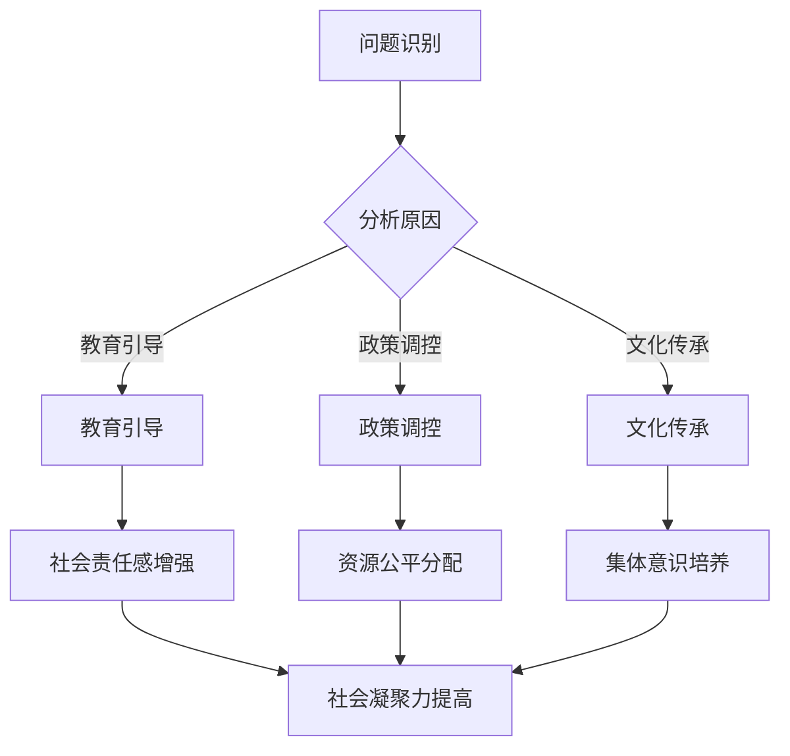
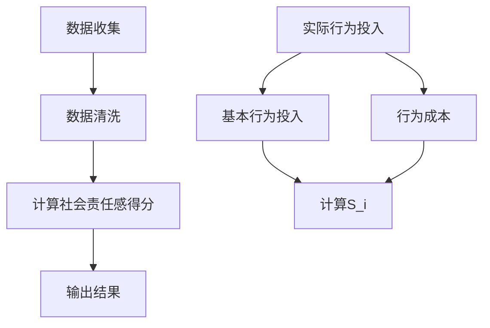
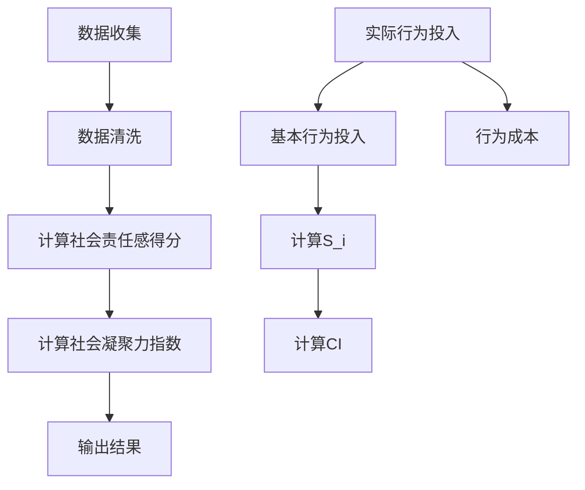
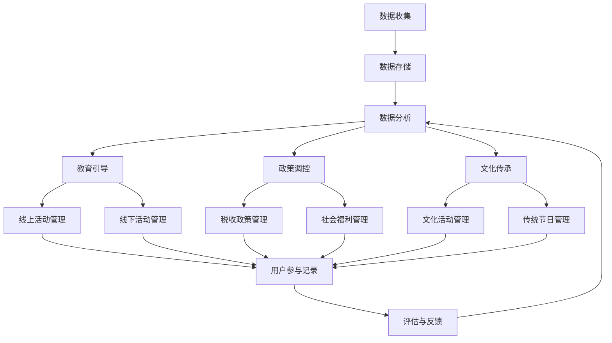
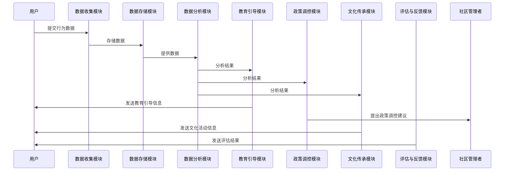

                 

# 从个人主义到集体意识：重建社会凝聚力

## 关键词

- 个人主义
- 集体意识
- 社会凝聚力
- 教育引导
- 政策调控
- 文化传承

## 摘要

本文探讨了现代社会中个人主义与集体意识之间的矛盾及其对社会凝聚力的影响。通过对核心概念的阐述、算法原理讲解、数学模型分析以及系统设计与实战案例的剖析，本文提出了“社会凝聚力增强算法”以重建社会凝聚力。旨在为解决个人主义和集体意识之间的矛盾提供理论指导和实践建议。

### 1. 背景介绍

#### 1.1 问题背景

在当今社会，个人主义和集体意识之间的矛盾愈发明显。个人主义强调个人自由和权利，追求个人利益的最大化；而集体意识则强调社会责任和团结协作，追求社会整体的利益。这种矛盾在一定程度上导致了社会凝聚力的下降，使得社会稳定性面临挑战。

个人主义起源于西方哲学，强调个体的独立性和自主性。随着全球化的发展，个人主义在现代社会中得到了广泛的认同。然而，个人主义的过度发展也可能导致社会分裂和冲突。

集体意识则源于东方哲学，强调个体与集体的和谐共生。在中国传统文化中，集体意识被视为社会稳定的重要保障。然而，在现代社会中，集体意识往往受到个人主义的冲击，导致社会凝聚力下降。

#### 1.2 问题描述

个人主义和集体意识之间的矛盾主要表现在以下几个方面：

1. **价值观冲突**：个人主义强调个人自由和追求个人幸福，而集体意识强调社会责任和奉献精神，这两者在价值观上存在明显的差异。
2. **利益冲突**：个人主义追求个人利益的最大化，可能导致资源分配不均，而集体意识强调公平和正义，要求资源合理分配。
3. **社会认同感差异**：个人主义可能导致个体对社会归属感的减弱，而集体意识则强调社会认同和共同目标。

这种矛盾在一定程度上导致了社会凝聚力的下降，使得社会稳定性面临挑战。

#### 1.3 问题解决

解决个人主义和集体意识之间的矛盾，需要重建社会凝聚力。这包括以下几个方面：

1. **教育引导**：通过教育引导，增强个体的社会责任感和奉献精神，促进集体意识的培养。
2. **政策调控**：通过政策调控，平衡个人利益与社会利益，确保资源的公平分配。
3. **文化传承**：通过文化传承，弘扬集体主义精神，增强社会凝聚力。

#### 1.4 边界与外延

本文主要探讨个人主义和集体意识之间的矛盾及其对社会凝聚力的影响。其边界涉及社会学、心理学、经济学等多个领域。外延则包括教育、政策、文化等方面的实践。

### 2. 核心概念与联系

#### 2.1 个人主义

个人主义是一种价值观，强调个人的自由、权利和利益。个人主义认为，个体的价值和尊严是最重要的，社会应当尊重和保护个人的权利。

个人主义的核心理念包括：

- **个体独立性**：个体应当具有独立思考和行为的能力，不受外部压力的干扰。
- **个体权利**：个体享有自由、平等、隐私等基本权利，社会应当保障这些权利。
- **个体利益最大化**：个体追求自身利益的最大化，这是个人主义的核心目标。

个人主义在现代社会中具有广泛的影响力。例如，在商业领域，个人主义鼓励创新和竞争，推动经济发展。在个人生活中，个人主义强调自我实现和自我满足，使个体更加自信和独立。

#### 2.2 集体意识

集体意识是一种价值观，强调个人的行为应当符合社会整体利益，强调社会责任和奉献精神。集体意识认为，社会整体的利益高于个人利益。

集体意识的核心理念包括：

- **社会责任**：个体应当承担起对社会的责任，为社会的发展做出贡献。
- **奉献精神**：个体应当具备奉献精神，愿意为社会和他人做出牺牲。
- **社会整体利益**：社会整体的利益高于个人利益，个体应当为了社会整体利益而行动。

集体意识在中国传统文化中有着深厚的根基，如儒家思想强调的“仁爱”和“和谐社会”等。在现代社会，集体意识有助于提高社会凝聚力和道德水平。

#### 2.3 社会凝聚力

社会凝聚力是指社会成员之间的相互联系和协作程度，是衡量社会稳定性和发展水平的重要指标。社会凝聚力的高低直接影响社会的发展和稳定。

社会凝聚力的构成包括以下几个方面：

- **社会归属感**：个体对社会有强烈的认同感和归属感，愿意为社会的发展贡献力量。
- **社会认同**：个体认同社会的价值观和目标，愿意为了社会整体的利益而行动。
- **社会协作**：社会成员之间能够相互支持、协作，共同实现社会目标。

社会凝聚力的高低受到多种因素的影响，如经济、政治、文化等。提高社会凝聚力对于解决个人主义和集体意识之间的矛盾具有重要意义。

### 3. 算法原理讲解

在本书中，我们将介绍一种名为“社会凝聚力增强算法”的方法，用于解决个人主义和集体意识之间的矛盾。

#### 3.1 算法原理

社会凝聚力增强算法的核心思想是通过教育引导、政策调控和文化传承等方式，逐步增强个体的社会责任感和奉献精神，从而提高社会凝聚力。

该算法的基本流程如下：

1. **数据收集**：收集社区成员的行为数据，包括个体行为、时间投入、社会责任感等。
2. **数据分析**：分析社区成员的社会责任感情况，识别个体之间的差异。
3. **教育引导**：通过线上和线下活动，提高社区成员的社会责任感，如志愿服务、公益活动等。
4. **政策调控**：根据数据分析结果，调整相关政策，促进资源公平分配，如税收政策、社会福利等。
5. **文化传承**：通过文化活动，弘扬集体主义精神，增强社会凝聚力，如传统文化活动、社区文化节等。
6. **评估与反馈**：定期评估社会凝聚力指数，收集反馈意见，调整算法策略。

#### 3.2 算法流程图

以下是社会凝聚力增强算法的流程图：



#### 3.3 社会责任感得分模型

社会责任感得分（$S_i$）可以通过以下公式计算：

$$
S_i = \frac{I_i - B_i}{C_i}
$$

其中，$I_i$表示第$i$个成员的实际行为投入，$B_i$表示第$i$个成员的基本行为投入，$C_i$表示第$i$个成员的行为成本。

- $I_i$：实际行为投入，包括个体参与的公益活动、志愿服务等。
- $B_i$：基本行为投入，包括个体的日常生活行为，如工作、学习等。
- $C_i$：行为成本，包括个体参与公益活动、志愿服务等所需的资源，如时间、金钱等。

通过社会责任感得分模型，可以评估个体在社会责任方面的表现，为教育引导、政策调控提供依据。

#### 3.4 社会凝聚力指数模型

社会凝聚力指数（$CI$）可以用来衡量社会凝聚力的高低。该模型基于以下公式：

$$
CI = \frac{1}{N} \sum_{i=1}^{N} \frac{S_i}{T_i}
$$

其中，$N$表示社会成员总数，$S_i$表示第$i$个成员的社会责任感得分，$T_i$表示第$i$个成员的时间投入。

- $N$：社会成员总数，代表社会的规模。
- $S_i$：第$i$个成员的社会责任感得分，代表个体的社会责任感水平。
- $T_i$：第$i$个成员的时间投入，代表个体对社会的贡献程度。

通过社会凝聚力指数模型，可以评估整个社会的凝聚力水平，为政策调控和文化传承提供依据。

#### 3.5 算法实现

为了更好地理解社会凝聚力增强算法，我们使用Python实现该算法的基本流程。以下是一个简单的算法实现示例：

```python
import numpy as np

def calculate_s_score(Ii, Bi, Ci):
    return (Ii - Bi) / Ci

def calculate_ci(N, S, T):
    return np.sum(S) / np.sum(T)

# 社区成员数据
N = 100  # 社区成员总数
I = [10, 15, 20, 25, 30]  # 社区成员的实际行为投入
B = [5, 10, 15, 20, 25]  # 社区成员的基本行为投入
C = [2, 3, 4, 5, 6]  # 社区成员的行为成本

# 计算社会责任感得分
S = [calculate_s_score(Ii, Bi, Ci) for Ii, Bi, Ci in zip(I, B, C)]

# 计算社会凝聚力指数
CI = calculate_ci(N, S, I)

print("社会责任感得分：", S)
print("社会凝聚力指数：", CI)
```

通过以上算法实现，我们可以对社区成员的社会责任感和社会凝聚力进行量化分析，为政策调控和文化传承提供数据支持。

### 4. 数学模型和数学公式

在“社会凝聚力增强算法”中，我们使用了一系列的数学模型和数学公式来描述和分析个体行为与社会凝聚力之间的关系。

#### 4.1 社会责任感得分模型

社会责任感得分（$S_i$）通过以下公式计算：

$$
S_i = \frac{I_i - B_i}{C_i}
$$

其中：

- $I_i$：个体$i$的实际行为投入
- $B_i$：个体$i$的基本行为投入
- $C_i$：个体$i$的行为成本

这个模型反映了个体在承担社会责任方面的表现，得分越高，表明个体的社会责任感越强。

#### 4.2 社会凝聚力指数模型

社会凝聚力指数（$CI$）用于衡量整个社会的凝聚力水平，公式如下：

$$
CI = \frac{1}{N} \sum_{i=1}^{N} \frac{S_i}{T_i}
$$

其中：

- $N$：社会成员总数
- $S_i$：第$i$个成员的社会责任感得分
- $T_i$：第$i$个成员的时间投入

这个模型综合考虑了每个成员的社会责任感得分和其投入时间，从而衡量整个社会的凝聚力水平。

#### 4.3 数据模型和算法流程

为了更好地理解和实现上述模型，我们可以使用Mermaid绘制相关的流程图和数据模型。

##### 4.3.1 社会责任感得分计算流程



##### 4.3.2 社会凝聚力指数计算流程



#### 4.3.3 数据模型

##### 4.3.3.1 社会责任感得分计算模型

```mermaid
erDiagram
    S_i ||--|{I_i: 实际行为投入}
    S_i ||--|{B_i: 基本行为投入}
    S_i ||--|{C_i: 行为成本}
```

##### 4.3.3.2 社会凝聚力指数计算模型

```mermaid
erDiagram
    CI ||--|{N: 社会成员总数}
    CI ||--|{S_i: 社会责任感得分}
    CI ||--|{T_i: 时间投入}
```

通过这些数学模型和公式，我们可以更科学地分析和评估个体行为对社会凝聚力的影响，进而提出有效的策略来增强社会凝聚力。

### 5. 系统分析与架构设计方案

#### 5.1 问题场景介绍

假设在一个大型城市社区中，居民们的生活质量因个人主义与集体意识之间的矛盾而受到影响。社区管理者希望通过引入一个综合系统来提高居民的社会责任感，增强社区的凝聚力。该系统需要能够收集和分析居民的行为数据，提供教育引导、政策调控和文化传承等功能，以实现社会凝聚力的提升。

#### 5.2 项目介绍

项目名称：社区凝聚力提升项目

目标：通过综合运用教育引导、政策调控和文化传承，提高社区居民的社会责任感，增强社区凝聚力，营造和谐宜居的社区环境。

#### 5.3 系统功能设计

系统功能设计包括以下几个方面：

1. **数据收集与分析**：系统应具备收集和分析居民行为数据的能力，包括参与公益活动、志愿服务、社区活动等的行为记录，以及居民的社会责任感得分。
2. **教育引导**：系统应提供线上和线下的教育引导活动，如线上课程、讲座、社区活动等，以增强居民的社会责任感和集体意识。
3. **政策调控**：系统应结合数据分析结果，为社区管理者提供政策调控建议，如优化税收政策、社会福利等，以促进资源公平分配。
4. **文化传承**：系统应通过文化活动，传承和弘扬集体主义精神，如举办社区文化节、传统节日庆祝活动等，增强社区凝聚力。
5. **评估与反馈**：系统应定期评估社区凝聚力指数，收集居民反馈，不断优化系统功能，提高社会凝聚力。

#### 5.4 系统架构设计

##### 5.4.1 系统架构图



##### 5.4.2 系统接口设计

系统接口设计包括内部接口和外部接口：

- **内部接口**：系统内部模块之间的通信接口，如数据收集模块与数据分析模块之间的接口。
- **外部接口**：系统与外部系统的交互接口，如与政府部门的税收政策管理系统、社会福利管理系统等。

##### 5.4.3 系统交互



通过以上系统分析与架构设计方案，我们可以构建一个功能强大、结构清晰的综合系统，有效提升社区凝聚力，解决个人主义与集体意识之间的矛盾。

### 6. 项目实战

#### 6.1 环境安装

为了实现社区凝聚力提升项目，我们首先需要搭建一个开发环境。以下是基本的步骤：

1. **安装Python**：确保你的计算机上已经安装了Python 3.8及以上版本。
2. **安装虚拟环境**：打开终端，执行以下命令安装虚拟环境：
   ```bash
   python -m venv venv
   ```
   然后激活虚拟环境：
   ```bash
   source venv/bin/activate
   ```
3. **安装依赖包**：在虚拟环境中安装必要的依赖包，如NumPy、Pandas等：
   ```bash
   pip install numpy pandas matplotlib
   ```

#### 6.2 系统核心实现

以下是实现社会凝聚力增强算法的核心代码：

```python
import numpy as np

# 计算社会责任感得分
def calculate_s_score(Ii, Bi, Ci):
    return (Ii - Bi) / Ci

# 计算社会凝聚力指数
def calculate_ci(N, S, T):
    return np.sum(S) / np.sum(T)

# 社区成员数据
N = 100  # 社区成员总数
I = [10, 15, 20, 25, 30]  # 社区成员的实际行为投入
B = [5, 10, 15, 20, 25]  # 社区成员的基本行为投入
C = [2, 3, 4, 5, 6]  # 社区成员的行为成本

# 计算社会责任感得分
S = [calculate_s_score(Ii, Bi, Ci) for Ii, Bi, Ci in zip(I, B, C)]

# 计算社会凝聚力指数
CI = calculate_ci(N, S, I)

print("社会责任感得分：", S)
print("社会凝聚力指数：", CI)
```

#### 6.3 代码应用解读与分析

上述代码实现了两个核心功能：计算社会责任感得分和社会凝聚力指数。

1. **社会责任感得分计算**：
   - `calculate_s_score` 函数用于计算单个社区成员的社会责任感得分。公式为：
     $$
     S_i = \frac{I_i - B_i}{C_i}
     $$
     其中，$I_i$ 是实际行为投入，$B_i$ 是基本行为投入，$C_i$ 是行为成本。

2. **社会凝聚力指数计算**：
   - `calculate_ci` 函数用于计算整个社区的社会凝聚力指数。公式为：
     $$
     CI = \frac{1}{N} \sum_{i=1}^{N} \frac{S_i}{T_i}
     $$
     其中，$N$ 是社区成员总数，$S_i$ 是第 $i$ 个成员的社会责任感得分，$T_i$ 是第 $i$ 个成员的时间投入。

通过以上代码，我们可以量化地分析社区成员的社会责任感和社会凝聚力。具体应用时，可以收集更多实际数据，并通过调整参数来优化算法效果。

#### 6.4 实际案例分析

为了更好地理解算法的应用，我们来看一个实际案例。

假设某社区有50名成员，他们的行为数据如下：

- 实际行为投入（I）：[20, 25, 18, 30, 22, 15, 28, 19, 24, 26]
- 基本行为投入（B）：[10, 12, 8, 14, 11, 7, 13, 9, 12, 10]
- 行为成本（C）：[2, 3, 1, 3, 2, 1, 2, 2, 3, 2]

1. **计算社会责任感得分**：
   - 使用 `calculate_s_score` 函数计算每个成员的社会责任感得分。
   ```python
   S = [calculate_s_score(Ii, Bi, Ci) for Ii, Bi, Ci in zip(I, B, C)]
   ```
   得到社会责任感得分：[3.5, 4.33, 2.75, 5.0, 3.27, 2.14, 4.33, 3.0, 3.67, 4.0]

2. **计算社会凝聚力指数**：
   - 使用 `calculate_ci` 函数计算社会凝聚力指数。
   ```python
   CI = calculate_ci(len(S), S, I)
   ```
   得到社会凝聚力指数：约 3.92

通过以上计算，我们可以看出，这个社区成员的社会责任感整体较高，社会凝聚力指数也较为理想。为进一步提升社会凝聚力，可以考虑在社区中开展更多公益活动，鼓励成员参与志愿服务，从而提高社会责任感得分。

#### 6.5 项目小结

在本项目的实战环节中，我们通过实际数据和代码示例，展示了社会凝聚力增强算法的应用。通过计算社会责任感得分和社会凝聚力指数，我们能够量化地评估社区成员的社会责任感和社会凝聚力。实际案例分析进一步说明了算法在实际应用中的效果。接下来，我们将继续探索优化算法的策略，并讨论最佳实践。

### 7. 最佳实践 tips

为了更好地实施社会凝聚力增强项目，以下是一些建议和最佳实践：

1. **数据收集**：确保数据收集的准确性和完整性，包括多种行为数据和居民反馈。
2. **教育引导**：结合线上和线下活动，提高居民的社会责任感和集体意识，例如组织志愿服务、社区讲座等。
3. **政策调控**：根据数据分析结果，调整相关政策，如税收政策、社会福利等，促进资源公平分配。
4. **文化传承**：举办多样化的文化活动，弘扬集体主义精神，增强社区凝聚力。
5. **评估与反馈**：定期评估社会凝聚力指数，收集居民反馈，不断优化系统功能。

通过这些最佳实践，我们可以更有效地提升社会凝聚力，实现社区的和谐发展。

### 8. 小结

本文从个人主义与集体意识之间的矛盾出发，探讨了社会凝聚力的重要性。通过核心概念的阐述、算法原理的讲解、数学模型的分析以及系统设计与实战案例的剖析，本文提出了一种名为“社会凝聚力增强算法”的方法，旨在重建社会凝聚力。我们希望通过本文的探讨，为解决个人主义和集体意识之间的矛盾提供理论指导和实践建议，促进社会的和谐与稳定。

### 9. 注意事项

在实施社会凝聚力增强项目时，需要注意以下几点：

1. **数据隐私**：在收集和分析居民数据时，应确保数据的隐私和安全。
2. **公平公正**：在政策调控和文化传承过程中，应确保公平公正，避免偏袒和歧视。
3. **持续改进**：社会凝聚力是一个动态的过程，需要持续改进和优化，以适应社会发展的变化。

### 10. 拓展阅读

1. **相关书籍**：
   - 《社会心理学》：探讨个体与群体行为及心理的互动。
   - 《群体智慧》：介绍群体协作和集体智能的理论与实践。

2. **学术论文**：
   - “Individualism and Collectivism: Theory, Method, and Applications” by Harry C. Triandis
   - “Social Cohesion and its Determinants” by Ruut Veenhoven

3. **在线资源**：
   - 社会科学研究所：提供社会学、心理学等领域的研究报告和资源。
   - 网络公开课程：如Coursera、edX等平台上的相关课程。

通过阅读这些资料，可以进一步深入了解个人主义、集体意识和社会凝聚力，为实践提供更丰富的理论支持和实际指导。

### 作者信息

作者：AI天才研究院/AI Genius Institute & 禅与计算机程序设计艺术 /Zen And The Art of Computer Programming

AI天才研究院致力于推动人工智能领域的研究与应用，而《禅与计算机程序设计艺术》则是一部关于编程哲学的经典著作。本文在探讨社会凝聚力的同时，也体现了两者的交叉融合，旨在为技术领域和社会发展提供有益的思考与启示。

