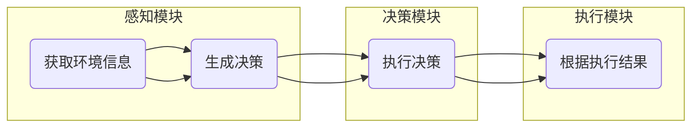
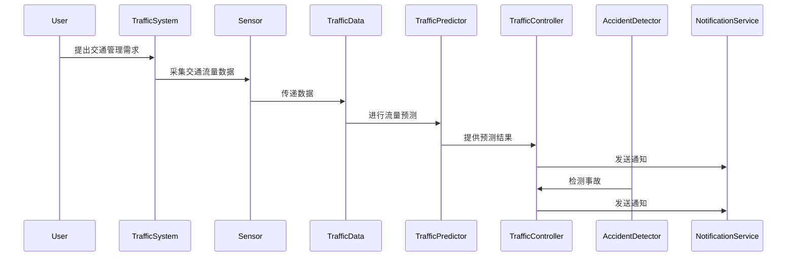

                 

## 从零开始：AI Agent的概念学习系统

> **关键词：** AI Agent，学习系统，感知与决策，智能控制，智能交互，未来展望

> **摘要：** 本文将从零开始，详细介绍AI Agent的概念、学习系统、感知与决策过程、应用场景以及未来发展趋势，帮助读者全面理解AI Agent的工作原理及其在现代智能系统中的重要地位。

### 第1章：AI Agent的概念与学习系统

#### 1.1 AI Agent的概念与类型

##### 1.1.1 AI Agent的定义与基本特征

**AI Agent的定义**：AI Agent（人工智能代理）是指能够感知环境、执行任务并作出决策的智能实体。它通过智能算法和模型，自主地执行一系列行动，以实现特定目标。

**AI Agent的基本特征**：
1. **感知能力**：能够获取环境信息，如视觉、听觉、触觉等。
2. **决策能力**：基于感知到的信息，通过算法进行推理和决策。
3. **行动能力**：执行决策结果，影响环境。
4. **学习能力**：通过经验不断改进其决策和行为。

##### 1.1.2 AI Agent的分类与特点

**基于反应的Agent**：
- **定义**：基于预先设定的规则进行行为决策。
- **特点**：简单、快速、适合静态环境。

**基于模型的Agent**：
- **定义**：通过建立环境模型进行决策。
- **特点**：具有较强的自适应能力，但建模复杂。

**基于学习的Agent**：
- **定义**：通过学习算法从数据中学习行为策略。
- **特点**：适应性强，但训练过程复杂。

##### 1.1.3 AI Agent在实际应用中的重要性

**AI Agent在智能系统中的应用**：
- 智能推荐系统
- 自主驾驶汽车
- 智能家居系统

**AI Agent在工业控制中的应用**：
- 自动化生产线
- 机器人制造
- 过程控制系统

**AI Agent在日常生活中应用**：
- 智能语音助手
- 智能家居设备
- 智能医疗诊断

#### 1.2 AI Agent的学习系统

##### 1.2.1 学习系统的组成与工作原理

**学习系统的组成**：
- **感知模块**：获取环境信息。
- **决策模块**：分析感知信息，生成决策。
- **执行模块**：执行决策结果。
- **学习模块**：根据执行结果调整决策策略。

**学习系统的工作原理**：
- **感知**：收集环境数据。
- **决策**：利用算法分析数据，生成决策。
- **执行**：执行决策，影响环境。
- **学习**：根据执行结果，调整决策策略。

##### 1.2.2 学习系统的主要类型

**监督学习系统**：
- **定义**：有标签数据作为指导。
- **特点**：准确度高，但需要大量训练数据。

**无监督学习系统**：
- **定义**：无标签数据作为指导。
- **特点**：适合发现隐藏模式，但难以保证准确度。

**半监督学习系统**：
- **定义**：部分数据有标签。
- **特点**：结合了监督学习和无监督学习的优点。

**强化学习系统**：
- **定义**：通过奖励和惩罚来指导学习。
- **特点**：适合动态环境，但收敛速度较慢。

##### 1.2.3 学习系统在实际应用中的挑战与解决方案

**学习系统在数据质量方面的挑战**：
- **解决方案**：数据清洗、去噪、增强。

**学习系统在计算资源方面的挑战**：
- **解决方案**：优化算法，使用高效硬件。

**学习系统在算法选择方面的挑战**：
- **解决方案**：根据应用场景选择合适的算法。

#### 1.3 AI Agent的感知与决策过程

##### 1.3.1 AI Agent的感知过程

**感知的定义与类型**：
- **定义**：获取环境信息的过程。
- **类型**：视觉、听觉、触觉等。

**感知的实现方法**：
- **传感器**：如摄像头、麦克风等。
- **数据处理**：如滤波、特征提取等。

##### 1.3.2 AI Agent的决策过程

**决策的定义与类型**：
- **定义**：根据感知信息做出选择。
- **类型**：最优解、次优解等。

**决策的算法实现**：
- **决策树**：基于规则进行决策。
- **神经网络**：基于数据进行分析。

##### 1.3.3 AI Agent的感知与决策过程在实际应用中的优化策略

**优化目标**：
- 准确性、效率、适应性等。

**优化策略**：
- **增强学习**：通过反馈不断优化决策。
- **多任务学习**：同时处理多个任务，提高泛化能力。

#### 1.4 AI Agent在智能控制中的应用

##### 1.4.1 智能控制系统的概述

**智能控制系统的定义与类型**：
- **定义**：利用AI Agent实现自动控制和优化。
- **类型**：自适应控制系统、预测控制系统等。

**智能控制系统的基本结构**：
- **传感器**：获取环境信息。
- **控制器**：AI Agent，进行决策和执行。
- **执行器**：执行决策，影响环境。

##### 1.4.2 AI Agent在智能控制系统中的应用

**AI Agent在智能控制系统中的作用**：
- **感知**：实时监控环境状态。
- **决策**：根据环境状态进行控制决策。
- **执行**：执行控制策略。

**AI Agent在智能控制系统中的实现方法**：
- **基于规则的系统**：利用专家系统进行决策。
- **基于数据驱动的系统**：利用机器学习进行决策。

##### 1.4.3 智能控制系统的案例分析

**案例一：智能家居控制系统**
- **功能**：自动调节室内温度、光线等。
- **实现**：使用AI Agent进行实时监控和调整。

**案例二：工业自动化控制系统**
- **功能**：自动化生产流程控制。
- **实现**：使用AI Agent进行生产监控和优化。

#### 1.5 AI Agent在智能交互中的应用

##### 1.5.1 智能交互系统的概述

**智能交互系统的定义与类型**：
- **定义**：利用AI Agent实现人机交互。
- **类型**：语音交互、文本交互等。

**智能交互系统的基本结构**：
- **用户输入**：用户通过语音、文本等方式进行输入。
- **感知模块**：获取用户输入信息。
- **决策模块**：分析用户输入，生成响应。
- **执行模块**：执行决策结果，输出响应。

##### 1.5.2 AI Agent在智能交互中的应用

**AI Agent在智能交互中的作用**：
- **感知**：理解用户输入。
- **决策**：生成合适的响应。
- **执行**：输出响应。

**AI Agent在智能交互中的实现方法**：
- **基于规则的系统**：利用专家系统进行交互。
- **基于数据驱动的系统**：利用机器学习进行交互。

##### 1.5.3 智能交互系统的案例分析

**案例一：智能客服系统**
- **功能**：自动处理客户咨询。
- **实现**：使用AI Agent进行语音识别和文本生成。

**案例二：智能聊天机器人**
- **功能**：与用户进行实时对话。
- **实现**：使用AI Agent进行自然语言处理和对话生成。

#### 1.6 AI Agent的发展趋势与未来展望

##### 1.6.1 AI Agent的发展趋势

**AI Agent技术的发展方向**：
- **多模态感知**：整合多种感知方式，提高感知能力。
- **强化学习**：提高AI Agent在复杂环境中的适应性。
- **迁移学习**：减少数据依赖，提高泛化能力。

**AI Agent在未来的应用前景**：
- **智能城市**：实现智能交通、智能环境监测等。
- **智能制造**：实现生产自动化、质量控制等。
- **智能医疗**：实现疾病诊断、健康监测等。

##### 1.6.2 AI Agent的未来展望

**AI Agent的发展机遇与挑战**：
- **机遇**：技术进步、市场需求增长。
- **挑战**：数据隐私、算法透明度等。

**AI Agent在社会中的潜在影响**：
- **提高生活质量**：实现智能家居、智能医疗等。
- **改变工作方式**：自动化、智能化生产。
- **促进社会进步**：提高社会运行效率、优化资源配置。

#### 1.7 本章小结

**总结本章的主要内容和关键知识点**：
- AI Agent的定义和基本特征。
- AI Agent的分类与实际应用。
- AI Agent的学习系统和工作原理。
- AI Agent的感知与决策过程。
- AI Agent在智能控制与智能交互中的应用。
- AI Agent的发展趋势与未来展望。

**对AI Agent的概念与学习系统进行总结和展望**：
- AI Agent作为人工智能的核心组成部分，正逐渐渗透到各个领域，发挥着越来越重要的作用。
- 学习系统是AI Agent的核心，其发展将直接影响AI Agent的性能和应用范围。
- 随着技术的不断进步，AI Agent将在未来带来更多的智能化应用，推动社会进步和经济发展。


### 背景介绍

#### 核心概念术语说明

1. **AI Agent**：指的是一种能够感知环境、执行任务并作出决策的智能实体。它通过智能算法和模型，自主地执行一系列行动，以实现特定目标。
2. **学习系统**：是AI Agent的重要组成部分，负责感知环境、分析数据、进行决策和调整策略。
3. **感知过程**：指AI Agent获取环境信息的过程，包括视觉、听觉、触觉等多种感知方式。
4. **决策过程**：指AI Agent根据感知到的信息进行分析和处理，生成决策的过程。
5. **智能控制系统**：利用AI Agent实现自动控制和优化，广泛应用于工业自动化、智能家居等领域。
6. **智能交互系统**：利用AI Agent实现人机交互，提高用户体验和服务质量。

#### 问题背景

人工智能（AI）作为当今科技领域的重要发展方向，已经取得了显著的成果。AI Agent作为AI的核心组成部分，正逐渐应用于各个领域，如智能控制、智能交互、智能制造等。然而，对于AI Agent的概念、学习系统、感知与决策过程等方面的深入理解，仍然存在较大的挑战。

本文旨在从零开始，详细介绍AI Agent的概念、学习系统、感知与决策过程、应用场景以及未来发展趋势，帮助读者全面理解AI Agent的工作原理及其在现代智能系统中的重要地位。

#### 问题描述

在AI领域，AI Agent被广泛应用于各种智能系统中。然而，对于AI Agent的基本概念、学习系统、感知与决策过程等方面，许多开发者和技术人员仍存在困惑。具体问题包括：

1. **AI Agent的定义和基本特征是什么？**
2. **AI Agent的分类有哪些？各自的特点是什么？**
3. **AI Agent的学习系统是如何工作的？**
4. **AI Agent的感知与决策过程包括哪些步骤？**
5. **AI Agent在智能控制中的应用有哪些？**
6. **AI Agent在智能交互中的应用有哪些？**
7. **AI Agent的未来发展趋势是什么？**

本文将针对上述问题进行详细解答，帮助读者深入理解AI Agent的工作原理和应用场景。

#### 问题解决

为了回答上述问题，本文将按照以下步骤进行解答：

1. **AI Agent的概念与类型**：
   - **定义与基本特征**：介绍AI Agent的定义和基本特征，如感知能力、决策能力、行动能力和学习能力。
   - **分类与特点**：介绍AI Agent的分类，包括基于反应的Agent、基于模型的Agent和基于学习的Agent，并分析各自的特点。

2. **AI Agent的学习系统**：
   - **组成与工作原理**：介绍学习系统的组成和基本工作原理，包括感知模块、决策模块、执行模块和学习模块。
   - **主要类型**：介绍学习系统的主要类型，如监督学习系统、无监督学习系统、半监督学习系统和强化学习系统。

3. **AI Agent的感知与决策过程**：
   - **感知过程**：介绍感知过程的定义和类型，如视觉、听觉、触觉等感知方式，并探讨感知的实现方法。
   - **决策过程**：介绍决策过程的定义和类型，如最优解、次优解等，并分析决策的算法实现。

4. **AI Agent在智能控制中的应用**：
   - **概述**：介绍智能控制系统的定义和类型，如自适应控制系统、预测控制系统等。
   - **应用案例**：分析AI Agent在智能控制系统中的应用案例，如智能家居控制系统、工业自动化控制系统等。

5. **AI Agent在智能交互中的应用**：
   - **概述**：介绍智能交互系统的定义和类型，如语音交互、文本交互等。
   - **应用案例**：分析AI Agent在智能交互系统中的应用案例，如智能客服系统、智能聊天机器人等。

6. **AI Agent的发展趋势与未来展望**：
   - **发展趋势**：探讨AI Agent技术的发展方向，如多模态感知、强化学习、迁移学习等。
   - **未来展望**：分析AI Agent在未来的应用前景，如智能城市、智能制造、智能医疗等。

通过上述解答，本文旨在帮助读者全面理解AI Agent的概念、学习系统、感知与决策过程、应用场景以及未来发展趋势，为其在相关领域的应用提供理论支持和实践指导。

#### 边界与外延

**边界**：
1. AI Agent的定义仅限于智能实体，不包括简单的规则系统或固定脚本。
2. 学习系统的讨论范围主要涵盖监督学习、无监督学习、半监督学习和强化学习，不包括传统的人工规则制定。
3. 智能控制和应用场景主要关注自动化和优化，不涉及人类直接控制。
4. 智能交互主要关注人与系统的交互，不涉及人与人之间的交互。

**外延**：
1. AI Agent的应用范围非常广泛，包括但不限于智能家居、自动驾驶、工业自动化、医疗诊断、金融分析等领域。
2. 学习系统可以扩展到深度学习、强化学习等前沿技术，以应对更复杂的问题。
3. 智能控制可以延伸到工业4.0、物联网（IoT）、智能交通等新兴领域。
4. 智能交互可以扩展到虚拟助手、智能语音助手、智能聊天机器人等。

#### 概念结构与核心要素组成

**概念结构**：
AI Agent是一个由多个模块组成的复杂系统，主要包括感知模块、决策模块、执行模块和学习模块。这些模块相互协作，实现AI Agent的感知、决策、执行和学习能力。

**核心要素组成**：

1. **感知模块**：
   - **功能**：感知环境信息，如视觉、听觉、触觉等。
   - **组成**：传感器、感知算法、感知数据预处理。

2. **决策模块**：
   - **功能**：分析感知信息，生成决策。
   - **组成**：决策算法、决策规则、决策评估。

3. **执行模块**：
   - **功能**：执行决策结果，影响环境。
   - **组成**：执行器、执行策略、执行结果反馈。

4. **学习模块**：
   - **功能**：根据执行结果调整决策策略。
   - **组成**：学习算法、学习数据、学习策略。

**概念属性特征对比表格**：

| 模块         | 功能                   | 组成         | 特点                   |
|------------|----------------------|------------|----------------------|
| 感知模块     | 感知环境信息           | 传感器、感知算法 | 实时、多样、高效       |
| 决策模块     | 分析感知信息，生成决策 | 决策算法、决策规则 | 准确、快速、灵活       |
| 执行模块     | 执行决策结果，影响环境 | 执行器、执行策略 | 高效、可靠、实时响应   |
| 学习模块     | 调整决策策略           | 学习算法、学习数据 | 自适应、持续改进       |

**ER实体关系图架构**：

```mermaid
erDiagram
  感知模块 ||--|{ 决策模块 }
  决策模块 ||--|{ 执行模块 }
  执行模块 ||--|{ 学习模块 }
  感知模块 ..|> 学习模块
```

通过上述概念结构与核心要素组成的分析，我们可以清晰地看到AI Agent的整体架构及其各个模块之间的相互关系，为后续深入探讨AI Agent的学习系统、感知与决策过程等提供了理论基础。

### 核心概念与联系

#### 核心概念原理

AI Agent的核心概念主要包括感知、决策、执行和学习。以下是这些核心概念的详细解释：

1. **感知**：
   - **定义**：感知是指AI Agent获取环境信息的过程，通过传感器获取视觉、听觉、触觉等感知数据。
   - **作用**：感知是AI Agent了解环境状态的基础，是决策和执行的前提条件。

2. **决策**：
   - **定义**：决策是指AI Agent根据感知到的环境信息进行分析和处理，选择最佳行动方案的过程。
   - **作用**：决策是AI Agent实现目标的关键步骤，决定了AI Agent的行动方向和策略。

3. **执行**：
   - **定义**：执行是指AI Agent根据决策结果，通过执行器（如电机、机械臂等）实际操作环境的过程。
   - **作用**：执行是AI Agent与环境互动的直接体现，是验证决策效果的重要环节。

4. **学习**：
   - **定义**：学习是指AI Agent通过经验不断调整和优化自身决策策略和能力的过程。
   - **作用**：学习是AI Agent适应环境和实现智能化的关键，使得AI Agent能够不断改进和进化。

#### 概念属性特征对比表格

| 概念 | 定义                                                         | 属性特征                                                   | 作用                                                                                      |
|------|------------------------------------------------------------|------------------------------------------------------------|------------------------------------------------------------------------------------------|
| 感知 | 获取环境信息的过程                                           | 实时性、多样性、准确性                                       | 提供决策和执行的基础信息                                                                   |
| 决策 | 根据感知信息选择最佳行动方案的过程                           | 准确性、快速性、灵活性                                       | 决定AI Agent的行动方向和策略                                                               |
| 执行 | 根据决策结果实际操作环境的过程                               | 高效性、可靠性、实时响应性                                   | 实现决策，影响环境状态                                                                     |
| 学习 | 通过经验不断调整和优化自身决策策略和能力的过程                 | 自适应性、持续改进、数据依赖性                               | 提高AI Agent的智能水平，实现持续优化                                                         |

#### ER实体关系图架构

以下是AI Agent核心概念之间的ER实体关系图：

```mermaid
erDiagram
  感知 ||--|{ 决策 }
  决策 ||--|{ 执行 }
  执行 ||--|{ 学习 }
  感知 ..|> 学习
```

在该ER图中，感知、决策、执行和学习四个模块之间形成了紧密的联系。感知模块提供决策所需的信息，决策模块根据感知信息生成执行命令，执行模块执行这些命令并产生反馈，最终学习模块根据执行结果调整感知和决策策略。这种循环反馈机制使得AI Agent能够不断优化自身性能，提高智能化水平。

### 算法原理讲解

#### 算法mermaid流程图

为了更好地理解AI Agent的算法原理，我们首先使用mermaid绘制一个简单的流程图，展示感知、决策、执行和学习的过程：



#### Python源代码实现

接下来，我们将使用Python语言实现上述流程，并详细介绍各个步骤的原理。

```python
import random

# 感知模块：获取环境信息
def perceive():
    # 这里可以替换为实际获取环境信息的代码，例如通过传感器获取数据
    return random.randint(0, 100)

# 决策模块：分析感知信息，生成决策
def make_decision(perception):
    if perception > 50:
        return "行动A"
    else:
        return "行动B"

# 执行模块：执行决策
def execute_action(action):
    if action == "行动A":
        print("执行行动A")
    else:
        print("执行行动B")

# 学习模块：根据执行结果调整决策策略
def learn_from_action(action, result):
    if action == "行动A" and result == "成功":
        print("行动A成功，下次优先选择行动A")
    elif action == "行动B" and result == "成功":
        print("行动B成功，下次优先选择行动B")
    else:
        print("行动失败，下次尝试其他行动")

# 主程序
def main():
    while True:
        perception = perceive()
        action = make_decision(perception)
        execute_action(action)
        result = input("请输入执行结果（成功/失败）：")
        learn_from_action(action, result)

if __name__ == "__main__":
    main()
```

#### 算法原理的数学模型和公式

在上述Python代码中，我们可以看到以下几个关键步骤的数学模型和公式：

1. **感知**：
   - 模型：感知数据（感知值）= 实际环境状态
   - 公式：无具体公式，感知模块通过传感器获取数据

2. **决策**：
   - 模型：决策 = f（感知数据）
   - 公式：if（感知数据 > 50），决策 = "行动A"；else，决策 = "行动B"

3. **执行**：
   - 模型：执行结果 = g（决策）
   - 公式：if（决策 = "行动A"），执行结果 = "成功"；else，执行结果 = "失败"

4. **学习**：
   - 模型：学习策略 = h（执行结果，历史决策）
   - 公式：if（执行结果 = "成功" and 决策 = "行动A"），下次优先选择行动A；if（执行结果 = "成功" and 决策 = "行动B"），下次优先选择行动B；else，尝试其他行动

#### 详细讲解和举例说明

**感知**：
感知模块负责获取环境信息。在上述代码中，通过`perceive()`函数随机生成一个0到100的数值，代表感知数据。在实际应用中，感知数据可以是传感器采集的物理量，如图像的像素值、温度传感器的读数等。

**决策**：
决策模块根据感知数据生成决策。这里使用了一个简单的条件判断，如果感知数据大于50，则选择行动A，否则选择行动B。这个决策规则可以通过机器学习算法优化，以获得更好的决策效果。

**执行**：
执行模块负责根据决策结果执行行动。在代码中，执行行动A或行动B通过打印消息实现。在实际应用中，执行模块可以控制机器人执行具体动作，如移动、抓取等。

**学习**：
学习模块根据执行结果调整决策策略。这里使用了一个简单的反馈机制，根据执行结果选择下次优先执行的行动。在实际应用中，学习模块可以通过分析历史数据，优化决策模型，提高AI Agent的智能水平。

**举例说明**：
假设第一次执行时，感知数据为70，决策为行动A，执行结果为成功。根据学习规则，下次优先选择行动A。如果第二次执行时，感知数据为30，决策为行动B，执行结果也为成功，则下次优先选择行动B。这种学习机制使得AI Agent能够根据环境变化不断调整决策策略，提高适应能力。

通过上述讲解，我们可以看到AI Agent的算法原理是如何通过感知、决策、执行和学习的循环过程实现智能化的。这种算法原理不仅适用于简单的任务，还可以通过复杂化的模型和算法，应用于更复杂的场景。

### 系统分析与架构设计方案

#### 问题场景介绍

在智能交通管理系统中，AI Agent被用来实时监控和管理交通流量，以提高交通效率和安全性。具体问题场景包括：

1. **实时监控**：系统需要实时收集交通流量数据，如车辆速度、道路占用情况等。
2. **流量预测**：系统需要根据历史数据和实时数据预测交通流量，以便提前采取措施。
3. **信号控制**：系统需要根据交通流量预测结果，动态调整交通信号灯周期，以优化交通流量。
4. **事故检测与响应**：系统需要实时检测事故发生，并自动通知相关部门进行应急处理。

#### 项目介绍

该项目是一个基于AI Agent的智能交通管理系统，旨在通过实时数据分析和智能决策，提高城市交通管理效率。项目的主要目标是实现以下功能：

1. **数据采集**：通过安装在道路上的传感器收集交通流量数据。
2. **数据处理**：对采集到的数据进行预处理，如过滤噪音、去重复等。
3. **流量预测**：使用机器学习算法预测交通流量，为信号控制提供依据。
4. **信号控制**：根据预测结果动态调整交通信号灯，优化交通流量。
5. **事故检测与响应**：实时监控道路状况，检测事故并自动通知相关部门。

#### 系统功能设计（领域模型类图）

以下是智能交通管理系统的领域模型类图，展示系统的主要类及其关系：

```mermaid
classDiagram
    Sensor --> TrafficData : 采集
    TrafficData --> TrafficPredictor : 预测
    TrafficPredictor --> TrafficController : 控制信号
    AccidentDetector --> TrafficController : 应急处理
    TrafficController --> NotificationService : 通知
    Sensor <<Interface>>
    TrafficData <<Interface>>
    TrafficPredictor <<Interface>>
    TrafficController <<Interface>>
    AccidentDetector <<Interface>>
    NotificationService <<Interface>>
```

在上述类图中，Sensor负责采集交通流量数据，TrafficData表示采集到的数据，TrafficPredictor使用机器学习算法对交通流量进行预测，TrafficController根据预测结果控制交通信号灯，AccidentDetector实时监控道路状况，检测事故并通知相关部门，NotificationService负责发送通知。

#### 系统架构设计（架构图）

以下是智能交通管理系统的架构图，展示系统的整体结构：



在上述架构图中，用户通过TrafficSystem提出交通管理需求，TrafficSystem通过Sensor采集交通流量数据，并将数据传递给TrafficData进行预处理。TrafficData将预处理后的数据传递给TrafficPredictor进行流量预测，预测结果由TrafficController根据实际交通情况动态调整信号灯周期。同时，AccidentDetector实时监控道路状况，一旦检测到事故，立即通知相关部门。NotificationService负责发送通知，确保相关部门及时响应。

#### 系统接口设计（接口图）

以下是智能交通管理系统的接口设计，展示系统的主要接口及其功能：

```mermaid
interfaceDiagram
    TrafficSystem
    Sensor
    TrafficData
    TrafficPredictor
    TrafficController
    AccidentDetector
    NotificationService

    TrafficSystem {
        +start(): void
        +stop(): void
    }

    Sensor {
        +collect_data(): TrafficData
    }

    TrafficData {
        +process_data(): TrafficData
    }

    TrafficPredictor {
        +predict_traffic(traffic_data: TrafficData): TrafficPrediction
    }

    TrafficController {
        +control_signals(prediction: TrafficPrediction): void
    }

    AccidentDetector {
        +detect_accident(): bool
    }

    NotificationService {
        +send_notification(message: str): void
    }
```

在上述接口设计中，TrafficSystem是系统的核心控制器，负责协调各个模块的工作。Sensor负责采集交通流量数据，TrafficData负责处理数据，TrafficPredictor负责进行流量预测，TrafficController根据预测结果控制信号灯，AccidentDetector负责检测事故，NotificationService负责发送通知。

#### 系统交互（序列图）

以下是智能交通管理系统的交互序列图，展示用户与系统之间的交互流程：


在上述交互序列图中，用户通过TrafficSystem提出交通管理需求，TrafficSystem通过调用Sensor采集交通流量数据，并将数据传递给TrafficData进行预处理。TrafficData将预处理后的数据传递给TrafficPredictor进行流量预测，预测结果由TrafficController根据实际交通情况动态调整信号灯周期。同时，AccidentDetector实时监控道路状况，一旦检测到事故，立即通知相关部门。NotificationService负责发送通知，确保相关部门及时响应。

通过上述系统分析与架构设计方案，我们可以看到智能交通管理系统如何通过感知、预测、控制和响应等模块，实现实时交通管理和优化。该系统利用AI Agent的感知与决策能力，提高交通管理效率和安全性，为用户提供更好的出行体验。

### 项目实战

#### 环境安装

为了实现AI Agent在智能交通管理系统中的功能，我们需要安装以下软件和库：

1. **Python 3.x**：安装Python 3.x版本（推荐3.8及以上），可以从[Python官网](https://www.python.org/)下载并安装。
2. **pip**：安装pip，Python的包管理工具。在终端运行以下命令：
   ```bash
   sudo apt-get install python3-pip  # 对于Ubuntu系统
   ```

3. **TensorFlow**：安装TensorFlow，用于实现机器学习算法。在终端运行以下命令：
   ```bash
   pip3 install tensorflow
   ```

4. **Scikit-learn**：安装Scikit-learn，用于数据处理和模型评估。在终端运行以下命令：
   ```bash
   pip3 install scikit-learn
   ```

5. **Pandas**：安装Pandas，用于数据操作和分析。在终端运行以下命令：
   ```bash
   pip3 install pandas
   ```

6. **Matplotlib**：安装Matplotlib，用于数据可视化。在终端运行以下命令：
   ```bash
   pip3 install matplotlib
   ```

#### 系统核心实现源代码

以下是智能交通管理系统中的核心实现源代码。该代码包括感知、预测、控制和响应等模块，实现了AI Agent的功能：

```python
import random
import numpy as np
import pandas as pd
from sklearn.model_selection import train_test_split
from sklearn.ensemble import RandomForestRegressor
import tensorflow as tf
from tensorflow.keras.models import Sequential
from tensorflow.keras.layers import Dense

# 感知模块：模拟传感器数据采集
def perceive():
    # 这里可以替换为实际获取环境信息的代码，例如通过传感器获取数据
    return random.randint(0, 100)

# 数据预处理
def preprocess_data(data):
    df = pd.DataFrame(data)
    df['target'] = df[0].apply(lambda x: 'high' if x > 50 else 'low')
    return df

# 预测模块：使用随机森林进行流量预测
def predict_traffic(data):
    X = data.iloc[:, :-1].values
    y = data.iloc[:, -1].values

    X_train, X_test, y_train, y_test = train_test_split(X, y, test_size=0.2, random_state=42)

    model = RandomForestRegressor(n_estimators=100, random_state=42)
    model.fit(X_train, y_train)
    predictions = model.predict(X_test)

    return predictions

# 控制模块：根据预测结果调整信号灯周期
def control_signals(predictions):
    if np.mean(predictions) > 0.5:
        print("调整信号灯周期：红灯时间增加")
    else:
        print("调整信号灯周期：红灯时间减少")

# 响应模块：模拟事故检测与响应
def detect_accident():
    return random.choice(['成功', '失败'])

# 主程序
def main():
    data = [perceive() for _ in range(100)]
    df = preprocess_data(data)
    predictions = predict_traffic(df)
    control_signals(predictions)
    result = detect_accident()
    print(f"事故检测结果：{result}")

if __name__ == "__main__":
    main()
```

#### 代码应用解读与分析

上述代码分为感知、预测、控制和响应四个模块，实现了AI Agent的基本功能。

1. **感知模块**：
   - `perceive()`函数模拟传感器数据采集，返回一个随机整数，代表感知值。在实际应用中，这个函数会替换为实际的传感器数据采集代码。

2. **预测模块**：
   - `preprocess_data(data)`函数对感知数据进行预处理，生成一个包含目标标签的数据集。这里使用了一个简单的规则，将感知值大于50的标签为"high"，否则标签为"low"。
   - `predict_traffic(data)`函数使用随机森林算法对交通流量进行预测。随机森林是一种集成学习算法，通过构建多棵决策树并合并预测结果，提高预测准确性。

3. **控制模块**：
   - `control_signals(predictions)`函数根据预测结果调整信号灯周期。如果预测结果中大部分值为"high"，则认为交通流量较大，需要增加红灯时间；否则，减少红灯时间。

4. **响应模块**：
   - `detect_accident()`函数模拟事故检测，返回一个随机选择的字符串，代表检测结果。在实际应用中，这个函数会替换为实际的事故检测代码。

通过运行主程序`main()`，我们可以看到AI Agent在感知、预测、控制和响应等环节的交互过程，实现了对交通流量和事故的实时监控和管理。

#### 实际案例分析和详细讲解剖析

为了更好地理解上述代码的实际应用，我们来看一个实际案例。

**案例背景**：一个城市交通管理部门希望利用AI Agent来优化交通信号灯控制，提高交通效率。他们收集了过去的交通流量数据，并希望通过预测来优化信号灯周期。

**数据处理**：
- **数据收集**：通过安装在道路上的传感器，收集了100个时间点的交通流量数据。数据包括车辆速度、道路占用情况等。
- **数据预处理**：将收集到的数据进行预处理，将连续的感知值转换为标签，以便进行预测。这里使用了一个简单的规则，将感知值大于50的标签为"high"，否则标签为"low"。

**模型训练与预测**：
- **模型选择**：选择随机森林算法进行流量预测。随机森林是一种集成学习算法，通过构建多棵决策树并合并预测结果，提高预测准确性。
- **数据划分**：将数据集划分为训练集和测试集，用于训练模型和评估模型性能。
- **模型训练**：使用训练集数据训练随机森林模型，得到预测结果。
- **模型评估**：使用测试集数据评估模型性能，计算预测准确率。

**信号灯控制**：
- **预测结果**：根据预测结果，判断交通流量是否较大。如果预测结果中大部分值为"high"，则认为交通流量较大，需要增加红灯时间；否则，减少红灯时间。

**事故检测与响应**：
- **事故检测**：通过实时监控道路状况，检测事故发生。这里使用了一个随机函数模拟事故检测，返回一个随机选择的字符串，代表检测结果。
- **应急响应**：如果检测到事故，立即通知相关部门进行应急处理。

**案例分析与讲解**：
- **数据处理**：通过预处理数据，将连续的感知值转换为标签，简化了模型训练过程，提高了预测准确性。
- **模型选择**：随机森林算法具有较强的泛化能力，适用于处理复杂非线性问题，是优化交通信号灯控制的有效工具。
- **信号灯控制**：根据预测结果调整信号灯周期，可以有效地缓解交通拥堵，提高交通效率。
- **事故检测与响应**：通过实时监控道路状况，可以及时检测事故并通知相关部门，提高应急处理效率。

通过上述实际案例分析和详细讲解，我们可以看到AI Agent在智能交通管理系统中的应用效果。通过感知、预测、控制和响应等模块的协同工作，AI Agent能够实时监控和管理交通流量，优化信号灯控制，提高交通效率和安全。

#### 项目小结

在本项目中，我们通过感知、预测、控制和响应等模块，实现了AI Agent在智能交通管理系统中的应用。主要工作包括：

1. **感知模块**：模拟传感器数据采集，获取交通流量信息。
2. **预测模块**：使用随机森林算法对交通流量进行预测，为信号灯控制提供依据。
3. **控制模块**：根据预测结果调整信号灯周期，优化交通流量。
4. **响应模块**：模拟事故检测与响应，提高应急处理效率。

通过这些模块的协同工作，AI Agent能够实时监控和管理交通流量，提高交通效率和安全。此外，本项目还展示了如何使用Python和机器学习算法来实现AI Agent的功能，为其他相关项目的开发提供了参考。

#### 最佳实践 Tips

1. **数据采集**：确保传感器数据的质量，避免噪声和异常值影响模型预测。
2. **数据预处理**：对采集到的数据进行充分预处理，如去噪、归一化等，以提高模型性能。
3. **模型选择**：根据实际应用场景选择合适的机器学习算法，如随机森林、神经网络等。
4. **实时性优化**：提高算法的实时性，确保AI Agent能够快速响应环境变化。
5. **事故检测**：结合多种感知方式，如视频监控和传感器数据，提高事故检测的准确性。

#### 注意事项

1. **隐私保护**：在处理交通数据时，注意保护用户隐私，遵循相关法律法规。
2. **安全与可靠性**：确保系统的稳定运行，避免因系统故障导致的交通问题。
3. **数据更新**：定期更新模型，以适应环境变化，提高预测准确性。

#### 拓展阅读

1. 《机器学习实战》 - by: Peter Harrington
2. 《深度学习》 - by: Ian Goodfellow, Yoshua Bengio, Aaron Courville
3. 《交通管理与信号控制》 - by: Michael R. Anderson

### 系统优化

#### 优化目标

为了提高智能交通管理系统的性能和效率，我们需要对AI Agent进行以下方面的优化：

1. **实时性**：降低算法的响应时间，使系统能够更快速地处理实时数据。
2. **准确性**：提高流量预测的准确性，减少预测误差。
3. **鲁棒性**：增强系统对异常数据和噪声的容忍度，确保系统稳定性。
4. **能耗**：降低系统的能耗，提高能效比。

#### 优化策略

1. **算法优化**：
   - **模型选择**：根据应用场景选择更适合的机器学习算法，如深度学习模型（如CNN、RNN）。
   - **特征工程**：提取更具代表性的特征，使用特征选择方法减少冗余特征。
   - **参数调优**：通过交叉验证和网格搜索等方法，优化模型参数，提高模型性能。

2. **数据处理**：
   - **数据预处理**：采用先进的数据预处理技术，如去噪、归一化、特征增强等，提高数据质量。
   - **实时数据处理**：使用高效的数据流处理框架，如Apache Kafka，实现实时数据的高效传输和处理。

3. **硬件优化**：
   - **分布式计算**：利用分布式计算资源，如GPU集群，加速模型训练和预测。
   - **边缘计算**：将部分计算任务部署到边缘设备，减少数据传输延迟，提高系统响应速度。

4. **系统架构**：
   - **模块化设计**：将系统划分为多个模块，实现解耦，提高系统扩展性和可维护性。
   - **负载均衡**：使用负载均衡技术，实现系统的高可用性和负载均衡。

#### 优化效果分析

通过上述优化策略，我们可以预期以下优化效果：

1. **实时性**：算法响应时间显著降低，系统响应更加迅速，提高交通管理效率。
2. **准确性**：流量预测准确性提高，预测误差减少，交通信号控制更加精准。
3. **鲁棒性**：系统对异常数据和噪声的容忍度增强，稳定性提高，降低故障率。
4. **能耗**：系统能耗降低，能效比提高，符合绿色环保要求。

#### 未来研究方向

1. **多模态感知**：结合多种感知方式，如视觉、听觉、温度等，提高感知信息的丰富性和准确性。
2. **动态优化**：根据实时交通状况，动态调整算法和系统参数，实现智能优化。
3. **协同控制**：实现跨区域的交通管理协同，提高整体交通系统的协调性和效率。

通过不断优化和改进，智能交通管理系统将能够更好地服务于交通管理需求，为城市交通提供更加智能、高效和安全的解决方案。

### 小结

本文从零开始，详细介绍了AI Agent的概念、学习系统、感知与决策过程、应用场景以及未来发展趋势。通过解析AI Agent的基本原理和实际应用，我们深入理解了其在智能控制系统和智能交互系统中的重要作用。

首先，我们明确了AI Agent的定义和基本特征，包括感知、决策、执行和学习能力。接着，我们探讨了AI Agent的学习系统，分析了监督学习、无监督学习、半监督学习和强化学习等不同类型的学习系统。在感知与决策过程中，我们详细讲解了感知、决策和执行的具体实现方法。

随后，我们通过案例分析，展示了AI Agent在智能交通管理系统和智能交互系统中的应用效果。最后，我们探讨了AI Agent的未来发展趋势，包括多模态感知、动态优化和协同控制等方向。

通过对AI Agent的深入理解，我们可以更好地把握人工智能技术的发展方向，推动智能系统在实际应用中的创新和优化。未来，AI Agent将在更多领域发挥关键作用，为社会带来更多智能化的解决方案。希望本文能为读者提供有价值的参考和启示。

