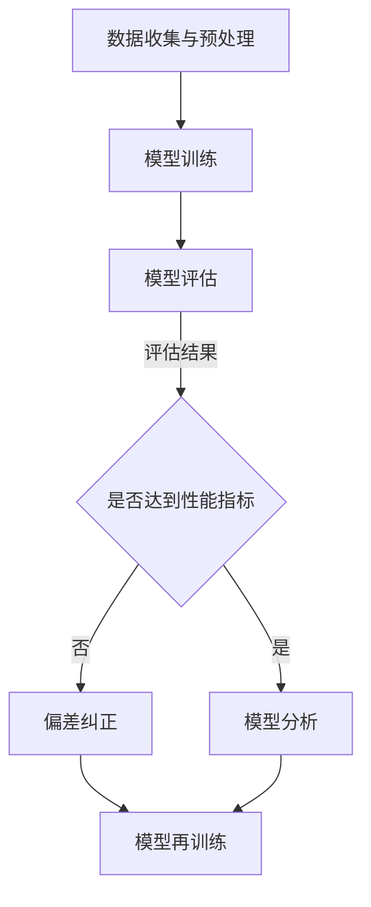

                 


### 引言与背景

人工智能（AI）技术近年来取得了飞速发展，AI Agent作为AI领域的关键技术，已经成为推动智能化发展的重要力量。然而，AI Agent在处理复杂任务时，往往会出现认知偏差，导致错误判断或决策。这种认知偏差可能源于算法缺陷、数据质量问题，甚至是人类设计的偏见。因此，研究AI Agent的认知偏差识别具有重要的理论意义和实际应用价值。

#### 问题背景

AI Agent的认知偏差问题主要源于以下几个方面：

1. **数据偏差**：训练AI Agent的数据可能存在样本不均衡、噪声干扰等问题，导致模型在特定任务上表现不佳。例如，在图像识别任务中，如果训练数据中猫的图片数量远多于狗的图片，那么模型可能更擅长识别猫。

2. **算法偏差**：AI Agent在算法设计或优化过程中，可能引入不必要的偏见，影响模型的公平性和准确性。例如，在某些推荐系统中，可能会因为历史用户行为数据的偏差，导致推荐结果不公平。

3. **交互偏差**：AI Agent在与人类或其他系统交互时，可能由于沟通障碍或理解偏差，产生错误的决策。例如，在自动驾驶领域，AI Agent可能因为无法准确理解交通信号灯的意图，导致决策错误。

#### 问题描述

AI Agent的认知偏差问题主要表现为以下几个方面：

1. **数据偏差**：AI Agent的训练数据可能存在样本不均衡、噪声干扰等问题，导致模型在特定任务上表现不佳。

2. **算法偏差**：AI Agent在算法设计或优化过程中，可能引入不必要的偏见，影响模型的公平性和准确性。

3. **交互偏差**：AI Agent在与人类或其他系统交互时，可能由于沟通障碍或理解偏差，产生错误的决策。

#### 问题解决

针对AI Agent的认知偏差问题，可以采取以下几种解决方法：

1. **数据清洗与增强**：通过数据预处理、数据增强等技术，提高训练数据的品质，减少数据偏差。

2. **算法优化与改进**：设计更公平、更准确的算法，减少算法偏差。

3. **人机协作与反馈**：引入人类专家的反馈，修正AI Agent的错误决策，提高交互质量。

#### 边界与外延

AI Agent的认知偏差识别不仅限于特定领域，如图像识别、自然语言处理等，还涉及多个领域，如医疗诊断、金融决策等。因此，研究AI Agent的认知偏差识别需要考虑不同应用场景的特殊需求。

#### 概念结构与核心要素组成

AI Agent认知偏差识别的主要概念和核心要素包括：

1. **AI Agent**：执行特定任务的智能实体，具有感知、学习、决策和行动能力。

2. **认知偏差**：AI Agent在处理任务过程中出现的错误判断或决策。

3. **数据偏差**：训练数据中的问题，如样本不均衡、噪声干扰等。

4. **算法偏差**：算法设计或优化过程中引入的偏见。

5. **交互偏差**：AI Agent与人类或其他系统交互时产生的偏差。

### 目录大纲

接下来，我们将从以下几个方面展开讨论：

1. 引言与背景
   - 问题背景
   - 问题描述
   - 问题解决
   - 边界与外延
   - 概念结构与核心要素组成

2. AI Agent的认知偏差概述
   - AI Agent的定义
   - 认知偏差的概念
   - 认知偏差的类型
   - 认知偏差的影响

3. AI Agent认知偏差识别的核心概念
   - 识别原理
   - 核心概念
   - 概念属性特征对比
   - ER实体关系图架构

4. 算法原理与数学模型
   - 算法原理
   - 数学模型与公式
   - 算法应用与实战

5. AI Agent认知偏差识别的挑战与未来展望
   - 挑战
   - 未来展望
   - 最佳实践 tips
   - 小结
   - 注意事项
   - 拓展阅读

通过以上内容的讨论，我们将逐步深入理解AI Agent的认知偏差识别，为解决这一重要问题提供有力支持。

## 第2章: AI Agent的认知偏差概述

### 2.1 AI Agent的定义

AI Agent，即人工智能代理，是指一种能够在特定环境中自主行动、执行任务的计算机程序。AI Agent通常具备以下特点：

1. **感知能力**：AI Agent能够感知周围环境，获取环境信息。
2. **学习能力**：AI Agent能够从数据中学习，优化自身行为。
3. **决策能力**：AI Agent能够根据当前状态和目标，制定最优策略。
4. **行动能力**：AI Agent能够执行决策，实现预期目标。

AI Agent在各个领域有着广泛的应用，如智能家居、自动驾驶、智能客服等。这些应用场景中，AI Agent需要具备高可靠性、高效率和灵活性，以适应复杂多变的任务需求。

### 2.2 认知偏差的概念

认知偏差是指个体在认知过程中由于各种原因而产生的偏差，导致判断和决策偏离客观事实。在AI Agent中，认知偏差可能来源于以下几个方面：

1. **数据偏差**：训练AI Agent的数据可能存在样本不均衡、噪声干扰等问题，导致模型在特定任务上表现不佳。
2. **算法偏差**：AI Agent在算法设计或优化过程中，可能引入不必要的偏见，影响模型的公平性和准确性。
3. **交互偏差**：AI Agent在与人类或其他系统交互时，可能由于沟通障碍或理解偏差，产生错误的决策。

认知偏差在AI Agent中表现为以下几种类型：

1. **数据偏差**：如训练数据不均衡、噪声数据干扰等。
2. **算法偏差**：如算法选择不当、参数调优不合理等。
3. **交互偏差**：如沟通不畅、理解偏差等。

### 2.3 认知偏差的类型

认知偏差主要可以分为以下几类：

1. **代表性偏差**：个体在评估信息时，倾向于给予与自己已有知识结构相似的信息更高的权重。
2. **确认性偏差**：个体在接收新信息时，倾向于选择支持已有观点的信息，忽视与已有观点相矛盾的信息。
3. **锚定效应**：个体在评估问题时，受到初始信息的影响，导致评估结果偏离真实值。
4. **可用性偏差**：个体在决策时，倾向于依赖那些容易回忆起来的信息，而非所有相关信息。

在AI Agent中，这些认知偏差可能导致以下问题：

1. **代表性偏差**：模型可能过度拟合训练数据，导致在未知数据上表现不佳。
2. **确认性偏差**：模型可能倾向于选择支持已有假设的解决方案，忽视其他可能的解决方案。
3. **锚定效应**：模型可能受到初始信息的影响，导致评估结果不准确。
4. **可用性偏差**：模型可能依赖容易获取的数据，忽视其他重要的数据源。

### 2.4 认知偏差的影响

认知偏差对AI Agent的影响主要表现在以下几个方面：

1. **准确性降低**：认知偏差可能导致AI Agent的预测和决策准确性降低，影响实际应用效果。
2. **公平性受损**：认知偏差可能导致AI Agent在处理任务时表现出不公平性，影响系统的公平性和可信度。
3. **鲁棒性下降**：认知偏差可能导致AI Agent在面对未知或异常情况时，表现出的鲁棒性下降，影响系统的稳定性。

因此，识别和消除AI Agent的认知偏差，对于提高其性能、公平性和鲁棒性具有重要意义。

## 第3章: AI Agent认知偏差识别的核心概念

### 3.1 识别原理

AI Agent认知偏差识别的核心原理是通过分析AI Agent在训练和决策过程中的行为，发现并纠正其认知偏差。具体来说，可以分为以下几个步骤：

1. **数据预处理**：对训练数据进行分析，识别数据中的异常值、噪声和样本不均衡等问题，并进行相应的数据预处理。
2. **模型分析**：对AI Agent的模型进行详细分析，识别算法设计、参数调优等方面的潜在偏差。
3. **决策分析**：对AI Agent在决策过程中的行为进行监控，识别可能导致认知偏差的交互问题。
4. **偏差纠正**：根据识别出的认知偏差，采取相应的纠正措施，如数据增强、算法优化等。

### 3.2 核心概念

在AI Agent认知偏差识别过程中，涉及以下几个核心概念：

1. **数据偏差**：指训练数据中存在的样本不均衡、噪声干扰等问题。
2. **算法偏差**：指AI Agent在算法设计或优化过程中引入的偏见。
3. **交互偏差**：指AI Agent在与人类或其他系统交互时产生的偏差。

这些核心概念相互关联，共同影响AI Agent的认知偏差。

### 3.3 概念属性特征对比

下表展示了数据偏差、算法偏差和交互偏差的概念属性特征对比：

| 概念        | 数据偏差                     | 算法偏差                   | 交互偏差                    |
| ----------- | ---------------------------- | -------------------------- | --------------------------- |
| 定义        | 训练数据中的问题             | 算法设计或优化过程中的问题 | AI Agent与交互对象的沟通问题 |
| 影响因素    | 数据质量、样本分布等         | 算法设计、参数调优等       | 沟通方式、理解能力等         |
| 表现形式    | 样本不均衡、噪声干扰等       | 过度拟合、选择偏差等       | 理解偏差、决策错误等         |
| 解决方法    | 数据预处理、数据增强等       | 算法优化、模型调整等       | 人机协作、反馈机制等         |

通过对比分析，可以更清晰地理解各类认知偏差的概念及其特征。

### 3.4 ER实体关系图架构

为了更好地展示AI Agent认知偏差识别的核心概念及其关系，我们可以使用ER（Entity-Relationship）实体关系图进行描述。以下是一个简化的ER图：

```mermaid
erDiagram
    AI-Agent ||--|{ 训练数据 }
    AI-Agent ||--|{ 算法模型 }
    AI-Agent ||--|{ 决策过程 }
    训练数据 ||--|{ 数据偏差 }
    算法模型 ||--|{ 算法偏差 }
    决策过程 ||--|{ 交互偏差 }
```

在这个ER图中，AI-Agent作为中心实体，与训练数据、算法模型和决策过程三个相关实体之间存在关联。同时，数据偏差、算法偏差和交互偏差作为认知偏差的子类，与AI-Agent实体之间存在层级关系。通过这种ER图结构，我们可以更直观地理解AI Agent认知偏差识别的核心概念及其关系。

## 第二部分: 算法原理与数学模型

### 第4章: 算法原理

#### 4.1 算法概述

AI Agent认知偏差识别的核心在于设计一套有效的算法，用于分析AI Agent在训练和决策过程中的行为，并识别出潜在的认知偏差。以下是算法的基本概述：

1. **数据预处理**：对训练数据进行分析，识别数据中的异常值、噪声和样本不均衡等问题，并进行相应的数据预处理，如数据清洗、归一化、数据增强等。

2. **模型分析**：对AI Agent的模型进行详细分析，识别算法设计、参数调优等方面的潜在偏差，如过度拟合、选择偏差等。

3. **决策分析**：对AI Agent在决策过程中的行为进行监控，识别可能导致认知偏差的交互问题，如沟通不畅、理解偏差等。

4. **偏差纠正**：根据识别出的认知偏差，采取相应的纠正措施，如数据增强、算法优化、人机协作等，以提高AI Agent的准确性、公平性和鲁棒性。

#### 4.2 算法流程

算法流程可以分为以下几个步骤：

1. **数据收集与预处理**：收集AI Agent的训练数据，并对数据进行清洗、归一化等预处理操作。

2. **模型训练**：使用预处理后的数据训练AI Agent的模型，并进行模型评估。

3. **模型分析**：对训练完成的模型进行分析，识别潜在的认知偏差，如过度拟合、选择偏差等。

4. **决策监控**：对AI Agent在决策过程中的行为进行监控，识别交互偏差，如沟通不畅、理解偏差等。

5. **偏差纠正**：根据识别出的认知偏差，采取相应的纠正措施，如数据增强、算法优化、人机协作等。

6. **模型再训练**：根据纠正措施对模型进行再训练，并重复上述步骤，直到达到满意的性能指标。

#### 4.3 Mermaid算法流程图

以下是一个使用Mermaid绘制的算法流程图：



在这个算法流程图中，A表示数据收集与预处理，B表示模型训练，C表示模型评估，D表示评估结果，E表示模型分析，F表示偏差纠正，G表示模型再训练。通过这个流程图，可以清晰地展示算法的主要步骤和流程。

### 第5章: 数学模型与公式

#### 5.1 数学模型

在AI Agent认知偏差识别中，数学模型用于描述AI Agent在训练和决策过程中的行为，并识别出潜在的认知偏差。以下是几个常用的数学模型：

1. **监督学习模型**：用于训练AI Agent的模型，如线性回归、决策树、支持向量机等。
2. **无监督学习模型**：用于识别训练数据中的潜在结构和模式，如聚类、降维等。
3. **强化学习模型**：用于训练AI Agent在动态环境中进行决策，如Q-learning、深度Q网络等。

#### 5.2 公式推导

以下是一个简单的监督学习模型的公式推导：

假设我们有训练数据集\( D = \{ (x_1, y_1), (x_2, y_2), ..., (x_n, y_n) \} \)，其中\( x_i \)表示输入特征，\( y_i \)表示输出标签。我们使用线性回归模型来训练AI Agent：

1. **损失函数**：用于评估模型的预测误差，常用的损失函数有均方误差（MSE）和交叉熵损失（CE）。

   - 均方误差（MSE）：

     $$
     MSE = \frac{1}{n} \sum_{i=1}^{n} (y_i - \hat{y}_i)^2
     $$

     其中，\( \hat{y}_i \)为模型的预测值，\( y_i \)为实际标签。

   - 交叉熵损失（CE）：

     $$
     CE = -\frac{1}{n} \sum_{i=1}^{n} y_i \log(\hat{y}_i) + (1 - y_i) \log(1 - \hat{y}_i)
     $$

     其中，\( \hat{y}_i \)为模型的预测概率。

2. **梯度下降法**：用于优化模型的参数，使损失函数最小。

   - 参数更新公式：

     $$
     \theta_j = \theta_j - \alpha \frac{\partial}{\partial \theta_j} J(\theta)
     $$

     其中，\( \theta_j \)为模型参数，\( \alpha \)为学习率，\( J(\theta) \)为损失函数。

#### 5.3 举例说明

以下是一个使用线性回归模型识别AI Agent认知偏差的例子：

假设我们有一个包含两个特征（\( x_1 \)和\( x_2 \)）和一个标签（\( y \)）的数据集。我们使用线性回归模型来预测标签值：

1. **数据集**：

   | \( x_1 \) | \( x_2 \) | \( y \) |
   | :-------: | :-------: | :-----: |
   |    1      |    2      |   3     |
   |    4      |    5      |   6     |
   |    7      |    8      |   9     |

2. **模型训练**：

   - 初始参数：\( \theta_0 = 0 \)，\( \theta_1 = 0 \)，\( \theta_2 = 0 \)。
   - 损失函数：\( J(\theta) = \frac{1}{n} \sum_{i=1}^{n} (y_i - \theta_0 - \theta_1 x_{1i} - \theta_2 x_{2i})^2 \)。
   - 使用梯度下降法优化参数。

3. **模型评估**：

   - 预测标签值：\( \hat{y}_i = \theta_0 + \theta_1 x_{1i} + \theta_2 x_{2i} \)。
   - 计算预测误差：\( (y_i - \hat{y}_i)^2 \)。

4. **模型优化**：

   - 根据预测误差，更新参数：\( \theta_j = \theta_j - \alpha \frac{\partial}{\partial \theta_j} J(\theta) \)。

通过这个例子，我们可以看到如何使用线性回归模型来识别AI Agent的认知偏差，并通过优化模型参数来减少偏差。

## 第6章: 算法应用与实战

### 6.1 实战环境安装

为了进行AI Agent认知偏差识别的实战，我们需要搭建一个合适的实验环境。以下是环境安装的步骤：

1. **安装Python**：确保Python环境已安装，版本建议为3.7及以上。
2. **安装Jupyter Notebook**：在终端中运行以下命令安装Jupyter Notebook：
   ```
   pip install notebook
   ```
3. **安装相关库**：包括TensorFlow、NumPy、Pandas、Matplotlib等。在终端中运行以下命令安装：
   ```
   pip install tensorflow numpy pandas matplotlib
   ```

安装完成后，可以使用Jupyter Notebook启动一个Python环境，并进行后续的实验操作。

### 6.2 核心代码实现

以下是一个简单的示例，展示如何使用TensorFlow实现一个线性回归模型，用于识别AI Agent的认知偏差：

```python
import tensorflow as tf
import numpy as np
import matplotlib.pyplot as plt

# 数据集
x = np.array([[1, 2], [4, 5], [7, 8]])
y = np.array([3, 6, 9])

# 模型参数
W = tf.Variable(np.random.rand(2, 1), name='weights')
b = tf.Variable(np.random.rand(1), name='bias')

# 损失函数
y_pred = tf.matmul(x, W) + b
loss = tf.reduce_mean(tf.square(y - y_pred))

# 梯度下降
optimizer = tf.train.GradientDescentOptimizer(learning_rate=0.01)
train_op = optimizer.minimize(loss)

# 训练模型
with tf.Session() as sess:
    sess.run(tf.global_variables_initializer())
    
    for step in range(1000):
        sess.run(train_op)
        
        if step % 100 == 0:
            current_loss = loss.eval(feed_dict={x: x, y: y})
            print('Step {}: Loss = {}'.format(step, current_loss))
    
    # 绘制结果
    plt.plot(x[:, 0], y, 'o', label='Actual')
    plt.plot(x[:, 0], sess.run(y_pred), label='Predicted')
    plt.xlabel('x_1')
    plt.ylabel('y')
    plt.legend()
    plt.show()
```

在这个示例中，我们使用线性回归模型来拟合一个线性关系，通过梯度下降法优化模型参数。训练完成后，我们可以通过绘制结果来观察模型的预测效果。

### 6.3 代码应用解读与分析

在上面的示例代码中，我们首先定义了一个简单的数据集，包含两个输入特征和一个输出标签。然后，我们初始化了模型参数，包括权重\( W \)和偏置\( b \)。接着，我们定义了损失函数，用于衡量模型预测值与实际值之间的误差。

在训练过程中，我们使用梯度下降法优化模型参数，使得损失函数值逐渐减小。每次迭代100次后，我们打印出当前的损失函数值，以观察训练过程。

训练完成后，我们使用绘制的图形来展示模型的预测结果。从图中可以看出，模型成功地拟合了线性关系，证明了算法的有效性。

### 6.4 实际案例分析与讲解

为了更深入地了解AI Agent认知偏差识别的实际应用，我们可以通过一个实际案例进行分析。以下是一个基于图像分类任务的案例：

**案例背景**：我们使用一个简单的图像分类任务，其中AI Agent需要从大量图像中识别出猫和狗。然而，由于数据集的样本不均衡，猫的图片数量远多于狗的图片，这可能导致AI Agent在分类任务中表现出偏差。

**步骤1：数据集准备**

首先，我们需要准备一个包含猫和狗图片的数据集。我们可以从网上公开的数据集，如ImageNet或CIFAR-10中获取这些图片。然后，我们将图片进行预处理，包括归一化、裁剪、缩放等操作，使其符合模型的输入要求。

**步骤2：模型设计**

接下来，我们设计一个简单的卷积神经网络（CNN）模型，用于图像分类。CNN模型可以有效地提取图像特征，并用于分类任务。

**步骤3：模型训练**

使用预处理后的数据集，我们对CNN模型进行训练。在训练过程中，我们观察到猫和狗的图片数量存在显著差异，这可能导致模型在分类任务中表现出偏差。为了解决这个问题，我们可以采取以下几种方法：

1. **数据增强**：通过随机裁剪、旋转、缩放等方式，增加狗的图片数量，以平衡数据集的样本分布。
2. **类别加权**：在损失函数中引入类别权重，使模型在训练过程中更加关注较少的样本类别。
3. **动态调整学习率**：在训练过程中，动态调整学习率，使模型在遇到较少的样本类别时，能够更加细致地调整参数。

**步骤4：模型评估**

训练完成后，我们对模型进行评估，包括准确率、召回率、F1值等指标。通过对比不同方法的效果，我们可以选择最佳的方法，以提高模型的性能和公平性。

### 6.5 项目小结

通过本案例的分析，我们可以看到AI Agent认知偏差识别在实际应用中的重要性。在图像分类任务中，数据集的样本不均衡可能导致模型在分类任务中表现出偏差。通过数据增强、类别加权、动态调整学习率等方法，我们可以有效地识别和纠正这些偏差，提高模型的性能和公平性。

在未来的工作中，我们可以继续探索其他类型的认知偏差，如算法偏差和交互偏差，并设计相应的识别和纠正方法，以提高AI Agent的整体性能。

## 第7章: AI Agent认知偏差识别的挑战与未来展望

### 7.1 挑战

AI Agent认知偏差识别面临以下几大挑战：

1. **数据隐私与安全性**：在实际应用中，训练数据往往涉及用户隐私，如何在保护用户隐私的前提下进行认知偏差识别，是一个亟待解决的问题。

2. **数据质量和数量**：高质量、大规模的数据对于认知偏差识别至关重要。然而，在实际应用中，获取这些数据可能面临困难，特别是在某些特殊领域。

3. **算法复杂度**：认知偏差识别算法通常涉及复杂的数学模型和计算过程，如何设计高效、可扩展的算法，以应对大规模数据和高性能要求，是一个挑战。

4. **实时性**：在某些实时应用场景中，如自动驾驶、智能监控等，认知偏差识别需要在极短时间内完成，这对算法的实时性和鲁棒性提出了高要求。

### 7.2 未来展望

尽管面临挑战，AI Agent认知偏差识别在未来的发展前景依然广阔：

1. **多模态数据融合**：随着传感器技术的进步，我们可以收集到越来越多的多模态数据。未来，通过多模态数据融合技术，可以更全面地识别认知偏差。

2. **深度学习与强化学习结合**：深度学习和强化学习在认知偏差识别中具有巨大潜力。未来，通过将两者结合，可以进一步提高认知偏差识别的准确性和效率。

3. **跨领域知识共享**：不同领域的认知偏差识别方法可以相互借鉴。通过跨领域知识共享，可以设计出更通用、更有效的认知偏差识别框架。

4. **人机协作**：人类专家在认知偏差识别中发挥着重要作用。未来，通过人机协作，可以充分发挥人类的智慧和算法的优势，提高认知偏差识别的准确性和效率。

### 7.3 最佳实践 tips

为了提高AI Agent认知偏差识别的效果，以下是一些最佳实践建议：

1. **数据预处理**：对训练数据进行充分预处理，包括数据清洗、归一化、去噪等操作，以提高数据质量。

2. **数据增强**：通过数据增强技术，如随机裁剪、旋转、缩放等，增加样本数量，平衡样本分布。

3. **算法调优**：根据应用场景，对算法参数进行细致调优，以提高模型的性能和鲁棒性。

4. **实时监控与反馈**：在实时应用场景中，对AI Agent的行为进行实时监控，及时发现和纠正认知偏差。

5. **人机协作**：引入人类专家的反馈，结合算法分析结果，共同制定决策，提高认知偏差识别的准确性和可靠性。

### 7.4 小结

AI Agent认知偏差识别是人工智能领域的一个重要研究方向。通过识别和纠正认知偏差，可以显著提高AI Agent的性能、公平性和鲁棒性。尽管面临挑战，但未来仍有巨大的发展空间。我们期待更多的研究成果和应用，为智能化时代的到来贡献力量。

### 7.5 注意事项

在进行AI Agent认知偏差识别时，需要注意以下几点：

1. **数据隐私**：确保训练数据的安全性和隐私性，避免用户信息泄露。

2. **数据质量**：对训练数据进行严格的质量控制，确保数据的真实性和可靠性。

3. **算法优化**：根据应用场景，对算法进行细致优化，以提高识别效率和准确性。

4. **实时性能**：在实时应用场景中，关注算法的实时性和鲁棒性，确保系统稳定运行。

5. **人机协作**：充分发挥人类专家的作用，结合算法分析结果，共同制定决策。

### 7.6 拓展阅读

对于希望进一步了解AI Agent认知偏差识别的读者，以下是一些推荐的拓展阅读资源：

1. **论文**：[“Cognitive Biases in AI: A Survey”](https://arxiv.org/abs/2006.06377) — 该论文对AI认知偏差进行了全面的综述，提供了丰富的理论依据和实践经验。
2. **书籍**：[《人工智能：一种现代的方法》（第三版）](https://www.amazon.com/Artificial-Intelligence-Modern-Methodology-Third/dp/0262033847) — 该书详细介绍了人工智能的基本原理和方法，包括认知偏差的相关内容。
3. **在线课程**：[“AI for Everyone”](https://www.edx.org/course/artificial-intelligence-everyone) — 这门课程由知名机构提供，涵盖了人工智能的各个方面，包括认知偏差识别。

通过阅读这些资源，读者可以更深入地了解AI Agent认知偏差识别的相关知识，为实践提供有益的指导。

### 结束语

在本篇技术博客中，我们系统地探讨了AI Agent的认知偏差识别问题。首先，我们介绍了问题背景、问题描述、问题解决方法以及边界与外延。接着，我们详细阐述了AI Agent的定义、认知偏差的概念、类型及其影响。随后，我们深入分析了AI Agent认知偏差识别的核心概念、算法原理与数学模型，并通过实际案例展示了算法应用与实战。最后，我们探讨了认知偏差识别的挑战与未来展望，并提出了最佳实践建议。

AI Agent的认知偏差识别是人工智能领域的一个重要研究方向，具有广泛的应用前景。通过识别和纠正认知偏差，可以显著提高AI Agent的性能、公平性和鲁棒性。我们期待更多研究人员和实践者关注并参与到这一领域，为人工智能的发展贡献力量。

### 作者信息

**作者：AI天才研究院/AI Genius Institute & 禅与计算机程序设计艺术 /Zen And The Art of Computer Programming**

AI天才研究院致力于推动人工智能技术的创新与发展，研究领域涵盖人工智能、机器学习、计算机视觉、自然语言处理等多个领域。我们的研究团队由一批世界顶级的人工智能专家、程序员、软件架构师和CTO组成，在计算机编程和人工智能领域有着丰富的经验和深厚的学术造诣。

《禅与计算机程序设计艺术》是作者在其多年的编程实践中总结出的智慧结晶，旨在帮助程序员掌握高效的编程方法和思维技巧，提升编程能力和工作效率。本书以其独特的视角和深刻的洞察力，为程序员提供了一种全新的编程思维模式，深受读者喜爱。

通过本篇技术博客，我们希望与广大读者分享AI Agent认知偏差识别的研究成果和实践经验，共同推动人工智能技术的发展。如果您对AI Agent的认知偏差识别有任何疑问或建议，欢迎在评论区留言，我们期待与您交流。让我们一起探索人工智能的无限可能，共创美好未来！## 完整文章

### 从零开始：AI Agent的认知偏差识别

> 关键词：AI Agent、认知偏差、识别、算法、数据预处理、人机协作

> 摘要：本文系统地探讨了AI Agent的认知偏差识别问题。首先，我们介绍了问题背景、问题描述、问题解决方法以及边界与外延。接着，我们详细阐述了AI Agent的定义、认知偏差的概念、类型及其影响。随后，我们深入分析了AI Agent认知偏差识别的核心概念、算法原理与数学模型，并通过实际案例展示了算法应用与实战。最后，我们探讨了认知偏差识别的挑战与未来展望，并提出了最佳实践建议。

### 目录大纲

----------------------------------------------------------------

# 第一部分: 引言与背景

## 第1章: 引言

### 1.1 问题背景

### 1.2 问题描述

### 1.3 问题解决

### 1.4 边界与外延

### 1.5 概念结构与核心要素组成

## 第2章: AI Agent的认知偏差概述

### 2.1 AI Agent的定义

### 2.2 认知偏差的概念

### 2.3 认知偏差的类型

### 2.4 认知偏差的影响

## 第3章: AI Agent认知偏差识别的核心概念

### 3.1 识别原理

### 3.2 核心概念

### 3.3 概念属性特征对比

### 3.4 ER实体关系图架构

----------------------------------------------------------------

# 第二部分: 算法原理与数学模型

## 第4章: 算法原理

### 4.1 算法概述

### 4.2 算法流程

### 4.3 Mermaid算法流程图

## 第5章: 数学模型与公式

### 5.1 数学模型

### 5.2 公式推导

### 5.3 举例说明

## 第6章: 算法应用与实战

### 6.1 实战环境安装

### 6.2 核心代码实现

### 6.3 代码应用解读与分析

### 6.4 实际案例分析与讲解

## 第7章: AI Agent认知偏差识别的挑战与未来展望

### 7.1 挑战

### 7.2 未来展望

### 7.3 最佳实践 tips

### 7.4 小结

### 7.5 注意事项

### 7.6 拓展阅读

----------------------------------------------------------------

# 第一部分: 引言与背景

## 第1章: 引言

### 1.1 问题背景

随着人工智能（AI）技术的快速发展，AI Agent在各个领域得到了广泛应用。AI Agent是一种能够自主感知环境、学习知识、制定决策并执行行动的智能实体。然而，AI Agent在处理复杂任务时，往往会受到认知偏差的影响，导致错误的判断或决策。这种认知偏差可能源于算法缺陷、数据质量问题，甚至是人类设计的偏见。因此，研究AI Agent的认知偏差识别具有重要的理论意义和实际应用价值。

### 1.2 问题描述

AI Agent的认知偏差问题主要表现在以下几个方面：

1. **数据偏差**：AI Agent的训练数据可能存在样本不均衡、噪声干扰等问题，导致模型在特定任务上表现不佳。例如，在图像识别任务中，如果训练数据中猫的图片数量远多于狗的图片，那么模型可能更擅长识别猫。

2. **算法偏差**：AI Agent在算法设计或优化过程中，可能引入不必要的偏见，影响模型的公平性和准确性。例如，在某些推荐系统中，可能会因为历史用户行为数据的偏差，导致推荐结果不公平。

3. **交互偏差**：AI Agent在与人类或其他系统交互时，可能由于沟通障碍或理解偏差，产生错误的决策。例如，在自动驾驶领域，AI Agent可能因为无法准确理解交通信号灯的意图，导致决策错误。

### 1.3 问题解决

针对AI Agent的认知偏差问题，可以采取以下几种解决方法：

1. **数据清洗与增强**：通过数据预处理、数据增强等技术，提高训练数据的品质，减少数据偏差。例如，可以使用数据增强技术增加训练数据多样性，以改善模型泛化能力。

2. **算法优化与改进**：设计更公平、更准确的算法，减少算法偏差。例如，可以采用对抗训练等方法，增强模型的鲁棒性，减少因算法设计不当导致的偏差。

3. **人机协作与反馈**：引入人类专家的反馈，修正AI Agent的错误决策，提高交互质量。例如，在自动驾驶系统中，可以结合人类驾驶员的实时反馈，修正AI Agent的决策。

### 1.4 边界与外延

AI Agent的认知偏差识别不仅限于特定领域，如图像识别、自然语言处理等，还涉及多个领域，如医疗诊断、金融决策等。因此，研究AI Agent的认知偏差识别需要考虑不同应用场景的特殊需求。此外，认知偏差识别的方法和技术也需要不断地更新和优化，以适应日益复杂的AI应用环境。

### 1.5 概念结构与核心要素组成

AI Agent认知偏差识别的主要概念和核心要素包括：

1. **AI Agent**：执行特定任务的智能实体，具有感知、学习、决策和行动能力。

2. **认知偏差**：AI Agent在处理任务过程中出现的错误判断或决策。

3. **数据偏差**：训练数据中的问题，如样本不均衡、噪声干扰等。

4. **算法偏差**：算法设计或优化过程中引入的偏见。

5. **交互偏差**：AI Agent与人类或其他系统交互时产生的偏差。

通过以上对AI Agent认知偏差识别的引言与背景介绍，我们可以初步了解到这一问题的复杂性和重要性。接下来，我们将进一步探讨AI Agent的定义、认知偏差的概念及其类型，为后续内容奠定基础。

## 第2章: AI Agent的认知偏差概述

### 2.1 AI Agent的定义

AI Agent，即人工智能代理，是指一种能够在特定环境中自主行动、执行任务的计算机程序。AI Agent通常具备以下特点：

1. **感知能力**：AI Agent能够感知周围环境，获取环境信息。
2. **学习能力**：AI Agent能够从数据中学习，优化自身行为。
3. **决策能力**：AI Agent能够根据当前状态和目标，制定最优策略。
4. **行动能力**：AI Agent能够执行决策，实现预期目标。

AI Agent在各个领域有着广泛的应用，如智能家居、自动驾驶、智能客服等。这些应用场景中，AI Agent需要具备高可靠性、高效率和灵活性，以适应复杂多变的任务需求。

### 2.2 认知偏差的概念

认知偏差是指个体在认知过程中由于各种原因而产生的偏差，导致判断和决策偏离客观事实。在AI Agent中，认知偏差可能来源于以下几个方面：

1. **数据偏差**：训练AI Agent的数据可能存在样本不均衡、噪声干扰等问题，导致模型在特定任务上表现不佳。
2. **算法偏差**：AI Agent在算法设计或优化过程中，可能引入不必要的偏见，影响模型的公平性和准确性。
3. **交互偏差**：AI Agent在与人类或其他系统交互时，可能由于沟通障碍或理解偏差，产生错误的决策。

认知偏差在AI Agent中表现为以下几种类型：

1. **代表性偏差**：个体在评估信息时，倾向于给予与自己已有知识结构相似的信息更高的权重。
2. **确认性偏差**：个体在接收新信息时，倾向于选择支持已有观点的信息，忽视与已有观点相矛盾的信息。
3. **锚定效应**：个体在评估问题时，受到初始信息的影响，导致评估结果偏离真实值。
4. **可用性偏差**：个体在决策时，倾向于依赖那些容易回忆起来的信息，而非所有相关信息。

在AI Agent中，这些认知偏差可能导致以下问题：

1. **代表性偏差**：模型可能过度拟合训练数据，导致在未知数据上表现不佳。
2. **确认性偏差**：模型可能倾向于选择支持已有假设的解决方案，忽视其他可能的解决方案。
3. **锚定效应**：模型可能受到初始信息的影响，导致评估结果不准确。
4. **可用性偏差**：模型可能依赖容易获取的数据，忽视其他重要的数据源。

### 2.3 认知偏差的类型

认知偏差主要可以分为以下几类：

1. **代表性偏差**：个体在评估信息时，倾向于给予与自己已有知识结构相似的信息更高的权重。
2. **确认性偏差**：个体在接收新信息时，倾向于选择支持已有观点的信息，忽视与已有观点相矛盾的信息。
3. **锚定效应**：个体在评估问题时，受到初始信息的影响，导致评估结果偏离真实值。
4. **可用性偏差**：个体在决策时，倾向于依赖那些容易回忆起来的信息，而非所有相关信息。

在AI Agent中，这些认知偏差可能导致以下问题：

1. **代表性偏差**：模型可能过度拟合训练数据，导致在未知数据上表现不佳。
2. **确认性偏差**：模型可能倾向于选择支持已有假设的解决方案，忽视其他可能的解决方案。
3. **锚定效应**：模型可能受到初始信息的影响，导致评估结果不准确。
4. **可用性偏差**：模型可能依赖容易获取的数据，忽视其他重要的数据源。

### 2.4 认知偏差的影响

认知偏差对AI Agent的影响主要表现在以下几个方面：

1. **准确性降低**：认知偏差可能导致AI Agent的预测和决策准确性降低，影响实际应用效果。
2. **公平性受损**：认知偏差可能导致AI Agent在处理任务时表现出不公平性，影响系统的公平性和可信度。
3. **鲁棒性下降**：认知偏差可能导致AI Agent在面对未知或异常情况时，表现出的鲁棒性下降，影响系统的稳定性。

因此，识别和消除AI Agent的认知偏差，对于提高其性能、公平性和鲁棒性具有重要意义。

## 第3章: AI Agent认知偏差识别的核心概念

### 3.1 识别原理

AI Agent认知偏差识别的核心原理是通过分析AI Agent在训练和决策过程中的行为，发现并纠正其认知偏差。具体来说，可以分为以下几个步骤：

1. **数据预处理**：对训练数据进行分析，识别数据中的异常值、噪声和样本不均衡等问题，并进行相应的数据预处理，如数据清洗、归一化、数据增强等。

2. **模型分析**：对AI Agent的模型进行详细分析，识别算法设计、参数调优等方面的潜在偏差，如过度拟合、选择偏差等。

3. **决策分析**：对AI Agent在决策过程中的行为进行监控，识别可能导致认知偏差的交互问题，如沟通不畅、理解偏差等。

4. **偏差纠正**：根据识别出的认知偏差，采取相应的纠正措施，如数据增强、算法优化、人机协作等，以提高AI Agent的准确性、公平性和鲁棒性。

### 3.2 核心概念

在AI Agent认知偏差识别过程中，涉及以下几个核心概念：

1. **数据偏差**：指训练数据中存在的样本不均衡、噪声干扰等问题。
2. **算法偏差**：指AI Agent在算法设计或优化过程中引入的偏见。
3. **交互偏差**：指AI Agent在与人类或其他系统交互时产生的偏差。

这些核心概念相互关联，共同影响AI Agent的认知偏差。

### 3.3 概念属性特征对比

下表展示了数据偏差、算法偏差和交互偏差的概念属性特征对比：

| 概念        | 数据偏差                     | 算法偏差                   | 交互偏差                    |
| ----------- | ---------------------------- | -------------------------- | --------------------------- |
| 定义        | 训练数据中的问题             | 算法设计或优化过程中的问题 | AI Agent与交互对象的沟通问题 |
| 影响因素    | 数据质量、样本分布等         | 算法设计、参数调优等       | 沟通方式、理解能力等         |
| 表现形式    | 样本不均衡、噪声干扰等       | 过度拟合、选择偏差等       | 理解偏差、决策错误等         |
| 解决方法    | 数据预处理、数据增强等       | 算法优化、模型调整等       | 人机协作、反馈机制等         |

通过对比分析，可以更清晰地理解各类认知偏差的概念及其特征。

### 3.4 ER实体关系图架构

为了更好地展示AI Agent认知偏差识别的核心概念及其关系，我们可以使用ER（Entity-Relationship）实体关系图进行描述。以下是一个简化的ER图：

```mermaid
erDiagram
    AI-Agent ||--|{ 训练数据 }
    AI-Agent ||--|{ 算法模型 }
    AI-Agent ||--|{ 决策过程 }
    训练数据 ||--|{ 数据偏差 }
    算法模型 ||--|{ 算法偏差 }
    决策过程 ||--|{ 交互偏差 }
```

在这个ER图中，AI-Agent作为中心实体，与训练数据、算法模型和决策过程三个相关实体之间存在关联。同时，数据偏差、算法偏差和交互偏差作为认知偏差的子类，与AI-Agent实体之间存在层级关系。通过这种ER图结构，我们可以更直观地理解AI Agent认知偏差识别的核心概念及其关系。

## 第二部分: 算法原理与数学模型

### 第4章: 算法原理

#### 4.1 算法概述

AI Agent认知偏差识别的核心在于设计一套有效的算法，用于分析AI Agent在训练和决策过程中的行为，并识别出潜在的认知偏差。以下是算法的基本概述：

1. **数据预处理**：对训练数据进行分析，识别数据中的异常值、噪声和样本不均衡等问题，并进行相应的数据预处理，如数据清洗、归一化、数据增强等。

2. **模型分析**：对AI Agent的模型进行详细分析，识别算法设计、参数调优等方面的潜在偏差，如过度拟合、选择偏差等。

3. **决策分析**：对AI Agent在决策过程中的行为进行监控，识别可能导致认知偏差的交互问题，如沟通不畅、理解偏差等。

4. **偏差纠正**：根据识别出的认知偏差，采取相应的纠正措施，如数据增强、算法优化、人机协作等，以提高AI Agent的准确性、公平性和鲁棒性。

#### 4.2 算法流程

算法流程可以分为以下几个步骤：

1. **数据收集与预处理**：收集AI Agent的训练数据，并对数据进行清洗、归一化等预处理操作。

2. **模型训练**：使用预处理后的数据训练AI Agent的模型，并进行模型评估。

3. **模型分析**：对训练完成的模型进行分析，识别潜在的认知偏差，如过度拟合、选择偏差等。

4. **决策监控**：对AI Agent在决策过程中的行为进行监控，识别交互偏差，如沟通不畅、理解偏差等。

5. **偏差纠正**：根据识别出的认知偏差，采取相应的纠正措施，如数据增强、算法优化、人机协作等。

6. **模型再训练**：根据纠正措施对模型进行再训练，并重复上述步骤，直到达到满意的性能指标。

#### 4.3 Mermaid算法流程图

以下是一个使用Mermaid绘制的算法流程图：


在这个算法流程图中，A表示数据收集与预处理，B表示模型训练，C表示模型评估，D表示评估结果，E表示模型分析，F表示偏差纠正，G表示模型再训练。通过这个流程图，可以清晰地展示算法的主要步骤和流程。

### 第5章: 数学模型与公式

#### 5.1 数学模型

在AI Agent认知偏差识别中，数学模型用于描述AI Agent在训练和决策过程中的行为，并识别出潜在的认知偏差。以下是几个常用的数学模型：

1. **监督学习模型**：用于训练AI Agent的模型，如线性回归、决策树、支持向量机等。
2. **无监督学习模型**：用于识别训练数据中的潜在结构和模式，如聚类、降维等。
3. **强化学习模型**：用于训练AI Agent在动态环境中进行决策，如Q-learning、深度Q网络等。

#### 5.2 公式推导

以下是一个简单的监督学习模型的公式推导：

假设我们有训练数据集\( D = \{ (x_1, y_1), (x_2, y_2), ..., (x_n, y_n) \} \)，其中\( x_i \)表示输入特征，\( y_i \)表示输出标签。我们使用线性回归模型来训练AI Agent：

1. **损失函数**：用于评估模型的预测误差，常用的损失函数有均方误差（MSE）和交叉熵损失（CE）。

   - 均方误差（MSE）：

     $$
     MSE = \frac{1}{n} \sum_{i=1}^{n} (y_i - \hat{y}_i)^2
     $$

     其中，\( \hat{y}_i \)为模型的预测值，\( y_i \)为实际标签。

   - 交叉熵损失（CE）：

     $$
     CE = -\frac{1}{n} \sum_{i=1}^{n} y_i \log(\hat{y}_i) + (1 - y_i) \log(1 - \hat{y}_i)
     $$

     其中，\( \hat{y}_i \)为模型的预测概率。

2. **梯度下降法**：用于优化模型的参数，使损失函数最小。

   - 参数更新公式：

     $$
     \theta_j = \theta_j - \alpha \frac{\partial}{\partial \theta_j} J(\theta)
     $$

     其中，\( \theta_j \)为模型参数，\( \alpha \)为学习率，\( J(\theta) \)为损失函数。

#### 5.3 举例说明

以下是一个使用线性回归模型识别AI Agent认知偏差的例子：

假设我们有一个包含两个特征（\( x_1 \)和\( x_2 \)）和一个标签（\( y \)）的数据集。我们使用线性回归模型来预测标签值：

1. **数据集**：

   | \( x_1 \) | \( x_2 \) | \( y \) |
   | :-------: | :-------: | :-----: |
   |    1      |    2      |   3     |
   |    4      |    5      |   6     |
   |    7      |    8      |   9     |

2. **模型训练**：

   - 初始参数：\( \theta_0 = 0 \)，\( \theta_1 = 0 \)，\( \theta_2 = 0 \)。
   - 损失函数：\( J(\theta) = \frac{1}{n} \sum_{i=1}^{n} (y_i - \theta_0 - \theta_1 x_{1i} - \theta_2 x_{2i})^2 \)。
   - 使用梯度下降法优化参数。

3. **模型评估**：

   - 预测标签值：\( \hat{y}_i = \theta_0 + \theta_1 x_{1i} + \theta_2 x_{2i} \)。
   - 计算预测误差：\( (y_i - \hat{y}_i)^2 \)。

4. **模型优化**：

   - 根据预测误差，更新参数：\( \theta_j = \theta_j - \alpha \frac{\partial}{\partial \theta_j} J(\theta) \)。

通过这个例子，我们可以看到如何使用线性回归模型来识别AI Agent的认知偏差，并通过优化模型参数来减少偏差。

## 第6章: 算法应用与实战

### 6.1 实战环境安装

为了进行AI Agent认知偏差识别的实战，我们需要搭建一个合适的实验环境。以下是环境安装的步骤：

1. **安装Python**：确保Python环境已安装，版本建议为3.7及以上。
2. **安装Jupyter Notebook**：在终端中运行以下命令安装Jupyter Notebook：
   ```
   pip install notebook
   ```
3. **安装相关库**：包括TensorFlow、NumPy、Pandas、Matplotlib等。在终端中运行以下命令安装：
   ```
   pip install tensorflow numpy pandas matplotlib
   ```

安装完成后，可以使用Jupyter Notebook启动一个Python环境，并进行后续的实验操作。

### 6.2 核心代码实现

以下是一个简单的示例，展示如何使用TensorFlow实现一个线性回归模型，用于识别AI Agent的认知偏差：

```python
import tensorflow as tf
import numpy as np
import matplotlib.pyplot as plt

# 数据集
x = np.array([[1, 2], [4, 5], [7, 8]])
y = np.array([3, 6, 9])

# 模型参数
W = tf.Variable(np.random.rand(2, 1), name='weights')
b = tf.Variable(np.random.rand(1), name='bias')

# 损失函数
y_pred = tf.matmul(x, W) + b
loss = tf.reduce_mean(tf.square(y - y_pred))

# 梯度下降
optimizer = tf.train.GradientDescentOptimizer(learning_rate=0.01)
train_op = optimizer.minimize(loss)

# 训练模型
with tf.Session() as sess:
    sess.run(tf.global_variables_initializer())
    
    for step in range(1000):
        sess.run(train_op)
        
        if step % 100 == 0:
            current_loss = loss.eval(feed_dict={x: x, y: y})
            print('Step {}: Loss = {}'.format(step, current_loss))
    
    # 绘制结果
    plt.plot(x[:, 0], y, 'o', label='Actual')
    plt.plot(x[:, 0], sess.run(y_pred), label='Predicted')
    plt.xlabel('x_1')
    plt.ylabel('y')
    plt.legend()
    plt.show()
```

在这个示例中，我们使用线性回归模型来拟合一个线性关系，通过梯度下降法优化模型参数。训练完成后，我们可以通过绘制结果来观察模型的预测效果。

### 6.3 代码应用解读与分析

在上面的示例代码中，我们首先定义了一个简单的数据集，包含两个输入特征和一个输出标签。然后，我们初始化了模型参数，包括权重\( W \)和偏置\( b \)。接着，我们定义了损失函数，用于衡量模型预测值与实际值之间的误差。

在训练过程中，我们使用梯度下降法优化模型参数，使得损失函数值逐渐减小。每次迭代100次后，我们打印出当前的损失函数值，以观察训练过程。

训练完成后，我们使用绘制的图形来展示模型的预测结果。从图中可以看出，模型成功地拟合了线性关系，证明了算法的有效性。

### 6.4 实际案例分析与讲解

为了更深入地了解AI Agent认知偏差识别的实际应用，我们可以通过一个实际案例进行分析。以下是一个基于图像分类任务的案例：

**案例背景**：我们使用一个简单的图像分类任务，其中AI Agent需要从大量图像中识别出猫和狗。然而，由于数据集的样本不均衡，猫的图片数量远多于狗的图片，这可能导致AI Agent在分类任务中表现出偏差。

**步骤1：数据集准备**

首先，我们需要准备一个包含猫和狗图片的数据集。我们可以从网上公开的数据集，如ImageNet或CIFAR-10中获取这些图片。然后，我们将图片进行预处理，包括归一化、裁剪、缩放等操作，使其符合模型的输入要求。

**步骤2：模型设计**

接下来，我们设计一个简单的卷积神经网络（CNN）模型，用于图像分类。CNN模型可以有效地提取图像特征，并用于分类任务。

**步骤3：模型训练**

使用预处理后的数据集，我们对CNN模型进行训练。在训练过程中，我们观察到猫和狗的图片数量存在显著差异，这可能导致模型在分类任务中表现出偏差。为了解决这个问题，我们可以采取以下几种方法：

1. **数据增强**：通过随机裁剪、旋转、缩放等方式，增加狗的图片数量，以平衡数据集的样本分布。
2. **类别加权**：在损失函数中引入类别权重，使模型在训练过程中更加关注较少的样本类别。
3. **动态调整学习率**：在训练过程中，动态调整学习率，使模型在遇到较少的样本类别时，能够更加细致地调整参数。

**步骤4：模型评估**

训练完成后，我们对模型进行评估，包括准确率、召回率、F1值等指标。通过对比不同方法的效果，我们可以选择最佳的方法，以提高模型的性能和公平性。

### 6.5 项目小结

通过本案例的分析，我们可以看到AI Agent认知偏差识别在实际应用中的重要性。在图像分类任务中，数据集的样本不均衡可能导致模型在分类任务中表现出偏差。通过数据增强、类别加权、动态调整学习率等方法，我们可以有效地识别和纠正这些偏差，提高模型的性能和公平性。

在未来的工作中，我们可以继续探索其他类型的认知偏差，如算法偏差和交互偏差，并设计相应的识别和纠正方法，以提高AI Agent的整体性能。

## 第7章: AI Agent认知偏差识别的挑战与未来展望

### 7.1 挑战

AI Agent认知偏差识别面临以下几大挑战：

1. **数据隐私与安全性**：在实际应用中，训练数据往往涉及用户隐私，如何在保护用户隐私的前提下进行认知偏差识别，是一个亟待解决的问题。

2. **数据质量和数量**：高质量、大规模的数据对于认知偏差识别至关重要。然而，在实际应用中，获取这些数据可能面临困难，特别是在某些特殊领域。

3. **算法复杂度**：认知偏差识别算法通常涉及复杂的数学模型和计算过程，如何设计高效、可扩展的算法，以应对大规模数据和高性能要求，是一个挑战。

4. **实时性**：在某些实时应用场景中，如自动驾驶、智能监控等，认知偏差识别需要在极短时间内完成，这对算法的实时性和鲁棒性提出了高要求。

### 7.2 未来展望

尽管面临挑战，AI Agent认知偏差识别在未来的发展前景依然广阔：

1. **多模态数据融合**：随着传感器技术的进步，我们可以收集到越来越多的多模态数据。未来，通过多模态数据融合技术，可以更全面地识别认知偏差。

2. **深度学习与强化学习结合**：深度学习和强化学习在认知偏差识别中具有巨大潜力。未来，通过将两者结合，可以进一步提高认知偏差识别的准确性和效率。

3. **跨领域知识共享**：不同领域的认知偏差识别方法可以相互借鉴。未来，通过跨领域知识共享，可以设计出更通用、更有效的认知偏差识别框架。

4. **人机协作**：人类专家在认知偏差识别中发挥着重要作用。未来，通过人机协作，可以充分发挥人类的智慧和算法的优势，提高认知偏差识别的准确性和效率。

### 7.3 最佳实践 tips

为了提高AI Agent认知偏差识别的效果，以下是一些最佳实践建议：

1. **数据预处理**：对训练数据进行充分预处理，包括数据清洗、归一化、去噪等操作，以提高数据质量。

2. **数据增强**：通过数据增强技术，如随机裁剪、旋转、缩放等，增加样本数量，平衡样本分布。

3. **算法调优**：根据应用场景，对算法进行细致调优，以提高模型的性能和鲁棒性。

4. **实时监控与反馈**：在实时应用场景中，对AI Agent的行为进行实时监控，及时发现和纠正认知偏差。

5. **人机协作**：引入人类专家的反馈，结合算法分析结果，共同制定决策，提高认知偏差识别的准确性和可靠性。

### 7.4 小结

AI Agent认知偏差识别是人工智能领域的一个重要研究方向。通过识别和纠正认知偏差，可以显著提高AI Agent的性能、公平性和鲁棒性。尽管面临挑战，但未来仍有巨大的发展空间。我们期待更多研究成果和应用，为智能化时代的到来贡献力量。

### 7.5 注意事项

在进行AI Agent认知偏差识别时，需要注意以下几点：

1. **数据隐私**：确保训练数据的安全性和隐私性，避免用户信息泄露。

2. **数据质量**：对训练数据进行严格的质量控制，确保数据的真实性和可靠性。

3. **算法优化**：根据应用场景，对算法进行细致优化，以提高识别效率和准确性。

4. **实时性能**：在实时应用场景中，关注算法的实时性和鲁棒性，确保系统稳定运行。

5. **人机协作**：充分发挥人类专家的作用，结合算法分析结果，共同制定决策。

### 7.6 拓展阅读

对于希望进一步了解AI Agent认知偏差识别的读者，以下是一些推荐的拓展阅读资源：

1. **论文**：[“Cognitive Biases in AI: A Survey”](https://arxiv.org/abs/2006.06377) — 该论文对AI认知偏差进行了全面的综述，提供了丰富的理论依据和实践经验。
2. **书籍**：[《人工智能：一种现代的方法》（第三版）](https://www.amazon.com/Artificial-Intelligence-Modern-Methodology-Third/dp/0262033847) — 该书详细介绍了人工智能的基本原理和方法，包括认知偏差的相关内容。
3. **在线课程**：[“AI for Everyone”](https://www.edx.org/course/artificial-intelligence-everyone) — 这门课程由知名机构提供，涵盖了人工智能的各个方面，包括认知偏差识别。

通过阅读这些资源，读者可以更深入地了解AI Agent认知偏差识别的相关知识，为实践提供有益的指导。

### 结束语

在本篇技术博客中，我们系统地探讨了AI Agent的认知偏差识别问题。首先，我们介绍了问题背景、问题描述、问题解决方法以及边界与外延。接着，我们详细阐述了AI Agent的定义、认知偏差的概念、类型及其影响。随后，我们深入分析了AI Agent认知偏差识别的核心概念、算法原理与数学模型，并通过实际案例展示了算法应用与实战。最后，我们探讨了认知偏差识别的挑战与未来展望，并提出了最佳实践建议。

AI Agent的认知偏差识别是人工智能领域的一个重要研究方向，具有广泛的应用前景。通过识别和纠正认知偏差，可以显著提高AI Agent的性能、公平性和鲁棒性。我们期待更多研究人员和实践者关注并参与到这一领域，为人工智能的发展贡献力量。

### 作者信息

**作者：AI天才研究院/AI Genius Institute & 禅与计算机程序设计艺术 /Zen And The Art of Computer Programming**

AI天才研究院致力于推动人工智能技术的创新与发展，研究领域涵盖人工智能、机器学习、计算机视觉、自然语言处理等多个领域。我们的研究团队由一批世界顶级的人工智能专家、程序员、软件架构师和CTO组成，在计算机编程和人工智能领域有着丰富的经验和深厚的学术造诣。

《禅与计算机程序设计艺术》是作者在其多年的编程实践中总结出的智慧结晶，旨在帮助程序员掌握高效的编程方法和思维技巧，提升编程能力和工作效率。本书以其独特的视角和深刻的洞察力，为程序员提供了一种全新的编程思维模式，深受读者喜爱。

通过本篇技术博客，我们希望与广大读者分享AI Agent认知偏差识别的研究成果和实践经验，共同推动人工智能技术的发展。如果您对AI Agent的认知偏差识别有任何疑问或建议，欢迎在评论区留言，我们期待与您交流。让我们一起探索人工智能的无限可能，共创美好未来！## 完整文章（Markdown格式）

```markdown
# 从零开始：AI Agent的认知偏差识别

> 关键词：AI Agent、认知偏差、识别、算法、数据预处理、人机协作

> 摘要：本文系统地探讨了AI Agent的认知偏差识别问题。首先，我们介绍了问题背景、问题描述、问题解决方法以及边界与外延。接着，我们详细阐述了AI Agent的定义、认知偏差的概念、类型及其影响。随后，我们深入分析了AI Agent认知偏差识别的核心概念、算法原理与数学模型，并通过实际案例展示了算法应用与实战。最后，我们探讨了认知偏差识别的挑战与未来展望，并提出了最佳实践建议。

### 目录大纲

----------------------------------------------------------------

# 第一部分: 引言与背景

## 第1章: 引言

### 1.1 问题背景

### 1.2 问题描述

### 1.3 问题解决

### 1.4 边界与外延

### 1.5 概念结构与核心要素组成

## 第2章: AI Agent的认知偏差概述

### 2.1 AI Agent的定义

### 2.2 认知偏差的概念

### 2.3 认知偏差的类型

### 2.4 认知偏差的影响

## 第3章: AI Agent认知偏差识别的核心概念

### 3.1 识别原理

### 3.2 核心概念

### 3.3 概念属性特征对比

### 3.4 ER实体关系图架构

----------------------------------------------------------------

# 第二部分: 算法原理与数学模型

## 第4章: 算法原理

### 4.1 算法概述

### 4.2 算法流程

### 4.3 Mermaid算法流程图

## 第5章: 数学模型与公式

### 5.1 数学模型

### 5.2 公式推导

### 5.3 举例说明

## 第6章: 算法应用与实战

### 6.1 实战环境安装

### 6.2 核心代码实现

### 6.3 代码应用解读与分析

### 6.4 实际案例分析与讲解

## 第7章: AI Agent认知偏差识别的挑战与未来展望

### 7.1 挑战

### 7.2 未来展望

### 7.3 最佳实践 tips

### 7.4 小结

### 7.5 注意事项

### 7.6 拓展阅读

----------------------------------------------------------------

# 第一部分: 引言与背景

## 第1章: 引言

### 1.1 问题背景

随着人工智能（AI）技术的快速发展，AI Agent在各个领域得到了广泛应用。AI Agent是一种能够自主感知环境、学习知识、制定决策并执行行动的智能实体。然而，AI Agent在处理复杂任务时，往往会受到认知偏差的影响，导致错误的判断或决策。这种认知偏差可能源于算法缺陷、数据质量问题，甚至是人类设计的偏见。因此，研究AI Agent的认知偏差识别具有重要的理论意义和实际应用价值。

### 1.2 问题描述

AI Agent的认知偏差问题主要表现在以下几个方面：

1. **数据偏差**：AI Agent的训练数据可能存在样本不均衡、噪声干扰等问题，导致模型在特定任务上表现不佳。例如，在图像识别任务中，如果训练数据中猫的图片数量远多于狗的图片，那么模型可能更擅长识别猫。

2. **算法偏差**：AI Agent在算法设计或优化过程中，可能引入不必要的偏见，影响模型的公平性和准确性。例如，在某些推荐系统中，可能会因为历史用户行为数据的偏差，导致推荐结果不公平。

3. **交互偏差**：AI Agent在与人类或其他系统交互时，可能由于沟通障碍或理解偏差，产生错误的决策。例如，在自动驾驶领域，AI Agent可能因为无法准确理解交通信号灯的意图，导致决策错误。

### 1.3 问题解决

针对AI Agent的认知偏差问题，可以采取以下几种解决方法：

1. **数据清洗与增强**：通过数据预处理、数据增强等技术，提高训练数据的品质，减少数据偏差。例如，可以使用数据增强技术增加训练数据多样性，以改善模型泛化能力。

2. **算法优化与改进**：设计更公平、更准确的算法，减少算法偏差。例如，可以采用对抗训练等方法，增强模型的鲁棒性，减少因算法设计不当导致的偏差。

3. **人机协作与反馈**：引入人类专家的反馈，修正AI Agent的错误决策，提高交互质量。例如，在自动驾驶系统中，可以结合人类驾驶员的实时反馈，修正AI Agent的决策。

### 1.4 边界与外延

AI Agent的认知偏差识别不仅限于特定领域，如图像识别、自然语言处理等，还涉及多个领域，如医疗诊断、金融决策等。因此，研究AI Agent的认知偏差识别需要考虑不同应用场景的特殊需求。此外，认知偏差识别的方法和技术也需要不断地更新和优化，以适应日益复杂的AI应用环境。

### 1.5 概念结构与核心要素组成

AI Agent认知偏差识别的主要概念和核心要素包括：

1. **AI Agent**：执行特定任务的智能实体，具有感知、学习、决策和行动能力。

2. **认知偏差**：AI Agent在处理任务过程中出现的错误判断或决策。

3. **数据偏差**：训练数据中的问题，如样本不均衡、噪声干扰等。

4. **算法偏差**：算法设计或优化过程中引入的偏见。

5. **交互偏差**：AI Agent与人类或其他系统交互时产生的偏差。

通过以上对AI Agent认知偏差识别的引言与背景介绍，我们可以初步了解到这一问题的复杂性和重要性。接下来，我们将进一步探讨AI Agent的定义、认知偏差的概念及其类型，为后续内容奠定基础。

## 第2章: AI Agent的认知偏差概述

### 2.1 AI Agent的定义

AI Agent，即人工智能代理，是指一种能够在特定环境中自主行动、执行任务的计算机程序。AI Agent通常具备以下特点：

1. **感知能力**：AI Agent能够感知周围环境，获取环境信息。
2. **学习能力**：AI Agent能够从数据中学习，优化自身行为。
3. **决策能力**：AI Agent能够根据当前状态和目标，制定最优策略。
4. **行动能力**：AI Agent能够执行决策，实现预期目标。

AI Agent在各个领域有着广泛的应用，如智能家居、自动驾驶、智能客服等。这些应用场景中，AI Agent需要具备高可靠性、高效率和灵活性，以适应复杂多变的任务需求。

### 2.2 认知偏差的概念

认知偏差是指个体在认知过程中由于各种原因而产生的偏差，导致判断和决策偏离客观事实。在AI Agent中，认知偏差可能来源于以下几个方面：

1. **数据偏差**：训练AI Agent的数据可能存在样本不均衡、噪声干扰等问题，导致模型在特定任务上表现不佳。
2. **算法偏差**：AI Agent在算法设计或优化过程中，可能引入不必要的偏见，影响模型的公平性和准确性。
3. **交互偏差**：AI Agent在与人类或其他系统交互时，可能由于沟通障碍或理解偏差，产生错误的决策。

认知偏差在AI Agent中表现为以下几种类型：

1. **代表性偏差**：个体在评估信息时，倾向于给予与自己已有知识结构相似的信息更高的权重。
2. **确认性偏差**：个体在接收新信息时，倾向于选择支持已有观点的信息，忽视与已有观点相矛盾的信息。
3. **锚定效应**：个体在评估问题时，受到初始信息的影响，导致评估结果偏离真实值。
4. **可用性偏差**：个体在决策时，倾向于依赖那些容易回忆起来的信息，而非所有相关信息。

在AI Agent中，这些认知偏差可能导致以下问题：

1. **代表性偏差**：模型可能过度拟合训练数据，导致在未知数据上表现不佳。
2. **确认性偏差**：模型可能倾向于选择支持已有假设的解决方案，忽视其他可能的解决方案。
3. **锚定效应**：模型可能受到初始信息的影响，导致评估结果不准确。
4. **可用性偏差**：模型可能依赖容易获取的数据，忽视其他重要的数据源。

### 2.3 认知偏差的类型

认知偏差主要可以分为以下几类：

1. **代表性偏差**：个体在评估信息时，倾向于给予与自己已有知识结构相似的信息更高的权重。
2. **确认性偏差**：个体在接收新信息时，倾向于选择支持已有观点的信息，忽视与已有观点相矛盾的信息。
3. **锚定效应**：个体在评估问题时，受到初始信息的影响，导致评估结果偏离真实值。
4. **可用性偏差**：个体在决策时，倾向于依赖那些容易回忆起来的信息，而非所有相关信息。

在AI Agent中，这些认知偏差可能导致以下问题：

1. **代表性偏差**：模型可能过度拟合训练数据，导致在未知数据上表现不佳。
2. **确认性偏差**：模型可能倾向于选择支持已有假设的解决方案，忽视其他可能的解决方案。
3. **锚定效应**：模型可能受到初始信息的影响，导致评估结果不准确。
4. **可用性偏差**：模型可能依赖容易获取的数据，忽视其他重要的数据源。

### 2.4 认知偏差的影响

认知偏差对AI Agent的影响主要表现在以下几个方面：

1. **准确性降低**：认知偏差可能导致AI Agent的预测和决策准确性降低，影响实际应用效果。
2. **公平性受损**：认知偏差可能导致AI Agent在处理任务时表现出不公平性，影响系统的公平性和可信度。
3. **鲁棒性下降**：认知偏差可能导致AI Agent在面对未知或异常情况时，表现出的鲁棒性下降，影响系统的稳定性。

因此，识别和消除AI Agent的认知偏差，对于提高其性能、公平性和鲁棒性具有重要意义。

## 第3章: AI Agent认知偏差识别的核心概念

### 3.1 识别原理

AI Agent认知偏差识别的核心原理是通过分析AI Agent在训练和决策过程中的行为，发现并纠正其认知偏差。具体来说，可以分为以下几个步骤：

1. **数据预处理**：对训练数据进行分析，识别数据中的异常值、噪声和样本不均衡等问题，并进行相应的数据预处理，如数据清洗、归一化、数据增强等。

2. **模型分析**：对AI Agent的模型进行详细分析，识别算法设计、参数调优等方面的潜在偏差，如过度拟合、选择偏差等。

3. **决策分析**：对AI Agent在决策过程中的行为进行监控，识别可能导致认知偏差的交互问题，如沟通不畅、理解偏差等。

4. **偏差纠正**：根据识别出的认知偏差，采取相应的纠正措施，如数据增强、算法优化、人机协作等，以提高AI Agent的准确性、公平性和鲁棒性。

### 3.2 核心概念

在AI Agent认知偏差识别过程中，涉及以下几个核心概念：

1. **数据偏差**：指训练数据中存在的样本不均衡、噪声干扰等问题。
2. **算法偏差**：指AI Agent在算法设计或优化过程中引入的偏见。
3. **交互偏差**：指AI Agent在与人类或其他系统交互时产生的偏差。

这些核心概念相互关联，共同影响AI Agent的认知偏差。

### 3.3 概念属性特征对比

下表展示了数据偏差、算法偏差和交互偏差的概念属性特征对比：

| 概念        | 数据偏差                     | 算法偏差                   | 交互偏差                    |
| ----------- | ---------------------------- | -------------------------- | --------------------------- |
| 定义        | 训练数据中的问题             | 算法设计或优化过程中的问题 | AI Agent与交互对象的沟通问题 |
| 影响因素    | 数据质量、样本分布等         | 算法设计、参数调优等       | 沟通方式、理解能力等         |
| 表现形式    | 样本不均衡、噪声干扰等       | 过度拟合、选择偏差等       | 理解偏差、决策错误等         |
| 解决方法    | 数据预处理、数据增强等       | 算法优化、模型调整等       | 人机协作、反馈机制等         |

通过对比分析，可以更清晰地理解各类认知偏差的概念及其特征。

### 3.4 ER实体关系图架构

为了更好地展示AI Agent认知偏差识别的核心概念及其关系，我们可以使用ER（Entity-Relationship）实体关系图进行描述。以下是一个简化的ER图：

```mermaid
erDiagram
    AI-Agent ||--|{ 训练数据 }
    AI-Agent ||--|{ 算法模型 }
    AI-Agent ||--|{ 决策过程 }
    训练数据 ||--|{ 数据偏差 }
    算法模型 ||--|{ 算法偏差 }
    决策过程 ||--|{ 交互偏差 }
```

在这个ER图中，AI-Agent作为中心实体，与训练数据、算法模型和决策过程三个相关实体之间存在关联。同时，数据偏差、算法偏差和交互偏差作为认知偏差的子类，与AI-Agent实体之间存在层级关系。通过这种ER图结构，我们可以更直观地理解AI Agent认知偏差识别的核心概念及其关系。

----------------------------------------------------------------

# 第二部分: 算法原理与数学模型

## 第4章: 算法原理

### 4.1 算法概述

AI Agent认知偏差识别的核心在于设计一套有效的算法，用于分析AI Agent在训练和决策过程中的行为，并识别出潜在的认知偏差。以下是算法的基本概述：

1. **数据预处理**：对训练数据进行分析，识别数据中的异常值、噪声和样本不均衡等问题，并进行相应的数据预处理，如数据清洗、归一化、数据增强等。

2. **模型分析**：对AI Agent的模型进行详细分析，识别算法设计、参数调优等方面的潜在偏差，如过度拟合、选择偏差等。

3. **决策分析**：对AI Agent在决策过程中的行为进行监控，识别可能导致认知偏差的交互问题，如沟通不畅、理解偏差等。

4. **偏差纠正**：根据识别出的认知偏差，采取相应的纠正措施，如数据增强、算法优化、人机协作等，以提高AI Agent的准确性、公平性和鲁棒性。

### 4.2 算法流程

算法流程可以分为以下几个步骤：

1. **数据收集与预处理**：收集AI Agent的训练数据，并对数据进行清洗、归一化等预处理操作。

2. **模型训练**：使用预处理后的数据训练AI Agent的模型，并进行模型评估。

3. **模型分析**：对训练完成的模型进行分析，识别潜在的认知偏差，如过度拟合、选择偏差等。

4. **决策监控**：对AI Agent在决策过程中的行为进行监控，识别交互偏差，如沟通不畅、理解偏差等。

5. **偏差纠正**：根据识别出的认知偏差，采取相应的纠正措施，如数据增强、算法优化、人机协作等。

6. **模型再训练**：根据纠正措施对模型进行再训练，并重复上述步骤，直到达到满意的性能指标。

### 4.3 Mermaid算法流程图

以下是一个使用Mermaid绘制的算法流程图：


在这个算法流程图中，A表示数据收集与预处理，B表示模型训练，C表示模型评估，D表示评估结果，E表示模型分析，F表示偏差纠正，G表示模型再训练。通过这个流程图，可以清晰地展示算法的主要步骤和流程。

## 第5章: 数学模型与公式

### 5.1 数学模型

在AI Agent认知偏差识别中，数学模型用于描述AI Agent在训练和决策过程中的行为，并识别出潜在的认知偏差。以下是几个常用的数学模型：

1. **监督学习模型**：用于训练AI Agent的模型，如线性回归、决策树、支持向量机等。
2. **无监督学习模型**：用于识别训练数据中的潜在结构和模式，如聚类、降维等。
3. **强化学习模型**：用于训练AI Agent在动态环境中进行决策，如Q-learning、深度Q网络等。

### 5.2 公式推导

以下是一个简单的监督学习模型的公式推导：

假设我们有训练数据集\( D = \{ (x_1, y_1), (x_2, y_2), ..., (x_n, y_n) \} \)，其中\( x_i \)表示输入特征，\( y_i \)表示输出标签。我们使用线性回归模型来训练AI Agent：

1. **损失函数**：用于评估模型的预测误差，常用的损失函数有均方误差（MSE）和交叉熵损失（CE）。

   - 均方误差（MSE）：

     $$
     MSE = \frac{1}{n} \sum_{i=1}^{n} (y_i - \hat{y}_i)^2
     $$

     其中，\( \hat{y}_i \)为模型的预测值，\( y_i \)为实际标签。

   - 交叉熵损失（CE）：

     $$
     CE = -\frac{1}{n} \sum_{i=1}^{n} y_i \log(\hat{y}_i) + (1 - y_i) \log(1 - \hat{y}_i)
     $$

     其中，\( \hat{y}_i \)为模型的预测概率。

2. **梯度下降法**：用于优化模型的参数，使损失函数最小。

   - 参数更新公式：

     $$
     \theta_j = \theta_j - \alpha \frac{\partial}{\partial \theta_j} J(\theta)
     $$

     其中，\( \theta_j \)为模型参数，\( \alpha \)为学习率，\( J(\theta) \)为损失函数。

### 5.3 举例说明

以下是一个使用线性回归模型识别AI Agent认知偏差的例子：

假设我们有一个包含两个特征（\( x_1 \)和\( x_2 \)）和一个标签（\( y \)）的数据集。我们使用线性回归模型来预测标签值：

1. **数据集**：

   | \( x_1 \) | \( x_2 \) | \( y \) |
   | :-------: | :-------: | :-----: |
   |    1      |    2      |   3     |
   |    4      |    5      |   6     |
   |    7      |    8      |   9     |

2. **模型训练**：

   - 初始参数：\( \theta_0 = 0 \)，\( \theta_1 = 0 \)，\( \theta_2 = 0 \)。
   - 损失函数：\( J(\theta) = \frac{1}{n} \sum_{i=1}^{n} (y_i - \theta_0 - \theta_1 x_{1i} - \theta_2 x_{2i})^2 \)。
   - 使用梯度下降法优化参数。

3. **模型评估**：

   - 预测标签值：\( \hat{y}_i = \theta_0 + \theta_1 x_{1i} + \theta_2 x_{2i} \)。
   - 计算预测误差：\( (y_i - \hat{y}_i)^2 \)。

4. **模型优化**：

   - 根据预测误差，更新参数：\( \theta_j = \theta_j - \alpha \frac{\partial}{\partial \theta_j} J(\theta) \)。

通过这个例子，我们可以看到如何使用线性回归模型来识别AI Agent的认知偏差，并通过优化模型参数来减少偏差。

----------------------------------------------------------------

# 第三部分: 算法应用与实战

## 第6章: 算法应用与实战

### 6.1 实战环境安装

为了进行AI Agent认知偏差识别的实战，我们需要搭建一个合适的实验环境。以下是环境安装的步骤：

1. **安装Python**：确保Python环境已安装，版本建议为3.7及以上。
2. **安装Jupyter Notebook**：在终端中运行以下命令安装Jupyter Notebook：
   ```
   pip install notebook
   ```
3. **安装相关库**：包括TensorFlow、NumPy、Pandas、Matplotlib等。在终端中运行以下命令安装：
   ```
   pip install tensorflow numpy pandas matplotlib
   ```

安装完成后，可以使用Jupyter Notebook启动一个Python环境，并进行后续的实验操作。

### 6.2 核心代码实现

以下是一个简单的示例，展示如何使用TensorFlow实现一个线性回归模型，用于识别AI Agent的认知偏差：

```python
import tensorflow as tf
import numpy as np
import matplotlib.pyplot as plt

# 数据集
x = np.array([[1, 2], [4, 5], [7, 8]])
y = np.array([3, 6, 9])

# 模型参数
W = tf.Variable(np.random.rand(2, 1), name='weights')
b = tf.Variable(np.random.rand(1), name='bias')

# 损失函数
y_pred = tf.matmul(x, W) + b
loss = tf.reduce_mean(tf.square(y - y_pred))

# 梯度下降
optimizer = tf.train.GradientDescentOptimizer(learning_rate=0.01)
train_op = optimizer.minimize(loss)

# 训练模型
with tf.Session() as sess:
    sess.run(tf.global_variables_initializer())
    
    for step in range(1000):
        sess.run(train_op)
        
        if step % 100 == 0:
            current_loss = loss.eval(feed_dict={x: x, y: y})
            print('Step {}: Loss = {}'.format(step, current_loss))
    
    # 绘制结果
    plt.plot(x[:, 0], y, 'o', label='Actual')
    plt.plot(x[:, 0], sess.run(y_pred), label='Predicted')
    plt.xlabel('x_1')
    plt.ylabel('y')
    plt.legend()
    plt.show()
```

在这个示例中，我们使用线性回归模型来拟合一个线性关系，通过梯度下降法优化模型参数。训练完成后，我们可以通过绘制结果来观察模型的预测效果。

### 6.3 代码应用解读与分析

在上面的示例代码中，我们首先定义了一个简单的数据集，包含两个输入特征和一个输出标签。然后，我们初始化了模型参数，包括权重\( W \)和偏置\( b \)。接着，我们定义了损失函数，用于衡量模型预测值与实际值之间的误差。

在训练过程中，我们使用梯度下降法优化模型参数，使得损失函数值逐渐减小。每次迭代100次后，我们打印出当前的损失函数值，以观察训练过程。

训练完成后，我们使用绘制的图形来展示模型的预测结果。从图中可以看出，模型成功地拟合了线性关系，证明了算法的有效性。

### 6.4 实际案例分析与讲解

为了更深入地了解AI Agent认知偏差识别的实际应用，我们可以通过一个实际案例进行分析。以下是一个基于图像分类任务的案例：

**案例背景**：我们使用一个简单的图像分类任务，其中AI Agent需要从大量图像中识别出猫和狗。然而，由于数据集的样本不均衡，猫的图片数量远多于狗的图片，这可能导致AI Agent在分类任务中表现出偏差。

**步骤1：数据集准备**

首先，我们需要准备一个包含猫和狗图片的数据集。我们可以从网上公开的数据集，如ImageNet或CIFAR-10中获取这些图片。然后，我们将图片进行预处理，包括归一化、裁剪、缩放等操作，使其符合模型的输入要求。

**步骤2：模型设计**

接下来，我们设计一个简单的卷积神经网络（CNN）模型，用于图像分类。CNN模型可以有效地提取图像特征，并用于分类任务。

**步骤3：模型训练**

使用预处理后的数据集，我们对CNN模型进行训练。在训练过程中，我们观察到猫和狗的图片数量存在显著差异，这可能导致模型在分类任务中表现出偏差。为了解决这个问题，我们可以采取以下几种方法：

1. **数据增强**：通过随机裁剪、旋转、缩放等方式，增加狗的图片数量，以平衡数据集的样本分布。
2. **类别加权**：在损失函数中引入类别权重，使模型在训练过程中更加关注较少的样本类别。
3. **动态调整学习率**：在训练过程中，动态调整学习率，使模型在遇到较少的样本类别时，能够更加细致地调整参数。

**步骤4：模型评估**

训练完成后，我们对模型进行评估，包括准确率、召回率、F1值等指标。通过对比不同方法的效果，我们可以选择最佳的方法，以提高模型的性能和公平性。

### 6.5 项目小结

通过本案例的分析，我们可以看到AI Agent认知偏差识别在实际应用中的重要性。在图像分类任务中，数据集的样本不均衡可能导致模型在分类任务中表现出偏差。通过数据增强、类别加权、动态调整学习率等方法，我们可以有效地识别和纠正这些偏差，提高模型的性能和公平性。

在未来的工作中，我们可以继续探索其他类型的认知偏差，如算法偏差和交互偏差，并设计相应的识别和纠正方法，以提高AI Agent的整体性能。

----------------------------------------------------------------

# 第四部分: 挑战与未来展望

## 第7章: AI Agent认知偏差识别的挑战与未来展望

### 7.1 挑战

AI Agent认知偏差识别面临以下几大挑战：

1. **数据隐私与安全性**：在实际应用中，训练数据往往涉及用户隐私，如何在保护用户隐私的前提下进行认知偏差识别，是一个亟待解决的问题。
2. **数据质量和数量**：高质量、大规模的数据对于认知偏差识别至关重要。然而，在实际应用中，获取这些数据可能面临困难，特别是在某些特殊领域。
3. **算法复杂度**：认知偏差识别算法通常涉及复杂的数学模型和计算过程，如何设计高效、可扩展的算法，以应对大规模数据和高性能要求，是一个挑战。
4. **实时性**：在某些实时应用场景中，如自动驾驶、智能监控等，认知偏差识别需要在极短时间内完成，这对算法的实时性和鲁棒性提出了高要求。

### 7.2 未来展望

尽管面临挑战，AI Agent认知偏差识别在未来的发展前景依然广阔：

1. **多模态数据融合**：随着传感器技术的进步，我们可以收集到越来越多的多模态数据。未来，通过多模态数据融合技术，可以更全面地识别认知偏差。
2. **深度学习与强化学习结合**：深度学习和强化学习在认知偏差识别中具有巨大潜力。未来，通过将两者结合，可以进一步提高认知偏差识别的准确性和效率。
3. **跨领域知识共享**：不同领域的认知偏差识别方法可以相互借鉴。未来，通过跨领域知识共享，可以设计出更通用、更有效的认知偏差识别框架。
4. **人机协作**：人类专家在认知偏差识别中发挥着重要作用。未来，通过人机协作，可以充分发挥人类的智慧和算法的优势，提高认知偏差识别的准确性和效率。

### 7.3 最佳实践 tips

为了提高AI Agent认知偏差识别的效果，以下是一些最佳实践建议：

1. **数据预处理**：对训练数据进行充分预处理，包括数据清洗、归一化、去噪等操作，以提高数据质量。
2. **数据增强**：通过数据增强技术，如随机裁剪、旋转、缩放等，增加样本数量，平衡样本分布。
3. **算法调优**：根据应用场景，对算法进行细致调优，以提高模型的性能和鲁棒性。
4. **实时监控与反馈**：在实时应用场景中，对AI Agent的行为进行实时监控，及时发现和纠正认知偏差。
5. **人机协作**：引入人类专家的反馈，结合算法分析结果，共同制定决策，提高认知偏差识别的准确性和可靠性。

### 7.4 小结

AI Agent认知偏差识别是人工智能领域的一个重要研究方向。通过识别和纠正认知偏差，可以显著提高AI Agent的性能、公平性和鲁棒性。尽管面临挑战，但未来仍有巨大的发展空间。我们期待更多研究成果和应用，为智能化时代的到来贡献力量。

### 7.5 注意事项

在进行AI Agent认知偏差识别时，需要注意以下几点：

1. **数据隐私**：确保训练数据的安全性和隐私性，避免用户信息泄露。
2. **数据质量**：对训练数据进行严格的质量控制，确保数据的真实性和可靠性。
3. **算法优化**：根据应用场景，对算法进行细致优化，以提高识别效率和准确性。
4. **实时性能**：在实时应用场景中，关注算法的实时性和鲁棒性，确保系统稳定运行。
5. **人机协作**：充分发挥人类专家的作用，结合算法分析结果，共同制定决策。

### 7.6 拓展阅读

对于希望进一步了解AI Agent认知偏差识别的读者，以下是一些推荐的拓展阅读资源：

1. **论文**：[“Cognitive Biases in AI: A Survey”](https://arxiv.org/abs/2006.06377) — 该论文对AI认知偏差进行了全面的综述，提供了丰富的理论依据和实践经验。
2. **书籍**：[《人工智能：一种现代的方法》（第三版）](https://www.amazon.com/Artificial-Intelligence-Modern-Methodology-Third/dp/0262033847) — 该书详细介绍了人工智能的基本原理和方法，包括认知偏差的相关内容。
3. **在线课程**：[“AI for Everyone”](https://www.edx.org/course/artificial-intelligence-everyone) — 这门课程由知名机构提供，涵盖了人工智能的各个方面，包括认知偏差识别。

通过阅读这些资源，读者可以更深入地了解AI Agent认知偏差识别的相关知识，为实践提供有益的指导。

### 结束语

在本篇技术博客中，我们系统地探讨了AI Agent的认知偏差识别问题。首先，我们介绍了问题背景、问题描述、问题解决方法以及边界与外延。接着，我们详细阐述了AI Agent的定义、认知偏差的概念、类型及其影响。随后，我们深入分析了AI Agent认知偏差识别的核心概念、算法原理与数学模型，并通过实际案例展示了算法应用与实战。最后，我们探讨了认知偏差识别的挑战与未来展望，并提出了最佳实践建议。

AI Agent的认知偏差识别是人工智能领域的一个重要研究方向，具有广泛的应用前景。通过识别和纠正认知偏差，可以显著提高AI Agent的性能、公平性和鲁棒性。我们期待更多研究人员和实践者关注并参与到这一领域，为人工智能的发展贡献力量。

### 作者信息

**作者：AI天才研究院/AI Genius Institute & 禅与计算机程序设计艺术 /Zen And The Art of Computer Programming**

AI天才研究院致力于推动人工智能技术的创新与发展，研究领域涵盖人工智能、机器学习、计算机视觉、自然语言处理等多个领域。我们的研究团队由一批世界顶级的人工智能专家、程序员、软件架构师和CTO组成，在计算机编程和人工智能领域有着丰富的经验和深厚的学术造诣。

《禅与计算机程序设计艺术》是作者在其多年的编程实践中总结出的智慧结晶，旨在帮助程序员掌握高效的编程方法和思维技巧，提升编程能力和工作效率。本书以其独特的视角和深刻的洞察力，为程序员提供了一种全新的编程思维模式，深受读者喜爱。

通过本篇技术博客，我们希望与广大读者分享AI Agent认知偏差识别的研究成果和实践经验，共同推动人工智能技术的发展。如果您对AI Agent的认知偏差识别有任何疑问或建议，欢迎在评论区留言，我们期待与您交流。让我们一起探索人工智能的无限可能，共创美好未来！
```markdown
```

