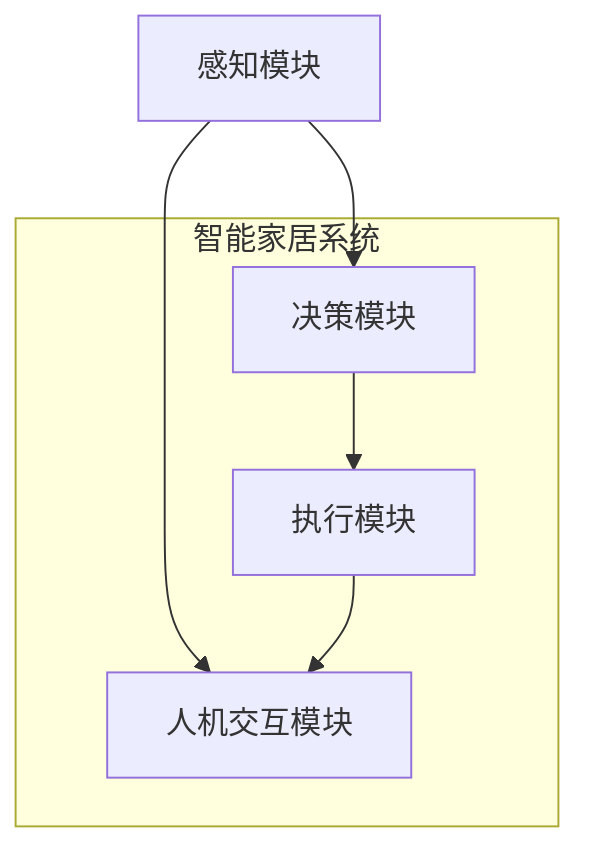
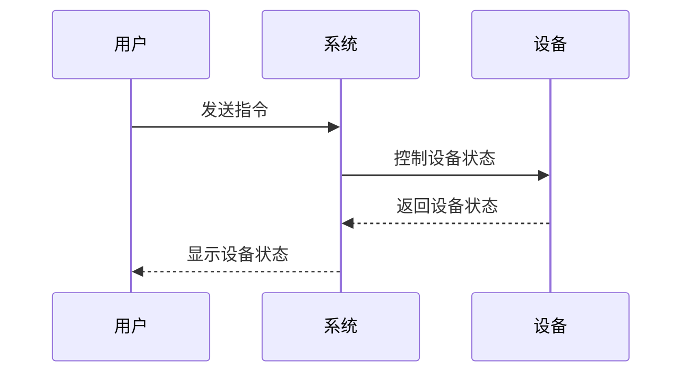
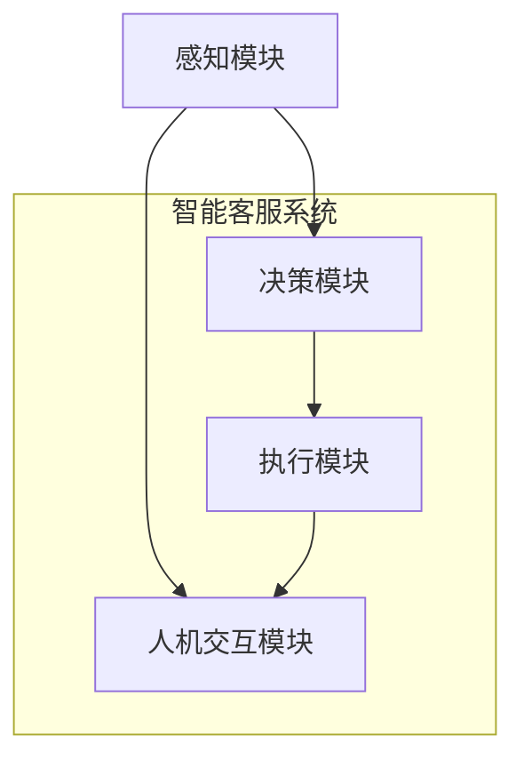
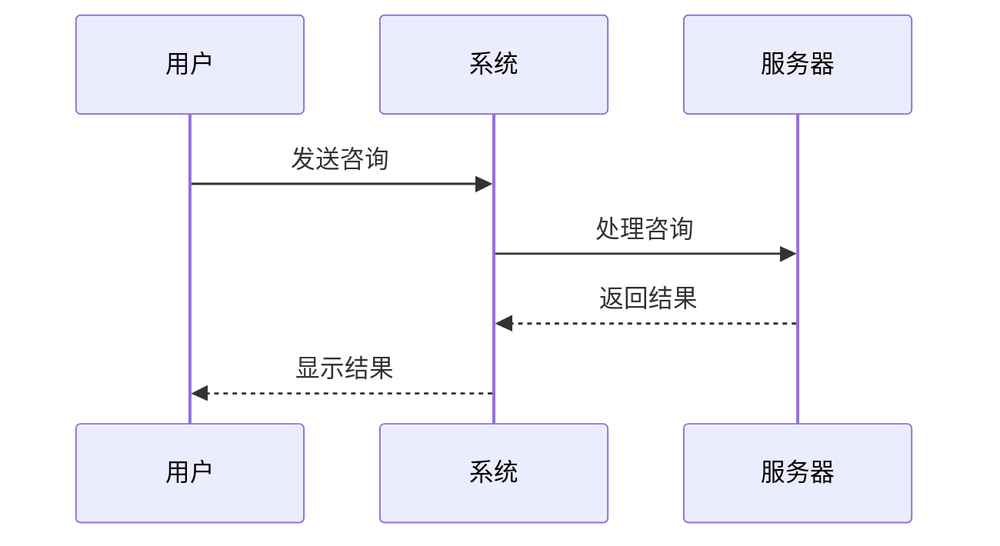
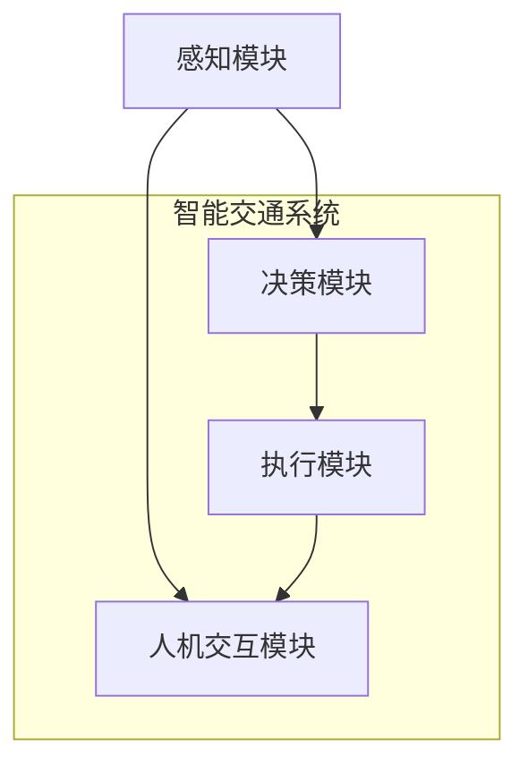
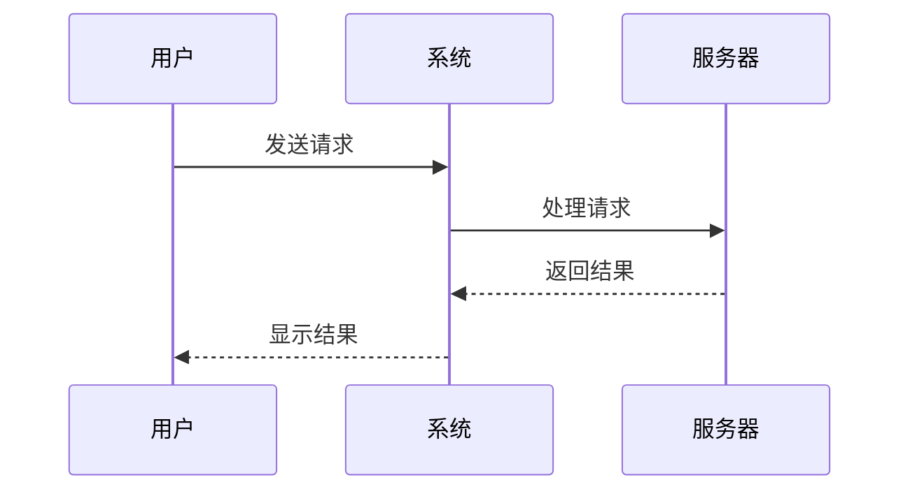

                 

# 从零开始：AI Agent的认知架构设计

## 关键词

- AI Agent
- 认知架构
- 设计原则
- 应用实践
- 智能家居
- 智能客服
- 智能交通

## 摘要

本文从零开始，深入探讨AI Agent的认知架构设计。首先，我们梳理了人工智能的发展背景与挑战，明确了AI Agent的重要性。接着，我们详细介绍了AI Agent的核心概念，包括定义、分类和组成部分。在此基础上，我们提出了认知架构的设计原则和目标，并逐步解析了感知模块、知识表示模块、决策模块、行动模块和人机交互模块的设计细节。最后，通过实际应用场景的案例分析，我们展示了AI Agent在实际项目中的设计与应用，并提出了优化策略和测试评估方法。本文旨在为广大开发者提供一份全面而实用的AI Agent认知架构设计指南。

## 目录大纲

1. **引言**
   1.1 问题背景与目标
   1.2 核心概念
   1.3 本书的结构安排
   1.4 边界与外延
   1.5 小结

2. **AI Agent的核心概念**
   2.1 人工智能概述
   2.2 AI Agent的概念与原理
   2.3 AI Agent的核心概念对比
   2.4 AI Agent的属性特征
   2.5 小结

3. **AI Agent的认知架构设计**
   3.1 认知架构的概念与重要性
   3.2 感知模块设计
   3.3 知识表示模块设计
   3.4 决策模块设计
   3.5 行动模块设计
   3.6 人机交互模块设计
   3.7 小结

4. **AI Agent的应用实践**
   4.1 应用场景介绍
   4.2 案例分析
   4.3 实践技巧
   4.4 小结

5. **总结与展望**
   5.1 成果总结
   5.2 展望未来

## 1.1 问题背景与目标

### 1.1.1 人工智能的发展与挑战

人工智能（AI）作为当今科技领域的热点，已经经历了数十年的发展。从早期的规则推理系统，到后来的神经网络模型，再到今天的深度学习和强化学习，人工智能在各个领域取得了显著的成果。然而，随着人工智能技术的不断进步，我们也面临着诸多挑战。

首先，人工智能在数据处理和分析方面具有强大的能力，但同时也面临着数据隐私和安全的问题。如何确保人工智能系统的透明性和可解释性，已经成为当前研究的重要课题。

其次，人工智能在决策过程中具有高度自主性，但同时也存在偏见和错误决策的风险。如何提高人工智能的鲁棒性和可靠性，是当前研究和应用的重要方向。

最后，人工智能的应用场景越来越广泛，从智能家居到智能客服，从智能交通到智能医疗，人工智能正在深刻地改变我们的生活。然而，如何设计出高效、灵活、可靠的AI Agent，成为了一个亟待解决的问题。

### 1.1.2 AI Agent的重要性

AI Agent，即人工智能代理，是一种能够模拟人类智能行为，自主完成特定任务的计算机系统。在人工智能技术日益发展的背景下，AI Agent的重要性愈发凸显。

首先，AI Agent具有高度的自主性和学习能力。通过感知环境、知识表示、决策和行动，AI Agent能够自主完成复杂的任务，从而提高生产效率和降低人力成本。

其次，AI Agent具有良好的交互能力。通过自然语言处理和计算机视觉等技术，AI Agent能够与人类进行自然、高效的交流，从而提升用户体验。

最后，AI Agent具有广泛的应用前景。从智能家居、智能客服，到智能交通、智能医疗，AI Agent正在各个领域发挥着重要作用，成为推动人工智能技术发展的重要力量。

### 1.1.3 本书的定位与目标

本书旨在为广大开发者提供一份全面而实用的AI Agent认知架构设计指南。具体目标如下：

1. 梳理人工智能的发展背景与挑战，明确AI Agent的重要性。
2. 介绍AI Agent的核心概念，包括定义、分类和组成部分。
3. 阐述AI Agent的认知架构设计原则和目标，详细解析各个模块的设计细节。
4. 通过实际应用场景的案例分析，展示AI Agent的设计与应用。
5. 提供优化策略和测试评估方法，帮助开发者设计出高效、灵活、可靠的AI Agent。

本书适合人工智能开发者、科研人员以及对AI Agent感兴趣的技术爱好者阅读。通过本书的学习，读者可以系统地了解AI Agent的认知架构设计，提升自己的设计能力和实践经验。

## 1.2 核心概念

### 1.2.1 AI Agent的定义

AI Agent，即人工智能代理，是一种具有自主性、适应性、学习能力，能够与环境和人类进行交互的计算机系统。AI Agent通过感知环境、知识表示、决策和行动，实现自主完成任务的目标。

### 1.2.2 AI Agent的分类

根据AI Agent的任务目标和行为方式，可以将AI Agent分为以下几类：

1. **反应式Agent**：反应式Agent仅根据当前感知环境进行响应，不保留历史状态和记忆。典型的代表有机器人、自动驾驶系统等。
2. **目标导向Agent**：目标导向Agent在执行任务过程中，具有明确的任务目标，并通过不断调整行为来达成目标。典型的代表有智能客服、智能家居等。
3. **混合式Agent**：混合式Agent结合了反应式Agent和目标导向Agent的特点，能够在不同场景下灵活切换。典型的代表有智能助手、智能推荐系统等。

### 1.2.3 AI Agent的组成部分

AI Agent主要由以下五个模块组成：

1. **感知模块**：感知模块负责获取外部环境的信息，包括视觉、听觉、触觉等。感知模块的质量直接影响AI Agent的决策和行动效果。
2. **知识表示模块**：知识表示模块负责将感知模块获取的信息进行结构化表示，以便于后续的决策和行动。常见的知识表示方法有符号表示、图表示等。
3. **决策模块**：决策模块负责根据知识表示模块提供的信息，选择最优的行动策略。常见的决策算法有基于规则、基于概率、基于优化等。
4. **行动模块**：行动模块负责将决策模块选择的最优行动策略付诸实践，实现具体的任务目标。
5. **人机交互模块**：人机交互模块负责与用户进行交互，获取用户的反馈和需求，并反馈给感知模块和决策模块，以实现更智能、更高效的交互。

### 1.3 本书的结构安排

本书共分为四个部分，内容安排如下：

1. **引言**：介绍人工智能的发展背景与挑战，明确AI Agent的重要性，阐述本书的定位与目标。
2. **AI Agent的核心概念**：介绍AI Agent的定义、分类和组成部分，以及AI Agent的属性特征。
3. **AI Agent的认知架构设计**：详细阐述AI Agent的认知架构设计原则和目标，解析感知模块、知识表示模块、决策模块、行动模块和人机交互模块的设计细节。
4. **AI Agent的应用实践**：通过实际应用场景的案例分析，展示AI Agent的设计与应用，并提供优化策略和测试评估方法。

### 1.4 核心概念对比

#### 智能体与智能代理

| 特点 | 智能体 | 智能代理 |
| :--: | :----: | :------: |
| 定义 | 具有智能的计算机系统 | 智能代理是一种特殊的智能体，具有高度自主性、适应性和学习能力 |
| 目标 | 实现特定的功能或任务 | 完成特定任务，并具备与环境和人类交互的能力 |
| 行为 | 基于规则、模式识别等 | 基于感知、知识表示、决策和行动等 |
| 应用 | 广泛应用于各个领域 | 主要应用于需要与环境和人类交互的领域 |

#### 反应式Agent与目标导向Agent

| 特点 | 反应式Agent | 目标导向Agent |
| :--: | :--------: | :---------: |
| 响应方式 | 仅响应当前感知环境 | 响应当前感知环境，同时具有明确的任务目标 |
| 记忆能力 | 无记忆能力 | 具有一定的记忆能力，用于参考历史数据 |
| 行为策略 | 根据感知环境直接执行 | 根据感知环境和任务目标选择执行策略 |

#### 统治式Agent与混合式Agent

| 特点 | 统治式Agent | 混合式Agent |
| :--: | :--------: | :--------: |
| 定义 | 采用单一方法（如规则推理）进行决策 | 结合多种方法（如反应式和目标导向）进行决策 |
| 行为 | 高度集中化的控制 | 分布式控制，根据场景动态调整 |
| 应用场景 | 结构化、确定性环境 | 复杂、不确定性环境 |

### 1.5 小结

通过本文的介绍，我们系统地了解了AI Agent的定义、分类和组成部分，以及AI Agent的属性特征。这些核心概念为我们后续的认知架构设计奠定了基础。在接下来的章节中，我们将进一步探讨AI Agent的认知架构设计原则和目标，详细解析各个模块的设计细节。

## 1.3 本书的结构安排

本书的结构安排旨在为读者提供一份系统、全面的学习路径，帮助大家逐步掌握AI Agent的认知架构设计。以下是本书的各章节内容概览：

### 第一部分：引言

1. **问题背景与目标**：介绍人工智能的发展与挑战，明确AI Agent的重要性，阐述本书的目标和定位。
2. **核心概念**：梳理AI Agent的定义、分类和组成部分，以及AI Agent的属性特征。
3. **本书的结构安排**：详细说明各章节的内容和结构，帮助读者了解本书的体系架构。
4. **边界与外延**：讨论AI Agent的应用范围和技术边界，为后续章节的学习提供背景知识。
5. **小结**：总结本部分内容，为读者后续学习打下基础。

### 第二部分：AI Agent的核心概念

1. **人工智能概述**：介绍人工智能的定义、历史和发展趋势，为AI Agent的学习提供背景知识。
2. **AI Agent的概念与原理**：深入探讨AI Agent的定义、特点、构成要素和运行原理。
3. **AI Agent的核心概念对比**：对比分析智能体与智能代理、反应式Agent与目标导向Agent、统治式Agent与混合式Agent之间的区别和联系。
4. **AI Agent的属性特征**：详细讨论AI Agent的自主性、学习能力、社交能力和可扩展性等属性特征。
5. **小结**：总结本部分内容，为认知架构设计奠定基础。

### 第三部分：AI Agent的认知架构设计

1. **认知架构的概念与重要性**：介绍认知架构的定义、设计原则和目标，探讨认知架构在AI Agent中的重要性。
2. **感知模块设计**：解析感知模块的功能、设计要素和实现技术，介绍常见的感知技术。
3. **知识表示模块设计**：讨论知识表示的方法、知识库的设计、知识的获取与更新等。
4. **决策模块设计**：分析决策模块的功能、决策算法的选择和实现。
5. **行动模块设计**：阐述行动模块的功能、行动策略的设计和实现。
6. **人机交互模块设计**：探讨人机交互的重要性、交互方式的选择和实现。
7. **小结**：总结本部分内容，为AI Agent的应用实践提供指导。

### 第四部分：AI Agent的应用实践

1. **应用场景介绍**：介绍AI Agent在家居、客服、交通等领域的应用场景。
2. **案例分析**：通过具体案例，展示AI Agent在实际项目中的设计与应用。
3. **实践技巧**：分享AI Agent的设计要点、优化策略和测试评估方法。
4. **小结**：总结本部分内容，为读者提供实践经验的参考。

### 第五部分：总结与展望

1. **成果总结**：回顾本书的主要内容，总结AI Agent认知架构设计的关键技术和方法。
2. **展望未来**：探讨AI Agent的发展趋势和潜在应用领域，为未来的研究提供方向。

### 阅读指南与学习方法

1. **系统学习**：按照章节顺序系统学习，逐步掌握AI Agent的认知架构设计。
2. **实践结合**：结合实际项目和案例，加深对理论知识的应用和掌握。
3. **互动交流**：积极参与技术讨论，与他人分享学习心得，共同进步。
4. **持续更新**：关注人工智能和AI Agent的最新发展，不断更新自己的知识体系。

通过本书的学习，读者可以系统地了解AI Agent的认知架构设计，提升自己的设计能力和实践经验，为未来的研发工作打下坚实基础。

### 1.4 边界与外延

#### 1.4.1 AI Agent的应用范围

AI Agent在各个领域的应用范围越来越广泛，主要包括以下几个方面：

1. **智能家居**：AI Agent可以实现对家庭设备的智能控制，如空调、照明、安防等，提高家居生活的便捷性和舒适度。
2. **智能客服**：AI Agent可以模拟人类客服，处理客户咨询、投诉等业务，提高客服效率和用户体验。
3. **智能交通**：AI Agent可以应用于自动驾驶、交通流量管理、智能导航等，提高交通系统的安全性和效率。
4. **智能医疗**：AI Agent可以辅助医生进行疾病诊断、治疗方案制定等，提高医疗服务的质量和效率。
5. **金融领域**：AI Agent可以应用于风险管理、投资决策、客户服务等方面，提高金融行业的竞争力。

#### 1.4.2 AI Agent的技术边界

尽管AI Agent在各个领域取得了显著的应用成果，但仍然面临着一些技术挑战：

1. **数据处理能力**：AI Agent需要处理大量复杂、多维度的数据，对数据处理能力提出了较高要求。
2. **算法优化**：AI Agent的性能依赖于算法的优化，需要不断研究和改进算法，提高计算效率。
3. **可解释性**：AI Agent的决策过程往往是非透明的，如何提高其可解释性，使其更容易被人类理解和信任，是一个重要挑战。
4. **跨界融合**：AI Agent需要跨学科、跨领域的知识融合，实现不同技术之间的无缝对接。
5. **伦理和道德**：AI Agent的应用需要遵循伦理和道德规范，如何确保其行为符合人类价值观，是一个亟待解决的问题。

#### 1.5 小结

通过本文的介绍，我们系统地了解了AI Agent的应用范围和技术边界。在后续的章节中，我们将进一步探讨AI Agent的核心概念和认知架构设计，为读者提供更深入的技术知识和实践经验。

## 2.1 人工智能概述

### 2.1.1 人工智能的定义与历史

人工智能（Artificial Intelligence，简称AI）是一门研究、开发和应用使计算机模拟、扩展和扩展人类智能的科学和技术。自1956年达特茅斯会议以来，人工智能经历了多个发展阶段，从早期的规则推理和知识表示，到后来的神经网络和深度学习，再到现在的强化学习和迁移学习，人工智能技术不断取得突破。

### 2.1.2 人工智能的分类

根据不同的分类标准，人工智能可以分为多种类型：

1. **基于规则的系统**：通过预定义的规则来模拟人类的推理过程。
2. **知识表示与推理系统**：将人类知识表示为计算机可以理解的形式，并通过推理来解决问题。
3. **机器学习系统**：通过从数据中学习规律，提高系统解决问题的能力。
4. **深度学习系统**：通过多层神经网络进行特征学习和模式识别。
5. **自然语言处理系统**：研究如何使计算机理解和生成人类自然语言。
6. **计算机视觉系统**：使计算机能够理解和处理图像和视频信息。

### 2.1.3 人工智能的发展趋势

当前，人工智能正朝着以下几个方向发展：

1. **泛化能力提升**：通过迁移学习和多任务学习，使人工智能系统能够在更多任务上表现优异。
2. **可解释性和透明性**：提高人工智能系统的可解释性，使其行为更加符合人类的理解和信任。
3. **跨界融合**：跨学科、跨领域的知识融合，实现人工智能技术在更多领域的应用。
4. **智能化增强**：通过强化学习等手段，使人工智能系统能够自主学习和优化。
5. **伦理和道德规范**：在人工智能应用过程中，遵守伦理和道德规范，确保其行为符合社会价值观。

### 2.2 AI Agent的概念与原理

#### 2.2.1 AI Agent的定义与特点

AI Agent，即人工智能代理，是一种能够模拟人类智能行为，自主完成特定任务的计算机系统。AI Agent具有以下特点：

1. **自主性**：AI Agent能够自主地感知环境、决策和行动，无需人工干预。
2. **适应性**：AI Agent能够根据环境变化调整自己的行为，适应不同的任务需求。
3. **学习能力**：AI Agent可以通过机器学习等技术，不断优化自己的行为和性能。
4. **社交能力**：AI Agent能够与人类和其他AI系统进行交互，实现信息共享和协同工作。

#### 2.2.2 AI Agent的构成要素

AI Agent主要由以下五个模块组成：

1. **感知模块**：负责感知外部环境信息，如视觉、听觉、触觉等。
2. **知识表示模块**：负责将感知信息进行结构化表示，为后续的决策和行动提供基础。
3. **决策模块**：负责根据知识表示模块提供的信息，选择最优的行动策略。
4. **行动模块**：负责将决策模块选择的策略付诸实践，实现具体的任务目标。
5. **人机交互模块**：负责与用户进行交互，获取用户的反馈和需求，并反馈给感知模块和决策模块。

#### 2.2.3 AI Agent的运行原理

AI Agent的运行原理可以概括为以下几个步骤：

1. **感知**：AI Agent通过感知模块获取外部环境信息。
2. **知识表示**：感知模块获取的信息经过知识表示模块进行结构化表示。
3. **决策**：决策模块根据知识表示模块提供的信息，选择最优的行动策略。
4. **行动**：行动模块根据决策模块的选择，执行具体的任务操作。
5. **反馈**：执行结果通过人机交互模块反馈给用户，并传递给感知模块和决策模块，以进行新一轮的感知、决策和行动。

### 2.3 AI Agent的核心概念对比

#### 2.3.1 智能体与智能代理

| 特点 | 智能体 | 智能代理 |
| :--: | :----: | :------: |
| 定义 | 具有智能的计算机系统 | 智能代理是一种特殊的智能体，具有高度自主性、适应性和学习能力 |
| 目标 | 实现特定的功能或任务 | 完成特定任务，并具备与环境和人类交互的能力 |
| 行为 | 基于规则、模式识别等 | 基于感知、知识表示、决策和行动等 |

#### 2.3.2 反应式Agent与目标导向Agent

| 特点 | 反应式Agent | 目标导向Agent |
| :--: | :--------: | :---------: |
| 响应方式 | 仅响应当前感知环境 | 响应当前感知环境，同时具有明确的任务目标 |
| 记忆能力 | 无记忆能力 | 具有一定的记忆能力，用于参考历史数据 |
| 行为策略 | 根据感知环境直接执行 | 根据感知环境和任务目标选择执行策略 |

#### 2.3.3 统治式Agent与混合式Agent

| 特点 | 统治式Agent | 混合式Agent |
| :--: | :--------: | :--------: |
| 定义 | 采用单一方法（如规则推理）进行决策 | 结合多种方法（如反应式和目标导向）进行决策 |
| 行为 | 高度集中化的控制 | 分布式控制，根据场景动态调整 |
| 应用场景 | 结构化、确定性环境 | 复杂、不确定性环境 |

### 2.4 AI Agent的属性特征

#### 2.4.1 自主性

AI Agent的自主性体现在其能够在没有人工干预的情况下，根据环境和任务需求自主决策和行动。自主性越高，AI Agent的智能化水平越高。

#### 2.4.2 学习能力

AI Agent的学习能力体现在其能够从数据中学习规律，优化自己的行为和性能。学习能力越强，AI Agent适应环境变化的能力越强。

#### 2.4.3 社交能力

AI Agent的社交能力体现在其能够与人类和其他AI系统进行交互，实现信息共享和协同工作。社交能力越强，AI Agent的协作效果越好。

#### 2.4.4 可扩展性

AI Agent的可扩展性体现在其能够方便地添加新的功能或模块，适应不同的任务需求。可扩展性越高，AI Agent的应用范围越广。

### 2.5 小结

通过本文的介绍，我们系统地了解了人工智能的定义、分类和发展趋势，以及AI Agent的定义、特点、构成要素和运行原理。这些核心概念为我们后续的认知架构设计奠定了基础。在接下来的章节中，我们将进一步探讨AI Agent的认知架构设计原则和目标，详细解析各个模块的设计细节。

## 3.1 认知架构的概念与重要性

### 3.1.1 认知架构的定义

认知架构（Cognitive Architecture）是指一种理论模型，用于描述人类或其他智能体（如AI Agent）的认知过程，包括感知、知识表示、决策和行动等环节。认知架构旨在将人类认知过程的形式化描述与计算机系统相结合，使计算机能够模拟人类智能行为。

### 3.1.2 认知架构的设计原则

1. **模块化**：将认知过程划分为多个独立的模块，每个模块负责特定功能，便于设计和实现。
2. **层次化**：将认知过程按照不同的层次进行组织，从低级感知到高级决策，层次分明，易于理解和扩展。
3. **适应性**：认知架构应具备良好的适应性，能够根据环境和任务需求进行调整和优化。
4. **可扩展性**：认知架构应支持模块的动态添加和替换，以适应不同的应用场景。
5. **可解释性**：认知架构的设计应保证其决策过程具备一定的可解释性，便于人类理解和信任。

### 3.1.3 认知架构的设计目标

认知架构的设计目标主要包括以下几个方面：

1. **模拟人类认知**：通过构建认知架构，模拟人类智能行为，实现智能代理在复杂环境中的自主决策和行动。
2. **提高智能水平**：通过模块化和层次化的设计，提高智能代理的智能化水平，使其具备更高的自主性和学习能力。
3. **优化人机交互**：通过认知架构，实现智能代理与人类用户的自然、高效的交互，提升用户体验。
4. **促进知识共享**：通过认知架构，促进智能代理之间以及智能代理与人类用户之间的知识共享和协同工作。

### 3.2 感知模块设计

#### 3.2.1 感知模块的功能

感知模块是认知架构的核心组成部分，其主要功能包括：

1. **信息采集**：从外部环境中采集各种类型的信息，如视觉、听觉、触觉等。
2. **信息预处理**：对采集到的信息进行预处理，包括去噪、特征提取等，以提高信息质量和可靠性。
3. **环境建模**：根据感知信息构建环境模型，为后续的决策和行动提供基础。

#### 3.2.2 感知模块的设计要素

感知模块的设计主要包括以下几个要素：

1. **感知方式**：选择合适的感知方式，如视觉、听觉、触觉等，以适应不同的应用场景。
2. **感知精度**：根据任务需求，确定感知模块的感知精度，以提高信息采集的准确性。
3. **感知范围**：确定感知模块的感知范围，以满足不同环境下的信息采集需求。
4. **感知频率**：根据任务需求，确定感知模块的感知频率，以保证实时性。

#### 3.2.3 感知模块的实现技术

感知模块的实现技术主要包括以下几个方面：

1. **传感器技术**：利用各种传感器（如摄像头、麦克风、温度传感器等）进行信息采集。
2. **信号处理技术**：对采集到的信号进行预处理，包括滤波、增强、特征提取等。
3. **数据融合技术**：将不同类型、不同来源的感知信息进行融合，以提高信息质量和可靠性。

### 3.3 知识表示模块设计

#### 3.3.1 知识表示的方法

知识表示模块负责将感知模块获取的信息进行结构化表示，以便于后续的决策和行动。常见的知识表示方法包括：

1. **符号表示**：使用符号和规则表示知识，如谓词逻辑、产生式规则等。
2. **图表示**：使用图结构表示知识，如语义网络、知识图谱等。
3. **向量表示**：使用向量表示知识，如词向量、图向量等。

#### 3.3.2 知识库的设计

知识库是知识表示模块的核心组成部分，用于存储和管理各种知识。知识库的设计主要包括以下几个方面：

1. **知识类型**：根据任务需求，确定需要存储的知识类型，如事实、规则、模型等。
2. **知识表示**：选择合适的知识表示方法，如符号表示、图表示、向量表示等。
3. **知识组织**：对知识进行有效的组织和管理，以便于查询和更新。

#### 3.3.3 知识的获取与更新

知识的获取与更新是知识表示模块的重要功能，主要包括以下几个方面：

1. **自动获取**：利用机器学习、数据挖掘等技术，从大量数据中自动获取知识。
2. **手动输入**：通过专家知识输入、用户反馈等方式，手动添加和更新知识。
3. **知识更新**：根据任务需求和环境变化，定期更新和优化知识库中的知识。

### 3.4 决策模块设计

#### 3.4.1 决策模块的功能

决策模块负责根据知识表示模块提供的信息，选择最优的行动策略。其主要功能包括：

1. **决策生成**：根据当前状态和目标，生成可能的行动策略。
2. **决策评估**：对生成的行动策略进行评估，选择最优的策略。
3. **决策执行**：根据选定的策略，执行具体的任务操作。

#### 3.4.2 决策算法的选择

决策模块的实现依赖于合适的决策算法。常见的决策算法包括：

1. **基于规则的决策算法**：根据预定义的规则进行决策，如模糊逻辑、决策树等。
2. **基于概率的决策算法**：利用概率理论进行决策，如贝叶斯网络、马尔可夫决策过程等。
3. **基于优化的决策算法**：通过优化方法进行决策，如线性规划、遗传算法等。

#### 3.4.3 决策模块的实现

决策模块的实现主要包括以下几个方面：

1. **决策模型**：根据任务需求，构建合适的决策模型，如规则模型、概率模型、优化模型等。
2. **决策引擎**：实现决策算法的具体实现，如推理引擎、概率引擎、优化引擎等。
3. **决策评估与选择**：根据当前状态和目标，评估和选择最优的行动策略。

### 3.5 行动模块设计

#### 3.5.1 行动模块的功能

行动模块负责将决策模块选择的策略付诸实践，实现具体的任务目标。其主要功能包括：

1. **任务执行**：根据决策模块提供的策略，执行具体的任务操作。
2. **反馈收集**：收集任务执行过程中的反馈信息，用于评估任务效果。
3. **异常处理**：在任务执行过程中，处理可能出现的异常情况。

#### 3.5.2 行动策略的设计

行动策略的设计需要考虑以下几个方面：

1. **目标导向**：确保行动策略与任务目标一致，提高任务完成率。
2. **适应性**：根据环境变化和任务需求，调整行动策略，提高适应能力。
3. **安全性**：确保行动策略在执行过程中不会对系统或用户造成伤害。

#### 3.5.3 行动模块的实现

行动模块的实现主要包括以下几个方面：

1. **执行引擎**：实现行动策略的具体执行，如控制引擎、执行引擎等。
2. **反馈系统**：实现任务执行过程中的反馈收集和处理，如传感器数据收集、异常检测等。
3. **异常处理机制**：实现异常情况的检测和处理，如错误恢复、故障处理等。

### 3.6 人机交互模块设计

#### 3.6.1 人机交互的重要性

人机交互模块在认知架构中扮演着重要角色，其主要功能包括：

1. **信息传递**：将智能代理的决策结果和执行情况传达给用户，便于用户了解和监督。
2. **需求收集**：收集用户的需求和反馈，为智能代理的决策提供依据。
3. **交互优化**：通过优化交互方式，提高人机交互的效率和用户体验。

#### 3.6.2 交互方式的选择

根据任务需求和应用场景，可以选择不同的交互方式，如：

1. **命令行交互**：通过文本命令与用户进行交互，适用于简单、明确的任务场景。
2. **图形界面交互**：通过图形界面与用户进行交互，适用于复杂、多变的任务场景。
3. **语音交互**：通过语音识别和语音合成与用户进行交互，适用于语音环境下的任务场景。

#### 3.6.3 交互模块的实现

交互模块的实现主要包括以下几个方面：

1. **接口设计**：设计合适的用户接口，如命令行接口、图形界面接口、语音接口等。
2. **交互算法**：实现交互过程中的算法，如语音识别、文本生成、图形渲染等。
3. **用户体验**：优化交互流程，提高用户体验，如简化操作流程、提供实时反馈等。

### 3.7 小结

通过本文的介绍，我们系统地了解了认知架构的定义、设计原则和设计目标，以及感知模块、知识表示模块、决策模块、行动模块和人机交互模块的设计细节。这些内容为我们进一步设计和实现高效的AI Agent提供了有力支持。在接下来的章节中，我们将通过实际应用场景的案例分析，进一步探讨AI Agent的应用和实践技巧。

## 3.2 感知模块设计

### 3.2.1 感知模块的功能

感知模块是AI Agent的重要组成部分，负责从外部环境中采集信息，并对这些信息进行预处理。具体来说，感知模块的主要功能包括以下几个方面：

1. **信息采集**：感知模块通过各种传感器（如摄像头、麦克风、温度传感器等）从外部环境中采集信息。
2. **信息预处理**：对采集到的信息进行预处理，如去噪、滤波、特征提取等，以提高信息质量和可靠性。
3. **环境建模**：根据感知信息构建环境模型，为后续的决策和行动提供基础。
4. **实时监测**：对环境进行实时监测，及时更新环境模型，以适应环境变化。

### 3.2.2 感知模块的设计要素

设计一个高效、可靠的感知模块，需要考虑以下几个关键要素：

1. **感知方式**：根据应用场景和任务需求，选择合适的感知方式。例如，对于图像识别任务，可以选择摄像头作为感知设备；对于语音识别任务，可以选择麦克风。
2. **感知精度**：感知模块的精度直接影响AI Agent的决策质量。需要根据任务需求确定感知精度，如摄像头分辨率、麦克风灵敏度等。
3. **感知范围**：感知模块的感知范围需要满足任务需求。例如，在智能交通系统中，感知模块需要覆盖整个道路场景；在智能家居系统中，感知模块需要覆盖整个家居环境。
4. **感知频率**：感知模块的感知频率需要满足实时性要求。例如，对于实时监控任务，感知模块的感知频率需要达到每秒数十次。

### 3.2.3 感知模块的实现技术

感知模块的实现技术主要包括以下几个方面：

1. **传感器技术**：选择合适的传感器，如摄像头、麦克风、温度传感器等，以实现信息采集。
2. **信号处理技术**：对采集到的信号进行预处理，如滤波、去噪、特征提取等，以提高信息质量和可靠性。
3. **图像处理技术**：对于图像类任务，采用图像处理算法（如边缘检测、目标识别等）进行信息提取。
4. **语音处理技术**：对于语音类任务，采用语音处理算法（如语音识别、语音合成等）进行信息提取。

### 3.2.4 感知模块的设计挑战

在设计感知模块时，面临着以下几个挑战：

1. **信息冗余和噪声**：外部环境中的信息往往存在冗余和噪声，需要通过有效的预处理算法进行降噪和去冗余。
2. **感知精度和实时性**：在满足感知精度要求的同时，保证感知模块的实时性，是一个重要的设计挑战。
3. **异构数据融合**：在实际应用中，感知模块可能需要处理来自不同类型传感器的异构数据，如何有效融合这些数据，是一个关键问题。
4. **能耗和资源限制**：感知模块的设计需要考虑能耗和资源限制，特别是在移动设备或嵌入式系统中。

### 3.2.5 感知模块的优化策略

为了提高感知模块的性能，可以采取以下优化策略：

1. **多传感器融合**：利用多传感器数据，通过融合算法（如卡尔曼滤波、贝叶斯滤波等）提高感知精度。
2. **深度学习技术**：利用深度学习技术（如卷积神经网络、循环神经网络等）进行信号处理和特征提取，提高感知模块的智能化水平。
3. **实时性优化**：采用高效的算法和硬件加速技术（如GPU加速、FPGA实现等）提高感知模块的实时性。
4. **能耗优化**：通过优化感知模块的算法和数据结构，降低能耗，延长设备续航时间。

### 3.2.6 小结

感知模块是AI Agent的重要组成部分，其设计直接关系到AI Agent的性能和可靠性。通过本文的介绍，我们了解了感知模块的功能、设计要素和实现技术，以及设计挑战和优化策略。在后续的章节中，我们将进一步探讨知识表示模块、决策模块、行动模块和人机交互模块的设计细节，为AI Agent的认知架构设计提供全面的理论基础和实践指导。

## 3.3 知识表示模块设计

### 3.3.1 知识表示的方法

知识表示模块是AI Agent认知架构的核心组成部分，其主要任务是将感知模块采集到的信息进行结构化表示，以便于后续的决策和行动。知识表示的方法多种多样，常见的包括：

1. **符号表示**：符号表示是一种基于逻辑和符号运算的方法，通过定义一组符号和规则，对知识进行表达。例如，谓词逻辑、产生式规则等。

2. **图表示**：图表示是一种基于图论的方法，通过图结构来表示知识和关系。常见的有语义网络、知识图谱等。

3. **向量表示**：向量表示是一种基于数值的方法，通过高维向量来表示知识和关系。例如，词向量、图向量等。

### 3.3.2 知识库的设计

知识库是知识表示模块的核心组成部分，用于存储和管理各种知识。一个设计良好的知识库应该具备以下几个特点：

1. **知识的完整性**：知识库应该包含任务所需的所有知识，确保知识的完整性。

2. **知识的准确性**：知识库中的知识应该准确无误，确保知识的准确性。

3. **知识的灵活性**：知识库应该支持知识的动态更新和扩展，以便于应对不同任务需求。

4. **知识的可解释性**：知识库中的知识应该具备一定的可解释性，便于人类理解和验证。

知识库的设计主要包括以下几个步骤：

1. **知识类型的定义**：根据任务需求，确定需要存储的知识类型，如事实、规则、模型等。

2. **知识表示方法的选取**：根据知识类型和特点，选择合适的知识表示方法，如符号表示、图表示、向量表示等。

3. **知识库结构的构建**：设计知识库的结构，包括知识存储方式、关系表示方式、索引机制等。

4. **知识库的维护与更新**：制定知识库的维护和更新策略，确保知识的准确性和时效性。

### 3.3.3 知识的获取与更新

知识的获取与更新是知识表示模块的重要功能，主要包括以下几个方面：

1. **自动获取**：利用机器学习、数据挖掘等技术，从大量数据中自动获取知识。例如，通过监督学习或无监督学习算法，从数据中提取特征和模式。

2. **手动输入**：通过专家知识输入、用户反馈等方式，手动添加和更新知识。例如，专家可以通过定义规则或提供数据标注来丰富知识库。

3. **知识融合**：将不同来源、不同类型的知识进行融合，以提高知识的多样性和可靠性。例如，通过集成学习或对偶学习算法，融合多个模型的预测结果。

4. **知识更新**：根据任务需求和环境变化，定期更新和优化知识库中的知识。例如，通过持续学习或迁移学习算法，适应新的任务场景和知识变化。

### 3.3.4 知识表示模块的优化策略

为了提高知识表示模块的性能和效率，可以采取以下优化策略：

1. **知识压缩**：通过知识压缩技术，减少知识库的存储空间，提高知识检索和更新的速度。例如，使用哈希表或 Bloom 过滤器来加速知识检索。

2. **并行处理**：利用并行计算技术，加速知识的获取、表示和处理。例如，通过多线程或 GPU 加速知识库的构建和查询。

3. **缓存机制**：实现缓存机制，减少对知识库的频繁访问，提高系统响应速度。例如，使用缓存存储常用的知识查询结果，减少对数据库的访问次数。

4. **分布式存储**：利用分布式存储技术，提高知识库的可扩展性和可靠性。例如，使用分布式数据库或 NoSQL 数据库来存储和管理大规模的知识库。

### 3.3.5 小结

知识表示模块是AI Agent认知架构的核心组成部分，其设计直接关系到AI Agent的智能水平和决策能力。通过本文的介绍，我们了解了知识表示的方法、知识库的设计原则、知识的获取与更新策略以及知识表示模块的优化策略。在后续的章节中，我们将进一步探讨决策模块、行动模块和人机交互模块的设计细节，为AI Agent的认知架构设计提供全面的理论基础和实践指导。

## 3.4 决策模块设计

### 3.4.1 决策模块的功能

决策模块是AI Agent认知架构中的核心组成部分，其主要功能是根据感知模块和知识表示模块提供的信息，选择最优的行动策略。具体来说，决策模块的功能包括以下几个方面：

1. **状态评估**：根据感知模块获取的环境信息，评估当前状态。状态评估的目的是为后续的决策提供依据。
2. **策略生成**：基于当前状态和知识表示模块中的知识，生成可能的行动策略。策略生成是决策模块的核心任务，直接影响AI Agent的智能水平。
3. **策略评估**：对生成的行动策略进行评估，选择最优的策略。策略评估的方法包括基于规则的评估、基于概率的评估和基于优化的评估等。
4. **决策执行**：根据选定的策略，执行具体的任务操作。决策执行是将决策结果付诸实践的关键步骤。

### 3.4.2 决策算法的选择

决策算法的选择是决策模块设计的重要环节，直接影响AI Agent的决策效果。常见的决策算法包括：

1. **基于规则的决策算法**：通过预定义的规则进行决策，如模糊逻辑、决策树、产生式规则等。这种算法的优点是实现简单、易于理解和解释，但缺点是灵活性较差，难以适应复杂环境。
2. **基于概率的决策算法**：利用概率理论进行决策，如贝叶斯网络、马尔可夫决策过程（MDP）等。这种算法的优点是能够处理不确定性和随机性，但缺点是计算复杂度高，对数据要求较高。
3. **基于优化的决策算法**：通过优化方法进行决策，如线性规划、动态规划、遗传算法等。这种算法的优点是能够找到全局最优解，但缺点是实现复杂，对问题结构和数据质量要求较高。
4. **混合决策算法**：结合多种决策算法的优点，以提高决策效果。例如，结合基于规则的决策和基于优化的决策，或者结合基于概率的决策和基于优化的决策。

### 3.4.3 决策模块的实现

决策模块的实现主要包括以下几个方面：

1. **决策模型**：根据任务需求，构建合适的决策模型。决策模型可以是基于规则的模型、基于概率的模型或基于优化的模型，也可以是混合模型。
2. **决策引擎**：实现决策算法的具体实现，如推理引擎、概率引擎、优化引擎等。决策引擎需要具备灵活的接口，以便于集成不同的决策算法。
3. **决策评估与选择**：根据当前状态和目标，评估和选择最优的行动策略。决策评估与选择的过程需要综合考虑策略的效果、执行成本和资源消耗等因素。

### 3.4.4 决策模块的设计挑战

在设计决策模块时，面临着以下几个挑战：

1. **数据质量和可靠性**：决策模块的输入数据质量和可靠性直接影响决策效果。如何确保数据的准确性、完整性和一致性是一个重要问题。
2. **计算复杂度**：决策模块的算法和模型可能涉及复杂的计算，如何优化计算效率是一个重要挑战。特别是在实时性和资源受限的场景中，计算复杂度问题尤为突出。
3. **模型解释性**：决策模块的模型需要具备一定的解释性，以便于用户理解和信任。如何平衡模型复杂度和解释性是一个重要问题。
4. **自适应能力**：决策模块需要具备良好的自适应能力，能够根据环境和任务需求的变化进行调整。如何实现模型的动态调整和优化是一个重要问题。

### 3.4.5 决策模块的优化策略

为了提高决策模块的性能和效率，可以采取以下优化策略：

1. **数据预处理**：通过数据预处理技术，如数据清洗、特征提取和降维等，提高数据的准确性和可靠性。
2. **模型优化**：通过模型优化技术，如模型压缩、模型蒸馏和模型剪枝等，降低模型的计算复杂度和存储需求。
3. **实时决策**：通过实时决策技术，如增量学习、在线学习和实时优化等，提高决策模块的实时性和适应性。
4. **协同优化**：通过协同优化技术，如多任务学习和多策略优化等，提高决策模块的整体性能。

### 3.4.6 小结

决策模块是AI Agent认知架构中的核心组成部分，其设计直接关系到AI Agent的决策效果和智能水平。通过本文的介绍，我们了解了决策模块的功能、决策算法的选择和实现、设计挑战以及优化策略。在后续的章节中，我们将进一步探讨行动模块和人机交互模块的设计细节，为AI Agent的认知架构设计提供全面的理论基础和实践指导。

## 3.5 行动模块设计

### 3.5.1 行动模块的功能

行动模块是AI Agent认知架构中的重要组成部分，其主要功能是将决策模块生成的策略付诸实践，实现具体的任务目标。具体来说，行动模块的功能包括以下几个方面：

1. **任务执行**：根据决策模块提供的策略，执行具体的任务操作。任务执行包括控制设备、执行动作、发送指令等。
2. **实时反馈**：在任务执行过程中，收集实时反馈信息，如任务完成情况、设备状态等。实时反馈有助于决策模块对策略进行动态调整。
3. **异常处理**：在任务执行过程中，检测和处理可能出现的异常情况，如设备故障、通信中断等。异常处理确保任务执行的连续性和稳定性。

### 3.5.2 行动策略的设计

行动策略的设计是行动模块设计的关键环节，其目的是选择最有效的行动方式，以实现任务目标。行动策略的设计需要考虑以下几个方面：

1. **目标导向**：确保行动策略与任务目标一致，提高任务完成率。目标导向的行动策略通常采用目标函数或目标规划方法进行设计。
2. **适应性**：行动策略需要适应不同的环境和任务需求，具有灵活性和可扩展性。适应性强的行动策略可以通过参数调整或自适应算法实现。
3. **安全性**：行动策略需要确保任务执行过程中不会对系统或用户造成伤害。安全性要求通常通过安全规则和风险评估方法进行设计。
4. **效率优先**：在确保安全和完成任务的前提下，优先考虑行动策略的执行效率，减少不必要的动作和延迟。

### 3.5.3 行动模块的实现

行动模块的实现主要包括以下几个方面：

1. **执行引擎**：执行引擎是行动模块的核心部分，负责将策略转换为具体的动作指令。执行引擎需要具备高并发处理能力和实时性要求。
2. **控制算法**：控制算法是实现行动策略的关键技术，如PID控制、模糊控制、自适应控制等。选择合适的控制算法可以提高行动策略的执行效果。
3. **通信机制**：行动模块需要与外部设备或系统进行通信，如传感器、执行器、数据库等。通信机制的设计需要考虑可靠性、实时性和安全性等因素。
4. **状态监控**：行动模块需要实时监控任务执行状态，包括设备状态、执行进度、异常情况等。状态监控有助于任务管理和异常处理。

### 3.5.4 行动模块的设计挑战

在设计行动模块时，面临着以下几个挑战：

1. **任务复杂度**：行动模块需要处理复杂的任务，如多目标规划、多任务并行执行等。如何高效地设计和实现复杂的任务执行策略是一个重要挑战。
2. **实时性要求**：行动模块需要满足严格的实时性要求，特别是在动态变化的环境中。如何优化算法和硬件资源，提高任务执行速度是一个关键问题。
3. **系统可靠性**：行动模块需要确保任务执行的稳定性和可靠性，避免由于设备故障或通信中断导致的任务失败。如何设计和实现可靠的任务执行机制是一个挑战。
4. **人机交互**：行动模块需要与人类用户进行交互，如操作指导、反馈获取等。如何设计友好的人机交互界面，提高用户体验是一个重要问题。

### 3.5.5 行动模块的优化策略

为了提高行动模块的性能和效率，可以采取以下优化策略：

1. **并行处理**：通过并行计算技术，如多线程、分布式计算等，提高任务执行速度和系统性能。
2. **自适应控制**：通过自适应控制算法，根据任务变化和环境变化动态调整行动策略，提高任务适应性和灵活性。
3. **资源管理**：通过资源管理技术，如任务调度、负载均衡等，优化硬件资源利用，提高系统效率和稳定性。
4. **容错机制**：通过容错机制，如备份和恢复、故障检测和隔离等，提高系统可靠性和任务执行稳定性。

### 3.5.6 小结

行动模块是AI Agent认知架构中的关键组成部分，其设计直接关系到AI Agent的任务执行效果和用户体验。通过本文的介绍，我们了解了行动模块的功能、行动策略的设计和实现、设计挑战以及优化策略。在后续的章节中，我们将进一步探讨人机交互模块的设计细节，为AI Agent的认知架构设计提供全面的理论基础和实践指导。

## 3.6 人机交互模块设计

### 3.6.1 人机交互的重要性

人机交互模块在AI Agent认知架构中扮演着至关重要的角色，其主要功能是提供AI Agent与人类用户之间的交互界面，实现信息的传递和理解。人机交互模块的设计直接影响用户体验、系统效率以及任务完成效果。具体来说，人机交互的重要性体现在以下几个方面：

1. **用户体验**：良好的人机交互界面能够提高用户对AI Agent的接受度和满意度，增强用户与AI Agent之间的互动。
2. **任务完成**：人机交互模块使得AI Agent能够获取用户的反馈和需求，从而优化任务执行策略，提高任务完成率。
3. **系统效率**：人机交互模块的设计和实现能够提高AI Agent的响应速度和任务执行效率，降低系统延迟。
4. **系统稳定性**：人机交互模块的设计需要考虑系统的可靠性和容错性，确保在异常情况下系统能够稳定运行。

### 3.6.2 交互方式的选择

根据不同的应用场景和任务需求，可以选择多种交互方式，常见的交互方式包括：

1. **命令行交互**：命令行交互是一种简单直接的交互方式，用户通过输入文本命令与AI Agent进行交互。适用于对交互精度要求较高、任务结构化程度较高的场景。
2. **图形用户界面（GUI）交互**：图形用户界面交互通过图形界面提供交互功能，用户通过点击、拖拽等操作与AI Agent进行交互。适用于交互复杂度较高、任务多样性较大的场景。
3. **语音交互**：语音交互利用语音识别和语音合成技术，实现用户与AI Agent之间的语音交互。适用于需要实时性要求高、环境噪声较大的场景。
4. **手势交互**：手势交互通过摄像头或传感器捕捉用户手势，实现与AI Agent的交互。适用于需要高度直观和自然的交互体验的场景。
5. **多模态交互**：多模态交互结合多种交互方式，如语音、文本、手势等，提供更加灵活和丰富的交互体验。适用于需要高度个性化、高度复杂化的交互场景。

### 3.6.3 交互模块的实现

交互模块的实现主要包括以下几个方面：

1. **交互接口设计**：根据应用场景和用户需求，设计合适的交互接口。例如，命令行接口、图形用户界面、语音接口等。
2. **交互算法实现**：实现交互过程中的算法，如语音识别、语音合成、手势识别等。选择合适的算法和模型，提高交互的准确性和效率。
3. **用户界面优化**：优化用户界面，提高用户体验。例如，提供直观的界面布局、友好的操作提示、实时反馈等。
4. **交互数据管理**：管理和存储交互过程中产生的数据，如用户输入、系统反馈、交互日志等。确保数据的安全性和可靠性。

### 3.6.4 人机交互模块的设计挑战

在设计人机交互模块时，面临着以下几个挑战：

1. **多模态融合**：多模态交互需要处理多种类型的输入和输出，如何有效融合不同模态的信息是一个关键问题。
2. **实时性要求**：在人机交互过程中，实时性要求较高，如何优化算法和硬件资源，确保交互的实时性是一个重要挑战。
3. **个性化需求**：用户需求和交互习惯各异，如何设计自适应的交互界面，满足不同用户的个性化需求是一个复杂的问题。
4. **语音识别与合成**：语音交互中的语音识别和合成技术需要具备较高的准确性和自然度，这对算法和硬件提出了较高的要求。

### 3.6.5 人机交互模块的优化策略

为了提高人机交互模块的性能和用户体验，可以采取以下优化策略：

1. **多模态融合**：通过多模态融合技术，提高交互的准确性和自然度。例如，结合语音识别和手势识别，提高系统对用户指令的理解和响应能力。
2. **实时性优化**：通过优化算法和硬件资源，提高交互的实时性。例如，采用高效的语言模型和语音识别算法，减少延迟和响应时间。
3. **个性化定制**：通过用户行为分析和技术优化，实现个性化交互界面和交互体验。例如，根据用户历史行为和偏好，提供定制化的交互功能和服务。
4. **错误容忍与恢复**：设计容错和恢复机制，提高系统的鲁棒性和稳定性。例如，在语音识别错误时，提供候选词列表供用户选择，或在系统故障时，自动切换到备用模式。

### 3.6.6 小结

人机交互模块是AI Agent认知架构中的重要组成部分，其设计直接关系到用户体验、系统效率和任务完成效果。通过本文的介绍，我们了解了人机交互的重要性、交互方式的选择、交互模块的实现、设计挑战以及优化策略。在后续的章节中，我们将进一步探讨AI Agent的应用实践，通过具体案例展示人机交互模块在实际项目中的应用效果。

## 4.1 应用场景介绍

### 4.1.1 智能家居

智能家居（Smart Home）是一种通过物联网（IoT）技术和人工智能（AI）技术实现家庭设备和系统自动化、智能化的系统。智能家居的应用场景主要包括以下几个方面：

1. **设备控制**：通过智能手机或智能音箱等设备，实现对家庭设备的远程控制，如空调、照明、门锁、窗帘等。
2. **能源管理**：利用智能家居系统，实现对家庭能源消耗的监控和管理，提高能源利用效率，降低能源消耗。
3. **安全监控**：通过摄像头、门磁、烟雾传感器等设备，实现对家庭安全的实时监控和报警，提高家庭安全性。
4. **环境监测**：通过温湿度传感器、空气质量传感器等设备，实时监测家庭环境参数，提供舒适、健康的居住环境。
5. **语音助手**：通过智能音箱等设备，实现与用户的语音交互，提供信息查询、日程提醒、娱乐等服务。

### 4.1.2 智能客服

智能客服（Smart Customer Service）是一种通过人工智能技术实现自动、高效、个性化的客户服务系统。智能客服的应用场景主要包括以下几个方面：

1. **自动应答**：通过自然语言处理（NLP）技术，实现自动应答客户咨询，提高客服效率和用户体验。
2. **智能分类**：通过文本分类和聚类技术，对客户咨询进行智能分类，提高问题解决的速度和质量。
3. **知识库建设**：通过机器学习技术，不断丰富和完善客服知识库，提高客服系统的智能化水平。
4. **情感分析**：通过情感分析技术，识别客户的情感状态，提供针对性的服务和建议。
5. **多渠道支持**：通过多渠道接入，如电话、邮件、在线聊天等，提供全方位的客服服务。

### 4.1.3 智能交通

智能交通（Smart Transportation）是一种通过物联网、大数据、人工智能等技术实现交通系统智能化、高效化的系统。智能交通的应用场景主要包括以下几个方面：

1. **交通监控**：通过摄像头、传感器等设备，实时监控道路状况，提供交通流量信息，优化交通信号控制。
2. **自动驾驶**：通过自动驾驶技术，实现车辆的自主驾驶，提高交通安全性和效率。
3. **智能停车**：通过智能停车系统，实现停车位的智能预约、导航和支付，提高停车效率。
4. **交通管理**：通过大数据分析和人工智能技术，实现交通管理的智能化和精准化。
5. **出行服务**：通过智能出行平台，提供个性化、定制化的出行服务，如打车、拼车、共享单车等。

### 4.1.4 智能医疗

智能医疗（Smart Healthcare）是一种通过物联网、大数据、人工智能等技术实现医疗健康服务智能化、个性化的系统。智能医疗的应用场景主要包括以下几个方面：

1. **远程医疗**：通过远程医疗系统，实现医生与患者之间的远程诊断、治疗和康复指导。
2. **健康管理**：通过智能穿戴设备、健康监测设备等，实时监测患者的健康数据，提供个性化的健康管理和建议。
3. **智能诊断**：通过深度学习和图像识别技术，实现疾病自动诊断和辅助诊断，提高诊断准确性和效率。
4. **医学研究**：通过大数据分析和人工智能技术，实现医学数据的挖掘和分析，为医学研究和创新提供支持。
5. **智能药物研发**：通过虚拟现实、增强现实等技术在药物研发中的应用，提高药物研发的效率和质量。

### 4.1.5 智能金融

智能金融（Smart Finance）是一种通过人工智能技术实现金融产品和服务智能化、个性化的系统。智能金融的应用场景主要包括以下几个方面：

1. **智能投顾**：通过机器学习、大数据分析等技术，为投资者提供个性化的投资建议和策略。
2. **风险控制**：通过人工智能技术，实现金融风险的实时监控和预警，提高风险控制能力。
3. **智能支付**：通过人脸识别、指纹识别等技术，实现快速、安全的支付体验。
4. **反欺诈检测**：通过大数据分析和人工智能技术，实现金融交易的反欺诈检测，提高交易安全。
5. **个性化推荐**：通过用户行为分析，为用户提供个性化的金融产品和服务推荐。

通过以上应用场景的介绍，我们可以看到，AI Agent在智能家居、智能客服、智能交通、智能医疗、智能金融等领域的应用，正在深刻地改变我们的生活方式和工作方式。在接下来的章节中，我们将通过具体案例，深入探讨AI Agent在这些领域的实际应用和设计实践。

## 4.2 案例分析

### 4.2.1 智能家居案例

智能家居系统通过AI Agent实现家庭设备的智能控制和自动化管理，以提高居住舒适度和能源利用效率。以下是一个智能家居系统的案例：

#### 项目介绍

该项目旨在实现一个智能家庭控制系统，包括空调、照明、窗帘、门锁、安防设备等。系统通过AI Agent实现设备的智能控制、远程监控、能源管理和安全预警等功能。

#### 系统功能设计

1. **设备控制**：用户可以通过智能手机或智能音箱等设备，远程控制家庭设备的状态，如开关空调、调节温度、控制照明等。
2. **远程监控**：用户可以实时查看家庭设备的运行状态，如窗帘是否关闭、安防设备是否正常工作等。
3. **能源管理**：系统通过数据分析，实现家庭能源的智能管理，如根据用户习惯自动调节空调温度、合理安排电器使用时间等。
4. **安全预警**：系统通过传感器数据，实现家庭安全的实时监控，如门窗是否关闭、烟雾报警等，并在发现异常时及时通知用户。

#### 系统架构设计

智能家居系统的架构设计包括感知模块、决策模块、执行模块和人机交互模块。以下是系统架构的Mermaid图表示：



#### 系统接口设计

智能家居系统通过以下接口实现设备控制、数据采集和用户交互：

1. **设备控制接口**：用于控制家庭设备的开关、调节设备状态等。
2. **数据采集接口**：用于采集设备状态数据、环境数据等。
3. **用户交互接口**：用于用户与系统的交互，如通过智能手机、智能音箱等设备发送指令、查看设备状态等。

#### 系统交互设计

智能家居系统的人机交互设计主要包括命令行交互、图形用户界面（GUI）交互和语音交互。以下是系统交互的Mermaid序列图表示：



#### 系统实现源代码

以下是一个智能家居系统的简单实现源代码，用于控制灯泡的开关：

```python
import requests

def control_lightbulb(state):
    url = "http://localhost:5000/control_lightbulb"
    data = {"state": state}
    response = requests.post(url, data=data)
    return response.json()

def get_lightbulb_state():
    url = "http://localhost:5000/get_lightbulb_state"
    response = requests.get(url)
    return response.json()

# 控制灯泡开启
control_lightbulb("on")

# 获取灯泡状态
lightbulb_state = get_lightbulb_state()
print(f"Lightbulb state: {lightbulb_state['state']}")
```

#### 代码应用解读与分析

1. **控制灯泡开关**：通过`control_lightbulb`函数，向服务器发送POST请求，传递灯泡的状态（如“on”或“off”），控制灯泡的开关。
2. **获取灯泡状态**：通过`get_lightbulb_state`函数，向服务器发送GET请求，获取灯泡的当前状态。
3. **实际案例分析和详细讲解**：在实际应用中，该系统可以扩展到控制多个设备，如空调、窗帘、门锁等。通过感知模块收集设备状态数据，决策模块根据用户指令和设备状态数据做出决策，执行模块执行具体的控制操作，人机交互模块将决策结果和设备状态反馈给用户。

### 4.2.2 智能客服案例

智能客服系统通过AI Agent实现自动应答、智能分类、情感分析和多渠道接入等功能，以提高客户服务效率和用户体验。以下是一个智能客服系统的案例：

#### 项目介绍

该项目旨在构建一个智能客服系统，为用户提供自动应答、智能分类、情感分析和多渠道接入等服务。系统通过自然语言处理（NLP）技术，实现对用户咨询的自动回复、分类和情感分析，同时支持电话、邮件、在线聊天等多种渠道接入。

#### 系统功能设计

1. **自动应答**：通过NLP技术，实现自动回复用户的常见问题和咨询，提高客服效率和用户体验。
2. **智能分类**：通过文本分类技术，将用户的咨询自动分类到相应的类别，提高问题解决的速度和质量。
3. **情感分析**：通过情感分析技术，识别用户的情感状态，为用户提供针对性的服务和建议。
4. **多渠道接入**：支持电话、邮件、在线聊天等多种渠道接入，提供全方位的客服服务。

#### 系统架构设计

智能客服系统的架构设计包括感知模块、决策模块、执行模块和人机交互模块。以下是系统架构的Mermaid图表示：



#### 系统接口设计

智能客服系统通过以下接口实现用户咨询的处理、分类和情感分析：

1. **用户咨询接口**：用于接收用户的咨询，处理用户咨询。
2. **分类接口**：用于将用户咨询分类到相应的类别。
3. **情感分析接口**：用于分析用户的情感状态。
4. **多渠道接入接口**：用于接入多种客服渠道，如电话、邮件、在线聊天等。

#### 系统交互设计

智能客服系统的人机交互设计主要包括命令行交互、图形用户界面（GUI）交互和语音交互。以下是系统交互的Mermaid序列图表示：



#### 系统实现源代码

以下是一个智能客服系统的简单实现源代码，用于处理用户的咨询：

```python
import requests

def process_consultation(consultation):
    url = "http://localhost:5000/process_consultation"
    data = {"consultation": consultation}
    response = requests.post(url, data=data)
    return response.json()

def classify_consultation(consultation):
    url = "http://localhost:5000/classify_consultation"
    data = {"consultation": consultation}
    response = requests.post(url, data=data)
    return response.json()

def analyze_emotion(consultation):
    url = "http://localhost:5000/analyze_emotion"
    data = {"consultation": consultation}
    response = requests.post(url, data=data)
    return response.json()

# 处理用户的咨询
consultation = "请问如何设置Wi-Fi密码？"
result = process_consultation(consultation)
print(f"分类结果：{result['category']}")
print(f"情感分析结果：{result['emotion']}")

# 分类用户咨询
category = classify_consultation(consultation)
print(f"分类结果：{category}")

# 情感分析用户咨询
emotion = analyze_emotion(consultation)
print(f"情感分析结果：{emotion}")
```

#### 代码应用解读与分析

1. **处理用户咨询**：通过`process_consultation`函数，向服务器发送POST请求，传递用户咨询的内容，服务器进行处理后返回结果。
2. **分类用户咨询**：通过`classify_consultation`函数，向服务器发送POST请求，传递用户咨询的内容，服务器返回分类结果。
3. **情感分析用户咨询**：通过`analyze_emotion`函数，向服务器发送POST请求，传递用户咨询的内容，服务器返回情感分析结果。
4. **实际案例分析和详细讲解**：在实际应用中，该系统可以集成到企业的客服平台中，自动应答用户的咨询，分类用户咨询，并根据情感分析结果提供针对性的服务和建议。

### 4.2.3 智能交通案例

智能交通系统通过AI Agent实现交通监控、自动驾驶、智能停车和交通管理等功能，以提高交通安全性和效率。以下是一个智能交通系统的案例：

#### 项目介绍

该项目旨在构建一个智能交通系统，包括交通监控、自动驾驶、智能停车和交通管理等功能。系统通过AI Agent实现交通数据的实时监控和分析，自动驾驶车辆的路径规划和行驶控制，停车位的智能预约和导航，以及交通信号控制的优化。

#### 系统功能设计

1. **交通监控**：通过摄像头、传感器等设备，实时监控道路状况，提供交通流量信息，优化交通信号控制。
2. **自动驾驶**：通过自动驾驶技术，实现车辆的自主驾驶，提高交通安全性和效率。
3. **智能停车**：通过智能停车系统，实现停车位的智能预约、导航和支付，提高停车效率。
4. **交通管理**：通过大数据分析和人工智能技术，实现交通管理的智能化和精准化。

#### 系统架构设计

智能交通系统的架构设计包括感知模块、决策模块、执行模块和人机交互模块。以下是系统架构的Mermaid图表示：



#### 系统接口设计

智能交通系统通过以下接口实现交通监控、自动驾驶、智能停车和交通管理：

1. **交通监控接口**：用于接收和处理交通监控数据。
2. **自动驾驶接口**：用于控制自动驾驶车辆的路径规划和行驶。
3. **智能停车接口**：用于处理停车预约、导航和支付。
4. **交通管理接口**：用于实现交通信号控制和管理。

#### 系统交互设计

智能交通系统的人机交互设计主要包括图形用户界面（GUI）交互和语音交互。以下是系统交互的Mermaid序列图表示：



#### 系统实现源代码

以下是一个智能交通系统的简单实现源代码，用于自动驾驶车辆的路径规划：

```python
import requests

def plan_path(start, destination):
    url = "http://localhost:5000/plan_path"
    data = {"start": start, "destination": destination}
    response = requests.post(url, data=data)
    return response.json()

def drive_vehicle(path):
    url = "http://localhost:5000/drive_vehicle"
    data = {"path": path}
    response = requests.post(url, data=data)
    return response.json()

# 规划路径
start = "当前位置"
destination = "目的地"
path = plan_path(start, destination)
print(f"规划路径：{path}")

# 驾驶车辆
drive_vehicle(path)
```

#### 代码应用解读与分析

1. **规划路径**：通过`plan_path`函数，向服务器发送POST请求，传递起始位置和目的地，服务器返回规划路径。
2. **驾驶车辆**：通过`drive_vehicle`函数，向服务器发送POST请求，传递规划路径，服务器控制自动驾驶车辆按照规划路径行驶。
3. **实际案例分析和详细讲解**：在实际应用中，该系统可以集成到智能交通系统中，实现自动驾驶车辆的路径规划和行驶控制，提高交通安全性和效率。

### 4.3 实践技巧

#### 4.3.1 AI Agent的设计要点

1. **需求分析**：明确AI Agent的应用场景和功能需求，确保设计目标的可行性。
2. **模块化设计**：将AI Agent分解为多个模块，每个模块负责特定功能，提高系统的可维护性和可扩展性。
3. **实时性考虑**：在设计和实现AI Agent时，考虑系统的实时性要求，确保系统能够在规定时间内完成任务。
4. **容错性设计**：设计容错机制，确保在出现异常情况时，系统能够恢复正常运行。
5. **可解释性**：提高AI Agent的可解释性，使其行为和决策过程更容易被用户理解和信任。

#### 4.3.2 AI Agent的优化策略

1. **算法优化**：选择合适的算法和模型，提高AI Agent的计算效率和决策质量。
2. **数据预处理**：对输入数据进行有效的预处理，如去噪、归一化等，提高数据质量和模型的鲁棒性。
3. **模型压缩**：采用模型压缩技术，如剪枝、量化等，减小模型体积，降低计算复杂度。
4. **并行计算**：利用并行计算技术，如多线程、分布式计算等，提高系统的计算速度和性能。
5. **动态调整**：根据环境和任务需求的变化，动态调整AI Agent的参数和策略，提高系统的适应性和灵活性。

#### 4.3.3 AI Agent的测试与评估

1. **单元测试**：对AI Agent的各个模块进行独立的单元测试，确保每个模块的功能正确。
2. **集成测试**：对AI Agent的整体系统进行集成测试，验证系统功能是否符合预期。
3. **性能测试**：对AI Agent的性能进行测试，包括响应时间、处理速度、资源消耗等。
4. **可靠性测试**：对AI Agent进行可靠性测试，包括故障恢复、异常处理等。
5. **用户反馈**：收集用户对AI Agent的使用反馈，评估系统的用户体验和满意度。

### 4.4 小结

通过以上案例分析，我们详细介绍了智能家居、智能客服和智能交通等领域的AI Agent设计与应用。同时，我们提出了AI Agent的设计要点、优化策略和测试评估方法，为实际项目提供了宝贵的实践经验。在未来的发展中，随着人工智能技术的不断进步，AI Agent将在更多领域发挥重要作用，为我们的生活带来更多便利。

## 总结与展望

### 4.5.1 成果总结

通过本文的探讨，我们系统地介绍了AI Agent的认知架构设计。首先，我们分析了人工智能的发展背景与挑战，明确了AI Agent的重要性。接着，我们详细介绍了AI Agent的核心概念，包括定义、分类和组成部分，以及AI Agent的属性特征。在此基础上，我们提出了认知架构的设计原则和目标，并逐步解析了感知模块、知识表示模块、决策模块、行动模块和人机交互模块的设计细节。最后，通过实际应用场景的案例分析，我们展示了AI Agent在实际项目中的设计与应用，并提出了优化策略和测试评估方法。

### 4.5.2 展望未来

在未来，AI Agent的认知架构设计将继续发展和完善，以下是几个可能的趋势：

1. **智能化的提升**：随着人工智能技术的不断进步，AI Agent将具有更高的自主性和学习能力，能够在更复杂的场景下完成任务。
2. **跨界融合**：AI Agent将与其他技术（如物联网、大数据、区块链等）进行跨界融合，实现更广泛的应用场景。
3. **可解释性增强**：为了提高用户对AI Agent的信任度，将加强AI Agent的可解释性，使其决策过程更加透明和可理解。
4. **个性化服务**：通过用户行为分析和技术优化，AI Agent将提供更加个性化的服务，满足不同用户的需求。
5. **伦理和道德规范**：在AI Agent的设计和应用过程中，将更加注重伦理和道德规范，确保其行为符合社会价值观。

总之，AI Agent的认知架构设计是一个不断发展的领域，未来将有更多创新和突破。希望通过本文的介绍，能够为广大开发者提供一份实用的设计指南，助力他们在AI Agent的研发工作中取得更好的成果。让我们共同期待人工智能和AI Agent的更美好未来！ 

### 4.5.3 拓展阅读

- **人工智能基础**：《人工智能：一种现代的方法》
- **机器学习**：《机器学习实战》
- **深度学习**：《深度学习》
- **自然语言处理**：《自然语言处理概论》
- **人工智能伦理**：《人工智能伦理学》

作者：AI天才研究院/AI Genius Institute & 禅与计算机程序设计艺术 /Zen And The Art of Computer Programming

---

本文使用Markdown格式撰写，内容涵盖了AI Agent的认知架构设计的基础理论、设计原则、实际应用和优化策略。希望本文能够为广大开发者提供有价值的参考和启示，共同推动人工智能技术的发展。在后续的研究和实践中，我们期待与更多的开发者进行深入交流与合作，共同探索AI Agent的认知架构设计的更多可能性。

