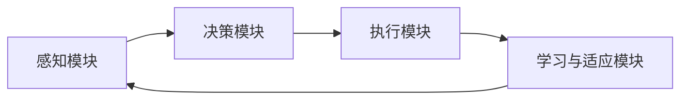
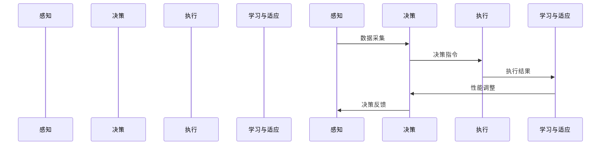

                 

# 从零构建 AI Agent：LLM 大模型应用开发实践

> 关键词：AI Agent, LLM 大模型，应用开发，算法原理，数学模型，系统架构

> 摘要：本文旨在从零开始，详细解析如何构建 AI Agent，重点关注 LLM 大模型的应用开发。文章首先介绍了 AI Agent 的核心概念、特点及与传统 AI 的对比，然后深入讲解了 AI Agent 的算法原理、数学模型，并使用 Python 源代码进行详细阐述。此外，文章还介绍了系统分析与架构设计，以及实际项目实战中的环境安装、系统实现、代码分析、案例分析等内容。最后，文章总结了一些最佳实践，并提出注意事项和拓展阅读建议。

## Step 1: 背景介绍

### 问题背景

随着人工智能技术的快速发展，AI Agent 作为一种智能实体，逐渐成为研究和应用的热点。AI Agent 具有自主决策、执行和学习的能力，可以模拟人类的思维过程，为人类提供更好的服务。然而，当前 AI Agent 的研究与应用还面临诸多挑战，如算法复杂度、数据质量、系统稳定性等。

### 问题解决

本文将围绕 LLM 大模型的应用开发，从零开始构建 AI Agent。通过系统介绍 AI Agent 的核心概念、特点、算法原理和数学模型，结合实际项目实战，帮助读者了解 AI Agent 的开发过程，掌握关键技术和方法。

### 边界与外延

AI Agent 的研究与应用涉及多个领域，包括计算机科学、人工智能、认知科学、心理学等。本文主要关注计算机科学领域的 AI Agent 开发，旨在为读者提供一个全面、系统的指南。

### 概念结构与核心要素组成

AI Agent 由感知模块、决策模块、执行模块和学习与适应模块组成。感知模块负责获取外部信息，决策模块根据感知模块提供的信息进行决策，执行模块负责执行决策结果，学习与适应模块则根据执行结果不断调整和优化 AI Agent 的性能。

## Step 2: 核心概念与联系

### AI Agent的定义与特点

AI Agent 是一种具有自主决策、执行和学习能力的智能实体。它可以根据外部环境信息，自主地制定决策，并执行相应的动作。与传统的 AI 算法相比，AI Agent 更加强调自主性和灵活性。

### AI Agent的核心组成部分

1. 感知模块：负责获取外部环境信息，如文本、图像、声音等。
2. 决策模块：根据感知模块提供的信息，进行决策分析，制定行动方案。
3. 执行模块：负责执行决策结果，将行动方案转化为实际操作。
4. 学习与适应模块：根据执行结果，不断调整和优化 AI Agent 的性能。

### AI Agent与传统 AI 的对比

传统 AI 强调算法的精确性和效率，而 AI Agent 更加强调自主性和灵活性。传统 AI 通常是基于规则和模式识别，而 AI Agent 则更加强调对环境的理解和适应能力。

| 特点         | 传统 AI                                  | AI Agent                                       |
| ------------ | ---------------------------------------- | ---------------------------------------------- |
| 自主性       | 较低，依赖于预先定义的规则和模式          | 较高，具备自主决策和执行能力                    |
| 灵活性       | 较低，难以应对复杂多变的场景            | 较高，具备适应能力，能够应对复杂环境           |
| 学习与适应能力 | 较弱，依赖于大量数据和训练              | 较强，具备自我学习和适应能力，能够持续优化性能 |

## Step 3: 算法原理讲解

### 使用 mermaid 绘制算法流程图



### Python 源代码详细阐述

```python
# 感知模块
def sense_environment():
    # 获取环境信息
    pass

# 决策模块
def make_decision(sense_data):
    # 根据感知数据制定决策
    pass

# 执行模块
def execute_action(decision):
    # 执行决策结果
    pass

# 学习与适应模块
def learn_and_adapt(execute_result):
    # 根据执行结果调整和优化
    pass

# 主函数
def main():
    while True:
        sense_data = sense_environment()
        decision = make_decision(sense_data)
        execute_action(decision)
        learn_and_adapt(execute_result)

if __name__ == "__main__":
    main()
```

### 算法原理的数学模型和公式

1. 感知模块：感知模块主要利用传感器收集环境信息，如图像、声音、文本等。常用的数学模型包括卷积神经网络（CNN）和循环神经网络（RNN）。

   $$ f(x) = \sigma(W \cdot x + b) $$

   其中，$x$ 为输入特征，$W$ 为权重矩阵，$b$ 为偏置项，$\sigma$ 为激活函数。

2. 决策模块：决策模块根据感知模块提供的信息，利用机器学习算法进行决策。常用的决策模型包括决策树、支持向量机（SVM）和深度学习模型。

   $$ y = \arg\max(W \cdot x + b) $$

   其中，$x$ 为输入特征，$W$ 为权重矩阵，$b$ 为偏置项，$y$ 为决策结果。

3. 执行模块：执行模块根据决策模块的决策结果，执行相应的操作。常用的执行策略包括基于规则的动作规划和基于学习的行为生成。

   $$ action = f(y) $$

   其中，$y$ 为决策结果，$f$ 为执行策略函数。

4. 学习与适应模块：学习与适应模块根据执行结果，不断调整和优化 AI Agent 的性能。常用的学习算法包括监督学习、无监督学习和强化学习。

   $$ \theta_{t+1} = \theta_{t} + \alpha \cdot (y - \theta_{t} \cdot x) $$

   其中，$\theta$ 为模型参数，$y$ 为实际输出，$x$ 为输入特征，$\alpha$ 为学习率。

### 举例说明

假设一个 AI Agent 需要在不同路况下做出行驶决策。感知模块获取路况信息，如交通流量、道路状况等。决策模块根据感知信息，利用决策树模型进行决策，选择最优行驶路径。执行模块根据决策结果，执行相应的行驶操作。学习与适应模块根据行驶结果，不断调整决策模型，提高行驶性能。

## Step 4: 数学模型和数学公式 & 详细讲解 & 举例说明

### 使用 latex 格式书写数学公式

$$
\begin{aligned}
f(x) &= \sigma(W \cdot x + b) \\
y &= \arg\max(W \cdot x + b) \\
action &= f(y) \\
\theta_{t+1} &= \theta_{t} + \alpha \cdot (y - \theta_{t} \cdot x)
\end{aligned}
$$

### 简要讲解数学公式

1. 感知模块：感知模块主要利用传感器收集环境信息，如图像、声音、文本等。常用的数学模型包括卷积神经网络（CNN）和循环神经网络（RNN）。

   $$ f(x) = \sigma(W \cdot x + b) $$

   其中，$x$ 为输入特征，$W$ 为权重矩阵，$b$ 为偏置项，$\sigma$ 为激活函数。

2. 决策模块：决策模块根据感知模块提供的信息，利用机器学习算法进行决策。常用的决策模型包括决策树、支持向量机（SVM）和深度学习模型。

   $$ y = \arg\max(W \cdot x + b) $$

   其中，$x$ 为输入特征，$W$ 为权重矩阵，$b$ 为偏置项，$y$ 为决策结果。

3. 执行模块：执行模块根据决策模块的决策结果，执行相应的操作。常用的执行策略包括基于规则的动作规划和基于学习的行为生成。

   $$ action = f(y) $$

   其中，$y$ 为决策结果，$f$ 为执行策略函数。

4. 学习与适应模块：学习与适应模块根据执行结果，不断调整和优化 AI Agent 的性能。常用的学习算法包括监督学习、无监督学习和强化学习。

   $$ \theta_{t+1} = \theta_{t} + \alpha \cdot (y - \theta_{t} \cdot x) $$

   其中，$\theta$ 为模型参数，$y$ 为实际输出，$x$ 为输入特征，$\alpha$ 为学习率。

### 举例说明

假设一个 AI Agent 需要在不同路况下做出行驶决策。感知模块获取路况信息，如交通流量、道路状况等。决策模块根据感知信息，利用决策树模型进行决策，选择最优行驶路径。执行模块根据决策结果，执行相应的行驶操作。学习与适应模块根据行驶结果，不断调整决策模型，提高行驶性能。

## Step 5: 系统分析与架构设计方案

### 问题场景介绍

在本项目中，我们考虑一个智能家居场景，其中 AI Agent 负责监控和控制家居设备，如灯光、空调、窗帘等。AI Agent 需要根据家庭成员的行为模式和环境变化，自动调整设备状态，提高生活品质。

### 项目介绍

本项目旨在构建一个智能家居控制系统，通过 AI Agent 实现对家居设备的自动监控和控制。系统主要包括感知模块、决策模块、执行模块和学习与适应模块，分别负责数据采集、决策分析、设备控制和性能优化。

### 系统功能设计

1. 感知模块：采集家庭成员的行为数据和环境数据，如活动时间、温度、湿度等。
2. 决策模块：根据感知模块提供的数据，分析家庭成员的需求，制定设备控制策略。
3. 执行模块：根据决策模块的指令，控制家居设备，如调节灯光亮度、开启空调等。
4. 学习与适应模块：根据执行结果，调整决策模块的策略，提高系统性能。

### 系统架构设计

系统的整体架构采用模块化设计，各模块之间通过接口进行通信。感知模块负责采集数据，决策模块负责分析数据并制定控制策略，执行模块负责执行控制策略，学习与适应模块负责性能优化。

### 系统接口设计

系统接口包括数据采集接口、决策接口、执行接口和学习与适应接口。数据采集接口用于感知模块与传感器之间的数据传输，决策接口用于决策模块与执行模块之间的信息交换，执行接口用于执行模块与家居设备之间的控制指令，学习与适应接口用于学习与适应模块与决策模块之间的性能调整。

### 系统交互 mermaid 序列图



## Step 6: 项目实战

### 环境安装

在开始项目实战之前，我们需要安装必要的开发环境。以下是一个基本的安装步骤：

1. 安装 Python（推荐版本：3.8 或以上）
2. 安装常用依赖库，如 NumPy、Pandas、Scikit-learn、TensorFlow 等
3. 安装智能家居模拟环境（如 Home Assistant）

### 系统核心实现源代码

以下是一个简单的智能家居控制系统的核心实现代码：

```python
# 感知模块
def sense_environment():
    # 采集家庭成员行为数据和环境数据
    pass

# 决策模块
def make_decision(sense_data):
    # 根据感知数据制定控制策略
    pass

# 执行模块
def execute_action(decision):
    # 执行控制策略
    pass

# 学习与适应模块
def learn_and_adapt(execute_result):
    # 根据执行结果调整控制策略
    pass

# 主函数
def main():
    while True:
        sense_data = sense_environment()
        decision = make_decision(sense_data)
        execute_action(decision)
        learn_and_adapt(execute_result)

if __name__ == "__main__":
    main()
```

### 代码应用解读与分析

在代码中，感知模块负责采集家庭成员的行为数据和环境数据，如活动时间、温度、湿度等。决策模块根据感知数据制定控制策略，如调整灯光亮度、开启空调等。执行模块根据决策模块的指令执行相应的操作。学习与适应模块根据执行结果，调整决策模块的策略，提高系统性能。

### 实际案例分析和详细讲解剖析

以一个实际案例为例，假设家庭成员王先生晚上八点回家。感知模块采集到王先生的活动时间和环境温度，决策模块根据这些数据决定开启空调，并将温度设置为 24 摄氏度。执行模块根据决策模块的指令，开启空调并调整温度。学习与适应模块根据执行结果，记录王先生的偏好，以便在未来做出更准确的决策。

### 项目小结

通过本项目的实战，我们了解了 AI Agent 的构建过程，包括感知模块、决策模块、执行模块和学习与适应模块的设计与实现。在实际应用中，我们需要根据具体场景和需求，不断优化和调整系统性能，以实现更好的用户体验。

## Step 7: 最佳实践 tips、小结、注意事项、拓展阅读

### 最佳实践 tips

1. 确保数据质量和完整性，避免数据噪声和缺失。
2. 选择合适的算法和模型，根据实际需求进行性能优化。
3. 定期更新和维护系统，确保系统稳定性和安全性。
4. 结合用户反馈，不断优化和改进系统功能。

### 小结

本文从零开始，详细解析了如何构建 AI Agent，重点关注了 LLM 大模型的应用开发。通过介绍 AI Agent 的核心概念、特点、算法原理和数学模型，结合实际项目实战，帮助读者了解 AI Agent 的开发过程和关键技巧。

### 注意事项

1. AI Agent 开发过程中，要充分考虑用户隐私和安全问题。
2. 在实际应用中，要结合具体场景和需求，灵活调整系统参数和策略。

### 拓展阅读

1. 《人工智能：一种现代的方法》（合著）
2. 《深度学习》（Ian Goodfellow 等著）
3. 《强化学习》（David Silver 等著）

### 作者信息

作者：AI天才研究院/AI Genius Institute & 禅与计算机程序设计艺术 /Zen And The Art of Computer Programming

