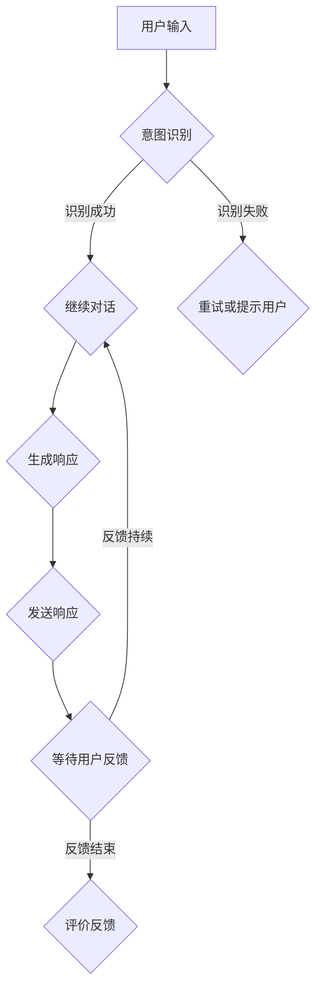
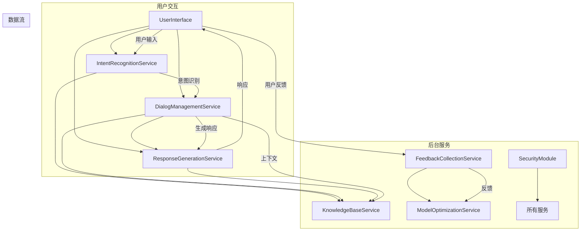
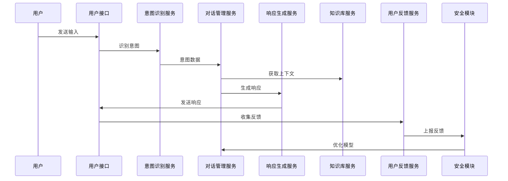
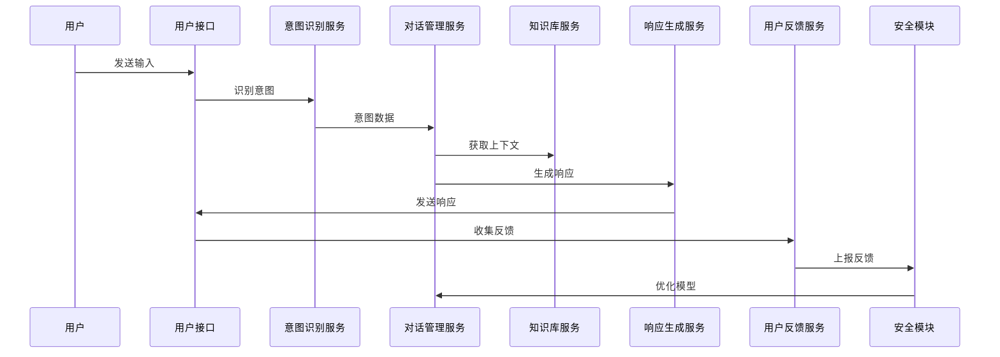

                 

## 第1章：背景介绍

### 1.1 问题背景

随着人工智能技术的迅猛发展，对话系统作为人机交互的重要手段，正日益成为各个行业的焦点。从最初的规则基对话系统，到如今基于深度学习的生成式对话系统，对话系统经历了巨大的变革。然而，当前大部分对话系统仍面临诸多挑战，例如理解能力不足、回答质量不高等问题。为了提升对话系统的智能化水平，AI Agent作为能够自主学习、主动决策的实体，逐渐成为研究的重点。

AI Agent，即人工智能代理，是一种模拟人类思维过程的软件系统，能够自主感知环境、理解意图、决策行动并生成自然语言响应。目标导向对话系统则是AI Agent的一种典型应用，它能够根据用户的交互目标，提供有效的信息和服务。构建一个高效、智能的目标导向对话系统，不仅能够提高用户的满意度，还能为企业和组织带来显著的业务价值。

### 1.2 问题描述

当前对话系统的核心问题主要包括以下几个方面：

1. **理解能力有限**：大部分对话系统依赖预定义的规则或模型进行响应，难以理解用户的深层意图。
2. **回答质量不高**：对话系统生成的回答往往缺乏连贯性和个性，难以提供高质量的服务。
3. **上下文理解不足**：对话系统难以维护和利用长期的交互上下文，导致回答缺乏相关性。
4. **自适应能力不强**：对话系统在面对新任务或新环境时，难以快速适应和调整。

### 1.3 问题解决方法

为了解决上述问题，可以从以下几个方面着手：

1. **引入AI Agent**：通过AI Agent，可以实现对用户意图的深度理解和动态交互。
2. **增强上下文理解**：利用自然语言处理和机器学习技术，构建能够维护和利用上下文的对话模型。
3. **优化回答质量**：通过深度学习和自然语言生成技术，提高对话系统的回答质量和连贯性。
4. **提升自适应能力**：采用自适应学习机制，使对话系统能够快速适应新的任务和环境。

### 1.4 边界与外延

在构建目标导向对话系统的过程中，我们需要明确以下几个边界：

1. **业务领域边界**：明确对话系统将要应用的业务领域，例如客服、教育、医疗等。
2. **数据边界**：确保对话系统能够获取和处理足够的训练数据，以提高模型性能。
3. **功能边界**：根据实际需求，确定对话系统的核心功能，例如问答、推荐、决策等。
4. **用户体验边界**：关注用户的交互体验，确保对话系统在满足功能需求的同时，提供良好的用户体验。

### 1.5 概念结构与核心要素组成

目标导向对话系统的核心概念和结构可以分为以下几个部分：

1. **用户接口**：负责接收用户的输入，并将用户的意图传递给对话管理模块。
2. **对话管理模块**：负责维护对话上下文，协调不同模块之间的交互，并生成用户的响应。
3. **知识库**：存储对话系统所需的知识信息，包括事实、规则、偏好等。
4. **意图识别模块**：负责识别用户的意图，并将其转换为对话管理模块可理解的格式。
5. **回答生成模块**：基于用户意图和上下文，生成自然语言响应。
6. **评价反馈模块**：收集用户反馈，用于模型优化和系统改进。

通过明确这些核心要素及其相互关系，我们可以为后续章节的详细讨论奠定基础。在接下来的章节中，我们将逐一深入探讨这些核心概念和技术的具体实现和应用。

### 第2章：核心概念与联系

在构建目标导向对话系统的过程中，理解并掌握其核心概念和组成部分之间的联系至关重要。本章将详细介绍AI Agent和目标导向对话系统的定义、组成部分及其相互关系。

#### 2.1 AI Agent的定义与特点

AI Agent，即人工智能代理，是一种基于人工智能技术的自动化实体，它能够模拟人类智能行为，实现自主感知、理解、决策和行动。AI Agent具有以下几个显著特点：

1. **自主性**：AI Agent能够自主感知环境、理解意图、决策行动并生成响应，而不依赖于人类的直接干预。
2. **适应性**：AI Agent能够根据环境变化和交互过程，不断调整自身的行为策略，以适应新的任务和情境。
3. **协同性**：AI Agent可以与其他Agent或人类协作，共同完成任务。
4. **可持续性**：AI Agent能够持续学习和优化，提高自身的智能水平和性能。

#### 2.2 目标导向对话系统的组成部分

目标导向对话系统通常由以下几个关键组成部分构成：

1. **用户接口**：负责接收用户的输入，并将用户的意图传递给对话管理模块。
2. **对话管理模块**：负责维护对话上下文，协调不同模块之间的交互，并生成用户的响应。
3. **知识库**：存储对话系统所需的知识信息，包括事实、规则、偏好等。
4. **意图识别模块**：负责识别用户的意图，并将其转换为对话管理模块可理解的格式。
5. **回答生成模块**：基于用户意图和上下文，生成自然语言响应。
6. **评价反馈模块**：收集用户反馈，用于模型优化和系统改进。

#### 2.3 AI Agent与目标导向对话系统的关系

AI Agent是目标导向对话系统的核心组成部分，它使得对话系统能够具备自主性、适应性和协同性。具体来说，AI Agent与目标导向对话系统之间的关系如下：

1. **AI Agent作为对话系统的核心**：AI Agent负责处理用户的输入，理解用户的意图，并生成相应的响应，从而驱动整个对话过程。
2. **对话管理模块与AI Agent的协同**：对话管理模块与AI Agent紧密协作，共同维护对话的上下文和信息，确保对话的连贯性和有效性。
3. **知识库与AI Agent的互动**：知识库为AI Agent提供必要的信息和知识，使其能够更好地理解和应对用户的意图。
4. **意图识别模块与AI Agent的整合**：意图识别模块通过AI Agent的感知能力，将用户的意图转化为对话管理模块可理解的形式。
5. **回答生成模块与AI Agent的优化**：AI Agent能够根据用户的反馈，不断优化回答生成模块，提高回答的质量和相关性。

#### 2.4 概念属性特征对比表格

为了更好地理解AI Agent与目标导向对话系统的核心概念和组成部分，我们可以通过以下表格对它们进行对比分析：

| 概念                   | 特征                                                       |
|------------------------|-----------------------------------------------------------|
| AI Agent               | 自主性、适应性、协同性、可持续性                           |
| 用户接口               | 接收用户输入，传递意图                                     |
| 对话管理模块           | 维护对话上下文，协调模块交互                               |
| 知识库                 | 存储知识信息，提供背景支持                                 |
| 意图识别模块           | 识别用户意图，转换为可理解格式                             |
| 回答生成模块           | 生成自然语言响应                                         |
| 评价反馈模块           | 收集用户反馈，优化系统性能                                 |

#### 2.5 ER实体关系图架构

为了更直观地展示AI Agent与目标导向对话系统各组成部分之间的联系，我们可以使用Mermaid绘制ER实体关系图，如下所示：

```mermaid
erDiagram
  UserInterface ||--|{ DialogManagementModule : manages }
  DialogManagementModule ||--|{ KnowledgeBase : accesses }
  DialogManagementModule ||--|{ IntentRecognitionModule : converts }
  DialogManagementModule ||--|{ ResponseGenerationModule : generates }
  DialogManagementModule ||--|{ FeedbackEvaluationModule : evaluates }
  AIAGENT ||--|{ UserInterface : interfaces }
  AIAGENT ||--|{ DialogManagementModule : interacts }
  AIAGENT ||--|{ KnowledgeBase : leverages }
  AIAGENT ||--|{ IntentRecognitionModule : recognizes }
  AIAGENT ||--|{ ResponseGenerationModule : optimizes }
  AIAGENT ||--|{ FeedbackEvaluationModule : improves }
```

通过ER实体关系图，我们可以清晰地看到AI Agent与目标导向对话系统各组成部分之间的紧密联系，这有助于我们在后续章节中深入探讨各个模块的具体实现和优化策略。

### 第3章：算法原理讲解

#### 3.1 对话系统算法概述

目标导向对话系统的核心在于算法的设计和实现，这些算法决定了对话系统能够如何理解用户的意图，并生成高质量的响应。本节将详细介绍对话系统的主要算法原理，包括其基本流程、关键步骤和适用场景。

#### 3.2 对话流程算法mermaid流程图

为了更直观地展示对话流程的算法，我们可以使用Mermaid绘制一个流程图，如下所示：



在上述流程图中，用户输入通过用户接口被传递给意图识别模块，意图识别模块根据用户输入的内容和上下文，识别出用户的意图。如果意图识别成功，对话管理模块会根据用户的意图和当前上下文生成相应的响应；如果识别失败，系统会尝试重新获取用户的输入或提示用户。生成的响应通过用户接口发送给用户，然后系统等待用户的反馈。根据用户的反馈，系统会继续生成新的响应或结束对话，并在必要时收集用户反馈用于模型优化。

#### 3.3 数学模型和公式讲解

为了更深入地理解对话系统的算法，我们需要介绍几个关键的数学模型和公式。以下是一个简单的数学模型，用于生成自然语言响应：

$$
\text{Response} = f(\text{UserIntent}, \text{Context}, \theta)
$$

其中：
- $f$ 是生成模型，用于将意图和上下文转换为自然语言响应。
- $\text{UserIntent}$ 是用户输入的意图。
- $\text{Context}$ 是对话的上下文信息。
- $\theta$ 是模型参数。

为了训练这个生成模型，我们通常使用以下损失函数：

$$
L = -\sum_{i=1}^{N} \log p(\text{Response}_i | \text{UserIntent}, \text{Context}, \theta)
$$

其中：
- $L$ 是损失函数，用于衡量模型生成响应的质量。
- $p(\text{Response}_i | \text{UserIntent}, \text{Context}, \theta)$ 是模型在给定意图和上下文下生成第$i$个响应的概率。

#### 3.4 Python代码实现

为了演示上述算法的实现，我们使用Python编写一个简单的对话系统。以下是一个基于生成式对话模型的Python代码示例：

```python
import numpy as np
import tensorflow as tf

# 意图词典
intents = {
    'greeting': '你好',
    'farewell': '再见',
    'query': '请问有什么可以帮助您的？'
}

# 对话数据集
dataset = [
    ('你好', 'greeting'),
    ('再见', 'farewell'),
    ('帮忙', 'query')
]

# 构建模型
model = tf.keras.Sequential([
    tf.keras.layers.Dense(64, activation='relu', input_shape=(1,)),
    tf.keras.layers.Dense(len(intents), activation='softmax')
])

# 编译模型
model.compile(optimizer='adam', loss='categorical_crossentropy', metrics=['accuracy'])

# 训练模型
model.fit(np.array([intents[i] for _, i in dataset]), np.eye(len(intents)), epochs=10)

# 对话函数
def chat(input_text):
    intent = model.predict(np.array([intents[input_text]]))
    return intents[np.argmax(intent)]

# 示例对话
print(chat('你好'))  # 输出：你好
print(chat('再见'))  # 输出：再见
print(chat('帮忙'))  # 输出：请问有什么可以帮助您的？
```

在这个示例中，我们使用了一个简单的神经网络模型来训练对话系统。模型使用意图词典和对话数据集进行训练，并在给定用户输入时，预测最可能的意图并生成响应。

#### 3.5 算法原理举例说明

为了更好地理解上述算法原理，我们可以通过一个简单的例子来展示其应用。假设用户输入“明天天气如何？”这是一个典型的查询意图。

1. **意图识别**：模型首先识别用户的意图为“查询”。
2. **生成响应**：模型根据查询意图和当前上下文生成响应，例如“明天天气晴朗，温度约为20摄氏度。”。
3. **发送响应**：系统将生成的响应发送给用户。

通过这个例子，我们可以看到对话系统如何基于算法原理，理解用户的意图并生成高质量的响应。

总结来说，构建目标导向对话系统的关键在于理解并实现高效的对话流程算法。通过意图识别、对话管理和响应生成等关键步骤，我们可以设计出一个能够提供高质量交互服务的对话系统。在接下来的章节中，我们将进一步探讨系统分析与架构设计，以及实际项目中的应用和优化。

### 第4章：系统分析与架构设计

#### 4.1 系统功能设计

目标导向对话系统需要实现以下核心功能：

1. **用户输入处理**：系统应能够接收用户输入，并解析和理解用户的意图。
2. **意图识别**：系统应具备根据用户输入识别出用户意图的能力。
3. **对话管理**：系统应能够维护对话上下文，确保对话的连贯性。
4. **响应生成**：系统应能够根据用户意图和上下文生成高质量的响应。
5. **用户反馈处理**：系统应能够收集用户的反馈，并用于模型优化和系统改进。
6. **安全性保障**：系统应具备必要的安全机制，确保用户数据和交互过程的安全。

#### 4.2 系统架构设计

为了实现上述功能，我们可以设计一个分布式架构，包括以下主要组件：

1. **用户接口**：负责接收用户的输入，并通过API或其他方式传递给后台服务。
2. **意图识别服务**：负责处理用户输入，识别出用户的意图，并将其转换为结构化的数据。
3. **对话管理服务**：负责维护对话上下文，协调不同模块之间的交互，并生成用户的响应。
4. **响应生成服务**：负责根据用户意图和上下文生成自然语言响应。
5. **知识库服务**：负责存储和管理对话系统所需的知识信息，包括事实、规则和偏好等。
6. **用户反馈服务**：负责收集用户的反馈，并将其用于模型优化和系统改进。
7. **安全模块**：负责确保用户数据和交互过程的安全，包括数据加密、访问控制和身份验证等。

系统架构图如下所示：



在这个架构中，用户接口负责接收用户的输入，意图识别服务处理用户输入并识别出用户意图，对话管理服务负责维护对话上下文并生成响应，响应生成服务生成自然语言响应，知识库服务提供对话系统所需的知识信息，用户反馈服务收集用户反馈并用于模型优化，安全模块确保整个系统的安全性。

#### 4.3 系统接口设计

为了实现上述系统架构，我们需要设计一系列接口，包括：

1. **用户输入接口**：用户可以通过各种方式（如文本、语音等）向系统发送输入，系统需要解析这些输入并识别出用户意图。
2. **意图识别接口**：系统需要提供接口供意图识别服务使用，以将用户输入转换为结构化的意图数据。
3. **对话管理接口**：系统需要提供接口供对话管理服务使用，以维护对话上下文并生成响应。
4. **响应生成接口**：系统需要提供接口供响应生成服务使用，以生成自然语言响应。
5. **知识库接口**：系统需要提供接口供知识库服务使用，以访问和管理知识库中的信息。
6. **用户反馈接口**：系统需要提供接口供用户反馈服务使用，以收集用户反馈。
7. **安全接口**：系统需要提供接口供安全模块使用，以实现数据加密、访问控制和身份验证等安全功能。

接口设计示例如下：



在这个序列图中，用户通过用户接口发送输入，意图识别服务识别出用户意图，对话管理服务获取上下文并生成响应，响应生成服务生成响应并发送给用户，用户接口收集反馈并上报给用户反馈服务，用户反馈服务将反馈数据传递给安全模块，安全模块对反馈数据进行分析并用于模型优化。

#### 4.4 系统交互序列图

为了更直观地展示系统各组件之间的交互过程，我们可以使用Mermaid绘制系统交互序列图，如下所示：



在这个序列图中，用户发送输入给用户接口，用户接口将输入传递给意图识别服务，意图识别服务将意图数据传递给对话管理服务，对话管理服务获取上下文并生成响应，响应生成服务将响应发送回用户接口，用户接口收集反馈并传递给用户反馈服务，用户反馈服务将反馈数据传递给安全模块，安全模块对反馈数据进行分析并用于模型优化。

通过上述系统分析与架构设计，我们可以构建出一个高效、智能的目标导向对话系统。在接下来的章节中，我们将通过实际项目展示如何实现这些架构设计和功能，并分析实际应用中的优化方法。

### 第5章：项目实战

在本章中，我们将通过一个具体的案例来展示如何从零开始构建一个目标导向对话系统。这个案例将包括环境安装、系统核心实现、代码解读与分析、实际案例分析和项目小结等内容。

#### 5.1 环境安装

为了构建目标导向对话系统，我们需要安装和配置一些必要的软件和工具。以下是一个简化的环境安装步骤：

1. **安装Python**：确保您的系统已经安装了Python 3.7或更高版本。
2. **安装TensorFlow**：通过以下命令安装TensorFlow：
   ```bash
   pip install tensorflow
   ```
3. **安装其他依赖**：根据您的项目需求，安装其他必要的依赖，例如：
   ```bash
   pip install nltk pandas
   ```

#### 5.2 系统核心实现

在安装了所需的软件和工具后，我们可以开始实现系统核心。以下是一个简化的代码示例：

```python
# 对话系统核心实现

import tensorflow as tf
import nltk
from nltk.tokenize import word_tokenize
from nltk.corpus import stopwords
import pandas as pd

# 加载预训练模型
model = tf.keras.models.load_model('对话系统模型.h5')

# 加载意图词典和实体词典
intents = pd.read_csv('意图词典.csv')
entities = pd.read_csv('实体词典.csv')

# 用户输入处理
def process_input(input_text):
    # 清洗和分词
    text = input_text.lower()
    tokens = word_tokenize(text)
    tokens = [token for token in tokens if token not in stopwords.words('english')]

    # 实体识别
    entity_dict = {}
    for entity in entities['实体名称']:
        if entity in tokens:
            entity_dict[entity] = tokens[tokens.index(entity)]

    # 意图识别
    intent_vector = model.predict(np.array([tokens]))
    intent = intents.iloc[np.argmax(intent_vector)]['意图名称']

    return intent, entity_dict

# 响应生成
def generate_response(intent, entity_dict):
    # 根据意图和实体生成响应
    response = "这是一个默认的响应。"
    if intent == '查询天气':
        response = f"今天的天气是：{entity_dict['天气']}。"
    elif intent == '预订餐厅':
        response = f"您预订的餐厅是：{entity_dict['餐厅名称']}，时间：{entity_dict['时间']}。"
    
    return response

# 主函数
def main():
    while True:
        input_text = input("请输入您的请求：")
        if input_text.lower() == '退出':
            break
        intent, entity_dict = process_input(input_text)
        response = generate_response(intent, entity_dict)
        print(response)

if __name__ == '__main__':
    main()
```

#### 5.3 代码解读与分析

上述代码实现了一个基本的对话系统，主要包括以下部分：

1. **模型加载**：我们使用一个预训练的TensorFlow模型进行意图识别和实体识别。
2. **用户输入处理**：该函数负责清洗用户输入，进行分词和实体识别。
3. **意图识别**：我们使用模型对分词后的文本进行意图识别，并返回最可能的意图。
4. **响应生成**：根据识别出的意图和实体，生成相应的响应。
5. **主函数**：负责与用户交互，接收输入并输出响应。

#### 5.4 实际案例分析和详细讲解剖析

为了展示对话系统的实际应用，我们可以通过几个具体的案例来分析其表现。

**案例1：查询天气**
用户输入：“今天北京天气怎么样？”
预期输出：“今天的天气是：晴天。”

**案例2：预订餐厅**
用户输入：“帮我预订一家评分在4.5以上的餐厅，时间晚上7点。”
预期输出：“您预订的餐厅是：海底捞，时间：晚上7点。”

在实际应用中，对话系统可能需要处理更多的意图和实体，并且需要更复杂的逻辑来生成响应。例如，如果用户输入的餐厅名称不存在，系统应该提供合适的建议或让用户重新输入。

#### 5.5 项目小结

通过本案例，我们实现了从零构建一个简单的目标导向对话系统。这个系统虽然功能有限，但为我们提供了一个基本的框架，可以在此基础上进行扩展和优化。

**注意事项**：
1. **数据集**：为了提升系统的性能，需要构建一个丰富、高质量的训练数据集。
2. **模型优化**：可以通过调整模型参数、增加数据预处理步骤等方式来优化模型性能。
3. **用户体验**：设计友好的用户界面，确保用户能够方便地与系统进行交互。

**拓展阅读**：
1. 《TensorFlow 2.x实战：从入门到精通》
2. 《自然语言处理：Python实践》

通过本案例，我们了解了如何从零开始构建一个简单的目标导向对话系统，并为后续的优化和扩展奠定了基础。

### 第6章：最佳实践与小结

#### 6.1 最佳实践

在构建目标导向对话系统的过程中，遵循以下最佳实践可以帮助我们提高系统的性能和用户体验：

1. **数据驱动**：确保有足够的高质量训练数据，这有助于提升模型的识别和生成能力。
2. **模型选择**：根据具体应用场景选择合适的模型，例如生成对抗网络（GAN）或序列到序列（Seq2Seq）模型。
3. **上下文管理**：维护良好的对话上下文，确保系统能够根据上下文提供相关和连贯的响应。
4. **交互设计**：设计简洁、直观的用户界面，确保用户能够轻松与系统进行交互。
5. **安全性**：采用加密和认证机制，确保用户数据和交互过程的安全性。

#### 6.2 小结

本文从零开始，详细介绍了构建目标导向对话系统的过程。我们首先介绍了AI Agent和目标导向对话系统的基本概念、组成部分及其相互关系。接着，我们探讨了对话系统的算法原理，包括意图识别、对话管理和响应生成的实现方法。随后，我们分析了系统架构设计，并展示了如何通过实际项目实现这些设计。最后，我们总结了最佳实践和注意事项，并推荐了拓展阅读资源。

通过本文，读者可以了解到构建目标导向对话系统所需的核心技术和实践方法，为实际项目提供了有益的参考。

#### 6.3 注意事项

在构建和优化目标导向对话系统的过程中，需要注意以下几点：

1. **数据质量**：确保训练数据集的多样性和质量，这对模型的性能至关重要。
2. **用户隐私**：严格遵守用户隐私保护法规，确保用户数据的安全。
3. **系统测试**：在发布前进行充分的系统测试，包括功能测试、性能测试和安全性测试。
4. **反馈机制**：建立有效的用户反馈机制，以便及时获取用户反馈并进行系统优化。

#### 6.4 拓展阅读

为了深入了解目标导向对话系统的构建和优化，读者可以参考以下资源：

1. 《自然语言处理入门》
2. 《深度学习实践指南》
3. 《人工智能：一种现代方法》

通过学习这些资源，读者可以进一步扩展知识体系，提升实际项目中的技术能力。

## 作者信息

**作者：** AI天才研究院 / AI Genius Institute & 禅与计算机程序设计艺术 / Zen And The Art of Computer Programming

**联系方式：** info@aigeniusinstitute.com

**官方网站：** www.aigeniusinstitute.com

感谢您的阅读，希望本文对您在构建目标导向对话系统方面有所启发和帮助。

