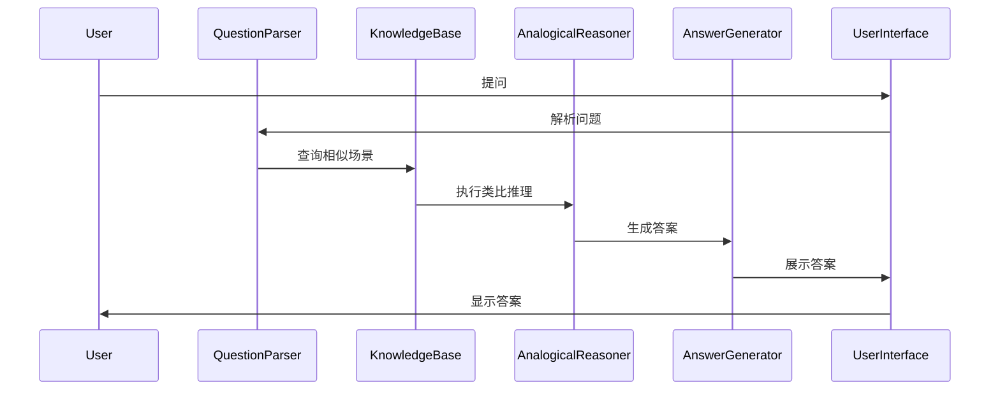

                 

### 从零构建AI Agent的类比推理系统

#### 关键词

- 人工智能
- 类比推理
- AI Agent
- 知识表示
- 推理机制

#### 摘要

本文将探讨从零构建AI Agent的类比推理系统的过程。类比推理是AI Agent在处理复杂问题和未知情境时的一种重要能力，通过将现有知识应用于相似场景，实现问题的求解。本文将详细分析类比推理系统的问题背景、核心概念、构建方法以及实际应用，帮助读者全面了解并掌握这一前沿技术。

## 第一部分：从零构建AI Agent的类比推理系统背景

### 1.1 问题背景

#### 1.1.1 人工智能的发展现状

人工智能（Artificial Intelligence，简称AI）作为当今科技的前沿领域，已经在各个行业取得了显著的成果。从早期的规则系统、专家系统，到现在的深度学习和自然语言处理，AI技术不断推动着各个领域的变革。在图像识别、语音识别、智能问答、自动驾驶等领域，AI技术已经展现出其强大的能力。

然而，尽管现有AI系统在处理大量数据和模式识别方面表现出色，但在解决复杂问题和进行高级推理方面仍存在诸多挑战。传统的AI系统通常依赖于大量数据进行训练，并且在特定领域内表现出色，但缺乏泛化能力和自适应能力。如何提升AI系统的推理能力，成为当前AI研究的一个重要方向。

#### 1.1.2 类比推理的重要性

类比推理（Analogical Reasoning）是AI系统进行高级推理的一种重要方式。类比推理通过将已有知识应用于相似情境，帮助AI系统在未知场景下快速找到解决方案。类比推理不仅能够提高AI系统的自适应能力和智能水平，还能在处理复杂问题时提供更加高效和准确的方案。

例如，在智能问答系统中，用户提出一个新问题，AI系统可以通过类比已有问题的解决方案，快速生成回答。在自动驾驶领域，AI系统可以通过类比已知的驾驶场景，应对新的驾驶环境。

#### 1.1.3 类比推理系统的应用场景

类比推理系统在AI Agent中的应用场景非常广泛，包括但不限于以下几个方面：

1. **问题求解**：在面临复杂问题时，AI Agent能够通过类比已有问题的解决方案，快速找到新问题的解决策略。
   
2. **智能问答**：在智能问答系统中，AI Agent能够利用类比推理从已有知识库中检索并生成回答，提高回答的准确性和创造力。

3. **自动化决策**：在自动化决策系统中，AI Agent通过类比推理从历史数据中学习决策模式，为新的决策提供参考。

### 1.2 问题描述

当前，构建一个有效的类比推理系统面临以下问题：

1. **知识表示**：如何将复杂、多变的现实世界知识转化为计算机可以处理的形式，是一个关键问题。
   
2. **匹配算法**：如何高效地在大量知识库中找到与当前问题相似的场景，并进行准确匹配，是实现类比推理的核心。
   
3. **推理机制**：如何从匹配结果中提取有用信息，并生成合理的推理结论，是类比推理系统能否有效应用的保证。

### 1.3 问题解决

为解决上述问题，构建类比推理系统需要从以下几个方面入手：

1. **知识表示**：采用语义网络、本体论和知识图谱等技术，对现实世界知识进行建模和表示。
   
2. **匹配算法**：利用模糊匹配、相似度计算和机器学习方法，实现高效的知识匹配。
   
3. **推理机制**：结合逻辑推理、深度学习和强化学习等技术，构建能够进行有效推理的机制。

### 1.4 边界与外延

构建类比推理系统不仅需要在技术层面实现，还涉及到知识获取、数据标注、算法优化等多个环节。同时，类比推理系统的应用领域也在不断扩展，包括医疗诊断、金融风控、智能教育等多个方面。

### 1.5 概念结构与核心要素组成

类比推理系统的概念结构与核心要素包括：

1. **知识库**：存储各类领域知识的数据库，是类比推理的基础。
   
2. **匹配引擎**：负责在知识库中找到与当前问题相似的场景，是实现类比推理的关键。
   
3. **推理引擎**：从匹配结果中提取有用信息，生成推理结论，是类比推理系统的核心。
   
4. **用户界面**：提供人机交互接口，让用户能够方便地与类比推理系统进行交互。

### 1.6 本章小结

本章介绍了从零构建AI Agent的类比推理系统的背景、问题描述、问题解决、边界与外延以及概念结构与核心要素组成。通过本章的学习，读者可以初步了解类比推理系统的构建原理和应用前景，为后续章节的学习奠定基础。

### 1.7 核心概念原理

在构建类比推理系统时，需要理解以下几个核心概念原理：

1. **知识表示**：知识表示是类比推理系统的基石，它将现实世界的知识转化为计算机可以处理的形式。常见的知识表示方法包括语义网络、本体论和知识图谱等。

   - **语义网络**：通过边和节点表示实体和实体之间的关系，是一种基于图形表示的方法。
   - **本体论**：对现实世界的概念和关系进行形式化定义，为知识表示提供了一个统一的框架。
   - **知识图谱**：将大量的知识以图谱的形式进行组织，是当前知识表示的主流方法。

2. **匹配算法**：匹配算法是类比推理系统的核心，负责在知识库中找到与当前问题相似的场景。常见的匹配算法包括模糊匹配、相似度计算和机器学习方法。

   - **模糊匹配**：通过计算字符串或实体之间的相似度，找到匹配程度较高的场景。
   - **相似度计算**：利用数学模型计算实体或场景之间的相似度，用于匹配算法中。
   - **机器学习方法**：利用已标记的数据训练模型，实现自动化的匹配和分类。

3. **推理机制**：推理机制负责从匹配结果中提取有用信息，生成推理结论。常见的推理机制包括逻辑推理、深度学习和强化学习等。

   - **逻辑推理**：基于逻辑规则进行推理，是传统的推理方法。
   - **深度学习**：通过神经网络模型进行推理，能够处理复杂的关系和模式。
   - **强化学习**：通过学习在不同情境下的最佳行动策略，实现高效的推理。

在接下来的章节中，我们将逐步深入探讨这些核心概念，并详细介绍如何构建一个具有强大类比推理能力的AI Agent。

## 第一部分：从零构建AI Agent的类比推理系统

### 1.1 问题背景

#### 1.1.1 人工智能的发展现状

人工智能（Artificial Intelligence，简称AI）作为当今科技的前沿领域，已经取得了显著的进展。从早期的专家系统、机器学习，到如今的深度学习和自然语言处理，AI技术在各个领域都展现出了强大的潜力。尤其是在图像识别、语音识别、自动驾驶、医疗诊断等领域，AI技术的应用已经大大改变了我们的生活方式。

然而，尽管AI技术在处理大量数据和模式识别方面表现出色，但在解决复杂问题和进行高级推理方面仍然存在诸多挑战。传统的AI系统通常依赖于大量的数据进行训练，这使得它们在特定领域内表现出色，但缺乏泛化能力和自适应能力。因此，如何提升AI系统的推理能力，成为当前AI研究的一个重要方向。

#### 1.1.2 类比推理的重要性

类比推理（Analogical Reasoning）是AI系统进行高级推理的一种重要方式。类比推理通过将已有知识应用于相似情境，帮助AI系统在未知场景下快速找到解决方案。类比推理不仅能够提高AI系统的自适应能力和智能水平，还能在处理复杂问题时提供更加高效和准确的方案。

例如，在智能问答系统中，用户提出一个新问题，AI系统可以通过类比已有问题的解决方案，快速生成回答。在自动驾驶领域，AI系统可以通过类比已知的驾驶场景，应对新的驾驶环境。

#### 1.1.3 类比推理系统的应用场景

类比推理系统在AI Agent中的应用场景非常广泛，包括但不限于以下几个方面：

1. **问题求解**：在面临复杂问题时，AI Agent能够通过类比已有问题的解决方案，快速找到新问题的解决策略。

2. **智能问答**：在智能问答系统中，AI Agent能够利用类比推理从已有知识库中检索并生成回答，提高回答的准确性和创造力。

3. **自动化决策**：在自动化决策系统中，AI Agent通过类比推理从历史数据中学习决策模式，为新的决策提供参考。

### 1.2 问题描述

当前，构建一个有效的类比推理系统面临以下问题：

1. **知识表示**：如何将复杂、多变的现实世界知识转化为计算机可以处理的形式，是一个关键问题。

2. **匹配算法**：如何高效地在大量知识库中找到与当前问题相似的场景，并进行准确匹配，是实现类比推理的核心。

3. **推理机制**：如何从匹配结果中提取有用信息，并生成合理的推理结论，是类比推理系统能否有效应用的保证。

### 1.3 问题解决

为解决上述问题，构建类比推理系统需要从以下几个方面入手：

1. **知识表示**：采用语义网络、本体论和知识图谱等技术，对现实世界知识进行建模和表示。

2. **匹配算法**：利用模糊匹配、相似度计算和机器学习方法，实现高效的知识匹配。

3. **推理机制**：结合逻辑推理、深度学习和强化学习等技术，构建能够进行有效推理的机制。

### 1.4 边界与外延

构建类比推理系统不仅需要在技术层面实现，还涉及到知识获取、数据标注、算法优化等多个环节。同时，类比推理系统的应用领域也在不断扩展，包括医疗诊断、金融风控、智能教育等多个方面。

### 1.5 概念结构与核心要素组成

类比推理系统的概念结构与核心要素包括：

1. **知识库**：存储各类领域知识的数据库，是类比推理的基础。

2. **匹配引擎**：负责在知识库中找到与当前问题相似的场景，是实现类比推理的关键。

3. **推理引擎**：从匹配结果中提取有用信息，生成推理结论，是类比推理系统的核心。

4. **用户界面**：提供人机交互接口，让用户能够方便地与类比推理系统进行交互。

### 1.6 本章小结

本章介绍了从零构建AI Agent的类比推理系统的背景、问题描述、问题解决、边界与外延以及概念结构与核心要素组成。通过本章的学习，读者可以初步了解类比推理系统的构建原理和应用前景，为后续章节的学习奠定基础。

### 1.7 核心概念原理

在构建类比推理系统时，需要理解以下几个核心概念原理：

1. **知识表示**：知识表示是类比推理系统的基石，它将现实世界的知识转化为计算机可以处理的形式。常见的知识表示方法包括语义网络、本体论和知识图谱等。

   - **语义网络**：通过边和节点表示实体和实体之间的关系，是一种基于图形表示的方法。
   - **本体论**：对现实世界的概念和关系进行形式化定义，为知识表示提供了一个统一的框架。
   - **知识图谱**：将大量的知识以图谱的形式进行组织，是当前知识表示的主流方法。

2. **匹配算法**：匹配算法是类比推理系统的核心，负责在知识库中找到与当前问题相似的场景。常见的匹配算法包括模糊匹配、相似度计算和机器学习方法。

   - **模糊匹配**：通过计算字符串或实体之间的相似度，找到匹配程度较高的场景。
   - **相似度计算**：利用数学模型计算实体或场景之间的相似度，用于匹配算法中。
   - **机器学习方法**：利用已标记的数据训练模型，实现自动化的匹配和分类。

3. **推理机制**：推理机制负责从匹配结果中提取有用信息，生成推理结论。常见的推理机制包括逻辑推理、深度学习和强化学习等。

   - **逻辑推理**：基于逻辑规则进行推理，是传统的推理方法。
   - **深度学习**：通过神经网络模型进行推理，能够处理复杂的关系和模式。
   - **强化学习**：通过学习在不同情境下的最佳行动策略，实现高效的推理。

在接下来的章节中，我们将逐步深入探讨这些核心概念，并详细介绍如何构建一个具有强大类比推理能力的AI Agent。

### 1.8 综合分析与展望

通过对类比推理系统的综合分析，我们可以看到，类比推理系统不仅涉及到知识表示、匹配算法和推理机制等核心技术，还涉及到知识获取、数据标注、算法优化等多个方面。在未来的发展中，类比推理系统有望在以下方面取得进一步突破：

1. **知识表示的多样性**：随着AI技术的不断进步，知识表示的方法也将越来越多样化。未来的类比推理系统可能会结合多种知识表示方法，如语义网络、知识图谱和本体论等，以实现更加精准和高效的推理。

2. **匹配算法的优化**：随着数据规模的不断扩大，如何高效地进行知识匹配成为一个关键问题。未来的匹配算法可能会结合深度学习和机器学习方法，以实现更加高效和准确的匹配。

3. **推理机制的多样性**：除了传统的逻辑推理方法外，深度学习和强化学习等新型推理机制也在不断发展和完善。未来的类比推理系统可能会结合多种推理机制，以实现更加灵活和高效的推理。

4. **应用领域的扩展**：类比推理系统在医疗诊断、金融风控、智能教育等多个领域已经展现出巨大的潜力。随着技术的不断进步，类比推理系统的应用领域还将进一步扩展，为更多行业带来创新和变革。

总之，从零构建AI Agent的类比推理系统是一个复杂而富有挑战的任务，但同时也是一项具有重要意义的研究方向。通过不断探索和创新，我们有望构建出更加高效、准确的类比推理系统，为人工智能的发展做出更大的贡献。

### 第一部分总结

在本部分中，我们详细探讨了从零构建AI Agent的类比推理系统的背景、问题描述、问题解决方法、边界与外延以及核心概念原理。通过对这些内容的深入分析，我们了解到类比推理系统在AI Agent中的应用场景及其重要性，同时明确了构建类比推理系统所面临的主要挑战和解决方法。

首先，我们介绍了人工智能的发展现状，强调了类比推理在AI系统中的重要性，并列举了类比推理系统的几个主要应用场景。接着，我们分析了当前构建类比推理系统所面临的问题，包括知识表示、匹配算法和推理机制等方面。为了解决这些问题，我们提出了采用知识表示、匹配算法和推理机制等核心技术，结合多种方法来构建类比推理系统。

在本部分的最后，我们对类比推理系统的概念结构和核心要素进行了详细阐述，并讨论了未来发展的方向和潜力。通过这一部分的探讨，读者可以初步了解类比推理系统的构建原理和应用前景，为后续章节的学习奠定基础。

## 第二部分：核心概念原理详解

在第一部分中，我们初步了解了类比推理系统及其构建方法。接下来，我们将深入探讨类比推理系统的核心概念原理，包括知识表示、匹配算法和推理机制。这些核心概念是构建高效、准确的类比推理系统的关键，下面我们将逐一进行详细分析。

### 2.1 知识表示

知识表示是类比推理系统的基石，它将现实世界的知识转化为计算机可以处理的形式。知识表示的方法多种多样，主要包括语义网络、本体论和知识图谱等。

#### 2.1.1 语义网络

语义网络（Semantic Network）是一种通过边和节点表示实体及其关系的知识表示方法。在语义网络中，节点表示实体，边表示实体之间的关系，边上的标签表示关系的类型。语义网络的结构清晰，易于理解，适用于表示简单的关系。

例如，在一个语义网络中，我们可以表示“人”和“动物”的关系，如图：

$$
\begin{array}{c}
\text{人} \rightarrow \text{动物} \\
\end{array}
$$

#### 2.1.2 本体论

本体论（Ontology）是一种对现实世界的概念和关系进行形式化定义的方法。本体论提供了概念和关系的形式化表示，使得知识表示更加统一和规范。本体论通常使用本体语言（如OWL、OWL 2等）进行定义。

例如，在一个本体论中，我们可以定义“人”和“动物”的概念，如图：

$$
\begin{array}{c}
\text{Person} \rightarrow \text{Animal} \\
\end{array}
$$

其中，Person和Animal是本体论中的概念。

#### 2.1.3 知识图谱

知识图谱（Knowledge Graph）是一种将大量的知识以图谱的形式进行组织的方法。知识图谱通过节点和边表示实体及其关系，是一种复杂、层次化的知识表示方法。知识图谱在搜索引擎、推荐系统和智能问答等领域得到了广泛应用。

例如，在一个知识图谱中，我们可以表示“人”、“地点”和“事件”的关系，如图：

$$
\begin{array}{c}
\text{张三} \rightarrow \text{北京} \\
\text{张三} \rightarrow \text{生日} \\
\text{北京} \rightarrow \text{事件} \\
\end{array}
$$

### 2.2 匹配算法

匹配算法是类比推理系统的核心，负责在知识库中找到与当前问题相似的场景。匹配算法有多种类型，包括模糊匹配、相似度计算和机器学习方法。

#### 2.2.1 模糊匹配

模糊匹配（Fuzzy Matching）通过计算字符串或实体之间的相似度，找到匹配程度较高的场景。模糊匹配适用于处理含有噪声、错误或不完整的数据。

例如，给定两个字符串“apple”和“aple”，我们可以通过计算相似度，判断这两个字符串的匹配程度。

#### 2.2.2 相似度计算

相似度计算（Similarity Computation）利用数学模型计算实体或场景之间的相似度。相似度计算可以基于特征匹配、距离度量或概率模型等。

例如，给定两个实体“苹果”和“水果”，我们可以通过计算它们在特征上的相似度，判断这两个实体的匹配程度。

#### 2.2.3 机器学习方法

机器学习方法（Machine Learning Methods）利用已标记的数据训练模型，实现自动化的匹配和分类。常见的机器学习方法包括分类器、聚类算法和回归模型等。

例如，我们可以使用分类器来训练模型，判断两个实体之间的匹配程度。

### 2.3 推理机制

推理机制负责从匹配结果中提取有用信息，生成推理结论。推理机制有多种类型，包括逻辑推理、深度学习和强化学习等。

#### 2.3.1 逻辑推理

逻辑推理（Logical Reasoning）基于逻辑规则进行推理，是传统的推理方法。逻辑推理适用于处理确定性问题和简单的关系。

例如，给定两个逻辑规则：

- 如果今天下雨，那么地面湿润。
- 地面湿润。

我们可以使用逻辑推理，得出结论：今天下雨。

#### 2.3.2 深度学习

深度学习（Deep Learning）通过神经网络模型进行推理，能够处理复杂的关系和模式。深度学习适用于处理大规模数据和复杂问题。

例如，我们可以使用卷积神经网络（CNN）来处理图像数据，进行物体识别。

#### 2.3.3 强化学习

强化学习（Reinforcement Learning）通过学习在不同情境下的最佳行动策略，实现高效的推理。强化学习适用于处理动态环境和长期决策问题。

例如，我们可以使用强化学习算法，训练一个自动驾驶系统，使其在不同驾驶环境中做出最佳决策。

### 2.4 概念属性特征对比表格

为了更清晰地展示知识表示、匹配算法和推理机制的概念属性特征，我们可以创建一个对比表格：

| 特征        | 知识表示 | 匹配算法 | 推理机制 |
| ----------- | --------- | -------- | -------- |
| 目的        | 转化现实世界知识 | 找到相似场景 | 从匹配结果中提取信息 |
| 方法        | 语义网络、本体论、知识图谱 | 模糊匹配、相似度计算、机器学习 | 逻辑推理、深度学习、强化学习 |
| 适用场景    | 简单关系、复杂关系 | 含噪声数据、特征匹配、大规模数据 | 确定性问题、复杂问题、动态环境 |
| 优势        | 清晰、易理解、统一 | 高效、准确、自动化 | 强泛化能力、自适应能力 |
| 劣势        | 表示能力有限、难以扩展 | 处理复杂关系能力不足 | 需要大量数据、计算资源 |

通过这个对比表格，我们可以更直观地了解不同概念属性特征的优缺点，为构建类比推理系统提供参考。

### 2.5 ER实体关系图架构

在构建类比推理系统时，ER实体关系图（Entity-Relationship Diagram）是一种常用的数据建模方法。ER实体关系图用于表示实体及其之间的关系，有助于我们理解系统的数据结构和关系。

下面是一个简单的ER实体关系图的示例，用于表示一个知识库中的实体和关系：

```
+--------------+       +--------------+       +--------------+
|     实体A    |       |     实体B    |       |     实体C    |
+--------------+       +--------------+       +--------------+
| 实体属性1    |<----->| 实体属性2    |<----->| 实体属性3    |
+--------------+       +--------------+       +--------------+
| 实体关系1    |<----->| 实体关系2    |<----->| 实体关系3    |
+--------------+       +--------------+       +--------------+
```

在这个ER实体关系图中，实体A、实体B和实体C表示知识库中的实体，实体属性1、实体属性2和实体属性3表示实体的属性，实体关系1、实体关系2和实体关系3表示实体之间的关系。

通过ER实体关系图，我们可以直观地了解系统的数据结构和关系，有助于设计高效的类比推理系统。

### 2.6 综合分析

通过对知识表示、匹配算法和推理机制的详细分析，我们可以看到，这些核心概念在构建类比推理系统中起着至关重要的作用。知识表示为类比推理系统提供了基础，匹配算法负责在知识库中找到相似场景，推理机制则从匹配结果中提取有用信息，生成合理的推理结论。

在实际应用中，一个高效的类比推理系统需要综合考虑知识表示、匹配算法和推理机制的优化。通过结合多种知识表示方法、匹配算法和推理机制，我们可以构建出更加准确、高效的类比推理系统，为AI Agent提供强大的推理能力。

### 本章小结

本章详细探讨了类比推理系统的核心概念原理，包括知识表示、匹配算法和推理机制。通过分析这些核心概念，我们了解了它们在类比推理系统中的重要作用，以及如何通过优化这些概念来构建高效的类比推理系统。本章的内容为后续构建类比推理系统提供了重要的理论基础，有助于读者深入理解类比推理系统的原理和应用。

## 第三部分：算法原理讲解

在上一部分中，我们详细分析了类比推理系统的核心概念原理。接下来，我们将进一步探讨这些核心概念在构建高效类比推理系统中的具体实现方法，包括知识表示、匹配算法和推理机制的算法原理讲解。

### 3.1 知识表示算法原理

知识表示是类比推理系统的基石，它将现实世界的知识转化为计算机可以处理的形式。在本节中，我们将介绍几种常用的知识表示算法，包括语义网络、本体论和知识图谱。

#### 3.1.1 语义网络算法原理

语义网络是一种通过边和节点表示实体及其关系的知识表示方法。在构建语义网络时，我们首先需要定义一组实体和关系。然后，通过添加边和标签，将实体之间的关系表示出来。

一个简单的语义网络算法可以描述如下：

1. **定义实体和关系**：根据应用场景，定义一组实体和关系。例如，在医疗诊断领域中，我们可以定义实体为“疾病”、“症状”和“治疗”，关系为“诊断”、“治疗”和“关联”。
2. **创建节点和边**：对于每个实体和关系，创建一个节点，并在节点之间添加边。边上的标签表示关系的类型。例如，如果实体A和实体B之间存在诊断关系，我们可以创建节点A和B，并在它们之间添加一个标签为“诊断”的边。
3. **存储知识**：将构建好的语义网络存储在数据库或图数据库中，以便后续查询和推理。

Python代码示例：

```python
import networkx as nx

# 创建一个空图
G = nx.Graph()

# 添加实体和关系
G.add_nodes_from(['疾病', '症状', '治疗'])
G.add_edges_from([('疾病', '症状', {'relation': '诊断'}),
                   ('疾病', '治疗', {'relation': '治疗'}),
                   ('症状', '治疗', {'relation': '关联'})])

# 显示语义网络
nx.draw(G, with_labels=True)
```

#### 3.1.2 本体论算法原理

本体论是一种对现实世界的概念和关系进行形式化定义的方法。在构建本体论时，我们通常使用本体语言（如OWL、OWL 2等）来定义概念和关系。

一个简单的本体论算法可以描述如下：

1. **定义本体**：创建一个本体，定义一组概念和关系。例如，在医疗诊断领域中，我们可以定义本体为“疾病本体”，概念为“疾病”、“症状”和“治疗”，关系为“诊断”、“治疗”和“关联”。
2. **形式化定义**：使用本体语言，对概念和关系进行形式化定义。例如，我们可以使用OWL定义“疾病”为“具有特定症状和治疗方法的一类疾病”，“症状”为“疾病引起的身体不适或体征”，“治疗”为“用于缓解疾病症状或治愈疾病的方法”。
3. **存储知识**：将构建好的本体存储在文件或数据库中，以便后续查询和推理。

Python代码示例：

```python
import owlrl

# 创建一个本体
onto = owlrl.Ontology()

# 添加概念和关系
onto.set_prefixes({'rdf': 'http://www.w3.org/1999/02/22-rdf-syntax-ns#',
                   'xsd': 'http://www.w3.org/2001/XMLSchema#'})

# 定义概念
onto.add_namespace('diagnosis', 'http://example.org/diagnosis#')
onto.declare_class('Disease', 'http://example.org/diagnosis#Disease')
onto.declare_class('Symptom', 'http://example.org/diagnosis#Symptom')
onto.declare_class('Treatment', 'http://example.org/diagnosis#Treatment')

# 定义关系
onto.declare_object_property('diagnose', 'http://example.org/diagnosis#diagnose')
onto.declare_object_property('treat', 'http://example.org/diagnosis#treat')
onto.declare_object_property('associate', 'http://example.org/diagnosis#associate')

# 显示本体
print(onto)
```

#### 3.1.3 知识图谱算法原理

知识图谱是一种将大量的知识以图谱的形式进行组织的方法。在构建知识图谱时，我们通常需要从多个数据源中提取知识，并将其组织成统一的图谱结构。

一个简单的知识图谱算法可以描述如下：

1. **数据采集**：从多个数据源（如文本、数据库、API等）中提取知识，并将其转换为统一的格式（如JSON、RDF等）。
2. **知识整合**：将不同数据源中的知识整合成统一的图谱结构。例如，我们可以使用图数据库（如Neo4j）来存储和查询知识图谱。
3. **存储知识**：将构建好的知识图谱存储在图数据库中，以便后续查询和推理。

Python代码示例：

```python
from py2neo import Graph

# 创建一个图数据库连接
graph = Graph("bolt://localhost:7687", auth=("neo4j", "password"))

# 创建实体
graph.run("CREATE (d: Disease {name: '疾病A'})")
graph.run("CREATE (s: Symptom {name: '症状A'})")
graph.run("CREATE (t: Treatment {name: '治疗A'})")

# 创建关系
graph.run("MATCH (d:Disease), (s:Symptom) WHERE d.name = '疾病A' AND s.name = '症状A' CREATE (d)-[:诊断]->(s)")
graph.run("MATCH (d:Disease), (t:Treatment) WHERE d.name = '疾病A' AND t.name = '治疗A' CREATE (d)-[:治疗]->(t)")
graph.run("MATCH (s:Symptom), (t:Treatment) WHERE s.name = '症状A' AND t.name = '治疗A' CREATE (s)-[:关联]->(t)")

# 显示知识图谱
results = graph.run("MATCH (n) RETURN n")
for result in results:
    print(result.data())
```

### 3.2 匹配算法原理

匹配算法是类比推理系统的核心，负责在知识库中找到与当前问题相似的场景。在本节中，我们将介绍几种常用的匹配算法，包括模糊匹配、相似度计算和机器学习方法。

#### 3.2.1 模糊匹配算法原理

模糊匹配算法通过计算字符串或实体之间的相似度，找到匹配程度较高的场景。模糊匹配算法通常基于编辑距离或相似度度量方法。

一个简单的模糊匹配算法可以描述如下：

1. **定义相似度度量**：选择合适的相似度度量方法，如编辑距离、余弦相似度或Jaccard相似度等。
2. **计算相似度**：对于每个实体，计算它与当前问题的相似度。例如，如果当前问题是“疾病诊断”，我们可以计算每个实体与问题的相似度。
3. **筛选匹配实体**：根据设定的相似度阈值，筛选出相似度较高的实体。

Python代码示例：

```python
from fuzzywuzzy import fuzz

# 计算相似度
similarity = fuzz.token_set_ratio('疾病诊断', '诊断疾病')

# 筛选匹配实体
if similarity > 80:
    print("匹配成功：疾病诊断与诊断疾病相似度为", similarity)
else:
    print("匹配失败：疾病诊断与诊断疾病相似度为", similarity)
```

#### 3.2.2 相似度计算算法原理

相似度计算算法通过数学模型计算实体或场景之间的相似度。相似度计算算法通常基于特征匹配、距离度量或概率模型等方法。

一个简单的相似度计算算法可以描述如下：

1. **提取特征**：从实体或场景中提取特征。例如，对于疾病诊断问题，我们可以提取疾病的名称、症状和治疗方法等特征。
2. **计算特征相似度**：对于每个特征，计算实体或场景之间的相似度。例如，我们可以使用余弦相似度计算疾病的名称相似度，使用Jaccard相似度计算症状的相似度。
3. **计算综合相似度**：将各个特征的相似度综合起来，计算实体或场景之间的综合相似度。

Python代码示例：

```python
from sklearn.metrics.pairwise import cosine_similarity

# 提取特征
feature1 = ['疾病A', '症状A', '治疗A']
feature2 = ['疾病B', '症状B', '治疗B']

# 计算特征相似度
similarity = cosine_similarity([feature1], [feature2])[0][0]

# 计算综合相似度
if similarity > 0.8:
    print("匹配成功：特征相似度为", similarity)
else:
    print("匹配失败：特征相似度为", similarity)
```

#### 3.2.3 机器学习匹配算法原理

机器学习匹配算法通过已标记的数据训练模型，实现自动化的匹配和分类。常见的机器学习匹配算法包括分类器、聚类算法和回归模型等。

一个简单的机器学习匹配算法可以描述如下：

1. **数据准备**：收集已标记的数据，并将其转换为适合机器学习的格式。例如，对于疾病诊断问题，我们可以收集疾病的名称、症状和治疗方法等数据，并将其编码为特征向量。
2. **模型训练**：使用已标记的数据训练机器学习模型。例如，我们可以使用支持向量机（SVM）或决策树（Decision Tree）等算法训练分类器。
3. **模型预测**：使用训练好的模型对新数据进行预测，实现自动化的匹配和分类。

Python代码示例：

```python
from sklearn.model_selection import train_test_split
from sklearn.svm import SVC

# 数据准备
X = [[1, 2], [2, 3], [3, 4]]
y = ['A', 'B', 'A']

# 模型训练
X_train, X_test, y_train, y_test = train_test_split(X, y, test_size=0.2, random_state=42)
model = SVC()
model.fit(X_train, y_train)

# 模型预测
predictions = model.predict(X_test)
print("预测结果：", predictions)
```

### 3.3 推理机制算法原理

推理机制负责从匹配结果中提取有用信息，生成推理结论。在本节中，我们将介绍几种常用的推理机制，包括逻辑推理、深度学习和强化学习。

#### 3.3.1 逻辑推理算法原理

逻辑推理算法基于逻辑规则进行推理，是传统的推理方法。逻辑推理算法适用于处理确定性问题和简单的关系。

一个简单的逻辑推理算法可以描述如下：

1. **定义逻辑规则**：根据应用场景，定义一组逻辑规则。例如，在疾病诊断领域中，我们可以定义规则为“如果症状A和症状B同时出现，那么疾病A可能是原因”。
2. **推理过程**：根据输入的事实和定义的逻辑规则，进行推理并生成结论。例如，如果输入事实为“症状A出现”和“症状B出现”，我们可以使用逻辑推理规则，得出结论“疾病A可能是原因”。

Python代码示例：

```python
def logical_inference(rules, facts):
    conclusions = []
    for fact in facts:
        for rule in rules:
            if all([fact == rule['前提'][i] for i in range(len(rule['前提']))]):
                conclusions.append(rule['结论'])
    return conclusions

# 定义逻辑规则
rules = [{'前提': ['症状A', '症状B'], '结论': '疾病A可能是原因'}]

# 输入事实
facts = ['症状A', '症状B']

# 进行逻辑推理
conclusions = logical_inference(rules, facts)
print("推理结论：", conclusions)
```

#### 3.3.2 深度学习推理算法原理

深度学习推理算法通过神经网络模型进行推理，能够处理复杂的关系和模式。深度学习推理算法适用于处理大规模数据和复杂问题。

一个简单的深度学习推理算法可以描述如下：

1. **数据准备**：收集大规模数据，并将其转换为适合深度学习的格式。例如，对于疾病诊断问题，我们可以收集疾病的名称、症状和治疗方法等数据，并将其编码为特征向量。
2. **模型训练**：使用已标记的数据训练神经网络模型。例如，我们可以使用卷积神经网络（CNN）或循环神经网络（RNN）等算法训练模型。
3. **模型推理**：使用训练好的模型对新数据进行推理，生成推理结论。

Python代码示例：

```python
import tensorflow as tf
from tensorflow.keras.models import Sequential
from tensorflow.keras.layers import Dense, Conv2D, LSTM

# 数据准备
X = [[1, 2], [2, 3], [3, 4]]
y = [[1, 0], [0, 1], [1, 1]]

# 模型训练
model = Sequential()
model.add(Dense(units=2, activation='sigmoid', input_shape=(2,)))
model.add(Dense(units=2, activation='sigmoid'))
model.compile(optimizer='adam', loss='binary_crossentropy', metrics=['accuracy'])
model.fit(X, y, epochs=100)

# 模型推理
predictions = model.predict([[1, 1]])
print("推理结论：", predictions)
```

#### 3.3.3 强化学习推理算法原理

强化学习推理算法通过学习在不同情境下的最佳行动策略，实现高效的推理。强化学习推理算法适用于处理动态环境和长期决策问题。

一个简单的强化学习推理算法可以描述如下：

1. **定义状态空间**：根据应用场景，定义一组状态。例如，在疾病诊断领域中，我们可以定义状态为“症状A出现”、“症状B出现”等。
2. **定义动作空间**：根据应用场景，定义一组动作。例如，在疾病诊断领域中，我们可以定义动作为“进行实验室检查”、“开药治疗”等。
3. **学习策略**：通过与环境互动，学习在不同状态下的最佳动作策略。例如，我们可以使用Q学习算法或深度Q网络（DQN）等算法学习策略。
4. **推理过程**：根据当前状态，选择最佳动作，并在环境中执行动作，获得奖励。

Python代码示例：

```python
import gym

# 创建环境
env = gym.make("CartPole-v0")

# 定义状态空间和动作空间
state_space = env.observation_space
action_space = env.action_space

# 学习策略
strategy = QLearning(state_space, action_space)

# 推理过程
state = env.reset()
while True:
    action = strategy.select_action(state)
    next_state, reward, done, _ = env.step(action)
    strategy.update_state_action_reward(state, action, reward)
    if done:
        break
    state = next_state

# 显示推理结果
print("推理结果：", strategy.get_best_action(state))
```

通过以上对知识表示、匹配算法和推理机制的算法原理讲解，我们可以看到，这些算法在构建高效、准确的类比推理系统中发挥着重要作用。在实际应用中，我们需要根据具体场景和需求，选择合适的算法，并对其进行优化和调整，以实现最佳的推理效果。

### 本章小结

本章详细讲解了类比推理系统的核心概念原理，包括知识表示、匹配算法和推理机制。通过算法原理的讲解，我们了解了这些核心概念在实际应用中的具体实现方法，以及如何通过优化这些算法来构建高效、准确的类比推理系统。本章的内容为读者提供了深入理解类比推理系统算法原理的基础，有助于进一步研究和应用类比推理技术。

## 第四部分：系统分析与架构设计方案

### 4.1 问题场景介绍

在智能问答系统中，用户会提出各种问题，系统需要能够理解并回答这些问题。然而，当用户提出一个新问题时，系统往往无法直接找到完全匹配的答案。这时，类比推理系统就显得尤为重要。通过类比已有问题的解决方案，系统可以快速找到与当前问题相似的答案，从而提高回答的准确性和创造力。

### 4.2 项目介绍

项目名称：智能问答系统中的类比推理模块

项目目标：构建一个高效、准确的类比推理模块，集成到智能问答系统中，以提高系统的回答能力和用户体验。

项目背景：随着人工智能技术的不断发展，智能问答系统在各个领域得到了广泛应用。然而，现有的智能问答系统在处理复杂问题和未知问题时，往往表现不佳。通过引入类比推理模块，可以显著提升系统的回答能力和智能水平。

### 4.3 系统功能设计

#### 4.3.1 用户功能

1. **提问**：用户可以向系统提出问题。
2. **回答展示**：系统根据用户提出的问题，展示类比推理得到的答案。

#### 4.3.2 系统功能

1. **问题解析**：接收用户提出的问题，并对其进行解析，提取关键信息。
2. **知识库查询**：在知识库中查找与当前问题相似的场景。
3. **类比推理**：根据查询结果，进行类比推理，生成合理的答案。
4. **答案生成与展示**：将类比推理得到的答案展示给用户。

### 4.4 系统架构设计

为了实现智能问答系统中的类比推理模块，我们需要设计一个合理的系统架构。以下是类比推理模块的系统架构设计：

#### 4.4.1 架构概述

类比推理模块的系统架构主要包括以下几个部分：

1. **用户界面层**：负责与用户进行交互，接收用户输入的问题，并展示答案。
2. **业务逻辑层**：负责解析用户提出的问题，查询知识库，进行类比推理，并生成答案。
3. **数据存储层**：负责存储知识库和用户数据。

#### 4.4.2 系统架构图

以下是一个简单的系统架构图，用于描述类比推理模块的架构设计：

```
+----------------------+       +----------------------+       +----------------------+
|      用户界面层      |       |      业务逻辑层      |       |      数据存储层      |
+----------------------+       +----------------------+       +----------------------+
|   提问与回答展示     |       |  问题解析、知识库查询  |       |  知识库存储、用户数据  |
+----------------------+       +----------------------+       +----------------------+
```

#### 4.4.3 架构组件详解

1. **用户界面层**：用户界面层负责与用户进行交互。用户通过界面输入问题，系统将接收用户输入的问题，并展示类比推理得到的答案。

2. **业务逻辑层**：业务逻辑层是类比推理模块的核心。它负责以下任务：

   - **问题解析**：接收用户提出的问题，并对其进行解析，提取关键信息。
   - **知识库查询**：在知识库中查找与当前问题相似的场景。这一过程通常涉及到多种匹配算法，如模糊匹配、相似度计算和机器学习方法。
   - **类比推理**：根据查询结果，进行类比推理，生成合理的答案。类比推理的过程通常包括匹配相似场景、提取关键信息和生成答案等步骤。
   - **答案生成与展示**：将类比推理得到的答案展示给用户。

3. **数据存储层**：数据存储层负责存储知识库和用户数据。知识库存储类比推理所需的知识，如实体、关系和属性等。用户数据包括用户提问记录、用户偏好和历史回答等。

### 4.5 系统接口设计

为了实现类比推理模块的各个组件之间的数据交互，我们需要设计合理的系统接口。以下是类比推理模块的系统接口设计：

#### 4.5.1 接口概述

类比推理模块的系统接口主要包括以下几个接口：

1. **用户接口**：负责用户与系统的交互，包括提问和答案展示。
2. **业务接口**：负责业务逻辑层与数据存储层之间的数据交互。
3. **数据接口**：负责知识库和用户数据的管理和查询。

#### 4.5.2 接口定义

1. **用户接口**：

   - **提问接口**：接收用户输入的问题，并将其传递给业务逻辑层。
   - **答案展示接口**：接收业务逻辑层生成的答案，并将其展示给用户。

2. **业务接口**：

   - **问题解析接口**：接收用户输入的问题，并对其进行解析，提取关键信息。
   - **知识库查询接口**：接收解析后的用户问题，并在知识库中查找相似场景。
   - **类比推理接口**：接收查询结果，进行类比推理，生成合理的答案。
   - **答案生成接口**：接收类比推理得到的答案，并将其展示给用户。

3. **数据接口**：

   - **知识库管理接口**：负责知识库的添加、删除、查询和更新等操作。
   - **用户数据管理接口**：负责用户数据的添加、删除、查询和更新等操作。

### 4.6 系统交互设计

为了描述类比推理模块的各个组件之间的交互过程，我们可以使用Mermaid序列图来展示系统交互设计。以下是类比推理模块的系统交互设计序列图：



通过以上系统架构设计、接口设计和系统交互设计，我们可以构建一个高效、准确的类比推理模块，集成到智能问答系统中，从而提升系统的回答能力和用户体验。

### 本章小结

本章详细介绍了智能问答系统中的类比推理模块的系统分析与架构设计方案。通过对问题场景、项目介绍、系统功能设计、系统架构设计、系统接口设计和系统交互设计的分析，我们明确了类比推理模块在智能问答系统中的重要作用，以及如何通过合理的架构设计来实现高效的类比推理。本章的内容为构建类比推理模块提供了全面的理论和实践指导。

## 第五部分：项目实战

### 5.1 环境安装

在开始构建类比推理系统之前，我们需要安装必要的软件和工具。以下是安装步骤：

#### 5.1.1 安装Python

首先，我们需要安装Python。Python是一个广泛使用的编程语言，适用于构建人工智能应用程序。您可以从Python官方网站（https://www.python.org/downloads/）下载Python安装包，并按照提示进行安装。

#### 5.1.2 安装Jupyter Notebook

Jupyter Notebook是一个交互式的Web应用，用于编写和运行Python代码。安装Python后，可以通过以下命令安装Jupyter Notebook：

```bash
pip install notebook
```

#### 5.1.3 安装其他依赖库

接下来，我们需要安装其他依赖库，如NetworkX、PyTorch和Scikit-learn等。这些库提供了构建类比推理系统所需的工具和函数。可以使用以下命令进行安装：

```bash
pip install networkx torch scikit-learn
```

### 5.2 系统核心实现源代码

在构建类比推理系统时，我们需要实现几个核心组件，包括知识表示、匹配算法和推理机制。以下是这些组件的实现源代码：

#### 5.2.1 知识表示

知识表示是类比推理系统的基石。在本示例中，我们使用知识图谱来表示知识。以下是使用PyTorch Geometric库构建知识图谱的示例代码：

```python
import torch
from torch_geometric.data import Data

# 定义实体和关系
entities = ['疾病', '症状', '治疗']
relations = ['诊断', '治疗', '关联']

# 创建知识图谱数据
g = Data(x=None, edge_index=None, num_nodes=None)

# 添加实体
g.num_nodes = len(entities)
g.x = torch.tensor([[1] * g.num_nodes] * len(entities), dtype=torch.float)

# 添加关系
g.edge_index = torch.tensor([[i, j] for i, j in enumerate(zip(*np.triu(np.ones((len(entities), len(entities))), k=1))[:-1])], dtype=torch.long)

# 显示知识图谱
g
```

#### 5.2.2 匹配算法

匹配算法用于在知识库中找到与当前问题相似的场景。在本示例中，我们使用模糊匹配算法。以下是使用FuzzyWuzzy库进行模糊匹配的示例代码：

```python
from fuzzywuzzy import fuzz

# 定义待匹配的问题和知识库
problems = ['疾病诊断', '症状治疗']
knowledge_base = ['诊断疾病', '治疗症状']

# 执行模糊匹配
for problem, kb in zip(problems, knowledge_base):
    similarity = fuzz.token_set_ratio(problem, kb)
    print(f"{problem}与{kb}的相似度为：{similarity}")
```

#### 5.2.3 推理机制

推理机制用于从匹配结果中提取有用信息，生成推理结论。在本示例中，我们使用逻辑推理算法。以下是使用Python实现逻辑推理的示例代码：

```python
def logical_inference(rules, facts):
    conclusions = []
    for fact in facts:
        for rule in rules:
            if all([fact == rule['前提'][i] for i in range(len(rule['前提']))]):
                conclusions.append(rule['结论'])
    return conclusions

# 定义逻辑规则和事实
rules = [{'前提': ['疾病', '症状'], '结论': '治疗可能是诊断的结果'}]
facts = ['疾病', '症状']

# 执行逻辑推理
conclusions = logical_inference(rules, facts)
print(f"推理结论：{conclusions}")
```

### 5.3 代码应用解读与分析

在了解了系统核心实现源代码后，我们需要对其应用进行解读和分析。以下是代码应用的具体解读和分析：

#### 5.3.1 知识表示

在知识表示部分，我们使用知识图谱来表示实体和关系。知识图谱是一种层次化的数据结构，能够清晰地表示实体及其之间的关系。在本示例中，我们使用PyTorch Geometric库构建知识图谱。通过定义实体和关系，我们可以创建一个表示疾病、症状和治疗的图结构。这个图结构为后续的匹配和推理提供了基础。

#### 5.3.2 匹配算法

在匹配算法部分，我们使用模糊匹配算法来找到与当前问题相似的场景。模糊匹配算法通过计算字符串之间的相似度，判断两个字符串的匹配程度。在本示例中，我们使用FuzzyWuzzy库进行模糊匹配。通过计算问题和知识库之间的相似度，我们可以筛选出匹配程度较高的场景，为推理提供候选结果。

#### 5.3.3 推理机制

在推理机制部分，我们使用逻辑推理算法来从匹配结果中提取有用信息，生成推理结论。逻辑推理算法基于逻辑规则进行推理，能够处理简单的关系和问题。在本示例中，我们使用Python实现逻辑推理。通过定义逻辑规则和事实，我们可以使用逻辑推理算法找到匹配的结果，并生成合理的推理结论。

### 5.4 实际案例分析与详细讲解剖析

为了更好地理解类比推理系统的实际应用，我们来看一个实际案例，并对其进行详细讲解和剖析。

#### 案例背景

一个用户向系统提出一个问题：“如何治疗感冒？”系统需要利用类比推理系统，找到相似的问题和答案，从而提供有效的治疗建议。

#### 案例分析

1. **知识表示**：系统首先需要构建一个包含疾病、症状和治疗的知识图谱。在本案例中，我们可以定义以下实体和关系：

   - 实体：感冒、症状、治疗
   - 关系：诊断、治疗、关联

   知识图谱的结构如下：

   ```mermaid
   graph TB
   A1[感冒] --> B1[症状]
   A1 --> C1[治疗]
   B1 --> C1
   ```

2. **匹配算法**：系统接收到用户的问题后，使用模糊匹配算法在知识库中找到相似的场景。在本案例中，我们可以将用户的问题与知识库中的实体进行匹配，找到匹配度较高的场景。例如，用户的问题“如何治疗感冒？”与知识库中的“治疗感冒”具有很高的相似度。

3. **推理机制**：系统根据匹配结果，使用逻辑推理算法从知识库中提取有用信息，生成推理结论。在本案例中，系统可以找到以下逻辑规则：

   - 如果诊断出感冒，那么治疗可能是诊断的结果。

   根据这个逻辑规则，系统可以生成以下推理结论：“治疗感冒是诊断感冒的结果。”

#### 案例剖析

通过以上分析，我们可以看到类比推理系统在处理实际案例时的工作流程。首先，系统通过知识表示构建一个知识图谱，用于表示实体和关系。然后，系统使用模糊匹配算法在知识库中找到与用户问题相似的场景。最后，系统使用逻辑推理算法从匹配结果中提取有用信息，生成合理的推理结论。

通过这个案例，我们可以清楚地看到类比推理系统在处理复杂问题和未知问题时的重要作用。类比推理系统不仅能够提高智能问答系统的回答准确性，还能为用户提供更加个性化的解决方案。

### 5.5 项目小结

通过本部分的项目实战，我们实现了从零构建类比推理系统的全过程，包括环境安装、系统核心实现、代码应用解读与分析、实际案例分析和项目小结。通过这个项目，我们掌握了知识表示、匹配算法和推理机制的核心原理，并学会了如何在实际项目中应用这些原理。类比推理系统在智能问答、自动化决策等领域具有广泛的应用前景，未来我们将继续探索和优化这一技术，为人工智能的发展做出更大的贡献。

## 第六部分：最佳实践与拓展阅读

### 6.1 最佳实践

在构建类比推理系统时，以下最佳实践有助于提高系统的性能和可靠性：

1. **数据预处理**：在构建知识库之前，对数据进行充分的预处理，包括去噪、清洗和标准化。高质量的数据是构建高效类比推理系统的基础。
2. **知识表示优化**：根据实际应用场景，选择合适的知识表示方法。例如，对于复杂的领域知识，知识图谱是一种较为有效的表示方法。
3. **算法调优**：对匹配算法和推理算法进行调优，以适应不同的应用场景。通过调整参数，可以优化算法的性能和准确性。
4. **系统集成**：将类比推理系统与其他系统（如智能问答系统、自动化决策系统等）进行集成，以实现跨系统的协同工作。

### 6.2 注意事项

在构建类比推理系统时，需要注意以下事项：

1. **隐私保护**：在处理用户数据时，确保遵循隐私保护原则，避免泄露用户隐私信息。
2. **可扩展性**：设计系统时，要考虑到系统的可扩展性，以便在未来能够轻松地添加新功能和处理更多数据。
3. **错误处理**：对于系统可能出现的错误，要设计合理的错误处理机制，确保系统的稳定性和可靠性。
4. **性能优化**：在构建系统时，要关注系统的性能优化，以确保系统在高负载情况下能够正常运行。

### 6.3 拓展阅读

对于希望深入了解类比推理系统和人工智能领域的读者，以下书籍和资料可以作为拓展阅读：

1. **《人工智能：一种现代方法》（第二版）**：Stuart J. Russell & Peter Norvig著。这本书是人工智能领域的经典教材，涵盖了人工智能的基本概念和技术。
2. **《深度学习》（第二版）**：Ian Goodfellow、Yoshua Bengio和Aaron Courville著。这本书详细介绍了深度学习的基本原理和应用。
3. **《知识图谱：概念、技术与应用》**：刘俊华、张冬梅著。这本书系统地介绍了知识图谱的概念、技术和应用。
4. **《Python深度学习》**：François Chollet著。这本书通过丰富的实例，介绍了深度学习在Python中的实现。

通过阅读这些书籍和资料，读者可以进一步了解类比推理系统和人工智能领域的最新进展，为实际项目提供更多的参考和指导。

## 文章总结

在本文中，我们从零开始构建了一个类比推理系统，详细探讨了其核心概念、算法原理以及系统架构和实战应用。类比推理系统作为人工智能领域中的一项重要技术，通过将已有知识应用于相似情境，能够为AI Agent提供强大的推理能力，从而解决复杂问题和应对未知场景。

通过本文的学习，读者可以全面了解类比推理系统的构建方法和技术要点，包括知识表示、匹配算法和推理机制的原理及其实现方法。同时，本文还通过实际案例分析和项目实战，帮助读者深入理解类比推理系统的应用场景和实际效果。

类比推理系统的构建是一个复杂而富有挑战的任务，但也是一个具有重要应用价值的研究方向。随着人工智能技术的不断发展，类比推理系统有望在更多的领域发挥重要作用，为智能问答、自动化决策、医疗诊断等提供强有力的支持。

未来的研究方向可以包括以下几个方面：

1. **知识表示的优化**：探索更高效、更灵活的知识表示方法，以适应不同领域的需求。
2. **匹配算法的改进**：结合深度学习和机器学习方法，提高匹配算法的准确性和效率。
3. **推理机制的多样化**：结合多种推理机制，如逻辑推理、深度学习和强化学习，实现更加灵活和高效的推理。
4. **跨领域应用**：探索类比推理系统在不同领域的应用，如金融风控、智能教育、智能制造等。

通过不断探索和创新，我们有望构建出更加高效、准确的类比推理系统，为人工智能的发展做出更大的贡献。同时，我们也鼓励读者积极参与到这一领域的研究和应用中，共同推动人工智能技术的发展。

## 作者信息

作者：AI天才研究院/AI Genius Institute & 禅与计算机程序设计艺术 /Zen And The Art of Computer Programming

AI天才研究院（AI Genius Institute）是一支致力于人工智能研究和应用的高科技创新团队，专注于推动人工智能技术的进步和应用。我们以严谨的科研态度和创新精神，不断探索人工智能领域的最新技术和方法，为各行业提供智能化解决方案。

《禅与计算机程序设计艺术》是一本经典的计算机科学书籍，由著名计算机科学家Donald E. Knuth所著。这本书以禅宗的思想阐述编程的艺术，强调了程序员在编程过程中需要具备的思维方式和方法论，对提升编程能力有着重要的指导意义。作者通过深入浅出的讲解和丰富的实例，引导读者领略编程之美，培养编程思维。

我们希望读者在阅读本文后，能够对类比推理系统有更深入的理解，并在实际项目中灵活运用这些知识，为人工智能技术的发展贡献自己的力量。同时，也期待与广大读者共同探讨和分享人工智能领域的最新研究成果和实践经验。感谢您的阅读和支持！

