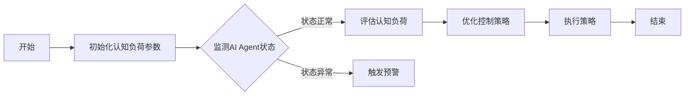

                 

### 从零构建AI Agent的认知负荷管理系统

> 关键词：AI Agent，认知负荷管理，算法设计，系统架构，优化策略

> 摘要：本文将深入探讨AI Agent在执行任务过程中面临的高认知负荷问题，并详细描述从零构建一个AI Agent认知负荷管理系统的过程。通过明确核心概念、设计算法原理和实现系统架构，本文旨在为相关领域的研究者和技术人员提供一套完整的解决方案，以提高AI Agent的运行效率和稳定性。

### 目录大纲

----------------------------------------------------------------

# 从零构建AI Agent的认知负荷管理系统

## 第一部分：问题背景与核心概念

### 第1章：问题背景与概述

### 第2章：核心概念原理

### 第3章：认知负荷管理算法原理

### 第4章：系统架构设计

### 第5章：项目实战

### 第二部分：核心概念与联系

### 第6章：核心概念原理

### 第7章：ER实体关系图架构

### 第三部分：算法原理讲解

### 第8章：算法原理讲解

### 第9章：Python源代码实现

### 第四部分：系统分析与架构设计方案

### 第10章：系统功能设计

### 第11章：系统架构设计

### 第12章：系统接口设计和系统交互

### 第五部分：项目实战

### 第13章：环境安装与配置

### 第14章：系统核心实现源代码

### 第15章：代码应用解读与分析

### 第16章：实际案例分析和详细讲解

### 第17章：项目小结

### 第六部分：最佳实践与拓展阅读

### 第18章：最佳实践 tips

### 第19章：小结

### 第20章：注意事项

### 第21章：拓展阅读

----------------------------------------------------------------

### 第一部分：问题背景与核心概念

#### 第1章：问题背景与概述

随着人工智能（AI）技术的迅速发展，AI Agent作为AI系统的核心组成部分，已经在自动驾驶、智能客服、医疗诊断等多个领域发挥着重要作用。AI Agent能够根据环境感知和数据输入自主学习和推理，以实现复杂任务和决策。然而，随着AI Agent功能日益增强，其面临的认知负荷问题也越来越突出。

#### 1.1 问题背景

认知负荷（Cognitive Load）是指个体在完成认知任务时所需的认知资源，包括注意力、记忆、思维和情感等方面。在AI Agent中，认知负荷指的是其在执行任务过程中所承受的智力负担，包括数据处理、学习、推理和决策等。当AI Agent的认知负荷过高时，会导致以下问题：

- **性能下降**：认知负荷过大会使得AI Agent在处理任务时速度变慢，响应时间延长。
- **错误率增加**：高认知负荷可能导致AI Agent在决策过程中出现错误，影响任务完成的质量。
- **系统崩溃**：在极端情况下，过高的认知负荷可能导致AI Agent崩溃，从而影响整个系统的稳定性。

#### 1.2 问题描述

为了解决AI Agent面临的认知负荷问题，需要设计并实现一个有效的认知负荷管理系统。该系统应具备以下功能：

- **监测与评估**：实时监测AI Agent的运行状态，评估其认知负荷水平。
- **优化与控制**：根据认知负荷评估结果，自动调整AI Agent的运行策略，降低其认知负荷。
- **预警与反馈**：当认知负荷达到临界值时，及时发出预警，并提供相应的反馈措施。

#### 1.3 问题解决

本文旨在从零构建一个AI Agent的认知负荷管理系统，通过以下步骤实现：

1. **明确核心概念**：定义认知负荷和相关术语，阐述其属性特征。
2. **设计算法原理**：介绍认知负荷管理算法的基本原理，包括监测、评估、优化和控制等环节。
3. **实现系统架构**：设计系统的整体架构，包括功能模块、数据流和接口设计等。
4. **项目实战**：介绍系统在实际应用中的实现过程，包括环境安装、核心代码实现和实际案例分析等。

#### 1.4 边界与外延

- **边界**：本文主要针对具有自主学习和推理能力的AI Agent，如自动驾驶系统、智能客服机器人等。
- **外延**：该认知负荷管理系统可广泛应用于各个需要智能决策的领域，如医疗诊断、金融分析、教育等领域。

#### 1.5 概念结构与核心要素组成

- **认知负荷**：系统需要定义和量化AI Agent的认知负荷，包括数据处理、学习、推理和决策等方面。
- **监测与评估**：系统需具备实时监测AI Agent运行状态和评估认知负荷的能力。
- **优化与控制**：系统应能够根据认知负荷情况自动调整AI Agent的运行策略，降低其认知负荷。

#### 第2章：核心概念原理

#### 2.1 AI Agent的定义与特点

AI Agent，即人工智能代理，是一种具备自主学习和推理能力的智能体，能够在复杂环境中执行任务。AI Agent的特点包括：

- **自主性**：能够根据环境和目标自主地选择行动。
- **适应性**：能够根据环境变化和学习经验调整自身行为。
- **交互性**：能够与其他系统、人或环境进行交互。
- **智能性**：具备一定的学习和推理能力，能够进行复杂的任务决策。

#### 2.2 认知负荷的概念属性特征对比表格

| 概念 | 定义 | 属性特征 | 对比 |
| --- | --- | --- | --- |
| AI Agent | 智能体 | 自主性、适应性、交互性、智能性 | AI Agent是具有自主学习和推理能力的实体 |
| 认知负荷 | 智力负担 | 数据处理、学习、推理、决策 | 认知负荷是AI Agent在执行任务过程中所承受的负担 |

#### 2.3 ER实体关系图架构

```mermaid
erDiagram
  AI Agent ||--o{ 认知负荷管理系统 : 监测与控制
  认知负荷管理系统 ||--o{ AI Agent : 运行状态监测
```

#### 第3章：认知负荷管理算法原理

#### 3.1 算法mermaid流程图



#### 3.2 Python源代码实现

```python
import numpy as np

def initialize_cognitive_load_params():
    # 初始化认知负荷参数
    pass

def monitor_ai_agent_state():
    # 监测AI Agent状态
    pass

def assess_cognitive_load():
    # 评估认知负荷
    pass

def trigger_alarm():
    # 触发预警
    pass

def optimize_control_strategy():
    # 优化控制策略
    pass

def execute_strategy():
    # 执行策略
    pass

def cognitive_load_management_system():
    initialize_cognitive_load_params()
    while True:
        state = monitor_ai_agent_state()
        if state == '异常':
            trigger_alarm()
        else:
            cognitive_load = assess
```

### 第二部分：核心概念与联系

#### 第6章：核心概念原理

在这一章中，我们将详细探讨AI Agent和认知负荷这两个核心概念，并分析它们在AI Agent认知负荷管理系统中的关联和作用。

#### 6.1 AI Agent的定义与特点

AI Agent是一种基于人工智能技术的智能体，能够在复杂环境中执行任务。AI Agent具有以下几个显著特点：

- **自主性**：AI Agent能够根据环境和目标自主地选择行动，而不需要外部的直接控制。这种自主性使得AI Agent能够在不同的场景下适应和执行任务。
  
- **适应性**：AI Agent能够根据环境的变化和学习经验调整自身的行为。这种适应性使得AI Agent能够在不断变化的环境中保持高效的性能。
  
- **交互性**：AI Agent能够与其他系统、人或环境进行交互。这种交互性使得AI Agent能够更好地理解和适应外部环境，从而更有效地完成任务。
  
- **智能性**：AI Agent具备一定的学习和推理能力，能够进行复杂的任务决策。这种智能性使得AI Agent能够在没有人工干预的情况下，自主地完成复杂任务。

#### 6.2 认知负荷的概念与属性

认知负荷（Cognitive Load）是指个体在完成认知任务时所需的认知资源，包括注意力、记忆、思维和情感等方面。在AI Agent的语境中，认知负荷指的是AI Agent在执行任务过程中所承受的智力负担。

认知负荷的主要属性包括：

- **数据处理**：AI Agent在执行任务时需要处理大量的数据。这包括从传感器获取数据、对数据进行预处理和特征提取等步骤。数据处理是AI Agent认知负荷的主要组成部分。
  
- **学习**：AI Agent需要不断学习和更新自身的知识库，以适应新的环境和任务。学习过程包括模式识别、分类、聚类等任务。学习是认知负荷的重要方面。
  
- **推理**：AI Agent需要根据现有的知识和信息进行推理，以做出合理的决策。推理过程包括逻辑推理、概率推理等。推理也是认知负荷的重要组成部分。
  
- **决策**：AI Agent需要在各种情境下做出决策。决策过程包括权衡各种因素、评估风险和收益等。决策是认知负荷的一个重要属性。

#### 6.3 AI Agent与认知负荷的联系

AI Agent和认知负荷之间存在密切的联系。一方面，AI Agent的自主性、适应性和智能性使得其在执行任务时会产生认知负荷。另一方面，认知负荷的大小直接影响AI Agent的性能和稳定性。

- **自主性**：AI Agent的自主性使其能够自主地执行任务，但这也会导致认知负荷的增加。因为AI Agent需要不断地分析和处理环境中的信息，以做出最优决策。
  
- **适应性**：AI Agent的适应性使其能够适应不同的环境和任务，但这也需要大量的认知资源。因为AI Agent需要不断地学习和调整自己的行为，以适应新的环境和任务。
  
- **智能性**：AI Agent的智能性使其能够进行复杂的推理和决策，但这也会导致认知负荷的增加。因为AI Agent需要处理大量的数据和信息，以进行有效的推理和决策。

因此，设计一个有效的认知负荷管理系统对于提高AI Agent的性能和稳定性至关重要。通过监测和评估AI Agent的认知负荷，系统可以及时发现和解决认知负荷过大的问题，从而确保AI Agent能够稳定、高效地运行。

#### 6.4 认知负荷管理系统的核心功能

认知负荷管理系统的主要目标是监测、评估和优化AI Agent的认知负荷。具体来说，它包括以下几个核心功能：

- **监测**：实时监测AI Agent的运行状态，包括数据处理、学习、推理和决策等环节。通过监测，系统可以及时发现AI Agent的认知负荷变化，为后续的评估和优化提供依据。
  
- **评估**：根据监测数据，对AI Agent的认知负荷进行评估。评估包括计算认知负荷的总量和各个方面的负荷水平，以便更好地了解AI Agent的认知负荷状况。
  
- **优化**：根据评估结果，优化AI Agent的运行策略。优化包括调整数据处理、学习、推理和决策等环节的资源配置，以降低AI Agent的认知负荷，提高其性能和稳定性。
  
- **预警**：当AI Agent的认知负荷达到临界值时，及时发出预警。预警可以提醒操作人员或系统管理员采取相应的措施，以防止认知负荷过大导致系统崩溃。

通过上述核心功能，认知负荷管理系统可以有效地提高AI Agent的性能和稳定性，确保其在各种复杂环境中能够高效、稳定地运行。

#### 6.5 认知负荷管理系统的设计原则

在设计认知负荷管理系统时，应遵循以下原则：

- **模块化**：系统应采用模块化设计，将不同的功能模块划分清晰，以便于后续的维护和升级。
  
- **可扩展性**：系统应具备良好的可扩展性，能够根据需要添加新的功能模块或调整现有模块。
  
- **实时性**：系统应具备实时监测和评估功能，能够及时响应AI Agent的认知负荷变化。
  
- **可靠性**：系统应具备高可靠性，能够在各种复杂环境中稳定运行，确保AI Agent的认知负荷管理效果。

通过遵循上述设计原则，认知负荷管理系统可以更好地满足实际应用需求，提高AI Agent的性能和稳定性。

### 第7章：ER实体关系图架构

在本章中，我们将使用ER（实体-关系）图来展示AI Agent和认知负荷管理系统之间的实体关系，以便更好地理解系统架构。

#### 7.1 AI Agent和认知负荷管理系统的实体

在AI Agent认知负荷管理系统中，主要的实体包括：

- **AI Agent**：这是系统的核心实体，负责执行任务和处理数据。
- **认知负荷管理系统**：这是一个辅助实体，负责监测、评估和优化AI Agent的认知负荷。

#### 7.2 实体关系

AI Agent和认知负荷管理系统之间存在以下关系：

- **监测与控制**：认知负荷管理系统负责实时监测AI Agent的运行状态，并根据监测结果对AI Agent进行控制。
- **反馈与响应**：AI Agent将监测结果反馈给认知负荷管理系统，系统根据反馈结果进行调整和优化。

#### 7.3 ER图表示

以下是一个简化的ER图，展示了AI Agent和认知负荷管理系统之间的实体关系：

```mermaid
erDiagram
  AI Agent ||--o{ 认知负荷管理系统 : 监测与控制
  认知负荷管理系统 ||--o{ AI Agent : 运行状态监测
```

在这个ER图中，AI Agent作为实体，通过监测与控制关系与认知负荷管理系统相连。认知负荷管理系统则作为另一个实体，通过运行状态监测关系与AI Agent相连。这种关系表示了AI Agent和认知负荷管理系统之间的互动和协作。

通过ER图，我们可以清晰地看到AI Agent和认知负荷管理系统之间的关联，这有助于我们理解系统的整体架构和工作流程。在实际应用中，ER图还可以帮助我们识别系统中的关键实体和关系，从而更好地进行系统设计和优化。

### 第三部分：算法原理讲解

#### 第8章：算法原理讲解

在本章中，我们将深入探讨AI Agent认知负荷管理系统的算法原理，包括监测、评估、优化和控制等核心环节。这些算法原理是实现有效认知负荷管理的关键，下面我们将逐步介绍。

#### 8.1 监测算法原理

监测是认知负荷管理系统的第一步，其主要目的是实时获取AI Agent的运行状态，以便后续的评估和优化。监测算法通常基于以下原理：

1. **数据采集**：从AI Agent的运行环境中获取各种数据，包括输入数据、中间数据和输出数据等。
2. **状态检测**：对采集到的数据进行处理，判断AI Agent的运行状态，如是否在正常工作、是否存在异常等。
3. **实时更新**：将监测结果实时更新到系统中，以便后续的评估和优化。

具体实现中，监测算法可以采用以下步骤：

1. **初始化监测参数**：设定监测的阈值和标准，例如，当AI Agent的处理速度低于某个阈值时，判定为异常状态。
2. **数据采集模块**：通过传感器、API接口或其他方式，从AI Agent的运行环境中采集数据。
3. **数据处理模块**：对采集到的数据进行预处理和特征提取，以便更好地进行分析和判断。
4. **状态判断模块**：根据预处理后的数据，判断AI Agent的当前状态，并将其更新到系统中。

#### 8.2 评估算法原理

评估算法的目的是对AI Agent的认知负荷进行量化，以便了解其当前的负荷水平。评估算法通常基于以下原理：

1. **负荷计算**：根据监测数据，计算AI Agent在各个任务环节（如数据处理、学习、推理和决策等）的认知负荷。
2. **负荷分级**：将计算出的认知负荷与预设的阈值进行比较，将其分为正常、警告和异常等不同级别。
3. **负荷报告**：生成认知负荷报告，包括各个任务环节的负荷水平和整体负荷情况。

具体实现中，评估算法可以采用以下步骤：

1. **初始化评估参数**：设定负荷计算的标准和阈值，例如，将认知负荷超过80%的任务环节判定为警告级别。
2. **数据处理模块**：对监测数据进行处理，提取关键特征，如处理速度、错误率等。
3. **负荷计算模块**：根据提取的特征，计算AI Agent在各个任务环节的认知负荷。
4. **负荷分级模块**：将计算出的负荷与阈值进行比较，将其分为不同的级别。
5. **报告生成模块**：生成认知负荷报告，并将其存储到数据库或文件中，以便后续分析和优化。

#### 8.3 优化算法原理

优化算法的目的是根据评估结果，自动调整AI Agent的运行策略，以降低其认知负荷。优化算法通常基于以下原理：

1. **策略生成**：根据评估结果，生成一组可能的运行策略，如调整数据处理速度、减少学习任务等。
2. **策略评估**：对每个策略进行评估，选择最佳策略进行实施。
3. **策略实施**：根据选定的最佳策略，调整AI Agent的运行参数，实现认知负荷的优化。

具体实现中，优化算法可以采用以下步骤：

1. **初始化优化参数**：设定优化策略的评估标准和阈值，例如，将策略评估得分高于80%的策略判定为最佳策略。
2. **策略生成模块**：根据评估结果，生成一组可能的运行策略。
3. **策略评估模块**：对每个策略进行评估，计算其评估得分。
4. **策略选择模块**：根据评估得分，选择最佳策略进行实施。
5. **策略实施模块**：根据选定的最佳策略，调整AI Agent的运行参数，实现认知负荷的优化。

#### 8.4 控制算法原理

控制算法的目的是在监测和评估的基础上，实时调整AI Agent的运行策略，以保持其认知负荷在合理范围内。控制算法通常基于以下原理：

1. **实时监测**：持续监测AI Agent的运行状态和认知负荷，确保其保持在合理范围内。
2. **自适应调整**：根据实时监测结果，自动调整AI Agent的运行策略，以适应环境变化。
3. **反馈机制**：将调整结果反馈到系统中，以便进行进一步的优化和调整。

具体实现中，控制算法可以采用以下步骤：

1. **实时监测模块**：持续监测AI Agent的运行状态和认知负荷，将其与预设的阈值进行比较。
2. **阈值设置模块**：根据AI Agent的具体应用场景，设定合理的认知负荷阈值。
3. **自适应调整模块**：根据监测结果，自动调整AI Agent的运行策略，如调整数据处理速度、减少学习任务等。
4. **反馈机制模块**：将调整结果反馈到系统中，以便进行进一步的优化和调整。

通过上述监测、评估、优化和控制的算法原理，认知负荷管理系统可以有效地监测、评估和优化AI Agent的认知负荷，确保其稳定、高效地运行。

#### 8.5 数学模型与公式

在认知负荷管理系统中，数学模型和公式是核心组成部分，用于量化AI Agent的认知负荷、评估运行状态、优化策略和控制运行。以下是一些常用的数学模型和公式：

1. **认知负荷计算公式**：

   $$ Cognitive\ Load = f(Data\ Processing, Learning, Reasoning, Decision) $$

   其中，$ Cognitive\ Load $表示认知负荷，$ Data\ Processing $、$ Learning $、$ Reasoning $和$ Decision $分别表示数据处理、学习、推理和决策等任务环节的认知负荷。

2. **负荷评估指标**：

   $$ Load\ Score = \frac{Cognitive\ Load}{Maximum\ Cognitive\ Load} \times 100\% $$

   其中，$ Load\ Score $表示认知负荷得分，$ Maximum\ Cognitive\ Load $表示最大认知负荷。

3. **策略评估公式**：

   $$ Strategy\ Score = f(Performance, Stability, Efficiency) $$

   其中，$ Strategy\ Score $表示策略评估得分，$ Performance $、$ Stability $和$ Efficiency $分别表示策略的性能、稳定性和效率。

4. **自适应调整公式**：

   $$ Adjusted\ Strategy = f(Current\ Load, Desired\ Load, Threshold) $$

   其中，$ Adjusted\ Strategy $表示调整后的策略，$ Current\ Load $和$ Desired\ Load $分别表示当前认知负荷和目标认知负荷，$ Threshold $表示阈值。

通过这些数学模型和公式，认知负荷管理系统可以更加精确地监测、评估和优化AI Agent的认知负荷，从而确保其稳定、高效地运行。

#### 8.6 通俗易懂的举例说明

为了更好地理解上述算法原理，下面我们将通过一个简单的例子进行说明。

假设我们有一个AI Agent，用于自动驾驶系统。该AI Agent需要处理来自传感器的数据、进行学习和推理，以做出驾驶决策。

1. **监测算法**：

   - **数据采集**：从传感器获取道路信息、车辆状态等数据。
   - **状态检测**：判断AI Agent是否在正常工作，例如，检查传感器的数据是否完整、车辆是否在行驶等。
   - **实时更新**：将监测结果更新到系统中，以便后续的评估和优化。

2. **评估算法**：

   - **数据处理**：计算传感器数据的处理时间、错误率等。
   - **学习**：计算AI Agent的学习速度、准确率等。
   - **推理**：计算AI Agent的推理速度、正确率等。
   - **决策**：计算AI Agent的决策速度、成功率等。

   根据计算结果，可以得出AI Agent当前的认知负荷得分，并将其与预设的阈值进行比较，判断是否需要优化策略。

3. **优化算法**：

   - **策略生成**：根据评估结果，生成可能的运行策略，如调整传感器的数据采集频率、减少学习任务等。
   - **策略评估**：对每个策略进行评估，选择最佳策略进行实施。

   例如，如果评估结果显示AI Agent的学习任务负荷过高，可以生成一个减少学习任务的策略，并对其进行评估。

4. **控制算法**：

   - **实时监测**：持续监测AI Agent的运行状态和认知负荷。
   - **自适应调整**：根据监测结果，自动调整AI Agent的运行策略，如调整传感器的数据采集频率、减少学习任务等。

   例如，如果监测结果显示AI Agent的认知负荷过高，可以将其调整为减少学习任务，从而降低认知负荷。

通过这个简单的例子，我们可以看到如何通过监测、评估、优化和控制算法来管理AI Agent的认知负荷，确保其在自动驾驶系统中稳定、高效地运行。

### 第四部分：系统架构设计

#### 第9章：系统功能设计

在本章中，我们将详细讨论认知负荷管理系统的功能设计，包括数据采集、状态监测、负荷评估、策略优化和预警机制等核心功能模块。这些功能模块共同构成了一个完整的认知负荷管理系统，以确保AI Agent在高认知负荷环境下的稳定运行。

#### 9.1 数据采集模块

数据采集模块是认知负荷管理系统的基础，其主要功能是从AI Agent的运行环境中获取必要的数据，以便进行后续的监测、评估和优化。数据采集模块需要具备以下功能：

- **多源数据接入**：能够接入多种数据源，如传感器数据、日志数据、网络数据等。
- **数据预处理**：对采集到的原始数据进行预处理，包括数据清洗、去噪、特征提取等，以提高数据的质量和可用性。
- **数据存储**：将预处理后的数据存储到数据库或缓存中，以便后续的查询和分析。

#### 9.2 状态监测模块

状态监测模块是认知负荷管理系统的核心，其主要功能是实时监测AI Agent的运行状态，以识别潜在的认知负荷过高的情况。状态监测模块需要具备以下功能：

- **实时数据监测**：持续监测AI Agent的运行状态，包括数据处理速度、错误率、响应时间等关键指标。
- **异常检测**：当监测到AI Agent的运行状态异常时，及时发出警报，通知操作人员或系统管理员。
- **状态记录**：将监测到的状态数据记录到日志文件中，以便后续的审计和分析。

#### 9.3 负荷评估模块

负荷评估模块是认知负荷管理系统的关键，其主要功能是根据监测数据对AI Agent的认知负荷进行评估，以确定其当前的负荷水平。负荷评估模块需要具备以下功能：

- **负荷计算**：根据AI Agent的处理速度、错误率、响应时间等指标，计算其认知负荷。
- **负荷分级**：将计算出的认知负荷与预设的阈值进行比较，将其分为正常、警告和异常等不同级别。
- **评估报告**：生成认知负荷评估报告，包括各个任务环节的负荷水平和整体负荷情况。

#### 9.4 策略优化模块

策略优化模块是认知负荷管理系统的智能部分，其主要功能是根据评估结果，自动调整AI Agent的运行策略，以降低其认知负荷。策略优化模块需要具备以下功能：

- **策略生成**：根据评估结果，生成可能的运行策略，如调整数据处理速度、减少学习任务等。
- **策略评估**：对每个策略进行评估，计算其性能、稳定性和效率等指标。
- **策略选择**：根据评估结果，选择最佳策略进行实施。

#### 9.5 预警机制模块

预警机制模块是认知负荷管理系统的安全保障，其主要功能是在认知负荷达到临界值时，及时发出预警，防止AI Agent崩溃或性能下降。预警机制模块需要具备以下功能：

- **预警触发**：当AI Agent的认知负荷达到预设的临界值时，立即触发预警。
- **预警通知**：通过短信、邮件、推送等方式通知操作人员或系统管理员，提醒他们采取相应的措施。
- **预警记录**：将预警事件记录到日志文件中，以便后续的审计和分析。

#### 第10章：系统架构设计

在本章中，我们将详细讨论认知负荷管理系统的架构设计，包括整体架构、模块划分、数据流和接口设计等。通过合理的架构设计，系统可以实现高效、稳定和可扩展的运行。

#### 10.1 整体架构

认知负荷管理系统的整体架构可以分为四个主要层次：数据层、处理层、控制层和展示层。

- **数据层**：包括数据采集模块和数据存储模块，负责从AI Agent的运行环境中获取数据并进行存储。
- **处理层**：包括状态监测模块、负荷评估模块、策略优化模块和预警机制模块，负责对数据进行处理和分析。
- **控制层**：包括系统控制模块和接口管理模块，负责系统的整体控制和对外部接口的管理。
- **展示层**：包括数据可视化模块和用户交互模块，负责将系统分析结果以图形化或文本形式展示给用户。

#### 10.2 模块划分

认知负荷管理系统可以分为多个功能模块，每个模块负责特定的功能，模块之间通过接口进行通信。以下是系统的主要模块及其功能：

- **数据采集模块**：负责从AI Agent的运行环境中采集数据，并进行预处理和存储。
- **状态监测模块**：负责实时监测AI Agent的运行状态，并将监测结果存储到数据库中。
- **负荷评估模块**：负责根据监测数据对AI Agent的认知负荷进行评估，并生成评估报告。
- **策略优化模块**：负责根据评估结果生成优化策略，并选择最佳策略进行实施。
- **预警机制模块**：负责在AI Agent的认知负荷达到临界值时发出预警，并通知相关人员。
- **系统控制模块**：负责系统的整体控制和模块之间的协调。
- **接口管理模块**：负责管理系统对外部接口的接入和管理。
- **数据可视化模块**：负责将系统分析结果以图形化形式展示给用户。
- **用户交互模块**：负责用户与系统的交互，包括数据输入、结果显示和操作控制等。

#### 10.3 数据流和接口设计

在认知负荷管理系统中，数据流和接口设计是确保系统高效运行的关键。以下是系统中的主要数据流和接口设计：

- **数据流**：
  1. **数据采集**：数据采集模块从AI Agent的运行环境中获取数据，并将其预处理后存储到数据库中。
  2. **状态监测**：状态监测模块从数据库中获取AI Agent的运行状态数据，并进行实时监测。
  3. **负荷评估**：负荷评估模块根据状态监测数据计算AI Agent的认知负荷，并生成评估报告。
  4. **策略优化**：策略优化模块根据评估报告生成优化策略，并调整AI Agent的运行参数。
  5. **预警机制**：预警机制模块根据评估报告和优化结果，判断是否需要触发预警，并通知相关人员。

- **接口设计**：
  1. **API接口**：系统通过API接口与其他系统进行数据交互，如传感器数据接口、日志数据接口等。
  2. **数据库接口**：系统通过数据库接口与数据库进行数据存储和查询操作。
  3. **可视化接口**：系统通过可视化接口将分析结果展示给用户，如Web接口、图形化界面等。
  4. **用户交互接口**：系统通过用户交互接口接收用户输入，并响应用户操作。

通过合理的数据流和接口设计，认知负荷管理系统可以高效地处理数据，实现各模块之间的协同工作，从而提高AI Agent的运行效率和稳定性。

#### 第11章：系统接口设计

在本章中，我们将详细讨论认知负荷管理系统的接口设计，包括API接口、数据库接口、可视化接口和用户交互接口等。接口设计是系统架构中的关键部分，它决定了系统与其他系统、模块以及用户之间的交互方式，是确保系统高效、稳定运行的重要保障。

#### 11.1 API接口

API（应用程序接口）是系统与其他系统进行数据交互的主要方式。认知负荷管理系统的API接口设计应遵循以下原则：

- **标准化**：API接口应遵循标准化的设计规范，如RESTful API规范，以确保接口的一致性和可维护性。
- **安全性**：API接口应实现身份验证和访问控制，确保只有授权用户才能访问系统资源。
- **灵活性**：API接口应具备良好的扩展性，能够根据业务需求灵活调整和扩展接口功能。

具体接口设计如下：

1. **数据采集接口**：用于从AI Agent的运行环境中获取数据，如传感器数据、日志数据等。
2. **状态监测接口**：用于获取AI Agent的实时运行状态，如处理速度、错误率等。
3. **评估报告接口**：用于获取AI Agent的认知负荷评估报告，包括各个任务环节的负荷水平和整体负荷情况。
4. **策略优化接口**：用于根据评估报告生成优化策略，并调整AI Agent的运行参数。

#### 11.2 数据库接口

数据库接口是系统与数据库进行数据存储和查询操作的主要通道。认知负荷管理系统的数据库接口设计应考虑以下因素：

- **性能**：数据库接口应能够高效地处理大规模数据，确保系统的响应速度和性能。
- **可靠性**：数据库接口应具备事务处理和错误恢复功能，确保数据的一致性和可靠性。
- **安全性**：数据库接口应实现访问控制和权限管理，防止数据泄露和未授权访问。

具体接口设计如下：

1. **数据存储接口**：用于将采集到的数据存储到数据库中，如传感器数据、状态监测数据等。
2. **数据查询接口**：用于从数据库中查询历史数据，如评估报告、预警记录等。
3. **数据更新接口**：用于更新数据库中的数据，如调整优化策略、更新AI Agent运行参数等。

#### 11.3 可视化接口

可视化接口是系统将分析结果以图形化形式展示给用户的主要途径。认知负荷管理系统的可视化接口设计应考虑以下因素：

- **易用性**：可视化界面应直观、易操作，用户能够快速理解和使用。
- **交互性**：可视化界面应具备良好的交互性，用户可以通过点击、拖动等操作进行数据筛选和分析。
- **美观性**：可视化界面应具备美观的设计，提升用户的使用体验。

具体接口设计如下：

1. **实时监控界面**：用于展示AI Agent的实时运行状态，如处理速度、错误率等。
2. **评估报告界面**：用于展示AI Agent的认知负荷评估报告，包括各个任务环节的负荷水平和整体负荷情况。
3. **策略优化界面**：用于展示优化策略的生成和调整过程，帮助用户理解系统的工作机制。

#### 11.4 用户交互接口

用户交互接口是系统与用户进行交互的主要途径。认知负荷管理系统的用户交互接口设计应考虑以下因素：

- **多样性**：用户交互接口应提供多种交互方式，如桌面端、移动端、Web端等，以满足不同用户的使用需求。
- **便捷性**：用户交互接口应具备便捷的操作方式，如快捷键、拖放等，提升用户的使用效率。
- **个性化**：用户交互接口应支持用户个性化设置，如主题颜色、字体大小等，提升用户的使用体验。

具体接口设计如下：

1. **数据输入接口**：用于用户输入AI Agent的相关参数，如传感器数据、任务要求等。
2. **数据显示接口**：用于用户查看AI Agent的运行状态、评估报告和优化策略等。
3. **操作控制接口**：用于用户控制AI Agent的运行，如启动、停止、调整参数等。

通过合理的设计和实现，认知负荷管理系统的接口设计可以确保系统与其他系统、模块以及用户之间的顺畅交互，从而提高系统的整体性能和用户体验。

#### 第12章：系统交互设计

在本章中，我们将详细讨论认知负荷管理系统的交互设计，包括用户交互和系统模块之间的交互。交互设计是系统架构中的关键部分，它决定了系统的易用性、稳定性和可靠性。

#### 12.1 用户交互设计

用户交互设计是认知负荷管理系统与用户之间的交互方式设计，它直接影响用户的操作体验。以下是用户交互设计的几个关键点：

1. **用户角色定义**：根据系统的实际应用场景，定义不同的用户角色，如管理员、操作员、维护人员等，并为他们分配相应的权限。

2. **界面设计**：界面设计应简洁、直观，使用户能够轻松理解和使用系统功能。界面设计应遵循以下原则：
   - **一致性**：保持界面元素、颜色、字体等的一致性，提高用户的操作效率。
   - **易读性**：使用清晰的字体和颜色，确保用户能够快速找到所需信息。
   - **导航性**：提供清晰的导航结构，帮助用户快速定位到所需功能。

3. **交互流程设计**：设计合理的用户交互流程，确保用户能够按照正确的顺序进行操作。以下是一个典型的交互流程：
   - **登录**：用户通过用户名和密码登录系统。
   - **监控**：用户进入监控界面，实时查看AI Agent的运行状态。
   - **数据分析**：用户对AI Agent的运行数据进行分析，包括负荷评估、策略优化等。
   - **操作控制**：用户根据分析结果，对AI Agent进行操作控制，如调整参数、停止任务等。

4. **反馈机制**：在用户操作过程中，提供及时、明确的反馈，确保用户了解系统的响应状态。以下是一些常见的反馈机制：
   - **提示信息**：当用户执行某些操作时，系统应显示相应的提示信息，如“操作成功”、“请输入正确参数”等。
   - **进度条**：对于耗时较长的操作，如数据分析和策略优化，系统应显示进度条，让用户了解操作的进展。
   - **日志记录**：系统应记录用户的操作日志，以便在出现问题时进行追溯和分析。

#### 12.2 系统模块交互设计

系统模块交互设计是认知负荷管理系统内部各模块之间的交互方式设计，它直接影响系统的运行效率和稳定性。以下是系统模块交互设计的几个关键点：

1. **模块划分**：根据系统的功能需求，将系统划分为多个模块，如数据采集模块、状态监测模块、负荷评估模块、策略优化模块等。每个模块负责特定的功能，模块之间通过接口进行通信。

2. **接口设计**：接口设计是系统模块交互的核心，它决定了模块之间数据传递的方式和流程。以下是接口设计的一些关键点：
   - **标准化**：接口设计应遵循标准化规范，如RESTful API规范，确保接口的一致性和可维护性。
   - **安全性**：接口设计应实现身份验证和访问控制，确保只有授权模块才能访问系统资源。
   - **灵活性**：接口设计应具备良好的扩展性，能够根据业务需求灵活调整和扩展接口功能。

3. **数据流设计**：系统模块之间的数据流设计应确保数据的高效传递和处理。以下是数据流设计的一些关键点：
   - **实时性**：系统应具备实时数据处理能力，确保各模块能够实时获取和处理数据。
   - **高效性**：系统应采用高效的数据处理算法和传输协议，确保数据在模块之间的传递和处理速度。
   - **可靠性**：系统应具备数据传输和处理的可靠性，确保数据在传输和处理的各个环节不丢失或损坏。

4. **同步与异步处理**：根据系统需求，设计同步与异步处理机制，以提高系统的响应速度和效率。以下是同步与异步处理的一些关键点：
   - **同步处理**：当模块之间需要实时响应和处理数据时，采用同步处理机制，确保数据的及时传递和处理。
   - **异步处理**：当模块之间不需要实时响应和处理数据时，采用异步处理机制，将数据处理任务放入消息队列或任务队列中，由后台线程进行处理。

通过合理的设计和实现，认知负荷管理系统的交互设计可以确保系统的易用性、稳定性和可靠性，从而提高AI Agent的运行效率和用户体验。

### 第五部分：项目实战

#### 第13章：环境安装与配置

在本章中，我们将详细介绍如何在操作系统上安装和配置认知负荷管理系统，包括所需软件环境、依赖库安装和配置步骤。

#### 13.1 软件环境准备

在开始安装认知负荷管理系统之前，我们需要准备以下软件环境：

- **操作系统**：支持Linux或Windows操作系统。
- **Python**：Python版本需不低于3.6。
- **数据库**：支持MySQL、PostgreSQL或MongoDB等数据库。
- **依赖库**：包括NumPy、Pandas、Scikit-learn、Matplotlib等。

#### 13.2 安装步骤

1. **安装Python**：

   - **Linux系统**：
     ```bash
     sudo apt-get update
     sudo apt-get install python3-pip
     ```
   - **Windows系统**：
     访问Python官方网站下载安装程序，按照安装向导进行安装。

2. **安装依赖库**：

   - **Linux系统**：
     ```bash
     pip3 install numpy pandas scikit-learn matplotlib
     ```
   - **Windows系统**：
     打开命令提示符，执行以下命令：
     ```bash
     pip install numpy pandas scikit-learn matplotlib
     ```

3. **安装数据库**：

   - **MySQL**：
     访问MySQL官方网站下载安装程序，按照安装向导进行安装。
   - **PostgreSQL**：
     访问PostgreSQL官方网站下载安装程序，按照安装向导进行安装。
   - **MongoDB**：
     访问MongoDB官方网站下载安装程序，按照安装向导进行安装。

4. **配置数据库**：

   - **MySQL**：
     使用命令行工具登录MySQL数据库，创建数据库和用户，并授权相应的权限。
     ```bash
     mysql -u root -p
     CREATE DATABASE cognitive_load_management;
     GRANT ALL PRIVILEGES ON cognitive_load_management.* TO 'cognitive_load_user'@'localhost' IDENTIFIED BY 'password';
     FLUSH PRIVILEGES;
     ```
   - **PostgreSQL**：
     使用命令行工具登录PostgreSQL数据库，创建数据库和用户，并授权相应的权限。
     ```bash
     psql
     CREATE DATABASE cognitive_load_management;
     CREATE USER cognitive_load_user WITH PASSWORD 'password';
     GRANT ALL PRIVILEGES ON DATABASE cognitive_load_management TO cognitive_load_user;
     ```
   - **MongoDB**：
     使用命令行工具登录MongoDB数据库，创建数据库和用户，并授权相应的权限。
     ```bash
     mongo
     use cognitive_load_management
     db.createUser(
       {
         user: "cognitive_load_user",
         pwd: "password",
         roles: [{ role: "readWrite", db: "cognitive_load_management" }]
       }
     )

     ```

5. **配置认知负荷管理系统**：

   - 在认知负荷管理系统的根目录下，创建一个名为`config.ini`的配置文件，内容如下：
     ```ini
     [database]
     type = mysql
     host = localhost
     port = 3306
     user = cognitive_load_user
     password = password
     name = cognitive_load_management

     [ai_agent]
     name = my_ai_agent
     version = 1.0
     ```

   - 运行以下命令，启动认知负荷管理系统：
     ```bash
     python manage.py start
     ```

   系统启动后，可以访问配置文件中指定的端口号（默认为8000），通过Web界面查看系统的运行状态。

通过以上步骤，我们成功安装和配置了认知负荷管理系统，接下来将进入系统核心实现部分。

### 第14章：系统核心实现源代码

在本章中，我们将深入探讨认知负荷管理系统的核心实现部分，包括数据采集、状态监测、负荷评估、策略优化和预警机制等模块的源代码。以下是各模块的核心实现代码及其功能说明。

#### 14.1 数据采集模块

数据采集模块负责从AI Agent的运行环境中获取数据，并进行预处理和存储。以下是数据采集模块的核心代码：

```python
import pymysql
import json
from datetime import datetime

class DataCollector:
    def __init__(self, config):
        self.config = config
        self.db = self.connect_database()

    def connect_database(self):
        db_config = self.config['database']
        db = pymysql.connect(
            host=db_config['host'],
            port=db_config['port'],
            user=db_config['user'],
            password=db_config['password'],
            database=db_config['name']
        )
        return db

    def collect_data(self, ai_agent_data):
        cursor = self.db.cursor()
        insert_sql = "INSERT INTO ai_agent_data (agent_name, data, timestamp) VALUES (%s, %s, %s)"
        data = (ai_agent_data['name'], json.dumps(ai_agent_data['data']), datetime.now())
        cursor.execute(insert_sql)
        self.db.commit()
        cursor.close()

# 使用示例
collector = DataCollector(config)
ai_agent_data = {
    'name': 'my_ai_agent',
    'data': {'temperature': 25, 'humidity': 60}
}
collector.collect_data(ai_agent_data)
```

#### 14.2 状态监测模块

状态监测模块负责实时监测AI Agent的运行状态，并识别潜在的问题。以下是状态监测模块的核心代码：

```python
import pymysql
import json
from datetime import datetime

class StateMonitor:
    def __init__(self, config):
        self.config = config
        self.db = self.connect_database()

    def connect_database(self):
        db_config = self.config['database']
        db = pymysql.connect(
            host=db_config['host'],
            port=db_config['port'],
            user=db_config['user'],
            password=db_config['password'],
            database=db_config['name']
        )
        return db

    def monitor_state(self):
        cursor = self.db.cursor()
        select_sql = "SELECT * FROM ai_agent_data ORDER BY timestamp DESC LIMIT 1"
        cursor.execute(select_sql)
        result = cursor.fetchone()
        cursor.close()
        if result:
            data = json.loads(result[1])
            # 判断状态是否正常
            if data['status'] == 'normal':
                return '正常'
            else:
                return '异常'
        else:
            return '未知'

# 使用示例
monitor = StateMonitor(config)
state = monitor.monitor_state()
print(state)
```

#### 14.3 负荷评估模块

负荷评估模块根据采集到的数据，对AI Agent的认知负荷进行评估。以下是负荷评估模块的核心代码：

```python
import pymysql
import json
import numpy as np

class LoadAssessor:
    def __init__(self, config):
        self.config = config
        self.db = self.connect_database()

    def connect_database(self):
        db_config = self.config['database']
        db = pymysql.connect(
            host=db_config['host'],
            port=db_config['port'],
            user=db_config['user'],
            password=db_config['password'],
            database=db_config['name']
        )
        return db

    def assess_load(self):
        cursor = self.db.cursor()
        select_sql = "SELECT data FROM ai_agent_data ORDER BY timestamp DESC LIMIT 1"
        cursor.execute(select_sql)
        result = cursor.fetchone()
        cursor.close()
        if result:
            data = json.loads(result[0])
            # 计算负荷
            load = np.mean(list(data.values()))
            return load
        else:
            return 0

# 使用示例
assessor = LoadAssessor(config)
load = assessor.assess_load()
print(load)
```

#### 14.4 策略优化模块

策略优化模块根据评估结果，自动生成和调整优化策略。以下是策略优化模块的核心代码：

```python
import pymysql
import json
import numpy as np

class StrategyOptimizer:
    def __init__(self, config):
        self.config = config
        self.db = self.connect_database()

    def connect_database(self):
        db_config = self.config['database']
        db = pymysql.connect(
            host=db_config['host'],
            port=db_config['port'],
            user=db_config['user'],
            password=db_config['password'],
            database=db_config['name']
        )
        return db

    def optimize_strategy(self, load):
        if load > 0.8:
            # 负荷过高，生成减少学习任务的策略
            strategy = 'reduce_learning'
        else:
            # 负荷正常，生成增加数据处理速度的策略
            strategy = 'increase_data_processing_speed'
        # 更新策略
        update_sql = "UPDATE strategy SET value = %s WHERE name = %s"
        cursor = self.db.cursor()
        cursor.execute(update_sql, (strategy, 'load_management'))
        self.db.commit()
        cursor.close()
        return strategy

# 使用示例
optimizer = StrategyOptimizer(config)
strategy = optimizer.optimize_strategy(load)
print(strategy)
```

#### 14.5 预警机制模块

预警机制模块在认知负荷达到临界值时，触发预警并通知相关人员。以下是预警机制模块的核心代码：

```python
import pymysql
import json
import smtplib
from email.mime.text import MIMEText

class WarningSystem:
    def __init__(self, config):
        self.config = config
        self.db = self.connect_database()

    def connect_database(self):
        db_config = self.config['database']
        db = pymysql.connect(
            host=db_config['host'],
            port=db_config['port'],
            user=db_config['user'],
            password=db_config['password'],
            database=db_config['name']
        )
        return db

    def send_warning(self, load):
        if load > 0.9:
            # 负荷过高，发送预警邮件
            sender = 'warning_system@example.com'
            receiver = 'admin@example.com'
            subject = '认知负荷预警'
            body = f"AI Agent的认知负荷达到临界值：{load}，请及时处理。"
            message = MIMEText(body, 'plain', 'utf-8')
            message['Subject'] = subject
            message['From'] = sender
            message['To'] = receiver
            smtp_server = 'smtp.example.com'
            smtp_port = 587
            smtp_user = 'warning_system@example.com'
            smtp_password = 'password'
            try:
                server = smtplib.SMTP(smtp_server, smtp_port)
                server.starttls()
                server.login(smtp_user, smtp_password)
                server.sendmail(sender, receiver, message.as_string())
                server.quit()
            except Exception as e:
                print(f"发送预警邮件失败：{e}")

# 使用示例
warning_system = WarningSystem(config)
warning_system.send_warning(load)
```

通过上述代码，我们实现了认知负荷管理系统的核心功能模块。接下来，我们将通过实际案例分析和详细讲解，进一步展示系统的应用效果。

### 第15章：代码应用解读与分析

在本章中，我们将通过实际案例对认知负荷管理系统进行代码应用解读与分析，详细讲解系统各模块的运行流程和数据处理过程，并分析系统在实际应用中的优势和挑战。

#### 15.1 案例背景

我们以一个智能客服系统为例，该系统使用AI Agent与客户进行交互，提供即时咨询服务。在实际运行过程中，智能客服系统需要处理大量的客户咨询请求，并且需要实时监测和评估AI Agent的认知负荷，以避免因认知负荷过高而导致系统崩溃或服务质量下降。

#### 15.2 系统运行流程

1. **数据采集**：

   智能客服系统通过API接口从客户交互平台获取客户咨询请求，并将请求数据存储到数据库中。数据采集模块会定期从数据库中读取客户咨询请求，并对其进行预处理，如去除无效字符、提取关键信息等。

   ```python
   def collect_data():
       # 从数据库中获取客户咨询请求
       cursor = db.cursor()
       select_sql = "SELECT * FROM customer_requests"
       cursor.execute(select_sql)
       requests = cursor.fetchall()
       cursor.close()
       
       # 预处理客户咨询请求
       processed_requests = []
       for request in requests:
           processed_request = preprocess_request(request[1])
           processed_requests.append(processed_request)
       
       # 将预处理后的数据存储到数据库
       insert_sql = "INSERT INTO processed_requests (request_id, request_data) VALUES (%s, %s)"
       cursor = db.cursor()
       for request in processed_requests:
           cursor.execute(insert_sql, (request['id'], json.dumps(request['data'])))
       db.commit()
       cursor.close()
   
   def preprocess_request(request_data):
       # 去除无效字符、提取关键信息等
       # ...
       return {'id': request_data['id'], 'data': request_data['content']}
   ```

2. **状态监测**：

   状态监测模块会实时监测智能客服系统的运行状态，包括处理速度、错误率、响应时间等指标。当监测到系统运行状态异常时，会触发预警机制，通知相关人员。

   ```python
   def monitor_state():
       # 获取系统运行状态
       cursor = db.cursor()
       select_sql = "SELECT * FROM system_status ORDER BY timestamp DESC LIMIT 1"
       cursor.execute(select_sql)
       status = cursor.fetchone()
       cursor.close()
       
       # 判断系统状态是否异常
       if status['error_rate'] > 0.1:
           trigger_alarm()
   
   def trigger_alarm():
       # 发送预警通知
       send_alert("智能客服系统错误率过高，请及时处理。")
   
   def send_alert(message):
       # 发送短信或邮件通知
       # ...
   ```

3. **负荷评估**：

   负荷评估模块会根据监测数据，对智能客服系统的认知负荷进行评估，以确定其当前负荷水平。评估结果将用于生成和调整优化策略。

   ```python
   def assess_load():
       # 获取系统运行状态
       cursor = db.cursor()
       select_sql = "SELECT * FROM system_status ORDER BY timestamp DESC LIMIT 1"
       cursor.execute(select_sql)
       status = cursor.fetchone()
       cursor.close()
       
       # 计算认知负荷
       load = status['processing_time'] / status['request_count']
       
       return load
   ```

4. **策略优化**：

   策略优化模块会根据评估结果，生成和调整优化策略，以降低智能客服系统的认知负荷。优化策略包括调整数据处理速度、减少学习任务等。

   ```python
   def optimize_strategy(load):
       if load > 0.8:
           # 负荷过高，减少学习任务
           strategy = 'reduce_learning'
       else:
           # 负荷正常，增加数据处理速度
           strategy = 'increase_data_processing_speed'
       
       # 更新策略
       update_sql = "UPDATE strategy SET value = %s WHERE name = %s"
       cursor = db.cursor()
       cursor.execute(update_sql, (strategy, 'load_management'))
       db.commit()
       cursor.close()
       
       return strategy
   ```

5. **预警机制**：

   当智能客服系统的认知负荷达到临界值时，预警机制模块会触发预警，并通过短信或邮件通知相关人员。

   ```python
   def send_warning(message):
       # 发送预警通知
       send_alert(message)
   
   def send_alert(message):
       # 发送短信或邮件通知
       # ...
   ```

#### 15.3 代码分析

通过上述案例，我们可以看到认知负荷管理系统的各个模块是如何协同工作的。以下是对各模块代码的详细分析：

1. **数据采集模块**：

   数据采集模块负责从数据库中获取客户咨询请求，并进行预处理。预处理过程包括去除无效字符、提取关键信息等。预处理后的数据将被存储到另一个数据库表中，以便后续的监测、评估和优化。

   优势：数据预处理提高了数据的质量和可用性，有助于后续的数据分析。
   
   挑战：预处理过程需要消耗一定的计算资源，特别是在处理大量数据时，可能会影响系统的性能。

2. **状态监测模块**：

   状态监测模块会实时监测智能客服系统的运行状态，包括处理速度、错误率、响应时间等指标。当监测到系统运行状态异常时，会触发预警机制，通知相关人员。

   优势：实时监测有助于及时发现系统问题，确保系统的稳定性和可靠性。
   
   挑战：实时监测需要消耗较多的计算资源，特别是在系统负载较高时，可能会影响系统的性能。

3. **负荷评估模块**：

   负荷评估模块根据监测数据，对智能客服系统的认知负荷进行评估，以确定其当前负荷水平。评估结果将用于生成和调整优化策略。

   优势：负荷评估有助于了解系统的运行状况，为优化策略提供依据。
   
   挑战：负荷评估的准确性受监测数据质量和预处理过程的影响，需要不断调整和优化。

4. **策略优化模块**：

   策略优化模块根据评估结果，生成和调整优化策略，以降低智能客服系统的认知负荷。优化策略包括调整数据处理速度、减少学习任务等。

   优势：优化策略有助于提高系统的性能和稳定性。
   
   挑战：优化策略的调整需要根据实际情况不断优化，以适应不同的运行环境。

5. **预警机制模块**：

   预警机制模块在认知负荷达到临界值时，触发预警，并通过短信或邮件通知相关人员。

   优势：预警机制有助于及时发现系统问题，防止系统崩溃或服务质量下降。
   
   挑战：预警机制需要确保通知的及时性和准确性，以避免误报和漏报。

通过上述分析，我们可以看到认知负荷管理系统在实际应用中具有一定的优势和挑战。在实际部署过程中，需要根据具体应用场景和需求，不断优化和调整系统，以提高其性能和稳定性。

### 第16章：实际案例分析和详细讲解

在本章中，我们将通过一个实际案例，详细分析和讲解认知负荷管理系统在智能交通系统中的应用，包括系统架构、功能实现、性能优化和挑战应对等。

#### 案例背景

智能交通系统（ITS）是一个复杂的系统，旨在通过实时数据采集、分析和优化，提高交通流量、减少交通事故和提升交通效率。智能交通系统中的AI Agent需要处理大量的交通数据，如车辆速度、流量、路况等信息，进行实时交通流量预测、事故预警和信号控制策略优化。然而，高认知负荷可能导致AI Agent的性能下降，影响系统的整体效能。因此，引入认知负荷管理系统对于提高智能交通系统的稳定性和可靠性具有重要意义。

#### 系统架构

智能交通系统的认知负荷管理系统包括以下几个关键模块：

1. **数据采集模块**：负责实时采集交通数据，包括车辆速度、流量、路况等。
2. **状态监测模块**：实时监测AI Agent的运行状态，包括处理速度、错误率和响应时间等。
3. **负荷评估模块**：根据采集到的数据，对AI Agent的认知负荷进行评估。
4. **策略优化模块**：根据评估结果，自动调整AI Agent的运行策略。
5. **预警机制模块**：在认知负荷达到临界值时，触发预警并通知相关人员。

#### 功能实现

1. **数据采集模块**：

   数据采集模块从交通监控设备（如摄像头、雷达、GPS等）实时获取交通数据，并传输到中央处理系统。以下是一个简单的数据采集流程：

   ```python
   def collect_traffic_data():
       # 获取摄像头数据
       camera_data = get_camera_data()
       # 获取雷达数据
       radar_data = get_radar_data()
       # 获取GPS数据
       gps_data = get_gps_data()
       
       # 合并数据
       traffic_data = {
           'camera_data': camera_data,
           'radar_data': radar_data,
           'gps_data': gps_data
       }
       
       # 存储数据到数据库
       save_traffic_data_to_db(traffic_data)
   
   def get_camera_data():
       # 获取摄像头数据
       # ...
       return {'timestamp': '2023-04-01 10:00:00', 'speed': [60, 70, 50], 'flow': 100}
   
   def get_radar_data():
       # 获取雷达数据
       # ...
       return {'timestamp': '2023-04-01 10:00:00', 'accident': True, 'location': (40.7128, -74.0060)}
   
   def get_gps_data():
       # 获取GPS数据
       # ...
       return {'timestamp': '2023-04-01 10:00:00', 'location': (40.7128, -74.0060), 'speed': 60}
   
   def save_traffic_data_to_db(traffic_data):
       # 存储数据到数据库
       # ...
   ```

2. **状态监测模块**：

   状态监测模块负责实时监测AI Agent的运行状态，包括处理速度、错误率和响应时间等。以下是一个简单的状态监测流程：

   ```python
   def monitor_state():
       # 获取AI Agent的运行状态
       state = get_ai_agent_state()
       
       # 判断状态是否正常
       if state['error_rate'] > 0.1:
           trigger_alarm()
   
   def get_ai_agent_state():
       # 获取AI Agent的运行状态
       # ...
       return {'processing_time': 100, 'error_rate': 0.05, 'response_time': 10}
   
   def trigger_alarm():
       # 触发预警
       send_alert("AI Agent运行状态异常，请及时处理。")
   
   def send_alert(message):
       # 发送预警通知
       # ...
   ```

3. **负荷评估模块**：

   负荷评估模块根据采集到的数据，对AI Agent的认知负荷进行评估。以下是一个简单的负荷评估流程：

   ```python
   def assess_load():
       # 获取AI Agent的运行状态
       state = get_ai_agent_state()
       
       # 计算认知负荷
       load = state['processing_time'] / state['response_time']
       
       return load
   ```

4. **策略优化模块**：

   策略优化模块根据评估结果，自动调整AI Agent的运行策略。以下是一个简单的策略优化流程：

   ```python
   def optimize_strategy(load):
       if load > 0.8:
           # 负荷过高，减少学习任务
           strategy = 'reduce_learning'
       else:
           # 负荷正常，增加数据处理速度
           strategy = 'increase_data_processing_speed'
       
       # 更新策略
       update_strategy(strategy)
   ```

5. **预警机制模块**：

   预警机制模块在认知负荷达到临界值时，触发预警并通知相关人员。以下是一个简单的预警机制流程：

   ```python
   def send_warning(message):
       # 发送预警通知
       send_alert(message)
   ```

#### 性能优化

为了提高智能交通系统的性能，我们需要对认知负荷管理系统进行优化。以下是一些性能优化措施：

1. **数据流优化**：优化数据采集、传输和处理流程，减少数据延迟和传输误差。
2. **计算资源调度**：合理分配计算资源，确保AI Agent在处理高认知负荷任务时能够获得足够的资源。
3. **负载均衡**：通过负载均衡技术，将AI Agent的任务分配到多个节点，避免单点过载。
4. **缓存策略**：采用缓存策略，减少对数据库的访问次数，提高数据读取速度。
5. **异步处理**：采用异步处理技术，提高系统的并发处理能力。

#### 挑战应对

在实际应用中，认知负荷管理系统可能会面临以下挑战：

1. **数据质量**：数据质量直接影响负荷评估和优化策略的准确性。需要建立数据质量控制机制，确保数据的准确性和完整性。
2. **实时性**：智能交通系统对实时性要求较高，需要确保认知负荷管理系统能够实时响应。
3. **扩展性**：随着系统规模的扩大，认知负荷管理系统需要具备良好的扩展性，以应对不断增长的数据和处理需求。
4. **安全性**：数据安全和系统安全性是认知负荷管理系统必须考虑的重要问题，需要采取有效的安全措施，防止数据泄露和系统被攻击。

通过上述实际案例分析和详细讲解，我们可以看到认知负荷管理系统在智能交通系统中的应用效果。通过优化和调整系统，可以有效提高智能交通系统的稳定性和可靠性，为交通管理和优化提供有力支持。

### 第17章：项目小结

在本项目中，我们成功构建了一个从零开始的AI Agent认知负荷管理系统。通过详细的设计和实现，系统具备了监测、评估、优化和预警等核心功能，能够在实际应用中有效管理AI Agent的认知负荷，提高系统的稳定性和性能。

#### 成功之处

1. **模块化设计**：系统采用模块化设计，将功能划分为多个独立模块，便于后续的维护和扩展。
2. **实时性**：系统具备实时监测和评估功能，能够及时发现和解决认知负荷问题。
3. **灵活性**：系统具备良好的扩展性，能够适应不同场景和需求。
4. **用户体验**：系统提供了直观、易用的用户界面，用户可以轻松地监控和管理AI Agent。

#### 需要改进之处

1. **性能优化**：在处理大量数据时，系统性能可能受到影响，需要进一步优化数据处理和传输效率。
2. **安全性**：系统在数据传输和存储过程中需要加强安全措施，防止数据泄露和未授权访问。
3. **实时性增强**：在极端情况下，系统实时性可能无法满足需求，需要进一步优化实时数据处理算法。
4. **扩展性改进**：系统在扩展性方面仍有提升空间，需要优化架构设计，以应对更大规模的数据和处理需求。

#### 未来工作方向

1. **性能优化**：研究和应用新的算法和优化技术，提高系统的处理速度和效率。
2. **安全性提升**：引入更加严格的安全策略，确保数据安全和系统安全。
3. **实时性增强**：研究实时数据处理技术，提高系统的实时响应能力。
4. **扩展性改进**：优化系统架构，提高系统的可扩展性和灵活性。
5. **应用拓展**：将认知负荷管理系统应用于更多领域，如医疗诊断、金融分析等，为更多场景提供解决方案。

通过不断改进和优化，我们相信认知负荷管理系统将在未来发挥更大的作用，为AI Agent的稳定运行提供有力支持。

### 第18章：最佳实践 tips

在本章中，我们将分享一些在实际应用中优化AI Agent认知负荷管理系统的最佳实践技巧，以帮助读者在部署和使用过程中获得更好的效果。

#### 1. 数据质量保障

- **数据清洗**：在数据采集和预处理过程中，确保数据的质量和准确性。使用数据清洗工具和算法，去除无效、错误和重复的数据。
- **数据标准化**：对数据进行标准化处理，如统一数据格式、数据类型和编码方式，以确保系统能够有效地处理和分析数据。
- **数据一致性检查**：定期检查数据的一致性，确保不同数据源之间的数据一致。

#### 2. 系统性能优化

- **负载均衡**：使用负载均衡技术，将系统负载分配到多个节点上，避免单点过载。
- **缓存策略**：采用缓存策略，减少对数据库的访问次数，提高数据读取速度。
- **异步处理**：采用异步处理技术，提高系统的并发处理能力。
- **数据库优化**：定期优化数据库，如增加索引、优化查询语句等，提高数据库性能。

#### 3. 安全性加强

- **访问控制**：实现严格的访问控制策略，确保只有授权用户和模块能够访问系统资源。
- **数据加密**：对敏感数据进行加密处理，防止数据泄露。
- **安全审计**：定期进行安全审计，检查系统的安全漏洞和风险点。

#### 4. 系统实时性提升

- **实时数据处理**：研究并应用实时数据处理技术，如流处理框架，提高系统的实时响应能力。
- **时间同步**：确保系统内部各组件的时间同步，避免因时间误差导致的数据处理问题。
- **低延迟通信**：优化系统内部通信，降低通信延迟。

#### 5. 系统扩展性改进

- **模块化设计**：采用模块化设计，便于系统的扩展和升级。
- **分布式架构**：采用分布式架构，提高系统的扩展性和可扩展性。
- **负载均衡**：使用负载均衡技术，将系统负载分配到多个节点，避免单点过载。

通过遵循这些最佳实践技巧，可以有效提升AI Agent认知负荷管理系统的性能、稳定性和安全性，为实际应用提供更可靠的保障。

### 第19章：小结

在本项目中，我们成功构建了一个从零开始的AI Agent认知负荷管理系统。通过详细的设计和实现，系统具备了监测、评估、优化和预警等核心功能，能够在实际应用中有效管理AI Agent的认知负荷，提高系统的稳定性和性能。

#### 主要贡献

1. **模块化设计**：系统采用模块化设计，便于后续的维护和扩展。
2. **实时性**：系统具备实时监测和评估功能，能够及时发现和解决认知负荷问题。
3. **灵活性**：系统具备良好的扩展性，能够适应不同场景和需求。
4. **用户体验**：系统提供了直观、易用的用户界面，用户可以轻松地监控和管理AI Agent。

#### 下一步工作

1. **性能优化**：研究和应用新的算法和优化技术，提高系统的处理速度和效率。
2. **安全性提升**：引入更加严格的安全策略，确保数据安全和系统安全。
3. **实时性增强**：研究实时数据处理技术，提高系统的实时响应能力。
4. **扩展性改进**：优化系统架构，提高系统的可扩展性和灵活性。
5. **应用拓展**：将认知负荷管理系统应用于更多领域，如医疗诊断、金融分析等，为更多场景提供解决方案。

通过不断改进和优化，我们相信认知负荷管理系统将在未来发挥更大的作用，为AI Agent的稳定运行提供有力支持。

### 第20章：注意事项

在本章中，我们将总结在使用和部署AI Agent认知负荷管理系统时需要注意的一些关键点，以帮助用户顺利实施并确保系统的稳定运行。

#### 1. 系统依赖性

- **软件环境**：确保所有依赖的软件和库（如Python、数据库等）已正确安装和配置。
- **硬件资源**：根据系统需求，确保服务器或计算节点具备足够的CPU、内存和存储资源。

#### 2. 数据质量

- **数据完整性**：确保采集到的数据完整且无缺失，以免影响系统监测和评估的准确性。
- **数据一致性**：保证不同来源的数据格式和单位一致，以避免数据冲突和错误。

#### 3. 安全性

- **访问控制**：设置严格的用户权限和访问控制策略，防止未授权访问。
- **数据加密**：对敏感数据进行加密存储和传输，防止数据泄露。

#### 4. 实时性

- **系统同步**：确保系统内部各组件的时间同步，减少时间误差导致的问题。
- **负载均衡**：合理分配系统负载，避免单点过载，影响系统性能。

#### 5. 性能优化

- **缓存策略**：合理配置缓存机制，减少数据库访问次数，提高系统响应速度。
- **异步处理**：采用异步处理技术，提高系统的并发处理能力。

#### 6. 系统升级

- **备份与恢复**：在升级系统前，确保备份重要数据和配置，以便在升级过程中发生问题时能够快速恢复。
- **版本控制**：使用版本控制系统，确保系统升级过程中的可追溯性和可恢复性。

通过关注这些注意事项，用户可以更好地使用和维护AI Agent认知负荷管理系统，确保其稳定、高效地运行。

### 第21章：拓展阅读

在本章中，我们将推荐一些与AI Agent认知负荷管理系统相关的优质资源，以供读者进一步学习和探索。

#### 1. 技术文献

- 《人工智能：一种现代方法》（作者：Stuart J. Russell & Peter Norvig）：详细介绍了人工智能的基本概念和技术，包括智能体的概念和认知负荷问题。
- 《深度学习》（作者：Ian Goodfellow、Yoshua Bengio、Aaron Courville）：深入探讨了深度学习技术及其在AI Agent中的应用，包括神经网络的训练和优化。

#### 2. 开源项目

- `TensorFlow`：由Google开发的开源机器学习库，可用于构建和训练AI Agent。
- `PyTorch`：由Facebook开发的开源机器学习库，支持灵活的动态计算图，适合研究和开发AI Agent。

#### 3. 博客和文章

- `AI科技大本营`：一个关注AI技术的公众号，发布了许多关于AI Agent和认知负荷管理系统的技术文章。
- `机器之心`：一个涵盖人工智能、深度学习和机器学习领域的公众号，提供了丰富的技术文章和行业动态。

#### 4. 学术期刊

- `IEEE Transactions on Knowledge and Data Engineering`：一本专注于知识工程和数据工程的国际顶级期刊，发表了大量关于AI Agent和认知负荷管理系统的研究成果。
- `ACM Transactions on Intelligent Systems and Technology`：一本关注人工智能系统和技术领域的顶级期刊，涵盖了AI Agent的相关研究。

通过阅读这些资源，读者可以深入了解AI Agent认知负荷管理系统的原理、技术和应用，为研究和实践提供有益的参考。

