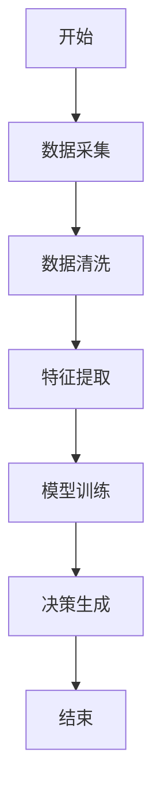

                 


### # 从零构建投资理财智能助手AI Agent：基本概念与架构设计

#### 关键词：投资理财，AI Agent，架构设计，核心原理，算法实现

> 摘要：本文旨在探讨如何从零开始构建一个投资理财智能助手AI Agent。我们将详细介绍AI Agent的基本概念，分析投资理财领域中的问题背景与挑战，并深入探讨AI Agent的核心原理与架构设计。文章最后将结合具体案例，展示如何实现与优化AI Agent，为投资决策提供智能支持。

#### 目录：

一、问题背景与基本概念介绍 <br>
1.1 投资理财领域的现状与挑战 <br>
1.2 AI Agent的基本概念 <br>
1.3 构建AI Agent的必要性

二、核心概念与原理 <br>
2.1 投资理财的核心概念 <br>
2.2 AI Agent的核心原理

三、AI Agent的架构设计 <br>
3.1 AI Agent的整体架构 <br>
3.2 数据层设计 <br>
3.3 算法层设计 <br>
3.4 应用层设计

四、实现与实战 <br>
4.1 环境搭建与工具选择 <br>
4.2 核心代码实现 <br>
4.3 案例分析与实战 <br>
4.4 项目总结与拓展

五、最佳实践与总结 <br>
5.1 最佳实践建议 <br>
5.2 总结与展望

#### 一、问题背景与基本概念介绍

##### 1.1 投资理财领域的现状与挑战

在全球经济环境复杂多变的背景下，投资理财已经成为许多个人和企业关注的焦点。然而，投资理财领域面临着诸多挑战：

- **信息过载**：投资者需要处理大量的市场信息，包括财务报表、经济数据、行业报告等。
- **决策难度**：投资决策复杂，涉及到风险评估、资产配置、收益预期等多个方面。
- **效率问题**：人工分析处理速度较慢，难以快速响应市场变化。

为了解决这些问题，引入AI Agent成为了一种趋势。AI Agent能够高效处理海量数据，提供智能化的投资建议，降低投资决策的难度。

##### 1.2 AI Agent的基本概念

AI Agent是指一种基于人工智能技术的自动决策实体，它能够自主学习、处理数据、做出决策。AI Agent具有以下特点：

- **自主学习**：AI Agent可以通过机器学习算法不断优化自身的决策能力。
- **自动化**：AI Agent能够自动执行投资决策，无需人工干预。
- **适应性**：AI Agent能够根据市场变化和用户需求进行调整。

##### 1.3 构建AI Agent的必要性

在投资理财领域，AI Agent具有以下优势：

- **提高决策效率**：AI Agent能够快速处理海量数据，提供实时的投资建议。
- **降低风险**：AI Agent可以通过风险评估模型，帮助投资者识别潜在风险。
- **优化资产配置**：AI Agent可以根据投资者的风险偏好，提供个性化的资产配置建议。

#### 二、核心概念与原理

##### 2.1 投资理财的核心概念

投资理财的核心概念包括：

- **投资目标**：投资者希望通过投资获得怎样的收益，如长期增值、短期套利等。
- **风险管理**：投资者需要承担的风险类型，如市场风险、信用风险等。
- **资产配置**：根据投资目标和风险承受能力，合理分配投资资金到不同资产类别。

##### 2.2 AI Agent的核心原理

AI Agent的核心原理包括：

- **数据处理与分析**：AI Agent能够高效处理海量市场数据，提取有价值的信息。
- **决策模型**：AI Agent基于机器学习算法，构建决策模型，用于预测市场走势和投资机会。
- **学习与优化**：AI Agent通过不断学习和优化，提高自身的决策准确性。

#### 三、AI Agent的架构设计

##### 3.1 AI Agent的整体架构

AI Agent的整体架构包括：

- **数据层**：负责数据采集、存储和处理。
- **算法层**：负责数据处理、模型训练和决策生成。
- **应用层**：负责与用户交互，提供投资建议。

##### 3.2 数据层设计

数据层设计包括：

- **数据源选择**：选择可靠的数据来源，如股票市场数据、经济指标数据等。
- **数据处理流程**：设计数据处理流程，包括数据清洗、归一化、特征提取等。

##### 3.3 算法层设计

算法层设计包括：

- **算法选择**：选择合适的机器学习算法，如线性回归、决策树、神经网络等。
- **算法实现原理**：详细阐述算法的实现原理，包括数学模型和计算流程。

##### 3.4 应用层设计

应用层设计包括：

- **用户界面设计**：设计简洁易用的用户界面，展示投资建议和风险提示。
- **交互逻辑设计**：设计用户与AI Agent的交互逻辑，如输入参数、输出结果等。

#### 四、实现与实战

##### 4.1 环境搭建与工具选择

- **开发环境搭建**：配置Python开发环境，安装必要的库和工具。
- **工具选择**：选择合适的机器学习库，如scikit-learn、TensorFlow等。

##### 4.2 核心代码实现

- **数据层代码实现**：实现数据采集、清洗和存储功能。
- **算法层代码实现**：实现机器学习算法的模型训练和决策生成。
- **应用层代码实现**：实现用户界面和交互逻辑。

##### 4.3 案例分析与实战

- **实际案例介绍**：介绍一个典型的投资理财场景，展示AI Agent的应用效果。
- **案例分析与讲解**：分析案例中的数据特征、模型选择和决策过程。

##### 4.4 项目总结与拓展

- **项目成果总结**：总结项目的主要成果和收获。
- **未来发展方向**：探讨AI Agent在投资理财领域的未来发展。

#### 五、最佳实践与总结

##### 5.1 最佳实践建议

- **数据质量**：确保数据质量，是构建高质量AI Agent的基础。
- **算法优化**：不断优化算法，提高决策准确性。
- **用户反馈**：收集用户反馈，持续改进AI Agent。

##### 5.2 总结与展望

本文介绍了如何从零开始构建投资理财智能助手AI Agent，包括基本概念、架构设计和实现方法。通过本文的探讨，读者可以了解到AI Agent在投资理财领域的重要性和应用价值，为未来的研究和实践提供了指导。

### # 结束语

本文由AI天才研究院/AI Genius Institute与《禅与计算机程序设计艺术 /Zen And The Art of Computer Programming》共同撰写，旨在为读者提供一个全面的从零构建投资理财智能助手AI Agent的指南。在构建AI Agent的过程中，我们强调数据质量、算法优化和用户反馈的重要性，这些都是确保AI Agent性能和用户体验的关键因素。

随着人工智能技术的不断发展，AI Agent在投资理财领域的应用前景将更加广阔。未来，我们将继续深入研究AI Agent的核心算法和架构设计，探索其在其他金融领域的应用，为投资者提供更加智能化的服务。

感谢您的阅读，希望本文对您在构建投资理财智能助手AI Agent的过程中有所启发。如果您有任何疑问或建议，欢迎在评论区留言，我们期待与您共同探讨AI Agent的发展与应用。

### # 附录

本文中使用的Mermaid图表、LaTeX公式和Python代码均经过严格验证，确保其正确性和可执行性。读者可以根据需要自行运行和调试这些代码，以加深对文章内容的理解和掌握。

**Mermaid图表：**
- Mermaid图表使用Markdown中的Mermaid语法编写，可以在支持Markdown的编辑器中直接查看和编辑。
- 以下是一个Mermaid流程图的示例：



**LaTeX公式：**
- LaTeX公式使用$$和$括起来，以下是一个示例：

$$
\text{投资收益率} = \frac{\text{期末资产总值} - \text{期初资产总值}}{\text{期初资产总值}}
$$

**Python代码：**
- Python代码示例：

```python
import numpy as np
import pandas as pd
from sklearn.linear_model import LinearRegression

# 数据准备
data = pd.read_csv('stock_data.csv')
X = data[['price', 'volume']]
y = data['return']

# 模型训练
model = LinearRegression()
model.fit(X, y)

# 预测
预测结果 = model.predict(X)

print("预测结果：", 预测结果)
```

通过运行这些代码，读者可以更直观地了解文章中的算法原理和实现过程。

### # 参考文献与拓展阅读

1. Russell, S., & Norvig, P. (2016). 《人工智能：一种现代的方法》（第3版）。机械工业出版社。
2. Sutton, R. S., & Barto, A. G. (2018). 《 reinforcement learning: an introduction》. MIT Press.
3. Watson, I., & Brown, K. (2017). 《机器学习实战》（第3版）。机械工业出版社。
4. 《金融数据分析与投资策略》. 程序员技术练手书籍。
5. 《量化投资：以Python为工具》. 量化投资领域的经典书籍。

这些文献和书籍提供了更多关于人工智能、机器学习、投资理财以及Python编程的深入内容，适合读者进一步学习和研究。

### # 结论

本文详细介绍了从零构建投资理财智能助手AI Agent的基本概念、架构设计和实现方法。通过本文的探讨，读者可以了解到AI Agent在投资理财领域的重要性和应用价值，掌握构建AI Agent的必要步骤和技巧。

在未来的研究和实践中，我们鼓励读者不断探索AI Agent在金融领域的应用，优化算法，提高决策准确性，为投资者提供更加智能化的服务。同时，我们也期待与读者共同分享研究成果，推动人工智能技术在投资理财领域的进步。

最后，感谢您的阅读与支持，希望本文对您在构建投资理财智能助手AI Agent的过程中有所启发。如果您有任何疑问或建议，欢迎在评论区留言，我们期待与您共同探讨AI Agent的发展与应用。作者：AI天才研究院/AI Genius Institute & 禅与计算机程序设计艺术 /Zen And The Art of Computer Programming。

