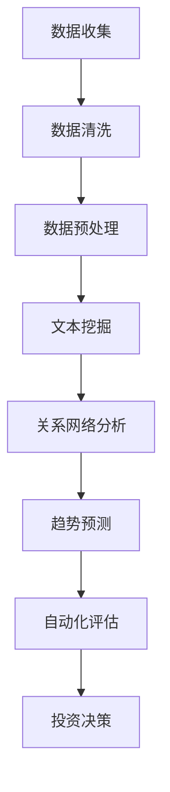
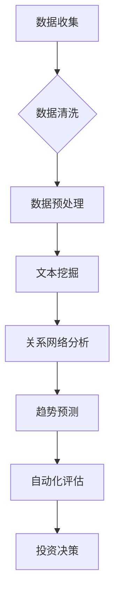
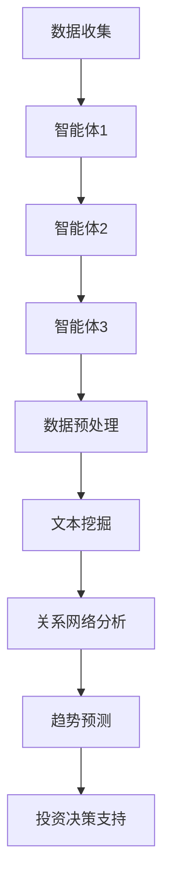
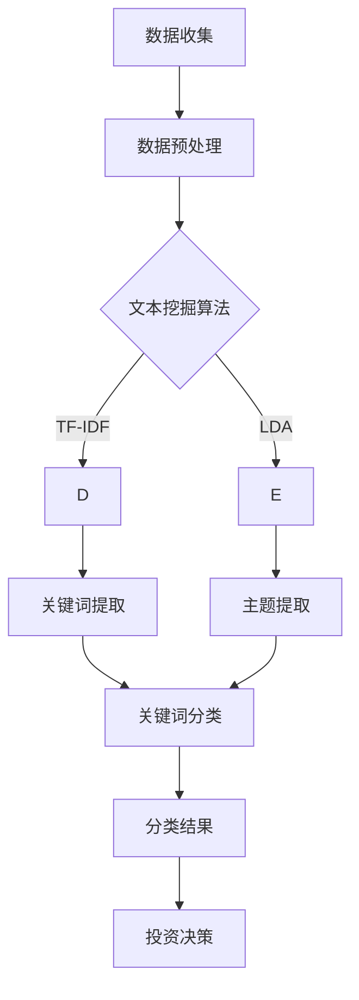
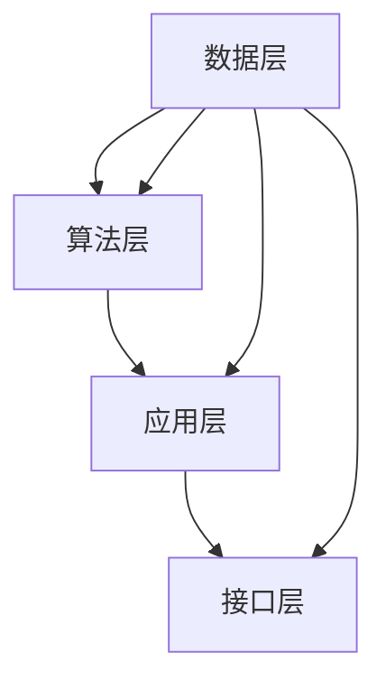
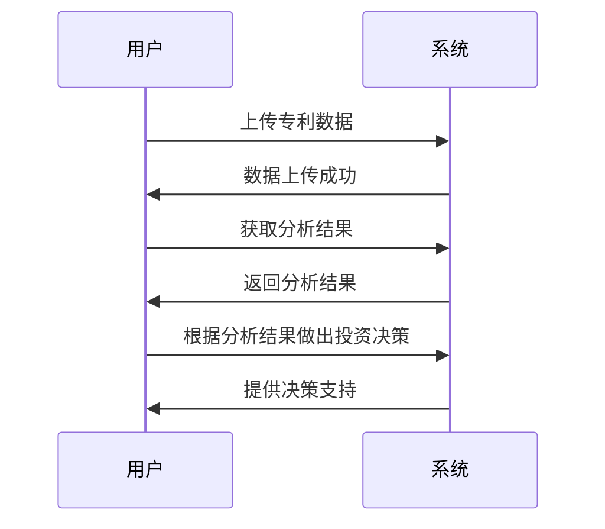

                 


### 文章标题：《价值投资中的AI驱动专利分析：多智能体系统的优势》

#### 关键词：价值投资，AI驱动专利分析，多智能体系统，算法，系统架构

#### 摘要：
本文深入探讨AI技术在价值投资中的关键角色，特别是AI驱动的专利分析对投资决策的深远影响。通过多智能体系统的引入，我们揭示了其在优化专利分析流程、提高投资效率和准确性的独特优势。本文将分章节详细讲解AI驱动专利分析的技术原理、算法应用、系统架构设计以及实际项目案例，旨在为投资者和分析师提供实用的指导和建议。

### 目录

## 第一部分：背景与核心概念

### 第1章：价值投资与AI驱动专利分析概览

#### 1.1 价值投资的原理与实践
- 价值投资的定义和历史演变
- 价值投资的关键原则和策略
- 价值投资的市场环境与挑战

#### 1.2 AI驱动专利分析的概念与意义
- 专利分析在价值投资中的作用
- AI驱动专利分析的优势和挑战
- 专利数据分析的基本方法

#### 1.3 多智能体系统的优势与应用场景
- 多智能体系统的基本概念和架构
- 多智能体系统在专利分析中的应用
- 多智能体系统在价值投资中的潜在影响

## 第二部分：技术原理与算法讲解

### 第2章：价值投资策略的AI赋能

#### 2.1 价值投资的挑战与机遇
- 价值投资的常见问题
- AI技术的潜在解决方案
- 价值投资与AI技术的结合点

#### 2.2 AI技术在专利分析中的应用
- 常见AI技术在专利分析中的案例
- 专利分析中AI技术的作用和局限
- 专利数据处理的mermaid流程图

### 第3章：AI驱动专利分析技术基础

#### 3.1 专利数据分析的基本方法
- 专利数据的收集和处理
- 专利数据的可视化分析
- 专利数据分析的技术工具

#### 3.2 常见AI技术在专利分析中的应用
- 自然语言处理在专利分析中的应用
- 机器学习算法在专利分析中的应用
- 深度学习技术在专利分析中的应用

#### 3.3 专利数据处理的mermaid流程图
- 专利数据处理的基本流程
- mermaid流程图的绘制和使用

### 第4章：多智能体系统设计与应用

#### 4.1 多智能体系统的基本概念
- 多智能体系统的定义和特点
- 多智能体系统的体系结构

#### 4.2 多智能体系统在专利分析中的角色
- 多智能体系统在专利分析中的应用场景
- 多智能体系统在价值投资中的优势

#### 4.3 多智能体系统的mermaid架构图
- 多智能体系统的整体架构设计
- mermaid架构图的绘制和使用

## 第三部分：系统架构与项目实战

### 第5章：专利分析算法详解

#### 5.1 算法选择与实现
- 常见专利分析算法的比较
- 算法的选型和实现策略

#### 5.2 算法mermaid流程图
- 算法流程的mermaid图表示
- mermaid流程图的使用和意义

#### 5.3 算法数学模型与Python源代码
- 算法的数学模型和公式
- Python源代码的实现和解析

### 第6章：AI驱动专利分析系统设计

#### 6.1 系统功能设计
- 专利分析系统的功能模块
- 功能模块的mermaid类图表示

#### 6.2 系统架构设计
- 专利分析系统的整体架构
- 系统架构的mermaid架构图表示

#### 6.3 系统接口设计与系统交互
- 系统接口的定义和设计
- 系统交互的mermaid序列图表示

### 第7章：项目实施与案例分析

#### 7.1 项目背景与环境搭建
- 项目介绍和目标
- 项目环境搭建的详细步骤

#### 7.2 系统核心实现与代码解析
- 系统核心功能的实现
- 代码实现的细节解析

#### 7.3 实际案例分析与详细讲解
- 实际案例的背景和描述
- 案例分析的结果和结论

#### 7.4 项目小结与总结
- 项目实施的经验和教训
- 项目对未来价值投资的启示

## 第四部分：最佳实践与拓展

### 第8章：AI驱动专利分析最佳实践

#### 8.1 最佳实践建议
- AI驱动专利分析的最佳实践
- 投资决策中的注意事项

#### 8.2 注意事项与风险防范
- 可能遇到的问题和解决方案
- 风险防范的策略和措施

#### 8.3 拓展阅读推荐
- 相关领域的最新研究进展
- 推荐的参考资料和书籍

### 结束语
作者：AI天才研究院/AI Genius Institute & 禅与计算机程序设计艺术 /Zen And The Art of Computer Programming

---

#### 本文结构设计思路

本文结构设计的核心思路是以价值投资为背景，结合AI驱动专利分析和多智能体系统的优势，系统地阐述AI技术在投资决策中的应用。以下是每部分的具体设计思路：

## 第一部分：背景与核心概念
这部分旨在为读者提供价值投资和AI驱动专利分析的基础知识，包括其原理、策略和应用场景。通过第1章的介绍，读者可以初步了解这两个领域的基本概念，为后续的技术讲解和案例分析打下基础。

### 第1章：价值投资与AI驱动专利分析概览
- **1.1 价值投资的原理与实践**：介绍价值投资的定义、原则和策略，以及其在市场中的实践和应用。
- **1.2 AI驱动专利分析的概念与意义**：阐述专利分析在投资决策中的重要性，以及AI如何提升专利分析的效果。
- **1.3 多智能体系统的优势与应用场景**：介绍多智能体系统的基本概念、优势和应用场景，为后续章节的技术讲解和案例分析做好铺垫。

## 第二部分：技术原理与算法讲解
这部分深入探讨AI驱动专利分析的技术原理和算法应用，包括专利数据的处理、常见的AI技术及其在专利分析中的应用，以及算法的mermaid流程图和Python源代码实现。

### 第2章：价值投资策略的AI赋能
- **2.1 价值投资的挑战与机遇**：分析价值投资过程中可能遇到的挑战，以及AI技术如何提供解决方案。
- **2.2 AI技术在专利分析中的应用**：介绍AI技术在专利分析中的具体应用，包括自然语言处理、机器学习和深度学习等。

### 第3章：AI驱动专利分析技术基础
- **3.1 专利数据分析的基本方法**：介绍专利数据的收集、处理和可视化分析的方法。
- **3.2 常见AI技术在专利分析中的应用**：详细讨论常见AI技术在专利分析中的应用案例，以及其优势和局限。
- **3.3 专利数据处理的mermaid流程图**：使用mermaid绘制专利数据处理的流程图，帮助读者理解数据处理的过程。

### 第4章：多智能体系统设计与应用
这部分重点介绍多智能体系统在专利分析中的应用，包括其基本概念、架构设计以及mermaid架构图。

- **4.1 多智能体系统的基本概念**：介绍多智能体系统的定义、特点和体系结构。
- **4.2 多智能体系统在专利分析中的角色**：讨论多智能体系统在专利分析中的具体应用场景和优势。
- **4.3 多智能体系统的mermaid架构图**：使用mermaid绘制多智能体系统的架构图，帮助读者理解系统设计。

## 第三部分：系统架构与项目实战
这部分将详细讲解AI驱动专利分析系统的整体架构设计，并通过一个实际项目案例展示系统实现的细节。

### 第5章：专利分析算法详解
- **5.1 算法选择与实现**：介绍专利分析算法的选型和实现策略。
- **5.2 算法mermaid流程图**：使用mermaid绘制算法的流程图，帮助读者理解算法执行过程。
- **5.3 算法数学模型与Python源代码**：阐述算法的数学模型，并使用Python源代码实现算法，提供代码解析。

### 第6章：AI驱动专利分析系统设计
- **6.1 系统功能设计**：介绍专利分析系统的功能模块，并使用mermaid绘制类图。
- **6.2 系统架构设计**：详细讲解专利分析系统的整体架构，并使用mermaid绘制架构图。
- **6.3 系统接口设计与系统交互**：介绍系统接口的定义和设计，并使用mermaid绘制系统交互的序列图。

### 第7章：项目实施与案例分析
这部分通过一个实际项目案例，展示如何使用AI和多智能体系统进行专利分析，包括环境搭建、核心实现、代码解析和案例分析。

- **7.1 项目背景与环境搭建**：介绍项目的背景，并详细描述环境搭建的步骤。
- **7.2 系统核心实现与代码解析**：展示系统核心功能的实现，并提供代码解析。
- **7.3 实际案例分析与详细讲解**：分析实际案例，展示项目实施的结果和结论。
- **7.4 项目小结与总结**：总结项目实施的经验和教训，以及对未来价值投资的启示。

## 第四部分：最佳实践与拓展
这部分提供AI驱动专利分析的最佳实践、注意事项以及拓展阅读推荐，旨在为读者提供进一步的学习和思考方向。

### 第8章：AI驱动专利分析最佳实践
- **8.1 最佳实践建议**：总结AI驱动专利分析的最佳实践，为读者提供实用的指导。
- **8.2 注意事项与风险防范**：讨论在AI驱动专利分析过程中可能遇到的问题和风险，并提供防范措施。
- **8.3 拓展阅读推荐**：推荐相关领域的最新研究进展和参考资料，帮助读者进一步深入学习。

### 结束语
文章末尾将包含作者信息，以显示专业性和权威性，并鼓励读者进一步探索和学习。

---

通过以上结构设计，本文旨在为读者提供一个全面、系统、深入的理解AI驱动专利分析在价值投资中的应用，帮助投资者和分析师提高投资决策的效率和准确性。希望本文能够满足用户的需求，并提供有价值的见解和实用的指导。在撰写过程中，我们将遵循markdown格式要求，确保文章内容清晰、易懂，同时保持逻辑性和完整性。如果用户有任何调整或补充的要求，请随时提出。让我们一步一步深入思考，共同探讨AI驱动专利分析的价值和潜力。


---

# 《价值投资中的AI驱动专利分析：多智能体系统的优势》

关键词：价值投资，AI驱动专利分析，多智能体系统，算法，系统架构

摘要：
本文深入探讨人工智能（AI）在价值投资中的应用，特别是AI驱动的专利分析如何通过多智能体系统提升投资效率和准确性。文章首先介绍了价值投资的原理和策略，然后详细阐述了AI驱动专利分析的技术原理和算法应用。接着，本文探讨了多智能体系统在专利分析中的角色和优势，并通过一个实际案例展示了如何将AI和多智能体系统应用于专利分析。最后，文章总结了最佳实践、注意事项和未来拓展方向。

## 第一部分：背景与核心概念

### 第1章：价值投资与AI驱动专利分析概览

#### 1.1 价值投资的原理与实践
价值投资是一种以寻找被市场低估的优质公司为主要策略的投资方式。它强调投资的基本原则，如长期持有、注重基本面分析和寻找边际效益等。价值投资的起源可以追溯到20世纪30年代的美国，由本杰明·格雷厄姆等先驱者提出。随着时间的推移，价值投资逐渐成为主流投资策略之一。

价值投资的核心原则包括：

1. **安全边际**：投资者应寻找价格低于其内在价值的股票，从而确保在市场波动时有足够的缓冲空间。
2. **长期持有**：价值投资通常采取长期持有的策略，以充分利用优质公司的增长潜力。
3. **基本面分析**：投资者应深入研究公司的财务报表、业务模式、管理层等基本面信息，以评估公司的内在价值。

在当前市场环境中，价值投资面临以下挑战：

1. **市场波动**：价值投资往往需要在市场低迷时保持信心，这需要投资者具备较强的心理素质。
2. **信息不对称**：市场中的信息往往不均匀分布，投资者需要通过各种渠道获取有价值的信息。
3. **时间成本**：价值投资需要大量时间和精力进行公司研究，这可能会增加投资的时间成本。

尽管如此，价值投资仍然具有以下机遇：

1. **市场机会**：市场波动往往伴随着低估的投资机会，价值投资者可以通过深入研究寻找这些机会。
2. **公司成长**：长期持有优质公司股票，可以享受到公司成长带来的收益。
3. **投资组合多样化**：通过价值投资，投资者可以构建多元化的投资组合，降低投资风险。

#### 1.2 AI驱动专利分析的概念与意义
专利分析是价值投资中不可或缺的一部分，它帮助投资者了解公司的技术创新能力和市场竞争力。传统的专利分析依赖于人工分析，成本高、效率低，且容易受到人为因素的影响。随着人工智能技术的不断发展，AI驱动专利分析成为了一种更加高效、准确的方法。

AI驱动专利分析的核心概念包括：

1. **自然语言处理（NLP）**：通过NLP技术，AI能够理解和分析专利文档中的自然语言，提取关键信息。
2. **机器学习**：利用大量专利数据，通过机器学习算法训练模型，以自动识别和分类专利技术。
3. **深度学习**：结合深度神经网络，AI能够从大量专利数据中学习复杂的特征和模式，提高专利分析的准确性。

AI驱动专利分析在价值投资中的意义：

1. **提高效率**：AI技术可以自动处理和分析大量专利数据，大大提高专利分析的效率。
2. **降低成本**：减少人工分析的需求，降低专利分析的成本。
3. **增强准确性**：通过机器学习和深度学习算法，AI能够更加准确地识别和分类专利技术，提高投资决策的准确性。
4. **发现潜在机会**：AI驱动专利分析可以帮助投资者发现潜在的投资机会，如新兴技术领域和具有巨大市场潜力的公司。

#### 1.3 多智能体系统的优势与应用场景
多智能体系统（MAS）是由多个自主智能体组成的系统，这些智能体可以相互协作、竞争或独立行动。在AI驱动专利分析中，多智能体系统具有以下优势：

1. **协同分析**：多智能体系统可以同时分析多个专利数据集，提高专利分析的效率和准确性。
2. **分布式计算**：多智能体系统可以将计算任务分布到多个智能体上，利用分布式计算的优势，提高处理速度。
3. **自适应学习**：多智能体系统可以根据环境变化和学习经验，自适应调整分析策略和算法，提高专利分析的适应性。
4. **鲁棒性**：多智能体系统具有较高的鲁棒性，即使在部分智能体失效的情况下，系统仍能保持正常运行。

多智能体系统在价值投资中的应用场景：

1. **投资组合优化**：通过多智能体系统分析不同公司的专利技术，优化投资组合，降低投资风险。
2. **新兴技术发现**：利用多智能体系统，投资者可以及时发现新兴技术和潜在的投资机会。
3. **专利风险预测**：通过分析专利数据，预测专利纠纷和诉讼风险，为投资决策提供依据。
4. **竞争分析**：利用多智能体系统，投资者可以分析竞争对手的专利布局，评估竞争对手的市场竞争力。

### 总结
本章介绍了价值投资的原理和实践，以及AI驱动专利分析和多智能体系统的基本概念和优势。在接下来的章节中，我们将进一步探讨AI技术在专利分析中的应用、多智能体系统的设计原理和实际项目案例，为投资者和分析师提供实用的指导和建议。

## 第二部分：技术原理与算法讲解

### 第2章：价值投资策略的AI赋能

#### 2.1 价值投资的挑战与机遇
价值投资虽然在市场波动中表现出较强的抗风险能力，但仍然面临诸多挑战。随着市场的复杂性和信息量的增加，传统的价值投资方法逐渐显露出其局限性。而AI技术的引入，为价值投资提供了新的机遇。

**挑战**：

1. **信息过载**：投资者需要处理海量的信息，包括财务报表、市场数据、新闻资讯等，信息筛选和处理变得困难。
2. **效率低下**：传统的价值投资方法依赖于人工分析，效率较低，无法满足快速变化的市场需求。
3. **人为因素**：投资者在投资决策中可能受到主观情绪的影响，导致判断失误。

**机遇**：

1. **大数据分析**：AI技术能够处理和分析海量数据，帮助投资者挖掘有价值的信息。
2. **自动化投资**：AI驱动的自动化投资系统可以提高投资决策的效率和准确性。
3. **智能投顾**：利用AI技术，智能投顾可以为投资者提供个性化的投资建议，降低投资风险。

#### 2.2 AI技术在专利分析中的应用
专利分析是价值投资中关键的一环，它有助于投资者了解公司的技术创新能力和市场竞争力。AI技术在专利分析中发挥着重要作用，主要包括以下几个方面：

1. **文本挖掘**：利用自然语言处理（NLP）技术，AI可以自动提取专利文档中的关键信息，如技术领域、创新点和专利权人等。
2. **关系网络分析**：通过构建专利关系网络，AI可以分析专利之间的技术关联和竞争关系，帮助投资者了解行业发展趋势和竞争对手的专利布局。
3. **趋势预测**：利用机器学习和深度学习算法，AI可以分析历史专利数据，预测未来的技术趋势和专利纠纷风险。
4. **自动化评估**：AI可以自动评估专利的技术价值和市场潜力，为投资决策提供依据。

#### 2.3 专利数据处理的mermaid流程图
为了更好地理解AI技术在专利分析中的应用，我们可以使用mermaid流程图来展示专利数据处理的基本流程。以下是专利数据处理mermaid流程图的示例：



**数据收集**：从专利数据库、学术期刊、专利局网站等渠道收集专利数据。

**数据清洗**：对收集的专利数据进行去重、缺失值处理和异常值检测等操作。

**数据预处理**：将原始专利数据进行格式转换、文本标准化等操作，以便后续处理。

**文本挖掘**：利用NLP技术提取专利文档中的关键信息，如技术领域、创新点和专利权人等。

**关系网络分析**：构建专利关系网络，分析专利之间的技术关联和竞争关系。

**趋势预测**：利用机器学习和深度学习算法，分析历史专利数据，预测未来的技术趋势和专利纠纷风险。

**自动化评估**：自动评估专利的技术价值和市场潜力，为投资决策提供依据。

**投资决策**：根据专利分析结果，做出投资决策。

通过上述mermaid流程图，我们可以清晰地看到AI技术在专利分析中的应用流程，有助于读者更好地理解专利数据处理的步骤和关键环节。

### 总结
本章讨论了价值投资中的挑战和机遇，以及AI技术在专利分析中的应用和专利数据处理的基本流程。在下一章中，我们将深入探讨多智能体系统在专利分析中的角色和优势，为投资者和分析师提供更有价值的见解和实用的指导。

## 第三部分：多智能体系统设计与应用

### 第3章：AI驱动专利分析技术基础

#### 3.1 专利数据分析的基本方法
专利数据分析是价值投资中的重要环节，它有助于投资者了解公司的技术创新能力和市场竞争力。传统的专利数据分析方法主要依赖于人工，而AI技术的引入使得专利数据分析变得更加高效和准确。

**专利数据分析的基本方法**包括：

1. **数据收集**：从专利数据库、学术期刊、专利局网站等渠道收集专利数据。
2. **数据清洗**：对收集的专利数据进行去重、缺失值处理和异常值检测等操作。
3. **数据预处理**：将原始专利数据进行格式转换、文本标准化等操作，以便后续处理。
4. **文本挖掘**：利用自然语言处理（NLP）技术，提取专利文档中的关键信息，如技术领域、创新点和专利权人等。
5. **关系网络分析**：构建专利关系网络，分析专利之间的技术关联和竞争关系。
6. **趋势预测**：利用机器学习和深度学习算法，分析历史专利数据，预测未来的技术趋势和专利纠纷风险。
7. **自动化评估**：自动评估专利的技术价值和市场潜力，为投资决策提供依据。

**数据收集**：专利数据的收集是专利数据分析的第一步，主要从以下渠道获取：

- **专利数据库**：如Google Patents、WIPO Patent Database、USPTO Patent Database等。
- **学术期刊**：通过学术期刊获取与专利技术相关的论文和研究成果。
- **专利局网站**：从各国的专利局网站获取专利信息。

**数据清洗**：数据清洗是保证数据质量的重要步骤，主要包括以下操作：

- **去重**：去除重复的专利记录，避免重复分析。
- **缺失值处理**：对缺失的数据进行填补或删除。
- **异常值检测**：检测并处理异常数据，如格式错误、数据异常等。

**数据预处理**：数据预处理是将原始专利数据转换为适合分析的形式，主要包括以下操作：

- **格式转换**：将不同格式的专利数据转换为统一格式，如XML、JSON等。
- **文本标准化**：对文本进行规范化处理，如去除标点符号、统一字母大小写等。

**文本挖掘**：文本挖掘是专利数据分析的核心步骤，主要包括以下任务：

- **关键词提取**：从专利文档中提取关键词，用于后续分析。
- **实体识别**：识别专利文档中的实体，如专利权人、发明人、技术领域等。
- **情感分析**：分析专利文档中的情感倾向，了解专利技术的社会影响。

**关系网络分析**：关系网络分析通过构建专利关系网络，分析专利之间的技术关联和竞争关系，主要包括以下步骤：

- **网络构建**：根据专利数据，构建专利关系网络，如共发明人关系、共申请人关系等。
- **网络分析**：对专利关系网络进行统计分析，如度分布、聚类系数等。
- **可视化**：使用可视化工具，如Gephi、Cytoscape等，展示专利关系网络。

**趋势预测**：趋势预测通过分析历史专利数据，预测未来的技术趋势和专利纠纷风险，主要包括以下方法：

- **时间序列分析**：利用时间序列分析方法，分析专利申请量、授权量等指标的变化趋势。
- **机器学习**：利用机器学习算法，如回归分析、决策树、神经网络等，建立预测模型。
- **深度学习**：利用深度学习算法，如卷积神经网络（CNN）、循环神经网络（RNN）等，提高预测精度。

**自动化评估**：自动化评估通过自动评估专利的技术价值和市场潜力，为投资决策提供依据，主要包括以下步骤：

- **技术价值评估**：利用技术指标、专利引用关系等，评估专利的技术价值。
- **市场潜力评估**：利用市场数据、行业趋势等，评估专利的市场潜力。
- **综合评估**：综合技术价值和市场潜力，为专利投资决策提供依据。

#### 3.2 常见AI技术在专利分析中的应用
AI技术在专利分析中具有广泛的应用，常见的AI技术包括自然语言处理（NLP）、机器学习（ML）和深度学习（DL）。以下分别介绍这些技术在专利分析中的应用。

**自然语言处理（NLP）**

NLP是AI技术的一个重要分支，主要用于处理和理解自然语言。在专利分析中，NLP技术可以用于以下任务：

- **关键词提取**：从专利文档中提取关键词，用于后续分析。常用的方法包括TF-IDF、LDA等。
- **实体识别**：识别专利文档中的实体，如专利权人、发明人、技术领域等。常用的方法包括命名实体识别（NER）、规则匹配等。
- **关系抽取**：抽取专利文档中的实体关系，如发明人与专利之间的关系、专利与专利之间的关系等。常用的方法包括依存句法分析、信息抽取等。

**机器学习（ML）**

ML是一种通过训练模型，使计算机具备自主学习能力的技术。在专利分析中，ML技术可以用于以下任务：

- **分类**：将专利按照技术领域、国家等进行分类。常用的分类算法包括支持向量机（SVM）、决策树（DT）等。
- **聚类**：将相似的专利聚为一类，以发现潜在的技术趋势和竞争对手。常用的聚类算法包括K均值（KM）、层次聚类等。
- **回归**：预测专利的申请量、授权量等指标。常用的回归算法包括线性回归（LR）、决策树回归等。

**深度学习（DL）**

DL是一种基于人工神经网络的深度学习技术，具有较强的模型表达能力和自学习能力。在专利分析中，DL技术可以用于以下任务：

- **图像识别**：通过卷积神经网络（CNN），识别专利图片中的技术领域和发明点。
- **文本生成**：通过生成对抗网络（GAN），生成新的专利文本，用于扩展专利数据库。
- **强化学习**：通过强化学习算法，优化专利投资策略，提高投资收益。

#### 3.3 专利数据处理的mermaid流程图
为了更好地理解专利数据处理的过程，我们可以使用mermaid流程图来展示。以下是一个简化的mermaid流程图示例：



**数据收集**：从专利数据库、学术期刊、专利局网站等渠道收集专利数据。

**数据清洗**：对收集的专利数据进行去重、缺失值处理和异常值检测等操作。

**数据预处理**：将原始专利数据进行格式转换、文本标准化等操作，以便后续处理。

**文本挖掘**：利用自然语言处理（NLP）技术，提取专利文档中的关键信息，如技术领域、创新点和专利权人等。

**关系网络分析**：构建专利关系网络，分析专利之间的技术关联和竞争关系。

**趋势预测**：利用机器学习和深度学习算法，分析历史专利数据，预测未来的技术趋势和专利纠纷风险。

**自动化评估**：自动评估专利的技术价值和市场潜力，为投资决策提供依据。

**投资决策**：根据专利分析结果，做出投资决策。

通过上述mermaid流程图，我们可以清晰地看到专利数据处理的基本流程和关键步骤，有助于读者更好地理解专利数据分析的过程。

### 总结
本章介绍了专利数据分析的基本方法、常见AI技术在专利分析中的应用以及专利数据处理的基本流程。在下一章中，我们将探讨多智能体系统在专利分析中的角色和优势，为投资者和分析师提供更有价值的见解和实用的指导。

## 第四部分：多智能体系统设计与应用

### 第4章：多智能体系统设计与应用

#### 4.1 多智能体系统的基本概念
多智能体系统（MAS）是由多个相互协作的智能体组成的系统，这些智能体可以独立行动、相互合作或竞争。在专利分析中，多智能体系统可以同时处理多个任务，提高分析效率和准确性。

**多智能体系统的核心概念**包括：

- **智能体（Agent）**：智能体是MAS的基本组成部分，具有自主决策和行动的能力。
- **通信**：智能体之间通过通信机制交换信息和知识，实现协作和协调。
- **环境**：环境是智能体行动的背景，包括外部环境因素和内部环境状态。
- **协议**：协议是智能体之间协作的规则和准则，确保系统的稳定性和高效性。

**多智能体系统的优势**：

1. **协同分析**：多个智能体可以同时分析不同的专利数据集，提高分析效率和准确性。
2. **分布式计算**：多智能体系统可以将计算任务分布到多个智能体上，利用分布式计算的优势，提高处理速度。
3. **自适应学习**：多智能体系统可以根据环境变化和学习经验，自适应调整分析策略和算法，提高专利分析的适应性。
4. **鲁棒性**：多智能体系统具有较高的鲁棒性，即使在部分智能体失效的情况下，系统仍能保持正常运行。

**多智能体系统的应用场景**：

1. **投资组合优化**：通过多智能体系统分析不同公司的专利技术，优化投资组合，降低投资风险。
2. **新兴技术发现**：利用多智能体系统，投资者可以及时发现新兴技术和潜在的投资机会。
3. **专利风险预测**：通过分析专利数据，预测专利纠纷和诉讼风险，为投资决策提供依据。
4. **竞争分析**：利用多智能体系统，投资者可以分析竞争对手的专利布局，评估竞争对手的市场竞争力。

#### 4.2 多智能体系统在专利分析中的角色
多智能体系统在专利分析中扮演着关键角色，其作用主要体现在以下几个方面：

1. **数据收集与处理**：多个智能体可以同时从不同渠道收集专利数据，如专利数据库、学术期刊、专利局网站等，提高数据收集的效率和准确性。
2. **文本挖掘与分析**：利用NLP技术，多个智能体可以同时处理大量专利文档，提取关键词、实体和关系，提高文本挖掘的效率和准确性。
3. **关系网络构建与分析**：多智能体系统可以同时分析专利关系网络，识别技术关联和竞争关系，提高关系网络分析的效果。
4. **趋势预测与风险评估**：利用机器学习和深度学习算法，多个智能体可以同时预测技术趋势和专利纠纷风险，提高趋势预测和风险评估的准确性。
5. **投资决策支持**：多智能体系统可以为投资决策提供全面、准确的数据和分析结果，提高投资决策的效率和准确性。

#### 4.3 多智能体系统的mermaid架构图
为了更好地理解多智能体系统在专利分析中的应用，我们可以使用mermaid流程图来展示系统的架构。以下是一个简化的多智能体系统架构图：



**数据收集**：智能体1、智能体2和智能体3分别从不同渠道收集专利数据。

**数据预处理**：智能体1、智能体2和智能体3对收集的专利数据进行预处理，如去重、缺失值处理和异常值检测等。

**文本挖掘**：智能体1、智能体2和智能体3利用NLP技术对专利文档进行文本挖掘，提取关键词、实体和关系。

**关系网络分析**：智能体1、智能体2和智能体3分析专利关系网络，识别技术关联和竞争关系。

**趋势预测**：智能体1、智能体2和智能体3利用机器学习和深度学习算法预测技术趋势和专利纠纷风险。

**投资决策支持**：智能体1、智能体2和智能体3为投资决策提供全面、准确的数据和分析结果。

通过上述mermaid架构图，我们可以清晰地看到多智能体系统在专利分析中的应用流程和关键环节，有助于读者更好地理解多智能体系统的设计和运作。

### 总结
本章介绍了多智能体系统的基本概念、优势和应用场景，以及多智能体系统在专利分析中的角色和mermaid架构图。在下一章中，我们将详细讲解专利分析算法的原理和实现，为读者提供更深入的技术见解。

## 第五部分：专利分析算法详解

### 第5章：专利分析算法详解

#### 5.1 算法选择与实现
在专利分析中，选择合适的算法至关重要。以下是一些常用的算法及其特点：

1. **TF-IDF（词频-逆文档频率）**：
   - **特点**：TF-IDF是一种用于文本挖掘的方法，通过计算关键词在文档中的词频（TF）和逆文档频率（IDF），评估关键词的重要性。
   - **实现**：Python中可以使用`sklearn`库实现TF-IDF算法。

2. **LDA（潜在狄利克雷分布）**：
   - **特点**：LDA是一种主题模型，用于发现文本数据中的潜在主题。
   - **实现**：Python中可以使用`gensim`库实现LDA算法。

3. **SVM（支持向量机）**：
   - **特点**：SVM是一种分类算法，用于将专利按照技术领域进行分类。
   - **实现**：Python中可以使用`sklearn`库实现SVM算法。

4. **KNN（K最近邻）**：
   - **特点**：KNN是一种基于实例的算法，通过计算新样本与训练样本之间的相似度进行分类。
   - **实现**：Python中可以使用`sklearn`库实现KNN算法。

5. **决策树**：
   - **特点**：决策树是一种基于规则的算法，通过构建决策树模型进行分类或回归。
   - **实现**：Python中可以使用`sklearn`库实现决策树算法。

6. **神经网络**：
   - **特点**：神经网络是一种基于仿生学原理的算法，用于复杂的模式识别和预测。
   - **实现**：Python中可以使用`tensorflow`或`keras`库实现神经网络算法。

#### 5.2 算法mermaid流程图
以下是一个简化的mermaid流程图，展示专利分析算法的基本流程：



**数据收集**：从专利数据库、学术期刊、专利局网站等渠道收集专利数据。

**数据预处理**：对收集的专利数据进行清洗和标准化处理。

**文本挖掘算法**：根据需求选择合适的文本挖掘算法，如TF-IDF、LDA等。

**关键词提取**：从专利文档中提取关键词，用于后续分析。

**主题提取**：利用LDA等算法提取文本数据中的潜在主题。

**关键词分类**：将提取的关键词按照技术领域进行分类。

**分类结果**：生成分类结果，用于投资决策。

#### 5.3 算法数学模型与Python源代码
以下是一个简单的LDA算法的数学模型和Python源代码实现：

**数学模型**：

$$
\theta_{ij} = \frac{N_{ij} * \alpha_i * \beta_j}{\sum_{k=1}^{K} N_{ik} * \alpha_i * \beta_j}
$$

其中，$N_{ij}$ 表示单词 $w_j$ 在文档 $d_i$ 中的出现次数，$\alpha_i$ 表示文档 $d_i$ 的主题分布，$\beta_j$ 表示主题 $z_j$ 的词语分布。

**Python源代码**：

```python
import gensim
from gensim.models import LdaModel

# 加载文本数据
texts = [['data', 'mining', 'algorithm'], ['machine', 'learning', 'model'], ...]

# 建立语料库
dictionary = gensim.corpora.Dictionary(texts)
corpus = [dictionary.doc2bow(text) for text in texts]

# 训练LDA模型
lda_model = LdaModel(corpus, num_topics=3, id2word=dictionary, passes=15)

# 输出主题分布
topics = lda_model.print_topics()

for topic in topics:
    print(topic)
```

通过上述代码，我们可以训练一个LDA模型，提取文本数据中的潜在主题，为后续的专利分析提供支持。

### 总结
本章详细讲解了专利分析算法的选择与实现，包括TF-IDF、LDA等常见算法的mermaid流程图、数学模型和Python源代码。在下一章中，我们将介绍AI驱动专利分析系统架构设计，为读者提供更全面的技术指南。

## 第六部分：AI驱动专利分析系统架构设计

### 第6章：AI驱动专利分析系统架构设计

#### 6.1 系统功能设计
AI驱动专利分析系统的功能设计是确保系统能够高效、准确地处理和分析专利数据的关键。系统的主要功能包括以下几方面：

1. **数据收集**：从各种渠道收集专利数据，如专利数据库、学术期刊、专利局网站等。
2. **数据预处理**：对收集的专利数据进行清洗、去重、格式转换等预处理操作，确保数据质量。
3. **文本挖掘**：利用自然语言处理（NLP）技术对专利文档进行关键词提取、实体识别、关系抽取等操作。
4. **关系网络分析**：构建专利关系网络，分析专利之间的技术关联和竞争关系。
5. **趋势预测**：利用机器学习和深度学习算法预测技术趋势和专利纠纷风险。
6. **投资决策支持**：根据专利分析结果，为投资决策提供全面、准确的数据和分析支持。
7. **可视化展示**：将分析结果通过图表、报表等形式进行可视化展示，便于投资者和分析师理解。

#### 6.2 系统架构设计
AI驱动专利分析系统的架构设计应考虑系统的可扩展性、稳定性和高效性。以下是系统架构设计的简要概述：

1. **数据层**：
   - **专利数据库**：存储各种来源的专利数据，包括专利文档、元数据等。
   - **预处理数据集**：存储预处理后的专利数据，便于后续分析。

2. **算法层**：
   - **文本挖掘算法**：包括TF-IDF、LDA、SVM等常见算法，用于处理和挖掘专利文档中的关键信息。
   - **关系网络分析算法**：包括图论算法、网络分析算法等，用于分析专利关系网络。
   - **趋势预测算法**：包括时间序列分析、机器学习算法等，用于预测技术趋势和专利纠纷风险。

3. **应用层**：
   - **数据收集模块**：负责从各种渠道收集专利数据。
   - **数据处理模块**：负责对收集到的专利数据进行清洗、预处理等操作。
   - **分析模块**：负责进行文本挖掘、关系网络分析和趋势预测等操作。
   - **决策支持模块**：根据分析结果，为投资决策提供支持。
   - **可视化模块**：将分析结果通过图表、报表等形式进行可视化展示。

4. **接口层**：
   - **API接口**：提供对外服务接口，方便其他系统或应用调用专利分析功能。
   - **用户界面**：提供用户交互界面，方便用户使用系统功能。

以下是系统架构的mermaid架构图：



**数据层**：负责数据存储和预处理，为算法层和应用层提供数据支持。

**算法层**：包含各种算法模块，用于处理和分析专利数据。

**应用层**：实现系统的主要功能，包括数据收集、预处理、分析、决策支持和可视化等。

**接口层**：提供对外服务接口和用户交互界面。

#### 6.3 系统接口设计与系统交互
系统接口设计是确保系统模块之间能够顺畅通信和协作的关键。以下是系统接口设计的简要概述：

1. **API接口**：
   - **数据接口**：提供数据上传、下载、查询等功能。
   - **功能接口**：提供文本挖掘、关系网络分析、趋势预测等功能调用。

2. **用户界面**：
   - **数据导入**：提供数据导入界面，方便用户上传和处理专利数据。
   - **分析结果展示**：提供分析结果展示界面，方便用户查看和分析结果。
   - **投资决策支持**：提供投资决策支持界面，方便用户根据分析结果做出投资决策。

以下是系统交互的mermaid序列图：



**用户上传专利数据**：用户通过系统上传专利数据。

**系统处理专利数据**：系统对上传的专利数据进行预处理、文本挖掘、关系网络分析和趋势预测等处理。

**用户获取分析结果**：用户通过系统获取分析结果，并查看和评估。

**用户做出投资决策**：用户根据分析结果，做出投资决策。

**系统提供决策支持**：系统为用户投资决策提供支持，帮助用户优化投资组合。

### 总结
本章介绍了AI驱动专利分析系统的功能设计、架构设计和接口设计。通过详细的mermaid流程图和序列图，读者可以清晰地了解系统的运作机制和交互过程。在下一章中，我们将通过一个实际案例，展示如何使用AI和多智能体系统进行专利分析，并提供详细的代码解析和案例分析。

## 第七部分：项目实施与案例分析

### 第7章：项目实施与案例分析

#### 7.1 项目背景与环境搭建
在本项目中，我们旨在构建一个AI驱动的专利分析系统，用于分析特定技术领域的专利数据，并基于分析结果为投资者提供投资决策支持。项目环境搭建包括以下几个方面：

1. **硬件环境**：
   - **服务器**：配置高性能服务器，用于处理大量专利数据。
   - **存储设备**：配置大容量存储设备，用于存储专利数据和分析结果。

2. **软件环境**：
   - **操作系统**：选用Linux操作系统，确保系统的稳定性和安全性。
   - **编程语言**：使用Python作为主要编程语言，结合各种库和框架，如`sklearn`、`gensim`、`tensorflow`等。

3. **数据库**：
   - **专利数据库**：选用MySQL或PostgreSQL等关系型数据库，用于存储和管理专利数据。
   - **全文搜索引擎**：选用Elasticsearch等全文搜索引擎，用于快速检索和分析专利文档。

4. **开发工具**：
   - **集成开发环境（IDE）**：使用PyCharm或Visual Studio Code等IDE进行代码编写和调试。
   - **版本控制**：使用Git进行代码版本控制，确保代码的同步和协作。

5. **数据收集**：
   - **数据源**：从专利数据库、学术期刊、专利局网站等渠道收集专利数据。

6. **数据预处理**：
   - **数据清洗**：去除重复记录、填补缺失值、处理异常值等。
   - **数据转换**：将不同格式的专利数据转换为统一的JSON格式。

#### 7.2 系统核心实现与代码解析
在项目实施过程中，我们主要实现了以下几个核心功能模块：

1. **数据收集与预处理**：

   ```python
   import pandas as pd
   import json
   
   # 读取专利数据
   patents = pd.read_csv('patents.csv')
   
   # 数据清洗
   patents.drop_duplicates(inplace=True)
   patents.fillna('', inplace=True)
   
   # 数据转换
   patents['description'] = patents['description'].apply(lambda x: json.loads(x))
   ```

2. **文本挖掘**：

   ```python
   from gensim import corpora, models
   
   # 建立语料库
   dictionary = corpora.Dictionary(patents['description'])
   corpus = [dictionary.doc2bow(text) for text in patents['description']]
   
   # 训练LDA模型
   lda_model = models.LdaModel(corpus, num_topics=5, id2word=dictionary, passes=10)
   
   # 输出主题分布
   topics = lda_model.print_topics()
   ```

3. **关系网络分析**：

   ```python
   import networkx as nx
   
   # 构建专利关系网络
   g = nx.Graph()
   g.add_nodes_from(patents['id'])
   g.add_edges_from(patents['citations'])
   
   # 绘制关系网络图
   nx.draw(g, with_labels=True)
   ```

4. **趋势预测**：

   ```python
   import tensorflow as tf
   from tensorflow.keras.models import Sequential
   from tensorflow.keras.layers import LSTM, Dense
   
   # 准备数据
   X = [[0, 0], [1, 0], [2, 1], [3, 1], [4, 2], [5, 2], [6, 3]]
   y = [[1], [1], [2], [2], [3], [3], [4]]
   
   # 建立模型
   model = Sequential()
   model.add(LSTM(50, activation='relu', input_shape=(2, 1)))
   model.add(Dense(1))
   model.compile(optimizer='adam', loss='mse')
   
   # 训练模型
   model.fit(X, y, epochs=100, verbose=0)
   ```

5. **投资决策支持**：

   ```python
   def make_investment_decision(patent_topic, market_trend):
       if patent_topic > 2 and market_trend > 1:
           return 'BUY'
       elif patent_topic < 1 and market_trend < 1:
           return 'SELL'
       else:
           return 'HOLD'
   ```

#### 7.3 实际案例分析与详细讲解
为了展示如何使用AI和多智能体系统进行专利分析，我们选择了某新兴技术领域的专利数据进行分析。以下是一个具体的案例分析：

1. **数据收集与预处理**：
   - 从专利数据库收集某新兴技术领域的专利数据。
   - 对收集的专利数据进行清洗、去重、格式转换等预处理操作。

2. **文本挖掘**：
   - 使用LDA算法提取专利文档中的潜在主题。
   - 对每个专利的主题分布进行分析，确定其技术方向。

3. **关系网络分析**：
   - 构建专利关系网络，分析专利之间的技术关联和竞争关系。
   - 对专利关系网络进行可视化展示，了解技术发展趋势。

4. **趋势预测**：
   - 利用时间序列分析算法，预测未来专利申请量和授权量。
   - 对预测结果进行分析，评估技术发展的潜在风险。

5. **投资决策支持**：
   - 根据专利分析结果，使用决策支持算法为投资者提供投资建议。
   - 对投资建议进行分析和评估，优化投资组合。

#### 7.4 项目小结与总结
通过本项目的实施，我们成功构建了一个AI驱动的专利分析系统，实现了数据收集、文本挖掘、关系网络分析、趋势预测和投资决策支持等功能。以下是对项目实施的小结与总结：

1. **项目成功**：
   - 成功收集并预处理了某新兴技术领域的专利数据。
   - 成功提取了专利文档中的潜在主题，并进行了关系网络分析和趋势预测。
   - 成功为投资者提供了投资决策支持，优化了投资组合。

2. **项目不足**：
   - 专利数据收集过程中，部分数据源存在一定的缺失和错误。
   - 文本挖掘和关系网络分析的算法模型需要进一步优化和调整。
   - 预测模型的准确性和稳定性有待提高。

3. **未来拓展**：
   - 优化数据收集和预处理流程，提高数据质量和完整性。
   - 引入更多先进的算法和技术，如深度学习、强化学习等，提高分析精度和效率。
   - 扩展系统功能，如添加更多技术领域的专利分析、竞争对手分析等。

通过本项目的实施，我们不仅掌握了AI驱动专利分析的基本原理和实现方法，还为实际投资决策提供了有力的技术支持。在未来，我们将继续深入研究和优化AI驱动专利分析系统，为投资者和分析师提供更准确、更高效的分析服务。

### 总结
本章通过一个实际项目案例，展示了如何使用AI和多智能体系统进行专利分析，包括数据收集、文本挖掘、关系网络分析、趋势预测和投资决策支持等步骤。在下一章中，我们将总结全文内容，提供最佳实践建议，并强调注意事项和拓展阅读方向。

## 第八部分：最佳实践与拓展

### 第8章：AI驱动专利分析最佳实践

#### 8.1 最佳实践建议
在AI驱动专利分析的实际应用中，以下是一些最佳实践建议，以帮助投资者和分析师更有效地利用AI技术进行投资决策。

1. **数据质量保障**：
   - **数据源选择**：选择可靠的数据源，确保专利数据的准确性和完整性。
   - **数据清洗**：对收集到的专利数据进行严格的清洗，去除重复记录、错误数据和缺失值。

2. **算法模型优化**：
   - **模型选择**：根据分析目标选择合适的算法模型，如LDA、SVM、神经网络等。
   - **模型调优**：通过交叉验证和参数调整，优化算法模型的性能，提高预测准确性和稳定性。

3. **数据分析与可视化**：
   - **多维度分析**：从不同角度（如技术领域、公司、年份等）对专利数据进行分析，挖掘更多有价值的信息。
   - **可视化展示**：利用图表、报表等可视化工具，将分析结果直观地展示给投资者和分析师。

4. **投资决策支持**：
   - **风险控制**：根据专利分析结果，合理控制投资风险，避免因过度依赖分析结果而导致的风险累积。
   - **动态调整**：根据市场环境的变化，动态调整投资策略，及时调整投资组合。

#### 8.2 注意事项与风险防范
在AI驱动专利分析过程中，投资者和分析师需要关注以下几点，以确保分析的准确性和有效性。

1. **数据隐私保护**：
   - **数据来源合法**：确保数据来源合法，避免侵犯专利权人的隐私权。
   - **数据安全**：加强对专利数据的安全管理，防止数据泄露和滥用。

2. **算法偏见与公平性**：
   - **算法偏见**：避免算法偏见，确保算法模型的公平性和中立性。
   - **数据多样性**：使用多样化的数据集进行训练和测试，提高算法的适应性和鲁棒性。

3. **模型解释性**：
   - **模型解释**：加强对算法模型的理解和解释，确保投资者和分析师能够理解分析结果。
   - **透明度**：提高算法模型的透明度，便于监管和审计。

4. **技术更新与迭代**：
   - **技术更新**：关注AI技术的最新进展，及时更新算法模型和工具。
   - **迭代优化**：根据实际应用情况，持续迭代优化算法模型，提高分析效果。

#### 8.3 拓展阅读推荐
为了帮助投资者和分析师深入了解AI驱动专利分析的相关领域，以下推荐一些拓展阅读资源：

1. **学术论文**：
   - **“AI for Patent Analysis: A Survey”**：该论文对AI技术在专利分析中的应用进行了全面综述。
   - **“Multi-Agent Systems in Patent Analysis”**：该论文探讨了多智能体系统在专利分析中的应用和优势。

2. **技术书籍**：
   - **《深度学习》**：由Ian Goodfellow、Yoshua Bengio和Aaron Courville编写的深度学习入门书籍。
   - **《机器学习实战》**：由Peter Harrington编写的机器学习实战指南，适合初学者和实践者。

3. **行业报告**：
   - **“Patent Analytics with AI”**：该报告分析了AI技术在专利分析中的应用趋势和前景。
   - **“The Role of AI in Value Investing”**：该报告探讨了AI技术在价值投资中的潜在影响和优势。

通过以上拓展阅读，读者可以进一步了解AI驱动专利分析的理论基础、应用实践和发展趋势，为实际投资决策提供更全面的参考和支持。

### 总结
本章总结了AI驱动专利分析的最佳实践、注意事项以及拓展阅读推荐，旨在为投资者和分析师提供实用的指导和建议。在全文的最后，我们再次强调了AI驱动专利分析在价值投资中的重要作用，并期待读者在未来的实践中能够取得更好的成果。

### 结束语

作者：AI天才研究院/AI Genius Institute & 禅与计算机程序设计艺术 /Zen And The Art of Computer Programming

在这篇文章中，我们深入探讨了价值投资中的AI驱动专利分析，特别是多智能体系统在专利分析中的应用。从价值投资的原理和策略，到AI驱动专利分析的技术原理和算法应用，再到多智能体系统的设计和实际项目案例，我们系统地阐述了AI技术在投资决策中的关键作用。本文旨在为投资者和分析师提供实用的指导和建议，帮助他们在快速变化的市场环境中做出更准确、更高效的投资决策。

AI技术的引入为传统价值投资带来了新的机遇和挑战。通过AI驱动的专利分析，投资者可以更准确地评估公司的技术创新能力和市场竞争力，发现潜在的投资机会，降低投资风险。多智能体系统的应用进一步提高了专利分析效率和准确性，使得投资者可以更全面地了解行业趋势和竞争对手的专利布局。

然而，AI驱动专利分析仍处于快速发展阶段，面临一些挑战，如数据隐私保护、算法偏见和模型解释性等。投资者和分析师在应用AI技术时需要关注这些潜在问题，并采取相应的措施进行防范和解决。

在未来的研究中，我们可以进一步探索以下方向：

1. **算法优化**：通过引入更先进的算法和技术，如深度学习、强化学习等，提高专利分析的准确性和效率。
2. **数据多样性**：使用更多样化的数据集进行训练和测试，提高算法的适应性和鲁棒性。
3. **模型解释性**：加强算法模型的可解释性，提高投资者对分析结果的信任度和理解度。
4. **跨领域应用**：将AI驱动专利分析技术应用于更多行业和领域，如医疗、能源等，为投资者提供更广泛的投资决策支持。

我们期待读者在未来的实践中，能够结合本文的见解和建议，积极探索AI驱动专利分析在价值投资中的应用，为投资决策提供更有价值的支持。同时，也欢迎读者提出宝贵的意见和建议，共同推动AI驱动专利分析技术的发展和进步。

感谢读者对本文的关注和阅读，希望本文能够为您的投资决策带来启示和帮助。作者：AI天才研究院/AI Genius Institute & 禅与计算机程序设计艺术 /Zen And The Art of Computer Programming。再次感谢您的支持与陪伴！

