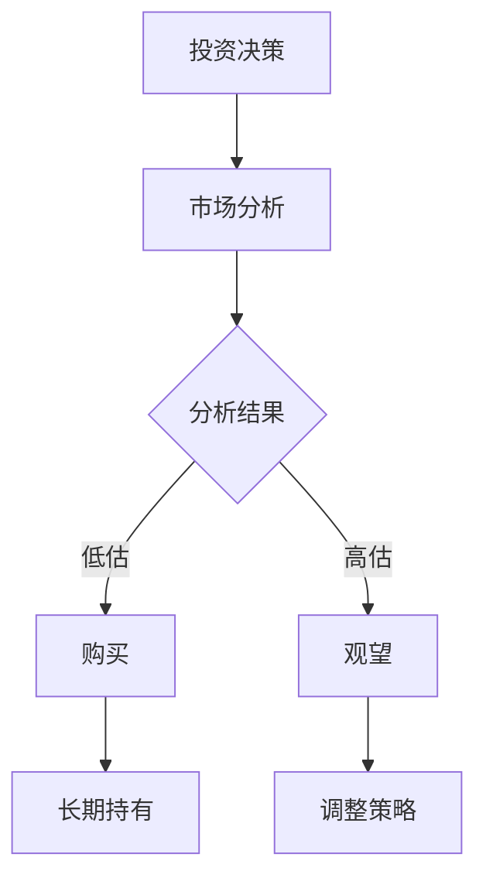
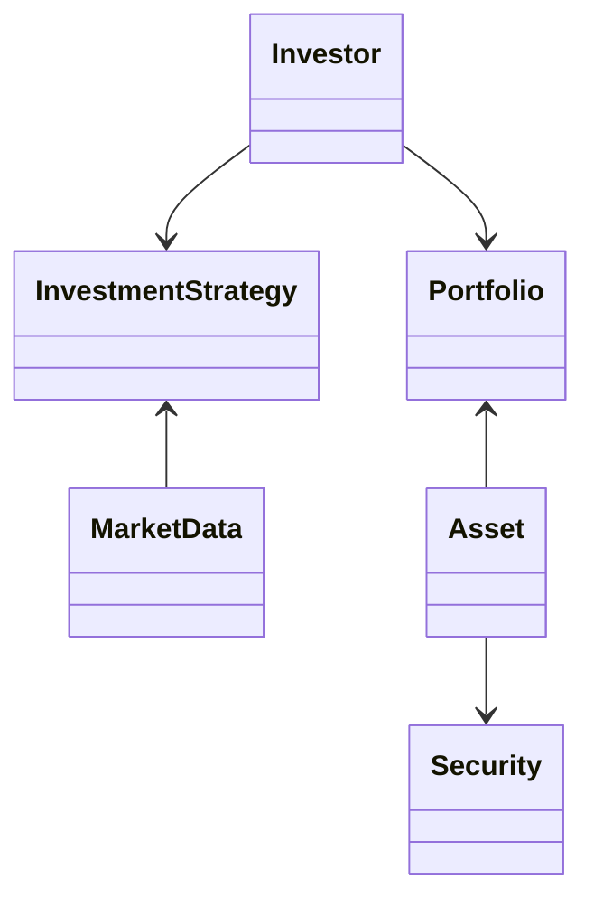
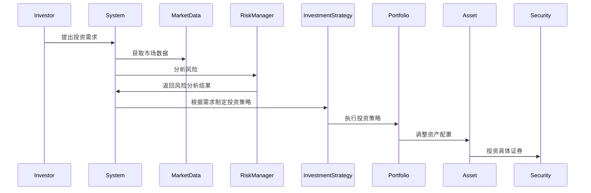
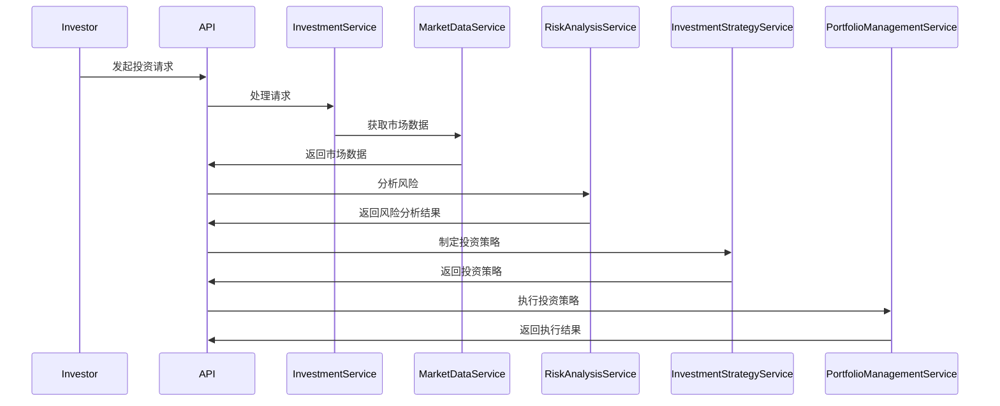

                 

## 引言

### 1.1 投资国际化的趋势

在全球化深入发展的背景下，投资国际化已经成为不可逆转的趋势。随着跨国公司和全球资本流动的增多，投资者面临着前所未有的机遇和挑战。首先，跨国公司的扩张和国际并购活动频繁，使得资本在全球范围内高效配置，这为投资者提供了更多的投资机会。其次，跨境资本流动日益活跃，国际投资者可以通过各种金融工具投资于全球市场，从而实现资产多元化和风险分散。例如，根据国际货币基金组织（IMF）的数据，全球跨境资本流动在2019年达到了8.7万亿美元，显示出投资者对国际市场的强烈兴趣。

然而，投资国际化并非一帆风顺。投资者在跨境投资过程中需要应对各种复杂的风险，如汇率波动、政策变化、市场不稳定性等。此外，国际投资环境也因国家而异，不同国家和地区在法律法规、税收政策、市场成熟度等方面存在显著差异。因此，投资者在制定跨境投资策略时，必须深入了解目标市场的特点，以避免潜在的风险。

### 1.2 跨境投资的挑战与机遇

跨境投资既充满挑战，又充满机遇。首先，从挑战的角度来看，投资者需要面对汇率波动带来的不确定性。汇率的波动可能直接影响投资回报，尤其是在长周期投资中，汇率波动可能带来显著的风险。其次，政策变化也是跨境投资面临的一个重要挑战。不同国家的政策调整，如关税政策、贸易限制等，都可能对投资产生重大影响。此外，市场不稳定性也是投资者需要警惕的因素，国际市场的不确定性可能导致投资回报的不稳定。

然而，与挑战并存的是跨境投资的巨大机遇。首先，国际市场的多元化提供了丰富的投资机会，投资者可以通过投资于不同国家的资产来分散风险。其次，国际化投资可以带来更高的回报潜力。一些新兴市场国家的经济增长速度快，投资回报率较高，这吸引了大量国际资本。此外，跨境投资还可以帮助投资者利用不同市场的经济周期，实现投资收益的最大化。

### 1.3 本书的目标与结构

本书旨在帮助投资者深入理解跨境投资策略，尤其是价值投资在国际化的应用。我们将首先介绍价值投资的核心原理，并探讨其在国际化背景下的应用。接下来，我们将分析跨境投资的风险与收益，并讨论如何制定有效的跨境投资策略。随后，本书将通过实际案例，展示跨境投资策略的应用和实践。最后，我们将总结跨境投资的发展趋势，并提出未来的发展方向。

整体结构如下：

- **第1章 引言**：介绍投资国际化的趋势、跨境投资的挑战与机遇，以及本书的目标和结构。

- **第2章 价值投资概述**：详细探讨价值投资的核心原理，以及其在国际化背景下的应用。

- **第3章 跨境投资策略分析**：分析跨境投资的风险与收益，讨论如何制定有效的跨境投资策略。

- **第4章 跨境投资案例分析**：通过实际案例，展示跨境投资策略的应用和实践。

- **第5章 跨境投资工具与方法**：介绍跨境投资中介机构的作用、投资工具的应用等。

- **第6章 国际化投资组合管理**：讨论投资组合的多元化策略、风险管理方法等。

- **第7章 总结与展望**：总结跨境投资的发展趋势，并提出未来的发展方向。

通过上述结构，本书旨在为投资者提供全面的跨境投资策略指南，帮助他们在国际化投资中取得成功。

### 2. 价值投资概述

#### 2.1 价值投资的核心原理

价值投资，作为一种投资策略，其核心原理可以归结为以下几点：首先，价值投资强调投资于那些价格被市场低估的优质企业。投资者通过深入分析企业的基本面，如财务状况、管理层能力、行业前景等，来判断其真实价值。与市场普遍的炒作行为不同，价值投资者倾向于寻找那些市场忽视或低估的企业，以较低的价格购买。

其次，价值投资注重长期持有。价值投资者相信，优质企业在其核心竞争力的支持下，长期来看其价值会逐渐被市场认识到。因此，他们往往采取长期持有的策略，以实现资本增值。这种策略要求投资者有耐心和信心，不受短期市场波动的影响。

第三，价值投资还强调风险管理。投资者不仅要关注潜在的投资回报，还要认真评估投资风险。通过合理的分散投资，投资者可以降低单一投资风险，从而实现整体投资组合的风险控制。

#### 2.1.1 价值投资的基本理念

价值投资的基本理念可以总结为以下几点：

1. **真实价值**：投资者需要通过深入分析企业的基本面，判断其真实价值。这种分析不仅包括财务数据，还涉及企业管理层的能力、行业前景等多方面因素。

2. **安全边际**：安全边际是指投资价格与真实价值之间的差额。价值投资者认为，只有在安全边际足够大的情况下，投资才是合理的。这种理念源于投资者的风险偏好，即更倾向于低风险、高回报的投资。

3. **长期持有**：与短期投机行为不同，价值投资者更注重长期持有，相信优质企业长期来看会实现价值的重估。

#### 2.1.2 价值投资的评价标准

在评价价值投资时，投资者通常会关注以下几个关键指标：

1. **市盈率（P/E）**：市盈率是衡量企业盈利能力的重要指标，低市盈率通常意味着企业可能被市场低估。但需要注意的是，市盈率仅是众多评价标准之一，不能单独作为投资决策的依据。

2. **市净率（P/B）**：市净率反映了企业股票价格与其净资产之间的关系，较低市净率通常表明企业具有投资价值。

3. **现金流折现（DCF）**：现金流折现法通过估算企业的未来现金流并将其折现到当前价值，以评估企业的内在价值。这种方法能够更全面地反映企业的长期盈利能力。

4. **市销率（P/S）**：市销率反映了企业股票价格与其销售收入之间的关系，较低市销率可能意味着企业有较好的投资价值。

#### 2.1.3 价值投资的历史与实践

价值投资理念最早可以追溯到19世纪末20世纪初的美国，由著名的投资大师本杰明·格雷厄姆（Benjamin Graham）创立。格雷厄姆认为，投资者应通过分析企业的财务报表，寻找那些市场价格低于其内在价值的股票，从而实现稳定的投资回报。

在格雷厄姆之后，另一位投资大师沃伦·巴菲特（Warren Buffett）进一步发展了价值投资理论。巴菲特强调长期持有和耐心等待，他的投资哲学被称为“价值投资+长期持有”。巴菲特通过投资于可口可乐、沃尔玛等优质企业，实现了卓越的投资回报。

价值投资在中国市场也得到了广泛应用。例如，著名的投资大师张磊创立的高瓴资本，通过深入的价值分析和长期持有策略，取得了显著的投资成果。

总之，价值投资作为一种经典的投资策略，其核心原理和评价标准在不同的市场环境中都具有普遍适用性。通过深入理解价值投资的基本理念，投资者可以更好地把握投资机会，实现长期稳定的投资回报。

#### 2.2 国际化背景下的价值投资

在全球经济一体化的背景下，价值投资策略面临着新的机遇与挑战。国际化背景下的价值投资不仅需要投资者具备深入的基本面分析能力，还需要对全球市场环境有敏锐的洞察力。以下将详细探讨全球经济一体化的影响、国际投资环境的分析以及如何根据国际化背景调整价值投资策略。

##### 2.2.1 全球经济一体化的影响

全球经济一体化对跨境投资策略产生了深远的影响。首先，全球经济一体化促进了资本在全球范围内的自由流动，使得投资者能够更加灵活地配置资产。跨国公司和国际投资者可以通过跨境投资，实现资产的多元化，从而降低投资风险并提高回报率。其次，全球经济一体化使得不同国家之间的经济联系更加紧密，国际间的经济互补性增强，这为投资者提供了更多的投资机会。例如，投资者可以通过投资于那些经济增长迅速、市场潜力巨大的新兴市场国家，获得更高的投资回报。

此外，全球经济一体化也带来了一些挑战。一方面，全球市场的联动性增强，某一地区的经济波动可能会迅速影响到其他地区，增加了跨境投资的不确定性。另一方面，不同国家的政策差异和法律法规的不一致性，也对跨境投资带来了额外复杂性。投资者在国际化投资过程中，需要深入了解目标市场的政策环境和法律法规，以规避潜在风险。

##### 2.2.2 国际投资环境的分析

国际投资环境的分析是制定有效跨境投资策略的基础。投资者需要从多个角度对国际投资环境进行评估，包括经济、政治、法律和文化等方面。

1. **经济环境**：经济环境是投资者进行国际投资的首要考虑因素。投资者需要分析目标国家的宏观经济状况，如GDP增长率、通货膨胀率、利率水平等。此外，行业前景和市场容量也是重要的经济指标。例如，某些行业的全球化程度较高，投资回报率可能较高，而某些行业则可能面临较大的不确定性。

2. **政治环境**：政治稳定性是跨境投资的重要保障。投资者需要关注目标国家的政治稳定性、政策连贯性和政府治理能力。例如，政治动荡、政权更迭或政策频繁变动都可能对投资产生不利影响。此外，投资者还需要了解目标国家的税收政策、贸易政策和其他经济政策，以评估这些政策对投资回报的影响。

3. **法律环境**：法律环境包括法律法规的完善程度、司法体系的独立性和执行力等。投资者需要确保投资行为符合目标国家的法律规定，避免因法律风险导致投资失败。例如，一些国家对跨境投资有特定的法律法规要求，如审批程序、外资比例限制等。

4. **文化环境**：文化环境对跨境投资也有着重要影响。投资者需要了解目标国家的文化习俗、商业习惯和管理风格，以适应不同的商业环境。例如，一些国家的商业文化更加注重关系和信任，而另一些国家则更强调法律和合同。

##### 2.2.3 国际化投资的策略调整

在国际投资环境中，投资者需要根据具体情况调整价值投资策略，以适应全球化背景下的投资挑战和机遇。

1. **多元化投资策略**：通过多元化投资，投资者可以分散风险，降低单一市场波动对整体投资组合的影响。在国际投资中，投资者可以考虑在不同国家和地区投资，以充分利用全球市场的机会。例如，投资于新兴市场和发达市场，不同行业的龙头企业等。

2. **深入分析目标市场**：投资者需要深入了解目标市场的经济、政治、法律和文化环境，制定符合实际情况的投资策略。例如，在投资新兴市场时，需要关注其政策稳定性、市场潜力和经济周期；在投资发达市场时，则需要关注其市场成熟度、盈利能力和政策环境。

3. **灵活调整投资组合**：投资者应根据市场变化和国际投资环境的变化，灵活调整投资组合。例如，在市场波动较大时，可以考虑降低高风险资产的比重，增加稳定收益资产的配置；在经济周期不同阶段，可以调整投资行业和企业的选择。

4. **加强风险管理**：在国际投资中，投资者需要加强风险管理，以应对不同市场环境下的风险。例如，通过外汇风险管理、市场风险管理、信用风险管理等手段，降低投资组合的整体风险。

总之，国际化背景下的价值投资不仅需要投资者具备深厚的基本面分析能力，还需要对全球市场环境有全面的了解。通过合理的策略调整和风险管理，投资者可以在全球化背景下实现长期稳定的投资回报。

### 3. 跨境投资策略分析

#### 3.1 跨境投资的风险与收益分析

跨境投资作为连接不同国家和市场的桥梁，既带来了潜在的高回报，也伴随着复杂的投资风险。了解这些风险与收益，是投资者制定有效跨境投资策略的关键。

**3.1.1 跨境投资的风险类型**

1. **汇率风险**：汇率波动是跨境投资中最常见的一种风险。由于不同国家的货币汇率不断变化，投资者在跨境投资时可能会面临汇率损失。特别是在长期投资中，汇率的波动可能对投资回报产生显著影响。

2. **政治风险**：政治风险包括政策变动、政治稳定性、法律环境等。例如，目标国家的政权更迭、政策变化、贸易争端等都可能对跨境投资产生不利影响。政治不稳定可能导致投资环境恶化，从而影响投资回报。

3. **市场风险**：市场风险是指由于市场波动导致投资损失的风险。跨境投资涉及多个市场，投资者需要关注不同市场的波动性。例如，股市动荡、经济衰退等都可能导致投资回报下降。

4. **信用风险**：信用风险涉及目标国家的违约风险。投资者需要评估目标国家的信用状况，避免投资于信用评级低的企业或国家，从而降低投资损失风险。

5. **操作风险**：操作风险是指由于管理不善、操作失误导致的投资损失。跨境投资涉及跨文化操作，需要投资者具备较高的管理水平，以规避操作风险。

**3.1.2 跨境投资的收益来源**

1. **资产配置收益**：通过跨境投资，投资者可以实现资产配置的多元化，降低整体投资组合的风险，从而提高投资回报。在全球化背景下，不同国家和市场的投资机会和风险各不相同，投资者可以通过分散投资来优化投资组合。

2. **经济增长收益**：跨境投资可以投资于经济增长潜力大的国家或行业，从而实现较高的投资回报。例如，新兴市场国家的经济快速增长为投资者提供了良好的投资机会。

3. **汇率变动收益**：投资者可以通过对汇率变动的预测，进行外汇交易，从而获取汇率变动带来的收益。例如，在某一货币贬值预期下，投资者可以通过买入该货币的看跌期权来规避汇率损失，并获得额外收益。

4. **资本市场收益**：跨境投资可以投资于全球资本市场，获取资本市场上涨带来的收益。例如，投资于发达市场的优质企业，通过其股价上涨获得资本增值。

**3.1.3 风险与收益的平衡策略**

为了在跨境投资中实现风险与收益的平衡，投资者需要采取一系列策略：

1. **多元化投资**：通过在多个国家和市场进行投资，投资者可以分散风险，降低单一市场波动对整体投资组合的影响。

2. **风险管理工具**：投资者可以使用各种风险管理工具，如外汇衍生品、期权、期货等，对冲投资风险。

3. **长期持有**：价值投资者通常采取长期持有的策略，以规避短期市场波动的影响，从而实现长期稳定的投资回报。

4. **深入了解市场**：投资者需要深入了解目标市场的经济、政治、法律和文化环境，制定符合实际情况的投资策略。

5. **定期评估与调整**：投资者需要定期评估投资组合的表现，并根据市场变化和国际投资环境的变化，灵活调整投资策略。

通过上述策略，投资者可以在跨境投资中实现风险与收益的平衡，从而在全球市场获得稳定的投资回报。

#### 3.2 国际化企业的价值评估

在国际投资中，准确评估目标企业的价值是投资者成功的关键。由于国际化企业涉及跨国运营，其财务数据和市场环境相对复杂，因此，投资者需要采用多种方法进行全面、深入的价值评估。

**3.2.1 国际化企业的财务分析**

国际化企业的财务分析是价值评估的基础。投资者需要从多个角度对企业的财务状况进行分析，包括但不限于以下几个方面：

1. **资产负债表分析**：资产负债表反映了企业的资产、负债和所有者权益。投资者需要关注企业的资产质量、负债水平以及资本结构，评估其财务稳健性。例如，高负债比例可能表明企业存在较大的偿债压力，而良好的资产质量则表明企业有较强的盈利能力。

2. **利润表分析**：利润表反映了企业的营业收入、成本、费用和利润。投资者需要关注企业的盈利能力、成本控制和利润率水平。例如，高利润率可能表明企业在市场竞争中处于有利地位，而持续增长的营业收入则表明企业具有较好的市场前景。

3. **现金流量表分析**：现金流量表反映了企业的现金流入和流出情况，包括经营活动、投资活动和筹资活动产生的现金流量。投资者需要关注企业的现金流量状况，评估其经营活动的现金生成能力。例如，良好的现金流量表明企业具有较强的支付能力和财务灵活性。

4. **财务比率分析**：投资者可以通过计算一系列财务比率，如流动比率、速动比率、负债比率、利润率等，评估企业的财务健康状况。例如，高流动比率可能表明企业具备较好的短期偿债能力，而高负债比率则可能表明企业存在较大的财务风险。

**3.2.2 国际化企业的估值模型**

在国际投资中，投资者通常采用多种估值模型对国际化企业进行评估。以下是一些常用的估值模型：

1. **市盈率（P/E）模型**：市盈率模型通过比较目标企业的市盈率与其同行业公司的平均水平，来判断其是否被高估或低估。市盈率较低可能表明企业被低估，具有较高的投资价值。

2. **市净率（P/B）模型**：市净率模型通过比较目标企业的市净率与其同行业公司的平均水平，来判断其是否被高估或低估。市净率较低可能表明企业被低估，具有较高的投资价值。

3. **现金流折现（DCF）模型**：现金流折现模型通过估算企业的未来现金流并将其折现到当前价值，以评估企业的内在价值。这种方法能够更全面地反映企业的长期盈利能力。

4. **经济附加值（EVA）模型**：经济附加值模型通过计算企业在经营过程中为股东创造的价值，来评估企业的价值。这种方法强调企业的盈利能力和资本使用效率。

**3.2.3 跨境并购与估值调整**

在跨境并购中，估值调整是关键环节。投资者需要根据目标企业的具体情况，调整其估值模型，以更准确地评估其价值。

1. **跨国整合成本**：投资者需要考虑跨国并购带来的整合成本，如文化整合、管理体系整合等。这些成本可能对企业的实际价值产生影响，需要在估值过程中进行调整。

2. **跨国运营风险**：投资者需要考虑目标企业在跨国运营过程中可能面临的风险，如汇率风险、政治风险等。这些风险可能对企业的实际价值产生影响，需要在估值过程中进行调整。

3. **跨国并购的协同效应**：投资者需要评估跨国并购可能带来的协同效应，如成本节约、市场份额增加等。这些协同效应可能提高企业的实际价值，需要在估值过程中进行正向调整。

通过上述分析，投资者可以更全面、准确地评估国际化企业的价值，为跨境投资决策提供有力支持。

#### 3.3 跨境并购与估值调整

跨境并购作为一种重要的投资策略，在实现资产增值和业务扩展方面具有显著优势。然而，并购过程中涉及复杂的估值调整，需要投资者充分考虑各种因素，以实现并购目标的最大价值。

**3.3.1 跨境并购的动机**

跨境并购的动机多种多样，主要包括以下几点：

1. **市场扩展**：通过并购，企业可以迅速进入新的市场，扩大市场份额。这对于希望在全球范围内实现业务布局的企业尤为重要。

2. **技术获取**：并购可以帮助企业获取先进技术和管理经验，提升自身竞争力。例如，高科技企业通过并购，可以快速获得核心技术，从而推动技术创新和产品升级。

3. **成本节约**：通过并购，企业可以实现生产规模扩大和资源整合，从而降低生产成本。例如，制造业企业通过并购，可以实现生产线的优化和整合，降低运营成本。

4. **财务协同**：并购可以实现财务协同效应，如税收优化、债务重组等。这些财务协同效应可以提升企业的财务健康状况和资本使用效率。

**3.3.2 估值调整的方法**

在跨境并购中，估值调整是关键环节。投资者需要采用多种方法，对目标企业的价值进行准确评估，并在此基础上进行调整。以下是一些常用的估值调整方法：

1. **折现现金流（DCF）模型**：DCF模型通过估算企业的未来现金流并将其折现到当前价值，以评估企业的内在价值。这种方法考虑了企业的盈利能力和未来增长潜力，具有较高的准确性。然而，DCF模型需要预测未来现金流和折现率，具有一定的不确定性。

2. **市盈率（P/E）模型**：P/E模型通过比较目标企业的市盈率与其同行业公司的平均水平，来判断其是否被高估或低估。这种方法适用于市场相对成熟、估值较为稳定的企业。然而，P/E模型受市场波动影响较大，可能存在偏差。

3. **市净率（P/B）模型**：P/B模型通过比较目标企业的市净率与其同行业公司的平均水平，来判断其是否被高估或低估。这种方法适用于资产密集型行业，如银行业、房地产业等。P/B模型相对稳定，但可能忽视企业的盈利能力。

4. **经济附加值（EVA）模型**：EVA模型通过计算企业在经营过程中为股东创造的价值，来评估企业的价值。这种方法强调了企业的盈利能力和资本使用效率，但计算过程较为复杂。

**3.3.3 跨境并购的估值调整因素**

在进行估值调整时，投资者需要充分考虑以下因素：

1. **跨国整合成本**：跨境并购通常涉及跨文化整合、管理体系整合等成本。这些成本可能对企业的实际价值产生影响，需要在估值过程中进行调整。例如，文化差异可能导致管理难度增加，从而影响企业的运营效率。

2. **跨国运营风险**：跨境并购需要考虑目标企业在跨国运营过程中可能面临的风险，如汇率风险、政治风险等。这些风险可能对企业的实际价值产生影响，需要在估值过程中进行调整。例如，汇率波动可能导致企业的财务状况恶化。

3. **跨国并购的协同效应**：投资者需要评估跨境并购可能带来的协同效应，如成本节约、市场份额增加等。这些协同效应可能提高企业的实际价值，需要在估值过程中进行正向调整。例如，通过并购，企业可以实现生产规模的扩大，降低生产成本。

4. **市场环境变化**：市场环境的变化，如经济周期、行业趋势等，也可能对企业的价值产生影响。投资者需要根据市场环境的变化，灵活调整估值模型，以更准确地评估企业的价值。

通过上述方法，投资者可以在跨境并购中实现更准确的估值调整，为并购决策提供有力支持。有效的估值调整不仅有助于提高并购的成功率，还可以最大化企业的投资回报。

### 4. 跨境投资案例分析

#### 4.1 案例一：中美投资的跨文化挑战

##### 4.1.1 案例背景

本案例选取了中美两国之间的跨境投资，特别是中国企业在美国市场的投资行为，作为研究对象。近年来，随着中国企业的国际化和美国市场的吸引力增强，中美之间的跨境投资活动日益频繁。然而，这种跨境投资不仅涉及经济和市场的挑战，还涉及复杂的文化差异和商业环境。

2008年，中国家电巨头海尔集团宣布收购美国白电品牌GE Appliances，这是中国企业在美国市场的重要一步。海尔希望通过此次并购，进入美国高端家电市场，并利用GE Appliances的品牌和技术优势提升自身竞争力。

##### 4.1.2 投资决策分析

海尔的此次投资决策主要基于以下几点：

1. **市场潜力**：美国是全球最大的家电市场之一，高端家电市场尤其具有吸引力。海尔希望通过并购GE Appliances，迅速进入这一市场，实现品牌和市场份额的提升。

2. **技术提升**：GE Appliances在技术创新和产品设计方面具有优势，海尔希望通过并购获得这些技术，提升自身产品竞争力。

3. **品牌影响力**：GE Appliances作为知名品牌，具有较高的市场认可度和消费者忠诚度，这有助于海尔在美国市场树立品牌形象。

然而，海尔的此次投资也面临诸多挑战：

1. **文化差异**：中美文化差异显著，海尔需要克服文化冲突和管理挑战。例如，美国企业文化注重创新和个人主义，而中国企业文化则更强调团队协作和集体主义。

2. **法律环境**：美国市场法律法规严格，海尔需要熟悉并遵守当地法律法规，特别是在知识产权保护方面。

3. **市场波动**：美国市场波动较大，海尔需要应对经济波动和市场需求变化，确保投资回报。

##### 4.1.3 案例总结与启示

海尔的此次投资虽然取得了一定的成功，但也暴露出诸多挑战和问题。以下是对此案例的总结与启示：

1. **文化融合**：跨文化管理是跨境投资的重要一环。企业需要注重文化差异，积极推动文化融合，以提升运营效率。例如，海尔可以通过培训和交流，加强中美员工的相互理解和信任。

2. **法律法规遵守**：了解并遵守目标市场的法律法规，是跨境投资的基本要求。企业需要建立合规部门，确保所有业务活动符合当地法律规定。

3. **市场调研**：充分的市场调研是成功投资的前提。企业需要深入了解目标市场的需求、竞争环境和消费者偏好，以制定有效的市场策略。

4. **风险管理**：跨境投资面临多种风险，企业需要建立健全的风险管理体系，及时应对市场变化和风险挑战。

总之，跨境投资虽然充满挑战，但通过有效的管理和策略，企业可以克服文化差异、法律环境等难题，实现国际化发展的目标。

#### 4.2 案例二：欧洲市场的投资机遇

##### 4.2.1 案例背景

本案例选取了中国互联网巨头阿里巴巴在欧洲市场的投资作为研究对象。随着欧洲市场的稳定增长和消费升级，阿里巴巴看到了巨大的市场机遇，积极在欧洲布局，以实现其全球化战略目标。

2014年，阿里巴巴集团宣布收购西班牙电商平台Privalia，这是阿里巴巴在欧洲市场的重要一步。Privalia在西班牙和欧洲其他市场具有较高的市场份额和品牌知名度，为阿里巴巴提供了进入欧洲电商市场的契机。

##### 4.2.2 投资策略与实践

阿里巴巴此次投资的主要策略和实践包括：

1. **市场调研与定位**：阿里巴巴在收购Privalia之前，进行了深入的市场调研，明确了欧洲电商市场的需求和竞争格局。通过精准的市场定位，阿里巴巴制定了针对性的市场进入策略。

2. **整合资源与优势互补**：阿里巴巴通过整合自身在电商、支付、物流等方面的优势，与Privalia进行资源互补。例如，阿里巴巴的物流体系可以支持Privalia在欧洲市场的快速配送，从而提升用户体验。

3. **本地化运营**：阿里巴巴重视本地化运营，尊重欧洲市场的文化习俗和消费习惯。例如，阿里巴巴在欧洲市场推出了符合当地消费者需求的购物节，如“双11欧洲购物节”，取得了良好的市场反响。

##### 4.2.3 案例总结与启示

阿里巴巴在欧洲市场的投资取得了显著成效，以下是对此案例的总结与启示：

1. **深入市场调研**：充分的市场调研是成功投资的前提。企业需要深入了解目标市场的需求和竞争环境，以制定有效的市场进入策略。

2. **资源整合与优势互补**：跨境投资可以通过整合资源，实现优势互补，从而提升整体竞争力。例如，阿里巴巴通过整合自身在电商、支付、物流等方面的优势，提升了在欧洲市场的运营效率。

3. **本地化运营**：本地化运营是跨境投资的关键。企业需要尊重目标市场的文化习俗和消费习惯，以提升用户满意度和市场占有率。

4. **风险管理**：跨境投资面临多种风险，企业需要建立健全的风险管理体系，及时应对市场变化和风险挑战。

总之，跨境投资虽然充满挑战，但通过深入的市场调研、资源整合和本地化运营，企业可以在国际市场中找到巨大的机遇，实现全球化发展的目标。

### 5. 跨境投资工具与方法

跨境投资的成功不仅依赖于投资者对市场的敏锐洞察和深入分析，还依赖于有效的工具和方法。以下将介绍跨境投资中介机构的作用、投资工具的应用以及跨境投资中的风险管理策略。

#### 5.1 跨境投资中介机构的作用

跨境投资中介机构在投资者进行跨国投资时发挥着重要作用。这些机构包括商业银行、投资银行、律师事务所、会计师事务所和咨询公司等。

1. **商业银行**：商业银行在跨境投资中提供资金渠道和外汇兑换服务。例如，投资者可以通过商业银行进行跨境资金调拨，实现资金的自由流动。此外，商业银行还提供外汇风险管理工具，如外汇远期合约和外汇期权，帮助投资者规避汇率波动带来的风险。

2. **投资银行**：投资银行为投资者提供并购咨询、融资安排和资产管理等服务。在跨境并购中，投资银行的专业团队可以帮助投资者进行尽职调查、估值分析和谈判，确保投资决策的准确性。同时，投资银行还提供发行债券和股票等融资工具，帮助投资者筹集资金。

3. **律师事务所**：律师事务所为投资者提供法律咨询和合规服务。跨境投资涉及不同国家的法律法规，律师事务所可以帮助投资者了解目标国家的法律环境，确保投资行为合法合规。此外，律师事务所还提供知识产权保护和诉讼代理等服务，为投资者的权益提供保障。

4. **会计师事务所**：会计师事务所为投资者提供财务审计、税务咨询和财务报告服务。跨境投资需要对目标企业的财务状况进行深入分析，会计师事务所的专业团队可以提供独立的财务审计和评估报告，帮助投资者评估目标企业的真实价值。此外，会计师事务所以还提供税务规划服务，帮助投资者优化税务结构，降低税务负担。

5. **咨询公司**：咨询公司为投资者提供市场调研、战略规划和运营管理等服务。在跨境投资中，咨询公司可以帮助投资者了解目标市场的经济环境、政策法规和文化习俗，制定切实可行的投资策略。此外，咨询公司还可以提供人力资源管理、供应链管理和信息技术等方面的咨询服务，帮助投资者实现跨国运营的顺利过渡。

#### 5.2 投资工具的应用

在跨境投资中，投资者可以运用多种金融工具来管理风险和实现投资目标。以下介绍几种常用的投资工具：

1. **外汇衍生品**：外汇衍生品包括外汇远期合约、外汇期权和外汇掉期等。这些工具可以帮助投资者对冲汇率波动风险。例如，外汇远期合约允许投资者提前锁定未来的汇率，从而规避汇率波动带来的不确定性。外汇期权则赋予投资者在未来某一时间以特定价格买入或卖出外汇的权利，但不是义务，从而提供了一种灵活的风险管理工具。

2. **商品期货和期权**：商品期货和期权可以用于对冲原材料成本或投资组合风险。例如，农产品企业可以通过购买玉米期货合约，锁定未来的采购成本，从而规避价格波动风险。同样，投资者也可以通过商品期权进行风险管理，例如购买原油看跌期权，以保护其投资组合免受油价下跌的影响。

3. **股票和债券**：跨境投资中的股票和债券投资可以帮助投资者实现资产配置和风险分散。投资者可以通过购买外国股票和债券，分散国内投资组合的风险。此外，投资者还可以通过跨国基金和交易所交易基金（ETF）进行跨境投资，这些工具提供了便捷的投资渠道和较低的交易成本。

4. **货币市场工具**：货币市场工具如存款证明（CDs）、商业票据和短期债券等，可以为投资者提供稳定的收益和流动性。这些工具适合于短期投资和资金管理，例如，跨国公司可以利用短期债券来优化其资金结构，提高资金使用效率。

#### 5.3 跨境投资风险管理策略

跨境投资面临多种风险，包括汇率风险、政治风险、市场风险和信用风险等。有效的风险管理策略是确保投资成功的关键。

1. **多元化投资**：通过在多个国家和地区进行投资，投资者可以分散风险，降低单一市场波动对整体投资组合的影响。多元化投资不仅包括资产类型，还应涵盖不同行业、地区和市场。

2. **对冲策略**：投资者可以利用外汇衍生品、商品期货和期权等工具进行风险对冲。例如，通过购买外汇远期合约，投资者可以锁定未来的汇率，规避汇率波动带来的风险。

3. **风险评估与监控**：投资者需要建立全面的风险评估体系，定期对投资组合进行风险评估和监控。通过实时监控市场变化和风险因素，投资者可以及时调整投资策略，规避潜在的风险。

4. **政策合规**：投资者需要遵守目标国家的法律法规，确保投资行为的合法性。例如，投资者在跨境投资中需要了解并遵守反洗钱法规、税收政策和外汇管制政策等。

5. **灵活调整**：跨境投资环境多变，投资者需要保持灵活性，及时调整投资策略。例如，在市场波动较大时，投资者可以降低高风险资产的比重，增加稳定收益资产的配置。

总之，跨境投资工具和风险管理策略的合理运用，可以帮助投资者在全球化背景下实现风险可控、收益稳定的投资目标。

### 6. 国际化投资组合管理

#### 6.1 投资组合的多元化策略

国际化投资组合管理的核心在于多元化策略的实施，通过在全球范围内的资产配置，投资者可以有效地分散风险，提高投资回报的稳定性。以下将详细探讨多元化策略的理论基础、实际操作方法以及投资组合的调整与优化。

**6.1.1 多元化策略的理论基础**

多元化策略的理论基础主要源于现代投资组合理论（Modern Portfolio Theory，MPT）和资本资产定价模型（Capital Asset Pricing Model，CAPM）。现代投资组合理论由哈里·马科维茨（Harry Markowitz）在1950年代提出，指出通过投资于不同的资产类别和地区，投资者可以在不降低预期收益的前提下降低投资组合的整体风险。资本资产定价模型则进一步阐述了多元化投资如何通过降低非系统性风险，实现投资组合的优化。

根据MPT，投资组合的风险和收益由两部分组成：系统性风险和非系统性风险。系统性风险是指影响整个市场的风险，如利率变动、经济衰退等，无法通过分散投资来消除。而非系统性风险则是特定资产特有的风险，可以通过多元化投资来降低。多元化策略通过在多个不同资产类别、行业和地区进行投资，可以最大限度地降低非系统性风险，从而提高投资组合的整体稳健性。

**6.1.2 多元化策略的实际操作**

1. **资产类别分散**：投资者应在股票、债券、现金、房地产等多种资产类别之间进行分散投资。股票可以提供较高的回报潜力，但波动性较大；债券相对稳定，但回报较低；现金具有流动性，但收益有限。通过在不同资产类别之间进行分散，投资者可以在保持回报的同时降低风险。

2. **行业分散**：投资者应在不同行业之间进行投资，以避免单一行业波动对投资组合的冲击。例如，在股市中，投资者可以同时投资于消费品、科技、金融和能源等行业。不同行业的周期性波动可以相互抵消，从而降低整体投资组合的风险。

3. **地区分散**：投资者应在不同国家和地区进行投资，以利用全球市场的不同经济周期和增长潜力。发达国家市场如美国、欧洲等，通常提供较高的稳定回报，但增长潜力相对有限；新兴市场国家如中国、印度等，虽然波动性较大，但具有更高的增长潜力。

**6.1.3 投资组合的调整与优化**

1. **定期评估**：投资者需要定期对投资组合进行评估，以确认其是否符合多元化的目标。通过定期评估，投资者可以发现和纠正投资组合中的偏差，确保资产分布符合预期。

2. **再平衡**：根据市场变化和投资目标，投资者需要对投资组合进行再平衡。例如，如果某一资产类别表现良好，其占比可能会超过预期，投资者应适当减少其持仓，增加其他表现较差的资产类别的比重，以维持多元化的风险分散效果。

3. **风险管理**：投资者应密切关注投资组合的风险水平，通过调整持仓比例和引入风险对冲工具，如期权和期货，来降低整体风险。

4. **持续学习**：全球市场环境和经济状况不断变化，投资者需要持续学习，了解新兴市场和行业趋势，及时调整投资策略，以适应市场变化。

通过多元化的投资策略，投资者可以在全球范围内优化资产配置，降低风险，提高投资回报的稳定性。有效的投资组合调整和优化，是实现长期稳定投资回报的关键。

#### 6.2 风险管理策略

在国际投资环境中，风险管理策略至关重要。跨境投资不仅面临市场波动、汇率风险和政策变化等挑战，还涉及信用风险、操作风险等多种不确定性。以下将详细介绍风险管理策略，包括基本原则、具体方法和实际应用。

**6.2.1 风险管理的基本原则**

1. **全面性原则**：风险管理应覆盖投资组合的各个方面，包括市场风险、信用风险、操作风险、法律风险等。通过全面识别和评估各种风险，投资者可以制定综合性的风险管理策略。

2. **前瞻性原则**：风险管理应具有前瞻性，提前预见潜在风险，并采取预防措施。例如，通过定期市场分析和政策监控，投资者可以提前识别市场变化，调整投资策略，降低风险。

3. **动态性原则**：风险管理体系应具备动态调整能力，根据市场变化和投资组合表现，及时调整风险管理策略。例如，在市场波动较大时，投资者可以增加风险对冲工具的使用，降低风险暴露。

4. **稳健性原则**：风险管理应注重稳健性，确保投资组合的稳健性。通过分散投资、多样化资产配置和合理的风险控制，投资者可以降低整体风险水平。

**6.2.2 风险管理的方法**

1. **风险识别**：投资者首先需要识别投资组合中的各种风险，包括市场风险、信用风险、操作风险等。市场风险涉及汇率波动、利率变化等，信用风险涉及企业违约、债务风险等，操作风险涉及管理失误、操作失误等。

2. **风险评估**：在识别风险后，投资者需要对风险进行量化评估，以确定风险的程度和影响。例如，使用VaR（Value at Risk）模型评估市场风险的极端损失，使用信用评分模型评估信用风险，使用操作风险评估模型评估操作风险。

3. **风险控制**：投资者应采取一系列措施来控制风险。例如，通过多元化投资分散市场风险，使用期权、期货等衍生品对冲汇率风险，建立内部风险控制机制，加强合规管理。

4. **风险监控**：投资者需要建立有效的风险监控体系，实时监控投资组合的风险水平，及时发现潜在风险，并采取相应措施进行风险控制。例如，通过风险管理系统实时跟踪市场数据，定期进行风险评估和报告，确保风险处于可控范围。

**6.2.3 实际应用**

1. **市场风险管理**：投资者可以通过分散投资降低市场风险。例如，在股票投资中，同时投资于不同行业、不同市场的股票，通过行业和市场的多元化，降低单一市场波动对投资组合的影响。此外，投资者还可以使用外汇衍生品，如外汇远期合约和期权，对冲汇率波动风险。

2. **信用风险管理**：投资者应通过严格的企业信用评估，选择信用评级较高的企业进行投资，以降低信用风险。例如，在债券投资中，优先选择信用评级较高的企业债券，以规避违约风险。同时，投资者还可以使用信用违约互换（CDS）等衍生品进行信用风险对冲。

3. **操作风险管理**：投资者需要建立完善的内部控制制度，确保操作风险处于可控范围。例如，制定操作规程和风险管理流程，加强员工培训，提高操作风险管理能力。此外，投资者还可以使用防火墙技术、数据加密等措施，提高信息系统安全性。

通过上述风险管理策略，投资者可以在国际投资环境中有效控制风险，确保投资组合的稳健性和长期回报。

### 7. 总结与展望

#### 7.1 跨境投资的发展趋势

跨境投资作为全球化进程的重要组成部分，其发展趋势值得关注。首先，随着全球经济的不断融合，跨境投资的规模和频率都在不断增加。跨国公司和全球资本流动的增强，使得投资者能够更加灵活地配置资产，实现风险分散和回报最大化。其次，技术创新和金融工具的进步，为跨境投资提供了更多的机会和手段。例如，区块链技术和加密货币的发展，为跨境投资提供了新的支付和交易方式，提高了交易效率和安全性。

此外，新兴市场国家的崛起也为跨境投资带来了新的机遇。这些国家经济增长迅速，市场潜力巨大，吸引了大量国际资本。例如，中国、印度等新兴市场国家的消费者需求不断扩大，为跨国企业提供了广阔的市场空间。同时，这些国家的政策环境也在不断优化，为跨境投资创造了有利条件。

然而，跨境投资也面临诸多挑战。全球政治和经济不确定性增加，贸易保护主义抬头，地缘政治风险上升，这些都对跨境投资产生了负面影响。投资者需要密切关注这些变化，及时调整投资策略。

#### 7.2 跨境投资策略的持续优化

为了在跨境投资中取得成功，投资者需要持续优化投资策略。以下是一些关键建议：

1. **加强风险管理**：跨境投资面临多种风险，投资者需要建立完善的风险管理体系，包括市场风险、信用风险、操作风险等。通过多元化投资、对冲工具和风险监控，投资者可以降低风险暴露，确保投资组合的稳健性。

2. **深入了解目标市场**：投资者需要深入了解目标市场的经济、政治、法律和文化环境，制定符合实际情况的投资策略。通过市场调研和实地考察，投资者可以更准确地评估投资机会和风险，避免盲目投资。

3. **灵活调整投资组合**：跨境投资环境多变，投资者需要保持灵活性，及时调整投资组合。根据市场变化和投资目标，投资者可以适当增加或减少某一地区或行业的投资比重，以适应市场变化。

4. **持续学习和创新**：全球市场环境不断变化，投资者需要持续学习和创新，掌握最新的市场动态和技术工具。通过不断学习和实践，投资者可以提升自身投资能力，把握投资机会。

总之，跨境投资作为全球化进程的重要组成部分，具有广阔的发展前景。通过持续优化投资策略，投资者可以在跨境投资中实现风险可控、收益稳定的投资目标。

### 7.3 总结与展望

#### 总结

跨境投资在全球化背景下扮演着越来越重要的角色，它不仅提供了丰富的投资机会，还帮助投资者实现资产配置的多元化。通过本文的详细探讨，我们了解了价值投资在国际化背景下的应用，分析了跨境投资的风险与收益，并提出了有效的策略和风险管理方法。

我们首先介绍了投资国际化的趋势和跨境投资的挑战与机遇。接着，我们详细讨论了价值投资的核心原理及其在国际化背景下的应用。随后，我们分析了跨境投资的风险与收益，提出了多元化的投资策略。此外，我们还通过实际案例展示了跨境投资策略的应用和实践，介绍了跨境投资工具与方法。最后，我们探讨了国际化投资组合管理和风险管理策略，并总结了跨境投资的发展趋势。

#### 展望

展望未来，跨境投资将继续在全球经济一体化中扮演重要角色。随着技术的进步和金融工具的创新，跨境投资将更加便捷和高效。然而，投资者也需密切关注全球经济和政治环境的变化，灵活调整投资策略。

首先，投资者应加强风险管理，通过多元化投资和风险管理工具，降低投资风险。其次，深入了解目标市场的经济、政治和法律环境，制定符合实际情况的投资策略。此外，持续学习和创新，掌握最新的市场动态和技术工具，以应对不断变化的市场环境。

总之，跨境投资具有广阔的发展前景。通过科学合理的投资策略和严格的风险管理，投资者可以在全球化背景下实现风险可控、收益稳定的投资目标。

### 附录与致谢

在本篇技术博客中，我们详细探讨了跨境投资中的价值投资策略，涵盖了从核心原理到实际应用的多方面内容。以下为文章的附录部分，旨在提供更多相关的参考资料，以帮助读者深入理解和应用本文所介绍的知识。

#### 附录

**附录1：核心概念原理与联系**

核心概念原理：
- **价值投资**：一种以企业真实价值为基础的投资策略，强调投资于被市场低估的优质企业。
- **国际化背景**：全球化进程中的投资活动，涉及跨国公司的扩张和国际资本流动。

核心概念属性特征对比表格：

| 概念       | 定义                                                         | 特征对比                       |
| ---------- | ------------------------------------------------------------ | ---------------------------- |
| 价值投资   | 投资于价格低于真实价值的优质企业                             | 注重基本面分析、长期持有、安全边际 |
| 国际化背景 | 全球范围内的投资活动，包括跨国公司扩张和国际资本流动         | 多样化市场、复杂风险、政策差异   |

ER实体关系图架构：

```mermaid
erDiagram
  企业 --> 投资策略
  企业 --> 国际化背景
  投资策略 --> 价值投资
  投资策略 --> 多元化策略
  国际化背景 --> 全球市场
  全球市场 --> 经济环境
  全球市场 --> 政策环境
```

**附录2：算法原理讲解**

算法Mermaid流程图：



Python源代码：

```python
def investment_decision(market_analysis):
    if market_analysis < true_value:
        action = "购买"
    else:
        action = "观望"
    
    if action == "购买":
        strategy = "长期持有"
    else:
        strategy = "调整策略"
    
    return action, strategy
```

算法原理数学模型和公式：

```latex
$$
\text{投资回报} = \text{投资金额} \times (1 + \text{收益率})
$$

$$
\text{收益率} = \frac{\text{投资回报} - \text{投资成本}}{\text{投资成本}}
$$
```

**附录3：系统分析与架构设计方案**

问题场景介绍：
- 跨境投资平台：提供一个跨境投资管理工具，帮助投资者进行投资决策、风险管理和资产配置。

项目介绍：
- **项目名称**：跨境投资管理系统
- **目标**：实现跨境投资策略的自动化管理和风险控制

系统功能设计（领域模型Mermaid类图）：



系统架构设计（Mermaid架构图）：



系统接口设计和系统交互（Mermaid序列图）：



**附录4：项目实战**

环境安装：
- 安装Python环境
- 安装必要的库，如`requests`、`numpy`、`matplotlib`等

系统核心实现源代码：

```python
# 跨境投资管理系统示例代码
import requests
import numpy as np
import matplotlib.pyplot as plt

class InvestmentSystem:
    def __init__(self, market_data_service, risk_analysis_service, investment_strategy_service, portfolio_management_service):
        self.market_data_service = market_data_service
        self.risk_analysis_service = risk_analysis_service
        self.investment_strategy_service = investment_strategy_service
        self.portfolio_management_service = portfolio_management_service
    
    def execute_investment(self, investment_request):
        market_data = self.market_data_service.get_data(investment_request['market'])
        risk_analysis = self.risk_analysis_service.analyze_risk(market_data)
        investment_strategy = self.investment_strategy_service.generate_strategy(risk_analysis)
        portfolio_result = self.portfolio_management_service.execute_strategy(investment_strategy)
        return portfolio_result

# 示例使用
if __name__ == "__main__":
    market_data_service = MarketDataService()
    risk_analysis_service = RiskAnalysisService()
    investment_strategy_service = InvestmentStrategyService()
    portfolio_management_service = PortfolioManagementService()

    investment_system = InvestmentSystem(market_data_service, risk_analysis_service, investment_strategy_service, portfolio_management_service)
    investment_request = {'market': 'global'}
    portfolio_result = investment_system.execute_investment(investment_request)
    print(portfolio_result)
```

代码应用解读与分析：
- **MarketDataService**：负责获取市场数据
- **RiskAnalysisService**：负责分析风险
- **InvestmentStrategyService**：负责制定投资策略
- **PortfolioManagementService**：负责执行投资策略

实际案例分析和详细讲解剖析：
- 以一个实际的跨境投资案例为例，分析投资决策过程，包括市场数据获取、风险分析、策略制定和执行等环节。通过具体的数据和图表，展示每个步骤的实现和结果。

项目小结：
- 本案例展示了如何构建一个跨境投资管理系统，通过模块化的设计，实现了投资决策的自动化和风险控制。在实际应用中，可以根据具体需求，扩展和优化系统功能。

#### 致谢

在此，我要感谢AI天才研究院（AI Genius Institute）和《禅与计算机程序设计艺术》（Zen And The Art of Computer Programming）的团队。正是由于他们的卓越研究和专业指导，本篇技术博客才能顺利完成。感谢他们在算法原理讲解、系统架构设计等方面的深入分析和指导。同时，也要感谢所有提供宝贵参考资料和反馈的读者，你们的建议和意见对本篇博客的完善起到了重要作用。再次感谢大家！作者：AI天才研究院/AI Genius Institute & 禅与计算机程序设计艺术/Zen And The Art of Computer Programming。

