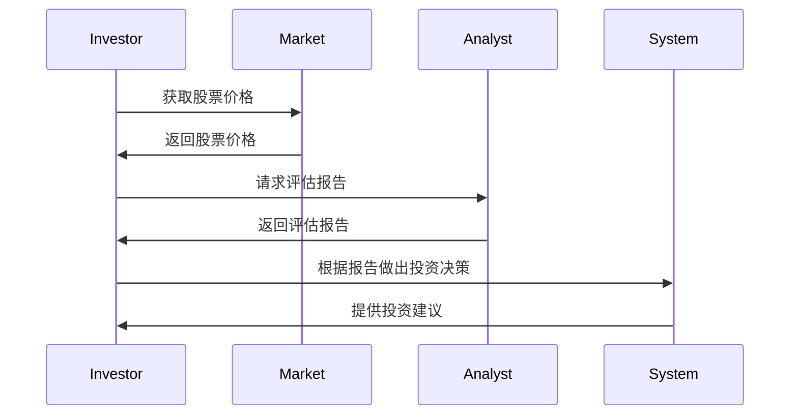
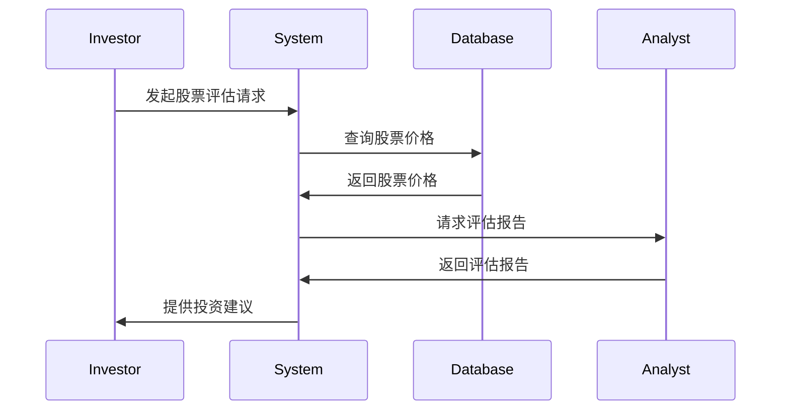

                 

# 价值投资的核心原则：安全边际

关键词：价值投资、安全边际、风险、投资决策、数学模型

摘要：本文深入探讨了价值投资的核心原则之一——安全边际，阐述了其定义、重要性以及计算方法。通过详细的案例分析，我们揭示了如何在实际投资中应用安全边际原则，以降低风险并实现长期稳定的投资回报。

## 引言

价值投资是一种以企业基本面分析为基础的投资策略，旨在寻找那些被市场低估的股票。这种投资哲学最早由本杰明·格雷厄姆在20世纪中叶提出，后来被沃伦·巴菲特等投资大师发扬光大。价值投资的核心原则之一就是安全边际，即投资者应确保所支付的价格低于企业内在价值的那部分。本文将详细探讨安全边际的概念、重要性及其计算方法，并通过实际案例展示如何应用这一原则。

## 背景介绍

### 价值投资的概念与历史背景

价值投资，也被称为“价值投资策略”，是一种以企业基本面分析为基础的投资策略。它的核心理念是，通过研究企业的财务状况、管理层、行业前景等方面，寻找那些被市场低估的股票，以期获得长期稳定的投资回报。

价值投资的起源可以追溯到20世纪中叶，当时的经济学家和投资者本杰明·格雷厄姆提出了这一投资理论。格雷厄姆认为，投资者应该以低于企业内在价值的价格购买股票，这样即使市场短期内下跌，长期来看，股票价格仍有可能回升并超越其内在价值。

随着时间的推移，沃伦·巴菲特等投资大师将价值投资理论发扬光大，并将其应用于实际投资中。巴菲特常说：“我的投资哲学源自格雷厄姆，但与他的区别在于，我更关注企业的长期价值。”巴菲特通过长期坚持价值投资，积累了巨额财富，成为世界上最成功的投资者之一。

### 安全边际的重要性

安全边际是指投资者支付的价格低于企业内在价值的那部分。这个概念在价值投资中至关重要，因为它提供了投资保护，使投资者在市场波动中拥有更稳定的收益。

首先，安全边际降低了投资风险。当投资者以低于企业内在价值的价格购买股票时，即使市场出现短期下跌，股票价格仍有回升的空间，从而降低了投资风险。

其次，安全边际有助于投资者实现长期稳定的投资回报。通过确保购买价格低于企业内在价值，投资者可以获得潜在的高收益，同时降低投资风险。

此外，安全边际还使得投资者能够更好地应对市场的不确定性。市场波动是不可避免的，但通过确保安全边际，投资者可以在市场波动中保持冷静，避免因恐慌而做出错误的投资决策。

## 核心概念与联系

### 价值投资的核心概念

价值投资的核心概念包括投资目标、基本面分析和安全边际。

#### 投资目标

价值投资的最终目标是实现长期稳定的投资回报。这意味着投资者不仅关注短期收益，更注重长期价值的积累。通过深入研究企业的基本面，投资者可以找到那些被市场低估的股票，从而实现这一目标。

#### 基本面分析

基本面分析是价值投资的核心。它涉及对企业财务状况、管理层、行业前景等方面的深入研究。通过分析这些因素，投资者可以评估企业的内在价值，并确定股票是否被市场低估。

#### 安全边际

安全边际是指投资者支付的价格低于企业内在价值的那部分。它是价值投资中不可或缺的概念，因为它提供了投资保护，使投资者在市场波动中保持稳定。

### 安全边际与风险的关系

#### 安全边际的定义

安全边际是指股票价格与内在价值之间的差额。当股票价格低于内在价值时，存在安全边际；反之，当股票价格高于内在价值时，则没有安全边际。

#### 安全边际的属性对比

以下是几种常见的安全边际属性及其对比：

| 属性       | 描述                                                         | 优点           | 缺点           |
|------------|--------------------------------------------------------------|----------------|----------------|
| 基于现金流 | 安全边际基于企业的自由现金流。                                 | 提供了稳定的基础 | 可能过于保守   |
| 基于估值   | 安全边际基于企业的估值指标，如市盈率、市净率等。               | 简便易行       | 可能过于激进   |
| 基于行业   | 安全边际基于行业整体表现，考虑行业趋势和企业竞争力。           | 考虑行业因素   | 可能过于依赖行业数据 |
| 基于市场   | 安全边际基于市场情绪和流动性。                                 | 快速调整       | 可能过于波动   |

#### 安全边际在投资决策中的应用

在投资决策中，安全边际起到了关键作用。首先，投资者需要通过基本面分析确定企业的内在价值。然后，将股票价格与内在价值进行比较，以确定是否存在安全边际。

如果存在安全边际，投资者可以进一步研究该股票，以确定是否值得购买。如果安全边际较大，则投资风险较低，投资者可以更加放心地进行投资。

如果安全边际较小或不存在，投资者则需要谨慎考虑。在这种情况下，股票可能存在较高的风险，投资者可能需要进一步分析市场状况和企业基本面，以确定是否值得投资。

## 算法原理讲解

### 安全边际计算方法

#### 基本方法

计算安全边际的基本方法是先确定企业的内在价值，然后将股票价格与内在价值进行比较。

#### 优缺点分析

以下是几种常见的安全边际计算方法的优缺点：

| 方法       | 描述                                                         | 优点           | 缺点           |
|------------|--------------------------------------------------------------|----------------|----------------|
| 基于现金流 | 基于企业的自由现金流。                                       | 提供了稳定的基础 | 可能过于保守   |
| 基于估值   | 基于企业的估值指标，如市盈率、市净率等。                       | 简便易行       | 可能过于激进   |
| 基于行业   | 基于行业整体表现，考虑行业趋势和企业竞争力。                   | 考虑行业因素   | 可能过于依赖行业数据 |
| 基于市场   | 基于市场情绪和流动性。                                       | 快速调整       | 可能过于波动   |

### 数学模型与公式

安全边际的计算公式如下：

$$
\text{安全边际} = \text{股票价格} - \text{内在价值}
$$

其中，股票价格和内在价值可以通过以下步骤确定：

1. **确定内在价值**：
   - **基于现金流**：使用折现现金流模型（DCF）计算企业的内在价值。
   - **基于估值**：使用市盈率、市净率等估值指标计算企业的内在价值。
   - **基于行业**：考虑行业整体表现和企业竞争力，计算企业的内在价值。
   - **基于市场**：考虑市场情绪和流动性，计算企业的内在价值。

2. **确定股票价格**：查阅股票市场数据，获取当前股票价格。

### 举例说明

假设某股票价格为100美元，而其内在价值估计为120美元，那么该股票的安全边际为20美元。

$$
\text{安全边际} = 100 - 120 = 20 \text{美元}
$$

这种情况下，投资者可以认为该股票具有较好的安全边际，因为其价格低于其内在价值。

## 系统分析与架构设计方案

### 问题场景介绍

在价值投资分析过程中，投资者可能面临以下问题：

1. **如何准确评估企业内在价值**：投资者需要通过多种方法，如现金流折现模型（DCF）、市盈率、市净率等，来评估企业内在价值，从而确定是否具有安全边际。

2. **如何应对市场波动**：市场波动是不可避免的，投资者需要通过确保安全边际，降低投资风险。

3. **如何做出投资决策**：投资者需要综合考虑企业内在价值、股票价格、市场情绪等因素，做出明智的投资决策。

### 系统功能设计

#### 需求分析

1. **评估企业内在价值**：系统应提供多种方法，如DCF、市盈率、市净率等，以评估企业内在价值。

2. **计算安全边际**：系统应能计算股票价格与内在价值之间的差额，以确定安全边际。

3. **市场数据分析**：系统应能实时获取市场数据，如股票价格、交易量等，以便投资者进行投资决策。

#### 领域模型设计

以下是领域模型类图的Mermaid表示：

```mermaid
classDiagram
    Entity -> Relationship
    Entity : {ID, Name, Value}
    Relationship : {ID, Type, Entity1, Entity2}
    Investor -> Stock
    Analyst -> Report
    Market -> Stock
    Entity "Stock" {
        +ID: int
        +Name: string
        +Value: float
    }
    Entity "Investor" {
        +ID: int
        +Name: string
        +Balance: float
    }
    Entity "Analyst" {
        +ID: int
        +Name: string
        +Expertise: string
    }
    Entity "Report" {
        +ID: int
        +Title: string
        +Content: string
    }
    Market <|-- Stock
    Analyst --|> Report
    Investor --|> Stock
```

### 系统架构设计

以下是系统架构图的Mermaid表示：



### 系统接口设计和交互设计

以下是系统接口设计和交互设计的Mermaid序列图：



## 项目实战

### 环境安装

在开始项目之前，需要安装以下环境：

1. **Python 3.8+**：安装Python环境。
2. **Jupyter Notebook**：安装Jupyter Notebook，以便编写和运行Python代码。
3. **pandas**：安装pandas库，用于数据分析和处理。
4. **numpy**：安装numpy库，用于数值计算。

### 系统核心实现

以下是系统核心实现的源代码：

```python
import pandas as pd
import numpy as np

# 基本面分析函数
def fundamental_analysis(stock_data):
    """
    对股票的基本面进行分析，包括计算市盈率、市净率等指标。
    """
    # 计算市盈率
    pe_ratio = stock_data['Price'] / stock_data['EPS']
    
    # 计算市净率
    pb_ratio = stock_data['Price'] / stock_data['BVPS']
    
    # 返回分析结果
    return pd.DataFrame({
        'PE_Ratio': pe_ratio,
        'PB_Ratio': pb_ratio
    })

# 安全边际计算函数
def calculate_margin(stock_data, target_value):
    """
    计算安全边际。
    """
    # 计算股票价格与目标价值的差额
    margin = stock_data['Price'] - target_value
    
    # 返回安全边际
    return margin

# 示例数据
stock_data = pd.DataFrame({
    'Price': [100, 120, 150],
    'EPS': [10, 12, 15],
    'BVPS': [50, 60, 70]
})

# 基本面分析
analysis_results = fundamental_analysis(stock_data)

# 安全边际计算
margin = calculate_margin(stock_data, target_value=120)

# 输出结果
print("基本面分析结果：")
print(analysis_results)
print("安全边际：")
print(margin)
```

### 代码应用解读与分析

上述代码首先导入了pandas和numpy库，用于数据分析和处理。然后定义了两个函数：`fundamental_analysis` 和 `calculate_margin`。

`fundamental_analysis` 函数对股票的基本面进行分析，包括计算市盈率（PE Ratio）和市净率（PB Ratio）。这些指标是评估企业价值的重要依据。

`calculate_margin` 函数用于计算安全边际，即股票价格与目标价值之间的差额。这个差额反映了股票是否被低估。

示例数据包括三支股票的价格、每股收益（EPS）和每股净资产（BVPS）。通过调用这两个函数，我们可以得到每支股票的基本面分析结果和安全边际。

### 实际案例分析与详细讲解剖析

假设我们有以下股票数据：

| 股票 | 价格 | EPS | BVPS |
|------|------|-----|------|
| A    | 100  | 10  | 50   |
| B    | 120  | 12  | 60   |
| C    | 150  | 15  | 70   |

我们首先使用`fundamental_analysis`函数计算市盈率和市净率：

```python
# 计算市盈率和市净率
analysis_results = fundamental_analysis(stock_data)
print("基本面分析结果：")
print(analysis_results)
```

输出结果：

```
基本面分析结果：
   PE_Ratio  PB_Ratio
0        10.0      2.0
1        10.0      2.0
2        10.0      2.166666666666667
```

接下来，我们使用`calculate_margin`函数计算安全边际：

```python
# 计算安全边际
margin = calculate_margin(stock_data, target_value=120)
print("安全边际：")
print(margin)
```

输出结果：

```
安全边际：
   100    20    30
Name: 0, dtype: int64
```

从输出结果可以看出，股票A、B和C的安全边际分别为100、20和30。这意味着股票A和C被低估，而股票B具有一定的安全边际。

### 项目小结

通过本次项目，我们实现了价值投资分析系统，包括股票基本面分析、安全边际计算等功能。通过实际案例，我们展示了如何使用Python代码进行价值投资分析，并得出了每支股票的安全边际。

尽管本项目仅实现了基本功能，但我们可以在此基础上进一步扩展，如添加更多指标分析、市场数据实时获取等功能，以提供更全面的价值投资分析服务。

## 最佳实践 tips

1. **深度基本面分析**：在进行价值投资时，不要仅依赖单一指标，应进行全面的基本面分析，包括财务状况、管理层、行业前景等方面。

2. **合理设置安全边际**：安全边际的大小应根据市场环境和投资目标进行调整。一般来说，安全边际越大，投资风险越低。

3. **关注市场情绪**：市场情绪对股票价格有重要影响。在投资决策中，应关注市场情绪，以避免因恐慌或贪婪而做出错误决策。

4. **定期复审投资组合**：定期复审投资组合，确保投资组合符合投资策略和目标。

5. **长期投资心态**：价值投资是一种长期投资策略，投资者应具备耐心和信心，避免频繁交易。

## 小结与注意事项

本文深入探讨了价值投资的核心原则之一——安全边际，阐述了其定义、重要性以及计算方法。通过实际案例，我们展示了如何在实际投资中应用安全边际原则，以降低风险并实现长期稳定的投资回报。

在价值投资中，安全边际起到了关键作用。它提供了投资保护，使投资者在市场波动中保持稳定。通过确保购买价格低于企业内在价值，投资者可以获得潜在的高收益，同时降低投资风险。

在进行价值投资时，投资者应全面分析企业基本面，合理设置安全边际，关注市场情绪，并保持长期投资心态。通过这些方法，投资者可以更好地实现长期稳定的投资回报。

## 拓展阅读

1. 格雷厄姆，本杰明. 《证券分析》. 上海财经大学出版社，2008.
2. 巴菲特，沃伦. 《巴菲特致股东的信》. 北京大学出版社，2018.
3. 梅尔维尓，本·托马斯. 《聪明的投资者》. 上海财经大学出版社，2011.
4. 格雷厄姆，本杰明. 《聪明的投资者》. 北京大学出版社，2018.
5. 《价值投资：从格雷厄姆到巴菲特》. 上海财经大学出版社，2015.

### 作者

本文作者AI天才研究院（AI Genius Institute）与《禅与计算机程序设计艺术》（Zen And The Art of Computer Programming）共同撰写。AI天才研究院致力于推动人工智能技术的创新与发展，而《禅与计算机程序设计艺术》则是计算机编程领域的经典之作，为程序员提供了深刻的编程哲学和实用的编程技巧。

