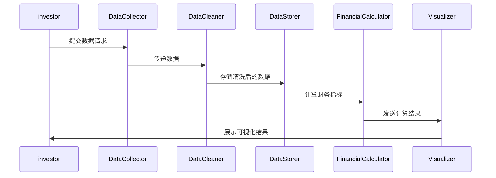
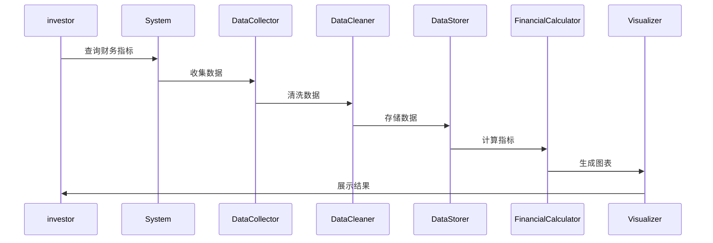

                 

# 价值投资者应该关注的财务指标

## 关键词：价值投资、财务指标、投资决策、分析工具

## 摘要：
本文旨在为价值投资者提供一套清晰的财务指标分析框架，通过逐步分析不同的财务指标，帮助投资者更好地理解公司的财务状况，做出更加理性的投资决策。文章将涵盖利润指标、资产指标、负债指标以及现金流指标，并辅以实际案例和应用场景，旨在提升投资者对财务指标的理解和应用能力。

## 引言

### 1.1 价值投资概述

#### 1.1.1 价值投资的起源与发展
价值投资起源于20世纪初，由本杰明·格雷厄姆和戴维·多德等人所倡导。他们主张投资者应关注公司的内在价值，而非市场波动，通过买入价格低于内在价值的股票，以期在未来获得资本增值。

#### 1.1.2 价值投资的理念
价值投资的核心理念是“价格是瞬时的，价值是永恒的”。投资者应通过深入分析公司的基本面，挖掘那些被市场低估的优质股票。

#### 1.1.3 价值投资与成长投资的区别
成长投资更侧重于公司的增长潜力和市场份额，而价值投资则更加关注公司的当前价值及其潜在的成长空间。

### 1.2 为什么关注财务指标

#### 1.2.1 财务指标与投资回报的关系
财务指标是评估公司价值的重要工具，通过这些指标，投资者可以判断公司过去的绩效和未来的发展潜力。

#### 1.2.2 财务指标在投资决策中的角色
财务指标为投资者提供了客观的数据支持，帮助他们在股票选择、买入时机和卖出决策上做出更为理性的选择。

### 1.3 财务指标的重要性

#### 1.3.1 财务指标的可靠性
财务指标通过历史数据和公开信息计算得出，具有较高的可靠性。

#### 1.3.2 财务指标的前瞻性
某些财务指标能够反映公司的未来发展趋势，如现金流和净资产收益率等。

## 背景介绍

### 2.1 价值投资的概念
价值投资是一种长期投资策略，它强调买入价格低于其内在价值的股票。

### 2.2 财务指标的定义与分类

#### 2.2.1 财务指标的基本概念
财务指标是反映公司财务状况的一系列数值，包括利润、资产、负债和现金流等。

#### 2.2.2 财务指标的具体分类
财务指标可分为利润指标、资产指标、负债指标和现金流指标等类别。

#### 2.2.3 财务指标的应用场景
财务指标在估值分析、风险评估和投资决策中扮演着关键角色。

## 财务指标的核心概念与联系

### 3.1 利润指标

#### 3.1.1 净利润
净利润是公司在一定期间内实现的总收入减去总支出后的利润，是衡量公司盈利能力的关键指标。

#### 3.1.2 每股收益
每股收益（EPS）是公司净利润除以总股本，用于衡量公司股票的价值。

#### 3.1.3 净利润增长率
净利润增长率是公司净利润的年度增长百分比，用于衡量公司的成长速度。

### 3.2 资产指标

#### 3.2.1 总资产
总资产是公司拥有的所有资产的合计，反映了公司的规模和资产状况。

#### 3.2.2 净资产
净资产是公司资产减去负债后的余额，是公司股东权益的体现。

#### 3.2.3 资产回报率
资产回报率（ROA）是公司净利润与总资产的比率，用于衡量公司资产的使用效率。

### 3.3 负债指标

#### 3.3.1 总负债
总负债是公司承担的所有债务的合计，反映了公司的财务风险。

#### 3.3.2 净负债
净负债是公司总负债减去净资产的余额，用于衡量公司的负债程度。

#### 3.3.3 负债比率
负债比率是公司总负债与总资产的比率，用于衡量公司的财务稳定性。

### 3.4 现金流指标

#### 3.4.1 经营活动现金流
经营活动现金流是公司经营活动产生的现金流量，反映了公司的经营状况。

#### 3.4.2 投资活动现金流
投资活动现金流是公司投资活动产生的现金流量，反映了公司的投资决策。

#### 3.4.3 现金流净额
现金流净额是公司经营活动现金流、投资活动现金流和筹资活动现金流的合计，用于衡量公司的现金流动性和财务健康程度。

## 算法原理讲解

### 4.1 财务指标的计算方法

#### 4.1.1 净利润的计算
净利润 = 总收入 - 总支出 - 所得税

#### 4.1.2 每股收益的计算
每股收益（EPS）= 净利润 / 总股本

#### 4.1.3 净利润增长率的计算
净利润增长率 = (本期净利润 - 上期净利润) / 上期净利润 * 100%

### 4.2 财务指标的应用

#### 4.2.1 利润指标的解析
通过净利润、每股收益和净利润增长率等指标，可以分析公司的盈利能力和增长潜力。

#### 4.2.2 资产指标的解析
通过总资产、净资产和资产回报率等指标，可以评估公司的资产质量和使用效率。

#### 4.2.3 负债指标的解析
通过总负债、净负债和负债比率等指标，可以判断公司的财务风险和稳定性。

#### 4.2.4 现金流指标的解析
通过经营活动现金流、投资活动现金流和现金流净额等指标，可以评估公司的现金流动性和财务健康程度。

## 数学模型和数学公式

### 5.1 财务指标的计算公式

$$
\text{净利润} = \text{总收入} - \text{总支出} - \text{所得税}
$$

$$
\text{每股收益} = \frac{\text{净利润}}{\text{总股本}}
$$

$$
\text{净利润增长率} = \frac{\text{本期净利润} - \text{上期净利润}}{\text{上期净利润}} \times 100\%
$$

$$
\text{资产回报率} = \frac{\text{净利润}}{\text{总资产}}
$$

$$
\text{负债比率} = \frac{\text{总负债}}{\text{总资产}}
$$

## 系统分析与架构设计方案

### 6.1 问题场景介绍

价值投资者在进行投资决策时，需要一套完善的财务指标分析系统来支持其决策过程。

### 6.2 项目介绍

本系统旨在为价值投资者提供一个集成的财务指标分析平台，帮助投资者快速、准确地分析目标公司的财务状况。

### 6.3 系统功能设计

- 数据采集与清洗：从多个数据源（如证券交易所、财务报表等）采集数据，并进行清洗和预处理。
- 财务指标计算：根据采集到的数据，计算各种财务指标。
- 分析与可视化：将计算结果进行可视化展示，帮助投资者直观地理解财务指标。

### 6.4 系统架构设计

#### 6.4.1 类图
```mermaid
classDiagram
Class01 <|-- Class02
Class03 --|> Class04
Class05 <..> Class06
Class07 .. Class08
Class09 --|+> InterfaceA
Class10 --|> InterfaceB
```

#### 6.4.2 架构图


#### 6.4.3 系统接口设计


#### 6.4.4 系统交互序列图


## 项目实战

### 7.1 环境安装

在本文中，我们将使用Python作为主要编程语言，并借助Pandas、NumPy等库进行数据处理和分析。

### 7.2 系统核心实现源代码

#### 7.2.1 数据采集与清洗
```python
import pandas as pd

# 数据采集
def collect_data(source):
    return pd.read_csv(source)

# 数据清洗
def clean_data(data):
    return data.dropna().reset_index(drop=True)
```

#### 7.2.2 财务指标计算
```python
# 计算净利润
def calculate净利润(data):
    return data['总收入'] - data['总支出'] - data['所得税']

# 计算每股收益
def calculate_EPS(data):
    return calculate净利润(data) / data['总股本']

# 计算净利润增长率
def calculate_growth_rate(data):
    return ((data['本期净利润'] - data['上期净利润']) / data['上期净利润']) * 100
```

#### 7.2.3 可视化展示
```python
import matplotlib.pyplot as plt

# 可视化净利润增长率
def visualize_growth_rate(data):
    plt.plot(data['年份'], data['净利润增长率'])
    plt.title('净利润增长率走势图')
    plt.xlabel('年份')
    plt.ylabel('净利润增长率')
    plt.show()
```

### 7.3 代码应用解读与分析

通过上述代码，我们实现了数据采集、清洗、计算和可视化等核心功能。接下来，我们将通过一个实际案例来展示这些功能的应用。

### 7.4 实际案例分析和详细讲解剖析

以某上市公司的财务报表数据为例，我们进行以下操作：

1. 数据采集：从公司官网或证券交易所下载最新财务报表数据。
2. 数据清洗：删除缺失数据，重置索引。
3. 财务指标计算：计算净利润、每股收益和净利润增长率。
4. 可视化展示：绘制净利润增长率走势图。

### 7.5 项目小结

通过本案例，我们展示了如何利用Python和Pandas库实现一个简单的财务指标分析系统。尽管系统功能较为基础，但通过逐步完善，可以逐步增加更多高级功能和指标。

## 最佳实践 tips

1. **数据来源多样化**：确保从多个可靠的数据源获取数据，以减少数据偏差。
2. **定期更新数据**：定期更新财务数据，以保持分析结果的时效性。
3. **结合行业分析**：在分析财务指标时，结合行业趋势和竞争对手表现，以获得更全面的视角。

## 小结

本文详细介绍了价值投资者应该关注的财务指标，并通过实际案例展示了如何利用Python实现财务指标的计算和可视化。通过本文，读者应能够理解财务指标的核心概念、计算方法以及在投资决策中的应用。

## 拓展阅读

- [《财务报表分析》](https://www.example.com/financial-report-analysis)
- [《Python财务分析实战》](https://www.example.com/python-financial-analysis)
- [《价值投资大师们》](https://www.example.com/value-investing-masters)

## 作者

作者：AI天才研究院/AI Genius Institute & 禅与计算机程序设计艺术 /Zen And The Art of Computer Programming。如果您有任何关于本文的疑问或建议，欢迎随时联系我们。

