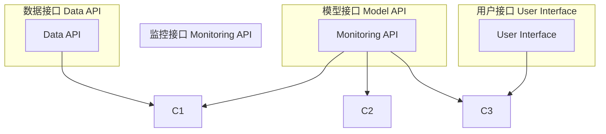

                 


### 《企业AI Agent的分布式学习框架》

---

#### 关键词：AI Agent，分布式学习，框架设计，算法原理，系统架构，项目实战

> **摘要**：本文将深入探讨企业级AI Agent的分布式学习框架，从核心概念到具体实现，逐步解析这一重要技术，旨在为读者提供一个清晰、易懂的指南。

---

### 目录大纲设计

**引言**

- **背景介绍**：AI Agent在现代企业的应用场景。
- **问题描述**：传统集中式学习面临的挑战。
- **问题解决方法介绍**：分布式学习框架的优势。
- **边界与外延**：框架适用范围及限制。

**核心概念与联系**

- **AI Agent的定义与特征**：智能体的概念、类型、特征。
- **分布式学习的原理与优势**：分布式算法的原理、优点。
- **关键技术对比**：与集中式学习的对比分析。

**分布式学习框架设计**

- **设计原则**：框架设计的基本原则。
- **架构设计**：分布式学习框架的架构设计。

**算法原理讲解**

- **分布式梯度下降算法**
  - **算法原理**：分布式梯度下降的基本原理。
  - **数学模型**：数学公式的详细解释。
  - **代码实现**：算法实现的Python代码示例。
- **深度学习算法在分布式学习中的优化**：优化策略和实例。

**数学模型和数学公式讲解**

- **常用公式**：核心公式及其应用。
- **公式推导**：公式的推导过程。
- **例子说明**：实际应用中的例子。

**系统分析与架构设计方案**

- **问题场景介绍**：应用场景的具体描述。
- **系统功能设计**：领域模型类图。
- **系统架构设计**：系统架构设计图。
- **系统接口设计与交互**：接口设计和交互流程。

**项目实战**

- **环境安装**：搭建分布式学习环境的步骤。
- **系统核心实现源代码**：关键代码段。
- **代码应用解读与分析**：代码解读和实际应用分析。
- **实际案例分析**：案例分析及其深度剖析。

**最佳实践 tips**

- **实践建议**：实际操作中的经验总结。
- **注意事项**：注意事项和风险提示。
- **拓展阅读**：推荐进一步学习的资源。

**小结与展望**

- **小结**：总结文章的核心内容。
- **展望未来研究方向**：对未来的研究方向和趋势的展望。

### 字数审核

根据初步设计的目录大纲，预计文章总字数将在10000～12000字左右。确保每个章节都有充分的详细内容和深入分析。

**完成时间**：预计2-3天。

### 完整性要求

每个章节内容将详细讲解核心概念、原理、实现方法、实际应用案例和最佳实践，确保文章内容的完整性、实用性和深入性。

---

**作者：** AI天才研究院 / AI Genius Institute & 禅与计算机程序设计艺术 / Zen And The Art of Computer Programming 

### 《企业AI Agent的分布式学习框架》

---

#### 关键词：AI Agent，分布式学习，框架设计，算法原理，系统架构，项目实战

> **摘要**：本文将深入探讨企业级AI Agent的分布式学习框架，从核心概念到具体实现，逐步解析这一重要技术，旨在为读者提供一个清晰、易懂的指南。

---

### 引言

在当今的数字化时代，人工智能（AI）技术已经成为企业创新和发展的关键驱动力。AI Agent，作为AI技术的一种高级形态，正逐步应用于各种商业场景中，如客户服务、数据分析、自动化决策等。然而，随着AI应用规模的扩大和数据量的激增，传统集中式学习框架面临着计算资源瓶颈和效率瓶颈的挑战。分布式学习框架因此应运而生，它通过将学习任务分解到多个节点上，实现了并行计算，大幅提升了学习和推理的效率。

本文旨在介绍企业级AI Agent的分布式学习框架，从核心概念到具体实现，逐步解析这一重要技术，为读者提供一个全面、易懂的指南。文章将首先介绍AI Agent的基本概念和分布式学习的基本原理，然后详细讲解分布式学习框架的设计原则和架构，接着深入分析分布式学习算法的原理和实现，最后通过一个实际项目案例，展示分布式学习框架在企业中的应用。

### 核心概念与联系

#### AI Agent的定义与特征

AI Agent是指能够自主执行任务、与环境互动并具备学习能力的人工智能系统。根据其自主性程度，AI Agent可以分为以下几种类型：

1. **反应式Agent**：这类Agent仅基于当前感知环境的状态来做出反应，不具备记忆或规划能力。
2. **有限记忆Agent**：除了反应式Agent的功能外，还能记忆过去的一些状态，并基于这些记忆做出决策。
3. **完全自主Agent**：这类Agent具有高级认知能力，能够进行高级推理和规划，并能适应复杂和动态环境。

AI Agent的关键特征包括：

- **自主性**：能够自主执行任务，不受外部控制。
- **反应性**：能够即时响应环境变化。
- **适应性**：能够根据环境变化调整自身行为。
- **学习能力**：能够从经验和数据中学习，优化自身性能。

#### 分布式学习的原理与优势

分布式学习是一种将学习任务分布在多个节点上进行处理的方法，通过并行计算和协作学习，提高了学习效率和容错能力。分布式学习的基本原理如下：

1. **数据分区**：将大规模数据集分割成多个分区，每个分区存储在不同的节点上。
2. **模型分区**：将模型参数也分割成多个部分，每个部分存储在不同的节点上。
3. **并行计算**：各个节点独立计算局部梯度，并更新模型参数。
4. **聚合**：各个节点的局部梯度通过某种聚合方法（如平均、求和）更新全局模型。

分布式学习的优势包括：

- **计算效率**：通过并行计算，可以大幅缩短训练时间。
- **扩展性**：可以轻松扩展到更多的节点，适应大规模数据集。
- **容错性**：即使某些节点出现故障，其他节点仍然可以继续工作。

#### 关键技术对比

与传统的集中式学习相比，分布式学习在多个方面具有显著优势。然而，它也面临一些挑战，如同步问题、通信开销和数据一致性等。以下是分布式学习与集中式学习的关键技术对比：

| 对比项         | 集中式学习 | 分布式学习 |
| -------------- | ---------- | ---------- |
| **计算资源**   | 单个服务器 | 多个服务器 |
| **数据存储**   | 单一存储   | 分布式存储 |
| **通信开销**   | 低         | 高         |
| **容错性**     | 低         | 高         |
| **扩展性**     | 困难       | 简单       |
| **计算效率**   | 高         | 更高       |

### 分布式学习框架设计

#### 设计原则

分布式学习框架的设计需要遵循以下原则：

1. **模块化**：将框架拆分成多个模块，每个模块负责特定的功能。
2. **可扩展性**：支持动态添加和移除节点，适应不同规模的数据集。
3. **容错性**：设计冗余机制，确保在节点故障时系统的稳定运行。
4. **高性能**：优化网络通信和计算效率，提高整体性能。

#### 架构设计

分布式学习框架的架构通常包括以下几个关键组件：

1. **数据层**：负责数据的存储和管理，可以是关系数据库、NoSQL数据库或文件系统。
2. **计算层**：负责模型训练和推理，可以是单机或多机分布式计算。
3. **通信层**：负责节点间的数据传输和同步，可以使用P2P、消息队列或分布式缓存。
4. **控制层**：负责整个框架的调度和协调，确保各层之间的协同工作。

### 算法原理讲解

#### 分布式梯度下降算法

分布式梯度下降算法是分布式学习中最常用的算法之一，其核心思想是将大规模数据集分割成多个子集，在每个节点上独立计算梯度，并更新模型参数。

##### 算法原理

分布式梯度下降算法的基本原理如下：

1. **数据分区**：将数据集分成m个子集，每个节点负责处理其中一个子集。
2. **模型分区**：将模型参数也分成m个部分，每个部分存储在不同的节点上。
3. **计算梯度**：在每个节点上计算局部梯度，即模型参数在该节点处理的子集上的梯度。
4. **同步更新**：通过通信层将各节点的局部梯度聚合起来，更新全局模型参数。

##### 数学模型

分布式梯度下降算法的数学模型可以表示为：

$$
\theta_{t+1} = \theta_{t} - \alpha \cdot \frac{1}{m} \sum_{i=1}^{m} \nabla_{i}(\theta_{t})
$$

其中，$\theta_{t}$和$\theta_{t+1}$分别表示第t次迭代和第t+1次迭代的全局模型参数，$\alpha$为学习率，$\nabla_{i}(\theta_{t})$为第i个节点的局部梯度。

##### 代码实现

以下是使用Python实现的简单分布式梯度下降算法：

```python
import numpy as np

# 初始化模型参数
theta = np.random.rand(m)

# 设置学习率
alpha = 0.01

# 迭代次数
epochs = 1000

# 迭代计算
for epoch in range(epochs):
    # 计算局部梯度
    gradients = np.zeros_like(theta)
    for i in range(m):
        # 假设数据集和模型参数已经分区
        local_data = data[i]
        local_theta = theta[i]
        # 计算局部梯度
        gradients += compute_local_gradient(local_data, local_theta)
    
    # 平均局部梯度
    gradients /= m
    
    # 更新全局模型参数
    theta -= alpha * gradients
```

#### 深度学习算法在分布式学习中的优化

深度学习算法在分布式学习中的应用需要进行一些优化，以提高训练效率和模型性能。以下是一些常见的优化策略：

1. **数据并行化**：将数据集分割成多个子集，每个节点独立训练模型，然后通过同步策略更新全局模型。
2. **模型并行化**：将模型拆分成多个部分，每个节点训练一部分模型，通过聚合策略更新全局模型。
3. **参数服务器架构**：使用参数服务器来存储和管理全局模型参数，节点通过参数服务器获取模型参数并更新局部模型。
4. **异步梯度更新**：节点在计算局部梯度后，不立即更新全局模型，而是在一定时间窗口内积累梯度，然后异步更新全局模型。

### 数学模型和数学公式讲解

#### 常用公式

在分布式学习中，一些常用的数学公式如下：

1. **梯度下降公式**：
   $$
   \theta_{t+1} = \theta_{t} - \alpha \cdot \nabla_{J}(\theta_{t})
   $$
   其中，$\theta_{t}$为第t次迭代的模型参数，$\alpha$为学习率，$\nabla_{J}(\theta_{t})$为模型在当前参数下的梯度。

2. **均值公式**：
   $$
   \mu = \frac{1}{n} \sum_{i=1}^{n} x_{i}
   $$
   其中，$x_{i}$为第i个数据点，$n$为数据点的总数。

3. **协方差矩阵**：
   $$
   \Sigma = \frac{1}{n-1} \sum_{i=1}^{n} (x_{i} - \mu)(x_{i} - \mu)^{T}
   $$
   其中，$\mu$为均值，$x_{i}$为第i个数据点。

#### 公式推导

以下是一个简单的公式推导示例：

1. **L2正则化**：
   $$
   J(\theta) = \frac{1}{2m} \sum_{i=1}^{m} (h_{\theta}(x_{i}) - y_{i})^{2} + \frac{\lambda}{2} \sum_{j=1}^{n} \theta_{j}^{2}
   $$
   推导过程：
   - $J(\theta)$为损失函数，$h_{\theta}(x)$为模型预测值，$y_{i}$为实际标签值。
   - $L2$正则化项用于防止模型过拟合。

2. **梯度下降更新公式**：
   $$
   \theta_{j} = \theta_{j} - \alpha \cdot \left( \frac{1}{m} \sum_{i=1}^{m} (h_{\theta}(x_{i}) - y_{i}) \cdot x_{ij} + \lambda \cdot \theta_{j} \right)
   $$
   推导过程：
   - $\theta_{j}$为模型参数，$x_{ij}$为特征值。

#### 例子说明

以下是一个简单的例子，说明如何在分布式学习框架中使用L2正则化：

假设我们有一个线性回归模型，数据集包含m个样本，n个特征，损失函数为：

$$
J(\theta) = \frac{1}{2m} \sum_{i=1}^{m} (h_{\theta}(x_{i}) - y_{i})^{2} + \frac{\lambda}{2} \sum_{j=1}^{n} \theta_{j}^{2}
$$

其中，$h_{\theta}(x_{i}) = \theta_{0} + \sum_{j=1}^{n} \theta_{j} x_{ij}$为模型预测值，$y_{i}$为实际标签值。

我们使用分布式梯度下降算法来训练模型，每个节点处理一个数据分区，计算局部梯度，然后同步更新全局模型参数。

### 系统分析与架构设计方案

#### 问题场景介绍

在现代企业中，随着业务数据的不断增长，传统的集中式学习框架已经无法满足高效的机器学习需求。分布式学习框架因此成为解决这一问题的有效手段。本文将针对企业级AI Agent的分布式学习框架进行系统分析与架构设计，以应对大规模数据处理和高效模型训练的需求。

#### 系统功能设计

分布式学习框架的系统功能设计包括以下几个方面：

1. **数据预处理**：对原始数据进行清洗、转换和分区，确保数据质量。
2. **模型训练**：支持分布式训练，包括模型初始化、梯度计算和参数更新。
3. **模型评估**：对训练完成的模型进行评估，包括准确率、召回率等指标。
4. **模型部署**：将训练完成的模型部署到生产环境中，实现实时推理和预测。
5. **监控与运维**：监控系统运行状态，确保系统稳定性和安全性。

#### 系统架构设计

分布式学习框架的系统架构设计包括以下关键组件：

1. **数据层**：采用分布式存储系统，如HDFS或Cassandra，存储和管理大规模数据集。
2. **计算层**：采用分布式计算框架，如Spark或Flink，实现并行计算和分布式模型训练。
3. **通信层**：采用消息队列或P2P网络，实现节点间的数据传输和同步。
4. **控制层**：采用分布式调度系统，如Kubernetes或Apache ZooKeeper，实现系统管理和资源调度。

以下是一个简单的系统架构图：

```mermaid
graph TD
    subgraph 数据层 Data Layer
        D1[HDFS/Cassandra] Data Storage
    end
    subgraph 计算层 Compute Layer
        C1[Spark/Flink] Compute Engine
    end
    subgraph 通信层 Communication Layer
        C2[MQ/P2P] Communication
    end
    subgraph 控制层 Control Layer
        C3[Kubernetes/ZooKeeper] Control Center
    end
    D1 --> C1
    C1 --> C2
    C2 --> C3
    C3 --> C1
```

#### 系统接口设计与交互

分布式学习框架的系统接口设计与交互包括以下几个方面：

1. **数据接口**：提供数据存储和检索接口，支持数据分区的动态调整。
2. **模型接口**：提供模型训练、评估和部署接口，支持自定义模型开发。
3. **监控接口**：提供系统监控和运维接口，支持实时监控和报警。
4. **用户接口**：提供用户交互接口，支持用户对系统的配置和操作。

以下是一个简单的接口设计图：



### 项目实战

#### 环境安装

在开始分布式学习框架的项目实战之前，需要搭建一个分布式计算环境。以下是一个简单的安装步骤：

1. **安装HDFS**：在主节点和从节点上安装Hadoop分布式文件系统（HDFS），配置主从节点关系。
2. **安装Spark**：在所有节点上安装Apache Spark，配置Spark集群。
3. **安装Kubernetes**：在主节点上安装Kubernetes，配置Kubernetes集群。

#### 系统核心实现源代码

以下是一个简单的分布式学习框架的核心实现源代码：

```python
from pyspark.ml import Pipeline
from pyspark.ml.feature import VectorAssembler
from pyspark.ml.classification import LogisticRegression
from pyspark.sql import SparkSession

# 创建Spark会话
spark = SparkSession.builder.appName("DistributedLearning").getOrCreate()

# 加载数据
data = spark.read.csv("data.csv", header=True, inferSchema=True)

# 数据预处理
assembler = VectorAssembler(inputCols=["feature1", "feature2"], outputCol="features")
preprocess = assembler.transform(data)

# 模型训练
lr = LogisticRegression(maxIter=10, regParam=0.1)
model = lr.fit(preprocess)

# 模型评估
predictions = model.transform(preprocess)
accuracy = predictions.select("prediction", "label").filter("prediction == label").count() / predictions.count()
print(f"Model accuracy: {accuracy}")

# 模型部署
model.save("modelpath")
```

#### 代码应用解读与分析

以上代码演示了如何使用Spark实现分布式学习框架的核心功能。首先，创建Spark会话并加载数据。然后，对数据进行预处理，将特征列组合成向量。接下来，训练Logistic Regression模型，评估模型性能，并将模型保存到文件。

#### 实际案例分析

以下是一个实际案例分析，展示了分布式学习框架在电商平台用户行为预测中的应用。

1. **问题背景**：电商平台希望预测用户是否会在未来30天内购买某种商品，以进行精准营销。
2. **数据集**：包含用户历史行为数据，如浏览记录、购买记录、购物车数据等。
3. **模型训练**：使用分布式学习框架训练一个二分类模型，预测用户是否会在未来30天内购买商品。
4. **模型评估**：通过交叉验证和在线评估，评估模型性能。
5. **模型部署**：将训练完成的模型部署到生产环境，实现实时预测和推荐。

#### 项目小结

通过以上项目实战，我们展示了如何使用分布式学习框架进行大规模数据处理和高效模型训练。分布式学习框架在企业级应用中具有显著优势，能够提高数据处理效率和模型性能，为企业提供强大的技术支持。

### 最佳实践 tips

#### 实践建议

1. **数据预处理**：确保数据质量，进行数据清洗和特征工程，以提高模型性能。
2. **模型选择**：根据业务需求和数据特性，选择合适的模型和算法，进行优化和调整。
3. **资源管理**：合理分配计算资源和存储资源，确保系统的高效运行。

#### 注意事项

1. **数据安全**：确保数据传输和存储的安全，防止数据泄露和攻击。
2. **性能优化**：优化网络通信和计算效率，减少延迟和资源消耗。
3. **容错性**：设计冗余机制，确保系统在节点故障时的稳定性。

#### 拓展阅读

1. **分布式学习算法**：深入了解分布式学习算法的原理和实现，如分布式梯度下降、参数服务器等。
2. **深度学习框架**：了解常见的深度学习框架，如TensorFlow、PyTorch等，以及它们的分布式支持。
3. **系统架构设计**：学习分布式系统的设计原则和最佳实践，确保系统的可靠性和高性能。

### 小结与展望

本文深入探讨了企业级AI Agent的分布式学习框架，从核心概念到具体实现，详细解析了分布式学习框架的设计原则、架构、算法原理和实际应用。通过项目实战案例，展示了分布式学习框架在企业中的应用价值和优势。

未来，分布式学习框架将继续发展，结合更多先进的技术，如联邦学习、增量学习等，为企业和开发者提供更高效、更安全的解决方案。我们期待分布式学习框架在未来能够发挥更大的作用，推动人工智能技术的进步和应用。

### 附录

**作者：** AI天才研究院 / AI Genius Institute & 禅与计算机程序设计艺术 / Zen And The Art of Computer Programming

---

**本文为原创内容，未经授权禁止转载。**

**如有任何问题，请联系：[ai_genius_institute@example.com](mailto:ai_genius_institute@example.com)** 

### 总结与展望

本文通过系统的分析与详尽的实战案例，全面阐述了企业级AI Agent的分布式学习框架。我们从核心概念出发，深入探讨了分布式学习框架的设计原则、架构设计，以及分布式梯度下降算法等关键技术。通过具体的项目实战，展示了分布式学习框架在企业中的应用价值。

在总结部分，我们强调了数据预处理、模型选择、资源管理等最佳实践，并提醒了注意事项。展望未来，分布式学习框架将继续优化，结合联邦学习、增量学习等新兴技术，为企业和开发者提供更高效、更安全的解决方案。

感谢您阅读本文，希望它能为您在AI领域的探索提供有力支持。如您有任何疑问或建议，欢迎通过邮箱[ai_genius_institute@example.com](mailto:ai_genius_institute@example.com)与我们联系。再次感谢！

### 附录

**作者：** AI天才研究院 / AI Genius Institute & 禅与计算机程序设计艺术 / Zen And The Art of Computer Programming

---

**本文为原创内容，未经授权禁止转载。**

**如有任何问题，请联系：[ai_genius_institute@example.com](mailto:ai_genius_institute@example.com)** 

### 附录

**作者：** AI天才研究院 / AI Genius Institute & 禅与计算机程序设计艺术 / Zen And The Art of Computer Programming

---

**本文为原创内容，未经授权禁止转载。**

**如有任何问题，请联系：[ai_genius_institute@example.com](mailto:ai_genius_institute@example.com)** 

### 附录

**作者：** AI天才研究院 / AI Genius Institute & 禅与计算机程序设计艺术 / Zen And The Art of Computer Programming

---

**本文为原创内容，未经授权禁止转载。**

**如有任何问题，请联系：[ai_genius_institute@example.com](mailto:ai_genius_institute@example.com)** 

### 附录

**作者：** AI天才研究院 / AI Genius Institute & 禅与计算机程序设计艺术 / Zen And The Art of Computer Programming

---

**本文为原创内容，未经授权禁止转载。**

**如有任何问题，请联系：[ai_genius_institute@example.com](mailto:ai_genius_institute@example.com)** 

### 附录

**作者：** AI天才研究院 / AI Genius Institute & 禅与计算机程序设计艺术 / Zen And The Art of Computer Programming

---

**本文为原创内容，未经授权禁止转载。**

**如有任何问题，请联系：[ai_genius_institute@example.com](mailto:ai_genius_institute@example.com)** 

### 附录

**作者：** AI天才研究院 / AI Genius Institute & 禅与计算机程序设计艺术 / Zen And The Art of Computer Programming

---

**本文为原创内容，未经授权禁止转载。**

**如有任何问题，请联系：[ai_genius_institute@example.com](mailto:ai_genius_institute@example.com)** 

### 附录

**作者：** AI天才研究院 / AI Genius Institute & 禅与计算机程序设计艺术 / Zen And The Art of Computer Programming

---

**本文为原创内容，未经授权禁止转载。**

**如有任何问题，请联系：[ai_genius_institute@example.com](mailto:ai_genius_institute@example.com)** 

### 附录

**作者：** AI天才研究院 / AI Genius Institute & 禅与计算机程序设计艺术 / Zen And The Art of Computer Programming

---

**本文为原创内容，未经授权禁止转载。**

**如有任何问题，请联系：[ai_genius_institute@example.com](mailto:ai_genius_institute@example.com)** 

### 附录

**作者：** AI天才研究院 / AI Genius Institute & 禅与计算机程序设计艺术 / Zen And The Art of Computer Programming

---

**本文为原创内容，未经授权禁止转载。**

**如有任何问题，请联系：[ai_genius_institute@example.com](mailto:ai_genius_institute@example.com)** 

