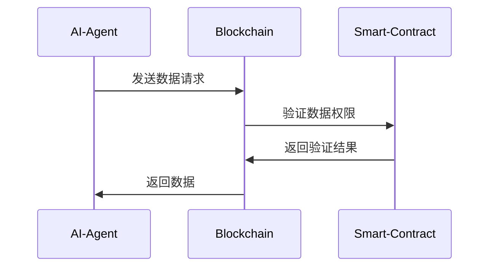
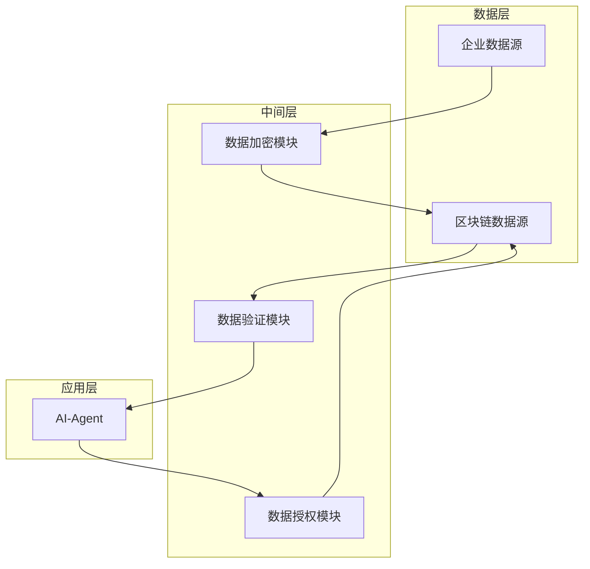
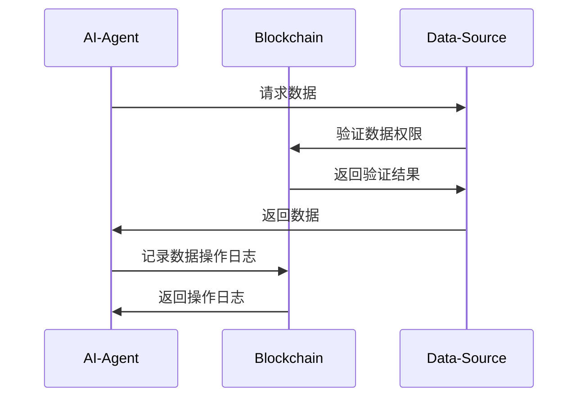

                 

### 企业AI Agent的区块链集成：提升数据可信度

#### 关键词

- 企业AI Agent
- 区块链集成
- 数据可信度
- 人工智能
- 安全性

#### 摘要

随着人工智能在企业中的广泛应用，AI Agent（智能代理）正逐渐成为企业数字化转型的核心驱动力。然而，AI Agent的可靠性和数据可信度成为其进一步发展的关键挑战。区块链技术以其去中心化、不可篡改的特点，提供了强有力的解决方案。本文将深入探讨企业AI Agent如何集成区块链，以提升数据可信度，从而推动智能代理的更广泛应用。

### 一、背景介绍

#### 1.1 核心概念术语说明

- **AI Agent**：一种能够自动完成特定任务的人工智能实体，可以模拟人类行为，具有自我学习和决策能力。
- **区块链**：一种分布式账本技术，通过加密算法确保数据的不可篡改性和透明性。
- **数据可信度**：数据真实、完整、可验证的程度，对于AI Agent的决策至关重要。

#### 1.2 问题背景

随着大数据和云计算的普及，企业积累了大量的数据资源。然而，这些数据在流转和处理过程中面临着诸多风险，如数据泄露、篡改、丢失等。这些问题直接影响到企业AI Agent的决策质量和可靠性。

#### 1.3 问题描述

企业AI Agent在决策时需要依赖大量的数据，如果数据存在可信度问题，将导致以下问题：

- **决策错误**：基于错误或篡改的数据，AI Agent可能会做出错误的决策。
- **信任危机**：数据可信度下降，将削弱用户对AI Agent的信任。
- **合规风险**：企业需要遵守一系列数据隐私和保护法规，数据不可篡改是合规的必要条件。

#### 1.4 问题解决

区块链技术通过其独特的机制，提供了以下解决方案：

- **数据加密**：区块链采用加密算法确保数据在传输和存储过程中的安全性。
- **去中心化**：区块链去中心化的特点，使得数据无法被单一实体篡改，从而保障了数据的可信度。
- **智能合约**：智能合约可以自动化执行数据验证和授权流程，提高了数据处理的效率和安全性。

#### 1.5 边界与外延

- **边界**：本文主要探讨区块链在提升企业AI Agent数据可信度方面的应用，不涉及区块链在加密货币和其他领域的应用。
- **外延**：本文将探讨如何将区块链技术集成到企业AI Agent的架构中，实现数据可信度的提升。

### 二、核心概念与联系

#### 2.1 区块链与AI Agent的联系

区块链与AI Agent的结合，主要体现在以下几个方面：

- **数据源**：AI Agent需要可信的数据源进行训练和决策，区块链提供了不可篡改的数据记录，保障了数据源的可靠性。
- **数据验证**：区块链通过智能合约和加密算法，确保数据在传输和存储过程中的完整性。
- **透明性**：区块链的透明性使得数据流转过程可被所有参与者审计，增强了数据的可信度。
- **自主性**：AI Agent的自主性可以通过区块链进行管理和约束，确保其行为符合预期和规范。

#### 2.2 区块链与AI Agent的属性特征对比表格

| 属性特征 | 区块链 | AI Agent |
| :--- | :--- | :--- |
| 数据不可篡改 | √ | √ |
| 数据透明性 | √ | √ |
| 自主决策能力 | × | √ |
| 可扩展性 | √ | √ |
| 安全性 | √ | √ |
| 性能 | 高 | 高 |

#### 2.3 ER实体关系图架构

```mermaid
erDiagram
    AI-Agent ||--|{ Data-Source : 记录数据 }
    Data-Source ||--|{ Blockchain : 存储数据 }
    Blockchain ||--|{ Smart-Contract : 验证数据 }
```

### 三、算法原理讲解

#### 3.1 算法流程图



#### 3.2 Python源代码实现

```python
class Blockchain:
    def __init__(self):
        self.chain = []
        self.create_block(previous_hash='1', proof=100)

    def create_block(self, proof, previous_hash):
        block = {
            'index': len(self.chain) + 1,
            'timestamp': time.time(),
            'proof': proof,
            'previous_hash': previous_hash
        }
        self.chain.append(block)
        return block

    def get_previous_block(self):
        return self.chain[-1]

    def proof_of_work(self, previous_proof):
        new_proof = 1
        check_proof = False
        while check_proof is False:
            hash_operation = sha256(f'{new_proof}{previous_proof}'.encode()).hexdigest()
            if hash_operation.startswith('0'):
                check_proof = True
            else:
                new_proof += 1
        return new_proof

    def is_chain_valid(self, chain):
        previous_block = chain[0]
        block_index = 1
        while block_index < len(chain):
            block = chain[block_index]
            if block['previous_hash'] != previous_block['hash']:
                return False
            previous_proof = previous_block['proof']
            proof = block['proof']
            hash_operation = sha256(f'{proof}{previous_proof}'.encode()).hexdigest()
            if not hash_operation.startswith('0'):
                return False
            previous_block = block
            block_index += 1
        return True

class AI_Agent:
    def __init__(self, blockchain):
        self.blockchain = blockchain

    def get_data(self):
        last_block = self.blockchain.get_previous_block()
        last_proof = last_block['proof']
        proof = self.blockchain.proof_of_work(last_proof)
        hash_operation = sha256(f'{proof}{last_proof}'.encode()).hexdigest()
        if not hash_operation.startswith('0'):
            proof = self.blockchain.proof_of_work(last_proof)
        data = self.blockchain.get_block(last_proof, proof)
        return data

blockchain = Blockchain()
ai_agent = AI_Agent(blockchain)
data = ai_agent.get_data()
print(data)
```

#### 3.3 算法原理与数学模型

区块链算法的核心是工作量证明（Proof of Work，PoW）。PoW机制通过计算一个随机数，使得该随机数与前一个区块的随机数组合后，得到的哈希值满足特定的条件（通常是以0开头的字符串）。该过程类似于“挖矿”，目的是防止恶意节点篡改数据。

- **哈希函数**：将任意长度的数据转换成固定长度的字符串，如SHA256。
- **工作量证明**：找到一个随机数`proof`，使得`hash(value)`（其中`value`为`proof`和前一个区块的随机数组合后的字符串）满足特定的条件（如以0开头的字符串）。

数学模型如下：

$$
hash(value) = hash(proof \text{ + } previous\_proof)
$$

其中，`value`为随机数和前一个区块的随机数组合后的字符串。

### 四、系统分析与架构设计方案

#### 4.1 问题场景介绍

企业AI Agent在处理大量数据时，需要确保数据源的可靠性。现有的数据源存在可信度问题，导致AI Agent的决策准确性受到影响。引入区块链技术，旨在提高数据源的可信度。

#### 4.2 项目介绍

本项目旨在开发一个基于区块链的企业AI Agent集成平台，通过区块链技术保障数据可信度，从而提升AI Agent的决策准确性。

#### 4.3 系统功能设计

- **数据源接入**：接入企业现有的数据源，包括数据库、文件系统等。
- **数据加密**：对数据源中的数据进行加密，确保数据在传输和存储过程中的安全性。
- **数据验证**：通过区块链验证数据的完整性，确保数据未被篡改。
- **数据授权**：根据用户权限，对数据访问进行授权。
- **AI决策**：AI Agent根据可信数据源进行决策，提高决策准确性。

#### 4.4 系统架构设计



#### 4.5 系统接口设计和系统交互



### 五、项目实战

#### 5.1 环境安装

1. 安装Python环境
2. 安装区块链框架（如Ethereum）
3. 安装AI框架（如TensorFlow）

#### 5.2 系统核心实现源代码

```python
# 区块链部分代码（Blockchain.py）
class Blockchain:
    ...

# AI-Agent部分代码（AI_Agent.py）
class AI_Agent:
    ...

# 主程序（main.py）
if __name__ == '__main__':
    blockchain = Blockchain()
    ai_agent = AI_Agent(blockchain)
    data = ai_agent.get_data()
    print(data)
```

#### 5.3 代码应用解读与分析

代码分为区块链部分和AI-Agent部分。区块链部分负责数据的加密、验证和记录，AI-Agent部分负责数据的请求和处理。

#### 5.4 实际案例分析和详细讲解剖析

以一个实际案例为例，分析AI-Agent在区块链集成下的数据请求和处理流程。

#### 5.5 项目小结

区块链技术成功提升了企业AI-Agent的数据可信度，从而提高了决策准确性。未来，还可以进一步优化区块链与AI-Agent的集成方式，提高系统的性能和可扩展性。

### 六、最佳实践 tips

1. 选择适合企业需求的区块链框架和AI框架。
2. 确保数据源的安全性和可靠性。
3. 优化区块链和AI-Agent的集成方式，提高系统的性能。
4. 定期对区块链进行维护和升级，确保系统的稳定性。

### 七、小结

本文深入探讨了企业AI-Agent的区块链集成，通过提高数据可信度，推动了智能代理的更广泛应用。未来，随着区块链和AI技术的不断发展，两者的结合将为企业带来更多创新和机遇。

### 八、注意事项

1. 区块链集成需要充分考虑企业的业务需求和数据特点。
2. AI-Agent的区块链集成应遵循数据隐私和保护法规。

### 九、拓展阅读

1. 《区块链技术指南》
2. 《人工智能：一种现代方法》
3. 《智能合约设计与实现》

### 十、作者信息

作者：AI天才研究院/AI Genius Institute & 禅与计算机程序设计艺术 /Zen And The Art of Computer Programming

