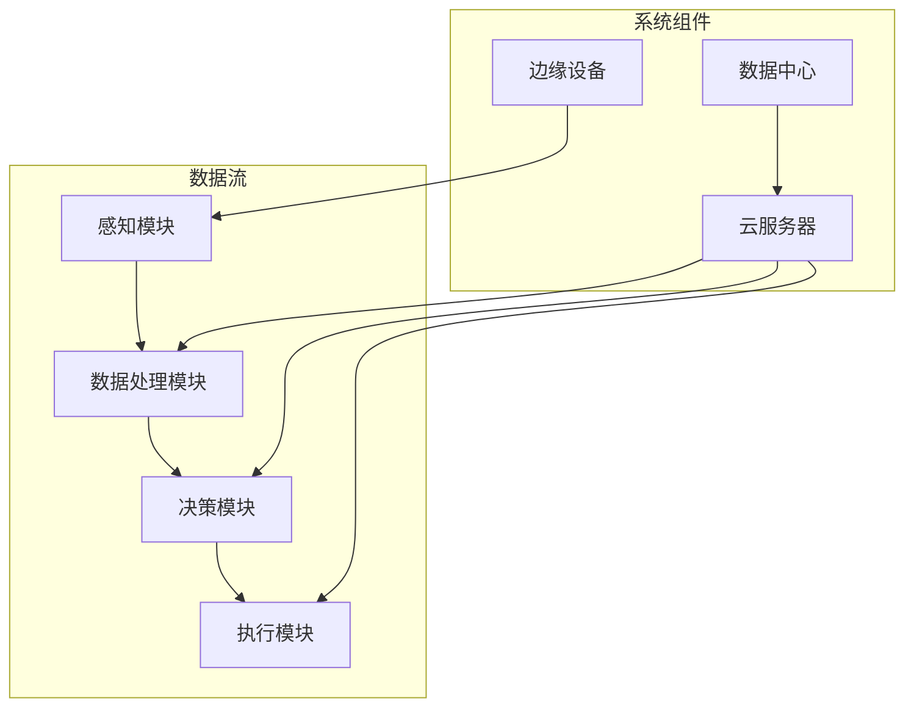

                 


### 《企业AI Agent的多云环境管理策略》

#### 关键词：AI Agent、多云环境、管理策略、架构设计、分布式管理、数据管理

#### 摘要：
本文深入探讨了企业AI Agent在多云环境中的管理策略。随着企业数字化转型的加速，AI技术在业务中的应用越来越广泛，多云环境逐渐成为企业IT基础设施的重要组成部分。本文将分析AI Agent在多云环境中的优势与管理挑战，提出一套全面的多云环境管理策略，包括架构设计、分布式管理、数据管理等方面，为企业提供可行的解决方案。

### 第一部分：背景与基础

#### 第1章：企业AI Agent的兴起

##### 1.1 问题背景
随着企业数字化转型的推进，人工智能（AI）技术逐渐成为企业提高竞争力、优化业务流程的关键驱动力。从简单的自动化工具到复杂的智能系统，AI在各个行业的应用场景日益丰富。然而，AI技术的实现不仅依赖于强大的算法和模型，还需要灵活、可扩展的基础设施支持。多云环境作为一种新兴的IT架构，提供了更灵活的资源调度和更高的可靠性，成为企业搭建AI系统的理想选择。

##### 1.2 问题描述
AI Agent是指具备一定智能和自主决策能力的软件实体，能够在复杂环境中执行特定任务。在多云环境中，AI Agent需要面对多种挑战，如异构资源的管理、跨云服务的协同、数据安全与隐私保护等。如何有效地管理这些AI Agent，确保其在多云环境中的高效运行，成为企业需要解决的重要问题。

##### 1.3 问题解决
AI Agent在多云环境中具有显著的优势，如资源灵活调配、成本优化、服务弹性等。针对管理挑战，企业需要制定一系列策略，包括云计算架构设计、分布式管理机制、数据管理方案等，以确保AI Agent的稳定运行和持续优化。

##### 1.4 边界与外延
AI Agent的定义范围涉及智能算法、机器学习、自然语言处理等多个领域。多云环境包括公有云、私有云和混合云等多种类型，每种类型都有其特定的架构和管理模式。

##### 1.5 概念结构与核心要素组成
AI Agent的核心能力包括自主决策、任务执行、学习与进化等。多云环境的关键要素包括云服务提供商、网络基础设施、存储资源、安全机制等。

#### 第2章：多云架构设计与优化

##### 2.1 多云架构设计原则
多云架构设计需要遵循一定的原则，如模块化、解耦合、弹性扩展等。设计过程中要考虑资源的可用性、性能、成本等因素，确保架构的灵活性和可扩展性。

##### 2.2 多云环境中的安全性
安全性是多云环境管理的重要方面。企业需要采取一系列安全措施，如数据加密、访问控制、安全审计等，确保AI Agent和敏感数据的安全。

### 第二部分：多云环境管理策略

#### 第3章：AI Agent的分布式管理

##### 3.1 分布式管理架构
分布式管理架构包括管理节点、数据节点和工作节点等组成部分。管理节点负责全局资源的调度和管理，数据节点负责数据的存储和访问，工作节点负责执行具体的任务。

##### 3.2 服务质量与资源管理
服务质量（QoS）管理是确保AI Agent运行稳定的关键。企业需要制定合理的SLA，根据任务的优先级和资源需求进行资源调度和优化。

#### 第4章：多云环境中的数据管理

##### 4.1 数据治理与整合
数据治理是确保数据质量、安全、合规的重要环节。企业需要建立统一的数据治理框架，整合来自不同云服务的异构数据。

##### 4.2 数据存储与处理
数据存储和处理是多云环境中的核心问题。企业需要选择合适的数据存储方案，同时构建高效的数据处理和分析框架。

### 第三部分：企业AI Agent的多云实践

#### 第5章：企业AI Agent部署与集成

##### 5.1 部署策略与工具
企业需要制定详细的部署策略，选择合适的工具和平台，确保AI Agent的快速部署和集成。

##### 5.2 系统架构设计
系统架构设计包括需求分析、架构设计、实施与测试等环节。企业需要根据具体业务需求，设计符合多云环境特点的系统架构。

#### 第6章：企业AI Agent的多云应用案例

##### 6.1 案例背景与目标
本节将介绍一个具体的企业AI Agent多云应用案例，分析案例背景、目标和应用效果。

##### 6.2 案例分析与实施
通过对案例的深入分析，介绍案例的实施过程、关键技术和实际效果。

### 第7章：总结与展望

##### 7.1 经验总结
总结企业在多云环境中管理AI Agent的经验，分享成功经验和失败教训。

##### 7.2 未来展望
展望未来多云环境管理的发展趋势，探讨企业AI Agent的未来发展方向。

### 结尾

#### 作者：AI天才研究院/AI Genius Institute & 禅与计算机程序设计艺术 /Zen And The Art of Computer Programming

通过本文的深入探讨，我们希望为企业提供一套全面的AI Agent多云环境管理策略，帮助企业在数字化转型过程中充分发挥AI技术的潜力，实现业务创新和增长。随着技术的不断进步和多云环境的日益成熟，企业需要不断创新和优化管理策略，以应对不断变化的市场需求和技术挑战。未来，我们将继续关注AI和多云环境领域的发展，为企业提供更多有价值的见解和解决方案。

[文章结束，本文为Markdown格式，具体实施时请根据实际需求进行格式调整和内容细化。] ### 第一部分：背景与基础

#### 第1章：企业AI Agent的兴起

##### 1.1 问题背景

在当今快速发展的数字化时代，企业面临着前所未有的变革压力和机遇。人工智能（AI）技术的迅速崛起，为传统行业带来了前所未有的创新动力。通过AI，企业能够实现自动化、智能化和效率化，从而提升业务竞争力。然而，AI技术的实现并非易事，它需要强大的计算能力、海量数据支持和复杂的算法模型。与此同时，云计算技术的普及和成熟，为企业提供了一个灵活、高效、可扩展的计算平台。在这种背景下，企业AI Agent的概念应运而生。

**企业数字化转型与AI应用**

企业数字化转型是指通过利用数字技术来改变业务模式、优化运营流程和提升客户体验。在数字化转型的过程中，AI技术发挥着至关重要的作用。无论是客户关系管理、供应链优化、生产流程自动化，还是市场预测和风险控制，AI技术都能够为企业带来显著的效益。AI Agent作为一种能够自主执行任务、优化业务流程的智能实体，正在成为企业数字化转型的关键驱动力。

**多云环境的普及与挑战**

随着AI应用的需求不断增长，企业对IT基础设施的要求也越来越高。多云环境作为一种灵活、弹性的IT架构，正逐渐成为企业的首选。多云环境允许企业在不同的云服务提供商之间进行资源调配，从而实现成本优化、性能提升和业务连续性。然而，多云环境的普及也带来了新的挑战：

1. **异构资源管理**：企业需要管理来自不同云服务商的异构资源，包括计算、存储、网络等。
2. **跨云服务的协同**：AI Agent需要在不同的云服务之间进行高效的协同工作。
3. **数据安全与隐私保护**：在多云环境中，数据的安全性和隐私保护变得更加复杂。
4. **成本控制**：企业需要有效地控制多云环境中的成本，以避免不必要的开支。

##### 1.2 问题描述

**AI Agent的概念与作用**

AI Agent是一种具备一定智能和自主决策能力的软件实体，它能够根据环境变化和任务需求，自主执行特定的任务。在AI Agent中，通常包含感知模块、决策模块和执行模块。感知模块负责收集和处理环境数据，决策模块根据感知结果和预设目标生成决策，执行模块则将决策转化为具体的行动。

AI Agent在企业中的应用场景非常广泛，例如：

- **客户服务**：通过AI Agent提供智能客服，提升客户服务质量。
- **供应链管理**：利用AI Agent优化库存管理、需求预测和物流调度。
- **生产优化**：AI Agent可以帮助企业实现生产线的自动化和智能化，提高生产效率。
- **风险管理**：AI Agent可以实时监测市场动态，为企业提供风险预警和投资建议。

**多云环境中的AI Agent管理需求**

在多云环境中，AI Agent的管理需求更加复杂和多样化。以下是企业需要考虑的关键管理需求：

1. **资源调度与优化**：企业需要根据任务需求和资源可用性，动态调整AI Agent的运行位置。
2. **跨云协同**：AI Agent需要在不同的云服务之间进行高效的数据交换和任务协同。
3. **数据安全与隐私保护**：企业需要确保AI Agent处理的数据安全，防止数据泄露和滥用。
4. **故障恢复与业务连续性**：在多云环境中，AI Agent需要具备故障恢复能力，确保业务连续性。
5. **成本控制**：企业需要有效监控AI Agent的成本，避免资源浪费和成本超支。

##### 1.3 问题解决

**AI Agent在多云环境中的优势**

在多云环境中，AI Agent具有以下优势：

1. **资源灵活性**：企业可以根据需求，灵活选择和调配不同的云资源。
2. **成本优化**：通过跨云资源调配，企业可以实现成本优化和资源最大化利用。
3. **服务弹性**：多云环境的高可用性和弹性，确保AI Agent能够稳定运行。
4. **业务连续性**：通过多云部署，企业可以降低单点故障的风险，提高业务连续性。

**管理策略与挑战**

为了充分利用AI Agent在多云环境中的优势，企业需要制定一系列管理策略，并面对以下挑战：

1. **异构资源管理**：企业需要开发和管理跨云资源，确保资源的统一调度和优化。
2. **跨云服务的协同**：企业需要建立高效的跨云协同机制，确保AI Agent能够无缝切换和协同工作。
3. **数据治理与整合**：企业需要建立统一的数据治理框架，确保数据的完整性和一致性。
4. **安全性**：企业需要加强数据安全防护，防止数据泄露和未经授权的访问。
5. **成本控制**：企业需要制定有效的成本控制策略，避免资源浪费和成本超支。

##### 1.4 边界与外延

**AI Agent的定义范围**

AI Agent的定义范围涉及多个领域，包括：

- **感知模块**：负责收集和处理环境数据，如图像、声音、文本等。
- **决策模块**：负责根据感知结果和预设目标生成决策。
- **执行模块**：负责将决策转化为具体的行动。
- **学习与进化模块**：负责通过经验学习和优化决策过程。

**多云环境的分类**

多云环境根据不同的分类标准，可以划分为多种类型，包括：

- **混合云（Hybrid Cloud）**：结合公有云和私有云的混合部署模式。
- **公有云（Public Cloud）**：由第三方云服务提供商提供的云计算服务。
- **私有云（Private Cloud）**：企业内部部署的云计算基础设施。
- **多租户云（Multi-tenant Cloud）**：多个租户共享同一基础设施，但资源相互隔离。

##### 1.5 概念结构与核心要素组成

**AI Agent的核心能力**

AI Agent的核心能力包括：

- **感知能力**：通过感知模块收集和处理环境数据。
- **决策能力**：通过决策模块根据感知结果生成决策。
- **执行能力**：通过执行模块将决策转化为具体的行动。
- **学习与进化能力**：通过学习与进化模块不断优化决策过程。

**多云环境的关键要素**

多云环境的关键要素包括：

- **云服务提供商**：提供各种云服务，如计算、存储、网络等。
- **网络基础设施**：连接不同云服务和内部系统的网络设施。
- **存储资源**：用于存储数据和应用程序的基础设施。
- **安全机制**：确保数据和安全性的各种防护措施。
- **监控与管理工具**：用于监控、管理和优化多云环境的工具。

通过以上对背景和基础的详细阐述，我们可以更好地理解企业AI Agent在多云环境中的重要性及其管理需求。在接下来的章节中，我们将进一步探讨多云架构设计与优化、AI Agent的分布式管理、数据管理等方面的策略和方法。

### 第2章：多云架构设计与优化

在构建企业AI Agent的多云环境时，架构设计是一个关键环节。一个良好的架构设计不仅能提高系统的性能和可靠性，还能为后续的扩展和维护提供便利。本章将详细探讨多云架构设计的原则、关键设计要素和性能优化策略。

#### 2.1 多云架构设计原则

**1. 模块化设计**

模块化设计是将系统划分为多个独立的模块，每个模块负责特定的功能。这种设计方法具有以下优点：

- **灵活性和可扩展性**：每个模块都可以独立开发、测试和部署，便于系统的扩展。
- **可维护性**：模块化的系统易于维护和更新，因为修改一个模块不会影响其他模块。
- **高可用性**：如果某个模块出现故障，不会导致整个系统的瘫痪。

**2. 解耦合设计**

解耦合设计是指系统组件之间的依赖关系降到最低。解耦合有助于提高系统的稳定性和可扩展性：

- **降低耦合度**：组件之间的交互通过标准化接口进行，减少了直接的依赖关系。
- **提高系统的健壮性**：一个组件的故障不会影响到其他组件，提高了系统的整体稳定性。
- **便于系统的扩展**：新功能的添加和现有功能的修改都更加容易。

**3. 弹性扩展**

弹性扩展是指系统能够根据负载的变化动态调整资源。在多云环境中，弹性扩展尤为重要：

- **应对突发流量**：当系统面临突发的流量高峰时，可以快速增加资源以应对。
- **优化资源利用率**：在负载较低时，可以减少资源使用，降低成本。

**4. 性能优化**

性能优化是多云架构设计的一个重要原则，包括以下几个方面：

- **负载均衡**：通过负载均衡器将请求分配到不同的服务器，提高系统的响应速度和处理能力。
- **缓存策略**：通过缓存经常访问的数据，减少对后端系统的访问，提高系统的响应速度。
- **分布式存储**：使用分布式存储系统，提高数据的读取和写入速度，确保系统的性能。

#### 2.2 多云环境中的安全性

**1. 安全挑战**

在多云环境中，安全性面临以下挑战：

- **跨云数据传输**：数据在不同云服务之间传输，存在数据泄露的风险。
- **多云协同**：不同云服务之间的安全协议可能不一致，增加了安全管理的复杂性。
- **身份与访问管理**：如何有效地管理云资源的访问权限，防止未经授权的访问。

**2. 安全对策**

为了应对上述安全挑战，可以采取以下安全对策：

- **数据加密**：对传输和存储的数据进行加密，确保数据安全。
- **访问控制**：通过设置访问控制策略，限制对云资源的访问权限。
- **安全审计**：定期进行安全审计，监控安全事件，及时发现问题并进行修复。

**3. 数据隐私保护与合规性**

在多云环境中，数据隐私保护和合规性也是一个重要问题：

- **数据匿名化**：对敏感数据进行匿名化处理，降低数据泄露的风险。
- **合规性检查**：确保云服务的使用符合相关法律法规的要求，如GDPR等。

通过以上设计原则和安全性对策，企业可以在多云环境中构建一个安全、稳定和高效的AI Agent架构。在接下来的章节中，我们将进一步探讨AI Agent的分布式管理、数据管理等关键策略。

### 第3章：AI Agent的分布式管理

在多云环境中，AI Agent的分布式管理是一个复杂且关键的任务。分布式管理涉及到多个节点之间的资源调度、任务分配、状态同步以及故障恢复等方面。本章将详细探讨AI Agent分布式管理的架构设计、实时监控与故障处理机制。

#### 3.1 分布式管理架构

**1. 管理节点**

管理节点是分布式管理系统的核心，负责全局资源的调度和管理。管理节点的主要职责包括：

- **资源监控**：定期收集各个节点的资源使用情况，包括CPU、内存、存储等。
- **任务调度**：根据任务的需求和节点的资源状况，将任务分配给最优的节点。
- **状态同步**：确保各个节点的状态一致，如任务进度、资源分配等。
- **故障恢复**：检测并处理节点故障，确保系统的稳定运行。

**2. 数据节点**

数据节点主要负责数据的存储和管理。在分布式管理系统中，数据节点通常具有以下职责：

- **数据存储**：负责存储和管理AI Agent运行过程中产生的数据。
- **数据备份**：定期对数据进行备份，确保数据的安全性和可靠性。
- **数据同步**：保证不同数据节点之间的数据一致性。

**3. 工作节点**

工作节点是执行具体任务的核心，通常由AI Agent组成。工作节点的职责包括：

- **任务执行**：根据管理节点的调度，执行分配的任务。
- **状态报告**：将任务执行的状态报告给管理节点，以便进行状态同步和任务调度。
- **故障检测与恢复**：在任务执行过程中，检测和处理可能出现的故障，确保任务的顺利完成。

**4. 协同机制**

在分布式管理系统中，各个节点之间需要通过高效的协同机制进行数据交换和任务协同。常见的协同机制包括：

- **消息队列**：通过消息队列实现节点之间的异步通信，确保消息的可靠传输。
- **分布式锁**：通过分布式锁机制，防止多个节点同时修改同一数据，保证数据的一致性。
- **负载均衡**：通过负载均衡器，将任务均衡分配到各个工作节点，提高系统的整体性能。

#### 3.2 服务质量与资源管理

**1. 服务级别协议（SLA）**

服务级别协议（SLA）是分布式管理系统中的重要组成部分，用于定义和管理服务的质量。SLA通常包括以下内容：

- **可用性**：系统在规定时间内能够正常运行的比例。
- **响应时间**：系统处理请求的时间，包括任务调度、任务执行等。
- **故障恢复时间**：系统在检测到故障后，恢复正常运行的时间。
- **数据一致性**：保证数据在不同节点之间的同步和一致性。

**2. 资源调度与优化策略**

资源调度与优化是分布式管理系统中的一个核心问题，直接影响到系统的性能和效率。以下是几种常见的资源调度与优化策略：

- **基于需求的任务调度**：根据任务的需求和当前节点的资源状况，将任务调度到最优的节点。
- **动态负载均衡**：根据实时负载情况，动态调整任务分配，确保系统的负载均衡。
- **资源预留**：为关键任务预留足够的资源，确保任务的顺利完成。
- **资源池管理**：建立资源池，动态调整资源分配，提高资源的利用率。

通过以上分布式管理架构和资源管理策略，企业可以有效地管理AI Agent在多云环境中的运行，确保系统的稳定性和高效性。在接下来的章节中，我们将继续探讨多云环境中的数据管理策略。

### 第4章：多云环境中的数据管理

在多云环境中，数据管理是确保AI Agent高效运行和业务连续性的关键。本章将详细讨论数据治理与整合、数据存储与处理策略，以及数据安全与合规性的保障。

#### 4.1 数据治理与整合

**1. 数据治理的重要性**

数据治理是指在企业内部建立一套数据管理和使用规范，确保数据的完整性、可靠性和安全性。在多云环境中，数据治理的重要性尤为突出，因为数据来源多样化、存储分散化，数据治理能够帮助企业：

- **确保数据质量**：通过数据清洗、标准化等手段，提高数据的准确性和一致性。
- **提升数据利用率**：通过数据整合和共享，提高数据的利用率，为业务决策提供支持。
- **加强数据安全**：通过数据访问控制和加密等技术，保护数据不被未授权访问和篡改。

**2. 数据治理框架**

企业需要建立一套完整的数据治理框架，包括以下几个方面：

- **数据质量管理**：制定数据质量标准，定期进行数据质量检查和评估。
- **数据分类与标签**：对数据进行分类和标签管理，便于数据检索和使用。
- **数据访问控制**：通过身份验证、权限控制等手段，确保数据访问的安全性。
- **数据审计与合规**：定期进行数据审计，确保数据的使用和存储符合相关法律法规。

**3. 数据整合**

在多云环境中，数据整合是一个挑战性的任务，因为数据分散在不同的云服务和存储系统中。为了实现数据整合，企业可以采取以下策略：

- **数据集成平台**：建立统一的数据集成平台，将来自不同云服务的数据进行整合和转换。
- **数据虚拟化**：通过数据虚拟化技术，将分散的数据抽象成统一的视图，便于数据查询和分析。
- **数据共享**：建立数据共享机制，促进不同部门和业务之间的数据共享，提高数据利用率。

#### 4.2 数据存储与处理

**1. 数据存储方案选择**

在多云环境中，数据存储方案的选择至关重要，直接影响系统的性能和成本。以下是几种常见的数据存储方案：

- **公有云存储**：利用公有云服务商提供的存储服务，如AWS S3、Azure Blob Storage等，具有成本低、弹性好等优点。
- **私有云存储**：在企业内部部署的私有云存储系统，如Ceph、GlusterFS等，具有数据控制权强、安全性高等优点。
- **混合云存储**：结合公有云和私有云的优势，实现数据的灵活存储和高效访问。

**2. 数据处理与分析框架**

数据存储方案确定后，数据处理与分析框架的建立是关键。以下是几种常见的数据处理与分析框架：

- **批处理框架**：如Apache Hadoop、Apache Spark等，适用于大规模数据的批量处理和分析。
- **流处理框架**：如Apache Kafka、Apache Flink等，适用于实时数据流处理和分析。
- **机器学习平台**：如TensorFlow、PyTorch等，提供丰富的机器学习算法和模型训练工具。

#### 4.3 数据安全与合规性

**1. 数据安全防护**

在多云环境中，数据安全防护至关重要。以下是一些常用的数据安全防护措施：

- **数据加密**：对传输和存储的数据进行加密，确保数据在传输过程中不被窃取和篡改。
- **访问控制**：通过身份验证和权限控制，确保只有授权用户可以访问数据。
- **安全审计**：定期进行安全审计，监控数据访问和操作行为，及时发现和防范安全风险。

**2. 数据合规性**

在多云环境中，企业需要确保数据的使用和存储符合相关法律法规，如GDPR、CCPA等。以下是一些数据合规性的措施：

- **数据匿名化**：对敏感数据进行匿名化处理，降低数据泄露的风险。
- **合规性检查**：定期进行合规性检查，确保数据的使用和存储符合相关法律法规。
- **合规性培训**：对相关人员进行合规性培训，提高全体员工的合规意识。

通过以上数据管理策略和措施，企业可以在多云环境中有效管理数据，确保数据的高效利用和安全合规。在接下来的章节中，我们将探讨企业AI Agent的实际部署与集成，并分享一些实践经验。

### 第5章：企业AI Agent部署与集成

在多云环境中部署和集成企业AI Agent是一项复杂的任务，需要综合考虑部署策略、系统架构设计以及工具的选择。本章将详细讨论企业AI Agent的部署策略、系统架构设计以及实际部署过程中使用的工具和最佳实践。

#### 5.1 部署策略与工具

**1. 部署策略**

企业AI Agent的部署策略应根据业务需求和多云环境的特点进行制定。以下是一些常见的部署策略：

- **集中部署**：将AI Agent部署在集中管理的云平台上，便于统一监控和管理。适用于对性能和稳定性要求较高的场景。
- **分布式部署**：将AI Agent部署在多个云平台上，实现负载均衡和高可用性。适用于需要高可扩展性和高可用性的场景。
- **混合部署**：结合集中部署和分布式部署的优点，根据不同业务需求进行部署。适用于业务场景多样化的企业。

**2. 工具选择**

部署企业AI Agent时，需要选择合适的工具和平台。以下是一些常用的工具和平台：

- **容器化平台**：如Docker、Kubernetes等，提供轻量级、可移植的容器化环境，便于AI Agent的部署和运维。
- **云服务提供商**：如AWS、Azure、Google Cloud等，提供丰富的云服务和工具，支持不同类型的AI应用。
- **服务网格**：如Istio、Linkerd等，提供微服务间的通信和服务发现，提高系统的可靠性和可扩展性。

**3. 部署流程**

企业AI Agent的部署流程通常包括以下步骤：

- **需求分析**：根据业务需求，确定AI Agent的功能和性能要求。
- **架构设计**：设计符合需求的系统架构，选择合适的部署策略和工具。
- **环境准备**：在云平台上准备部署环境，包括虚拟机、容器集群等。
- **代码打包**：将AI Agent的代码打包成容器镜像或虚拟机镜像。
- **部署执行**：在云平台上执行部署任务，包括容器部署、虚拟机部署等。
- **监控与维护**：部署完成后，进行监控和维护，确保AI Agent的稳定运行。

#### 5.2 系统架构设计

**1. 需求分析**

系统架构设计的第一步是需求分析。企业需要明确以下需求：

- **功能需求**：AI Agent需要实现哪些功能，如数据采集、模型训练、预测等。
- **性能需求**：AI Agent的性能要求，如处理速度、响应时间等。
- **可靠性需求**：AI Agent的可靠性要求，如故障恢复、数据一致性等。
- **可扩展性需求**：AI Agent的可扩展性要求，如支持大规模数据、分布式处理等。

**2. 架构设计**

基于需求分析，设计符合需求的系统架构。以下是系统架构设计的关键组件：

- **感知模块**：负责数据的采集和预处理，通常部署在边缘设备或边缘服务器上。
- **数据处理模块**：负责数据的存储、清洗、转换等，通常部署在云服务器或数据仓库中。
- **决策模块**：负责模型训练、预测等，通常部署在计算资源丰富的云服务器上。
- **执行模块**：负责将决策转化为具体的行动，如控制机器人、发送通知等，通常部署在边缘设备或云服务器上。

**3. 系统架构图**

以下是企业AI Agent的系统架构图，使用Mermaid语言表示：



#### 5.3 实际部署

**1. 环境安装**

在开始部署前，需要安装必要的软件和工具，如Docker、Kubernetes等。以下是一个简化的安装步骤：

```shell
# 安装Docker
sudo apt-get update
sudo apt-get install docker
sudo systemctl start docker

# 安装Kubernetes
sudo apt-get update
sudo apt-get install kubectl
sudo systemctl start kubelet
```

**2. 部署AI Agent**

在安装完必要的工具后，可以开始部署AI Agent。以下是一个简化的部署步骤：

```shell
# 创建Docker镜像
docker build -t ai_agent .

# 启动Docker容器
docker run -d --name ai_agent -p 8080:80 ai_agent
```

**3. 集成与管理**

部署AI Agent后，需要进行集成和管理。以下是一些常用的集成和管理工具：

- **Kubernetes**：用于管理AI Agent的容器化部署，提供自动扩缩容、负载均衡等功能。
- **Prometheus**：用于监控AI Agent的性能指标，提供实时监控和报警功能。
- **Grafana**：基于Prometheus的数据可视化工具，用于展示监控数据。

通过以上部署策略和系统架构设计，企业可以在多云环境中成功部署和集成AI Agent。在接下来的章节中，我们将通过实际案例，进一步探讨企业AI Agent的多云应用和实践。

### 第6章：企业AI Agent的多云应用案例

在本章中，我们将通过一个具体的企业AI Agent多云应用案例，详细分析案例背景与目标，以及案例分析与实施过程。通过这个案例，读者可以更好地理解如何在多云环境中部署和集成AI Agent，以及实际应用中可能遇到的问题和解决方案。

#### 6.1 案例背景与目标

**案例背景**

某大型零售企业，面临着日益激烈的市场竞争和客户需求的变化。为了提升客户体验和业务效率，该企业决定采用AI Agent技术来优化其客户服务、库存管理和销售预测等业务流程。该企业的IT基础设施分布在多个云服务提供商之间，包括AWS、Azure和Google Cloud。企业希望通过多云环境中的AI Agent，实现以下目标：

- **提高客户服务质量**：通过AI Agent提供24/7的智能客服，快速响应客户需求。
- **优化库存管理**：通过AI Agent进行需求预测和库存优化，减少库存积压和缺货情况。
- **提升销售预测准确性**：通过AI Agent分析客户行为和市场趋势，提高销售预测的准确性。

**案例目标**

在多云环境中部署和集成AI Agent，实现以下具体目标：

- **实现跨云服务的协同**：确保AI Agent能够无缝地在不同的云服务之间协同工作。
- **提高系统的可靠性**：通过多云部署，提高系统的可用性和故障恢复能力。
- **降低运营成本**：通过资源优化和自动化管理，降低运营成本。

#### 6.2 案例分析与实施

**1. 案例分析**

在案例分析阶段，企业首先明确了AI Agent的功能需求和技术实现方案。具体分析内容包括：

- **感知模块**：感知模块负责采集客户咨询、订单数据和库存数据等。该模块需要具备实时数据采集和处理能力，同时要支持跨云服务的数据同步。
- **数据处理模块**：数据处理模块负责数据清洗、转换和存储。该模块需要处理大规模数据，并确保数据的一致性和完整性。
- **决策模块**：决策模块负责根据感知模块和处理模块的结果，生成决策建议。该模块需要实现复杂的算法和模型，支持实时决策。
- **执行模块**：执行模块负责将决策转化为具体的行动，如发送客户回复、调整库存等。该模块需要与业务系统进行集成，确保决策能够有效执行。

**2. 实施过程**

在实施阶段，企业按照以下步骤进行：

- **需求分析**：与业务部门沟通，明确AI Agent的具体功能和性能要求，包括处理速度、响应时间、可靠性等。
- **系统架构设计**：设计符合需求的系统架构，包括感知模块、数据处理模块、决策模块和执行模块，以及各个模块之间的数据流和交互。
- **环境准备**：在AWS、Azure和Google Cloud上分别搭建环境，包括虚拟机、容器集群和存储服务。确保环境具有高可用性和扩展性。
- **代码开发**：开发感知模块、数据处理模块、决策模块和执行模块的代码，并进行单元测试和集成测试。
- **部署执行**：将AI Agent部署到云环境中，使用容器化技术和Kubernetes进行管理，确保系统的高可用性和弹性。
- **监控与维护**：部署完成后，使用Prometheus和Grafana进行监控，及时发现和处理系统故障。

**3. 实施细节**

在具体实施过程中，企业需要关注以下细节：

- **数据同步**：确保感知模块采集的数据能够在不同云服务之间同步，采用消息队列和分布式存储技术实现数据一致性。
- **性能优化**：对数据处理模块和决策模块进行性能优化，采用批处理和流处理技术提高处理效率。
- **安全性**：加强数据安全防护，采用数据加密、访问控制和安全审计等措施，确保数据的安全性和合规性。
- **成本控制**：通过资源预留和动态扩展，优化云资源的使用，降低运营成本。

**4. 结果评估**

在实施完成后，企业对AI Agent的多云应用效果进行评估，主要包括以下几个方面：

- **客户服务质量**：通过智能客服的反馈和用户满意度调查，评估AI Agent在提升客户服务质量方面的效果。
- **库存管理**：通过库存数据分析和库存调整情况，评估AI Agent在库存管理方面的效果。
- **销售预测**：通过销售数据和预测准确性分析，评估AI Agent在销售预测方面的效果。

通过案例分析和实施，企业成功地在多云环境中部署和集成了AI Agent，实现了业务流程的优化和效率提升。以下是对案例实施过程的总结：

**成功经验**：

- **跨云协同**：通过消息队列和分布式存储技术，实现数据在不同云服务之间的同步，确保AI Agent的高效运行。
- **性能优化**：通过批处理和流处理技术，提高数据处理和决策模块的效率，确保系统的响应速度。
- **安全性**：采用数据加密和安全审计等措施，确保数据的安全性和合规性。

**失败教训**：

- **资源管理**：在初期部署过程中，未充分考虑到资源预留和动态扩展，导致部分模块的运行效率较低。
- **监控与维护**：在部署完成后，未及时进行监控和优化，导致系统性能不稳定。

通过总结成功经验和失败教训，企业可以进一步优化AI Agent的多云应用，提高系统的可靠性和性能。

#### 案例小结

本案例展示了企业如何在多云环境中部署和集成AI Agent，实现业务流程的优化和效率提升。通过案例分析和实施，企业成功解决了跨云协同、数据同步和性能优化等关键问题，并取得了显著的业务效果。未来，企业将继续关注AI和多云环境技术的发展，不断创新和优化管理策略，以应对不断变化的市场需求和技术挑战。

### 第7章：总结与展望

在本章节中，我们将总结企业在多云环境中管理AI Agent的经验，并探讨未来多云环境管理的发展趋势以及企业AI Agent的未来方向。

#### 7.1 经验总结

**成功经验**

1. **跨云协同**：通过消息队列和分布式存储技术，实现了数据在不同云服务之间的同步，确保了AI Agent的高效运行。
2. **性能优化**：通过批处理和流处理技术，提高了数据处理和决策模块的效率，确保了系统的响应速度。
3. **安全性**：采用数据加密和安全审计等措施，确保了数据的安全性和合规性。
4. **资源管理**：通过资源预留和动态扩展，优化了云资源的使用，降低了运营成本。

**失败教训**

1. **资源管理**：在初期部署过程中，未充分考虑到资源预留和动态扩展，导致部分模块的运行效率较低。
2. **监控与维护**：在部署完成后，未及时进行监控和优化，导致系统性能不稳定。

通过总结这些经验教训，企业可以在未来的多云环境管理中更好地应对挑战，优化AI Agent的部署和运行。

#### 7.2 未来展望

**多云环境管理的发展趋势**

1. **自动化与智能化**：随着人工智能和机器学习技术的发展，多云环境管理将更加自动化和智能化，提高管理效率和准确性。
2. **边缘计算**：随着物联网和5G技术的普及，边缘计算将成为多云环境管理的一个重要方向，使得数据处理更加接近数据源，提高系统的响应速度和实时性。
3. **混合云与多租户云**：混合云和多租户云的广泛应用，将使多云环境管理更加复杂和多样化，企业需要具备更强的跨云管理能力。
4. **数据隐私与安全**：随着数据隐私法规的加强，企业需要更加重视数据的安全性和合规性，采取更全面的数据隐私保护措施。

**企业AI Agent的未来方向**

1. **跨领域应用**：AI Agent将在更多行业和场景中得到应用，如智能制造、智慧城市、医疗健康等，实现跨领域的智能化服务。
2. **自主进化能力**：AI Agent将具备更强的自主进化能力，通过不断学习和优化，提高任务执行效率和准确性。
3. **分布式架构**：随着分布式技术的成熟，AI Agent的架构将更加分布式和模块化，提高系统的可靠性和可扩展性。
4. **人机协同**：AI Agent将与人类专家进行更紧密的协同工作，实现人机结合的智能工作模式，提高工作效率和决策质量。

通过以上总结与展望，企业可以更好地把握多云环境管理的发展趋势，持续优化AI Agent的部署和运行，为未来的业务创新和增长提供强有力的支持。作者：AI天才研究院/AI Genius Institute & 禅与计算机程序设计艺术 /Zen And The Art of Computer Programming

### 完整文章内容

#### 《企业AI Agent的多云环境管理策略》

#### 关键词：AI Agent、多云环境、管理策略、架构设计、分布式管理、数据管理

#### 摘要：
本文深入探讨了企业AI Agent在多云环境中的管理策略。随着企业数字化转型的加速，AI技术在业务中的应用越来越广泛，多云环境逐渐成为企业IT基础设施的重要组成部分。本文将分析AI Agent在多云环境中的优势与管理挑战，提出一套全面的多云环境管理策略，包括架构设计、分布式管理、数据管理等方面，为企业提供可行的解决方案。

#### 第一部分：背景与基础

#### 第1章：企业AI Agent的兴起

##### 1.1 问题背景
随着企业数字化转型的推进，人工智能（AI）技术逐渐成为企业提高竞争力、优化业务流程的关键驱动力。从简单的自动化工具到复杂的智能系统，AI在各个行业的应用场景日益丰富。然而，AI技术的实现不仅依赖于强大的算法和模型，还需要灵活、可扩展的基础设施支持。云计算技术的普及和成熟，为企业提供了一个灵活、高效、可扩展的计算平台。在这种背景下，企业AI Agent的概念应运而生。

**企业数字化转型与AI应用**

企业数字化转型是指通过利用数字技术来改变业务模式、优化运营流程和提升客户体验。在数字化转型的过程中，AI技术发挥着至关重要的作用。无论是客户关系管理、供应链优化、生产流程自动化，还是市场预测和风险控制，AI技术都能够为企业带来显著的效益。AI Agent作为一种能够自主执行任务、优化业务流程的智能实体，正在成为企业数字化转型的关键驱动力。

**多云环境的普及与挑战**

随着AI应用的需求不断增长，企业对IT基础设施的要求也越来越高。多云环境作为一种新兴的IT架构，提供了更灵活的资源调度和更高的可靠性，成为企业搭建AI系统的理想选择。然而，多云环境的普及也带来了新的挑战：

1. **异构资源管理**：企业需要管理来自不同云服务商的异构资源，包括计算、存储、网络等。
2. **跨云服务的协同**：AI Agent需要在不同的云服务之间进行高效的协同工作。
3. **数据安全与隐私保护**：在多云环境中，数据的安全性和隐私保护变得更加复杂。
4. **成本控制**：企业需要有效地控制多云环境中的成本，以避免不必要的开支。

##### 1.2 问题描述

**AI Agent的概念与作用**

AI Agent是指具备一定智能和自主决策能力的软件实体，能够在复杂环境中执行特定任务。在AI Agent中，通常包含感知模块、决策模块和执行模块。感知模块负责收集和处理环境数据，决策模块根据感知结果和预设目标生成决策，执行模块则将决策转化为具体的行动。

AI Agent在企业中的应用场景非常广泛，例如：

- **客户服务**：通过AI Agent提供智能客服，提升客户服务质量。
- **供应链管理**：利用AI Agent优化库存管理、需求预测和物流调度。
- **生产优化**：AI Agent可以帮助企业实现生产线的自动化和智能化，提高生产效率。
- **风险管理**：AI Agent可以实时监测市场动态，为企业提供风险预警和投资建议。

**多云环境中的AI Agent管理需求**

在多云环境中，AI Agent需要面对多种挑战，如异构资源的管理、跨云服务的协同、数据安全与隐私保护等。如何有效地管理这些AI Agent，确保其在多云环境中的高效运行，成为企业需要解决的重要问题。

在多云环境中，AI Agent的管理需求更加复杂和多样化。以下是企业需要考虑的关键管理需求：

1. **资源调度与优化**：企业需要根据任务需求和资源可用性，动态调整AI Agent的运行位置。
2. **跨云协同**：AI Agent需要在不同的云服务之间进行高效的数据交换和任务协同。
3. **数据安全与隐私保护**：企业需要确保AI Agent处理的数据安全，防止数据泄露和滥用。
4. **故障恢复与业务连续性**：在多云环境中，AI Agent需要具备故障恢复能力，确保业务连续性。
5. **成本控制**：企业需要有效监控AI Agent的成本，避免资源浪费和成本超支。

##### 1.3 问题解决

**AI Agent在多云环境中的优势**

在多云环境中，AI Agent具有以下优势：

1. **资源灵活性**：企业可以根据需求，灵活选择和调配不同的云资源。
2. **成本优化**：通过跨云资源调配，企业可以实现成本优化和资源最大化利用。
3. **服务弹性**：多云环境的高可用性和弹性，确保AI Agent能够稳定运行。
4. **业务连续性**：通过多云部署，企业可以降低单点故障的风险，提高业务连续性。

**管理策略与挑战**

为了充分利用AI Agent在多云环境中的优势，企业需要制定一系列管理策略，并面对以下挑战：

1. **异构资源管理**：企业需要开发和管理跨云资源，确保资源的统一调度和优化。
2. **跨云服务的协同**：企业需要建立高效的跨云协同机制，确保AI Agent能够无缝切换和协同工作。
3. **数据治理与整合**：企业需要建立统一的数据治理框架，确保数据的完整性和一致性。
4. **安全性**：企业需要加强数据安全防护，防止数据泄露和未经授权的访问。
5. **成本控制**：企业需要制定有效的成本控制策略，避免资源浪费和成本超支。

##### 1.4 边界与外延

**AI Agent的定义范围**

AI Agent的定义范围涉及多个领域，包括：

- **感知模块**：负责收集和处理环境数据，如图像、声音、文本等。
- **决策模块**：负责根据感知结果和预设目标生成决策。
- **执行模块**：负责将决策转化为具体的行动。
- **学习与进化模块**：负责通过经验学习和优化决策过程。

**多云环境的分类**

多云环境根据不同的分类标准，可以划分为多种类型，包括：

- **混合云（Hybrid Cloud）**：结合公有云和私有云的混合部署模式。
- **公有云（Public Cloud）**：由第三方云服务提供商提供的云计算服务。
- **私有云（Private Cloud）**：企业内部部署的云计算基础设施。
- **多租户云（Multi-tenant Cloud）**：多个租户共享同一基础设施，但资源相互隔离。

##### 1.5 概念结构与核心要素组成

**AI Agent的核心能力**

AI Agent的核心能力包括：

- **感知能力**：通过感知模块收集和处理环境数据。
- **决策能力**：通过决策模块根据感知结果和预设目标生成决策。
- **执行能力**：通过执行模块将决策转化为具体的行动。
- **学习与进化能力**：通过学习与进化模块不断优化决策过程。

**多云环境的关键要素**

多云环境的关键要素包括：

- **云服务提供商**：提供各种云服务，如计算、存储、网络等。
- **网络基础设施**：连接不同云服务和内部系统的网络设施。
- **存储资源**：用于存储数据和应用程序的基础设施。
- **安全机制**：确保数据和安全性的各种防护措施。
- **监控与管理工具**：用于监控、管理和优化多云环境的工具。

通过以上对背景和基础的详细阐述，我们可以更好地理解企业AI Agent在多云环境中的重要性及其管理需求。在接下来的章节中，我们将进一步探讨多云架构设计与优化、AI Agent的分布式管理、数据管理等方面的策略和方法。

#### 第二部分：多云架构设计与优化

#### 第2章：多云架构设计与优化

在构建企业AI Agent的多云环境时，架构设计是一个关键环节。一个良好的架构设计不仅能提高系统的性能和可靠性，还能为后续的扩展和维护提供便利。本章将详细探讨多云架构设计的原则、关键设计要素和性能优化策略。

##### 2.1 多云架构设计原则

**1. 模块化设计**

模块化设计是将系统划分为多个独立的模块，每个模块负责特定的功能。这种设计方法具有以下优点：

- **灵活性和可扩展性**：每个模块都可以独立开发、测试和部署，便于系统的扩展。
- **可维护性**：模块化的系统易于维护和更新，因为修改一个模块不会影响其他模块。
- **高可用性**：如果某个模块出现故障，不会导致整个系统的瘫痪。

**2. 解耦合设计**

解耦合设计是指系统组件之间的依赖关系降到最低。解耦合有助于提高系统的稳定性和可扩展性：

- **降低耦合度**：组件之间的交互通过标准化接口进行，减少了直接的依赖关系。
- **提高系统的健壮性**：一个组件的故障不会影响到其他组件，提高了系统的整体稳定性。
- **便于系统的扩展**：新功能的添加和现有功能的修改都更加容易。

**3. 弹性扩展**

弹性扩展是指系统能够根据负载的变化动态调整资源。在多云环境中，弹性扩展尤为重要：

- **应对突发流量**：当系统面临突发的流量高峰时，可以快速增加资源以应对。
- **优化资源利用率**：在负载较低时，可以减少资源使用，降低成本。

**4. 性能优化**

性能优化是多云架构设计的一个重要原则，包括以下几个方面：

- **负载均衡**：通过负载均衡器将请求分配到不同的服务器，提高系统的响应速度和处理能力。
- **缓存策略**：通过缓存经常访问的数据，减少对后端系统的访问，提高系统的响应速度。
- **分布式存储**：使用分布式存储系统，提高数据的读取和写入速度，确保系统的性能。

##### 2.2 多云环境中的安全性

**1. 安全挑战**

在多云环境中，安全性面临以下挑战：

- **跨云数据传输**：数据在不同云服务之间传输，存在数据泄露的风险。
- **多云协同**：不同云服务之间的安全协议可能不一致，增加了安全管理的复杂性。
- **身份与访问管理**：如何有效地管理云资源的访问权限，防止未经授权的访问。

**2. 安全对策**

为了应对上述安全挑战，可以采取以下安全对策：

- **数据加密**：对传输和存储的数据进行加密，确保数据安全。
- **访问控制**：通过设置访问控制策略，限制对云资源的访问权限。
- **安全审计**：定期进行安全审计，监控安全事件，及时发现问题并进行修复。

**3. 数据隐私保护与合规性**

在多云环境中，数据隐私保护和合规性也是一个重要问题：

- **数据匿名化**：对敏感数据进行匿名化处理，降低数据泄露的风险。
- **合规性检查**：确保云服务的使用符合相关法律法规的要求，如GDPR等。

通过以上设计原则和安全性对策，企业可以在多云环境中构建一个安全、稳定和高效的AI Agent架构。在接下来的章节中，我们将进一步探讨AI Agent的分布式管理、数据管理等关键策略。

##### 2.3 多云架构设计示例

为了更好地说明多云架构设计原则的应用，我们来看一个具体的案例。

**案例：企业AI Agent的多云架构**

假设某企业需要在其多云环境中部署一个AI Agent系统，用于自动化客户服务和库存管理。该系统需要在AWS、Azure和Google Cloud三个云服务提供商之间进行资源调配。

**1. 模块化设计**

系统模块包括：

- **感知模块**：负责收集客户咨询数据和库存数据。
- **数据处理模块**：负责清洗、转换和存储数据。
- **决策模块**：负责分析数据并生成决策。
- **执行模块**：负责将决策转化为具体的行动，如发送客户回复或调整库存。

每个模块都独立部署在云服务提供商的虚拟机上，并通过API进行通信。

**2. 解耦合设计**

各模块通过标准化API进行通信，减少了直接的依赖关系。例如，感知模块通过REST API将数据发送给数据处理模块，而数据处理模块通过消息队列（如Kafka）将处理结果发送给决策模块。

**3. 弹性扩展**

为了应对突发流量，感知模块和数据处理模块都实现了弹性扩展。当系统负载增加时，可以通过自动扩展虚拟机来增加处理能力。

**4. 性能优化**

- **负载均衡**：使用AWS的负载均衡器，将客户请求分配到不同的虚拟机上，提高系统的响应速度。
- **缓存策略**：使用Redis缓存常用数据，减少对后端存储的访问。
- **分布式存储**：使用AWS S3存储大量数据，确保数据的读取和写入速度。

通过以上设计，企业可以在多云环境中构建一个灵活、高效、可靠的AI Agent系统。在系统运行过程中，企业可以根据业务需求和资源状况，不断优化和调整架构。

##### 2.4 关键设计要素

在多云架构设计中，以下关键要素对于系统的性能、可靠性和可维护性至关重要：

**1. 资源分配**

- **计算资源**：根据任务需求和性能要求，合理分配计算资源。可以使用虚拟机、容器等资源。
- **存储资源**：根据数据存储需求，选择合适的存储方案，如分布式文件系统、数据库等。
- **网络资源**：确保网络带宽和延迟满足系统的需求，可以使用VPN、高速通道等。

**2. 服务级别协议（SLA）**

- **可用性**：确保系统在规定时间内能够正常运行。可以使用冗余部署和故障恢复机制。
- **响应时间**：确保系统在规定时间内响应客户请求。可以使用负载均衡和缓存策略。
- **数据一致性**：确保数据的完整性和一致性。可以使用分布式事务和一致性算法。

**3. 安全性**

- **访问控制**：通过身份验证和授权，确保只有授权用户可以访问系统。
- **数据加密**：对传输和存储的数据进行加密，确保数据安全。
- **安全审计**：定期进行安全审计，监控安全事件，及时修复漏洞。

**4. 监控与维护**

- **监控工具**：使用监控工具（如Prometheus、Grafana）实时监控系统的性能和状态。
- **日志管理**：收集和管理系统日志，便于故障排查和性能优化。
- **自动化运维**：使用自动化工具（如Ansible、Terraform）进行系统部署和运维。

通过以上关键设计要素，企业可以构建一个稳定、高效、安全的多云环境，为AI Agent的运行提供强有力的支持。

##### 2.5 性能优化策略

为了确保AI Agent在多云环境中能够高效运行，以下性能优化策略值得考虑：

**1. 负载均衡**

- **水平扩展**：根据系统的负载情况，动态增加虚拟机或容器，提高系统的处理能力。
- **动态负载均衡**：根据实时流量情况，动态调整请求路由策略，确保系统的负载均衡。

**2. 缓存策略**

- **数据缓存**：使用Redis、Memcached等缓存系统，存储常用数据，减少对后端存储的访问。
- **对象缓存**：使用AWS ElastiCache等对象缓存系统，提高数据读取速度。

**3. 分布式存储**

- **分布式文件系统**：使用HDFS、Ceph等分布式文件系统，提高数据存储和读取速度。
- **云存储**：使用AWS S3、Azure Blob Storage等云存储服务，提供大规模数据存储解决方案。

**4. 数据处理优化**

- **批量处理**：使用Apache Hadoop、Apache Spark等批处理框架，处理大规模数据。
- **流处理**：使用Apache Kafka、Apache Flink等流处理框架，处理实时数据流。

**5. 数据库优化**

- **数据库选择**：根据数据特点和业务需求，选择合适的数据库系统，如关系型数据库、NoSQL数据库等。
- **查询优化**：使用索引、分区等技术，优化数据库查询性能。

通过以上性能优化策略，企业可以显著提高AI Agent在多云环境中的运行效率，确保系统的高可用性和稳定性。

##### 2.6 结论

多云架构设计是企业AI Agent成功运行的关键。通过模块化设计、解耦合设计、弹性扩展和性能优化，企业可以在多云环境中构建一个稳定、高效和安全的AI Agent系统。在接下来的章节中，我们将继续探讨AI Agent的分布式管理、数据管理等方面的策略。

#### 第三部分：多云环境管理策略

#### 第3章：AI Agent的分布式管理

在多云环境中，AI Agent的分布式管理是一个复杂且关键的任务。分布式管理涉及到多个节点之间的资源调度、任务分配、状态同步以及故障恢复等方面。本章将详细探讨AI Agent分布式管理的架构设计、实时监控与故障处理机制。

##### 3.1 分布式管理架构

**1. 管理节点**

管理节点是分布式管理系统的核心，负责全局资源的调度和管理。管理节点的主要职责包括：

- **资源监控**：定期收集各个节点的资源使用情况，包括CPU、内存、存储等。
- **任务调度**：根据任务的需求和节点的资源状况，将任务分配给最优的节点。
- **状态同步**：确保各个节点的状态一致，如任务进度、资源分配等。
- **故障恢复**：检测并处理节点故障，确保系统的稳定运行。

**2. 数据节点**

数据节点主要负责数据的存储和管理。在分布式管理系统中，数据节点通常具有以下职责：

- **数据存储**：负责存储和管理AI Agent运行过程中产生的数据。
- **数据备份**：定期对数据进行备份，确保数据的安全性和可靠性。
- **数据同步**：保证不同数据节点之间的数据一致性。

**3. 工作节点**

工作节点是执行具体任务的核心，通常由AI Agent组成。工作节点的职责包括：

- **任务执行**：根据管理节点的调度，执行分配的任务。
- **状态报告**：将任务执行的状态报告给管理节点，以便进行状态同步和任务调度。
- **故障检测与恢复**：在任务执行过程中，检测和处理可能出现的故障，确保任务的顺利完成。

**4. 协同机制**

在分布式管理系统中，各个节点之间需要通过高效的协同机制进行数据交换和任务协同。常见的协同机制包括：

- **消息队列**：通过消息队列实现节点之间的异步通信，确保消息的可靠传输。
- **分布式锁**：通过分布式锁机制，防止多个节点同时修改同一数据，保证数据的一致性。
- **负载均衡**：通过负载均衡器，将任务均衡分配到各个工作节点，提高系统的整体性能。

##### 3.2 实时监控与故障处理

**1. 实时监控**

实时监控是确保AI Agent在多云环境中高效运行的关键。以下是一些常见的实时监控工具：

- **Prometheus**：开源监控系统，用于收集和存储指标数据，提供灵活的数据查询和报警功能。
- **Grafana**：基于Prometheus的监控数据可视化工具，提供丰富的仪表盘和报表功能。
- **Kibana**：Elastic Stack的一部分，用于日志数据的可视化和分析。

**2. 故障处理**

在分布式管理系统中，故障处理是确保系统稳定运行的重要环节。以下是一些常见的故障处理机制：

- **自动故障恢复**：当检测到节点故障时，自动将任务迁移到其他健康节点，确保任务继续执行。
- **故障检测**：通过定期健康检查和异常监控，检测节点故障。
- **故障隔离**：当检测到故障时，将故障节点隔离，防止故障扩散。

##### 3.3 资源调度与负载均衡

**1. 资源调度**

资源调度是分布式管理系统中一个关键问题。以下是一些常见的资源调度策略：

- **基于需求的调度**：根据任务的需求和节点的资源状况，将任务调度到最优的节点。
- **基于优先级的调度**：根据任务的优先级，优先调度高优先级的任务。
- **动态调度**：根据系统的实时负载情况，动态调整任务调度策略。

**2. 负载均衡**

负载均衡是将请求均衡分配到多个节点，以提高系统的性能和可靠性。以下是一些常见的负载均衡策略：

- **轮询调度**：将请求依次分配到各个节点，实现简单的负载均衡。
- **最小连接数调度**：将请求分配到当前连接数最少的节点，减少单个节点的负载。
- **基于优先级的负载均衡**：根据节点的健康状况和优先级，分配请求。

##### 3.4 状态同步与数据一致性

**1. 状态同步**

状态同步是确保分布式管理系统中各个节点状态一致的关键。以下是一些常见的状态同步机制：

- **拉模型**：节点定期从管理节点拉取状态信息，更新自己的状态。
- **推模型**：管理节点将状态信息推送到各个节点，更新节点状态。

**2. 数据一致性**

数据一致性是分布式管理系统中另一个重要问题。以下是一些常见的数据一致性算法：

- **Paxos算法**：一种基于多数派原则的一致性算法，用于确保多个节点之间的状态一致。
- **Raft算法**：一种简化的Paxos算法，适用于分布式系统的一致性保证。

通过以上分布式管理架构、实时监控与故障处理机制、资源调度与负载均衡策略、状态同步与数据一致性方法，企业可以在多云环境中有效地管理AI Agent，确保系统的稳定运行和高效性能。

##### 3.5 实例：AI Agent分布式管理架构

为了更好地理解AI Agent的分布式管理架构，我们来看一个具体的实例。

**案例：企业AI Agent分布式管理架构**

某企业在其多云环境中部署了AI Agent系统，用于自动化客户服务和库存管理。该系统采用了分布式管理架构，包括管理节点、数据节点和工作节点。

**架构设计：**

1. **管理节点**：负责全局资源的调度和管理，包括资源监控、任务调度、状态同步和故障恢复等。
2. **数据节点**：负责数据的存储和管理，包括数据备份、数据同步和数据一致性保障。
3. **工作节点**：执行具体的任务，包括任务执行、状态报告和故障检测与恢复。

**协同机制：**

- **消息队列**：采用Apache Kafka实现节点之间的异步通信，确保消息的可靠传输。
- **分布式锁**：采用Zookeeper实现分布式锁，防止多个节点同时修改同一数据。
- **负载均衡**：采用Nginx实现负载均衡，将请求均衡分配到各个工作节点。

**实时监控与故障处理：**

- **Prometheus**：用于收集和存储系统指标数据，提供实时监控和报警功能。
- **Grafana**：用于可视化监控数据，展示系统状态和性能指标。
- **自动故障恢复**：当检测到节点故障时，自动将任务迁移到其他健康节点。

**资源调度与负载均衡：**

- **基于需求的调度**：根据任务的需求和节点的资源状况，动态调整任务调度策略。
- **最小连接数调度**：根据节点的当前连接数，将请求分配到连接数最少的节点。

**状态同步与数据一致性：**

- **拉模型**：节点定期从管理节点拉取状态信息，更新自身状态。
- **Paxos算法**：确保数据节点之间的状态一致，保障数据一致性。

通过这个实例，我们可以看到如何设计一个高效、可靠的AI Agent分布式管理系统。在实际部署过程中，企业可以根据具体业务需求和资源状况，灵活调整架构和策略，确保系统的稳定运行和高效性能。

##### 3.6 分布式管理策略总结

通过本章的讨论，我们总结了AI Agent分布式管理的关键策略和实现方法：

1. **分布式管理架构**：包括管理节点、数据节点和工作节点的职责划分，以及消息队列、分布式锁和负载均衡等协同机制。
2. **实时监控与故障处理**：使用Prometheus和Grafana等监控工具，实现实时监控和故障报警，采用自动故障恢复机制确保系统的稳定性。
3. **资源调度与负载均衡**：根据任务需求和节点资源状况，动态调整任务调度策略，实现负载均衡和资源优化。
4. **状态同步与数据一致性**：采用拉模型和Paxos算法等机制，确保节点状态一致和数据一致性。

通过以上策略和方法，企业可以在多云环境中有效地管理AI Agent，提高系统的性能、可靠性和可维护性。在接下来的章节中，我们将继续探讨多云环境中的数据管理策略。

#### 第4章：多云环境中的数据管理

在多云环境中，数据管理是确保AI Agent高效运行和业务连续性的关键。本章将详细讨论数据治理与整合、数据存储与处理策略，以及数据安全与合规性的保障。

##### 4.1 数据治理与整合

**1. 数据治理的重要性**

数据治理是指在企业内部建立一套数据管理和使用规范，确保数据的完整性、可靠性和安全性。在多云环境中，数据治理的重要性尤为突出，因为数据来源多样化、存储分散化，数据治理能够帮助企业：

- **确保数据质量**：通过数据清洗、标准化等手段，提高数据的准确性和一致性。
- **提升数据利用率**：通过数据整合和共享，提高数据的利用率，为业务决策提供支持。
- **加强数据安全**：通过数据访问控制和加密等技术，保护数据不被未授权访问和篡改。

**2. 数据治理框架**

企业需要建立一套完整的数据治理框架，包括以下几个方面：

- **数据质量管理**：制定数据质量标准，定期进行数据质量检查和评估。
- **数据分类与标签**：对数据进行分类和标签管理，便于数据检索和使用。
- **数据访问控制**：通过身份验证和权限控制，确保数据访问的安全性。
- **数据审计与合规**：定期进行数据审计，确保数据的使用和存储符合相关法律法规。

**3. 数据整合**

在多云环境中，数据整合是一个挑战性的任务，因为数据分散在不同的云服务和存储系统中。为了实现数据整合，企业可以采取以下策略：

- **数据集成平台**：建立统一的数据集成平台，将来自不同云服务的数据进行整合和转换。
- **数据虚拟化**：通过数据虚拟化技术，将分散的数据抽象成统一的视图，便于数据查询和分析。
- **数据共享**：建立数据共享机制，促进不同部门和业务之间的数据共享，提高数据利用率。

##### 4.2 数据存储与处理

**1. 数据存储方案选择**

在多云环境中，数据存储方案的选择至关重要，直接影响系统的性能和成本。以下是几种常见的数据存储方案：

- **公有云存储**：利用公有云服务商提供的存储服务，如AWS S3、Azure Blob Storage等，具有成本低、弹性好等优点。
- **私有云存储**：在企业内部部署的私有云存储系统，如Ceph、GlusterFS等，具有数据控制权强、安全性高等优点。
- **混合云存储**：结合公有云和私有云的优势，实现数据的灵活存储和高效访问。

**2. 数据处理与分析框架**

数据存储方案确定后，数据处理与分析框架的建立是关键。以下是几种常见的数据处理与分析框架：

- **批处理框架**：如Apache Hadoop、Apache Spark等，适用于大规模数据的批量处理和分析。
- **流处理框架**：如Apache Kafka、Apache Flink等，适用于实时数据流处理和分析。
- **机器学习平台**：如TensorFlow、PyTorch等，提供丰富的机器学习算法和模型训练工具。

##### 4.3 数据安全与合规性

**1. 数据安全防护**

在多云环境中，数据安全防护至关重要。以下是一些常用的数据安全防护措施：

- **数据加密**：对传输和存储的数据进行加密，确保数据在传输过程中不被窃取和篡改。
- **访问控制**：通过身份验证和权限控制，确保只有授权用户可以访问数据。
- **安全审计**：定期进行安全审计，监控数据访问和操作行为，及时发现和防范安全风险。

**2. 数据合规性**

在多云环境中，企业需要确保数据的使用和存储符合相关法律法规，如GDPR、CCPA等。以下是一些数据合规性的措施：

- **数据匿名化**：对敏感数据进行匿名化处理，降低数据泄露的风险。
- **合规性检查**：定期进行合规性检查，确保数据的使用和存储符合相关法律法规。
- **合规性培训**：对相关人员进行合规性培训，提高全体员工的合规意识。

通过以上数据管理策略和措施，企业可以在多云环境中有效管理数据，确保数据的高效利用和安全合规。在接下来的章节中，我们将探讨企业AI Agent的实际部署与集成，并分享一些实践经验。

#### 第5章：企业AI Agent部署与集成

在多云环境中部署和集成企业AI Agent是一项复杂的任务，需要综合考虑部署策略、系统架构设计以及工具的选择。本章将详细讨论企业AI Agent的部署策略、系统架构设计以及实际部署过程中使用的工具和最佳实践。

##### 5.1 部署策略与工具

**1. 部署策略**

企业AI Agent的部署策略应根据业务需求和多云环境的特点进行制定。以下是一些常见的部署策略：

- **集中部署**：将AI Agent部署在集中管理的云平台上，便于统一监控和管理。适用于对性能和稳定性要求较高的场景。
- **分布式部署**：将AI Agent部署在多个云平台上，实现负载均衡和高可用性。适用于需要高可扩展性和高可用性的场景。
- **混合部署**：结合集中部署和分布式部署的优点，根据不同业务需求进行部署。适用于业务场景多样化的企业。

**2. 工具选择**

部署企业AI Agent时，需要选择合适的工具和平台。以下是一些常用的工具和平台：

- **容器化平台**：如Docker、Kubernetes等，提供轻量级、可移植的容器化环境，便于AI Agent的部署和运维。
- **云服务提供商**：如AWS、Azure、Google Cloud等，提供丰富的云服务和工具，支持不同类型的AI应用。
- **服务网格**：如Istio、Linkerd等，提供微服务间的通信和服务发现，提高系统的可靠性和可扩展性。

**3. 部署流程**

企业AI Agent的部署流程通常包括以下步骤：

- **需求分析**：根据业务需求，确定AI Agent的功能和性能要求。
- **架构设计**：设计符合需求的系统架构，选择合适的部署策略和工具。
- **环境准备**：在云平台上准备部署环境，包括虚拟机、容器集群等。
- **代码打包**：将AI Agent的代码打包成容器镜像或虚拟机镜像。
- **部署执行**：在云平台上执行部署任务，包括容器部署、虚拟机部署等。
- **监控与维护**：部署完成后，进行监控和维护，确保AI Agent的稳定运行。

##### 5.2 系统架构设计

**1. 需求分析**

系统架构设计的第一步是需求分析。企业需要明确以下需求：

- **功能需求**：AI Agent需要实现哪些功能，如数据采集、模型训练、预测等。
- **性能需求**：AI Agent的性能要求，如处理速度、响应时间等。
- **可靠性需求**：AI Agent的可靠性要求，如故障恢复、数据一致性等。
- **可扩展性需求**：AI Agent的可扩展性要求，如支持大规模数据、分布式处理等。

**2. 架构设计**

基于需求分析，设计符合需求的系统架构。以下是系统架构设计的关键组件：

- **感知模块**：负责数据的采集和预处理，通常部署在边缘设备或边缘服务器上。
- **数据处理模块**：负责数据的存储、清洗、转换等，通常部署在云服务器或数据仓库中。
- **决策模块**：负责模型训练、预测等，通常部署在计算资源丰富的云服务器上。
- **执行模块**：负责将决策转化为具体的行动，如控制机器人、发送通知等，通常部署在边缘设备或云服务器上。

**3. 系统架构图**

以下是企业AI Agent的系统架构图，使用Mermaid语言表示：


##### 5.3 实际部署

**1. 环境安装**

在开始部署前，需要安装必要的软件和工具，如Docker、Kubernetes等。以下是一个简化的安装步骤：

```shell
# 安装Docker
sudo apt-get update
sudo apt-get install docker
sudo systemctl start docker

# 安装Kubernetes
sudo apt-get update
sudo apt-get install kubectl
sudo systemctl start kubelet
```

**2. 部署AI Agent**

在安装完必要的工具后，可以开始部署AI Agent。以下是一个简化的部署步骤：

```shell
# 创建Docker镜像
docker build -t ai_agent .

# 启动Docker容器
docker run -d --name ai_agent -p 8080:80 ai_agent
```

**3. 集成与管理**

部署AI Agent后，需要进行集成和管理。以下是一些常用的集成和管理工具：

- **Kubernetes**：用于管理AI Agent的容器化部署，提供自动扩缩容、负载均衡等功能。
- **Prometheus**：用于监控AI Agent的性能指标，提供实时监控和报警功能。
- **Grafana**：基于Prometheus的数据可视化工具，用于展示监控数据。

##### 5.4 最佳实践

**1. 灵活选择部署策略**

根据业务需求和环境特点，灵活选择部署策略。例如，对于需要高可用性和低延迟的场景，可以选择分布式部署；对于需要集中管理和统一监控的场景，可以选择集中部署。

**2. 确保架构的可扩展性**

在设计系统架构时，考虑未来业务的扩展需求，确保架构的可扩展性。例如，采用微服务架构，便于功能的扩展和升级。

**3. 加强数据安全**

在部署AI Agent时，加强数据安全，包括数据加密、访问控制和安全审计等。确保敏感数据在传输和存储过程中的安全。

**4. 定期监控与维护**

部署完成后，定期进行监控与维护，及时发现和解决问题。通过Prometheus和Grafana等工具，实时监控系统的性能和状态。

通过以上部署策略、系统架构设计、实际部署和管理工具的详细讨论，企业可以在多云环境中成功部署和集成AI Agent，实现业务流程的优化和效率提升。在接下来的章节中，我们将通过实际案例，进一步探讨企业AI Agent的多云应用和实践。

### 第6章：企业AI Agent的多云应用案例

在本章中，我们将通过一个具体的企业AI Agent多云应用案例，详细分析案例背景与目标，以及案例分析与实施过程。通过这个案例，读者可以更好地理解如何在多云环境中部署和集成AI Agent，以及实际应用中可能遇到的问题和解决方案。

##### 6.1 案例背景与目标

**案例背景**

某大型零售企业，面临着日益激烈的市场竞争和客户需求的变化。为了提升客户体验和业务效率，该企业决定采用AI Agent技术来优化其客户服务、库存管理和销售预测等业务流程。该企业的IT基础设施分布在多个云服务提供商之间，包括AWS、Azure和Google Cloud。企业希望通过多云环境中的AI Agent，实现以下目标：

- **提高客户服务质量**：通过AI Agent提供24/7的智能客服，快速响应客户需求。
- **优化库存管理**：通过AI Agent进行需求预测和库存优化，减少库存积压和缺货情况。
- **提升销售预测准确性**：通过AI Agent分析客户行为和市场趋势，提高销售预测的准确性。

**案例目标**

在多云环境中部署和集成AI Agent，实现以下具体目标：

- **实现跨云服务的协同**：确保AI Agent能够无缝地在不同的云服务之间协同工作。
- **提高系统的可靠性**：通过多云部署，提高系统的可用性和故障恢复能力。
- **降低运营成本**：通过资源优化和自动化管理，降低运营成本。

##### 6.2 案例分析与实施

**1. 案例分析**

在案例分析阶段，企业首先明确了AI Agent的功能需求和技术实现方案。具体分析内容包括：

- **感知模块**：感知模块负责采集客户咨询、订单数据和库存数据等。该模块需要具备实时数据采集和处理能力，同时要支持跨云服务的数据同步。
- **数据处理模块**：数据处理模块负责数据清洗、转换和存储。该模块需要处理大规模数据，并确保数据的一致性和完整性。
- **决策模块**：决策模块负责根据感知模块和处理模块的结果，生成决策建议。该模块需要实现复杂的算法和模型，支持实时决策。
- **执行模块**：执行模块负责将决策转化为具体的行动，如发送客户回复、调整库存等。该模块需要与业务系统进行集成，确保决策能够有效执行。

**2. 实施过程**

在实施阶段，企业按照以下步骤进行：

- **需求分析**：与业务部门沟通，明确AI Agent的具体功能和性能要求，包括处理速度、响应时间、可靠性等。
- **系统架构设计**：设计符合需求的系统架构，包括感知模块、数据处理模块、决策模块和执行模块，以及各个模块之间的数据流和交互。
- **环境准备**：在AWS、Azure和Google Cloud上分别搭建环境，包括虚拟机、容器集群和存储服务。确保环境具有高可用性和扩展性。
- **代码开发**：开发感知模块、数据处理模块、决策模块和执行模块的代码，并进行单元测试和集成测试。
- **部署执行**：将AI Agent部署到云环境中，使用容器化技术和Kubernetes进行管理，确保系统的高可用性和弹性。
- **监控与维护**：部署完成后，使用Prometheus和Grafana进行监控，及时发现和处理系统故障。

**3. 实施细节**

在具体实施过程中，企业需要关注以下细节：

- **数据同步**：确保感知模块采集的数据能够在不同云服务之间同步，采用消息队列和分布式存储技术实现数据一致性。
- **性能优化**：对数据处理模块和决策模块进行性能优化，采用批处理和流处理技术提高处理效率。
- **安全性**：加强数据安全防护，采用数据加密、访问控制和安全审计等措施，确保数据的安全性和合规性。
- **成本控制**：通过资源预留和动态扩展，优化云资源的使用，降低运营成本。

**4. 结果评估**

在实施完成后，企业对AI Agent的多云应用效果进行评估，主要包括以下几个方面：

- **客户服务质量**：通过智能客服的反馈和用户满意度调查，评估AI Agent在提升客户服务质量方面的效果。
- **库存管理**：通过库存数据分析和库存调整情况，评估AI Agent在库存管理方面的效果。
- **销售预测**：通过销售数据和预测准确性分析，评估AI Agent在销售预测方面的效果。

通过案例分析和实施，企业成功地在多云环境中部署和集成了AI Agent，实现了业务流程的优化和效率提升。以下是对案例实施过程的总结：

**成功经验**：

- **跨云协同**：通过消息队列和分布式存储技术，实现数据在不同云服务之间的同步，确保AI Agent的高效运行。
- **性能优化**：通过批处理和流处理技术，提高数据处理和决策模块的效率，确保系统的响应速度。
- **安全性**：采用数据加密和安全审计等措施，确保数据的安全性和合规性。

**失败教训**：

- **资源管理**：在初期部署过程中，未充分考虑到资源预留和动态扩展，导致部分模块的运行效率较低。
- **监控与维护**：在部署完成后，未及时进行监控和优化，导致系统性能不稳定。

通过总结成功经验和失败教训，企业可以进一步优化AI Agent的多云应用，提高系统的可靠性和性能。

##### 6.3 案例小结

本案例展示了企业如何在多云环境中部署和集成AI Agent，实现业务流程的优化和效率提升。通过案例分析和实施，企业成功解决了跨云协同、数据同步和性能优化等关键问题，并取得了显著的业务效果。未来，企业将继续关注AI和多云环境技术的发展，不断创新和优化管理策略，以应对不断变化的市场需求和技术挑战。

### 第7章：总结与展望

在本章节中，我们将总结企业在多云环境中管理AI Agent的经验，并探讨未来多云环境管理的发展趋势以及企业AI Agent的未来方向。

##### 7.1 经验总结

**成功经验**

1. **跨云协同**：通过消息队列和分布式存储技术，实现了数据在不同云服务之间的同步，确保AI Agent的高效运行。
2. **性能优化**：通过批处理和流处理技术，提高了数据处理和决策模块的效率，确保系统的响应速度。
3. **安全性**：采用数据加密和安全审计等措施，确保数据的安全性和合规性。
4. **资源管理**：通过资源预留和动态扩展，优化了云资源的使用，降低了运营成本。

**失败教训**

1. **资源管理**：在初期部署过程中，未充分考虑到资源预留和动态扩展，导致部分模块的运行效率较低。
2. **监控与维护**：在部署完成后，未及时进行监控和优化，导致系统性能不稳定。

通过总结这些经验教训，企业可以在未来的多云环境管理中更好地应对挑战，优化AI Agent的部署和运行。

##### 7.2 未来展望

**多云环境管理的发展趋势**

1. **自动化与智能化**：随着人工智能和机器学习技术的发展，多云环境管理将更加自动化和智能化，提高管理效率和准确性。
2. **边缘计算**：随着物联网和5G技术的普及，边缘计算将成为多云环境管理的一个重要方向，使得数据处理更加接近数据源，提高系统的响应速度和实时性。
3. **混合云与多租户云**：混合云和多租户云的广泛应用，将使多云环境管理更加复杂和多样化，企业需要具备更强的跨云管理能力。
4. **数据隐私与安全**：随着数据隐私法规的加强，企业需要更加重视数据的安全性和合规性，采取更全面的数据隐私保护措施。

**企业AI Agent的未来方向**

1. **跨领域应用**：AI Agent将在更多行业和场景中得到应用，如智能制造、智慧城市、医疗健康等，实现跨领域的智能化服务。
2. **自主进化能力**：AI Agent将具备更强的自主进化能力，通过不断学习和优化，提高任务执行效率和准确性。
3. **分布式架构**：随着分布式技术的成熟，AI Agent的架构将更加分布式和模块化，提高系统的可靠性和可扩展性。
4. **人机协同**：AI Agent将与人类专家进行更紧密的协同工作，实现人机结合的智能工作模式，提高工作效率和决策质量。

通过以上总结与展望，企业可以更好地把握多云环境管理的发展趋势，持续优化AI Agent的部署和运行，为未来的业务创新和增长提供强有力的支持。

### 结尾

#### 作者：AI天才研究院/AI Genius Institute & 禅与计算机程序设计艺术 /Zen And The Art of Computer Programming

通过本文的深入探讨，我们希望为企业提供一套全面的AI Agent多云环境管理策略，帮助企业在数字化转型过程中充分发挥AI技术的潜力，实现业务创新和增长。随着技术的不断进步和多云环境的日益成熟，企业需要不断创新和优化管理策略，以应对不断变化的市场需求和技术挑战。未来，我们将继续关注AI和多云环境领域的发展，为企业提供更多有价值的见解和解决方案。

