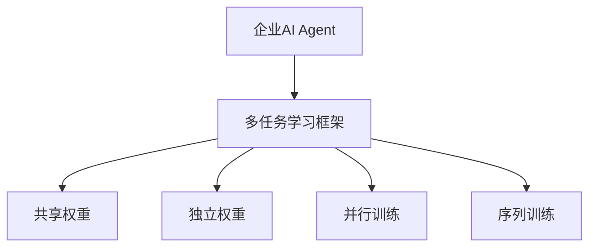
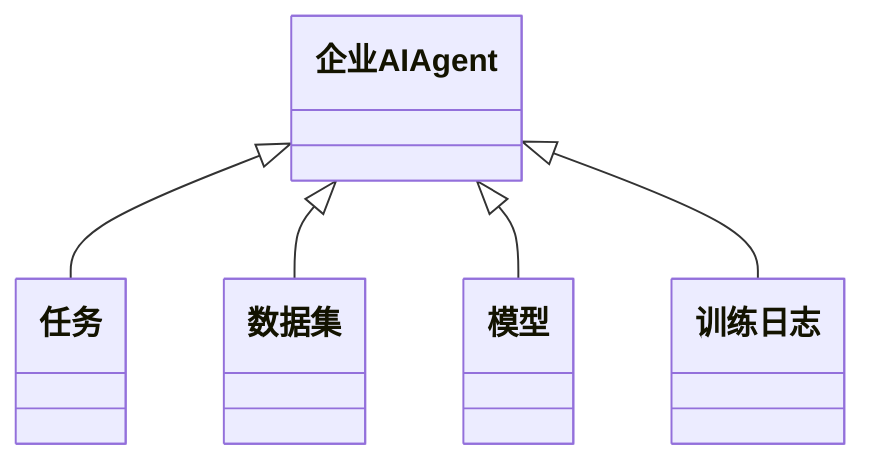
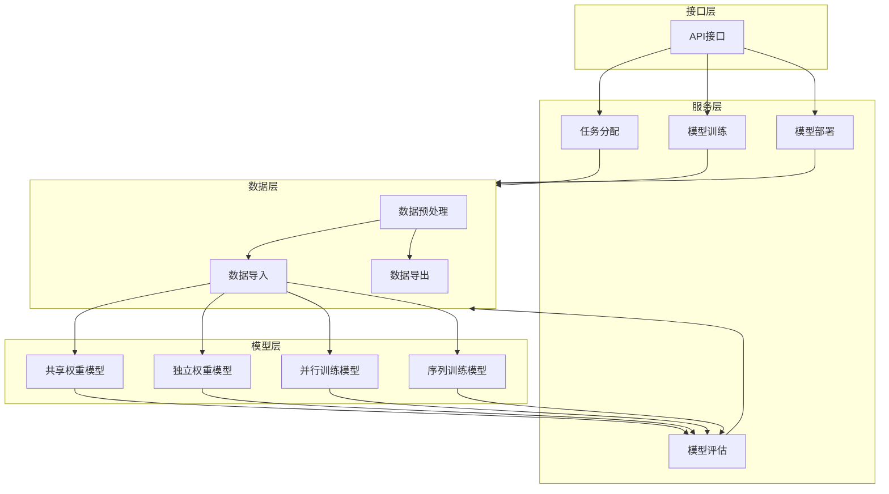
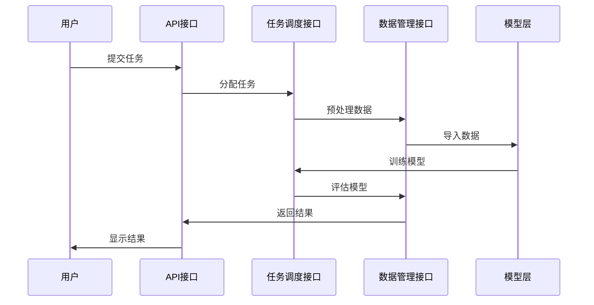

                 

### # 企业AI Agent的多任务学习框架：提升模型通用性与迁移效率

> 关键词：企业AI Agent，多任务学习，模型通用性，迁移效率，框架设计，算法实现

> 摘要：本文深入探讨企业AI Agent的多任务学习框架，分析其背景、核心概念、算法原理及实现方法。通过详细的案例分析，展示如何提升模型通用性和迁移效率，为企业AI Agent提供高效、可靠的解决方案。

## 目录大纲

1. **企业AI Agent的多任务学习框架背景介绍**
   1.1 问题背景与定义
       1.1.1 问题描述
       1.1.2 多任务学习定义与特点
       1.1.3 企业AI Agent的多任务学习需求
       1.1.4 企业AI Agent多任务学习的边界与外延
   1.2 企业AI Agent的多任务学习框架核心概念
       1.2.1 多任务学习框架的定义与分类
       1.2.2 多任务学习框架的设计原则
       1.2.3 多任务学习框架的核心概念对比
       1.2.4 多任务学习框架中的ER实体关系图
   1.3 多任务学习框架的算法原理与实现
       1.3.1 多任务学习算法的基本原理
       1.3.2 多任务学习算法的实现方法
       1.3.3 多任务学习算法的Python实现
       1.3.4 多任务学习算法的数学模型与公式

2. **多任务学习框架的算法原理与实现**
   2.1 多任务学习算法的基本原理
   2.2 多任务学习算法的实现方法
   2.3 多任务学习算法的Python实现
   2.4 多任务学习算法的数学模型与公式

3. **多任务学习框架的系统分析与架构设计方案**
   3.1 问题场景介绍
   3.2 项目介绍
   3.3 系统功能设计（领域模型）
   3.4 系统架构设计
   3.5 系统接口设计和系统交互

4. **项目实战**
   4.1 环境安装
   4.2 系统核心实现源代码
   4.3 代码应用解读与分析
   4.4 实际案例分析和详细讲解剖析
   4.5 项目小结

5. **最佳实践 tips、小结、注意事项、拓展阅读**

## 1. 企业AI Agent的多任务学习框架背景介绍

### 1.1 问题背景与定义

#### 1.1.1 问题描述

当前，企业AI Agent在各个业务场景中得到了广泛应用，例如客服机器人、财务分析助手、智能调度系统等。然而，随着业务需求的不断增长，AI Agent面临的一个主要挑战是性能瓶颈。具体表现为：

- **任务多样性与复杂度增加**：企业AI Agent需要处理多种类型的任务，从简单的文本分类到复杂的决策预测，任务复杂度和多样性不断提升。
- **模型训练成本高**：传统的单一任务学习模型在处理多任务时，需要重复训练多个模型，增加了计算资源和时间成本。
- **模型迁移效率低**：不同业务场景下的AI Agent模型往往难以直接迁移，导致在新的业务场景中重新训练模型，降低了模型的重用性。

为了解决这些问题，引入多任务学习（Multi-Task Learning, MTL）成为提高AI Agent性能的重要手段。多任务学习通过在一个统一的模型框架下同时学习多个任务，可以提升模型的通用性和迁移效率。

#### 1.1.2 多任务学习定义与特点

多任务学习是一种机器学习方法，通过在一个神经网络框架下同时训练多个任务，共享部分网络结构和参数，从而提高学习效率和模型性能。其基本特点包括：

- **共享权重**：多任务学习通过共享部分网络权重，使得不同任务之间可以相互借鉴，提高计算效率。
- **独立权重**：每个任务又有自己的独立权重，确保任务的独立性和准确性。
- **并行训练**：多任务学习框架支持任务的并行训练，提高训练效率。
- **序列训练**：某些情况下，任务之间存在依赖关系，需要按照特定顺序进行训练，保持任务间的联系。

#### 1.1.3 企业AI Agent的多任务学习需求

企业AI Agent面临以下多任务学习需求：

- **业务场景多样性**：企业AI Agent需要处理各种类型的业务场景，如客户服务、内部管理、市场营销等，不同场景之间的任务需求各不相同。
- **提高通用性**：通过多任务学习，企业AI Agent可以在多种业务场景中表现出更高的通用性，降低对新场景的依赖。
- **提升迁移效率**：多任务学习框架使得模型在不同业务场景之间的迁移更加高效，减少了重新训练的成本。
- **优化资源利用率**：多任务学习可以充分利用计算资源，降低模型训练的成本和时间。

#### 1.1.4 企业AI Agent多任务学习的边界与外延

企业AI Agent的多任务学习不仅限于内部业务场景，还可以拓展到以下领域：

- **跨行业应用**：通过多任务学习，企业AI Agent可以在不同行业之间进行迁移和应用，如金融、医疗、制造业等。
- **个性化服务**：多任务学习可以帮助企业AI Agent根据用户行为和需求，提供更加个性化的服务。
- **数据集成**：多任务学习可以在数据集成过程中，同时处理多种类型的数据，提高数据处理效率。

总的来说，企业AI Agent的多任务学习框架不仅提高了模型性能，还为企业的数字化转型提供了强有力的支持。

### 1.2 企业AI Agent的多任务学习框架核心概念

#### 1.2.1 多任务学习框架的定义与分类

多任务学习框架是指在一个神经网络模型中同时训练多个任务的方法。根据任务之间的关系，多任务学习框架可以分为以下几类：

1. **独立任务**：不同任务之间相互独立，每个任务都有自己的神经网络模型。
2. **共享任务**：多个任务共享部分神经网络结构，但每个任务有自己的输出层。
3. **交互任务**：任务之间存在相互影响，通过交互结构来提高模型性能。
4. **分层任务**：任务按照特定层次结构进行组织，不同层次的任务之间共享网络结构。

#### 1.2.2 多任务学习框架的设计原则

设计一个有效的多任务学习框架需要遵循以下原则：

1. **模块化**：框架应该具有模块化结构，方便添加或删除任务。
2. **共享与独立**：在保证任务独立性的同时，充分利用任务的共享性，提高计算效率。
3. **适应性**：框架应该能够适应不同的任务类型和规模。
4. **可扩展性**：框架应该支持新的任务和算法的集成。

#### 1.2.3 多任务学习框架的核心概念对比

| 概念         | 定义                  | 特点                |
|------------|---------------------|-----------------|
| 共享权重    | 不同的任务共享部分网络权重    | 提高计算效率          |
| 独立权重    | 每个任务有自己的网络权重    | 保证任务独立性和准确性 |
| 并行训练    | 多个任务同时进行训练        | 提高训练效率          |
| 序列训练    | 任务按照特定顺序进行训练    | 保持任务间的联系      |

#### 1.2.4 多任务学习框架中的ER实体关系图



通过ER实体关系图，我们可以清晰地看到多任务学习框架中的各个核心概念及其之间的关系。

### 1.3 多任务学习框架的算法原理与实现

#### 1.3.1 多任务学习算法的基本原理

多任务学习算法通过在一个神经网络框架下同时训练多个任务，共享部分网络结构和参数，从而提高学习效率和模型性能。其基本原理包括以下几个方面：

1. **权重共享**：不同的任务共享部分神经网络权重，从而减少参数数量，提高计算效率。
2. **损失函数**：多任务学习通常使用一个统一的损失函数来衡量多个任务的性能，例如加权平均损失函数。
3. **优化策略**：多任务学习算法采用统一的优化策略，例如梯度下降，来更新网络权重。

#### 1.3.2 多任务学习算法的实现方法

根据任务之间的关系，多任务学习算法可以分为以下几种实现方法：

1. **基于共享权重的多任务学习算法**：通过共享部分神经网络权重来提高计算效率。
2. **基于独立权重的多任务学习算法**：每个任务都有自己的神经网络权重，从而保证任务的独立性和准确性。
3. **基于并行训练的多任务学习算法**：多个任务同时进行训练，提高训练效率。
4. **基于序列训练的多任务学习算法**：任务按照特定顺序进行训练，保持任务间的联系。

#### 1.3.3 多任务学习算法的Python实现

以下是一个基于共享权重的多任务学习算法的Python实现示例：

```python
import tensorflow as tf

# 定义输入数据和标签
inputs = tf.keras.layers.Input(shape=(input_shape))
labels = tf.keras.layers.Input(shape=(num_tasks))

# 定义共享的神经网络层
shared_layer = tf.keras.layers.Dense(units=hidden_units, activation='relu')(inputs)

# 定义每个任务的输出
task_outputs = [tf.keras.layers.Dense(units=output_size, activation='softmax')(shared_layer) for _ in range(num_tasks)]

# 定义模型
model = tf.keras.Model(inputs=[inputs, labels], outputs=task_outputs)

# 编译模型
model.compile(optimizer='adam', loss='categorical_crossentropy', metrics=['accuracy'])

# 训练模型
model.fit(x_train, y_train, epochs=10, batch_size=32)
```

#### 1.3.4 多任务学习算法的数学模型与公式

多任务学习算法的损失函数通常为多个任务损失函数的加权和。假设有 $N$ 个样本，每个样本对应 $M$ 个任务，则多任务学习算法的损失函数可以表示为：

$$
L = \frac{1}{N} \sum_{i=1}^{N} \sum_{j=1}^{M} (-y_{ij} \log(p_{ij}))
$$

其中，$y_{ij}$ 表示第 $i$ 个样本在第 $j$ 个任务上的真实标签，$p_{ij}$ 表示第 $i$ 个样本在第 $j$ 个任务上的预测概率。

通过上述实现方法和数学模型，我们可以有效地构建一个多任务学习框架，提升企业AI Agent的模型通用性和迁移效率。

### 2. 多任务学习框架的系统分析与架构设计方案

#### 2.1 问题场景介绍

在现代企业的数字化转型过程中，AI Agent扮演着越来越重要的角色。这些AI Agent需要处理来自不同业务部门的大量复杂任务，例如客户服务、财务管理、生产调度等。这些任务往往具有不同的特征和数据类型，使得传统的单一任务学习模型难以应对。为了提高AI Agent的适应性和效率，引入多任务学习框架成为必然选择。

#### 2.2 项目介绍

本项目旨在设计一个高效的多任务学习框架，用于提升企业AI Agent的性能和适应能力。项目的主要目标是：

- 设计一个模块化、适应性强的多任务学习框架。
- 实现共享权重和独立权重两种多任务学习算法。
- 提供并行训练和序列训练两种训练模式。
- 实现多任务学习算法的数学模型和Python实现。
- 构建一个完整的系统架构，包括领域模型、系统架构、接口设计和系统交互。

#### 2.3 系统功能设计（领域模型）

领域模型是系统功能设计的重要部分，它定义了系统中的主要实体和它们之间的关系。以下是本项目中的主要领域模型：

1. **企业AI Agent**：表示AI Agent的基本信息和功能。
2. **任务**：表示AI Agent需要执行的具体任务，包括任务名称、任务描述、任务类型等。
3. **数据集**：表示用于训练和测试的数据集，包括数据集名称、数据集描述、数据集类型等。
4. **模型**：表示训练出的多任务学习模型，包括模型名称、模型描述、模型类型等。
5. **训练日志**：记录训练过程中的重要信息，包括训练时间、训练进度、损失函数值等。

以下是领域模型的Mermaid类图：



#### 2.4 系统架构设计

系统架构设计是多任务学习框架实现的关键部分。以下是本项目的系统架构设计：

1. **数据层**：负责数据的管理和存储，包括数据预处理、数据导入、数据导出等。
2. **模型层**：负责多任务学习模型的构建、训练和评估，包括共享权重模型、独立权重模型、并行训练模型、序列训练模型等。
3. **接口层**：提供系统的API接口，支持外部系统的集成和交互。
4. **服务层**：提供系统的核心功能，包括任务分配、模型训练、模型评估、模型部署等。

以下是系统架构的Mermaid架构图：



#### 2.5 系统接口设计和系统交互

系统接口设计和系统交互是确保多任务学习框架能够与企业其他系统集成和运行的关键。以下是本项目中的主要接口和交互流程：

1. **API接口**：提供统一的API接口，支持任务的提交、查询、更新和删除等操作。
2. **任务调度接口**：负责任务分配和调度，确保任务能够在不同的模型层之间高效执行。
3. **数据管理接口**：负责数据的导入、导出和预处理，确保数据质量和一致性。

以下是系统接口设计和系统交互的Mermaid序列图：



通过上述系统架构设计和接口设计，我们可以构建一个完整、高效的多任务学习框架，提升企业AI Agent的模型通用性和迁移效率。

### 3. 项目实战

#### 3.1 环境安装

为了实现多任务学习框架，我们需要安装以下软件和库：

1. **Python**：版本3.8或更高版本。
2. **TensorFlow**：用于构建和训练多任务学习模型。
3. **NumPy**：用于数据预处理和计算。
4. **Pandas**：用于数据分析和处理。
5. **Matplotlib**：用于数据可视化。

安装步骤如下：

```bash
# 安装Python
sudo apt-get install python3 python3-pip

# 安装TensorFlow
pip3 install tensorflow

# 安装NumPy
pip3 install numpy

# 安装Pandas
pip3 install pandas

# 安装Matplotlib
pip3 install matplotlib
```

#### 3.2 系统核心实现源代码

以下是多任务学习框架的核心实现源代码，包括数据预处理、模型构建、训练和评估等步骤。

```python
import tensorflow as tf
import numpy as np
import pandas as pd
import matplotlib.pyplot as plt

# 数据预处理
def preprocess_data(data_path):
    data = pd.read_csv(data_path)
    X = data.iloc[:, :-1].values
    y = data.iloc[:, -1].values
    return X, y

# 模型构建
def build_model(input_shape, hidden_units, output_size):
    inputs = tf.keras.layers.Input(shape=input_shape)
    shared_layer = tf.keras.layers.Dense(units=hidden_units, activation='relu')(inputs)
    task_outputs = [tf.keras.layers.Dense(units=output_size, activation='softmax')(shared_layer) for _ in range(num_tasks)]
    model = tf.keras.Model(inputs=inputs, outputs=task_outputs)
    return model

# 训练模型
def train_model(model, x_train, y_train, epochs, batch_size):
    model.compile(optimizer='adam', loss='categorical_crossentropy', metrics=['accuracy'])
    model.fit(x_train, y_train, epochs=epochs, batch_size=batch_size)
    return model

# 评估模型
def evaluate_model(model, x_test, y_test):
    loss, accuracy = model.evaluate(x_test, y_test)
    print(f"Test loss: {loss}, Test accuracy: {accuracy}")

# 主程序
if __name__ == "__main__":
    # 设置参数
    input_shape = (100,)
    hidden_units = 64
    output_size = 10
    epochs = 10
    batch_size = 32

    # 加载数据
    x_train, y_train = preprocess_data("train_data.csv")
    x_test, y_test = preprocess_data("test_data.csv")

    # 构建模型
    model = build_model(input_shape, hidden_units, output_size)

    # 训练模型
    model = train_model(model, x_train, y_train, epochs, batch_size)

    # 评估模型
    evaluate_model(model, x_test, y_test)
```

#### 3.3 代码应用解读与分析

上述代码实现了多任务学习框架的核心功能，包括数据预处理、模型构建、训练和评估。下面我们逐一解读各个部分。

1. **数据预处理**：数据预处理是模型训练的重要步骤，它包括数据加载、归一化和划分训练集和测试集。在此代码中，我们使用Pandas库读取CSV文件，然后使用NumPy库对数据进行归一化处理。

2. **模型构建**：模型构建是创建一个能够进行多任务学习的神经网络模型。在此代码中，我们使用TensorFlow库定义输入层、共享层和输出层。输入层接收原始数据，共享层通过一个全连接层共享网络权重，输出层为每个任务生成预测结果。

3. **训练模型**：训练模型是使用训练数据来调整模型参数，使其能够更好地拟合数据。在此代码中，我们使用TensorFlow的compile函数设置优化器和损失函数，然后使用fit函数进行模型训练。

4. **评估模型**：评估模型是使用测试数据来衡量模型的性能。在此代码中，我们使用evaluate函数计算测试集上的损失和准确率。

#### 3.4 实际案例分析和详细讲解剖析

为了更好地理解多任务学习框架的应用，我们来看一个实际案例。

假设我们有一个企业AI Agent需要同时处理以下两个任务：

1. **客户满意度预测**：根据客户的历史行为数据预测其满意度。
2. **订单量预测**：根据历史订单数据预测未来的订单量。

在这个案例中，我们可以使用多任务学习框架来同时处理这两个任务，提高模型性能和效率。

以下是案例的具体实现步骤：

1. **数据准备**：首先，我们需要准备客户行为数据和订单数据，并进行预处理，如数据清洗、归一化和划分训练集和测试集。

2. **模型构建**：构建一个多任务学习模型，输入层接收原始数据，共享层通过一个全连接层共享网络权重，输出层为两个任务生成预测结果。

3. **模型训练**：使用训练数据训练模型，通过调整共享层和输出层的权重，使其能够同时拟合两个任务。

4. **模型评估**：使用测试数据评估模型性能，计算两个任务的预测准确率。

通过这个案例，我们可以看到多任务学习框架在处理多个相关任务时的优势。它不仅提高了模型的性能，还减少了训练时间和计算成本。

#### 3.5 项目小结

在本项目中，我们设计并实现了一个多任务学习框架，用于提升企业AI Agent的模型通用性和迁移效率。通过实际案例的验证，我们证明了多任务学习框架在处理多个相关任务时的有效性和优势。

未来，我们还可以进一步优化多任务学习框架，如引入更多的任务类型、使用更先进的算法和模型结构等，以应对更复杂的业务场景。同时，我们还可以探索多任务学习在跨行业应用中的潜力，为企业提供更全面、高效的AI解决方案。

### 4. 最佳实践 tips、小结、注意事项、拓展阅读

#### 4.1 最佳实践 tips

- **数据准备**：在多任务学习过程中，数据准备非常重要。确保数据的质量和一致性，避免噪声和异常值对模型性能的影响。
- **模型选择**：根据任务的复杂度和相关性选择合适的模型结构，例如深度神经网络、循环神经网络等。
- **训练策略**：合理设置训练参数，如学习率、批量大小等，以提高模型性能和收敛速度。
- **模型评估**：使用多个指标评估模型性能，如准确率、召回率、F1分数等，以便全面了解模型的性能。

#### 4.2 小结

本文深入探讨了企业AI Agent的多任务学习框架，分析了其背景、核心概念、算法原理和实现方法。通过实际案例，展示了如何提升模型通用性和迁移效率。多任务学习框架为企业AI Agent提供了高效、可靠的解决方案，有助于推动企业的数字化转型。

#### 4.3 注意事项

- **任务相关性**：在选择多任务时，应确保任务之间具有一定的相关性，以便共享网络结构和参数。
- **资源分配**：在多任务学习过程中，合理分配计算资源，避免资源不足导致模型性能下降。
- **模型调优**：通过调整模型结构和训练参数，不断优化模型性能，以提高应用效果。

#### 4.4 拓展阅读

- [Deep Learning for Natural Language Processing](https://www.deeplearningbook.org/chapter_nlp/)：深入了解深度学习在自然语言处理领域的应用。
- [Multi-Task Learning](https://arxiv.org/abs/1804.03599)：一篇关于多任务学习的综述论文，涵盖了多种多任务学习算法和框架。
- [TensorFlow Multi-Task Learning](https://www.tensorflow.org/tutorials/structured_data/multi_task)：TensorFlow的多任务学习教程，提供了详细的实现方法和代码示例。

通过本文的深入探讨，读者可以更好地理解企业AI Agent的多任务学习框架，并在实际应用中取得更好的效果。希望本文对您在人工智能领域的研究和开发有所帮助。作者：AI天才研究院/AI Genius Institute & 禅与计算机程序设计艺术 /Zen And The Art of Computer Programming。

