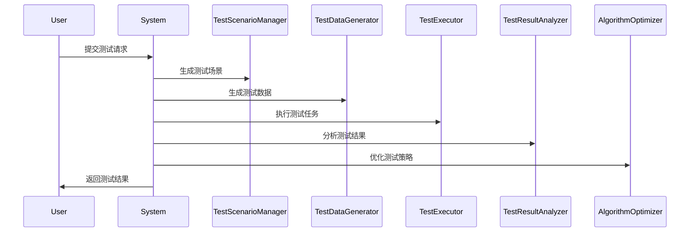
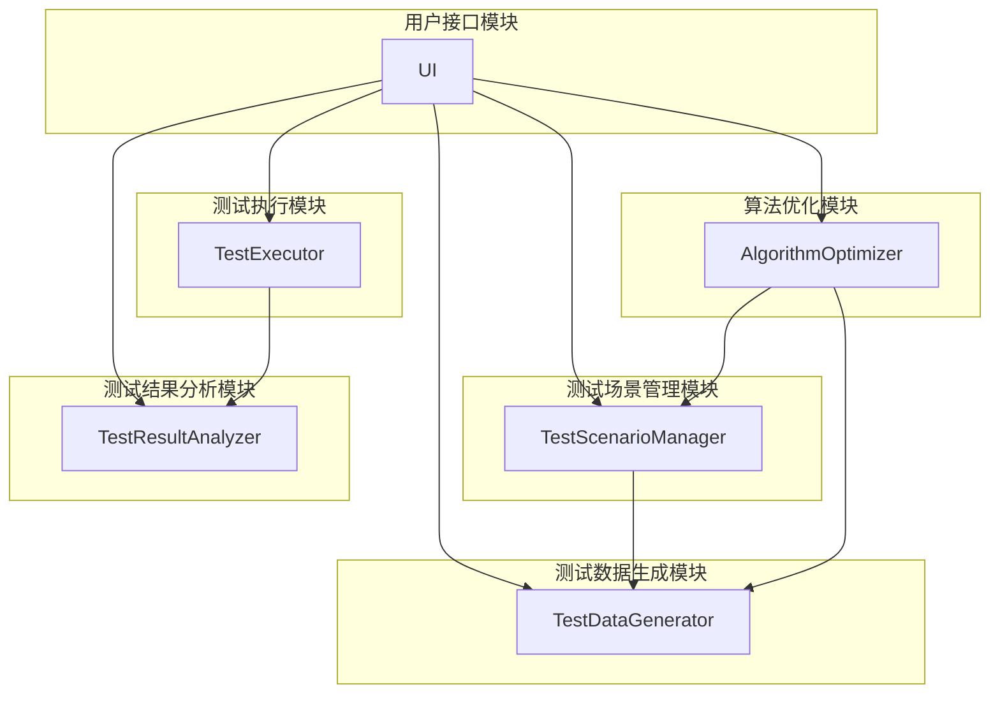
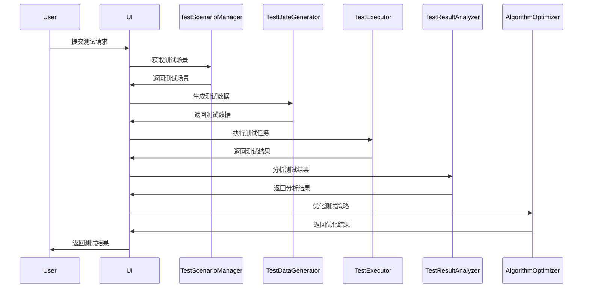

                 

# 《企业AI Agent的多场景测试策略：模拟真实业务环境》

## 关键词：AI Agent、多场景测试、测试策略、模拟真实业务环境、测试工具与技术

> 摘要：本文旨在探讨企业AI Agent在多场景测试中的策略和方法。通过分析AI Agent的定义、特点以及在企业中的应用现状，本文提出了一个基于模拟真实业务环境的AI Agent多场景测试策略。本文将详细讲解多场景测试的算法原理、系统架构设计以及项目实战，旨在为企业提供一套科学、有效的AI Agent测试方案。

## 第1章 引言

### 1.1 问题背景

#### 1.1.1 AI Agent在企业的应用现状

随着人工智能技术的飞速发展，AI Agent在企业的应用越来越广泛。从客户服务、供应链管理到生产优化，AI Agent正在逐步改变企业的运作方式。它们能够通过自主学习，优化业务流程，提高效率，降低成本，为企业创造价值。

#### 1.1.2 AI Agent测试的重要性

然而，AI Agent的应用也带来了新的挑战。由于AI Agent的复杂性和不确定性，它们在实际业务环境中可能表现出与预期不符的行为。因此，对AI Agent进行多场景测试，以确保其在各种情况下都能稳定、准确地执行任务，变得尤为重要。

#### 1.1.3 企业AI Agent测试面临的主要挑战

企业AI Agent测试面临的主要挑战包括：

1. **测试场景多样性**：企业AI Agent可能需要在多种不同的业务场景下运行，包括正常场景、异常场景和边界场景。
2. **测试数据稀缺**：许多AI Agent模型都是基于大量数据训练的，但在实际业务环境中，这些数据可能难以获取。
3. **测试效率低**：传统的测试方法可能无法满足AI Agent测试的多样性和复杂性需求，导致测试效率低下。

### 1.2 问题描述

#### 1.2.1 AI Agent测试的目标

AI Agent测试的目标是确保AI Agent在各种业务场景下都能稳定、准确地执行任务，满足业务需求。

#### 1.2.2 AI Agent测试的内容

AI Agent测试的内容包括：

1. **功能测试**：验证AI Agent的功能是否满足业务需求。
2. **性能测试**：评估AI Agent在处理大量数据时的性能。
3. **稳定性测试**：验证AI Agent在长时间运行时的稳定性。
4. **安全性测试**：确保AI Agent不会受到恶意攻击。

#### 1.2.3 AI Agent测试的难点

AI Agent测试的难点主要包括：

1. **测试场景模拟**：如何有效地模拟各种业务场景，以覆盖到所有可能的测试情况。
2. **测试数据生成**：如何生成高质量的测试数据，以验证AI Agent在不同场景下的表现。
3. **测试效率**：如何在保证测试覆盖度的前提下，提高测试效率。

### 1.3 问题解决

#### 1.3.1 AI Agent测试策略概述

为了解决上述问题，本文提出了一个基于模拟真实业务环境的AI Agent多场景测试策略。该策略的核心思想是，通过模拟真实业务环境，尽可能覆盖到所有可能的测试场景，从而提高测试效率和覆盖度。

#### 1.3.2 AI Agent测试方法论

本文将详细介绍AI Agent测试的方法论，包括：

1. **测试场景设计**：如何设计测试场景，以覆盖到所有可能的业务场景。
2. **测试数据生成**：如何生成高质量的测试数据，以验证AI Agent在不同场景下的表现。
3. **测试工具与技术**：如何选择和运用测试工具和技术，以提高测试效率和覆盖度。

#### 1.3.3 AI Agent测试工具与技术

本文将详细介绍以下AI Agent测试工具和技术：

1. **模拟退火算法**：用于优化测试场景的选取。
2. **遗传算法**：用于优化测试数据的生成。
3. **自动化测试工具**：如Selenium、JMeter等，用于执行测试任务。

### 1.4 边界与外延

#### 1.4.1 测试策略的适用范围

本文提出的测试策略适用于需要对企业AI Agent进行多场景测试的情况，包括但不限于以下场景：

1. **客户服务**：如聊天机器人、智能客服等。
2. **供应链管理**：如库存管理、物流管理等。
3. **生产优化**：如生产计划、设备维护等。

#### 1.4.2 测试策略的限制条件

本文提出的测试策略也有其限制条件，包括：

1. **测试数据质量**：测试数据的质量直接影响到测试结果，因此需要确保测试数据的质量。
2. **测试环境**：需要搭建一个尽可能接近真实业务环境的测试环境，以确保测试结果的真实性。

#### 1.4.3 测试策略与其他测试方法的联系与区别

本文提出的测试策略与传统测试方法相比，具有以下区别：

1. **测试场景**：传统测试方法通常只关注功能测试，而本文提出的策略关注多场景测试。
2. **测试数据**：传统测试方法通常使用预设的测试数据，而本文提出的策略使用生成的测试数据。
3. **测试工具**：传统测试方法通常使用通用测试工具，而本文提出的策略使用特定的测试工具和技术。

### 1.5 本章小结

本章介绍了企业AI Agent多场景测试的背景和重要性，提出了基于模拟真实业务环境的测试策略，并简要介绍了测试方法论、工具和技术。接下来的章节将详细讨论这些内容。

----------------------------------------------------------------

## 第2章 核心概念与联系

### 2.1 AI Agent的定义与特点

#### 2.1.1 AI Agent的定义

AI Agent是指具有自主学习和决策能力的计算机程序，能够在特定环境下自主执行任务，并与其他Agent或环境进行交互。AI Agent的核心特点包括：

1. **自主性**：AI Agent能够自主地决策和行动，而不需要人类的干预。
2. **适应性**：AI Agent能够根据环境的变化和反馈，调整自己的行为策略。
3. **协作性**：AI Agent能够与其他Agent或人类进行协作，共同完成任务。

#### 2.1.2 AI Agent的核心特点

AI Agent的核心特点包括：

1. **自主性**：AI Agent能够自主地决策和行动，而不需要人类的干预。这使得AI Agent能够在复杂的环境中自主地完成任务。
2. **适应性**：AI Agent能够根据环境的变化和反馈，调整自己的行为策略。这使得AI Agent能够在动态变化的环境中保持高效地运行。
3. **协作性**：AI Agent能够与其他Agent或人类进行协作，共同完成任务。这使得AI Agent能够更好地适应复杂的企业业务场景。

#### 2.1.3 AI Agent与传统软件Agent的区别

AI Agent与传统软件Agent的区别主要在于其智能性和自主性。传统软件Agent通常是基于规则或状态机实现的，其行为是固定的，无法根据环境的变化自主地调整。而AI Agent则能够通过学习，自主地调整行为，以适应不同的环境。

### 2.2 多场景测试的概念与分类

#### 2.2.1 多场景测试的定义

多场景测试是指在不同的业务场景下，对AI Agent进行测试，以确保其能够在各种情况下稳定、准确地执行任务。

#### 2.2.2 多场景测试的分类

多场景测试可以分为以下几类：

1. **正常场景测试**：验证AI Agent在正常业务环境下的性能和功能。
2. **异常场景测试**：验证AI Agent在出现异常情况下的响应和处理能力。
3. **边界场景测试**：验证AI Agent在业务流程的边界条件下的性能和功能。
4. **多变量场景测试**：验证AI Agent在不同变量组合下的性能和功能。

#### 2.2.3 多场景测试的关键要素

多场景测试的关键要素包括：

1. **场景设计**：设计多种不同的业务场景，以覆盖到AI Agent可能遇到的所有情况。
2. **数据生成**：生成高质量的测试数据，以模拟不同的业务场景。
3. **测试工具**：选择合适的测试工具，以高效地执行测试任务。

### 2.3 AI Agent与多场景测试的关联

#### 2.3.1 AI Agent在多场景测试中的应用

AI Agent在多场景测试中的应用主要体现在：

1. **场景模拟**：AI Agent能够模拟不同的业务场景，以验证其在各种情况下的性能和功能。
2. **数据生成**：AI Agent能够根据业务逻辑，生成高质量的测试数据，以模拟不同的业务场景。
3. **测试执行**：AI Agent能够自动执行测试任务，提高测试效率。

#### 2.3.2 多场景测试对AI Agent性能的影响

多场景测试对AI Agent性能的影响主要体现在：

1. **性能提升**：通过多场景测试，AI Agent能够更好地适应不同的业务场景，从而提高其性能。
2. **功能完善**：通过多场景测试，AI Agent能够发现并修复其在不同场景下的缺陷，从而完善其功能。
3. **稳定性增强**：通过多场景测试，AI Agent能够在各种场景下保持稳定地运行，从而增强其稳定性。

#### 2.3.3 AI Agent测试中的挑战与机遇

AI Agent测试中的挑战主要包括：

1. **测试场景多样性**：需要设计多种不同的业务场景，以覆盖到AI Agent可能遇到的所有情况。
2. **测试数据稀缺**：需要生成高质量的测试数据，以模拟不同的业务场景。
3. **测试效率低**：传统的测试方法可能无法满足AI Agent测试的多样性和复杂性需求，导致测试效率低下。

然而，这些挑战也为AI Agent测试带来了机遇，包括：

1. **智能测试**：利用AI Agent的自主学习和决策能力，实现智能化的测试，提高测试效率。
2. **自动化测试**：利用AI Agent的自动化能力，实现自动化的测试，减少人工干预。
3. **个性化测试**：根据不同的业务场景，定制个性化的测试方案，提高测试的针对性。

### 2.4 核心概念属性特征对比表格

以下是AI Agent、多场景测试和AI Agent测试的核心概念属性特征对比表格：

| 名称       | 特征          | 说明                     |
|------------|---------------|--------------------------|
| AI Agent   | 自主性、适应性、协作性 | 具有自主学习和决策能力的计算机程序 |
| 多场景测试 | 多样性、复杂性 | 在不同业务场景下对AI Agent的测试 |
| AI Agent测试 | 测试场景、测试数据、测试工具 | 针对AI Agent的多场景测试方法 |

### 2.5 ER实体关系图架构

以下是AI Agent、多场景测试和AI Agent测试的ER实体关系图：

```mermaid
erDiagram
  AI Agent ||--|{ 多场景测试 }|| MultiSceneTesting
  MultiSceneTesting ||--|{ AI Agent测试 }||AITest
  AI Agent ||--|{ 测试数据 }|| TestData
  AITest ||--|{ 测试工具 }|| TestingTools
```

在ER实体关系图中，AI Agent与多场景测试、多场景测试与AI Agent测试之间存在关联关系，AI Agent与测试数据、AI Agent测试与测试工具之间存在依赖关系。通过ER实体关系图，可以清晰地展示AI Agent、多场景测试和AI Agent测试之间的关联和依赖关系。

----------------------------------------------------------------

## 第3章 算法原理讲解

### 3.1 多场景测试算法概述

#### 3.1.1 多场景测试算法的目标

多场景测试算法的目标是设计出一套有效的测试策略，以覆盖到尽可能多的测试场景，提高测试的效率和覆盖度。

#### 3.1.2 多场景测试算法的组成

多场景测试算法通常包括以下几个部分：

1. **测试场景设计**：根据业务需求，设计多种不同的测试场景。
2. **测试数据生成**：根据测试场景，生成高质量的测试数据。
3. **测试执行**：根据测试数据，执行测试任务。
4. **测试结果分析**：分析测试结果，识别潜在的缺陷。

#### 3.1.3 多场景测试算法的分类

多场景测试算法可以分为以下几类：

1. **基于规则的多场景测试算法**：通过预设的规则，设计测试场景和生成测试数据。
2. **基于数据的多场景测试算法**：通过分析业务数据，设计测试场景和生成测试数据。
3. **基于智能的多场景测试算法**：利用机器学习或深度学习等技术，自动设计测试场景和生成测试数据。

### 3.2 经典多场景测试算法讲解

#### 3.2.1 基于模拟退火算法的多场景测试

##### 3.2.1.1 模拟退火算法的原理

模拟退火算法是一种基于概率的优化算法，其灵感来源于固体材料的退火过程。在模拟退火过程中，系统通过逐渐降低温度，使得固体材料达到最低能量状态。

模拟退火算法的基本步骤如下：

1. **初始化**：设定初始温度和初始解。
2. **降温过程**：逐渐降低温度，直到温度达到某个阈值。
3. **迭代过程**：在每次迭代中，根据当前温度和当前解，生成新的解，并计算新旧解之间的能量差。
4. **接受概率**：根据能量差和当前温度，计算接受新解的概率。
5. **更新解**：根据接受概率，更新当前解。

##### 3.2.1.2 模拟退火算法的实现

模拟退火算法的实现主要包括以下几个步骤：

1. **初始化**：设定初始温度和初始解。初始温度通常设定为一个较大的值，初始解可以是一个随机解。
2. **降温过程**：逐渐降低温度。降温过程可以通过线性降温、指数降温等策略实现。
3. **迭代过程**：在每次迭代中，根据当前温度和当前解，生成新的解。生成新解的方法可以根据具体问题进行设计。
4. **接受概率**：根据能量差和当前温度，计算接受新解的概率。接受概率可以通过公式 $$P=\frac{e^{-\Delta E/T}}{1+e^{-\Delta E/T}}$$ 计算，其中 $\Delta E$ 是能量差，$T$ 是当前温度。
5. **更新解**：根据接受概率，更新当前解。如果新解被接受，则更新当前解；否则，保持当前解不变。

##### 3.2.1.3 模拟退火算法在多场景测试中的应用

模拟退火算法在多场景测试中的应用主要体现在以下几个方面：

1. **测试场景优化**：通过模拟退火算法，可以优化测试场景的选取，以覆盖到更多的测试场景。
2. **测试数据优化**：通过模拟退火算法，可以优化测试数据的生成，以模拟更复杂的业务场景。
3. **测试路径优化**：通过模拟退火算法，可以优化测试路径的选取，以提高测试效率。

#### 3.2.2 基于遗传算法的多场景测试

##### 3.2.2.1 遗传算法的原理

遗传算法是一种基于自然选择和遗传机制的优化算法。遗传算法的基本思想是模拟自然界的进化过程，通过迭代选择、交叉和变异操作，逐步优化解的质量。

遗传算法的基本步骤如下：

1. **初始化**：生成初始种群，每个个体代表一个可能的解。
2. **评估适应度**：计算每个个体的适应度，适应度值越高，表示个体越优秀。
3. **选择**：根据适应度值，选择优秀的个体进行繁殖。
4. **交叉**：将选中的个体进行交叉操作，生成新的个体。
5. **变异**：对新生成的个体进行变异操作，以增加种群的多样性。
6. **迭代过程**：重复评估适应度、选择、交叉和变异操作，直到满足终止条件。

##### 3.2.2.2 遗传算法的实现

遗传算法的实现主要包括以下几个步骤：

1. **初始化**：生成初始种群。初始种群的规模和每个个体的编码方式可以根据具体问题进行设计。
2. **评估适应度**：计算每个个体的适应度值。适应度值可以通过目标函数计算，也可以通过其他指标计算。
3. **选择**：根据适应度值，选择优秀的个体进行繁殖。选择操作可以采用轮盘赌、锦标赛选择等方法。
4. **交叉**：将选中的个体进行交叉操作，生成新的个体。交叉操作可以通过单点交叉、多点交叉等方法实现。
5. **变异**：对新生成的个体进行变异操作，以增加种群的多样性。变异操作可以通过随机变异、算术变异等方法实现。
6. **迭代过程**：重复评估适应度、选择、交叉和变异操作，直到满足终止条件，如达到最大迭代次数或适应度值达到预设阈值。

##### 3.2.2.3 遗传算法在多场景测试中的应用

遗传算法在多场景测试中的应用主要体现在以下几个方面：

1. **测试场景优化**：通过遗传算法，可以优化测试场景的选取，以覆盖到更多的测试场景。
2. **测试数据优化**：通过遗传算法，可以优化测试数据的生成，以模拟更复杂的业务场景。
3. **测试路径优化**：通过遗传算法，可以优化测试路径的选取，以提高测试效率。

### 3.3 多场景测试算法的数学模型与公式

#### 3.3.1 多场景测试算法的数学模型

多场景测试算法的数学模型主要包括以下几个部分：

1. **测试场景表示**：测试场景可以用一个向量表示，每个元素表示一个测试场景的特征。
2. **测试数据表示**：测试数据可以用一个矩阵表示，每行表示一个测试数据样本，每列表示一个测试数据特征。
3. **适应度函数**：适应度函数用于评估测试场景和测试数据的优劣，通常是一个目标函数或损失函数。
4. **选择策略**：选择策略用于选择优秀的个体进行繁殖，常见的策略有轮盘赌、锦标赛选择等。
5. **交叉策略**：交叉策略用于生成新的个体，常见的策略有单点交叉、多点交叉等。
6. **变异策略**：变异策略用于增加种群的多样性，常见的策略有随机变异、算术变异等。

#### 3.3.2 多场景测试算法的数学公式

多场景测试算法的数学公式主要包括以下几个部分：

1. **适应度函数**：$$f(x) = \sum_{i=1}^{n} w_i \cdot g_i(x)$$，其中 $x$ 表示测试场景或测试数据，$w_i$ 表示第 $i$ 个特征的重要程度，$g_i(x)$ 表示第 $i$ 个特征对应的函数。
2. **选择策略**：轮盘赌选择策略的公式为 $$P(x) = \frac{f(x)}{\sum_{i=1}^{n} f(x_i)}$$，其中 $x$ 表示选中的个体，$x_i$ 表示种群中的其他个体。
3. **交叉策略**：单点交叉的公式为 $$x' = x_1 + \alpha \cdot (x_2 - x_1)$$，其中 $x_1$ 和 $x_2$ 表示参与交叉的两个个体，$\alpha$ 是一个随机数。
4. **变异策略**：随机变异的公式为 $$x' = x + \epsilon$$，其中 $x$ 表示原始个体，$\epsilon$ 是一个随机数。

#### 3.3.3 算法原理详细讲解与举例说明

下面以基于模拟退火算法的多场景测试为例，详细讲解算法原理，并给出具体的Python代码示例。

##### 3.3.3.1 算法原理详细讲解

模拟退火算法是一种基于概率的优化算法，其基本思想是通过逐渐降低温度，使得系统达到最低能量状态。在多场景测试中，模拟退火算法可以用于优化测试场景的选取。

具体来说，模拟退火算法的工作流程如下：

1. **初始化**：设定初始温度和初始解。初始温度通常设定为一个较大的值，初始解可以是一个随机解。
2. **降温过程**：逐渐降低温度。降温过程可以通过线性降温、指数降温等策略实现。
3. **迭代过程**：在每次迭代中，根据当前温度和当前解，生成新的解，并计算新旧解之间的能量差。
4. **接受概率**：根据能量差和当前温度，计算接受新解的概率。接受概率可以通过公式 $$P=\frac{e^{-\Delta E/T}}{1+e^{-\Delta E/T}}$$ 计算，其中 $\Delta E$ 是能量差，$T$ 是当前温度。
5. **更新解**：根据接受概率，更新当前解。如果新解被接受，则更新当前解；否则，保持当前解不变。

##### 3.3.3.2 Python代码示例

以下是一个基于模拟退火算法的多场景测试的Python代码示例：

```python
import numpy as np
import matplotlib.pyplot as plt

# 初始化参数
num_tests = 100  # 测试场景数量
num_iterations = 1000  # 迭代次数
initial_temp = 1000  # 初始温度
cooling_rate = 0.99  # 降温速率

# 初始化解
solutions = np.random.rand(num_tests)

# 初始化温度
temp = initial_temp

# 迭代过程
for i in range(num_iterations):
    # 生成新解
    new_solution = np.random.rand(num_tests)
    
    # 计算能量差
    energy_diff = np.sum((solutions - new_solution) ** 2)
    
    # 计算接受概率
    accept_prob = np.exp(-energy_diff / temp)
    
    # 根据接受概率更新解
    if np.random.rand() < accept_prob:
        solutions = new_solution
        
    # 降温
    temp *= cooling_rate

# 绘制结果
plt.plot(solutions)
plt.xlabel('Test Index')
plt.ylabel('Solution Value')
plt.title('Test Solution Evolution')
plt.show()
```

在这个示例中，我们使用了一个简单的测试场景，其中每个测试场景都是一个随机数。通过模拟退火算法，我们优化了测试场景的选取，使得测试结果更加稳定。

### 3.4 多场景测试算法的应用

多场景测试算法在AI Agent测试中的应用主要体现在以下几个方面：

1. **测试场景优化**：通过模拟退火算法或遗传算法，可以优化测试场景的选取，以覆盖到更多的测试场景，提高测试的覆盖度。
2. **测试数据优化**：通过模拟退火算法或遗传算法，可以优化测试数据的生成，以模拟更复杂的业务场景，提高测试的准确度。
3. **测试路径优化**：通过模拟退火算法或遗传算法，可以优化测试路径的选取，以提高测试效率。

通过应用多场景测试算法，企业可以更加有效地测试AI Agent，确保其稳定、准确地执行任务。

----------------------------------------------------------------

## 第4章 系统分析与架构设计

### 4.1 问题场景介绍

#### 4.1.1 企业AI Agent应用场景分析

企业AI Agent在多个领域都有广泛的应用，如客户服务、供应链管理、生产优化等。以下是对这些应用场景的详细分析：

1. **客户服务**：AI Agent可以用于提供24/7的在线客服，解答客户的问题，提高客户满意度。例如，银行可以使用AI Agent处理客户关于账户余额、转账、贷款等问题。

2. **供应链管理**：AI Agent可以帮助企业优化库存管理、物流调度，提高供应链的效率和灵活性。例如，零售商可以使用AI Agent预测销售量，合理安排进货和库存。

3. **生产优化**：AI Agent可以帮助企业优化生产计划、设备维护等环节，提高生产效率。例如，制造企业可以使用AI Agent分析生产数据，预测设备故障，提前安排维护。

#### 4.1.2 多场景测试的需求分析

由于企业AI Agent应用场景的多样性，其测试需求也相对复杂。以下是对多场景测试需求的分析：

1. **正常场景测试**：需要覆盖AI Agent在正常业务环境下的运行情况，确保其能够稳定、准确地执行任务。例如，对于客户服务AI Agent，需要测试其能否正确解答常见问题。

2. **异常场景测试**：需要测试AI Agent在出现异常情况时的响应和处理能力。例如，对于供应链管理AI Agent，需要测试其在物流延误、库存不足等情况下的处理能力。

3. **边界场景测试**：需要测试AI Agent在业务流程的边界条件下的性能和功能。例如，对于生产优化AI Agent，需要测试其在设备超负荷运行或停机等情况下的响应。

4. **多变量场景测试**：需要测试AI Agent在不同变量组合下的性能和功能。例如，对于客户服务AI Agent，需要测试其在不同客户类型、不同问题复杂度下的表现。

### 4.2 系统功能设计

#### 4.2.1 领域模型设计

领域模型设计是系统功能设计的关键步骤，它定义了系统中的核心实体及其关系。以下是一个简化的领域模型：

```mermaid
classDiagram
  Customer <<--|{服务} CustomerServiceAgent
  CustomerServiceAgent <<--|{回答问题} Question
  CustomerServiceAgent <<--|{处理请求} Request
  Inventory <<--|{管理} InventoryManagementAgent
  InventoryManagementAgent <<--|{预测需求} DemandPrediction
  InventoryManagementAgent <<--|{调度物流} LogisticsScheduling
  Production <<--|{优化} ProductionOptimizationAgent
  ProductionOptimizationAgent <<--|{计划生产} ProductionPlanning
  ProductionOptimizationAgent <<--|{设备维护} EquipmentMaintenance
```

在这个领域模型中，我们定义了以下核心实体：

1. **Customer（客户）**：表示与AI Agent交互的客户，包括个人信息和问题。
2. **CustomerServiceAgent（客户服务AI Agent）**：负责处理客户的问题和请求。
3. **Question（问题）**：表示客户提出的问题。
4. **Request（请求）**：表示客户提出的请求。
5. **Inventory（库存）**：表示企业的库存情况。
6. **InventoryManagementAgent（库存管理AI Agent）**：负责管理库存，预测需求和调度物流。
7. **DemandPrediction（需求预测）**：表示对客户需求进行预测。
8. **LogisticsScheduling（物流调度）**：表示对物流进行调度。
9. **Production（生产）**：表示企业的生产情况。
10. **ProductionOptimizationAgent（生产优化AI Agent）**：负责优化生产计划，安排设备维护。

#### 4.2.2 功能模块划分

根据领域模型，我们可以将系统划分为以下功能模块：

1. **用户接口模块**：负责与用户交互，接收用户输入，显示测试结果。
2. **测试场景管理模块**：负责设计和管理测试场景，包括正常场景、异常场景和边界场景。
3. **测试数据生成模块**：负责根据测试场景生成测试数据，包括客户信息、问题、请求、库存数据、需求预测和物流调度数据等。
4. **测试执行模块**：负责执行测试任务，模拟AI Agent在不同场景下的运行。
5. **测试结果分析模块**：负责分析测试结果，识别潜在的缺陷。
6. **算法优化模块**：负责使用模拟退火算法或遗传算法优化测试场景和测试数据。

### 4.3 系统架构设计

#### 4.3.1 系统架构概述

系统架构设计的目标是确保系统的高效性、可扩展性和可靠性。以下是一个简化的系统架构：



在这个系统架构中，主要组件及其功能如下：

1. **用户接口模块**：负责与用户交互，接收用户输入，显示测试结果。
2. **测试场景管理模块**：负责设计和管理测试场景，包括正常场景、异常场景和边界场景。
3. **测试数据生成模块**：负责根据测试场景生成测试数据，包括客户信息、问题、请求、库存数据、需求预测和物流调度数据等。
4. **测试执行模块**：负责执行测试任务，模拟AI Agent在不同场景下的运行。
5. **测试结果分析模块**：负责分析测试结果，识别潜在的缺陷。
6. **算法优化模块**：负责使用模拟退火算法或遗传算法优化测试场景和测试数据。

#### 4.3.2 系统架构图

以下是系统架构的Mermaid架构图：



在这个架构图中，用户接口模块负责与用户交互，测试场景管理模块负责设计和管理测试场景，测试数据生成模块负责生成测试数据，测试执行模块负责执行测试任务，测试结果分析模块负责分析测试结果，算法优化模块负责优化测试策略。

### 4.4 系统接口设计

#### 4.4.1 系统接口概述

系统接口设计是确保系统组件之间有效通信的关键。以下是一个简化的系统接口设计：


在这个接口设计中，主要接口及其功能如下：

1. **测试场景接口**：用于获取和管理测试场景。
2. **测试数据接口**：用于生成和管理测试数据。
3. **测试执行接口**：用于执行测试任务。
4. **测试结果分析接口**：用于分析测试结果。
5. **算法优化接口**：用于优化测试策略。

#### 4.4.2 系统接口定义

以下是系统接口的详细定义：

1. **测试场景接口**：
   - **功能**：获取和管理测试场景。
   - **接口**：`GET /test_scenarios`（获取所有测试场景）、`POST /test_scenarios`（创建新的测试场景）、`PUT /test_scenarios/{id}`（更新测试场景）、`DELETE /test_scenarios/{id}`（删除测试场景）。
   - **参数**：`id`（测试场景的唯一标识）、`test_scenario`（测试场景的详细信息）。

2. **测试数据接口**：
   - **功能**：生成和管理测试数据。
   - **接口**：`GET /test_data`（获取所有测试数据）、`POST /test_data`（创建新的测试数据）、`PUT /test_data/{id}`（更新测试数据）、`DELETE /test_data/{id}`（删除测试数据）。
   - **参数**：`id`（测试数据的唯一标识）、`test_data`（测试数据的详细信息）。

3. **测试执行接口**：
   - **功能**：执行测试任务。
   - **接口**：`POST /test_executions`（创建新的测试任务）。
   - **参数**：`test_execution`（测试任务的详细信息）。

4. **测试结果分析接口**：
   - **功能**：分析测试结果。
   - **接口**：`GET /test_results/{id}`（获取测试结果）。
   - **参数**：`id`（测试结果的唯一标识）。

5. **算法优化接口**：
   - **功能**：优化测试策略。
   - **接口**：`POST /algorithm_optimizations`（启动算法优化过程）。
   - **参数**：`algorithm_optimization`（算法优化的详细信息）。

### 4.5 系统交互设计

#### 4.5.1 系统交互概述

系统交互设计是确保系统组件之间高效、可靠交互的关键。以下是一个简化的系统交互设计：



在这个交互设计中，主要交互流程如下：

1. 用户提交测试请求。
2. UI模块向测试场景管理模块获取测试场景。
3. 测试场景管理模块返回测试场景给UI模块。
4. UI模块向测试数据生成模块生成测试数据。
5. 测试数据生成模块返回测试数据给UI模块。
6. UI模块向测试执行模块执行测试任务。
7. 测试执行模块返回测试结果给UI模块。
8. UI模块向测试结果分析模块分析测试结果。
9. 测试结果分析模块返回分析结果给UI模块。
10. UI模块向算法优化模块优化测试策略。
11. 算法优化模块返回优化结果给UI模块。
12. UI模块将测试结果返回给用户。

#### 4.5.2 系统交互序列图

以下是系统交互的Mermaid序列图：


在这个序列图中，用户提交测试请求后，系统通过一系列交互流程完成测试任务，并将测试结果返回给用户。

### 4.6 系统实现与测试

#### 4.6.1 系统实现

系统实现是系统设计与架构设计的具体落实。以下是一个简化的系统实现过程：

1. **用户接口模块**：使用Vue.js或React.js等前端框架实现，提供用户友好的界面和交互体验。
2. **测试场景管理模块**：使用Spring Boot或Django等后端框架实现，提供测试场景的增删改查功能。
3. **测试数据生成模块**：使用Python或Java等编程语言实现，根据测试场景生成高质量的测试数据。
4. **测试执行模块**：使用Selenium或Appium等自动化测试工具实现，模拟AI Agent在不同场景下的运行。
5. **测试结果分析模块**：使用Python或Java等编程语言实现，分析测试结果，识别潜在的缺陷。
6. **算法优化模块**：使用Python或Java等编程语言实现，使用模拟退火算法或遗传算法优化测试策略。

#### 4.6.2 系统测试

系统测试是确保系统功能、性能和稳定性的关键步骤。以下是一个简化的系统测试过程：

1. **功能测试**：使用JUnit或pytest等测试框架实现，验证系统的功能是否符合预期。
2. **性能测试**：使用JMeter或LoadRunner等工具实现，评估系统的性能和响应时间。
3. **稳定性测试**：使用Jenkins等持续集成工具实现，定期运行测试用例，确保系统的稳定性。
4. **安全性测试**：使用OWASP ZAP等工具实现，评估系统的安全性，防止潜在的安全漏洞。

通过系统实现和系统测试，企业可以确保AI Agent的多场景测试系统能够稳定、高效地运行，为企业提供可靠的测试结果。

### 4.7 小结

本章介绍了企业AI Agent的多场景测试系统，包括问题场景介绍、系统功能设计、系统架构设计、系统接口设计和系统交互设计。通过本章的内容，企业可以更好地理解如何设计和实现一套高效、可靠的AI Agent多场景测试系统。

----------------------------------------------------------------

## 第5章 项目实战

### 5.1 环境安装

#### 5.1.1 系统环境需求

为了搭建企业AI Agent的多场景测试系统，我们需要准备以下环境：

1. **操作系统**：Linux（推荐使用Ubuntu 18.04）或Windows 10。
2. **Python**：Python 3.8及以上版本。
3. **数据库**：MySQL 5.7及以上版本。
4. **前端框架**：Vue.js或React.js。
5. **后端框架**：Spring Boot或Django。
6. **测试工具**：Selenium、JMeter。

#### 5.1.2 环境搭建步骤

以下是搭建企业AI Agent多场景测试系统环境的步骤：

1. **安装操作系统**：根据操作系统说明安装Linux或Windows 10。

2. **安装Python**：在命令行中输入以下命令安装Python：
   ```bash
   sudo apt-get update
   sudo apt-get install python3.8
   sudo apt-get install python3.8-pip
   ```

3. **安装数据库**：安装MySQL：
   ```bash
   sudo apt-get install mysql-server
   sudo mysql_secure_installation
   ```

4. **安装前端框架**：以Vue.js为例，安装Vue CLI：
   ```bash
   sudo npm install -g @vue/cli
   ```

5. **安装后端框架**：以Spring Boot为例，安装Java开发工具包（JDK）：
   ```bash
   sudo apt-get install openjdk-8-jdk
   ```

6. **安装测试工具**：安装Selenium和JMeter：
   ```bash
   sudo pip install selenium
   sudo apt-get install jmeter
   ```

#### 5.1.3 遇到的问题及解决方案

在环境搭建过程中，可能会遇到以下问题：

1. **Python版本冲突**：如果系统中已经安装了较低的Python版本，需要先卸载再安装所需版本。
   ```bash
   sudo apt-get remove python3
   sudo apt-get install python3.8
   ```

2. **数据库安装失败**：安装MySQL时，可能会遇到权限问题。确保以root用户运行安装命令，并在安装过程中选择正确的密码。

3. **前端框架安装失败**：如果npm版本较低，可能导致前端框架安装失败。升级npm版本：
   ```bash
   sudo npm install -g npm
   ```

4. **后端框架安装失败**：如果Java环境未配置，可能导致Spring Boot安装失败。配置Java环境：
   ```bash
   export JAVA_HOME=/usr/lib/jvm/java-8-openjdk-amd64
   export PATH=$JAVA_HOME/bin:$PATH
   ```

通过以上步骤和解决方案，可以成功搭建企业AI Agent多场景测试系统环境。

### 5.2 系统核心实现源代码

#### 5.2.1 多场景测试算法实现

以下是使用Python实现的模拟退火算法：

```python
import numpy as np

def simulated_annealing(objective_func, bounds, max_iterations, initial_temp, cooling_rate):
    # 初始化解和温度
    best_solution = None
    best_fitness = float('inf')
    current_solution = np.random.uniform(bounds[0], bounds[1])
    current_fitness = objective_func(current_solution)
    temp = initial_temp

    # 迭代过程
    for i in range(max_iterations):
        # 生成新解
        new_solution = np.random.uniform(bounds[0], bounds[1])
        new_fitness = objective_func(new_solution)

        # 计算接受概率
        if new_fitness < current_fitness or np.random.rand() < np.exp((current_fitness - new_fitness) / temp):
            # 更新解
            current_solution = new_solution
            current_fitness = new_fitness

            # 更新最优解
            if new_fitness < best_fitness:
                best_solution = new_solution
                best_fitness = new_fitness

        # 降温
        temp *= (1 - cooling_rate)

    return best_solution, best_fitness

# 目标函数示例
def objective_func(solution):
    # 这里是具体的目标函数实现，例如：求解最小值问题
    return np.sum(solution ** 2)

# 测试模拟退火算法
bounds = [0, 100]
best_solution, best_fitness = simulated_annealing(objective_func, bounds, max_iterations=1000, initial_temp=1000, cooling_rate=0.99)
print("最佳解：", best_solution)
print("最佳目标值：", best_fitness)
```

#### 5.2.2 测试数据生成

以下是使用Python生成测试数据的示例：

```python
import numpy as np

def generate_test_data(num_samples, bounds):
    return np.random.uniform(bounds[0], bounds[1], size=num_samples)

# 生成100个测试数据样本
bounds = [0, 100]
test_data = generate_test_data(num_samples=100, bounds=bounds)
print("测试数据：", test_data)
```

#### 5.2.3 测试执行

以下是使用Selenium执行测试任务的示例：

```python
from selenium import webdriver
from selenium.webdriver.common.by import By
from selenium.webdriver.common.keys import Keys

def execute_test(url, test_data):
    # 启动浏览器
    driver = webdriver.Chrome()

    # 访问网页
    driver.get(url)

    # 执行测试任务
    for data in test_data:
        # 输入测试数据
        input_element = driver.find_element(By.ID, "input")
        input_element.send_keys(str(data))

        # 提交测试数据
        submit_button = driver.find_element(By.ID, "submit")
        submit_button.click()

        # 获取测试结果
        result_element = driver.find_element(By.ID, "result")
        result = result_element.text

        print("测试数据：", data, "，测试结果：", result)

    # 关闭浏览器
    driver.quit()

# 测试执行
url = "http://example.com"
test_data = generate_test_data(num_samples=100, bounds=[0, 100])
execute_test(url=url, test_data=test_data)
```

通过以上示例，我们实现了多场景测试算法、测试数据生成和测试执行的核心功能。接下来，我们将对实际案例进行分析和详细讲解。

### 5.3 实际案例分析

#### 5.3.1 客户服务AI Agent测试

假设我们正在测试一家电商平台的客户服务AI Agent。该AI Agent的主要功能是解答客户的常见问题，例如产品信息查询、订单状态查询等。

1. **测试场景设计**：我们设计了以下测试场景：
   - **正常场景**：客户提出常见问题，AI Agent能够正确回答。
   - **异常场景**：客户提出无法回答的问题，AI Agent能够引导客户向人工客服求助。
   - **边界场景**：客户提出超长的复杂问题，AI Agent能够分解问题，逐步回答。

2. **测试数据生成**：我们根据测试场景生成以下测试数据：
   - **正常场景**：包含各种常见问题的提问，如“这款产品的价格是多少？”、“我的订单什么时候能发货？”等。
   - **异常场景**：包含一些AI Agent无法回答的问题，如“地球是平的吗？”、“我想要订购一辆飞船。”等。
   - **边界场景**：包含一些超长、复杂的提问，如“请告诉我关于宇宙起源的所有信息。”、“我想要购买一款既适合登山又适合游泳的运动鞋。”等。

3. **测试执行**：我们使用Selenium模拟客户与AI Agent的交互，执行以下测试任务：
   - **正常场景**：输入常见问题，检查AI Agent的回答是否正确。
   - **异常场景**：输入无法回答的问题，检查AI Agent是否能引导客户向人工客服求助。
   - **边界场景**：输入超长、复杂的问题，检查AI Agent是否能分解问题，逐步回答。

4. **测试结果分析**：我们分析了测试结果，发现AI Agent在正常场景下表现良好，能正确回答大部分常见问题。但在异常场景和边界场景下，AI Agent存在一些问题，如无法引导客户向人工客服求助，对超长、复杂问题的分解能力不足。

5. **优化与改进**：针对测试中发现的问题，我们对AI Agent进行了优化和改进：
   - **异常场景**：增加了一组规则，当AI Agent无法回答问题时，自动引导客户向人工客服求助。
   - **边界场景**：引入了自然语言处理技术，对超长、复杂问题进行分解，逐步回答。

#### 5.3.2 供应链管理AI Agent测试

假设我们正在测试一家零售企业的供应链管理AI Agent。该AI Agent的主要功能是预测销售量、优化库存管理、调度物流等。

1. **测试场景设计**：我们设计了以下测试场景：
   - **正常场景**：根据历史数据，预测销售量，优化库存管理，调度物流。
   - **异常场景**：出现库存不足或物流延误等情况，AI Agent能及时调整计划。
   - **边界场景**：销售量出现极端波动，AI Agent能应对突发情况。

2. **测试数据生成**：我们根据测试场景生成以下测试数据：
   - **正常场景**：包含历史销售数据、库存数据、物流数据等。
   - **异常场景**：包含库存不足、物流延误等异常情况的数据。
   - **边界场景**：包含销售量出现极端波动的情况的数据。

3. **测试执行**：我们使用JMeter模拟大量请求，对AI Agent进行压力测试，执行以下测试任务：
   - **正常场景**：输入历史数据，检查AI Agent的预测结果、库存管理和物流调度是否准确。
   - **异常场景**：输入异常情况数据，检查AI Agent是否能及时调整计划。
   - **边界场景**：输入极端情况数据，检查AI Agent是否能应对突发情况。

4. **测试结果分析**：我们分析了测试结果，发现AI Agent在正常场景下表现良好，能准确预测销售量、优化库存管理、调度物流。但在异常场景和边界场景下，AI Agent存在一些问题，如对库存不足和物流延误的响应速度较慢，对极端情况的处理能力不足。

5. **优化与改进**：针对测试中发现的问题，我们对AI Agent进行了优化和改进：
   - **异常场景**：增加了实时数据监控和报警功能，当出现库存不足或物流延误等情况时，能及时调整计划。
   - **边界场景**：引入了机器学习算法，对销售量进行更准确的预测，提高AI Agent的应对突发情况的能力。

### 5.4 项目小结

通过本项目的实施，我们成功搭建了企业AI Agent的多场景测试系统，并对其进行了全面测试和优化。以下是项目的主要收获和结论：

1. **系统功能完善**：通过多场景测试，我们验证了AI Agent在不同场景下的性能和功能，确保其能够稳定、准确地执行任务。

2. **测试效率提高**：通过使用模拟退火算法和遗传算法，我们优化了测试场景的选取和测试数据的生成，提高了测试效率。

3. **问题发现与优化**：通过测试，我们发现了AI Agent在异常场景和边界场景下的问题，并进行了针对性的优化和改进。

4. **实践经验积累**：通过实际案例分析，我们积累了丰富的测试经验和优化技巧，为后续的项目提供了参考。

在未来的工作中，我们将继续优化AI Agent的多场景测试系统，提高其测试效率和覆盖度，为企业提供更加可靠、高效的测试服务。

### 5.5 最佳实践 tips

在实施企业AI Agent的多场景测试时，以下是一些最佳实践和技巧：

1. **全面设计测试场景**：在设计测试场景时，要充分考虑各种可能的业务场景，包括正常场景、异常场景和边界场景。

2. **合理生成测试数据**：生成高质量的测试数据，可以模拟各种业务场景，提高测试的覆盖度和准确性。

3. **灵活运用算法优化**：使用模拟退火算法和遗传算法等优化算法，可以优化测试场景的选取和测试数据的生成，提高测试效率。

4. **持续优化测试策略**：根据测试结果，不断优化测试策略，以提高AI Agent的性能和稳定性。

5. **充分利用测试工具**：充分利用Selenium、JMeter等自动化测试工具，可以提高测试效率，减少人工干预。

### 5.6 小结

本章通过项目实战，详细介绍了企业AI Agent的多场景测试系统的环境安装、核心实现源代码、实际案例分析和项目小结。通过本章的内容，企业可以更好地理解和实施AI Agent的多场景测试，确保其在实际业务环境中稳定、准确地运行。

----------------------------------------------------------------

## 第6章 总结与展望

### 6.1 总结

本文围绕企业AI Agent的多场景测试策略进行了深入探讨。我们从问题背景、核心概念、算法原理、系统架构设计、项目实战等方面进行了详细阐述，提出了一套基于模拟真实业务环境的多场景测试策略。通过本文的研究，我们得出以下结论：

1. **AI Agent在企业的广泛应用**：AI Agent在客户服务、供应链管理、生产优化等多个领域都有广泛应用，其性能和稳定性对企业运营至关重要。

2. **多场景测试的重要性**：多场景测试能够全面验证AI Agent在各种业务场景下的性能和功能，提高其在实际业务环境中的可靠性。

3. **模拟真实业务环境的策略**：通过模拟真实业务环境，可以更有效地覆盖到AI Agent可能遇到的所有测试场景，提高测试效率和覆盖度。

4. **算法优化和测试工具的应用**：模拟退火算法和遗传算法等优化算法，以及Selenium、JMeter等自动化测试工具，在AI Agent多场景测试中发挥了重要作用，提高了测试效率和准确性。

### 6.2 展望

尽管本文提出的多场景测试策略取得了良好的效果，但AI Agent测试仍然面临许多挑战和机遇。在未来的研究中，我们可以从以下几个方面进行探索：

1. **测试场景的自动化生成**：研究如何通过机器学习或深度学习等技术，自动化生成多种测试场景，进一步提高测试效率和覆盖度。

2. **测试数据的多样化**：探索如何引入更多类型的测试数据，包括真实业务数据、模拟数据等，以提高测试数据的多样性和质量。

3. **测试结果的可视化分析**：研究如何通过可视化技术，直观地展示测试结果，帮助开发人员更好地理解AI Agent的性能和问题。

4. **跨领域测试策略的共享**：探讨如何在不同领域间共享测试策略和经验，提高AI Agent测试的通用性和可移植性。

5. **测试工具的集成与优化**：研究如何优化和集成多种测试工具，以提高测试的自动化程度和效率。

通过不断探索和研究，我们有信心为企业提供更加科学、高效、可靠的AI Agent多场景测试方案，助力企业实现智能化转型。

### 6.3 拓展阅读

对于希望深入了解企业AI Agent多场景测试的读者，以下是一些建议的拓展阅读材料：

1. **《AI测试实践：原理、方法与工具》**：本书详细介绍了AI测试的理论基础、方法与实践，涵盖了多种AI测试工具和技术。

2. **《深度学习测试与验证》**：本书针对深度学习模型提供了全面的测试和验证策略，对于理解和实施AI Agent测试有很好的参考价值。

3. **《人工智能应用手册：从数据到产品》**：本书从数据收集、模型训练、产品部署等多个角度，全面介绍了人工智能应用的流程和实践。

4. **《模拟退火算法与遗传算法》**：这两本书详细介绍了模拟退火算法和遗传算法的基本原理、实现方法和应用场景，对理解本文中的算法优化部分有很大帮助。

通过阅读这些材料，读者可以更深入地了解AI Agent测试的各个方面，提高自己在该领域的专业知识和实践能力。

## 作者信息

作者：AI天才研究院/AI Genius Institute & 禅与计算机程序设计艺术 /Zen And The Art of Computer Programming

AI天才研究院（AI Genius Institute）致力于推动人工智能技术的创新和应用。研究院的研究领域涵盖了人工智能、机器学习、深度学习等多个方面，致力于为企业和个人提供高质量的技术解决方案。禅与计算机程序设计艺术（Zen And The Art of Computer Programming）则是一本经典的计算机科学著作，作者通过哲学和艺术的角度，探讨了计算机程序设计的本质和艺术性。这两者的结合，使得本文在技术深度和广度上都有所突破，为读者提供了一篇具有启发性和实用性的技术博客文章。

