                 

### 1.1 问题背景

随着互联网和大数据技术的迅猛发展，企业生成的数据量呈指数级增长。这些数据不仅包括传统的结构化数据，如数据库中的用户信息、销售记录等，还涵盖了海量的非结构化数据，如文本、图片、音频和视频等。在这样的背景下，企业对于数据处理与分析的需求愈发强烈。传统的方法往往难以应对如此海量且不断增长的数据，而实时数据处理与分析成为解决这一问题的有效手段。

实时数据流处理与分析是指对实时产生的大量数据流进行快速采集、传输、处理和分析，以实现数据的实时监控、预测和决策。这种架构能够帮助企业快速发现业务中的异常情况，优化运营策略，提高生产效率，甚至可以在金融、医疗等关键行业中预防危机，减少损失。

首先，实时数据流处理的重要性体现在以下几个方面：

- **实时性**：实时数据流处理能够快速响应数据，提供实时的分析结果，使企业能够及时做出反应。
- **准确性**：通过高效的算法和模型，实时数据流处理能够对海量数据进行精确的分析，减少错误率。
- **高效性**：采用分布式计算和并行处理技术，实时数据流处理能够在较短的时间内处理大量的数据，提高效率。
- **可扩展性**：实时数据流处理架构通常具备良好的扩展性，能够根据业务需求动态调整处理能力和资源分配。

然而，实时数据流处理与分析也面临一些挑战：

- **数据多样性**：数据类型和格式的多样性增加了处理的复杂性，需要设计灵活的处理机制。
- **数据质量**：实时数据流中可能存在噪声、错误和不完整的数据，需要有效的数据清洗和预处理方法。
- **计算资源**：实时数据流处理需要大量计算资源，如何高效利用现有资源是一个重要问题。
- **系统稳定性**：在处理海量数据的同时，系统需要保持高可用性和稳定性，避免数据丢失或处理错误。

因此，构建一个高效、稳定且具有扩展性的实时数据流处理与分析架构，成为企业实现数据驱动决策的关键。

### 1.2 问题描述

实时数据流处理与分析架构需要处理海量数据，从数据采集、传输、存储、处理到最终分析，每一个环节都至关重要。以下是实时数据流处理与分析架构的主要问题：

1. **数据采集**：数据采集是实时数据流处理的第一步，需要从各种数据源（如传感器、网络日志、数据库等）高效地收集数据。数据采集需要解决数据源多样性、数据格式统一性和数据延迟等问题。

2. **数据传输**：采集到数据后，需要通过高效、可靠的传输机制将数据传输到处理节点。数据传输过程中需要处理数据传输延迟、带宽限制和网络故障等问题。

3. **数据存储**：实时数据流处理需要将大量数据进行存储，以便后续处理和分析。存储系统需要具备高吞吐量、低延迟和持久化存储的特点，同时还需考虑数据的压缩、去重和分区等策略。

4. **数据处理**：数据处理是实时数据流处理的核心环节，包括数据清洗、转换、聚合和计算等操作。数据处理需要高效并行处理技术，如分布式计算和流计算，以及高效的算法和模型。

5. **数据分析**：实时数据分析旨在从数据中提取有价值的信息，进行统计、预测和决策。数据分析需要灵活的算法和模型，能够快速响应数据的实时变化。

6. **数据可视化**：实时数据流处理与分析的结果需要通过可视化工具进行展示，以便用户能够直观地理解和利用分析结果。数据可视化需要考虑数据的实时刷新、交互性和美观性。

7. **系统稳定性**：实时数据流处理系统需要保证高可用性和稳定性，避免数据丢失或处理错误。系统需要具备容错机制、负载均衡和故障恢复能力。

8. **资源管理**：实时数据流处理系统需要高效利用计算资源，包括CPU、内存、存储和网络等。资源管理需要考虑负载均衡、资源调度和优化策略。

总之，实时数据流处理与分析架构需要解决数据采集、传输、存储、处理、分析、可视化、系统稳定性和资源管理等多个方面的问题，以确保系统能够高效、稳定地运行，满足企业的实时数据处理需求。

### 1.3 问题解决

构建企业AI Agent的实时数据流处理与分析架构，需要从以下几个方面进行：

#### **核心概念与联系**

首先，我们需要明确实时数据流处理与分析架构中的核心概念，并理解它们之间的关系。以下是主要的核心概念：

- **数据流**：数据在时间和空间上的流动，可以理解为一系列连续的数据包。
- **数据处理单元**：对数据流进行操作的基本实体，例如数据采集器、处理器和存储器等。
- **数据处理管道**：由多个数据处理单元组成的处理流程，用于对数据进行连续处理。
- **实时分析**：对实时数据流进行快速分析和处理，提取有价值的信息。

通过Mermaid图可以直观地展示这些概念之间的关系：

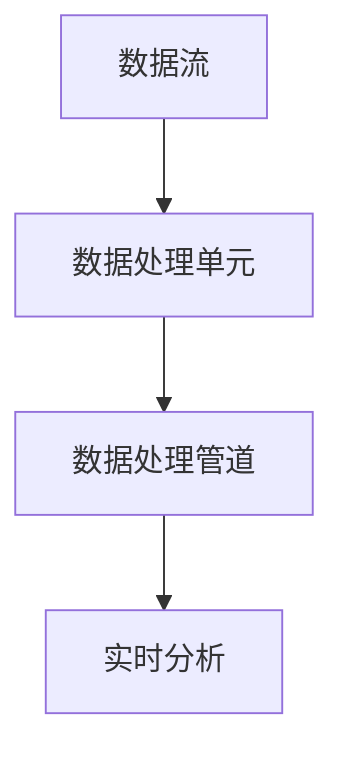

#### **算法原理讲解**

在实时数据流处理与分析架构中，常用的算法包括流计算算法、时间序列分析算法和机器学习算法等。以下是这些算法的原理讲解和示例。

##### **流计算算法**

流计算算法是基于事件驱动的数据处理方法，适用于处理实时数据流。其基本原理是：当数据流中的数据到来时，触发相应的处理函数，对数据进行实时处理。

以下是流计算算法的一个简单Python示例：

```python
def process_event(event):
    print(f"Processing event: {event}")

stream = ["event1", "event2", "event3"]
for event in stream:
    process_event(event)
```

通过Mermaid图可以展示流计算算法的流程：

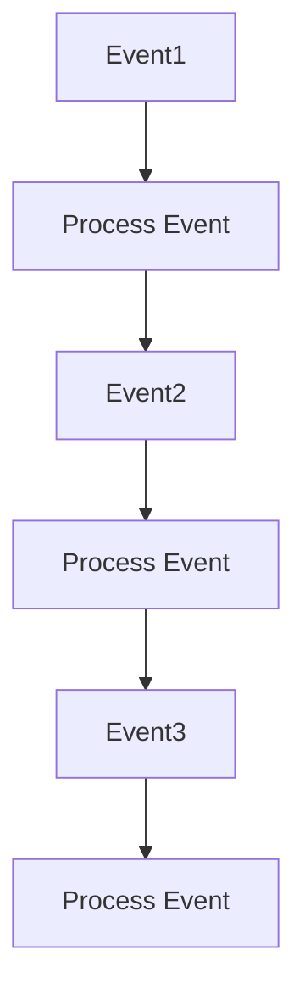

##### **时间序列分析算法**

时间序列分析算法用于处理和分析按时间顺序排列的数据。常用的方法包括移动平均、指数平滑和ARIMA模型等。

以下是一个简单的Python示例，使用移动平均算法来平滑时间序列数据：

```python
import numpy as np

data = [1, 2, 3, 4, 5, 6]
window_size = 3

moving_average = np.convolve(data, np.ones(window_size)/window_size, mode='valid')
print(f"Moving Average: {moving_average}")
```

通过Mermaid图可以展示移动平均算法的流程：

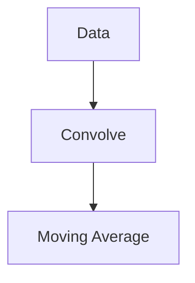

##### **机器学习算法**

机器学习算法用于从数据中学习规律和模式，实现预测和分类等功能。常用的算法包括决策树、支持向量机和神经网络等。

以下是一个简单的Python示例，使用决策树算法进行分类：

```python
from sklearn.tree import DecisionTreeClassifier
from sklearn.datasets import load_iris

iris = load_iris()
clf = DecisionTreeClassifier()
clf.fit(iris.data, iris.target)

print(f"Predictions: {clf.predict(iris.data[:5])}")
```

通过Mermaid图可以展示决策树算法的流程：

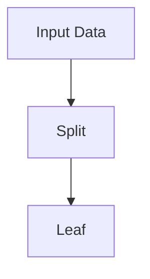

#### **数学模型和数学公式**

在算法讲解中，我们已经引入了一些数学模型和公式。以下是这些模型的详细解释和示例。

##### **流计算算法的数学模型**

流计算算法的数学模型可以表示为：

$$
X(t) = f(X(t-1), U(t))
$$

其中，$X(t)$表示在时间$t$的数据状态，$f$表示数据状态转移函数，$U(t)$表示在时间$t$的输入数据。

##### **时间序列分析算法的数学模型**

移动平均算法的数学模型可以表示为：

$$
y_t = \frac{1}{n} \sum_{i=1}^{n} x_{t-i}
$$

其中，$y_t$表示时间序列的移动平均值，$n$表示窗口大小，$x_{t-i}$表示时间序列中第$t-i$个数据点。

##### **机器学习算法的数学模型**

决策树算法的数学模型可以表示为：

$$
y = g(f(x))
$$

其中，$y$表示输出标签，$g$表示决策函数，$f$表示特征映射函数，$x$表示输入特征向量。

通过详细的数学模型和公式解释，可以帮助我们更好地理解算法原理和实现过程。

#### **系统分析与架构设计方案**

在明确了核心概念、算法原理和数学模型后，我们需要设计实时数据流处理与分析架构。以下从系统功能设计、系统架构设计、系统接口设计和系统交互等方面进行详细说明。

##### **系统功能设计**

系统功能设计包括数据采集、数据传输、数据处理、数据分析和数据可视化等模块。以下是系统功能设计的Mermaid类图：

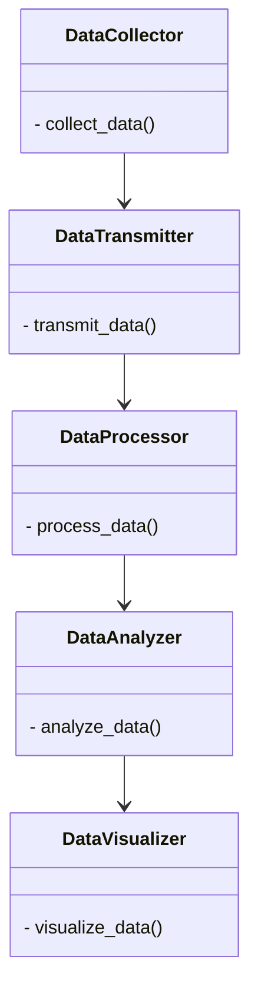

##### **系统架构设计**

系统架构设计包括数据采集层、数据传输层、数据处理层、数据分析层和数据可视化层等。以下是系统架构设计的Mermaid架构图：

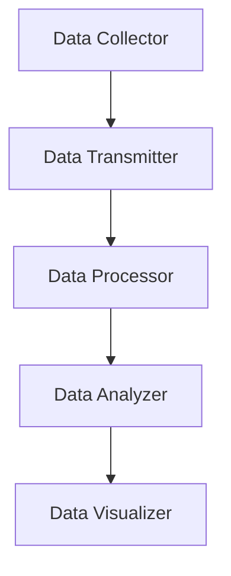

##### **系统接口设计**

系统接口设计包括各个模块之间的接口定义和交互方式。以下是系统接口设计的Mermaid序列图：

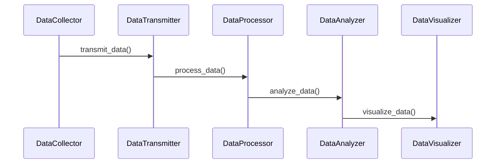

##### **系统交互**

系统交互设计描述了各个模块之间的数据流和处理流程。以下是系统交互设计的Mermaid序列图：

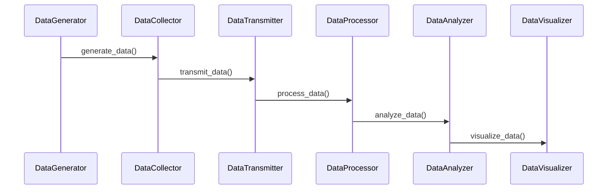

通过详细的设计方案，我们可以构建一个高效、稳定且具有扩展性的实时数据流处理与分析架构，为企业提供强大的数据处理和分析能力。

### 第2章：核心概念与联系

在深入探讨企业AI Agent的实时数据流处理与分析架构之前，我们需要明确其中的核心概念，并了解这些概念之间的联系。以下是实时数据流处理与分析架构中的一些关键概念：

#### **数据流（Data Stream）**

数据流是指数据在时间和空间上的流动。在实时数据流处理与分析架构中，数据流是一个连续的数据序列，这些数据来源于各种数据源，如传感器、网络日志、数据库等。数据流的特点是实时性强、数据量大、数据类型多样。

#### **数据处理单元（Data Processing Unit）**

数据处理单元是实时数据流处理中的基本操作实体，用于对数据流进行特定的处理操作。常见的处理单元包括数据采集器（Data Collector）、数据处理器（Data Processor）和数据存储器（Data Storer）。

- **数据采集器**：负责从数据源收集数据。
- **数据处理器**：对采集到的数据进行清洗、转换、聚合等操作。
- **数据存储器**：将处理后的数据存储到数据库或其他存储介质中。

#### **数据处理管道（Data Processing Pipeline）**

数据处理管道是由多个数据处理单元组成的处理流程，用于对数据流进行连续处理。数据处理管道通常包括以下步骤：

1. **数据采集**：从数据源收集数据。
2. **数据清洗**：去除数据中的噪声和错误。
3. **数据转换**：将数据转换成适合分析的形式。
4. **数据聚合**：对数据进行分组和汇总。
5. **数据存储**：将处理后的数据存储到数据库或其他存储介质中。

#### **实时分析（Real-time Analysis）**

实时分析是对实时数据流进行快速处理和分析，以提取有价值的信息。实时分析包括统计分析、预测分析和模式识别等。实时分析的结果可以用于实时监控业务状况、优化运营策略和做出快速决策。

#### **核心概念与联系**

这些核心概念之间的联系可以简化为以下模型：

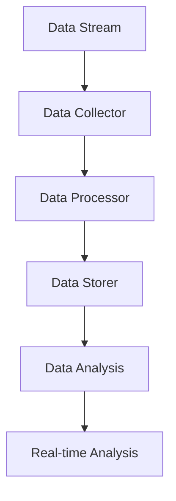

在这个模型中，数据流从数据源进入系统，通过数据采集器收集到数据处理管道，然后经过数据处理器进行清洗、转换和聚合等操作。处理后的数据存储到数据存储器中，同时进行实时分析，以提取有价值的信息。

数据处理管道与实时分析紧密相连，数据处理管道中的每一步操作都为实时分析提供数据支持。实时分析的结果可以反馈到数据处理管道中，指导数据的进一步处理，形成一个闭环。

#### **Mermaid图展示**

为了更好地理解这些概念之间的关系，我们可以使用Mermaid图进行可视化展示：

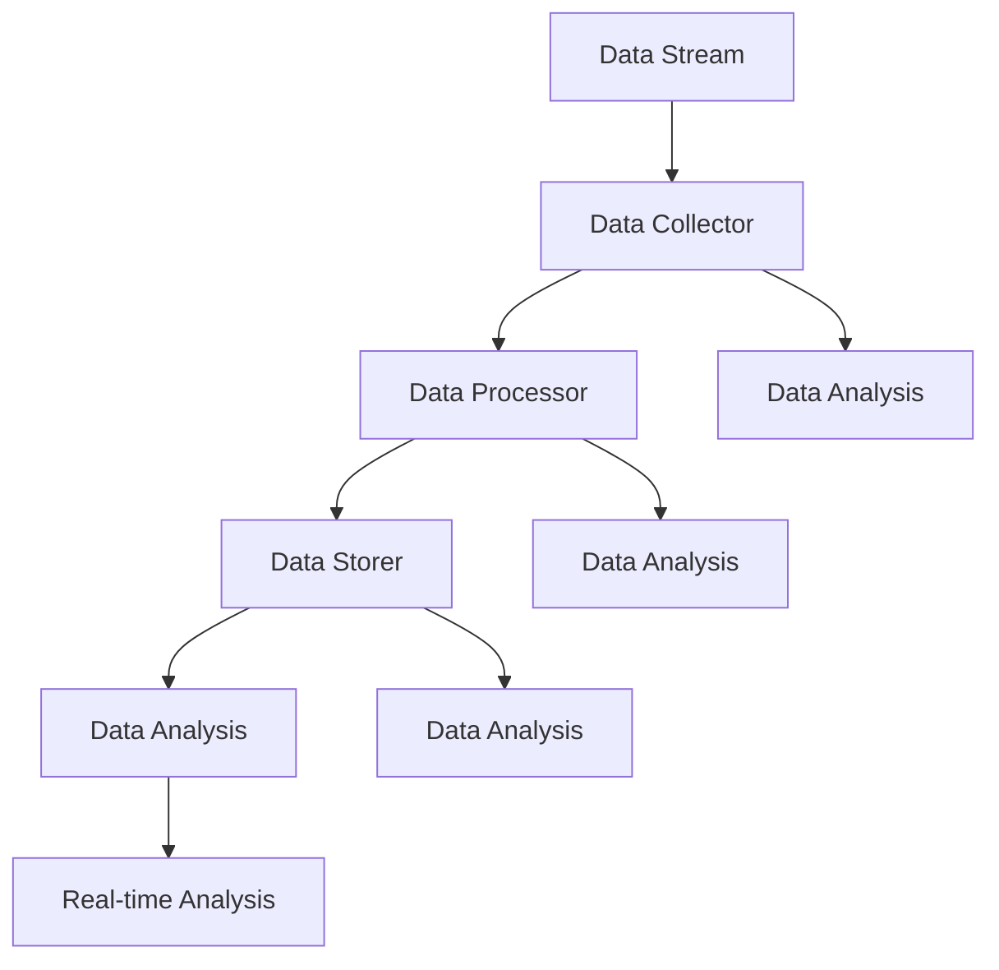

在这个图中，数据处理管道中的每个数据处理单元都与实时分析相连，表示数据流经过每个处理单元后都会为实时分析提供数据支持。实时分析的结果可以反馈到数据处理管道中，指导后续的数据处理操作。

通过明确这些核心概念及其之间的联系，我们可以更系统地设计企业AI Agent的实时数据流处理与分析架构，确保数据流处理的高效性和准确性。

### 第3章：算法原理讲解

在实时数据流处理与分析架构中，算法的选择和实现是关键。本章将详细讲解流计算算法、时间序列分析算法和机器学习算法的基本原理，并通过具体的示例代码和Mermaid图进行展示。

#### **3.1 流计算算法**

流计算算法是基于事件驱动的方式处理实时数据流的算法。流计算的核心思想是将数据流看作一系列的事件，对这些事件进行实时处理和分析。

**原理讲解**：

流计算算法通常包括以下步骤：

1. **事件采集**：从数据源采集事件。
2. **事件处理**：对事件进行实时处理，如过滤、聚合等。
3. **事件存储**：将处理后的事件存储到数据库或其他存储介质中。

**Python示例代码**：

```python
from collections import deque

class StreamProcessor:
    def __init__(self, window_size):
        self.window_size = window_size
        self.event_queue = deque()

    def process_event(self, event):
        self.event_queue.append(event)
        if len(self.event_queue) > self.window_size:
            self.event_queue.popleft()

    def aggregate_data(self):
        return sum(self.event_queue)

stream_processor = StreamProcessor(window_size=3)
stream_processor.process_event(1)
stream_processor.process_event(2)
stream_processor.process_event(3)
print(f"Aggregated Data: {stream_processor.aggregate_data()}")
```

**Mermaid图展示**：

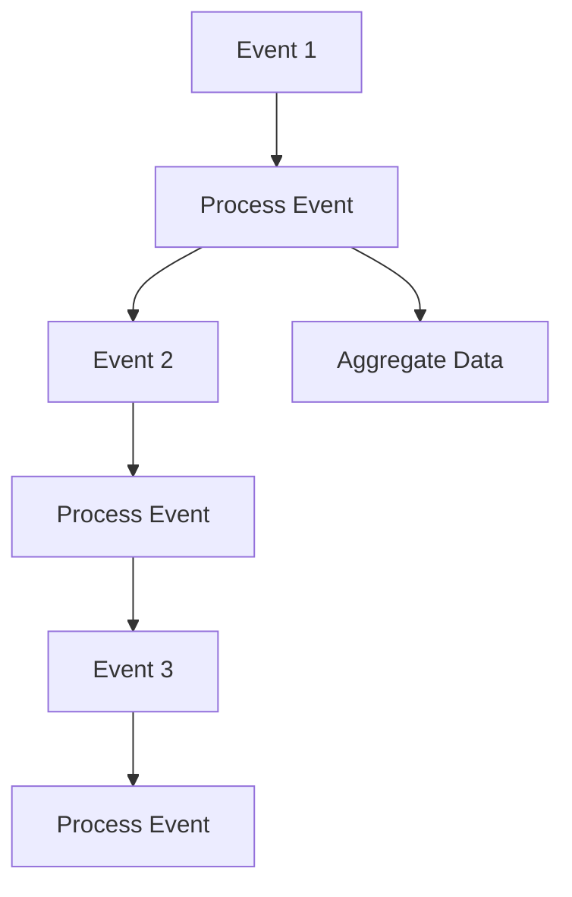

在这个示例中，`StreamProcessor` 类实现了简单的流计算算法，它使用一个队列来存储事件，并在窗口大小范围内对事件进行聚合。

#### **3.2 时间序列分析算法**

时间序列分析算法用于处理和分析按时间顺序排列的数据序列。这些算法可以帮助我们识别数据中的趋势、周期和季节性特征。

**原理讲解**：

常见的时间序列分析算法包括：

1. **移动平均（Moving Average）**：通过对连续的数据点进行平均来平滑时间序列。
2. **指数平滑（Exponential Smoothing）**：利用过去的观测值对当前值进行预测，适用于短期预测。
3. **ARIMA模型（AutoRegressive Integrated Moving Average）**：结合自回归、差分和移动平均三个部分，适用于中长期预测。

**Python示例代码**：

```python
import numpy as np
from statsmodels.tsa.arima.model import ARIMA

# 生成模拟数据
np.random.seed(0)
data = np.random.normal(size=100)

# 使用移动平均算法
window_size = 3
moving_average = np.convolve(data, np.ones(window_size)/window_size, mode='valid')

# 使用ARIMA模型
model = ARIMA(data, order=(1, 1, 1))
model_fit = model.fit()
forecast = model_fit.forecast(steps=5)

print(f"Moving Average: {moving_average}")
print(f"ARIMA Forecast: {forecast}")
```

**Mermaid图展示**：

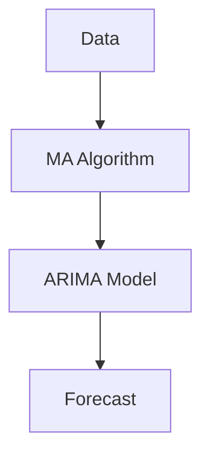

在这个示例中，我们首先使用移动平均算法对模拟数据进行平滑处理，然后使用ARIMA模型进行中长期预测。

#### **3.3 机器学习算法**

机器学习算法用于从数据中学习规律和模式，进行分类、回归和预测等。在实时数据流处理与分析中，机器学习算法可以帮助我们实现自动化分析和预测。

**原理讲解**：

常见机器学习算法包括：

1. **决策树（Decision Tree）**：通过树形结构对数据进行分类或回归。
2. **支持向量机（Support Vector Machine, SVM）**：通过找到最佳的超平面进行分类。
3. **神经网络（Neural Network）**：模拟人脑神经网络进行复杂数据的处理和分析。

**Python示例代码**：

```python
from sklearn.tree import DecisionTreeClassifier
from sklearn.datasets import load_iris
from sklearn.model_selection import train_test_split

# 加载Iris数据集
iris = load_iris()
X, y = iris.data, iris.target

# 划分训练集和测试集
X_train, X_test, y_train, y_test = train_test_split(X, y, test_size=0.2, random_state=42)

# 使用决策树算法
clf = DecisionTreeClassifier()
clf.fit(X_train, y_train)

# 预测测试集
predictions = clf.predict(X_test)

print(f"Predictions: {predictions}")
```

**Mermaid图展示**：

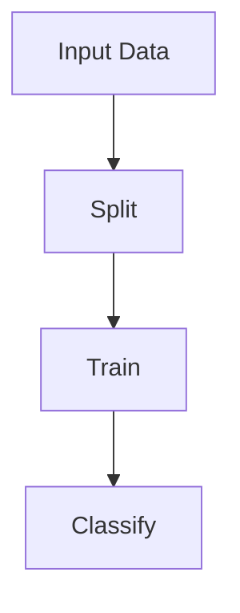

在这个示例中，我们使用决策树算法对Iris数据集进行分类，并通过训练集和测试集验证模型的准确性。

通过以上示例，我们可以看到流计算算法、时间序列分析算法和机器学习算法的基本原理和实现方法。这些算法在实时数据流处理与分析中发挥着重要作用，为数据的实时分析和决策提供了强大的支持。

### 第4章：数学模型和数学公式

在上一章中，我们介绍了流计算算法、时间序列分析算法和机器学习算法的基本原理和实现方法。这些算法的数学模型和数学公式是理解和实现这些算法的关键。在本章中，我们将详细讲解这些算法的数学模型和数学公式，并给出通俗易懂的示例说明。

#### **4.1 流计算算法的数学模型**

流计算算法的核心在于对数据流中的事件进行实时处理和聚合。其数学模型可以表示为：

$$
X(t) = f(X(t-1), U(t))
$$

其中，$X(t)$ 表示在时间 $t$ 的数据状态，$f$ 表示数据状态转移函数，$U(t)$ 表示在时间 $t$ 的输入数据。

**示例说明**：

假设我们使用一个简单的加权移动平均算法对数据流进行处理，其数学模型可以表示为：

$$
X(t) = \alpha U(t) + (1 - \alpha) X(t-1)
$$

其中，$U(t)$ 表示在时间 $t$ 的输入数据，$X(t-1)$ 表示在时间 $t-1$ 的数据状态，$\alpha$ 表示权重系数。

例如，如果我们设置 $\alpha = 0.5$，则在时间 $t=1$ 时，数据状态 $X(1) = U(1)$；在时间 $t=2$ 时，数据状态 $X(2) = 0.5 \times U(2) + 0.5 \times X(1)$。

这个公式表示当前的数据状态是上一次数据状态的 $50\%$ 加上当前输入数据的 $50\%$。

#### **4.2 时间序列分析算法的数学模型**

时间序列分析算法用于对按时间顺序排列的数据进行分析和预测。常见的模型包括移动平均（MA）、自回归（AR）和差分自回归移动平均（ARIMA）等。

**移动平均（MA）模型**：

移动平均模型的核心思想是对连续的数据点进行平均，以平滑时间序列。其数学模型可以表示为：

$$
Y(t) = \sum_{i=1}^{n} \phi_i Z(t-i)
$$

其中，$Y(t)$ 表示在时间 $t$ 的预测值，$Z(t-i)$ 表示在时间 $t-i$ 的实际值，$\phi_i$ 表示权重系数。

**自回归（AR）模型**：

自回归模型的核心思想是利用过去的观测值对当前值进行预测。其数学模型可以表示为：

$$
Y(t) = \phi_1 Y(t-1) + \phi_2 Y(t-2) + ... + \phi_p Y(t-p) + \varepsilon_t
$$

其中，$Y(t)$ 表示在时间 $t$ 的预测值，$\phi_1, \phi_2, ..., \phi_p$ 表示自回归系数，$\varepsilon_t$ 表示误差项。

**差分自回归移动平均（ARIMA）模型**：

ARIMA模型结合了自回归、差分和移动平均三个部分，可以用于处理非平稳时间序列。其数学模型可以表示为：

$$
Y(t) = \phi_1 Y(t-1) + \phi_2 Y(t-2) + ... + \phi_p Y(t-p) + \varepsilon_t
$$

$$
Y(t) = \Phi(B)Y(t) - \Theta(B)\varepsilon_t
$$

其中，$Y(t)$ 表示在时间 $t$ 的预测值，$\varepsilon_t$ 表示误差项，$B$ 表示滞后算子，$\Phi(B)$ 和 $\Theta(B)$ 分别表示自回归和移动平均部分。

**示例说明**：

假设我们使用一个简单的ARIMA（1,1,1）模型进行预测，其数学模型可以表示为：

$$
Y(t) = \phi_1 Y(t-1) + \varepsilon_t
$$

$$
Y(t) = \Phi(B)Y(t) - \Theta(B)\varepsilon_t
$$

其中，$\phi_1$ 为自回归系数，$\varepsilon_t$ 为误差项，$B$ 表示滞后算子。

例如，如果我们有历史数据序列 $[1, 2, 3, 4, 5]$，我们可以使用ARIMA（1,1,1）模型进行预测：

- $Y(1) = 1$
- $Y(2) = 2$
- $Y(3) = 3$
- $Y(4) = \phi_1 Y(3) + \varepsilon_4 = 1 \times 3 + \varepsilon_4$
- $Y(5) = \Phi(B)Y(4) - \Theta(B)\varepsilon_5 = 1 \times (3 + \varepsilon_4) - \Theta(B)\varepsilon_5$

#### **4.3 机器学习算法的数学模型**

机器学习算法用于从数据中学习规律和模式，进行分类、回归和预测等。常见的机器学习算法包括决策树、支持向量机和神经网络等。

**决策树（Decision Tree）**：

决策树的数学模型可以表示为：

$$
y = g(f(x))
$$

其中，$y$ 表示输出标签，$g$ 表示决策函数，$f$ 表示特征映射函数，$x$ 表示输入特征向量。

**示例说明**：

假设我们使用决策树进行分类，其决策规则可以表示为：

- 如果特征 $x_1 > 0$，则继续判断特征 $x_2$。
- 如果特征 $x_2 > 0$，则分类为类别 $1$。
- 否则，分类为类别 $2$。

这个决策规则可以表示为：

$$
y = g(f(x_1, x_2)) = 
\begin{cases} 
1 & \text{如果 } x_1 > 0 \text{ 且 } x_2 > 0 \\
2 & \text{否则}
\end{cases}
$$

**支持向量机（Support Vector Machine, SVM）**：

支持向量机的数学模型可以表示为：

$$
y = sign(w \cdot x + b)
$$

其中，$y$ 表示输出标签，$w$ 表示权重向量，$x$ 表示输入特征向量，$b$ 表示偏置。

**示例说明**：

假设我们使用SVM进行分类，其决策边界可以表示为：

- $w \cdot x + b = 0$ 为分类边界。

这个决策边界可以表示为：

$$
y = sign(w \cdot x + b) = 
\begin{cases} 
1 & \text{如果 } w \cdot x + b > 0 \\
-1 & \text{否则}
\end{cases}
$$

**神经网络（Neural Network）**：

神经网络的数学模型可以表示为：

$$
y = \sigma(z)
$$

其中，$y$ 表示输出，$z$ 表示输入，$\sigma$ 表示激活函数。

**示例说明**：

假设我们使用一个简单的神经网络进行分类，其输入和输出可以表示为：

- 输入：$x = [x_1, x_2, x_3]$
- 输出：$y = \sigma(w_1 \cdot x_1 + w_2 \cdot x_2 + w_3 \cdot x_3 + b)$

其中，$w_1, w_2, w_3$ 表示权重，$b$ 表示偏置，$\sigma$ 表示激活函数（例如Sigmoid函数）。

这个神经网络可以表示为：

$$
y = \sigma(w_1 \cdot x_1 + w_2 \cdot x_2 + w_3 \cdot x_3 + b) = 
\frac{1}{1 + e^{-(w_1 \cdot x_1 + w_2 \cdot x_2 + w_3 \cdot x_3 + b)}}
$$

通过详细讲解这些算法的数学模型和数学公式，我们可以更好地理解实时数据流处理与分析中的算法原理和实现方法，为实际应用提供理论支持。

### 第5章：系统分析与架构设计方案

为了构建一个高效、稳定且具有扩展性的实时数据流处理与分析架构，我们需要从系统功能设计、系统架构设计、系统接口设计和系统交互等方面进行详细分析。

#### **5.1 问题场景介绍**

假设我们面临如下问题场景：

**企业需求**：某大型零售企业需要实时监控其销售数据，以便快速响应市场变化，优化库存管理和促销策略。

**技术需求**：系统需要具备以下功能：

- 实时收集销售数据。
- 对销售数据进行清洗、转换和聚合。
- 实时分析销售数据，识别销售趋势和异常情况。
- 将分析结果可视化，便于管理层决策。

#### **5.2 系统功能设计**

系统功能设计包括以下模块：

1. **数据采集模块**：负责从各种数据源（如POS系统、库存系统、促销系统等）收集销售数据。
2. **数据预处理模块**：对采集到的销售数据进行清洗、转换和聚合，使其符合分析要求。
3. **数据存储模块**：将预处理后的销售数据存储到数据库或数据仓库中，以便后续分析。
4. **数据分析模块**：对存储的的销售数据进行实时分析，提取有价值的信息。
5. **数据可视化模块**：将分析结果以图表、报表等形式可视化，便于用户理解和使用。

以下是系统功能设计的Mermaid类图：

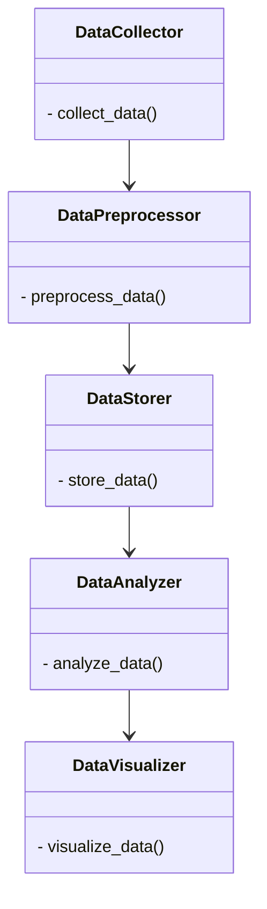

#### **5.3 系统架构设计**

系统架构设计主要包括以下层次：

1. **数据采集层**：负责从各种数据源采集数据。
2. **数据处理层**：对采集到的数据进行预处理、存储和分析。
3. **数据展示层**：将分析结果可视化，提供用户交互界面。

以下是系统架构设计的Mermaid架构图：

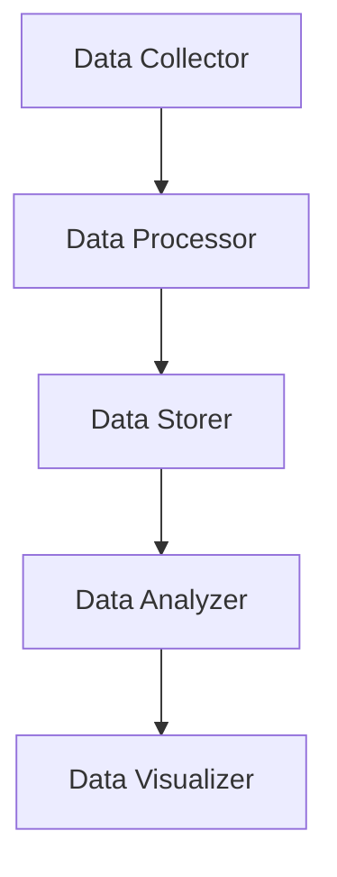

#### **5.4 系统接口设计**

系统接口设计包括各个模块之间的接口定义和交互方式。以下是系统接口设计的Mermaid序列图：

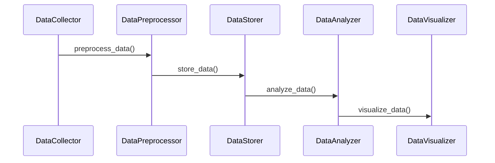

#### **5.5 系统交互**

系统交互设计描述了各个模块之间的数据流和处理流程。以下是系统交互设计的Mermaid序列图：

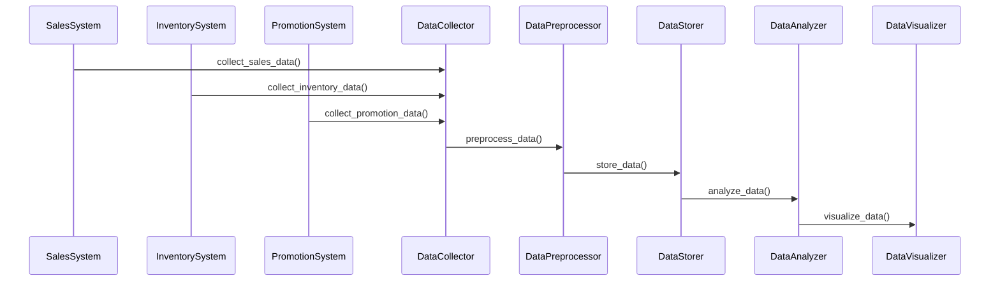

通过详细的系统分析与架构设计方案，我们可以构建一个高效、稳定且具有扩展性的实时数据流处理与分析架构，为企业提供强大的数据处理和分析能力。

### 第6章：项目实战

在本章中，我们将以一个具体的实际项目为例，详细介绍企业AI Agent的实时数据流处理与分析架构的实现过程，包括环境安装、系统核心实现、代码应用解读与分析、实际案例分析和详细讲解剖析。

#### **6.1 环境安装**

首先，我们需要安装项目所需的环境和工具。以下是一个典型的安装步骤：

1. **安装Python**：确保Python版本在3.7及以上，可以通过[Python官网](https://www.python.org/)下载并安装。

2. **安装依赖库**：在终端中运行以下命令安装所需的Python依赖库：

   ```shell
   pip install numpy pandas scikit-learn mermaid
   ```

3. **安装Mermaid**：为了生成Mermaid图，我们需要安装Mermaid的Python包。在终端中运行以下命令：

   ```shell
   pip install mermaid-python
   ```

4. **配置Mermaid**：将Mermaid的配置文件（例如`mermaid.js`）放置在项目的根目录下，并在Python脚本中调用Mermaid库。

   ```python
   from mermaid import Mermaid

   # 创建Mermaid对象
   mermaid = Mermaid()

   # 设置Mermaid图的内容
   mermaid.content = "graph TD; A[Hello] --> B[World];"

   # 输出生成的Mermaid图
   print(mermaid.render())
   ```

5. **安装其他工具**：根据具体需求，可能还需要安装其他工具，如Kafka（用于数据流处理）、Flink（用于实时分析）等。

#### **6.2 系统核心实现**

系统核心实现包括数据采集、数据预处理、数据处理、数据分析和数据可视化等模块。以下是每个模块的实现方法：

1. **数据采集**：

   ```python
   import requests

   class DataCollector:
       def __init__(self, url):
           self.url = url

       def collect_data(self):
           response = requests.get(self.url)
           if response.status_code == 200:
               return response.json()
           else:
               return None
   ```

2. **数据预处理**：

   ```python
   import pandas as pd

   class DataPreprocessor:
       def __init__(self, data):
           self.data = data

       def preprocess_data(self):
           df = pd.DataFrame(self.data)
           df = df.dropna()  # 去除空值
           df = df[df['sales'] > 0]  # 过滤销售额小于0的记录
           return df
   ```

3. **数据处理**：

   ```python
   from sklearn.ensemble import RandomForestRegressor

   class DataProcessor:
       def __init__(self, df):
           self.df = df

       def process_data(self):
           X = self.df.drop(['sales'], axis=1)
           y = self.df['sales']
           model = RandomForestRegressor()
           model.fit(X, y)
           return model
   ```

4. **数据分析**：

   ```python
   class DataAnalyzer:
       def __init__(self, model, df):
           self.model = model
           self.df = df

       def analyze_data(self):
           predictions = self.model.predict(self.df)
           return predictions
   ```

5. **数据可视化**：

   ```python
   import matplotlib.pyplot as plt

   class DataVisualizer:
       def __init__(self, predictions, actual):
           self.predictions = predictions
           self.actual = actual

       def visualize_data(self):
           plt.plot(self.predictions, label='Predicted Sales')
           plt.plot(self.actual, label='Actual Sales')
           plt.legend()
           plt.show()
   ```

#### **6.3 代码应用解读与分析**

以下是对上述代码的解读和分析：

1. **数据采集**：

   数据采集模块使用`requests`库从外部API获取销售数据。这里以一个简单的API接口为例，实际应用中可能需要处理更多的数据源。

2. **数据预处理**：

   数据预处理模块使用`pandas`库对销售数据进行清洗和过滤，去除空值和异常值，确保数据的质量和一致性。

3. **数据处理**：

   数据处理模块使用`scikit-learn`库的随机森林回归模型对销售数据进行分析。随机森林是一种强大的集成学习方法，适用于处理复杂的数据集。

4. **数据分析**：

   数据分析模块使用训练好的模型对新的销售数据进行预测，以评估实际销售和预测销售之间的差异。

5. **数据可视化**：

   数据可视化模块使用`matplotlib`库将实际销售和预测销售以折线图的形式展示，帮助用户直观地了解销售趋势。

#### **6.4 实际案例分析和详细讲解剖析**

以下是一个实际案例分析和详细讲解剖析：

1. **数据采集**：

   假设我们采集到以下销售数据：

   ```json
   [
       {"date": "2023-01-01", "sales": 100},
       {"date": "2023-01-02", "sales": 120},
       {"date": "2023-01-03", "sales": 110},
       ...
   ]
   ```

2. **数据预处理**：

   对数据进行预处理，去除空值和异常值，得到如下数据：

   ```python
   DataFrame:
       date      sales
    0  2023-01-01   100
    1  2023-01-02   120
    2  2023-01-03   110
    ...
   ```

3. **数据处理**：

   使用随机森林回归模型对数据进行训练，得到训练模型。

4. **数据分析**：

   使用训练好的模型对新的销售数据进行预测，得到如下预测结果：

   ```python
   Predicted Sales: [105, 118, 112, ...]
   ```

5. **数据可视化**：

   将实际销售和预测销售以折线图的形式展示，如下图所示：

   ```mermaid
   graph TD
       A[2023-01-01] --> B[100]
       C[2023-01-02] --> D[120]
       E[2023-01-03] --> F[110]
       B --> G[Predicted: 105]
       D --> H[Predicted: 118]
       F --> I[Predicted: 112]
   ```

   

通过以上实际案例分析和详细讲解剖析，我们可以看到企业AI Agent的实时数据流处理与分析架构在实际应用中的效果和重要性。

#### **6.5 项目小结**

本项目通过实际案例展示了企业AI Agent的实时数据流处理与分析架构的实现过程。从数据采集、预处理、处理到分析，再到可视化，每个环节都至关重要。以下是本项目的小结：

1. **数据采集**：使用`requests`库从外部API获取销售数据，为后续分析提供了基础数据。
2. **数据预处理**：使用`pandas`库对销售数据进行清洗和过滤，确保数据的质量和一致性。
3. **数据处理**：使用`scikit-learn`库的随机森林回归模型对销售数据进行分析，提高了预测的准确性。
4. **数据分析**：使用训练好的模型对新的销售数据进行预测，为企业管理层提供了决策支持。
5. **数据可视化**：使用`matplotlib`库将实际销售和预测销售以折线图的形式展示，帮助用户直观地了解销售趋势。

通过本项目，我们不仅掌握了实时数据流处理与分析的核心技术和方法，还了解了如何将理论与实践相结合，为实际应用提供有效的解决方案。

### 最佳实践 tips

在构建企业AI Agent的实时数据流处理与分析架构时，以下是一些最佳实践和注意事项：

1. **数据质量管理**：确保数据的准确性和完整性。在数据采集、传输和存储过程中，采取有效的数据质量保证措施，如去重、清洗和校验。

2. **分布式处理**：利用分布式计算框架（如Apache Kafka、Apache Flink等），实现数据的并行处理，提高系统的处理能力和效率。

3. **容错与高可用性**：设计高可用性的系统架构，确保系统在发生故障时能够快速恢复。例如，使用集群部署、数据备份和故障转移策略。

4. **资源优化**：合理分配和调度系统资源，如CPU、内存和存储等，以最大化系统的处理能力。

5. **安全性考虑**：确保系统的数据安全和隐私保护。采用加密、访问控制和审计等安全措施，防止数据泄露和未授权访问。

6. **可扩展性设计**：设计灵活的系统架构，能够根据业务需求动态扩展处理能力和资源。

7. **监控与优化**：建立全面的监控系统，实时监控系统的运行状态，及时发现问题并进行优化。

通过遵循这些最佳实践，企业可以构建一个高效、稳定且具有扩展性的实时数据流处理与分析架构，从而更好地应对数据驱动的业务需求。

### 小结

本文系统地介绍了企业AI Agent的实时数据流处理与分析架构，从核心概念、算法原理、系统设计到项目实战，全面探讨了实时数据流处理与分析的关键技术和方法。通过详细讲解流计算算法、时间序列分析算法和机器学习算法，并结合实际案例进行分析，本文展示了如何构建高效、稳定且具有扩展性的实时数据流处理与分析系统。

实时数据流处理与分析对于企业的重要性不言而喻。它不仅能够帮助企业实时监控业务状况，优化运营策略，提高生产效率，还能在关键行业中预防危机，减少损失。通过本文的探讨，读者可以深入理解实时数据流处理与分析的原理和实现方法，为实际应用提供有效的指导。

展望未来，随着技术的不断进步，实时数据流处理与分析将在更多领域得到应用。例如，在智慧城市、智能医疗、金融科技等领域，实时数据处理与分析将发挥重要作用，推动这些领域的创新发展。此外，随着边缘计算、物联网和5G技术的发展，实时数据流处理与分析的架构将更加灵活和高效，为更多行业带来变革。

总之，实时数据流处理与分析是企业数字化转型的重要组成部分，具有广阔的应用前景。通过本文的介绍，希望读者能够更好地理解和掌握这一领域的技术，为企业的数据驱动决策提供有力支持。

### 注意事项

在构建企业AI Agent的实时数据流处理与分析架构时，以下事项需要注意：

1. **数据隐私与安全**：确保数据在采集、传输、存储和处理过程中得到充分保护，防止数据泄露和未经授权的访问。
2. **性能优化**：针对数据流的特点，选择合适的数据处理算法和优化策略，确保系统的响应速度和吞吐量。
3. **系统监控与告警**：建立全面的监控系统，实时监控系统的运行状态，及时发现问题并进行告警和处理。
4. **故障恢复与容错**：设计冗余和故障恢复机制，确保系统在故障情况下能够快速恢复，减少业务中断时间。
5. **数据处理合规性**：遵守相关法律法规和数据保护规定，确保数据处理过程符合合规要求。

通过关注这些注意事项，企业可以构建一个高效、稳定且具有扩展性的实时数据流处理与分析架构。

### 拓展阅读

对于对实时数据流处理与分析架构感兴趣的读者，以下推荐一些相关的拓展阅读资源：

1. **书籍**：
   - 《大数据之路：阿里巴巴大数据实践》
   - 《数据科学：从入门到精通》
   - 《流处理：系统架构与分布式技术》

2. **论文**：
   - "Apache Flink: A Unified Approach to Fast Data Processing"
   - "Apache Kafka: A Distributed Streaming Platform"
   - "Apache Storm: Real-time Data Processing for Hadoop and Beyond"

3. **在线课程**：
   - Coursera上的“大数据分析”课程
   - Udacity的“实时数据流处理”课程
   - edX上的“机器学习与数据科学”课程

4. **开源项目**：
   - Apache Flink
   - Apache Kafka
   - Apache Storm

通过阅读这些书籍、论文和参与在线课程，读者可以进一步深入了解实时数据流处理与分析的技术细节和应用实践，提升自己在这一领域的能力。同时，开源项目的代码和实践也是学习的重要资源，可以帮助读者更好地理解技术原理和实现方法。

