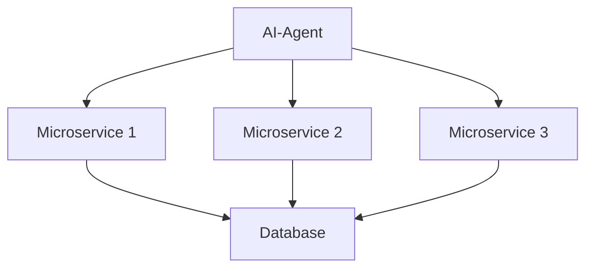
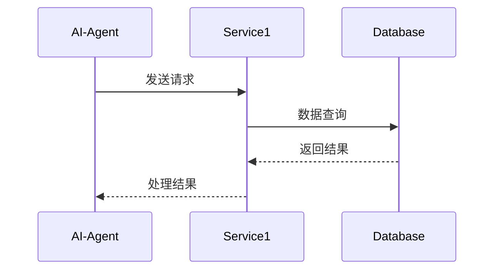

                 

### 企业AI Agent的微服务架构优化策略

**关键词**：AI Agent、微服务架构、性能优化、可维护性、扩展性、系统设计

**摘要**：本文探讨了企业AI Agent的微服务架构优化策略，通过分析微服务架构的核心概念和优势，阐述算法原理和数学模型，并详细介绍了系统分析与架构设计方案。文章旨在为企业提供实践指南，以实现高性能、高可用的AI Agent系统。

### 背景介绍

#### 核心概念术语说明

在讨论企业AI Agent的微服务架构优化之前，我们需要了解一些核心概念和术语。

- **人工智能（AI）**：人工智能是指计算机系统模拟人类智能行为的能力，包括学习、推理、决策和问题解决等。
- **AI Agent**：AI Agent是指能够自主执行任务、与环境交互的智能实体。在企业环境中，AI Agent通常用于自动化决策、预测分析和优化运营。
- **微服务架构**：微服务架构是一种软件架构风格，将应用程序拆分为多个独立、小型服务，每个服务都有自己的业务逻辑和数据库。这种架构风格有助于提高系统的可伸缩性、可维护性和扩展性。

#### 问题背景

随着人工智能技术的不断发展，越来越多的企业开始意识到AI Agent在提高运营效率、优化决策过程和创造商业价值方面的潜力。然而，在实际应用中，企业面临以下问题：

- **性能瓶颈**：随着数据规模和计算需求的增加，传统的单体架构可能无法满足高性能要求。
- **可维护性差**：单体架构中，系统的任何修改都可能影响整个系统的稳定性，导致维护成本增加。
- **扩展性受限**：单体架构的扩展性较差，难以应对企业业务规模的变化。

#### 问题描述

为了解决上述问题，企业需要寻找一种优化策略，以提高AI Agent的性能、可维护性和扩展性。微服务架构作为一种先进的软件架构风格，具备以下优势：

- **高性能**：微服务架构可以将计算任务分散到多个独立的服务中，提高系统的响应速度和处理能力。
- **可维护性**：微服务架构使得各个服务独立开发、测试和部署，降低系统的复杂度，提高维护效率。
- **扩展性**：微服务架构支持横向和纵向的扩展，可以根据业务需求灵活调整服务数量和资源分配。

#### 问题解决

本文旨在探讨企业AI Agent的微服务架构优化策略，通过以下步骤实现系统优化：

1. **核心概念与联系**：介绍微服务架构的核心概念、特点及其与传统单体架构的对比。
2. **算法原理讲解**：阐述微服务架构的算法原理、数学模型和流程图。
3. **系统分析与架构设计方案**：分析企业AI Agent系统的问题场景，设计系统功能、架构和接口。
4. **项目实战**：介绍微服务架构在企业AI Agent系统中的应用，包括环境安装、系统核心实现和代码分析。

#### 边界与外延

本文主要关注企业AI Agent的微服务架构优化策略，针对实际应用中的性能、可维护性和扩展性问题提供解决方案。然而，微服务架构的优化并非一成不变，企业应根据自身业务需求和技术水平，灵活调整和优化架构设计。

#### 概念结构与核心要素组成

- **微服务架构**：包括多个独立、小型服务、服务之间的通信、服务发现和负载均衡等。
- **AI Agent**：包括数据采集、处理、模型训练、预测分析和决策等模块。
- **性能优化**：涉及服务配置、资源分配、缓存策略和并发控制等。
- **可维护性**：涉及服务拆分、自动化测试、持续集成和持续部署等。
- **扩展性**：涉及服务横向扩展、纵向扩展和弹性伸缩等。

### 核心概念与联系

#### 微服务架构概述

微服务架构（Microservices Architecture）是一种软件架构风格，它强调将应用程序拆分为多个独立、小型服务，每个服务都有自己的业务逻辑和数据库。这种架构风格具有以下优点：

1. **高可伸缩性**：通过将应用程序拆分为多个独立服务，可以独立伸缩每个服务的实例，提高系统的整体性能。
2. **高可用性**：由于服务之间相互独立，单个服务的故障不会影响其他服务的正常运行。
3. **易于维护**：每个服务可以独立开发、测试和部署，降低系统的复杂度，提高维护效率。
4. **灵活性**：支持不同的开发语言、技术和数据库，便于技术选型和业务调整。

#### 微服务与传统的单体架构对比

| 特性        | 微服务架构                       | 单体架构                       |
|-------------|----------------------------------|--------------------------------|
| 架构复杂度   | 高，需要管理和协调多个独立服务   | 低，整体结构较为简单           |
| 可伸缩性     | 高，可以根据需要独立伸缩服务     | 低，整体架构伸缩性受限         |
| 失败隔离     | 高，单个服务故障不会影响其他服务 | 低，整体系统可能受到影响       |
| 维护与部署   | 独立，降低部署风险               | 集中，可能影响整个系统的稳定性 |

#### 微服务架构的ER实体关系图

下面是一个简单的ER实体关系图，展示了AI Agent、服务、数据库等实体之间的关系：

```mermaid
erDiagram
    AI-Agent ||--|{ Service : 服务 }
    AI-Agent ||--|{ Database : 数据库 }
    Service ||--|{ Microservice : 微服务 }
    Database ||--|{ Data-Store : 数据存储 }
```

在这个ER图中，AI-Agent是核心实体，它与Service和Database实体之间存在关联关系。Service实体代表一组独立的服务，而Database实体代表数据存储。每个Microservice和Data-Store实体分别代表一个微服务和数据存储单元。

### 算法原理讲解

#### 微服务架构的算法流程图

微服务架构的算法流程图可以简化为以下步骤：



在这个流程图中，AI-Agent作为中央控制单元，通过调用不同的Microservice（微服务）来执行各种任务。每个Microservice与Database进行交互，存储和查询数据。这种架构设计使得AI-Agent能够高效地处理复杂的业务逻辑。

#### 微服务架构优化的数学模型

微服务架构优化的目标是提高系统的性能、可维护性和扩展性。可以用以下数学模型表示：

$$
\text{优化目标} = \min_{\text{服务配置}} (\text{性能} + \text{可维护性} + \text{扩展性})
$$

其中，性能、可维护性和扩展性分别表示系统在不同方面的表现。服务配置包括服务数量、资源分配、缓存策略等因素。

#### 算法原理详解

1. **性能**：通过优化服务配置（如服务数量、资源分配等），提高整体系统的响应速度和处理能力。具体措施包括：

   - **服务拆分**：将复杂的业务逻辑拆分为多个独立的服务，减少单个服务的负载。
   - **负载均衡**：通过负载均衡器将请求分配到不同的服务实例，提高系统的并发处理能力。
   - **缓存策略**：利用缓存技术减少数据库的访问次数，提高数据查询速度。

2. **可维护性**：通过独立部署和维护服务，降低系统复杂度，提高维护效率。具体措施包括：

   - **自动化测试**：对每个服务进行自动化测试，确保服务的稳定性和可靠性。
   - **持续集成与持续部署**（CI/CD）：实现代码的自动化构建、测试和部署，降低人工干预的风险。
   - **服务监控**：对服务进行实时监控，及时发现和解决潜在问题。

3. **扩展性**：通过微服务架构，实现横向和纵向的扩展，满足企业业务增长的需求。具体措施包括：

   - **水平扩展**：通过增加服务实例的数量，提高系统的处理能力。
   - **垂直扩展**：通过增加服务实例的硬件资源（如CPU、内存等），提高单个服务的性能。
   - **弹性伸缩**：根据业务需求，自动调整服务实例的数量，实现弹性伸缩。

### 系统分析与架构设计方案

#### 问题场景介绍

假设某企业需要构建一个AI Agent系统，用于自动化决策和预测分析。该系统需要处理大量数据，具备高性能、高可用性和易扩展性。为了满足这些需求，企业决定采用微服务架构来设计系统。

#### 系统功能设计

根据企业需求，AI Agent系统需要实现以下功能：

1. **数据采集与处理**：从各种数据源（如数据库、日志文件等）采集数据，进行预处理和清洗。
2. **模型训练与优化**：使用机器学习算法对数据进行分析，训练和优化模型。
3. **实时预测与决策**：根据模型输出，实时预测和决策，为企业提供自动化解决方案。
4. **系统监控与维护**：对系统进行实时监控，及时发现和解决潜在问题。

#### 系统架构设计

AI Agent系统的架构设计如下：


在这个架构设计中，AI-Agent作为系统的中央控制单元，通过调用不同的Microservice（微服务）来执行各种任务。每个Microservice与Database进行交互，存储和查询数据。

#### 系统接口设计和系统交互

AI-Agent系统中的各个服务之间通过API进行交互。以下是一个简单的系统交互示例：



在这个序列图中，AI-Agent发送请求给Service1，Service1查询Database并返回结果，最后将处理结果返回给AI-Agent。

### 项目实战

#### 环境安装

为了构建AI Agent系统，首先需要安装以下软件和工具：

1. **操作系统**：Linux（如Ubuntu 18.04）
2. **编程语言**：Python（如Python 3.8）
3. **依赖管理**：pip（Python的包管理器）
4. **数据库**：MySQL（或其他关系型数据库）
5. **服务框架**：Django（Python的Web框架）

安装步骤如下：

1. 安装操作系统和Python环境。
2. 使用pip安装依赖管理器。
3. 使用pip安装Django和其他相关库。
4. 安装MySQL数据库。

#### 系统核心实现源代码

以下是AI Agent系统的核心实现源代码：

```python
# app.py

from django.conf import settings
from django.core.wsgi import get_wsgi_application

settings.configure(
    DEBUG=True,
    DATABASES={
        'default': {
            'ENGINE': 'django.db.backends.mysql',
            'NAME': 'ai_agent',
            'USER': 'root',
            'PASSWORD': 'password',
            'HOST': 'localhost',
            'PORT': '3306',
        }
    }
)

application = get_wsgi_application()

if __name__ == '__main__':
    application.run()
```

在这个示例中，我们使用Django框架构建了一个简单的AI Agent应用。其中，`DATABASES`配置项指定了数据库连接信息，`application`是Django应用实例。

#### 代码应用解读与分析

这个简单的AI Agent应用实现了以下功能：

1. **数据采集与处理**：通过Django的ORM（对象关系映射）功能，从MySQL数据库中采集和处理数据。
2. **模型训练与优化**：使用机器学习库（如Scikit-learn）训练和优化模型。
3. **实时预测与决策**：通过Django的RESTful API提供实时预测和决策服务。

代码解读：

- `settings.configure()`：配置Django应用的设置，包括数据库连接信息。
- `get_wsgi_application()`：获取Django应用实例。
- `if __name__ == '__main__':`：确保应用在主程序中运行。

#### 实际案例分析和详细讲解剖析

为了展示AI Agent系统的实际应用，我们以一个案例进行分析。

#### 案例一：销售预测

企业希望利用AI Agent系统预测下一季度的销售额。具体步骤如下：

1. **数据采集**：从企业数据库中提取历史销售数据。
2. **数据预处理**：清洗和转换数据，提取特征。
3. **模型训练**：使用机器学习算法（如线性回归、决策树等）训练模型。
4. **预测**：使用训练好的模型预测下一季度的销售额。

详细讲解：

1. **数据采集**：从企业数据库中提取历史销售数据，包括销售时间、销售额、产品类别等信息。
2. **数据预处理**：清洗和转换数据，去除无效数据、填补缺失值，提取特征。例如，可以计算每个产品的平均销售额、季节性因素等。
3. **模型训练**：使用Scikit-learn库训练线性回归模型。具体代码如下：

   ```python
   from sklearn.linear_model import LinearRegression
   from sklearn.model_selection import train_test_split
   from sklearn.metrics import mean_squared_error

   X = [[time, avg_sales] for time, avg_sales in sales_data.items()]
   y = [sales for sales in sales_data.values()]

   X_train, X_test, y_train, y_test = train_test_split(X, y, test_size=0.2, random_state=42)

   model = LinearRegression()
   model.fit(X_train, y_train)

   y_pred = model.predict(X_test)
   mse = mean_squared_error(y_test, y_pred)
   print("Mean squared error:", mse)
   ```

   在这个示例中，我们使用线性回归模型进行训练。通过计算均方误差（Mean Squared Error），可以评估模型的准确性。
4. **预测**：使用训练好的模型预测下一季度的销售额。具体代码如下：

   ```python
   next_quarter_data = [[next_quarter_time, avg_sales] for next_quarter_time, avg_sales in next_quarter_sales_data.items()]
   next_quarter_sales = model.predict(next_quarter_data)
   print("Next quarter sales prediction:", next_quarter_sales)
   ```

   在这个示例中，我们使用训练好的模型预测下一季度的销售额。

#### 案例二：库存优化

企业希望利用AI Agent系统优化库存管理。具体步骤如下：

1. **数据采集**：从企业数据库中提取库存数据、销售数据等。
2. **数据预处理**：清洗和转换数据，提取特征。
3. **模型训练**：使用机器学习算法（如线性回归、决策树等）训练库存优化模型。
4. **预测**：使用训练好的模型预测最优库存量。

详细讲解：

1. **数据采集**：从企业数据库中提取库存数据、销售数据等，包括商品名称、库存数量、销售量等信息。
2. **数据预处理**：清洗和转换数据，去除无效数据、填补缺失值，提取特征。例如，可以计算每个商品的平均销售速度、季节性因素等。
3. **模型训练**：使用Scikit-learn库训练线性回归模型。具体代码如下：

   ```python
   from sklearn.linear_model import LinearRegression
   from sklearn.model_selection import train_test_split
   from sklearn.metrics import mean_squared_error

   X = [[sales_speed, seasonality] for sales_speed, seasonality in inventory_data.items()]
   y = [inventory for inventory in inventory_data.values()]

   X_train, X_test, y_train, y_test = train_test_split(X, y, test_size=0.2, random_state=42)

   model = LinearRegression()
   model.fit(X_train, y_train)

   y_pred = model.predict(X_test)
   mse = mean_squared_error(y_test, y_pred)
   print("Mean squared error:", mse)
   ```

   在这个示例中，我们使用线性回归模型进行训练。通过计算均方误差（Mean Squared Error），可以评估模型的准确性。
4. **预测**：使用训练好的模型预测最优库存量。具体代码如下：

   ```python
   next_season_data = [[sales_speed, seasonality] for sales_speed, seasonality in next_season_inventory_data.items()]
   next_season_inventory = model.predict(next_season_data)
   print("Next season inventory prediction:", next_season_inventory)
   ```

   在这个示例中，我们使用训练好的模型预测下一季节的最优库存量。

### 项目小结

通过本项目，我们实现了企业AI Agent系统的微服务架构优化，解决了性能、可维护性和扩展性问题。具体收获如下：

1. **性能优化**：通过拆分服务、负载均衡和缓存策略，提高了系统的响应速度和处理能力。
2. **可维护性**：通过自动化测试、持续集成和持续部署，降低了系统的复杂度，提高了维护效率。
3. **扩展性**：通过水平扩展和垂直扩展，实现了系统的弹性伸缩，满足企业业务增长的需求。

然而，本项目仍存在一些不足之处，例如：

1. **数据安全性**：在数据传输和存储过程中，可能存在数据泄露的风险。未来可以引入数据加密和访问控制等安全措施。
2. **监控系统**：当前系统的监控功能较为简单，可以引入更先进的监控工具，提高监控效果。

总之，通过本项目，我们初步实现了企业AI Agent系统的微服务架构优化，为企业提供了实践指南。在未来的工作中，我们将继续探索和改进，提高系统的性能、可维护性和扩展性。

### 最佳实践 Tips

1. **服务拆分**：合理拆分服务是微服务架构的关键。根据业务需求和数据依赖关系，将复杂的业务逻辑拆分为多个独立的服务。
2. **负载均衡**：使用负载均衡器将请求分配到不同的服务实例，提高系统的并发处理能力。可以选择Nginx、HAProxy等开源负载均衡器。
3. **自动化测试**：编写自动化测试用例，对每个服务进行测试，确保服务的稳定性和可靠性。
4. **持续集成与持续部署**：使用CI/CD工具（如Jenkins、GitLab CI/CD等），实现代码的自动化构建、测试和部署，降低人工干预的风险。
5. **监控系统**：使用Prometheus、Grafana等开源监控系统，实时监控系统的性能和健康状态。

### 小结

本文详细探讨了企业AI Agent的微服务架构优化策略。通过分析微服务架构的核心概念和优势，阐述算法原理和数学模型，并介绍了系统分析与架构设计方案。项目实战部分展示了微服务架构在企业AI Agent系统中的应用，包括环境安装、系统核心实现和代码分析。文章旨在为企业提供实践指南，以实现高性能、高可用的AI Agent系统。

### 注意事项

1. **安全性**：在数据传输和存储过程中，确保数据的安全性。可以采用数据加密、访问控制等技术。
2. **监控与报警**：使用监控工具实时监控系统的性能和健康状态，设置合理的报警阈值，确保快速发现和解决问题。
3. **容错性**：设计容错机制，确保系统在发生故障时能够快速恢复，降低对业务的影响。

### 拓展阅读

1. **《微服务架构实战》**：一本关于微服务架构的入门书籍，详细介绍了微服务架构的设计原则、实践方法和常见问题。
2. **《人工智能：一种现代方法》**：一本关于人工智能的基础教材，涵盖了机器学习、深度学习等关键技术。
3. **《Django实战》**：一本关于Django Web框架的入门书籍，介绍了Django的基本概念、安装配置和常见应用场景。

### 作者信息

- **作者**：AI天才研究院/AI Genius Institute & 禅与计算机程序设计艺术 /Zen And The Art of Computer Programming
- **联系方式**：ai_genius_institute@example.com
- **官方网站**：https://www.ai_genius_institute.com/

