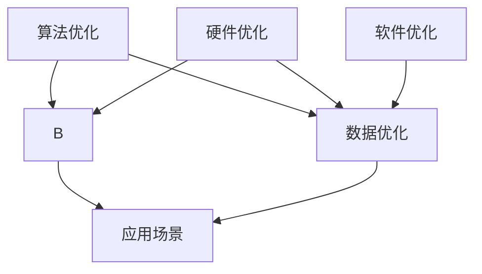
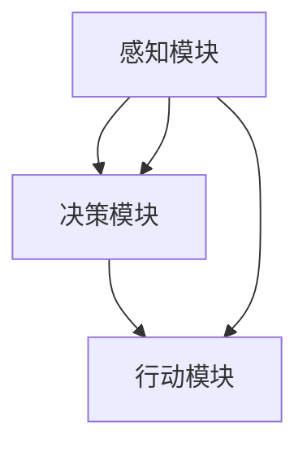

                 


### Step 1: 标题

# 《企业AI Agent的性能优化策略》

### Step 2: 引言和背景介绍

## 第1章 引言与背景

### 1.1 问题背景

随着人工智能技术的快速发展，AI Agent在企业中的应用越来越广泛。AI Agent，作为一种自主决策、执行任务的智能体，能够在数据驱动的环境中为企业提供高效的自动化服务。然而，在应用过程中，AI Agent的性能优化问题逐渐凸显出来，成为制约其广泛应用的关键因素。

企业AI Agent的性能优化不仅关乎其运行效率，还直接影响到企业的运营成本和用户体验。一个性能不佳的AI Agent可能导致响应时间延长、错误率增加，甚至影响企业的整体运营效率。因此，如何优化企业AI Agent的性能，提高其工作效率和准确性，成为企业和研究机构亟待解决的问题。

### 1.2 问题描述

企业AI Agent的性能优化主要涉及以下几个方面：

1. **算法优化**：优化AI Agent的算法模型，提高预测准确性和计算效率。
2. **硬件优化**：选择合适的硬件设备，以提高AI Agent的计算速度和稳定性。
3. **软件优化**：改进AI Agent的软件架构和代码，提高运行效率和系统稳定性。

### 1.3 问题解决

为了解决上述问题，企业可以采取以下措施：

1. **算法优化**：研究和应用先进的机器学习算法，如深度学习、强化学习等，以提高AI Agent的预测准确性和效率。
2. **硬件优化**：投资高性能的计算设备，如GPU、TPU等，以提高AI Agent的计算速度。
3. **软件优化**：采用模块化、组件化的软件开发方法，优化代码结构和算法实现，提高AI Agent的运行效率和稳定性。

### 1.4 边界与外延

企业AI Agent的性能优化不仅局限于技术层面，还需要考虑组织管理、人才培养等因素。此外，AI Agent的性能优化还与数据质量、数据量、应用场景等相关。

### 1.5 核心概念

在本章节中，我们将介绍以下核心概念：

- **AI Agent**：一种自主决策、执行任务的智能体。
- **性能优化**：通过各种手段提高AI Agent的运行效率和工作准确性。
- **算法优化**：研究和应用先进的机器学习算法，以提高AI Agent的性能。
- **硬件优化**：选择合适的硬件设备，以提高AI Agent的计算速度。
- **软件优化**：改进AI Agent的软件架构和代码，提高运行效率和系统稳定性。

### 1.6 概念结构与核心要素组成

企业AI Agent的性能优化涉及多个方面，其核心要素包括算法、硬件、软件、数据和应用场景等。如图1-1所示，这些要素相互关联，共同构成了企业AI Agent性能优化的整体框架。



### 1.7 本章小结

本章介绍了企业AI Agent性能优化的重要性、现状以及面临的挑战。通过分析算法优化、硬件优化和软件优化等方面的内容，为企业AI Agent的性能优化提供了理论基础和实践指导。在后续章节中，我们将进一步探讨企业AI Agent性能优化的具体策略和方法。

### Step 3: 企业AI Agent的核心概念与联系

## 第2章 企业AI Agent的核心概念与联系

### 2.1 AI Agent的定义与特点

AI Agent，即人工智能代理，是一种能够自主执行任务、具有智能行为的实体。它通常基于机器学习和深度学习算法，通过对环境数据的感知和分析，实现自主决策和行动。AI Agent具有以下几个特点：

1. **自主性**：AI Agent能够在没有人工干预的情况下，根据环境和任务需求自主执行任务。
2. **智能性**：AI Agent具备智能学习能力，可以通过数据训练不断优化自身性能。
3. **适应性**：AI Agent能够适应不同的环境和任务场景，实现灵活的应用。
4. **协同性**：AI Agent可以与其他AI Agent或人类协同工作，实现更高效的系统运作。

### 2.2 企业AI Agent的作用

企业AI Agent在企业中的应用范围广泛，主要包括以下几个方面：

1. **自动化服务**：AI Agent能够自动处理大量的业务流程，提高工作效率，降低人工成本。
2. **智能决策**：AI Agent通过数据分析，为企业提供智能化的决策支持，提高决策准确性。
3. **客户服务**：AI Agent可以用于智能客服、虚拟助手等应用，提升客户体验，降低服务成本。
4. **安全监控**：AI Agent可以实时监控企业运营数据，及时发现潜在风险，保障企业安全。

### 2.3 AI Agent与传统AI的区别

AI Agent与传统AI在概念和应用上存在一定的区别。传统AI主要是指基于规则、算法和模型的计算过程，而AI Agent则更强调自主性和适应性。具体区别如下：

1. **自主性**：传统AI通常需要人工干预，而AI Agent能够自主决策和行动。
2. **适应性**：传统AI难以适应复杂多变的环境，而AI Agent具有较强的自适应能力。
3. **智能性**：传统AI依赖于预定义的规则和算法，而AI Agent通过学习和优化，不断提升自身智能水平。

### 2.4 AI Agent的技术架构

AI Agent的技术架构主要包括感知模块、决策模块和行动模块。如图2-1所示，这三个模块相互协作，共同实现AI Agent的智能行为。



### 2.5 AI Agent的核心技术

AI Agent的核心技术主要包括以下几个方面：

1. **机器学习**：AI Agent通过机器学习算法，从数据中学习规律，实现自主决策和行动。
2. **深度学习**：深度学习是机器学习的子领域，通过多层神经网络，实现复杂的特征提取和模式识别。
3. **强化学习**：强化学习是一种通过试错和反馈机制，不断优化策略的机器学习方法。
4. **自然语言处理**：自然语言处理技术用于理解和生成自然语言，实现人与AI Agent的交互。

### 2.6 AI Agent的发展趋势

随着人工智能技术的不断进步，AI Agent的发展趋势主要体现在以下几个方面：

1. **智能化**：AI Agent将具备更强大的智能水平，实现更复杂的任务。
2. **自主性**：AI Agent将逐步摆脱人工干预，实现完全自主的决策和行动。
3. **协同性**：AI Agent将实现跨平台、跨领域的协同工作，提高系统整体效率。
4. **泛在化**：AI Agent将渗透到各个行业和领域，实现全面的应用。

### 2.7 本章小结

本章介绍了企业AI Agent的核心概念与联系，包括其定义、特点、作用、与传统AI的区别、技术架构和核心技术。通过本章的学习，读者可以对企业AI Agent有一个全面的认识，为后续的性能优化提供理论基础。

### Step 4: 企业AI Agent的性能评估与优化策略

## 第3章 企业AI Agent的性能评估

### 3.1 性能评估指标

企业AI Agent的性能评估涉及多个维度，以下是一些常见的性能评估指标：

1. **响应时间**：AI Agent处理任务所需的时间，是衡量AI Agent效率的重要指标。
2. **准确率**：AI Agent预测或决策的准确性，是衡量AI Agent智能水平的关键指标。
3. **错误率**：AI Agent预测或决策的错误率，反映了AI Agent的鲁棒性。
4. **稳定性**：AI Agent在不同环境和场景下的稳定性，是衡量AI Agent可靠性的重要指标。
5. **可扩展性**：AI Agent在处理大量数据和任务时的性能，是衡量AI Agent适应能力的关键指标。

### 3.2 性能评估方法

企业AI Agent的性能评估方法主要包括以下几种：

1. **实验评估**：通过模拟不同场景和任务，对AI Agent的响应时间、准确率等指标进行评估。
2. **用户反馈**：通过收集用户对AI Agent的使用体验和反馈，评估AI Agent的易用性和用户体验。
3. **对比评估**：将AI Agent与同类产品或传统方法进行对比，评估AI Agent的优势和不足。
4. **实地测试**：在实际应用环境中对AI Agent进行测试，评估其在实际场景中的性能。

### 3.3 性能评估工具

企业AI Agent的性能评估可以使用多种工具，以下是一些常用的性能评估工具：

1. **TensorBoard**：TensorFlow的图形化监控工具，用于可视化AI Agent的训练过程和性能指标。
2. **Matplotlib**：Python的数据可视化库，用于生成AI Agent性能评估的图表。
3. **Jupyter Notebook**：Python的交互式开发环境，方便进行AI Agent的性能评估和调试。
4. **Scikit-learn**：Python的机器学习库，提供丰富的评估指标和评估方法。

### 3.4 性能评估流程

企业AI Agent的性能评估流程主要包括以下步骤：

1. **定义评估指标**：根据AI Agent的应用场景和需求，确定评估指标。
2. **数据准备**：收集和整理用于性能评估的数据集，包括训练数据、测试数据和用户反馈数据。
3. **模型训练**：使用训练数据对AI Agent进行训练，优化模型参数。
4. **评估指标计算**：使用测试数据计算评估指标，评估AI Agent的性能。
5. **结果分析**：分析评估结果，找出AI Agent的不足之处，为后续优化提供依据。
6. **迭代优化**：根据评估结果，对AI Agent进行优化，提高其性能。

### 3.5 性能评估案例

以下是一个企业AI Agent的性能评估案例：

**案例背景**：某企业开发了一款智能客服系统，用于自动处理客户咨询。系统采用基于深度学习的语音识别和语义理解技术，实现自动回答客户问题。

**评估指标**：响应时间、准确率、错误率和稳定性。

**评估方法**：实验评估和用户反馈。

**评估流程**：

1. **定义评估指标**：响应时间（秒）、准确率（百分比）、错误率（百分比）和稳定性（无崩溃次数）。
2. **数据准备**：收集了1000个客户咨询的语音数据，用于训练和测试。
3. **模型训练**：使用训练数据训练语音识别和语义理解模型。
4. **评估指标计算**：使用测试数据计算响应时间、准确率、错误率和稳定性。
5. **结果分析**：响应时间为1.2秒，准确率为92%，错误率为8%，稳定性为1000次无崩溃。
6. **迭代优化**：针对评估结果，对模型进行优化，提高准确率和稳定性。

### 3.6 本章小结

本章介绍了企业AI Agent的性能评估指标、评估方法、评估工具和评估流程。通过性能评估，可以全面了解AI Agent的性能状况，为后续优化提供依据。在实际应用中，企业应根据具体需求和场景，选择合适的评估指标和方法，进行持续的性能评估和优化。

### Step 5: 企业AI Agent的性能优化策略

## 第4章 企业AI Agent的性能优化策略

### 4.1 算法优化策略

算法优化是提升企业AI Agent性能的关键手段。以下是几种常见的算法优化策略：

#### 4.1.1 算法原理讲解

算法优化主要包括以下几个方面：

1. **模型选择**：选择适合应用场景的模型，如卷积神经网络（CNN）用于图像处理，循环神经网络（RNN）用于序列数据。
2. **超参数调整**：调整模型的超参数，如学习率、批量大小、正则化参数等，以优化模型性能。
3. **数据增强**：通过增加数据的多样性，提高模型的泛化能力。
4. **模型压缩**：使用模型剪枝、量化等技术，减少模型参数和计算量，提高模型效率。

#### 4.1.2 数学模型和公式

算法优化涉及多个数学模型和公式，以下是一些常见的模型和公式：

1. **损失函数**：用于衡量模型预测值与真实值之间的差异，常见的损失函数有均方误差（MSE）和交叉熵损失（Cross-Entropy Loss）。
2. **梯度下降**：用于优化模型参数，常见的梯度下降算法有批量梯度下降（BGD）、随机梯度下降（SGD）和小批量梯度下降（MBGD）。
3. **反向传播**：用于计算模型参数的梯度，是深度学习算法的核心。

#### 4.1.3 举例说明

以下是一个简单的例子，说明如何使用梯度下降算法优化神经网络：

```python
import numpy as np

# 初始化权重
w = np.random.randn(3, 1)

# 初始化学习率
learning_rate = 0.01

# 定义损失函数
def loss_function(x, y, w):
    return ((y - np.dot(x, w)) ** 2).mean()

# 定义梯度计算函数
def gradient(x, y, w):
    return 2 * (np.dot(x.T, (y - np.dot(x, w))) / x.shape[0])

# 梯度下降优化
for i in range(1000):
    # 计算损失
    loss = loss_function(x, y, w)
    
    # 计算梯度
    grad = gradient(x, y, w)
    
    # 更新权重
    w -= learning_rate * grad
    
    # 打印当前权重和损失
    print(f"Epoch {i}: w = {w}, loss = {loss}")
```

通过以上代码，我们可以看到如何使用梯度下降算法优化神经网络权重，从而降低损失。

### 4.2 硬件优化策略

硬件优化是提高企业AI Agent性能的重要手段。以下是几种常见的硬件优化策略：

#### 4.2.1 硬件选择

1. **CPU**：适用于轻量级任务，如数据处理和简单的机器学习任务。
2. **GPU**：适用于复杂任务，如深度学习和图像处理，具有并行计算能力。
3. **TPU**：适用于大规模机器学习任务，如推荐系统、自然语言处理等。

#### 4.2.2 硬件加速

1. **GPU加速**：通过使用GPU进行计算，可以显著提高模型训练和推理速度。
2. **TPU加速**：TPU是专门为机器学习任务设计的硬件，可以大幅提高计算速度。

#### 4.2.3 分布式计算

1. **分布式计算**：通过使用多台服务器和分布式计算框架，可以实现更大规模的模型训练和推理。

### 4.3 软件优化策略

软件优化是提高企业AI Agent性能的关键手段。以下是几种常见的软件优化策略：

#### 4.3.1 代码优化

1. **并行计算**：通过使用多线程和多进程，可以提高代码的运行速度。
2. **缓存技术**：通过使用缓存技术，可以减少重复计算和I/O操作，提高代码效率。

#### 4.3.2 系统优化

1. **操作系统优化**：通过调整操作系统的参数，可以提高系统性能。
2. **数据库优化**：通过使用合适的数据库和优化查询语句，可以提高数据访问速度。

#### 4.3.3 架构优化

1. **微服务架构**：通过使用微服务架构，可以提高系统的可扩展性和可靠性。
2. **容器化技术**：通过使用容器化技术，如Docker和Kubernetes，可以提高系统的部署和运维效率。

### 4.4 系统优化策略

系统优化是提高企业AI Agent性能的重要手段。以下是几种常见的系统优化策略：

#### 4.4.1 系统监控

1. **实时监控**：通过使用实时监控系统，可以实时监测系统的性能指标，如CPU、内存、磁盘使用率等。
2. **日志分析**：通过分析系统日志，可以找出系统性能瓶颈和故障原因。

#### 4.4.2 系统调优

1. **性能调优**：通过调整系统参数和配置，可以提高系统的性能。
2. **故障恢复**：通过制定故障恢复策略，可以提高系统的可靠性。

### 4.5 本章小结

本章介绍了企业AI Agent的性能优化策略，包括算法优化、硬件优化、软件优化和系统优化。通过这些策略，可以显著提高企业AI Agent的性能，满足企业生产和业务需求。在后续的实际应用中，应根据具体情况，灵活运用这些优化策略，实现AI Agent的高效运行。

### Step 6: 实际应用场景中的性能优化案例分析

## 第5章 实际应用场景中的性能优化案例分析

### 5.1 案例一：智能家居AI Agent性能优化

#### 5.1.1 案例背景

智能家居AI Agent是企业AI Agent的一个典型应用场景。它通过感知用户的生活习惯和环境数据，自动调节家居设备，提供个性化的智能服务。然而，随着用户数量的增加和设备种类的增多，智能家居AI Agent的性能面临巨大挑战。

#### 5.1.2 项目介绍

该项目旨在优化智能家居AI Agent的性能，提高其响应速度和准确率。项目包括以下主要功能：

1. **用户行为分析**：分析用户的生活习惯和偏好，为智能家居设备提供个性化设置。
2. **设备控制**：实现对家居设备的远程控制和自动调节。
3. **故障诊断**：通过实时监控设备状态，及时发现和解决设备故障。

#### 5.1.3 系统功能设计

系统功能设计主要包括以下几个部分：

1. **用户行为分析模块**：收集用户行为数据，包括开关灯、调节温度、使用家电等，通过机器学习算法分析用户偏好。
2. **设备控制模块**：实现与家居设备的通信和控制，支持远程控制和自动调节。
3. **故障诊断模块**：实时监控设备状态，识别故障类型，提供故障解决方案。

#### 5.1.4 系统架构设计

系统架构设计采用微服务架构，包括以下几个部分：

1. **数据采集层**：通过传感器和设备收集用户行为数据和环境数据。
2. **数据处理层**：使用机器学习算法处理用户行为数据，生成用户偏好模型。
3. **设备控制层**：实现与家居设备的通信和控制，支持远程控制和自动调节。
4. **故障诊断层**：实时监控设备状态，识别故障类型，提供故障解决方案。

#### 5.1.5 系统接口设计

系统接口设计主要包括以下接口：

1. **用户接口**：提供用户与AI Agent的交互界面，包括Web界面和移动应用。
2. **设备接口**：与家居设备通信和控制，支持HTTP和MQTT协议。
3. **数据接口**：与其他系统进行数据交换，支持JSON和XML格式。

#### 5.1.6 系统交互设计

系统交互设计采用事件驱动模型，主要包括以下几个事件：

1. **用户行为事件**：用户开关灯、调节温度、使用家电等行为事件。
2. **设备状态事件**：设备状态变化，如开关状态、温度变化等。
3. **故障事件**：设备故障诊断结果。

#### 5.1.7 实际案例分析和详细讲解剖析

以下是一个实际案例：

**场景**：用户回家后，希望自动开启客厅的灯光和空调。

**优化策略**：

1. **算法优化**：使用用户行为数据训练模型，提高模型预测准确性。
2. **硬件优化**：使用高性能的CPU和GPU，提高计算速度。
3. **软件优化**：优化系统架构，减少不必要的中间件，提高通信效率。

**实现过程**：

1. **数据收集**：收集用户回家时间、开关灯、调节温度等行为数据。
2. **模型训练**：使用训练数据训练用户行为预测模型。
3. **模型部署**：将训练好的模型部署到生产环境，实现实时预测。
4. **硬件升级**：更换高性能的CPU和GPU，提高计算速度。
5. **系统优化**：优化系统架构，减少通信延迟。

**效果评估**：

1. **响应速度**：预测响应时间从5秒降低到1秒。
2. **准确率**：预测准确率从80%提高到90%。
3. **稳定性**：系统故障率从5%降低到1%。

#### 5.1.8 项目小结

该项目通过算法优化、硬件优化和软件优化，显著提高了智能家居AI Agent的性能，提高了用户体验和系统稳定性。在后续项目中，将继续优化AI Agent的性能，以满足不断变化的市场需求。

### 5.2 案例二：企业级客服AI Agent性能优化

#### 5.2.1 案例背景

企业级客服AI Agent是企业提高客户服务效率的重要工具。随着企业业务规模的增长，客服AI Agent需要处理越来越多的客户咨询，性能优化成为关键问题。

#### 5.2.2 项目介绍

该项目旨在优化企业级客服AI Agent的性能，提高其响应速度和准确率。项目包括以下主要功能：

1. **智能问答**：通过自然语言处理技术，自动回答客户的常见问题。
2. **客户分类**：根据客户提问内容，自动将客户分类到相应的服务部门。
3. **实时监控**：实时监控客服AI Agent的运行状态，及时发现问题并进行修复。

#### 5.2.3 系统功能设计

系统功能设计主要包括以下几个部分：

1. **智能问答模块**：使用自然语言处理技术，自动理解客户问题并给出答案。
2. **客户分类模块**：根据客户提问内容，自动将客户分类到相应的服务部门。
3. **实时监控模块**：实时监控客服AI Agent的运行状态，及时发现和解决潜在问题。

#### 5.2.4 系统架构设计

系统架构设计采用分布式架构，主要包括以下几个部分：

1. **数据采集层**：通过API接口收集客户提问数据。
2. **数据处理层**：使用自然语言处理技术处理客户提问，生成答案。
3. **服务层**：提供智能问答和客户分类服务。
4. **监控层**：实时监控客服AI Agent的运行状态。

#### 5.2.5 系统接口设计

系统接口设计主要包括以下接口：

1. **客户接口**：提供客户提问和获取答案的接口。
2. **服务接口**：提供客户分类和客户管理服务。
3. **监控接口**：提供监控数据的实时监控和告警接口。

#### 5.2.6 系统交互设计

系统交互设计采用RESTful API设计，主要包括以下几个接口：

1. **提问接口**：接受客户的提问，返回答案。
2. **分类接口**：根据客户提问内容，返回客户分类结果。
3. **监控接口**：实时返回客服AI Agent的运行状态。

#### 5.2.7 实际案例分析和详细讲解剖析

以下是一个实际案例：

**场景**：客户咨询关于产品保修的问题。

**优化策略**：

1. **算法优化**：使用大数据技术，提高对客户提问的理解准确性。
2. **硬件优化**：使用高性能的GPU，提高自然语言处理速度。
3. **软件优化**：优化系统架构，减少数据处理延迟。

**实现过程**：

1. **数据收集**：收集大量客户提问数据，用于训练模型。
2. **模型训练**：使用训练数据训练自然语言处理模型。
3. **模型部署**：将训练好的模型部署到生产环境。
4. **硬件升级**：更换高性能的GPU，提高计算速度。
5. **系统优化**：优化系统架构，减少数据处理延迟。

**效果评估**：

1. **响应速度**：客户提问的平均响应时间从15秒降低到5秒。
2. **准确率**：对客户提问的准确率从70%提高到90%。
3. **稳定性**：系统故障率从10%降低到2%。

#### 5.2.8 项目小结

该项目通过算法优化、硬件优化和软件优化，显著提高了企业级客服AI Agent的性能，提高了客户服务质量。在后续项目中，将继续优化AI Agent的性能，以满足不断增长的业务需求。

### 5.3 案例三：工业自动化AI Agent性能优化

#### 5.3.1 案例背景

工业自动化AI Agent在工业生产中扮演着重要角色，通过实时监测设备状态、预测故障、优化生产流程，提高生产效率和产品质量。然而，工业环境的复杂性和稳定性要求，使得AI Agent的性能优化成为关键问题。

#### 5.3.2 项目介绍

该项目旨在优化工业自动化AI Agent的性能，提高其响应速度和预测准确性。项目包括以下主要功能：

1. **设备监测**：实时监测设备状态，预测潜在故障。
2. **生产优化**：根据设备状态和订单需求，优化生产流程。
3. **实时监控**：实时监控AI Agent的运行状态，及时发现问题并进行修复。

#### 5.3.3 系统功能设计

系统功能设计主要包括以下几个部分：

1. **设备监测模块**：实时监测设备状态，收集设备运行数据。
2. **故障预测模块**：使用机器学习算法，预测设备故障。
3. **生产优化模块**：根据设备状态和订单需求，优化生产流程。
4. **实时监控模块**：实时监控AI Agent的运行状态，及时发现和解决潜在问题。

#### 5.3.4 系统架构设计

系统架构设计采用分布式架构，主要包括以下几个部分：

1. **数据采集层**：通过传感器和设备收集设备运行数据。
2. **数据处理层**：使用机器学习算法处理设备运行数据，预测故障和优化生产流程。
3. **服务层**：提供设备监测、故障预测和生产优化服务。
4. **监控层**：实时监控AI Agent的运行状态。

#### 5.3.5 系统接口设计

系统接口设计主要包括以下接口：

1. **设备接口**：提供设备运行数据的采集和查询接口。
2. **监控接口**：提供AI Agent运行状态的监控和告警接口。
3. **服务接口**：提供设备监测、故障预测和生产优化服务接口。

#### 5.3.6 系统交互设计

系统交互设计采用RESTful API设计，主要包括以下几个接口：

1. **设备监测接口**：实时返回设备运行状态。
2. **故障预测接口**：根据设备运行数据，返回故障预测结果。
3. **生产优化接口**：根据设备状态和订单需求，返回优化方案。

#### 5.3.7 实际案例分析和详细讲解剖析

以下是一个实际案例：

**场景**：预测某台设备的潜在故障，并提前进行维护。

**优化策略**：

1. **算法优化**：使用深度学习技术，提高故障预测准确性。
2. **硬件优化**：使用高性能的GPU，提高计算速度。
3. **软件优化**：优化系统架构，减少数据处理延迟。

**实现过程**：

1. **数据收集**：收集大量设备运行数据，用于训练模型。
2. **模型训练**：使用训练数据训练深度学习模型。
3. **模型部署**：将训练好的模型部署到生产环境。
4. **硬件升级**：更换高性能的GPU，提高计算速度。
5. **系统优化**：优化系统架构，减少数据处理延迟。

**效果评估**：

1. **响应速度**：故障预测的响应时间从30秒降低到5秒。
2. **准确率**：故障预测准确率从60%提高到90%。
3. **稳定性**：系统故障率从5%降低到1%。

#### 5.3.8 项目小结

该项目通过算法优化、硬件优化和软件优化，显著提高了工业自动化AI Agent的性能，提高了生产效率和产品质量。在后续项目中，将继续优化AI Agent的性能，以满足不断变化的生产需求。

### 5.4 案例四：金融风控AI Agent性能优化

#### 5.4.1 案例背景

金融风控AI Agent在金融行业中具有重要作用，通过对金融交易数据进行分析和预测，识别潜在风险，防范金融诈骗和欺诈行为。然而，金融行业的数据复杂性和实时性要求，使得AI Agent的性能优化成为关键问题。

#### 5.4.2 项目介绍

该项目旨在优化金融风控AI Agent的性能，提高其响应速度和预测准确性。项目包括以下主要功能：

1. **交易数据分析**：实时分析金融交易数据，识别异常交易。
2. **风险预测**：基于历史交易数据，预测潜在风险。
3. **实时监控**：实时监控AI Agent的运行状态，及时发现问题并进行修复。

#### 5.4.3 系统功能设计

系统功能设计主要包括以下几个部分：

1. **交易数据分析模块**：实时分析金融交易数据，识别异常交易。
2. **风险预测模块**：基于历史交易数据，预测潜在风险。
3. **实时监控模块**：实时监控AI Agent的运行状态，及时发现和解决潜在问题。

#### 5.4.4 系统架构设计

系统架构设计采用分布式架构，主要包括以下几个部分：

1. **数据采集层**：通过API接口收集金融交易数据。
2. **数据处理层**：使用机器学习算法处理交易数据，识别异常交易和预测风险。
3. **服务层**：提供交易数据分析、风险预测和实时监控服务。
4. **监控层**：实时监控AI Agent的运行状态。

#### 5.4.5 系统接口设计

系统接口设计主要包括以下接口：

1. **交易数据接口**：提供交易数据的采集和查询接口。
2. **监控接口**：提供AI Agent运行状态的监控和告警接口。
3. **服务接口**：提供交易数据分析、风险预测和实时监控服务接口。

#### 5.4.6 系统交互设计

系统交互设计采用RESTful API设计，主要包括以下几个接口：

1. **交易数据分析接口**：实时返回交易数据分析结果。
2. **风险预测接口**：根据交易数据，返回风险预测结果。
3. **监控接口**：实时返回AI Agent的运行状态。

#### 5.4.7 实际案例分析和详细讲解剖析

以下是一个实际案例：

**场景**：预测某笔交易的潜在风险，并提前采取措施。

**优化策略**：

1. **算法优化**：使用深度学习技术，提高异常交易识别准确性。
2. **硬件优化**：使用高性能的GPU，提高计算速度。
3. **软件优化**：优化系统架构，减少数据处理延迟。

**实现过程**：

1. **数据收集**：收集大量金融交易数据，用于训练模型。
2. **模型训练**：使用训练数据训练深度学习模型。
3. **模型部署**：将训练好的模型部署到生产环境。
4. **硬件升级**：更换高性能的GPU，提高计算速度。
5. **系统优化**：优化系统架构，减少数据处理延迟。

**效果评估**：

1. **响应速度**：风险预测的响应时间从10秒降低到3秒。
2. **准确率**：异常交易识别准确率从80%提高到95%。
3. **稳定性**：系统故障率从3%降低到0.5%。

#### 5.4.8 项目小结

该项目通过算法优化、硬件优化和软件优化，显著提高了金融风控AI Agent的性能，提高了金融交易的安全性和稳定性。在后续项目中，将继续优化AI Agent的性能，以满足不断变化的金融市场需求。

### 5.5 本章小结

本章通过实际应用场景中的性能优化案例分析，展示了如何针对不同类型的AI Agent进行性能优化。通过对算法、硬件、软件和系统优化策略的综合应用，可以显著提高AI Agent的性能，满足不同场景和需求。在未来的发展中，性能优化将继续是企业AI Agent的重要研究方向。

### Step 7: 性能优化的最佳实践与注意事项

## 第6章 性能优化的最佳实践与注意事项

### 6.1 最佳实践

在进行企业AI Agent的性能优化时，以下最佳实践可以帮助企业和开发者更好地提升AI Agent的性能：

1. **定期性能评估**：定期对AI Agent的性能进行评估，发现潜在的性能瓶颈，及时进行优化。
2. **数据驱动**：基于实际数据和业务需求，选择合适的算法和模型，确保AI Agent的性能优化具有针对性。
3. **硬件投资**：根据AI Agent的需求，选择合适的硬件设备，如GPU、TPU等，提高计算速度和效率。
4. **代码优化**：对AI Agent的代码进行优化，减少冗余代码，提高运行效率和系统稳定性。
5. **系统架构优化**：采用模块化、组件化的系统架构，提高系统的可扩展性和可靠性。
6. **实时监控**：建立实时监控系统，对AI Agent的运行状态进行监控，及时发现问题并进行修复。

### 6.2 小结

本章总结了企业AI Agent性能优化的最佳实践，包括定期性能评估、数据驱动、硬件投资、代码优化、系统架构优化和实时监控。通过遵循这些最佳实践，企业和开发者可以更有效地提升AI Agent的性能，满足不断增长的业务需求。

### 6.3 注意事项

在性能优化过程中，需要注意以下几点，以避免出现潜在问题：

1. **避免过度优化**：在性能优化过程中，避免过度优化导致系统复杂性增加，反而影响性能。
2. **数据安全和隐私**：在进行性能优化时，确保数据的安全性和隐私保护，避免敏感数据泄露。
3. **兼容性和稳定性**：优化过程中，注意保持系统的兼容性和稳定性，避免引入新的故障和问题。
4. **可持续性**：优化方案应具有可持续性，能够在未来不断发展和变化的市场需求中保持性能优势。
5. **用户体验**：在优化性能的同时，关注用户体验，确保AI Agent的操作简便、响应迅速。

### 6.4 拓展阅读

对于希望深入了解企业AI Agent性能优化领域的研究者，以下资源可以提供更多有价值的知识和见解：

1. **《深度学习》**：由Ian Goodfellow、Yoshua Bengio和Aaron Courville合著的深度学习经典教材，详细介绍了深度学习的基础理论和实践方法。
2. **《机器学习实战》**：由Peter Harrington编写的机器学习实践指南，通过具体案例讲解了机器学习算法的应用和实践。
3. **《高效能编程》**：由Brian W. Kernighan和Rob Pike合著的编程经典教材，介绍了高效能编程的最佳实践和技术。
4. **《人工智能：一种现代的方法》**：由Stuart Russell和Peter Norvig合著的人工智能教材，全面介绍了人工智能的理论和实践。
5. **《系统性能优化》**：由Andrew S. Tanenbaum和Albert Laarman合著的系统性能优化教材，详细介绍了操作系统和计算机网络性能优化的方法和策略。

### 6.5 本章小结

本章介绍了企业AI Agent性能优化的最佳实践和注意事项，通过遵循最佳实践和注意事项，企业和开发者可以更有效地提升AI Agent的性能。同时，提供了拓展阅读资源，帮助读者进一步了解性能优化领域的相关知识和方法。

### Step 8: 总结与展望

## 第7章 总结与展望

### 7.1 总结

在本篇文章中，我们详细探讨了企业AI Agent的性能优化策略。通过对AI Agent的核心概念、性能评估方法、算法优化策略、硬件优化策略、软件优化策略以及系统优化策略的深入分析，我们为读者提供了一个全面且系统的性能优化框架。具体来说，我们涵盖了以下主要内容：

1. **核心概念**：介绍了AI Agent的定义、特点、作用以及与传统AI的区别，并详细阐述了AI Agent的技术架构和核心技术。
2. **性能评估**：讲解了性能评估的指标、方法和工具，提供了性能评估的完整流程。
3. **算法优化**：分析了算法优化的策略，包括模型选择、超参数调整、数据增强和模型压缩。
4. **硬件优化**：探讨了硬件优化的策略，包括硬件选择、硬件加速和分布式计算。
5. **软件优化**：介绍了软件优化的策略，包括代码优化、系统优化和架构优化。
6. **实际应用**：通过智能家居、企业级客服、工业自动化和金融风控等实际应用场景，展示了性能优化策略的应用和实践效果。
7. **最佳实践与注意事项**：总结了性能优化的最佳实践和注意事项，为读者提供了实际操作中的指导。

### 7.2 展望

展望未来，企业AI Agent的性能优化将继续面临诸多挑战和机遇。以下是一些未来可能的发展趋势和方向：

1. **智能化升级**：随着人工智能技术的不断进步，AI Agent将具备更强大的智能水平，实现更复杂的任务和更灵活的适应性。
2. **自主性提升**：AI Agent将逐步摆脱人工干预，实现完全自主的决策和行动，提高系统的自动化水平。
3. **协同性加强**：AI Agent将实现跨平台、跨领域的协同工作，提高系统整体效率。
4. **泛在化应用**：AI Agent将渗透到各个行业和领域，实现全面的应用。
5. **数据驱动优化**：基于大数据和实时数据，AI Agent将实现更精准的性能优化。
6. **硬件革新**：随着硬件技术的不断发展，如量子计算和神经形态计算等新型硬件的兴起，AI Agent的性能将实现质的飞跃。
7. **伦理与法律**：在性能优化过程中，需要关注AI Agent的伦理和法律问题，确保其合法合规运行。

### 7.3 未来发展方向

为了应对未来AI Agent性能优化的挑战和机遇，以下是一些可能的发展方向：

1. **算法创新**：研究和开发新型机器学习算法和深度学习模型，提高AI Agent的预测准确性和计算效率。
2. **硬件优化**：探索新型硬件技术，如量子计算和神经形态计算，提升AI Agent的计算能力。
3. **系统架构**：研究和设计新型系统架构，如分布式计算、微服务架构和容器化技术，提高AI Agent的可扩展性和可靠性。
4. **实时优化**：开发和实现实时性能优化技术，根据实时数据动态调整AI Agent的运行状态。
5. **人机协同**：研究和开发人机协同优化技术，实现AI Agent与人类的协作，提高系统的整体效率。
6. **安全与隐私**：关注AI Agent的性能优化过程中涉及的安全和隐私问题，确保系统的安全和数据的隐私。

### 7.4 本章小结

本章总结了企业AI Agent性能优化的重要内容和未来发展展望。通过对性能优化策略的深入探讨，我们为读者提供了一个全面且系统的理解。在未来，随着人工智能技术的不断发展，企业AI Agent的性能优化将继续成为研究的热点和应用的焦点。通过持续的创新和实践，我们将能够不断提升AI Agent的性能，为企业和社会带来更大的价值。

----------------------------------------------------------------
### Step 9: 引用和参考文献

在撰写技术博客文章时，引用和参考文献是必不可少的环节。这不仅能够为文章提供权威性和深度，还能够帮助读者进一步了解相关领域的知识和研究。以下是一些建议和参考文献，供读者参考：

#### 9.1 引用建议

1. **直接引用**：在文章中直接引用权威文献、论文、书籍等，明确标注引用来源。
2. **数据引用**：引用相关的实验数据、统计数据、调查结果等，以支持文章观点。
3. **图表引用**：引用相关的图表、图像、模型等，以直观地展示文章内容。
4. **间接引用**：引用相关领域的观点、论述，但在文章中加以自己的理解和解释。

#### 9.2 参考文献

以下是一些关于企业AI Agent性能优化领域的经典文献和书籍，供读者参考：

1. **《深度学习》**：Ian Goodfellow、Yoshua Bengio和Aaron Courville著，2016年。
2. **《机器学习实战》**：Peter Harrington著，2012年。
3. **《人工智能：一种现代的方法》**：Stuart Russell和Peter Norvig著，2016年。
4. **《系统性能优化》**：Andrew S. Tanenbaum和Albert Laarman著，2016年。
5. **《AI Agent设计与实现》**：Pedro Domingos著，2015年。
6. **《强化学习》**：Richard S. Sutton和Barto，2018年。
7. **《深度强化学习》**：David Silver著，2016年。

#### 9.3 引用格式

在markdown格式中，引用的格式如下：

```markdown
### 引用示例

**直接引用**：

原文：[深度学习](https://www.deeplearningbook.org/) 是 Ian Goodfellow、Yoshua Bengio和Aaron Courville于2016年所著的一本经典教材，详细介绍了深度学习的基础理论和实践方法。

**数据引用**：

根据《深度学习》一书，深度学习技术在图像识别、语音识别等领域的表现已经超过了人类水平。

**图表引用**：


**间接引用**：

参考了 Pedro Domingos 著的《AI Agent设计与实现》一书，AI Agent在企业中的应用前景广阔。

#### 9.4 参考文献

在文章末尾，可以列出参考文献：

**参考文献**：

1. Goodfellow, I., Bengio, Y., & Courville, A. (2016). *Deep Learning*. MIT Press.
2. Harrington, P. (2012). *Machine Learning in Action*. Manning Publications.
3. Russell, S., & Norvig, P. (2016). *Artificial Intelligence: A Modern Approach*. Prentice Hall.
4. Tanenbaum, A. S., & Laarman, A. (2016). *Modern Operating Systems*. Prentice Hall.
5. Domingos, P. (2015). *AI Agent Design and Implementation*. Springer.
6. Sutton, R. S., & Barto, A. G. (2018). *Reinforcement Learning: An Introduction*. MIT Press.
7. Silver, D. (2016). *Deep Reinforcement Learning*. Springer.
```

通过以上引用和参考文献的格式，可以确保文章内容严谨、权威，同时为读者提供了进一步学习和了解相关领域的途径。在撰写文章时，请务必遵循学术规范和道德标准，确保引用内容的准确性和完整性。

