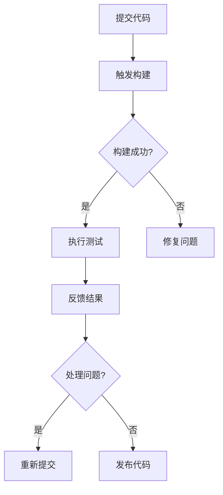

                 

## 第2章: 持续集成（CI）原理与实践

### 2.1.1 持续集成的背景与重要性

持续集成（Continuous Integration，简称CI）是敏捷开发中的一种实践，旨在通过频繁地将代码变更集成到主分支，以尽早发现并修复潜在的问题。持续集成起源于软件工程领域，随着敏捷开发方法的普及，CI逐渐成为软件开发过程中不可或缺的一环。

#### 问题背景

在传统的软件开发模式中，开发团队通常会在项目后期进行集成，这种做法容易导致以下问题：

- **代码冲突**：多个开发者同时修改同一模块，容易产生代码冲突。
- **质量隐患**：后期集成时，潜在的问题可能被掩盖，直到项目临近发布时才被发现，修复成本较高。
- **项目停滞**：集成失败可能导致整个项目停滞，影响进度。

#### 问题描述

为了解决上述问题，持续集成应运而生，其主要目标是：

- **提高代码质量**：通过自动化测试，确保每次代码变更都符合质量标准。
- **减少集成风险**：频繁的代码集成，可以尽早发现并解决冲突和bug。
- **加速开发进度**：快速集成，可以确保项目始终处于可运行状态。

#### 问题解决

持续集成通过以下措施实现上述目标：

- **自动化测试**：每次代码变更后，立即执行自动化测试，确保变更不影响现有功能。
- **持续反馈**：测试结果实时反馈，让开发者及时了解代码质量。
- **快速修复**：发现问题时，可以迅速定位并修复，减少影响范围。

### 2.1.2 持续集成的核心概念与联系

#### 核心概念

持续集成涉及以下几个核心概念：

1. **代码库**：存放所有代码的仓库，通常使用Git进行版本控制。
2. **自动化测试**：对代码进行自动化测试，确保每次变更的质量。
3. **构建**：将代码编译、打包，生成可执行文件的过程。
4. **反馈机制**：将测试结果、构建状态等信息反馈给开发者。

#### 概念联系

持续集成中的各个概念相互关联，形成了一个完整的流程：

- **代码库** → **自动化测试**：开发者将代码提交到代码库，触发自动化测试。
- **自动化测试** → **构建**：测试通过后，开始构建过程。
- **构建** → **反馈机制**：构建成功或失败，将结果反馈给开发者。

#### 概念属性特征对比表格

| 概念         | 属性特征                                                     | 对比说明                                       |
| ------------ | ------------------------------------------------------------ | ---------------------------------------------- |
| 代码库       | 存放代码、版本控制、多人协作                           | Git是主流代码库，支持分支管理、合并冲突解决       |
| 自动化测试   | 频繁执行、覆盖全面、节省人力成本                     | 单元测试、集成测试、性能测试等                   |
| 构建         | 编译、打包、生成可执行文件                           | Maven、Gradle等是常见的构建工具                   |
| 反馈机制     | 实时、透明、可追溯                                     | 钩子、Webhook、邮件通知等                       |

#### 概念结构与核心要素组成

持续集成包含以下几个核心要素：

1. **代码库**：存储代码和版本，是CI的基础。
2. **自动化测试**：确保代码质量，是CI的核心。
3. **构建工具**：实现代码的编译、打包，是CI的执行层。
4. **反馈机制**：实时通知、记录日志，是CI的保障。

### 2.1.3 持续集成的原理与流程

持续集成的原理可以概括为“频繁提交，频繁集成，自动化测试，快速反馈”。

#### 持续集成的原理

持续集成基于以下几个原则：

1. **频繁提交**：开发者频繁提交代码，以尽早发现问题。
2. **频繁集成**：定期将代码合并到主分支，确保集成过程频繁。
3. **自动化测试**：通过自动化测试，确保每次变更的质量。
4. **快速反馈**：测试结果实时反馈，让开发者及时了解代码状态。

#### 持续集成的流程

持续集成的流程一般包括以下几个步骤：

1. **提交代码**：开发者将代码提交到代码库。
2. **触发构建**：提交后，触发构建过程，包括编译、打包等。
3. **执行测试**：构建完成后，执行自动化测试，包括单元测试、集成测试等。
4. **反馈结果**：测试结果实时反馈，包括通过、失败等信息。
5. **处理问题**：根据测试结果，修复问题，重新提交代码。

#### 持续集成的mermaid流程图

### 2.1.4 持续集成的工具与平台

持续集成需要依赖一系列工具和平台，以下是一些主流的CI工具和平台：

#### Jenkins

Jenkins是一个开源的持续集成工具，支持各种插件，可以方便地搭建CI流水线。Jenkins通过Web界面管理构建过程，可以与Git、Maven等工具集成。

#### GitLab CI/CD

GitLab CI/CD是GitLab自带的持续集成与持续交付工具，可以自动化执行构建、测试和部署任务。GitLab CI/CD配置简单，支持多种语言和框架。

#### Azure DevOps

Azure DevOps是微软推出的集成化开发、交付和管理平台，提供CI/CD服务。Azure DevOps支持多种编程语言和框架，可以与Azure云服务集成。

### 2.1.5 持续集成在AI领域的应用

#### AI Agent开发流程与CI/CD实践

在AI领域的AI Agent开发过程中，CI/CD同样发挥着重要作用。AI Agent的开发流程通常包括数据预处理、模型训练、模型评估、模型部署等阶段，CI/CD在各个阶段的应用如下：

1. **数据预处理**：自动化处理数据，确保数据的一致性和准确性。
2. **模型训练**：自动化训练模型，提高模型质量。
3. **模型评估**：自动化评估模型性能，筛选最优模型。
4. **模型部署**：自动化部署模型，确保部署成功。

#### 数据预处理

数据预处理是AI Agent开发的基础，CI/CD可以通过以下方式优化数据预处理流程：

- **自动化数据采集**：通过定时任务或Webhook，自动化采集数据。
- **数据质量检查**：在构建过程中，执行数据质量检查，确保数据符合要求。
- **数据清洗**：自动化执行数据清洗任务，包括去重、补全、转换等。

#### 模型训练

模型训练是AI Agent开发的重点，CI/CD可以通过以下方式优化模型训练流程：

- **自动化训练脚本**：编写自动化训练脚本，确保训练过程一致性和可重复性。
- **模型版本管理**：在每次训练后，生成模型版本，便于后续评估和部署。
- **分布式训练**：利用CI/CD平台，实现分布式训练，提高训练效率。

#### 模型评估

模型评估是确保AI Agent性能的关键，CI/CD可以通过以下方式优化模型评估流程：

- **自动化评估脚本**：编写自动化评估脚本，执行各种评估指标。
- **评估结果存储**：将评估结果存储在数据库或文件中，便于后续分析。
- **多模型比较**：自动化执行多模型比较，选择最优模型。

#### 模型部署

模型部署是AI Agent开发的重要环节，CI/CD可以通过以下方式优化模型部署流程：

- **自动化部署脚本**：编写自动化部署脚本，确保部署过程一致性和可重复性。
- **部署环境管理**：自动化管理不同部署环境，确保环境一致性。
- **监控与反馈**：实时监控模型运行状态，及时反馈问题。

### 2.1.6 持续集成的最佳实践

#### 最佳实践1：自动化测试覆盖

确保自动化测试覆盖全面，包括单元测试、集成测试、性能测试等。在构建过程中，必须执行所有测试，确保代码质量。

#### 最佳实践2：代码质量检查

在构建过程中，执行代码质量检查，包括代码风格、依赖管理、安全性等。通过静态代码分析工具，及时发现并修复潜在问题。

#### 最佳实践3：持续反馈

确保测试结果和构建状态实时反馈，让开发者及时了解代码状态。可以通过邮件、IM、Webhook等方式，实现实时通知。

#### 最佳实践4：版本管理

合理管理代码版本，确保每个版本都经过充分测试。在发布时，标记版本号，便于后续跟踪和回滚。

#### 最佳实践5：持续优化

持续优化CI/CD流程，根据反馈和需求，不断改进和完善。通过定期回顾和评估，确保CI/CD系统的高效性和可靠性。

### 本章小结

本章介绍了持续集成的背景、重要性、核心概念与联系、原理与流程、工具与平台以及在AI领域的应用。通过本章的学习，读者将能够理解持续集成的原理和实践，掌握CI/CD在AI Agent开发中的应用方法。接下来，我们将深入探讨持续交付（CD）的相关内容。

