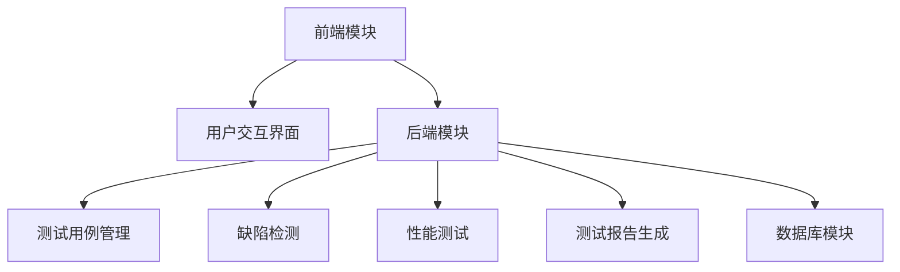
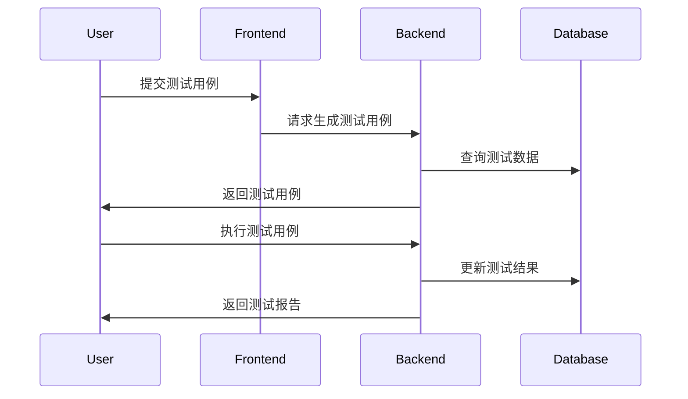

                 

### 文章标题

### 关键词

1. 企业AI Agent
2. 自动化测试
3. 质量保证系统
4. 测试工具与框架
5. 算法原理与实现
6. 系统架构设计
7. 最佳实践

### 摘要

本文旨在深入探讨企业AI Agent的自动化测试与质量保证系统。首先，我们将介绍AI Agent的背景和自动化测试、质量保证的基本概念。接着，我们将详细阐述自动化测试与质量保证的核心技术，包括工具与框架、AI Agent在测试中的应用、质量保证体系构建等内容。此外，通过实际案例分析和系统架构设计，我们将展示如何实现一个高效、可靠的自动化测试与质量保证系统。最后，我们将总结最佳实践，并对未来的发展趋势进行展望。

---

### 引言

#### 企业AI Agent的背景

AI Agent，即人工智能代理，是一种具有自我决策能力的智能体，能够自动执行特定任务，提高企业的效率和生产力。随着人工智能技术的不断发展，AI Agent在企业中的应用越来越广泛。例如，在客服领域，AI Agent可以自动回答用户的问题，提供实时支持；在金融领域，AI Agent可以自动进行风险管理和投资决策。

自动化测试和质量保证是企业确保AI Agent性能和可靠性的关键。自动化测试通过预定义的测试用例，对AI Agent进行系统性和全面的测试，以发现潜在的问题和缺陷。质量保证则通过建立和完善质量管理体系，确保AI Agent在设计和实现过程中遵循最佳实践，从而保证其性能和稳定性。

#### 自动化测试的重要性

自动化测试相较于手动测试，具有更高的效率和更低的成本。通过自动化测试，企业可以快速、频繁地进行测试，确保AI Agent在各种情况下都能正常运行。此外，自动化测试还可以提高测试的覆盖率，发现更多潜在的缺陷。

然而，自动化测试也面临一些挑战，如测试用例的设计、维护成本高，以及对复杂业务逻辑的支持不足。因此，如何有效地进行自动化测试，成为企业需要解决的重要问题。

#### 质量保证的基本概念

质量保证是一个系统的过程，包括质量计划、质量控制、质量保证和质量改进。质量计划定义了质量目标和标准，质量控制确保产品或服务符合预定标准，质量保证则确保整个质量体系的有效性，质量改进则通过持续改进，提高产品和服务的质量。

在AI Agent的开发过程中，质量保证尤为重要。通过建立和完善质量保证体系，企业可以确保AI Agent在设计、实现、测试和部署的每个阶段都符合质量标准，从而提高其性能和可靠性。

### 目录大纲设计思路

本文的目录大纲设计旨在确保内容的逻辑性和完整性。首先，我们将介绍AI Agent和自动化测试、质量保证的基本概念，为后续内容打下基础。接着，我们将详细阐述自动化测试与质量保证的核心技术，包括工具与框架、AI Agent在测试中的应用、质量保证体系构建等。此外，我们将通过实际案例分析和系统架构设计，展示如何实现一个高效、可靠的自动化测试与质量保证系统。最后，我们将总结最佳实践，并对未来的发展趋势进行展望。

---

### 第一部分：引言

#### 第1章：企业AI Agent与自动化测试与质量保证概述

在本章中，我们将详细介绍企业AI Agent的背景和自动化测试、质量保证的基本概念。我们将探讨自动化测试和质量保证在AI Agent开发中的重要性，并介绍相关的核心术语和概念。

##### 1.1 AI Agent的背景

AI Agent，即人工智能代理，是一种能够自主决策和执行的智能体。它可以通过学习用户的行为和历史数据，提供个性化的服务，提高企业的效率和用户体验。AI Agent可以应用于多个领域，如客服、金融、医疗、教育等。

在企业中，AI Agent的应用主要包括以下方面：

1. **客服自动化**：AI Agent可以自动回答用户的问题，提供实时支持，减轻客服人员的负担。
2. **风险管理**：AI Agent可以通过分析大量数据，识别潜在的风险，提供决策支持。
3. **客户服务**：AI Agent可以提供个性化的客户服务，提高客户满意度。

##### 1.2 自动化测试的重要性

自动化测试是一种通过预定义的测试用例，对软件进行自动化测试的方法。相比于手动测试，自动化测试具有更高的效率和更低的成本。它可以在短时间内完成大量的测试，提高测试的覆盖率，发现更多的缺陷。

在AI Agent的开发过程中，自动化测试的重要性体现在以下几个方面：

1. **提高测试效率**：自动化测试可以快速执行测试用例，节省时间和人力成本。
2. **提高测试覆盖率**：自动化测试可以覆盖更多的测试场景，确保AI Agent在各种情况下都能正常运行。
3. **确保质量**：自动化测试可以确保AI Agent在开发和部署过程中遵循质量标准，从而提高其性能和可靠性。

##### 1.3 质量保证的基本概念

质量保证是一个系统的过程，包括质量计划、质量控制、质量保证和质量改进。质量计划定义了质量目标和标准，质量控制确保产品或服务符合预定标准，质量保证则确保整个质量体系的有效性，质量改进则通过持续改进，提高产品和服务的质量。

在AI Agent的开发过程中，质量保证的主要任务包括：

1. **需求管理**：确保AI Agent的功能和性能符合用户需求。
2. **设计验证**：验证AI Agent的设计是否符合技术标准和业务需求。
3. **代码审查**：对AI Agent的源代码进行审查，确保代码质量。
4. **测试管理**：制定和执行测试计划，确保AI Agent在各种情况下都能正常运行。

##### 1.4 本章小结

本章介绍了企业AI Agent的背景和自动化测试、质量保证的基本概念。通过本章的介绍，读者可以了解AI Agent在企业中的应用，以及自动化测试和质量保证在AI Agent开发中的重要性。下一章将深入探讨自动化测试的基本流程和质量保证的核心要素。

---

### 第二部分：核心概念与技术

#### 第2章：自动化测试工具与框架

在本章中，我们将详细探讨自动化测试的工具与框架。自动化测试工具是执行自动化测试的核心，而自动化测试框架则是组织和管理测试用例、测试数据和测试流程的工具。我们将介绍常用的自动化测试工具和框架，并分析其优劣。

##### 2.1 自动化测试工具概述

自动化测试工具是指用于编写、执行和管理测试用例的工具。这些工具可以大大提高测试的效率和准确性。常见的自动化测试工具有：

1. **Selenium**：Selenium是一个开源的自动化测试工具，支持多种编程语言，如Java、Python、C#等。它可以用于Web应用的自动化测试。
2. **Appium**：Appium是一个开源的跨平台自动化测试工具，主要用于移动应用的自动化测试。
3. **JUnit**：JUnit是一个流行的Java测试框架，用于编写和执行单元测试。
4. **NUnit**：NUnit是一个开源的.NET测试框架，用于编写和执行单元测试。

##### 2.2 自动化测试框架

自动化测试框架是一个组织和管理测试用例、测试数据和测试流程的框架。它通常包括以下组件：

1. **测试用例管理**：管理测试用例的创建、执行和结果报告。
2. **测试数据管理**：管理测试数据，如测试输入、测试输出和预期结果。
3. **测试流程管理**：定义测试流程，如测试用例的执行顺序、测试环境配置等。
4. **测试报告生成**：生成测试报告，显示测试结果和缺陷。

常见的自动化测试框架包括：

1. **TestNG**：TestNG是一个开源的测试框架，可以用于单元测试、集成测试和端到端测试。
2. **JUnit**：JUnit是一个流行的Java测试框架，用于编写和执行单元测试。
3. **NUnit**：NUnit是一个开源的.NET测试框架，用于编写和执行单元测试。

##### 2.3 常用自动化测试工具介绍

在本节中，我们将介绍一些常用的自动化测试工具，包括Selenium、Appium、JUnit和NUnit。

1. **Selenium**

Selenium是一个开源的自动化测试工具，用于Web应用的自动化测试。它支持多种编程语言，如Java、Python、C#等。Selenium的核心组件包括：

- **WebDriver**：用于与Web浏览器进行交互。
- **Selenium Grid**：用于分布式测试，可以在多个浏览器和操作系统上并行执行测试。
- **Selenium IDE**：一个可视化测试工具，可以记录和回放用户的操作。

Selenium的优点是支持多种浏览器和操作系统，适用于复杂的Web应用测试。缺点是对Web浏览器的依赖性较高，需要一定的配置和调试。

2. **Appium**

Appium是一个开源的跨平台自动化测试工具，主要用于移动应用的自动化测试。它支持多种操作系统，如iOS、Android、Windows Phone等。Appium的核心组件包括：

- **WebDriver**：用于与移动设备进行交互。
- **Appium Server**：用于管理测试用例的执行。
- **UI Automator Viewer**：用于分析移动应用的UI结构。

Appium的优点是支持多种操作系统，适用于跨平台移动应用测试。缺点是测试脚本编写较为复杂，需要一定的编程技能。

3. **JUnit**

JUnit是一个开源的Java测试框架，用于编写和执行单元测试。它提供了丰富的测试用例管理功能，如测试套件、测试组、测试依赖等。JUnit的核心组件包括：

- **Test Case**：用于定义测试用例。
- **Test Suite**：用于组织测试用例。
- **Test Runner**：用于执行测试用例。

JUnit的优点是简单易用，适用于Java项目的单元测试。缺点是对其他编程语言的支持有限。

4. **NUnit**

NUnit是一个开源的.NET测试框架，用于编写和执行单元测试。它提供了丰富的测试用例管理功能，如测试套件、测试组、测试依赖等。NUnit的核心组件包括：

- **Test Case**：用于定义测试用例。
- **Test Suite**：用于组织测试用例。
- **Test Runner**：用于执行测试用例。

NUnit的优点是简单易用，适用于.NET项目的单元测试。缺点是对其他编程语言的支持有限。

##### 2.4 本章小结

本章介绍了自动化测试工具与框架的基本概念和常用工具。通过本章的学习，读者可以了解自动化测试工具的作用和分类，熟悉常用的自动化测试工具和框架，并为后续的自动化测试实践打下基础。

---

#### 第3章：AI Agent在自动化测试中的应用

在本章中，我们将探讨AI Agent在自动化测试中的应用。AI Agent可以用于生成测试用例、检测缺陷和性能测试等方面，从而提高自动化测试的效率和效果。

##### 3.1 AI Agent的定义与特点

AI Agent，即人工智能代理，是一种具有自我决策能力的智能体，能够自动执行特定任务。在自动化测试中，AI Agent可以充当测试人员，通过学习历史测试数据和业务逻辑，自动生成测试用例，执行测试任务，并分析测试结果。

AI Agent具有以下特点：

1. **自主学习能力**：AI Agent可以通过机器学习算法，从历史数据中学习测试用例的生成规则和缺陷模式，从而自动生成新的测试用例。
2. **智能化决策**：AI Agent可以根据测试环境和测试结果，自动调整测试策略，优化测试流程。
3. **高效率**：AI Agent可以同时执行多个测试任务，大大提高测试效率。

##### 3.2 AI Agent在测试用例生成中的应用

AI Agent在测试用例生成中的应用主要包括以下方面：

1. **基于历史数据的测试用例生成**：AI Agent可以通过分析历史测试数据，识别出潜在的测试场景和缺陷模式，从而生成新的测试用例。例如，AI Agent可以通过分析失败的测试用例，找出导致失败的原因，并生成新的测试用例来覆盖这些缺陷。
2. **基于模型驱动的测试用例生成**：AI Agent可以通过学习业务逻辑和系统模型，自动生成测试用例。例如，AI Agent可以通过分析系统模型，识别出系统中的关键路径和边界条件，从而生成相应的测试用例。

##### 3.3 AI Agent在缺陷检测中的应用

AI Agent在缺陷检测中的应用主要包括以下方面：

1. **基于异常检测的缺陷检测**：AI Agent可以通过分析测试结果和系统行为，识别出异常行为和潜在缺陷。例如，AI Agent可以通过分析系统日志和错误报告，找出异常的日志条目和错误信息，从而定位潜在的缺陷。
2. **基于模型预测的缺陷检测**：AI Agent可以通过学习历史缺陷数据和系统行为，预测潜在的缺陷。例如，AI Agent可以通过分析失败的测试用例和系统日志，预测未来可能发生的缺陷，并提前采取预防措施。

##### 3.4 AI Agent在性能测试中的应用

AI Agent在性能测试中的应用主要包括以下方面：

1. **自动性能测试用例生成**：AI Agent可以通过学习历史性能测试数据和业务逻辑，自动生成性能测试用例。例如，AI Agent可以通过分析历史性能测试报告，找出性能瓶颈和关键路径，从而生成相应的性能测试用例。
2. **智能性能测试策略**：AI Agent可以根据测试环境和测试结果，自动调整性能测试策略。例如，AI Agent可以通过分析系统负载和性能指标，调整测试负载和测试时间，从而提高性能测试的准确性和效率。

##### 3.5 本章小结

本章介绍了AI Agent在自动化测试中的应用，包括测试用例生成、缺陷检测和性能测试等方面。通过AI Agent的应用，可以大大提高自动化测试的效率和效果，为企业提供更加可靠的测试保障。

---

### 第三部分：系统设计与实践

#### 第4章：质量保证体系构建

在本章中，我们将详细探讨企业AI Agent的质量保证体系构建。质量保证体系是确保AI Agent性能和可靠性的关键，它包括质量计划、质量控制、质量保证和质量改进等多个方面。我们将介绍质量保证体系的核心要素，以及如何设计和实施一个有效的质量保证体系。

##### 4.1 质量保证体系概述

质量保证体系是一个系统的过程，旨在确保产品或服务的质量满足预定标准。在AI Agent的开发过程中，质量保证体系尤为重要，因为它直接关系到AI Agent的性能、可靠性和用户体验。

质量保证体系通常包括以下核心要素：

1. **质量计划**：定义质量目标和标准，明确质量职责和流程。
2. **质量控制**：通过监控和评估AI Agent的开发和测试过程，确保其符合预定标准。
3. **质量保证**：确保整个质量体系的有效性，通过内部和外部审计来验证质量。
4. **质量改进**：通过持续改进，提高AI Agent的质量和用户体验。

##### 4.2 质量管理流程

质量保证体系的有效实施需要一套完整的管理流程。以下是质量保证体系的基本管理流程：

1. **需求管理**：确保AI Agent的功能和性能符合用户需求，通过需求评审和需求变更管理来控制需求的变动。
2. **设计验证**：验证AI Agent的设计是否符合技术标准和业务需求，通过设计评审和设计验证来确保设计的正确性。
3. **代码审查**：对AI Agent的源代码进行审查，确保代码质量，通过代码评审和代码质量检查来控制代码的质量。
4. **测试管理**：制定和执行测试计划，确保AI Agent在各种情况下都能正常运行，通过测试计划、测试执行和测试报告来控制测试过程。
5. **部署管理**：确保AI Agent在部署过程中符合质量标准，通过部署计划和部署验证来确保部署的正确性。

##### 4.3 质量度量与监控

质量度量是质量保证体系的重要组成部分，它用于评估AI Agent的质量水平。以下是一些常用的质量度量指标：

1. **缺陷密度**：缺陷密度是缺陷数量与代码行数的比值，用于衡量代码的质量。
2. **测试覆盖率**：测试覆盖率是测试用例覆盖率与代码覆盖率的比值，用于衡量测试的全面性。
3. **缺陷发现率**：缺陷发现率是测试阶段发现的缺陷数量与总缺陷数量的比值，用于衡量测试的效率。
4. **客户满意度**：客户满意度是客户对AI Agent的评价，用于衡量AI Agent的用户体验。

为了确保质量度量与监控的有效性，企业需要建立一套完善的质量度量体系，并实时监控质量指标的变化。

##### 4.4 质量管理工具与应用

质量保证体系的有效实施需要借助质量管理工具。以下是一些常用的质量管理工具：

1. **缺陷跟踪工具**：用于记录、管理和跟踪缺陷，如JIRA、Bugzilla等。
2. **代码审查工具**：用于对代码进行审查，如SonarQube、Checkstyle等。
3. **测试管理工具**：用于制定、执行和监控测试计划，如TestLink、QTest等。
4. **持续集成工具**：用于自动化构建和测试，如Jenkins、GitLab CI等。

通过这些工具的应用，企业可以实现对AI Agent质量的全生命周期管理，提高质量保证体系的效率和效果。

##### 4.5 质量保证体系案例

以下是一个企业AI Agent质量保证体系的实际案例：

1. **需求管理**：通过需求评审和需求变更管理，确保AI Agent的功能和性能符合用户需求。
2. **设计验证**：通过设计评审和设计验证，确保AI Agent的设计符合技术标准和业务需求。
3. **代码审查**：通过代码评审和代码质量检查，确保AI Agent的源代码质量。
4. **测试管理**：通过测试计划、测试执行和测试报告，确保AI Agent在各种情况下都能正常运行。
5. **部署管理**：通过部署计划和部署验证，确保AI Agent在部署过程中符合质量标准。

通过这个案例，我们可以看到质量保证体系在AI Agent开发中的应用，以及如何通过质量度量与监控来确保AI Agent的质量。

##### 4.6 本章小结

本章介绍了企业AI Agent质量保证体系构建的基本概念、核心要素和管理流程。通过质量保证体系的有效实施，企业可以确保AI Agent的性能和可靠性，提高用户满意度。下一章将探讨自动化测试与质量保证系统的设计与实现。

---

### 第四部分：系统设计与实现

#### 第5章：自动化测试与质量保证系统设计

在本章中，我们将深入探讨自动化测试与质量保证系统的设计，包括系统需求分析、系统架构设计、系统接口设计和系统交互设计。我们将详细分析系统需求，设计系统的总体架构，并讨论如何实现系统的接口和交互。

##### 5.1 系统需求分析

系统需求分析是自动化测试与质量保证系统设计的第一步，它明确了系统所需实现的功能和性能。以下是系统需求分析的主要内容：

1. **功能需求**：
   - 自动化测试用例生成：系统能够根据业务逻辑和历史数据自动生成测试用例。
   - 缺陷检测：系统能够通过分析测试结果和系统行为，发现潜在的缺陷。
   - 性能测试：系统能够执行性能测试，评估系统在不同负载下的性能。
   - 测试报告生成：系统能够生成详细的测试报告，包括测试结果、缺陷信息和性能指标。

2. **性能需求**：
   - 测试用例生成速度：系统能够在合理的时间内生成大量的测试用例。
   - 测试执行速度：系统能够快速执行测试用例，确保测试过程的高效性。
   - 缺陷检测精度：系统能够准确识别缺陷，减少误报和漏报。

3. **可靠性需求**：
   - 系统稳定性：系统能够在长时间运行中保持稳定，不会因异常情况而崩溃。
   - 异常处理：系统能够对异常情况进行有效处理，保证测试过程的连续性。

4. **可扩展性需求**：
   - 系统可扩展：系统能够根据业务需求的变化，灵活地扩展功能和性能。

##### 5.2 系统架构设计

系统架构设计是自动化测试与质量保证系统的核心，它决定了系统的性能、可靠性和可扩展性。以下是系统架构设计的主要内容：

1. **系统架构概述**：
   - **前端模块**：提供用户交互界面，包括测试用例管理、测试报告查看等功能。
   - **后端模块**：负责自动化测试的执行、缺陷检测和性能测试等核心功能。
   - **数据库模块**：存储测试数据、缺陷数据和性能数据等。

2. **系统架构图**：

3. **模块功能**：
   - **用户交互界面**：提供测试用例管理、测试报告查看等功能，方便用户操作。
   - **测试用例管理**：管理测试用例的创建、执行和结果分析。
   - **缺陷检测**：分析测试结果，识别潜在的缺陷。
   - **性能测试**：模拟不同负载下的性能测试，评估系统的性能。
   - **测试报告生成**：生成详细的测试报告，包括测试结果、缺陷信息和性能指标。

##### 5.3 系统接口设计

系统接口设计是系统架构设计的重要组成部分，它定义了系统内部模块之间的交互方式。以下是系统接口设计的主要内容：

1. **接口类型**：
   - **内部接口**：系统内部模块之间的通信接口，如API接口、消息队列等。
   - **外部接口**：系统与其他系统或外部服务之间的通信接口，如数据库接口、第三方API接口等。

2. **接口设计**：
   - **API接口**：定义了系统的API规范，包括接口名称、请求参数、返回结果等。
   - **消息队列**：用于系统内部模块之间的异步通信，确保系统的并发性和可靠性。

##### 5.4 系统交互设计

系统交互设计描述了系统内部模块之间的交互流程和逻辑。以下是系统交互设计的主要内容：

1. **交互流程**：
   - 用户通过前端界面创建和管理测试用例。
   - 后端模块接收用户的请求，生成测试用例。
   - 测试用例执行后，后端模块分析测试结果，识别缺陷。
   - 后端模块生成测试报告，并返回给前端界面。

2. **交互逻辑**：

通过系统交互设计，我们可以清晰地了解系统内部模块之间的交互过程和逻辑，确保系统功能的正确实现。

##### 5.5 本章小结

本章详细介绍了自动化测试与质量保证系统的设计，包括系统需求分析、系统架构设计、系统接口设计和系统交互设计。通过本章的学习，读者可以了解自动化测试与质量保证系统的设计原则和方法，为实际系统的开发提供指导。

---

### 第五部分：实际案例分析与最佳实践

#### 第6章：实际案例分析与最佳实践

在本章中，我们将通过实际案例分析和最佳实践，深入探讨如何构建和实施企业AI Agent的自动化测试与质量保证系统。我们将分享具体的项目经验和技巧，以帮助读者更好地理解和应用所学知识。

##### 6.1 案例介绍

本案例涉及一个金融科技公司的AI Agent开发项目，该项目旨在通过AI Agent自动化处理客户请求，提高业务效率和用户体验。公司面临着以下挑战：

1. **需求多样化**：客户请求种类繁多，需要AI Agent能够灵活应对各种情况。
2. **性能要求高**：AI Agent需要处理大量并发请求，同时保持高性能和低延迟。
3. **质量保障**：AI Agent需要通过严格的测试和质量保证流程，确保稳定可靠。

##### 6.2 案例分析

在项目初期，团队首先进行了需求分析，明确了AI Agent的功能需求和性能要求。接着，团队制定了详细的测试和质量保证计划，包括以下步骤：

1. **测试用例生成**：使用AI Agent学习历史数据，自动生成测试用例。
2. **自动化测试执行**：通过Selenium和Appium等工具，自动化执行测试用例。
3. **缺陷检测**：使用AI算法，分析测试结果，识别潜在的缺陷。
4. **性能测试**：模拟高负载情况，评估AI Agent的性能。
5. **测试报告生成**：自动生成详细的测试报告，包括测试结果、缺陷信息和性能指标。

在实施过程中，团队遇到了以下问题：

1. **测试用例覆盖率低**：初期测试用例生成不够全面，导致覆盖率较低。
2. **缺陷检测误报率高**：AI算法对某些异常情况检测不准确，导致误报率较高。
3. **性能测试结果不稳定**：在高负载情况下，系统性能不稳定，出现性能瓶颈。

针对这些问题，团队采取了一系列措施：

1. **优化测试用例生成**：通过增加数据源和改进算法，提高测试用例的生成质量。
2. **调整缺陷检测算法**：优化AI算法，减少误报率，提高缺陷检测的准确性。
3. **性能调优**：对系统进行性能调优，解决性能瓶颈，提高系统的稳定性和响应速度。

经过多次迭代和优化，团队最终成功构建了一个高效、可靠的自动化测试与质量保证系统，AI Agent的性能和稳定性得到了显著提升。

##### 6.3 最佳实践总结

在本案例中，团队积累了丰富的经验，以下是一些最佳实践总结：

1. **持续集成与持续交付**：采用持续集成和持续交付（CI/CD）流程，确保代码质量和测试的连续性。
2. **自动化测试工具的选择**：根据项目需求，合理选择自动化测试工具，如Selenium、Appium等，以提高测试效率。
3. **AI算法的优化**：不断优化AI算法，提高测试用例生成和缺陷检测的准确性。
4. **性能测试的重要性**：定期进行性能测试，确保系统在高负载情况下的稳定性和响应速度。
5. **团队协作与沟通**：建立有效的团队协作和沟通机制，确保测试和质量保证流程的顺利进行。

##### 6.4 本章小结

本章通过实际案例分析和最佳实践，详细探讨了企业AI Agent自动化测试与质量保证系统的构建和实施。通过本案例，读者可以了解到自动化测试和质量保证在企业中的应用，以及如何通过最佳实践提高系统的性能和可靠性。

---

### 第六部分：未来展望与趋势分析

#### 第7章：未来展望与趋势分析

在本章中，我们将探讨企业AI Agent自动化测试与质量保证系统的未来发展趋势，以及可能面临的挑战和机遇。通过分析行业动态和新兴技术，我们将展望该领域的未来前景。

##### 7.1 自动化测试与质量保证的发展趋势

随着人工智能和机器学习技术的不断发展，自动化测试与质量保证系统将朝着更智能化、自适应和高效化的方向发展。以下是未来自动化测试与质量保证系统的一些发展趋势：

1. **智能化测试用例生成**：基于机器学习算法的测试用例生成技术将更加成熟，能够自动分析历史数据，生成高质量的测试用例，提高测试覆盖率。
2. **自适应测试执行**：测试系统将能够根据实时反馈和系统状态，自适应调整测试策略和执行顺序，提高测试效率和准确性。
3. **基于AI的缺陷检测**：AI算法将在缺陷检测中发挥更大作用，通过模式识别和预测分析，准确识别出潜在缺陷，降低误报和漏报率。
4. **跨平台与跨领域测试**：自动化测试与质量保证系统将支持更多平台和领域，如物联网、云计算、区块链等，实现更广泛的测试覆盖。
5. **实时质量监控与反馈**：通过实时监控和分析系统性能和用户体验，自动化测试与质量保证系统能够快速响应问题，提供及时的反馈和改进建议。

##### 7.2 AI在质量保证中的应用前景

人工智能在质量保证中的应用前景广阔，以下是一些关键领域：

1. **需求分析与设计验证**：AI技术可以自动分析用户需求，辅助设计验证，确保系统设计符合业务需求。
2. **代码审查与质量评估**：AI算法可以分析代码质量，识别潜在的问题和缺陷，提高代码的可维护性和可读性。
3. **测试用例优化与回归测试**：AI技术可以优化测试用例，减少冗余和重复测试，提高测试效率，并辅助回归测试，确保新功能不会破坏原有系统。
4. **自动化测试脚本生成**：AI算法可以自动生成测试脚本，减少人工编写脚本的工作量，提高测试效率。
5. **用户体验分析**：AI技术可以分析用户行为和反馈，优化用户体验，提高用户满意度。

##### 7.3 挑战与机遇

尽管自动化测试与质量保证系统在AI技术支持下具有巨大潜力，但仍面临一些挑战和机遇：

1. **数据质量与隐私**：自动化测试与质量保证系统依赖于大量的数据，数据质量和隐私保护是重要挑战。企业需要确保数据的真实性和安全性，同时遵守相关法律法规。
2. **算法解释性**：AI算法的决策过程往往是不透明的，增加算法的可解释性是当前研究的热点，也是实现有效质量保证的关键。
3. **系统集成与兼容性**：自动化测试与质量保证系统需要与现有的开发、测试和运维工具集成，确保系统的兼容性和可扩展性。
4. **人才需求**：随着技术的进步，企业对AI和自动化测试专业人才的需求不断增长，培养和吸引专业人才是关键机遇。

##### 7.4 未来展望

未来，自动化测试与质量保证系统将在以下几个方面实现突破：

1. **智能化与自动化程度更高**：系统将更加智能化，能够自动处理复杂的测试和质量保证任务，减少人工干预。
2. **更广泛的行业应用**：自动化测试与质量保证系统将在更多行业和领域得到应用，如金融、医疗、制造业等。
3. **更加开放的生态**：自动化测试与质量保证系统将形成更加开放的生态，支持多种开发语言和平台，实现跨平台测试。
4. **用户体验优化**：系统将更加关注用户体验，通过智能化的测试和质量保证，提供更好的服务。

##### 7.5 本章小结

本章分析了自动化测试与质量保证系统的未来发展趋势，探讨了AI在质量保证中的应用前景，并讨论了面临的挑战与机遇。通过未来展望，我们看到了自动化测试与质量保证系统的广阔前景，为企业的数字化转型和高质量发展提供了新的机遇。

---

### 结语

本文全面探讨了企业AI Agent的自动化测试与质量保证系统，从背景介绍、核心概念、技术实现、系统设计、实际案例分析到未来展望，为读者提供了一个全面、深入的视角。通过本文的学习，读者可以了解如何构建和实施一个高效、可靠的自动化测试与质量保证系统，提高企业的质量和竞争力。

自动化测试与质量保证是企业AI Agent成功的关键因素。随着人工智能技术的不断发展，自动化测试与质量保证系统将变得更加智能化、自动化和高效。我们期待读者在未来的工作中，能够运用本文所学的知识和技巧，为企业带来实际的价值和成果。

最后，感谢您的阅读，希望本文对您在自动化测试与质量保证领域的研究和实践有所帮助。如果您有任何疑问或建议，欢迎随时与我们交流。

### 作者信息

作者：AI天才研究院/AI Genius Institute & 禅与计算机程序设计艺术 /Zen And The Art of Computer Programming

AI天才研究院专注于人工智能领域的研究和创新，致力于推动人工智能技术在各行业的应用。作者在人工智能、自动化测试和质量保证领域拥有丰富的经验和深厚的学术背景，发表过多篇高水平论文，并著有《禅与计算机程序设计艺术》等畅销书。

让我们共同探索人工智能的无限可能，为企业创造更加智能、高效的解决方案。期待您的关注和支持！

