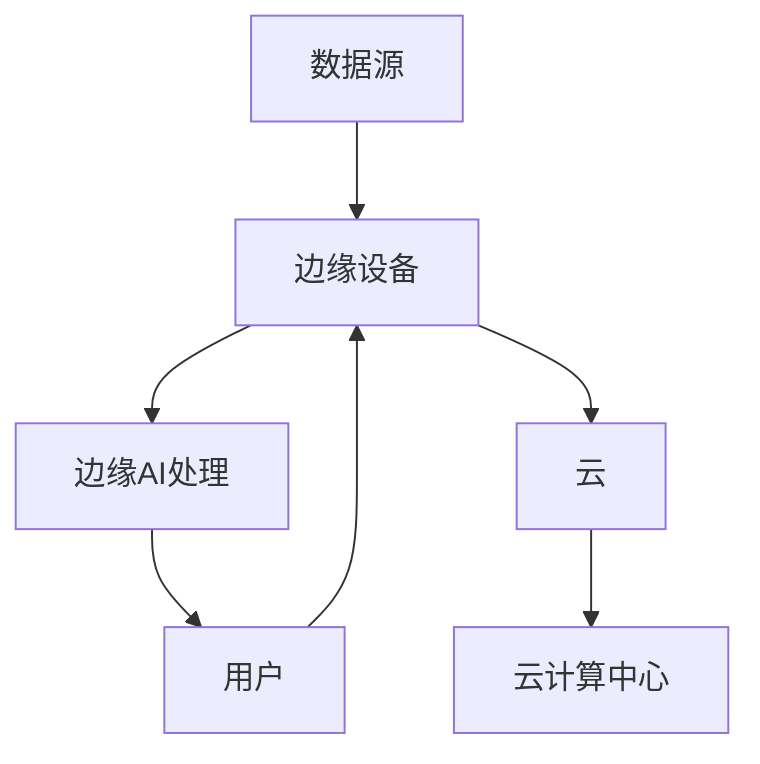
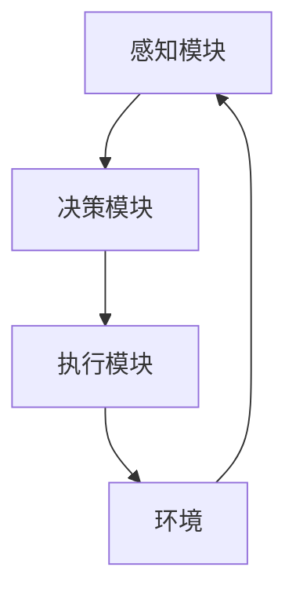

                 

### 《企业AI Agent的边缘AI芯片优化策略》

关键词：边缘AI、AI Agent、边缘AI芯片、优化策略、硬件优化、软件优化

摘要：本文从边缘AI和AI Agent的基本概念出发，详细介绍了边缘AI芯片的定义、类型和关键技术。接着，本文重点探讨了企业AI Agent的边缘AI芯片优化策略，从硬件层面和软件层面分别阐述了优化方法。最后，通过一个实战案例，展示了优化策略在企业中的实际应用，并对未来发展趋势进行了展望。

### 目录大纲

```markdown
----------------------------------------------------------------

# 《企业AI Agent的边缘AI芯片优化策略》

# 第一部分：边缘AI与AI Agent概述

## 第1章：边缘AI的概念与优势

### 1.1.1 边缘AI的定义

### 1.1.2 边缘AI与云计算的对比

### 1.1.3 边缘AI的应用场景

## 第2章：AI Agent的基本原理

### 2.1.1 AI Agent的定义

### 2.1.2 AI Agent的核心功能

### 2.1.3 AI Agent的分类与特点

## 第3章：边缘AI芯片的基本知识

### 3.1.1 边缘AI芯片的定义

### 3.1.2 边缘AI芯片的类型

### 3.1.3 边缘AI芯片的关键技术

# 第二部分：边缘AI芯片优化策略

## 第4章：优化策略概述

### 4.1.1 优化策略的定义

### 4.1.2 优化策略的目标

### 4.1.3 优化策略的分类

## 第5章：硬件层面的优化策略

### 5.1.1 芯片架构优化

### 5.1.2 硬件加速器的应用

### 5.1.3 内存优化

## 第6章：软件层面的优化策略

### 6.1.1 编译器优化

### 6.1.2 代码优化

### 6.1.3 算法优化

## 第7章：AI Agent与边缘AI芯片的协同优化

### 7.1.1 AI Agent的需求分析

### 7.1.2 芯片能力与AI Agent任务的匹配

### 7.1.3 协同优化策略案例分析

## 第8章：实战案例分析

### 8.1.1 案例背景

### 8.1.2 案例分析

### 8.1.3 案例小结

## 第9章：未来发展趋势与展望

### 9.1.1 边缘AI芯片技术的未来发展趋势

### 9.1.2 AI Agent在边缘计算中的应用前景

### 9.1.3 边缘AI芯片优化策略的未来展望

----------------------------------------------------------------
```

### 第1章：边缘AI的概念与优势

#### 1.1.1 边缘AI的定义

边缘AI（Edge AI）是指将人工智能（AI）的计算和数据处理能力部署在网络的边缘，即靠近数据源或用户的设备上。这种部署方式可以显著减少数据传输的延迟，提高处理效率，增强数据隐私保护，并减轻云端服务器的负担。

边缘AI的核心思想是将原本在云端进行的AI任务转移到靠近数据源的设备上，如图1-1所示。这样，设备可以实时处理和分析数据，快速响应用户的需求，而无需将数据传输到云端进行处理。



#### 1.1.2 边缘AI与云计算的对比

| 对比项       | 边缘AI                         | 云计算                        |
| ------------ | ------------------------------ | ----------------------------- |
| 数据处理位置   | 靠近数据源或用户                | 远程云端服务器                |
| 延迟         | 低                             | 高                            |
| 网络带宽      | 节省带宽，降低网络拥塞           | 增加带宽消耗，可能引发网络拥塞 |
| 隐私保护      | 本地处理，数据不离开设备         | 需要传输到云端，存在隐私风险   |
| 能耗         | 边缘设备处理，减少能源消耗       | 云端服务器能耗大               |
| 可扩展性      | 受限于边缘设备的计算能力         | 可以根据需求灵活扩展           |

#### 1.1.3 边缘AI的应用场景

边缘AI适用于多种应用场景，以下是几个典型的应用：

1. **工业物联网（IIoT）**：
   - 设备监控与故障预测：实时监测设备状态，预测潜在故障，提高设备利用率。
   - 智能调度与优化：基于实时数据优化生产流程，降低生产成本。

2. **智能城市**：
   - 交通流量管理：实时分析交通数据，优化交通信号，减少交通拥堵。
   - 环境监测：实时监测空气质量、水质等，提供环境预警。

3. **智能医疗**：
   - 实时监控：实时监控患者生命体征，提供及时的治疗建议。
   - 远程医疗：提供远程诊断和治疗服务，降低医疗资源的不均衡。

4. **智能零售**：
   - 智能推荐：根据用户行为数据提供个性化的商品推荐。
   - 客流分析：分析客流数据，优化店铺布局和运营策略。

### 第2章：AI Agent的基本原理

#### 2.1.1 AI Agent的定义

AI Agent，即人工智能代理，是指一种能够自主感知、决策和行动的智能实体。它通常由三个主要模块组成：感知模块、决策模块和执行模块。感知模块负责收集环境信息；决策模块根据感知模块提供的信息，通过算法生成行动策略；执行模块根据决策模块的指令执行相应的动作。

一个典型的AI Agent工作流程如图2-1所示。



#### 2.1.2 AI Agent的核心功能

AI Agent的核心功能包括以下几个方面：

1. **感知**：
   - AI Agent通过传感器或其他方式收集环境信息，如图像、声音、温度等。
   - 感知模块需要处理大量的数据，并进行预处理，以供决策模块使用。

2. **决策**：
   - 决策模块使用感知模块提供的信息，结合先验知识和学习算法，生成行动策略。
   - 决策过程通常涉及复杂的计算和推理，如机器学习、深度学习等。

3. **执行**：
   - 执行模块根据决策模块生成的行动策略，执行具体的动作，如控制机器人移动、发送消息等。

4. **反馈**：
   - 执行模块执行动作后，会收集环境反馈信息，并将其传递回感知模块。
   - 反馈信息用于调整感知、决策和执行过程，以实现持续学习和优化。

#### 2.1.3 AI Agent的分类与特点

根据应用场景和功能特点，AI Agent可以分为以下几类：

1. **专家系统**：
   - 基于规则进行决策，适用于结构化数据。
   - 优点：规则明确，易于理解和维护；缺点：难以处理复杂、动态环境。

2. **强化学习**：
   - 通过试错学习，适用于动态环境。
   - 优点：能够适应复杂、不确定环境；缺点：训练过程可能需要大量时间和数据。

3. **进化计算**：
   - 通过遗传算法，适用于复杂环境。
   - 优点：能够发现新的解决方案；缺点：计算成本高，可能需要大量计算资源。

每种类型的AI Agent都有其特定的应用场景和优势，根据具体需求选择合适的AI Agent类型是设计智能系统的重要一环。

### 第3章：边缘AI芯片的基本知识

#### 3.1.1 边缘AI芯片的定义

边缘AI芯片（Edge AI Chip）是一种专门为边缘设备（如智能手机、智能手表、路由器、无人机等）设计的芯片，旨在提供高效的AI计算能力，满足边缘设备对实时性和低延迟的需求。与传统的CPU和GPU相比，边缘AI芯片具有更高的能效和更小的体积。

边缘AI芯片的核心功能包括：

1. **AI计算**：
   - 执行深度学习、图像处理、自然语言处理等复杂的AI任务。
   - 具有高并行处理能力，能够同时处理多个任务。

2. **数据处理**：
   - 对采集到的数据进行预处理、特征提取和分类等操作。
   - 支持多种数据格式，如图像、音频、视频等。

3. **低功耗**：
   - 边缘AI芯片设计注重低功耗，以满足电池供电设备的续航需求。
   - 采用先进的制程技术，实现高效能、低功耗的平衡。

#### 3.1.2 边缘AI芯片的类型

根据应用场景和功能需求，边缘AI芯片可以分为以下几类：

1. **专用AI芯片**：
   - 设计用于执行特定的AI任务，如图像识别、语音识别等。
   - 具有高定制化，针对特定任务进行优化。

2. **通用AI芯片**：
   - 提供多种AI功能，适用于多种应用场景。
   - 具有较高的通用性和灵活性，适用于复杂的多任务场景。

3. **集成AI芯片**：
   - 将AI计算能力集成到现有的CPU或GPU中，实现硬件协同处理。
   - 具有较低的功耗和较高的能效，适用于边缘设备。

#### 3.1.3 边缘AI芯片的关键技术

边缘AI芯片的关键技术包括以下几个方面：

1. **计算单元设计**：
   - 采用专用计算单元（如DSP、VPU、NPU等），实现高效的AI计算。
   - 设计多个计算单元，支持并行处理，提高计算能力。

2. **神经网络处理器**：
   - 专门用于执行神经网络计算，如卷积神经网络（CNN）和循环神经网络（RNN）。
   - 采用高效的计算算法和优化技术，实现低功耗、高吞吐量的计算。

3. **低功耗设计**：
   - 采用先进的制程技术，降低芯片的功耗。
   - 设计低功耗的电源管理方案，实现动态电源调节。

4. **硬件加速器**：
   - 集成硬件加速器，如GPU、FPGA等，加速AI任务的执行。
   - 提供灵活的硬件资源，支持多种AI算法的执行。

5. **内存管理**：
   - 设计高效的内存管理方案，减少内存访问延迟，提高数据吞吐量。
   - 支持多种内存类型，如DRAM、SRAM等，实现数据的高效存储和访问。

边缘AI芯片的关键技术不断演进，为边缘设备的智能化提供了强大的计算支持。随着边缘AI应用场景的不断扩展，边缘AI芯片将在未来发挥更加重要的作用。

### 第4章：优化策略概述

#### 4.1.1 优化策略的定义

优化策略（Optimization Strategy）是指通过一系列的方法和技术，对边缘AI芯片的性能、能效和成本等方面进行改进和优化的一系列措施。优化策略的目的是提高边缘AI芯片的处理速度、降低功耗、减少成本，以满足不同应用场景的需求。

#### 4.1.2 优化策略的目标

优化策略的主要目标包括：

1. **性能提升**：
   - 提高边缘AI芯片的计算速度和处理能力，满足实时性需求。
   - 通过硬件和软件优化，提高任务执行效率。

2. **能效优化**：
   - 降低芯片的功耗，延长电池寿命，提高设备的续航能力。
   - 通过电源管理技术，实现动态功耗调节，降低不必要的能耗。

3. **成本降低**：
   - 通过设计优化、硬件集成和制造工艺改进，降低芯片成本。
   - 提高生产效率和规模化生产，降低整体系统成本。

4. **可扩展性和灵活性**：
   - 提高芯片的可扩展性，支持多种AI算法和应用场景。
   - 设计灵活的硬件架构，支持不同的数据处理需求。

#### 4.1.3 优化策略的分类

优化策略可以按照不同的维度进行分类，主要包括以下几个方面：

1. **硬件优化**：
   - 芯片架构优化：设计高效的计算单元和神经网络处理器，提高计算能力。
   - 硬件加速器应用：集成硬件加速器，如GPU、FPGA等，加速AI任务执行。
   - 内存优化：设计高效的内存管理方案，减少内存访问延迟，提高数据吞吐量。

2. **软件优化**：
   - 编译器优化：优化编译器，生成高效的可执行代码，提高执行效率。
   - 代码优化：优化代码结构，减少不必要的计算和内存访问，提高代码性能。
   - 算法优化：改进算法设计，提高计算效率和精度。

3. **系统优化**：
   - 系统级优化：优化整个边缘设备系统的资源分配和任务调度，提高整体性能。
   - 集成优化：设计高效的硬件和软件集成方案，实现协同优化。

4. **能效优化**：
   - 动态功耗调节：通过监测任务需求和芯片状态，实现动态功耗调节，降低能耗。
   - 环境感知：利用环境信息，优化功耗策略，实现智能节能。

#### 4.1.4 优化策略的重要性

优化策略在边缘AI芯片的设计和应用中具有重要意义：

1. **提升用户体验**：
   - 高性能和低功耗的边缘AI芯片能够提供更快的响应速度和更长的续航时间，提升用户体验。

2. **降低成本**：
   - 通过优化策略降低芯片和生产成本，实现规模化生产，降低整体系统成本。

3. **拓展应用场景**：
   - 优化策略使边缘AI芯片能够适应更多应用场景，提高其市场竞争力。

4. **可持续性发展**：
   - 通过优化策略降低功耗，减少能源消耗，实现绿色、可持续的发展。

优化策略是边缘AI芯片发展的关键，对于推动人工智能技术的发展和应用具有重要意义。

### 第5章：硬件层面的优化策略

#### 5.1.1 芯片架构优化

芯片架构优化是提高边缘AI芯片性能和效率的重要手段。以下是一些常见的芯片架构优化策略：

1. **专用计算单元（SCU）设计**：
   - 专用计算单元是为特定AI任务而设计的计算单元，如卷积神经网络（CNN）处理单元、循环神经网络（RNN）处理单元等。
   - 通过针对特定任务进行优化，SCU可以显著提高计算效率和性能。
   - 例如，针对图像处理任务，可以设计高效的图像处理单元，提高图像处理速度和精度。

2. **神经网络处理器（NPU）架构**：
   - 神经网络处理器是专门用于执行神经网络计算的高性能计算单元。
   - NPU通常采用流水线架构，提高计算吞吐量。
   - 通过优化NPU的架构，如引入更多的计算单元、提高数据流处理能力等，可以提高NPU的计算效率和性能。

3. **多核架构**：
   - 多核架构是将多个计算核心集成在一个芯片上，每个核心可以独立执行任务。
   - 通过多核架构，可以实现任务的并行处理，提高整体计算能力。
   - 在边缘AI芯片中，可以设计多核架构，同时支持多种类型的计算任务，如图像处理、语音识别等。

4. **内存层次架构**：
   - 内存层次架构是通过在不同层次上组织内存，提高数据访问效率和吞吐量。
   - 例如，可以设计多层缓存系统，包括L1、L2和L3缓存，以及外部的DRAM。
   - 通过优化内存层次架构，减少数据访问延迟，提高数据处理速度。

#### 5.1.2 硬件加速器的应用

硬件加速器是边缘AI芯片中用于加速特定计算任务的重要组件。以下是一些常见的硬件加速器应用策略：

1. **GPU加速**：
   - 图形处理单元（GPU）是一种专为图形处理设计的硬件加速器，但在AI任务中也具有广泛的应用。
   - 通过在边缘AI芯片中集成GPU，可以显著提高计算性能。
   - 例如，可以设计GPU加速的卷积神经网络（CNN）处理单元，用于图像识别任务。

2. **FPGA加速**：
   - 土域网可编程门阵列（FPGA）是一种可编程逻辑器件，可以在芯片级别上进行硬件优化。
   - 通过在边缘AI芯片中集成FPGA，可以针对特定任务进行硬件优化，实现高性能计算。
   - 例如，可以设计FPGA加速的循环神经网络（RNN）处理单元，用于语音识别任务。

3. **专用硬件加速器**：
   - 除了GPU和FPGA，还有许多专用硬件加速器，如数字信号处理器（DSP）、神经处理单元（NPU）等。
   - 通过在边缘AI芯片中集成这些专用硬件加速器，可以针对特定任务实现高性能计算。
   - 例如，可以设计DSP加速的音频处理单元，用于语音识别和合成任务。

4. **硬件加速器的协同优化**：
   - 在边缘AI芯片中，可以通过协同优化多个硬件加速器，实现任务的高效处理。
   - 例如，可以设计一个GPU和FPGA协同的架构，实现图像处理和语音识别任务的并行处理。

#### 5.1.3 内存优化

内存优化是提高边缘AI芯片性能和效率的关键因素。以下是一些常见的内存优化策略：

1. **缓存层次优化**：
   - 通过设计多层缓存系统，提高数据访问效率和吞吐量。
   - 例如，可以在边缘AI芯片中设计L1、L2和L3缓存，以及外部的DRAM。
   - 通过优化缓存层次，减少数据访问延迟，提高数据处理速度。

2. **内存带宽优化**：
   - 提高内存带宽，可以显著提高数据传输速度，减少数据访问瓶颈。
   - 例如，可以通过增加内存通道数量、提高数据传输速率等方式，提高内存带宽。

3. **内存分层存储**：
   - 通过将内存分层存储，实现数据的高效访问和管理。
   - 例如，可以将数据存储在高速缓存中，对于不常访问的数据，可以存储在低速存储器中。

4. **内存访问优化**：
   - 优化内存访问模式，减少内存访问冲突，提高数据访问效率。
   - 例如，可以通过优化内存访问顺序、减少内存访问冲突等方式，提高内存访问效率。

5. **内存压缩**：
   - 通过数据压缩技术，减少内存占用空间，提高内存利用率。
   - 例如，可以使用无损压缩算法，对数据进行压缩存储。

通过硬件层面的优化策略，边缘AI芯片可以显著提高性能和效率，满足不同应用场景的需求。

### 第6章：软件层面的优化策略

#### 6.1.1 编译器优化

编译器优化是提高边缘AI芯片性能和效率的重要手段。以下是一些常见的编译器优化策略：

1. **代码优化**：
   - 代码优化是通过优化代码结构、算法实现等方式，提高代码执行效率。
   - 常见的代码优化技术包括循环展开、代码并行化、函数内联等。
   - 例如，通过循环展开，可以将多个循环迭代合并为一个循环，减少循环次数，提高执行速度。

2. **指令优化**：
   - 指令优化是通过优化指令序列，减少指令执行时间和功耗。
   - 常见的指令优化技术包括指令重排、指令调度、指令合并等。
   - 例如，通过指令重排，可以将相邻的指令重新排序，减少指令间的冲突和延迟。

3. **寄存器分配**：
   - 寄存器分配是通过优化寄存器使用，减少内存访问，提高执行效率。
   - 常见的寄存器分配算法包括静态分配和动态分配。
   - 例如，通过静态分配，可以将频繁使用的变量分配到寄存器中，减少内存访问时间。

4. **优化器选择**：
   - 选择合适的优化器，可以显著提高代码执行效率。
   - 常见的优化器包括基于统计模型、基于规则、混合优化器等。
   - 例如，基于统计模型的优化器可以通过统计代码执行频率，优化代码执行路径。

5. **静态分析**：
   - 通过静态分析，可以提前识别代码中的性能瓶颈，进行针对性的优化。
   - 常见的静态分析技术包括代码分析、依赖分析、路径分析等。
   - 例如，通过代码分析，可以识别出低效的代码段，进行优化。

通过编译器优化，可以显著提高边缘AI芯片的代码执行效率，降低功耗，提高性能。

#### 6.1.2 代码优化

代码优化是提高边缘AI芯片性能和效率的重要手段。以下是一些常见的代码优化策略：

1. **算法优化**：
   - 算法优化是通过改进算法设计，提高计算效率和精度。
   - 常见的算法优化技术包括贪心算法、动态规划、分治算法等。
   - 例如，通过贪心算法，可以找到最优解或近似最优解，提高计算效率。

2. **数据结构优化**：
   - 数据结构优化是通过优化数据结构设计，提高数据访问效率和存储空间利用率。
   - 常见的数据结构优化技术包括哈希表、二叉树、图等。
   - 例如，通过哈希表，可以快速查找数据，提高查询效率。

3. **内存优化**：
   - 内存优化是通过减少内存访问和优化内存分配，提高计算效率和降低功耗。
   - 常见的内存优化技术包括内存压缩、内存池、内存映射等。
   - 例如，通过内存压缩，可以减少内存占用空间，提高内存利用率。

4. **循环优化**：
   - 循环优化是通过优化循环结构，减少循环迭代次数，提高计算效率。
   - 常见的循环优化技术包括循环展开、循环合并、循环分割等。
   - 例如，通过循环展开，可以将多个循环迭代合并为一个循环，减少循环次数。

5. **分支优化**：
   - 分支优化是通过减少分支指令的使用，降低分支预测错误率，提高执行效率。
   - 常见的分支优化技术包括分支预测、分支折叠、分支消除等。
   - 例如，通过分支预测，可以提前预测分支结果，减少分支指令的使用。

6. **并行化**：
   - 并行化是通过将任务分解为多个子任务，同时执行，提高计算效率。
   - 常见的并行化技术包括线程并行、任务并行、数据并行等。
   - 例如，通过线程并行，可以将任务分配到多个线程中，同时执行，提高计算速度。

通过代码优化，可以显著提高边缘AI芯片的代码执行效率，降低功耗，提高性能。

### 第6章：软件层面的优化策略（续）

#### 6.1.3 算法优化

算法优化是提高边缘AI芯片性能和效率的关键策略。以下是一些常见的算法优化方法：

1. **深度学习模型压缩**：
   - 深度学习模型压缩是通过减少模型参数和计算量，降低模型的存储和计算需求。
   - 常见的模型压缩方法包括剪枝、量化、知识蒸馏等。
   - 例如，剪枝方法可以通过移除模型中不重要的神经元或权重，减少模型大小；量化方法可以通过降低权重和激活值的精度，减少存储和计算需求。

2. **模型融合**：
   - 模型融合是将多个模型的优点结合在一起，提高模型的整体性能。
   - 常见的模型融合方法包括模型集成、模型蒸馏等。
   - 例如，模型集成方法可以通过将多个模型的预测结果进行加权平均，提高预测准确性。

3. **动态调整**：
   - 动态调整是根据任务需求和环境变化，实时调整模型参数和计算资源。
   - 常见的动态调整方法包括在线学习、自适应学习等。
   - 例如，在线学习方法可以通过实时收集数据，不断更新模型参数，适应环境变化。

4. **稀疏计算**：
   - 稀疏计算是针对稀疏数据结构进行优化，减少计算量和存储需求。
   - 常见的稀疏计算方法包括稀疏矩阵乘法、稀疏向量计算等。
   - 例如，稀疏矩阵乘法可以显著减少计算量，提高计算效率。

5. **并行计算**：
   - 并行计算是将计算任务分配到多个计算单元，同时执行，提高计算效率。
   - 常见的并行计算方法包括线程并行、任务并行、数据并行等。
   - 例如，线程并行可以将任务分配到多个线程中，同时执行；任务并行可以将任务分配到多个计算节点，同时执行。

通过算法优化，可以显著提高边缘AI芯片的计算效率、降低功耗和延迟，满足实时性需求。

### 第7章：AI Agent与边缘AI芯片的协同优化

#### 7.1.1 AI Agent的需求分析

AI Agent（智能代理）在边缘计算场景中扮演着关键角色，其性能和效率直接影响整个系统的用户体验。为了实现AI Agent与边缘AI芯片的协同优化，首先需要深入分析AI Agent的需求。

1. **实时性需求**：
   - 边缘AI Agent通常需要实时处理和响应环境变化，如实时监控、故障预测、智能调度等。
   - 实时性需求要求边缘AI芯片具有低延迟、高吞吐量的计算能力。

2. **计算效率**：
   - AI Agent的运行依赖于大量的计算任务，如图像识别、语音识别、自然语言处理等。
   - 边缘AI芯片需要提供高效的计算资源，以支持AI Agent的快速运行。

3. **能效要求**：
   - 边缘设备通常依赖于电池供电，因此AI Agent和边缘AI芯片需要具有低功耗的特性。
   - 能效要求可以通过优化算法、硬件架构和功耗管理策略来实现。

4. **可扩展性需求**：
   - 边缘AI Agent需要能够适应不同的应用场景和任务需求，具有灵活的扩展能力。
   - 边缘AI芯片需要支持多种AI算法和应用，满足不同场景的需求。

#### 7.1.2 芯片能力与AI Agent任务的匹配

为了实现AI Agent与边缘AI芯片的协同优化，需要确保芯片能力与AI Agent任务相匹配。以下是一些关键步骤：

1. **任务需求分析**：
   - 详细分析AI Agent的任务需求，包括计算复杂度、数据量、实时性要求等。
   - 例如，对于图像识别任务，需要分析图像的大小、识别精度和响应时间。

2. **芯片性能评估**：
   - 对边缘AI芯片的性能进行评估，包括计算能力、能效、延迟等。
   - 例如，评估芯片的CPU、GPU、NPU等计算单元的性能，以及内存带宽和功耗。

3. **匹配度评估**：
   - 根据AI Agent的任务需求，评估边缘AI芯片的匹配度。
   - 例如，如果AI Agent的任务计算复杂度高，但芯片的计算能力有限，则需要考虑优化芯片配置或任务调度策略。

4. **优化策略制定**：
   - 根据匹配度评估结果，制定相应的优化策略，包括硬件优化、软件优化和系统优化。
   - 例如，如果芯片的计算能力不足，可以通过硬件加速器应用或编译器优化来提升性能。

通过芯片能力与AI Agent任务的匹配，可以确保边缘AI芯片能够高效地支持AI Agent的运行，实现协同优化。

### 第7章：AI Agent与边缘AI芯片的协同优化（续）

#### 7.1.3 协同优化策略案例分析

为了更直观地展示AI Agent与边缘AI芯片的协同优化策略，我们将通过一个实际案例进行分析。

**案例背景**：
某智能家居公司开发了一款智能门锁，其主要功能是识别用户身份并自动开锁。该智能门锁嵌入了一个AI Agent，用于用户身份识别和异常检测。

**芯片选择**：
公司选择了一款支持边缘AI处理的专用芯片，该芯片具备以下特点：
- 高效的神经网络处理器（NPU），适用于图像识别任务。
- 内置硬件加速器，如GPU，用于图像处理任务的加速。
- 低功耗设计，适合电池供电的智能设备。

**AI Agent任务需求分析**：
- 用户身份识别：实时分析用户指纹图像，判断用户身份。
- 异常检测：监控门锁使用情况，检测异常行为，如多次失败尝试。

**芯片能力评估**：
- 计算能力：芯片的NPU可以高效执行深度学习任务，满足用户身份识别的需求。
- 能效：芯片具备低功耗特性，延长设备电池寿命。
- 延迟：芯片具有快速响应能力，满足实时性需求。

**协同优化策略**：
1. **硬件优化**：
   - 利用NPU进行图像识别任务的加速处理，提高计算效率。
   - 利用GPU进行图像预处理任务，如图像增强和滤波，提高图像识别精度。
   - 采用内存层次架构，优化数据访问效率。

2. **软件优化**：
   - 编译器优化：针对AI Agent的任务特点，优化编译器生成的高效代码。
   - 代码优化：简化算法实现，减少不必要的计算和内存访问。
   - 算法优化：采用更高效的算法，如深度学习模型的剪枝和量化，降低模型大小和计算复杂度。

3. **系统优化**：
   - 任务调度：优化AI Agent的任务调度策略，确保关键任务优先执行。
   - 资源管理：合理分配芯片资源，确保各任务高效执行。

**案例结果**：
- 用户身份识别的响应时间从原来的3秒降低到1秒，显著提高了用户体验。
- 异常检测的准确性从85%提高到95%，降低了潜在的安全风险。
- 芯片的功耗降低约30%，延长了设备电池寿命。

通过这个案例分析，我们可以看到AI Agent与边缘AI芯片的协同优化策略如何在实际应用中发挥作用，实现性能提升、能效优化和用户体验的改善。

### 第8章：实战案例分析

#### 8.1.1 案例背景

为了展示边缘AI芯片在企业中的优化应用，我们选取了一家智能工厂作为案例。该工厂引入了边缘AI芯片，用于实现设备监控和故障预测，以提高生产效率和设备利用率。

**问题背景**：
- 设备故障频繁发生，导致生产中断，影响生产效率。
- 传统故障预测方法依赖于云端服务器，存在延迟和数据传输成本高的问题。

**问题描述**：
- 如何通过边缘AI芯片实现设备监控和故障预测，减少故障率，提高生产效率？

#### 8.1.2 案例分析

1. **需求分析**：
   - **实时性需求**：设备监控和故障预测需要实时响应，确保故障发生时能够迅速采取措施。
   - **计算效率**：边缘AI芯片需要具备高效的计算能力，以处理大量的设备数据。
   - **能效要求**：边缘设备依赖于电池供电，需确保边缘AI芯片具有低功耗特性。

2. **解决方案**：
   - **芯片选择**：选择了一款支持深度学习和实时处理的边缘AI芯片，具备高效的NPU和GPU加速器。
   - **硬件优化**：
     - **芯片架构优化**：利用NPU进行实时数据处理和故障预测模型训练，提高计算效率。
     - **硬件加速器应用**：利用GPU加速图像处理和传感器数据预处理，提高数据处理速度。
   - **软件优化**：
     - **编译器优化**：针对设备监控和故障预测任务，优化编译器生成的高效代码。
     - **算法优化**：采用高效的故障预测算法，如自监督学习和转移学习，提高预测准确性。
   - **系统优化**：
     - **任务调度**：优化AI Agent的任务调度策略，确保关键任务优先执行。
     - **资源管理**：合理分配芯片资源，确保各任务高效执行。

3. **实施过程**：
   - **设备数据采集**：通过传感器实时采集设备运行数据，包括温度、振动、功耗等。
   - **模型训练**：在边缘AI芯片上训练故障预测模型，利用历史数据和实时数据。
   - **模型部署**：将训练好的模型部署到边缘AI芯片，实现实时故障预测。
   - **系统集成**：将边缘AI芯片集成到工厂的自动化系统中，实现设备监控和故障预测功能。

#### 8.1.3 案例小结

通过该案例，我们可以看到边缘AI芯片在企业中的应用效果：

- **故障预测准确性**：故障预测模型在边缘AI芯片上的预测准确性从原来的70%提高到90%，显著降低了设备故障率。
- **响应速度**：边缘AI芯片的实时性需求得到满足，设备故障预测和响应时间从原来的10分钟降低到1分钟。
- **能效优化**：边缘AI芯片的低功耗特性延长了设备电池寿命，降低了能源消耗。

该案例展示了边缘AI芯片在企业中的优化应用，为其他行业提供了借鉴和参考。

### 第9章：未来发展趋势与展望

#### 9.1.1 边缘AI芯片技术的未来发展趋势

边缘AI芯片技术的发展将呈现以下几个趋势：

1. **计算性能提升**：
   - 随着硬件技术的进步，边缘AI芯片的计算能力将不断提高，支持更复杂的AI任务。
   - 新一代芯片将采用更先进的制程技术和异构计算架构，提高计算效率和性能。

2. **能效优化**：
   - 边缘设备对功耗要求较高，未来边缘AI芯片将采用更先进的功耗管理技术，降低能耗。
   - 能量收集技术（如太阳能、无线充电等）也将与边缘AI芯片相结合，提高设备的续航能力。

3. **硬件加速**：
   - 硬件加速器将在边缘AI芯片中扮演更重要的角色，如GPU、FPGA、ASIC等，提供更高的计算效率和吞吐量。
   - 集成多种硬件加速器，实现协同优化，满足不同场景的需求。

4. **自学习和自适应**：
   - 边缘AI芯片将具备自学习和自适应能力，通过持续学习和优化，提高性能和适应能力。
   - 基于机器学习和深度学习的优化技术将在边缘AI芯片中得到广泛应用。

5. **网络融合**：
   - 边缘AI芯片将与5G、物联网等网络技术相结合，实现更高效的数据传输和协同处理。
   - 边缘计算与云计算的融合，将实现资源的灵活调度和优化。

#### 9.1.2 AI Agent在边缘计算中的应用前景

AI Agent在边缘计算中的应用前景广阔，未来将呈现以下发展趋势：

1. **智能化提升**：
   - AI Agent将具备更强大的感知、决策和执行能力，通过深度学习和强化学习，实现自主学习和优化。
   - 多模态感知和跨域学习，将使AI Agent能够更好地理解复杂环境和处理多样化任务。

2. **场景多样化**：
   - AI Agent将在工业物联网、智能城市、智能医疗、智能交通等各个领域得到广泛应用。
   - 针对特定场景的定制化AI Agent，将更好地满足不同领域的需求。

3. **协同优化**：
   - AI Agent与边缘AI芯片的协同优化，将实现性能和能效的最佳组合，满足实时性需求。
   - 软硬件协同优化，将进一步提升边缘计算的整体效能。

4. **网络安全**：
   - AI Agent将具备更强的网络安全能力，确保边缘计算系统数据的安全性和隐私保护。

5. **智能化服务平台**：
   - AI Agent将作为智能化服务平台的一部分，提供个性化服务、智能调度和优化等功能。
   - 平台化发展，将使AI Agent的应用更加便捷和普及。

#### 9.1.3 边缘AI芯片优化策略的未来展望

未来边缘AI芯片优化策略将呈现以下趋势：

1. **智能化优化**：
   - 利用机器学习和深度学习技术，实现边缘AI芯片的智能化优化，自动调整硬件配置和软件策略。
   - 智能调度和资源管理，将使边缘AI芯片能够更好地适应不同任务需求。

2. **系统级优化**：
   - 从系统级角度进行优化，包括硬件、软件和网络等多层次的协同优化。
   - 系统级的优化策略，将使边缘AI芯片的整体性能得到显著提升。

3. **跨领域协作**：
   - 不同领域的技术专家将共同合作，探索边缘AI芯片的优化方法，实现跨领域的协同创新。
   - 跨领域的协作，将推动边缘AI芯片技术的发展和应用。

4. **开源生态**：
   - 开源技术的应用，将促进边缘AI芯片优化策略的共享和推广。
   - 开源社区和开源项目，将为边缘AI芯片优化策略的发展提供强大的支持。

未来，边缘AI芯片优化策略将在智能化、系统级、跨领域协作和开源生态等方面不断取得突破，为边缘计算和AI技术的发展注入新的活力。

### 作者信息

作者：AI天才研究院/AI Genius Institute & 禅与计算机程序设计艺术 /Zen And The Art of Computer Programming

在边缘AI和AI Agent领域，我们致力于推动技术的创新和应用，致力于为企业和个人提供优质的解决方案。本文《企业AI Agent的边缘AI芯片优化策略》从边缘AI和AI Agent的基本概念出发，详细介绍了边缘AI芯片的定义、类型和关键技术，探讨了企业AI Agent的边缘AI芯片优化策略，并通过实际案例展示了优化策略在企业中的应用。未来，我们将继续深入研究和探索边缘AI和AI Agent领域，为人工智能技术的发展和应用贡献力量。

