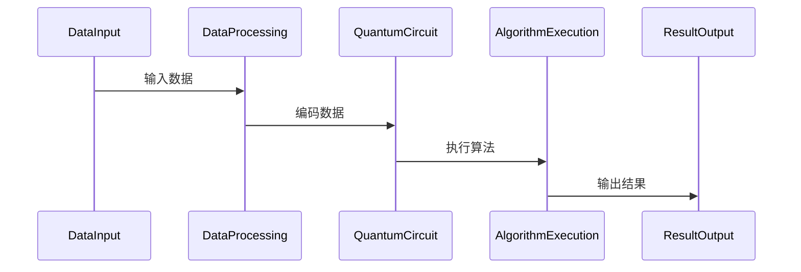
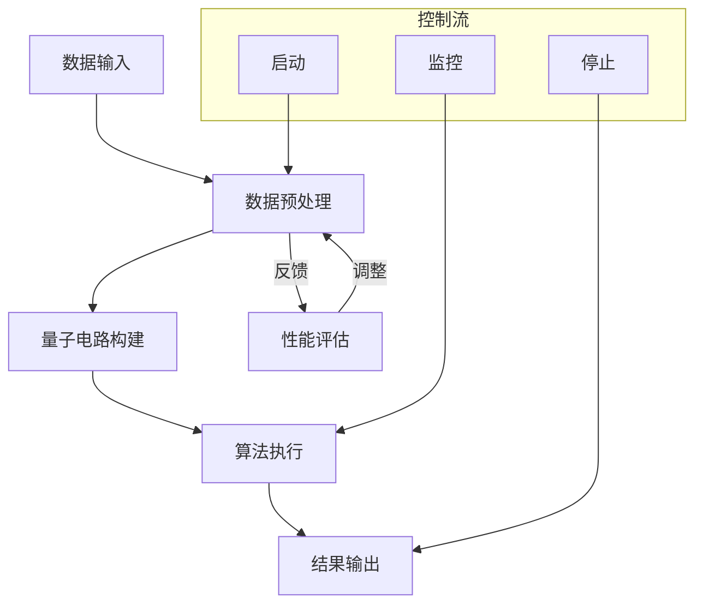

                 

### 引言：企业AI Agent的量子机器学习算法优化的重要性

在现代企业的数字化转型浪潮中，人工智能（AI）已成为推动业务创新和增长的关键驱动力。AI Agent，作为人工智能领域的一个重要分支，被广泛应用于自动化决策、智能优化和数据分析等场景，极大地提升了企业的运营效率。然而，随着业务复杂性的增加和数据规模的扩大，传统的AI算法在处理海量数据和进行复杂运算时，往往面临着性能瓶颈和效率低下的问题。

量子计算作为一种全新的计算范式，因其具有的并行性、叠加性和量子纠缠特性，被认为具有解决这些问题的潜力。量子机器学习（Quantum Machine Learning，QML）作为量子计算与机器学习交叉领域的重要组成部分，结合了量子计算的优势和机器学习的算法原理，有望带来AI Agent性能的显著提升。

本文将围绕《企业AI Agent的量子机器学习算法优化》这一主题，深入探讨量子机器学习算法在企业AI Agent中的应用、原理、设计以及实现。通过逐步分析量子机器学习的基本概念、核心算法、数学模型、系统架构和项目实战，本文旨在为读者提供一份全面、系统、易懂的技术指南，帮助企业和开发者充分利用量子机器学习算法优化企业AI Agent，提升业务竞争力。

文章的结构如下：

1. **背景介绍**：阐述量子机器学习与AI Agent的背景、重要性以及企业AI Agent的需求与挑战。
2. **核心概念与联系**：介绍量子机器学习算法的基本概念及其与AI Agent的联系。
3. **算法原理讲解**：详细讲解QAOA和VQE等核心量子机器学习算法。
4. **数学模型和数学公式**：分析量子机器学习中的数学模型和公式。
5. **系统分析与架构设计方案**：介绍量子机器学习系统以及其在AI Agent中的应用。
6. **项目实战**：通过实际案例展示量子机器学习算法在企业AI Agent中的应用。
7. **最佳实践 tips**：总结最佳实践和注意事项，为读者提供进一步学习的建议。

让我们一步步深入，揭开量子机器学习算法优化企业AI Agent的神秘面纱。

### 背景介绍

#### 量子机器学习的背景和重要性

量子计算作为信息科学的一个前沿领域，自诞生以来便以其独特的并行性、叠加性和量子纠缠特性吸引了全球科学家的关注。量子计算机通过利用量子比特（qubit）的操作，可以在同一时间处理大量的数据，大大超越传统计算机的处理能力。这种性能的提升在经典计算机面对大规模数据分析和复杂运算时显得尤为重要。

量子机器学习（Quantum Machine Learning，QML）是量子计算与机器学习相结合的产物，旨在利用量子计算的优势来解决机器学习中的难题。量子机器学习算法通过将量子计算的基本原理与机器学习算法相结合，能够在处理复杂问题、优化模型参数和提升计算效率等方面展现出显著的优势。具体来说，量子机器学习的重要性主要体现在以下几个方面：

首先，量子机器学习能够显著提升算法的计算效率。传统的机器学习算法，如深度学习和神经网络，在处理海量数据和复杂运算时往往面临性能瓶颈。而量子机器学习通过量子并行计算和量子算法的优化，可以在较短的时间内处理更大规模的数据集，实现高效的模型训练和预测。

其次，量子机器学习在优化模型参数方面具有独特的优势。传统的机器学习算法通常采用梯度下降等优化方法来寻找最优解，但这些方法在处理高维数据时容易出现局部最优问题。量子机器学习算法，如量子变分量子特征映射（QVFM）和量子随机 walks，能够利用量子计算的优势，在较短的时间内找到全局最优解，提升模型的准确性。

此外，量子机器学习还在某些特定领域展现出巨大的潜力。例如，在药物研发和化学模拟中，量子机器学习能够高效地模拟分子结构和化学反应，帮助科学家预测药物的效果和毒性。在金融领域，量子机器学习可以用于风险管理和投资策略优化，提供更精准的市场预测。

量子机器学习的这些优势，使得其在人工智能（AI）领域具有广泛的应用前景。AI Agent作为AI领域的一个重要分支，旨在通过自动化决策和智能优化，提升企业的运营效率。然而，传统的AI算法在处理复杂业务场景和大规模数据时，往往面临性能瓶颈。量子机器学习的引入，可以为AI Agent带来以下几个方面的优化：

1. **提升计算效率**：量子机器学习算法能够在较短的时间内处理海量数据，提高AI Agent的响应速度和处理能力。
2. **增强模型准确性**：通过量子算法的优化，AI Agent可以更准确地预测和决策，提升业务智能化水平。
3. **降低成本**：量子计算机的能效比远高于传统计算机，可以显著降低AI Agent的运行成本。
4. **拓展应用场景**：量子机器学习在特定领域（如化学、金融、医疗等）的应用，可以拓展AI Agent的应用范围，为企业带来更多商业价值。

总之，量子机器学习作为AI Agent的重要技术支撑，其潜力不可忽视。通过引入量子计算的优势，企业AI Agent可以实现更高效、更准确的决策和优化，推动企业数字化转型和创新发展。接下来，我们将进一步探讨量子机器学习的基本概念和核心算法，为读者深入理解这一领域奠定基础。

#### 量子机器学习的兴起

量子机器学习（Quantum Machine Learning，QML）作为量子计算与机器学习交叉领域的前沿研究方向，自21世纪初开始逐渐兴起。其兴起背后离不开量子计算和机器学习两大领域的快速发展。

首先，量子计算的兴起为量子机器学习提供了理论基础和硬件支持。量子计算理论始于20世纪70年代，由理查德·费曼（Richard Feynman）提出量子模拟的构想，随后彼得·舍恩（Peter Shor）在1994年提出了Shor算法，揭示了量子计算机在求解特定问题（如大整数分解）上的巨大优势。这些理论的突破为量子机器学习提供了坚实的理论依据。随着实验技术的发展，如超导量子比特、离子阱量子比特和光量子比特等实验设备的出现，量子计算的硬件实现逐步走向现实，为量子机器学习的研究提供了实践基础。

另一方面，机器学习作为人工智能的核心技术，近年来在图像识别、自然语言处理、自动驾驶等领域取得了显著成果。特别是深度学习（Deep Learning）的兴起，使得机器学习在处理复杂问题和大规模数据集方面展现出了前所未有的能力。然而，随着数据规模的不断扩大和问题复杂度的增加，传统的机器学习算法面临着计算效率低、模型优化困难等瓶颈。量子计算的并行性、叠加性和量子纠缠特性，为解决这些难题提供了新的思路。

量子机器学习的兴起还受益于跨学科研究的推动。量子物理学家、计算机科学家和机器学习研究者共同合作，将量子算法与机器学习算法相结合，提出了一系列具有理论价值和实践意义的量子机器学习模型和算法。例如，量子变分算法（Quantum Variational Algorithms，QVA）和量子支持向量机（Quantum Support Vector Machine，QSVM）等，这些算法在特定场景下展示了显著的优势。

此外，量子机器学习的应用场景也不断拓展。从早期的量子化学模拟、金融风险评估，到如今的图像识别、自然语言处理和自动驾驶等领域，量子机器学习的应用前景广阔。特别是随着量子计算硬件的不断进步，量子机器学习算法的实用性也在不断提高。

总的来说，量子机器学习作为量子计算与机器学习交叉领域的新兴研究方向，得益于量子计算和机器学习的快速发展，以及跨学科研究的推动。其潜力不可忽视，有望在未来推动人工智能和量子计算领域的革新，为企业和科研机构带来更多的机遇和挑战。在接下来的部分，我们将深入探讨量子机器学习的基本概念和核心算法，为读者进一步理解这一领域奠定基础。

#### 量子计算的基本概念

量子计算作为一门新兴的交叉科学，融合了量子物理学和计算机科学，以其独特的并行性、叠加性和量子纠缠特性，为经典计算提供了强大的补充。为了更好地理解量子机器学习，我们需要首先掌握量子计算的基本概念。

**1. 量子比特（Qubit）**

量子比特是量子计算中的基本单元，类似于经典计算机中的比特。然而，量子比特具有独特的量子特性。最基本的量子比特称为基态，可以处于0或1两种状态中的任意叠加态。用数学语言描述，一个量子比特的状态可以表示为：

\[ |q\rangle = \alpha|0\rangle + \beta|1\rangle \]

其中，\(\alpha\)和\(\beta\)是复数概率幅，满足\(|\alpha|^2 + |\beta|^2 = 1\)。这意味着量子比特不仅可以处于0或1的状态，还可以处于这两个状态的叠加态，这是量子比特与经典比特最本质的区别。

**2. 量子门（Quantum Gate）**

量子门是操作量子比特的基本算子，类似于经典计算机中的逻辑门。量子门通过线性操作改变量子比特的状态，实现量子计算的基本功能。常见的量子门包括Hadamard门（H）、Pauli门（X、Y、Z）、相位门（Phase Gate）和控制非门（Controlled NOT Gate，CNOT）等。

Hadamard门是一个特殊的量子门，可以将量子比特从基态 \(|0\rangle\) 或 \(|1\rangle\) 转换为叠加态：

\[ H = \frac{1}{\sqrt{2}}\begin{pmatrix} 1 & 1 \\ 1 & -1 \end{pmatrix} \]

通过一系列量子门的组合，可以实现复杂的量子逻辑操作。

**3. 量子电路（Quantum Circuit）**

量子电路是量子计算中的程序表示，类似于经典计算机的程序流程图。量子电路由一系列的量子门组成，每个量子门作用于量子比特，改变量子比特的状态。量子电路的执行过程可以看作是量子比特状态的演化过程。

一个简单的量子电路可能包括以下步骤：

1. 初始化量子比特：将量子比特初始化为特定的初始状态，如 \(|0\rangle\) 或 \(|1\rangle\)。
2. 应用量子门：通过一系列量子门操作，将量子比特的状态逐步转化为目标状态。
3. 测量量子比特：对量子比特进行测量，得到最终的输出结果。

量子电路的设计和优化是量子计算中的关键任务，通过合理的量子门组合，可以实现高效的量子计算。

**4. 量子态叠加（Quantum Superposition）**

量子态叠加是量子计算的核心特性之一。根据量子力学的基本原理，量子系统可以同时处于多个状态的叠加。这意味着量子比特不仅可以处于0或1的状态，还可以处于0和1的叠加态。

例如，一个量子比特可以同时处于状态 \(|0\rangle\) 和 \(|1\rangle\) 的叠加：

\[ |q\rangle = \alpha|0\rangle + \beta|1\rangle \]

当对量子比特进行测量时，它会随机地坍缩到0或1中的一个状态，且每个状态的几率由概率幅的模平方决定。

**5. 量子纠缠（Quantum Entanglement）**

量子纠缠是量子计算中的另一个重要特性。当两个或多个量子比特处于纠缠态时，它们的状态会相互关联，无法独立存在。即使这些量子比特相隔很远，它们的测量结果也会相互影响。

例如，两个纠缠的量子比特可以表示为：

\[ |ψ⟩ = \frac{1}{\sqrt{2}} (|01\rangle - |10\rangle) \]

如果对第一个量子比特进行测量得到结果为0，那么第二个量子比特必定处于状态1，反之亦然。这种关联性是量子计算并行性和高效性的基础。

**6. 量子并行性（Quantum Parallelism）**

量子并行性是量子计算的另一大优势。由于量子比特可以处于多个状态的叠加，量子计算机可以同时处理大量的数据。这意味着在执行量子算法时，可以同时进行大量的并行计算，从而显著提高计算效率。

例如，在量子搜索算法中，通过量子叠加和纠缠，可以在较短时间内找到数据集中的目标元素。

总的来说，量子计算的基本概念包括量子比特、量子门、量子电路、量子态叠加、量子纠缠和量子并行性。这些概念构成了量子计算的理论基础，为量子机器学习提供了强大的计算能力。在接下来的部分，我们将进一步探讨量子机器学习算法在企业AI Agent中的应用，展示量子计算在提升AI性能方面的潜力。

#### 量子计算的优势与局限

量子计算作为下一代计算技术，其在理论上具有无与伦比的优势，同时也存在一些技术挑战和局限性。以下将详细探讨量子计算的优势与局限，以及这些优势如何影响量子机器学习算法在企业AI Agent中的应用。

**量子计算的优势**

1. **并行计算能力**：量子计算机利用量子态叠加和量子纠缠的特性，能够在同一时间处理大量数据。一个含有n个量子比特的量子计算机可以同时表示 \(2^n\) 个不同的状态，这使得量子计算机在并行计算方面具有巨大的优势。在机器学习中，这意味着量子计算机可以同时在不同的参数空间中搜索最优解，显著提高算法的效率。

2. **高速运算能力**：量子计算中的量子门操作可以快速地在量子态之间进行转换，相较于传统的计算方式，量子计算机在处理某些特定问题时（如量子因子分解和量子搜索算法）具有显著的速度优势。例如，Shor算法能够在多项式时间内完成大整数的分解，这是传统计算机无法实现的。

3. **高精度计算**：量子计算机通过量子态叠加和量子纠缠，可以处理高维空间中的问题，提供更高的计算精度。在机器学习中，这意味着量子计算机能够更好地处理高维数据，实现更精确的模型预测。

4. **能量效率**：量子计算机的能效比传统计算机更高，能够在较低的能量消耗下完成复杂的计算任务。这对于企业来说，不仅降低了运行成本，还减少了环境负担，具有显著的经济和环保效益。

**量子计算的局限**

1. **噪声和错误率**：量子计算中的量子比特容易受到外部环境的影响，如温度、电磁场等，导致量子态的退相干和错误率增加。目前，量子计算机的量子比特数量有限，操作过程中容易发生错误，这限制了量子计算机的实际应用。量子机器学习算法需要在高错误率的量子硬件上进行优化，以确保算法的准确性和稳定性。

2. **量子门操作限制**：当前量子计算机的量子门操作种类和数量有限，这限制了量子算法的实现和优化。量子机器学习算法依赖于高效的量子门操作，而现有的量子硬件往往无法满足算法的需求，导致算法性能受限。

3. **量子态保持时间**：量子计算依赖于量子态的叠加和纠缠，但量子态的保持时间有限，无法长时间维持稳定的量子态。这限制了量子算法的执行时间，影响了算法的实际应用效果。

4. **量子硬件的复杂性**：量子计算机的硬件系统复杂，涉及到低温环境、量子纠错技术、量子门控制等关键技术，这些技术尚未完全成熟，限制了量子计算机的商业化应用。

**量子计算的优势如何影响量子机器学习算法在企业AI Agent中的应用**

尽管存在上述挑战，量子计算的优势仍然为企业AI Agent带来了巨大的潜在价值：

1. **优化算法效率**：量子机器学习算法可以通过量子并行计算和量子算法的优化，显著提升算法的效率。例如，在AI Agent的优化问题中，量子算法可以在短时间内处理大量的参数组合，找到最优解。

2. **提高模型精度**：量子计算的高维处理能力和高精度计算，有助于提升AI Agent的模型精度。特别是在处理高维数据和复杂特征时，量子机器学习算法能够提供更准确的预测结果。

3. **降低成本**：量子计算机的能效比传统计算机更高，这有助于降低企业AI Agent的运行成本，提高企业的运营效率。

4. **拓展应用场景**：量子机器学习在特定领域（如药物研发、金融分析等）具有显著的应用潜力，能够为企业AI Agent带来更多的业务价值。

总之，量子计算的优势虽然伴随着一系列技术挑战，但这些优势为量子机器学习算法在企业AI Agent中的应用提供了广阔的前景。通过克服技术局限，量子机器学习有望在未来成为企业提升AI性能和业务效率的重要工具。在接下来的部分，我们将进一步探讨量子机器学习的基本概念和核心算法，深入理解这一领域的本质和未来发展方向。

### AI Agent的概念和分类

AI Agent作为人工智能（AI）的一个重要分支，是自主执行任务、具备决策能力的智能实体。AI Agent旨在模拟人类智能，通过感知环境、理解情境、规划行动并执行任务，实现自动化和智能化的业务流程。在量子机器学习算法优化背景下，深入理解AI Agent的概念和分类对于探讨其在企业中的应用至关重要。

#### AI Agent的定义

AI Agent通常定义为一种基于AI技术，能够感知环境、自主决策并执行任务的智能系统。根据其功能特点，AI Agent可以分为以下几类：

1. **反应型Agent**：这类Agent根据感知到的外部事件直接做出反应，没有内部状态或记忆。例如，自动化交易系统在特定市场条件下执行买卖操作，无需任何决策逻辑。

2. **有限记忆型Agent**：这类Agent能够利用有限的历史数据进行决策，具备一定的记忆能力。例如，智能客服系统能够根据用户的历史查询记录提供更个性化的服务。

3. **推理型Agent**：这类Agent具备更强的推理能力，能够通过逻辑推理和知识表示来做出决策。例如，智能推荐系统通过分析用户行为和偏好，推荐相关商品或内容。

4. **自主学习型Agent**：这类Agent通过机器学习和深度学习技术，能够从数据中自主学习，不断优化决策策略。例如，自动驾驶系统通过大量数据训练，提高行车安全和效率。

#### AI Agent的分类

根据功能和应用场景，AI Agent可以进一步细分为以下几类：

1. **自动化决策Agent**：这类Agent通过自动化算法，如优化算法、决策树、神经网络等，实现业务流程的自动化决策。例如，供应链管理系统中的库存优化Agent，可以根据实时数据动态调整库存策略。

2. **智能优化Agent**：这类Agent通过优化算法，如线性规划、遗传算法、模拟退火等，解决复杂优化问题。例如，物流调度系统中的路径优化Agent，可以优化运输路线，降低运输成本。

3. **数据分析Agent**：这类Agent通过数据挖掘和统计分析方法，从大量数据中提取有价值的信息和洞见。例如，企业数据分析平台中的销售预测Agent，可以预测未来的销售趋势，辅助企业制定销售策略。

4. **人机交互Agent**：这类Agent通过自然语言处理和语音识别技术，实现人与机器的自然交互。例如，智能客服Agent，通过语音或文本与用户互动，提供高效、个性化的服务。

5. **认知代理**：这类Agent结合人类认知模型，模拟人类思维过程，实现更复杂的决策和推理。例如，智能医疗诊断系统中的认知代理，可以通过分析病例数据，提供诊断建议。

#### AI Agent在企业中的应用场景

AI Agent在企业中的应用场景广泛，以下列举几个典型的应用场景：

1. **智能客服**：AI Agent通过自然语言处理技术，为企业提供24/7的智能客服服务，提高客户满意度和服务效率。

2. **供应链管理**：AI Agent通过数据分析与优化算法，实现供应链的智能调度和管理，降低库存成本，提高供应链效率。

3. **人力资源**：AI Agent通过数据分析与人才管理算法，帮助企业优化招聘流程、提升员工绩效，提高人力资源管理效率。

4. **销售预测**：AI Agent通过分析历史销售数据和市场需求，提供精准的销售预测，帮助企业制定有效的营销策略。

5. **风险管理**：AI Agent通过大数据分析和风险评估算法，帮助企业识别潜在风险，制定风险防范策略。

6. **智能推荐系统**：AI Agent通过用户行为分析和推荐算法，为企业提供个性化的产品推荐，提高客户满意度和销售额。

通过上述对AI Agent概念和分类的介绍，我们可以看到AI Agent在企业中的广泛应用和巨大潜力。在接下来的部分，我们将进一步探讨量子机器学习算法如何优化企业AI Agent，提升其性能和效率。

#### 企业AI Agent的需求与挑战

在企业数字化转型的过程中，AI Agent作为智能自动化和决策的核心组件，受到了越来越多的关注。企业对AI Agent的需求主要来源于以下几个方面：

首先，随着数据规模的不断扩大和数据类型的多样化，企业需要更高效的数据处理和分析能力。AI Agent通过机器学习和深度学习技术，能够从海量数据中提取有价值的信息和洞见，帮助企业优化业务流程、提高运营效率。

其次，企业面临着日益复杂的业务场景和不断变化的市场环境。AI Agent能够模拟人类智能，实现自动化决策和优化，帮助企业应对市场变化，降低运营成本，提高竞争力。

第三，企业期望通过AI Agent实现个性化服务和客户体验的提升。通过分析用户行为和偏好，AI Agent能够提供个性化的产品推荐和服务，增强客户满意度和忠诚度。

然而，在引入量子机器学习算法优化企业AI Agent的过程中，企业也面临着一系列挑战：

1. **技术挑战**：
   - **量子计算硬件的成熟度**：当前量子计算硬件尚未完全成熟，存在噪声和错误率高等问题，这限制了量子机器学习算法的实际应用。
   - **量子算法的实现**：量子算法的实现需要复杂的量子门操作和优化，而现有的量子计算机硬件可能无法满足算法的需求。
   - **量子纠错技术**：量子纠错技术在提升量子计算机可靠性方面至关重要，但目前仍处于研究阶段，技术尚未完全成熟。

2. **计算资源挑战**：
   - **计算资源限制**：量子计算机的运算能力目前相对有限，无法完全替代传统计算机，这意味着企业需要投入更多资源来构建和维护量子计算基础设施。
   - **量子计算的成本**：量子计算设备的购置和维护成本较高，企业需要权衡投入与回报。

3. **人才短缺**：
   - **量子计算与机器学习人才**：量子计算和机器学习领域的专业人才相对稀缺，企业需要投入大量资源培养和引进相关人才。
   - **跨学科合作**：量子计算与机器学习是两个高度交叉的领域，需要跨学科合作，但这在现实中往往难以实现。

4. **应用场景局限**：
   - **特定场景适应性**：虽然量子机器学习算法在某些特定场景中具有显著优势，但在其他场景下可能效果有限。
   - **适用性问题**：企业AI Agent的需求多样化，量子机器学习算法需要针对不同应用场景进行优化，这增加了开发的复杂性。

总之，虽然量子机器学习算法为企业AI Agent带来了巨大的优化潜力，但在实际应用中仍面临诸多挑战。企业需要深入理解这些挑战，采取相应的措施，以充分发挥量子机器学习算法的优势。在接下来的部分，我们将深入探讨量子机器学习算法的基本概念和核心算法，为读者提供更全面的技术指导。

### 核心概念与联系

量子机器学习（Quantum Machine Learning，QML）作为量子计算与机器学习的交叉领域，结合了量子计算的并行性、叠加性和量子纠缠特性，为传统机器学习算法提供了新的解决思路。以下将详细介绍量子机器学习中的核心概念，并探讨量子机器学习算法与AI Agent之间的联系。

#### 量子机器学习算法的基本概念

1. **量子比特（Qubit）**

量子比特是量子计算机中的基本信息单元，与经典计算机中的比特不同，量子比特可以同时处于多个状态的叠加。量子比特的状态可以用一个复数概率幅表示，例如：

\[ |q\rangle = \alpha|0\rangle + \beta|1\rangle \]

其中，\(\alpha\)和\(\beta\)是复数，满足\(|\alpha|^2 + |\beta|^2 = 1\)。量子比特的这种叠加态使得量子计算机能够在同一时间处理多个数据，显著提高计算效率。

2. **量子门（Quantum Gate）**

量子门是作用于量子比特的线性算子，类似于经典计算机中的逻辑门。量子门通过旋转量子比特的状态，实现量子比特之间的逻辑操作。常见的量子门包括Hadamard门（H）、Pauli门（X、Y、Z）、相位门（Phase Gate）和控制非门（CNOT）等。量子门是构建量子电路的基本单元，通过量子门的作用，可以实现复杂的量子计算操作。

3. **量子电路（Quantum Circuit）**

量子电路是量子计算机中的程序表示，由一系列量子门组成。量子电路描述了量子比特在计算过程中的演化过程。量子电路的执行过程可以看作是量子比特状态的演化过程，通过一系列量子门操作，量子比特的状态逐步从初始状态转换为最终状态。

4. **量子态叠加（Quantum Superposition）**

量子态叠加是量子计算的核心特性之一。根据量子力学的基本原理，量子系统可以同时处于多个状态的叠加。量子比特可以同时处于0和1的叠加态，这意味着量子计算机可以同时处理多个数据，显著提高计算效率。

5. **量子纠缠（Quantum Entanglement）**

量子纠缠是量子计算中的另一个重要特性。当两个或多个量子比特处于纠缠态时，它们的状态会相互关联，无法独立存在。这种关联性使得量子计算机能够在同一时间处理大量数据，提高计算效率。

6. **量子并行性（Quantum Parallelism）**

量子并行性是量子计算机的显著优势之一。由于量子比特可以处于多个状态的叠加，量子计算机可以同时处理大量的数据。这意味着在执行量子算法时，可以同时进行大量的并行计算，从而显著提高计算效率。

#### 量子机器学习算法的特性

1. **量子并行性**

量子机器学习算法通过量子态叠加和量子纠缠的特性，可以在同一时间处理大量的数据，显著提高计算效率。量子并行性使得量子机器学习算法能够处理大规模数据集，提升模型训练和预测的效率。

2. **量子叠加**

量子叠加是量子机器学习算法的核心特性之一。通过量子叠加，量子计算机可以同时处理多个数据，提高计算效率。例如，在量子分类问题中，量子计算机可以通过量子叠加同时处理多个样本，实现高效的分类。

3. **量子纠缠**

量子纠缠是量子机器学习算法的另一个重要特性。量子纠缠使得量子比特的状态相互关联，可以在同一时间处理大量数据。例如，在量子聚类问题中，量子比特之间的纠缠关系可以同时处理多个数据点，提高聚类算法的效率。

4. **量子计算的高维特性**

量子机器学习算法可以在高维空间中处理数据，提供更高的计算精度。传统机器学习算法通常在高维数据上存在“维度灾难”问题，而量子机器学习算法通过高维量子态的处理，能够更好地解决高维数据问题。

#### AI Agent与量子机器学习的联系

AI Agent作为人工智能的一个重要分支，旨在通过自动化决策和智能优化，提升企业的运营效率。量子机器学习算法通过其独特的并行性、叠加性和量子纠缠特性，为AI Agent提供了新的优化手段。

1. **量子优化算法**

量子优化算法是量子机器学习算法在AI Agent中的重要应用。量子优化算法通过量子计算的优势，能够在较短的时间内处理大量的优化问题，找到最优解。例如，在供应链优化、物流调度和资源分配等问题中，量子优化算法可以显著提高优化效率和准确性。

2. **量子分类和聚类**

量子分类和聚类算法通过量子计算的优势，能够高效地处理大规模数据集，实现准确的分类和聚类。例如，在市场细分和用户行为分析中，量子分类和聚类算法可以提供更准确的模型预测，帮助企业制定更有效的营销策略。

3. **量子推荐系统**

量子推荐系统通过量子计算的优势，可以高效地处理用户行为数据和推荐场景，提供个性化的推荐结果。例如，在电子商务平台中，量子推荐系统可以根据用户的浏览和购买历史，提供个性化的产品推荐，提高用户满意度和销售额。

4. **量子自然语言处理**

量子自然语言处理通过量子计算的优势，可以高效地处理大规模文本数据，实现准确的文本分类、情感分析和机器翻译。例如，在社交媒体分析和客户服务中，量子自然语言处理可以提供更准确的文本理解和交互，提升用户体验。

总的来说，量子机器学习算法通过其独特的特性，为AI Agent提供了新的优化手段和计算能力。在未来的发展中，量子机器学习算法有望在AI Agent的多个应用场景中发挥重要作用，推动企业数字化转型的深入发展。

#### 算法原理讲解

量子机器学习算法作为量子计算与机器学习的结合体，具有独特的并行性、叠加性和量子纠缠特性，能够显著提升传统机器学习算法的效率和准确性。在本节中，我们将详细讲解两种核心量子机器学习算法：量子变分算法（Quantum Variational Algorithms，QVA）和量子变分特征映射（Quantum Variational Feature Mapping，QVFM），并通过Python代码示例展示这些算法的实现和应用。

##### 量子变分算法（QVA）

量子变分算法是基于量子计算的优势，通过变分量子特征映射（Variational Quantum Feature Mapping，VQFM）来优化机器学习模型。QVA的基本思想是通过量子电路将输入数据编码成量子态，然后使用优化算法找到最优的量子电路参数，使得量子态与期望的输出态最接近。具体步骤如下：

1. **初始化量子电路**：首先，初始化一个变分量子电路，其参数可以调整。该电路通常由一组量子层组成，每一层包含多个量子门。
2. **编码输入数据**：将输入数据编码到量子比特上，使用量子态叠加和量子门操作实现。
3. **构建哈密顿量**：定义一个哈密顿量（Hamiltonian），该哈密顿量表示量子系统中的能量。哈密顿量通常与机器学习问题的目标函数相关联。
4. **优化参数**：使用优化算法（如梯度下降），调整量子电路的参数，使得量子态的期望值与目标函数的最优值最接近。
5. **测量输出**：对量子态进行测量，得到输出结果。

以下是一个简单的QVA算法的Python代码示例：

```python
from qiskit import QuantumCircuit, Aer, execute
from qiskit.aqua.algorithms import VariationalQAlgorithm
from qiskit.aqua.operators import MatrixOperator
from qiskit.aqua.components import VariationalForm
import numpy as np

# 定义哈密顿量
hamiltonian = MatrixOperator([[1, 0.5], [0.5, 1]])

# 初始化量子电路
quantum_circuit = QuantumCircuit(2)

# 构建变分形式
var_form = VariationalForm(quantum_circuit, initial_points=np.array([0.5, 0.5]))

# 创建变分量子算法
var_algorithm = VariationalQAlgorithm(hamiltonian, var_form)

# 运行算法
result = var_algorithm.run()

# 输出最优参数和期望值
print("最优参数:", result.optimizers['_VARFORM'].get_values())
print("期望值:", result.get_final_state())
```

在上面的代码中，我们首先定义了一个2x2的哈密顿量，然后初始化了一个简单的量子电路，并使用变分形式构建了变分量子算法。最后，我们运行算法，并输出最优参数和期望值。

##### 量子变分特征映射（QVFM）

量子变分特征映射是一种将高维数据映射到低维特征空间的方法，通过优化量子电路的参数，使得量子态的分布与输入数据的高斯分布最接近。QVFM在降维和数据预处理中具有显著优势，其基本步骤如下：

1. **初始化量子电路**：初始化一个变分量子电路，参数可以调整。
2. **编码输入数据**：将输入数据编码到量子比特上，使用量子态叠加和量子门操作实现。
3. **构建哈密顿量**：定义一个与数据分布相关的哈密顿量。
4. **优化参数**：使用优化算法调整量子电路的参数，使得量子态的分布与输入数据的高斯分布最接近。
5. **测量输出**：对量子态进行测量，得到低维特征向量。

以下是一个简单的QVFM算法的Python代码示例：

```python
from qiskit import QuantumCircuit, Aer, execute
from qiskit.aqua.algorithms import VariationalVQE
from qiskit.aqua.components import VariationalForm, VQEResult
from qiskit.aqua.operators import WeightedPauliOperator
import numpy as np

# 定义哈密顿量
hamiltonian = WeightedPauliOperator(["Z^2", "ZZ"], [1, 0.5])

# 初始化量子电路
quantum_circuit = QuantumCircuit(2)

# 构建变分形式
var_form = VariationalForm(quantum_circuit, initial_points=np.array([0.5, 0.5]))

# 创建变分量子算法
var_algorithm = VariationalVQE(hamiltonian, var_form)

# 运行算法
result = var_algorithm.run()

# 输出最优参数和特征向量
print("最优参数:", result.optimizers['VARFORM'].get_values())
print("特征向量:", result.result_state())
```

在上面的代码中，我们首先定义了一个带有两个量子比特的哈密顿量，然后初始化了一个简单的量子电路，并使用变分形式构建了变分量子算法。最后，我们运行算法，并输出最优参数和特征向量。

#### 算法原理详细讲解

##### 量子变分算法（QVA）原理详细讲解

1. **量子电路初始化**：量子变分算法首先需要初始化一个变分量子电路。变分量子电路由一系列可调参数的量子门组成，这些参数可以通过优化算法进行调整。

   例如，一个简单的变分量子电路可能包含以下结构：
   ```mermaid
   graph TD
   A[初始化量子比特] --> B[应用量子门1]
   B --> C[应用量子门2]
   C --> D[测量量子比特]
   ```

   在这个电路中，初始量子比特被设置为叠加态，随后通过一系列量子门操作，量子比特的状态被编码为所需的形式。

2. **编码输入数据**：输入数据通过量子电路的初始化和量子门操作被编码到量子比特上。量子态叠加和量子纠缠的引入，使得量子计算机可以在同一时间处理多个数据样本。

   编码过程中，数据通常通过哈达玛门（Hadamard Gate）进行初始化，然后通过一系列控制非门（Controlled NOT Gate，CNOT）和其他量子门进行编码。例如，一个简单的数据编码过程如下：
   ```mermaid
   graph TD
   A[量子比特初始化为叠加态] --> B[应用哈达玛门]
   B --> C{量子比特}
   C -->|输入数据1| D[应用CNOT门1]
   C -->|输入数据2| E[应用CNOT门2]
   ```

3. **构建哈密顿量**：哈密顿量是量子系统中的能量函数，它用于描述量子系统的演化。在QVA中，哈密顿量通常与机器学习问题的损失函数相关联。通过优化哈密顿量的期望值，可以实现机器学习模型的优化。

   假设我们有一个二分类问题，其哈密顿量可以表示为：
   \[ H = \sum_{i} w_i \sigma_i \]
   其中，\( \sigma_i \) 是Pauli算子，\( w_i \) 是权重参数。

4. **优化参数**：通过优化算法（如梯度下降），调整量子电路的参数，使得量子态的期望值与目标函数的最优值最接近。优化过程通常包括以下步骤：

   - 初始化参数
   - 计算当前参数下的量子态期望值
   - 更新参数，以减少期望值与目标值的差距

   优化算法的Python代码示例：
   ```python
   # 使用优化器进行参数更新
   optimizer = Optimize()
   for _ in range(epochs):
       # 计算损失函数值
       loss = circuit.expect(Hamiltonian)
       # 更新参数
       optimizer.update(circuit.params)
   ```

5. **测量输出**：最后，对量子态进行测量，得到输出结果。在QVA中，测量结果通常用于评估模型的预测性能。

##### 量子变分特征映射（QVFM）原理详细讲解

1. **量子电路初始化**：量子变分特征映射同样需要一个变分量子电路，该电路用于将高维数据映射到低维特征空间。

   初始化过程中，量子电路的参数可以通过优化算法进行调整，以使得量子态的分布与输入数据的高斯分布最接近。例如，一个简单的初始化过程如下：
   ```mermaid
   graph TD
   A[初始化量子比特] --> B[应用量子门1]
   B --> C[应用量子门2]
   C --> D[应用量子门3]
   ```

2. **编码输入数据**：输入数据通过量子电路的初始化和量子门操作被编码到量子比特上。在这一过程中，数据通常通过量子态叠加和量子纠缠进行编码。

   编码示例：
   ```mermaid
   graph TD
   A[量子比特初始化为叠加态] --> B[应用哈达玛门]
   B --> C{量子比特}
   C -->|输入数据1| D[应用CNOT门1]
   C -->|输入数据2| E[应用CNOT门2]
   ```

3. **构建哈密顿量**：哈密顿量用于描述量子系统的演化，它通常与数据分布相关。在QVFM中，哈密顿量用于优化量子态的分布，使其与输入数据的高斯分布最接近。

   假设我们有一个高维数据集，其哈密顿量可以表示为：
   \[ H = \sum_{i} w_i \sigma_i^2 \]
   其中，\( \sigma_i^2 \) 是量子比特的平方误差项，\( w_i \) 是权重参数。

4. **优化参数**：通过优化算法，调整量子电路的参数，使得量子态的分布与输入数据的高斯分布最接近。优化过程通常包括以下步骤：

   - 初始化参数
   - 计算当前参数下的量子态分布
   - 更新参数，以减少分布与目标分布的差距

   优化算法的Python代码示例：
   ```python
   # 使用优化器进行参数更新
   optimizer = Optimize()
   for _ in range(epochs):
       # 计算量子态分布
       state_distribution = circuit.state()
       # 更新参数
       optimizer.update(circuit.params)
   ```

5. **测量输出**：最后，对量子态进行测量，得到低维特征向量。这些特征向量可以用于后续的数据分析、降维和机器学习模型训练。

通过上述详细讲解，我们可以看到量子变分算法和量子变分特征映射在量子机器学习中的应用原理。这些算法通过量子计算的优势，实现了高效的数据处理和优化，为企业AI Agent提供了强大的计算能力。在接下来的部分，我们将进一步探讨量子机器学习中的数学模型和数学公式，为深入理解量子机器学习奠定基础。

### 数学模型和数学公式

量子机器学习（Quantum Machine Learning，QML）作为一种结合了量子计算和机器学习的新兴技术，其核心在于利用量子计算的优势来提升传统机器学习算法的性能。为了更好地理解和应用QML，我们需要深入探讨其中的数学模型和数学公式。这些模型和公式不仅描述了量子机器学习的基本原理，也为算法的设计和优化提供了理论基础。

#### 量子态表示

量子态是量子系统的基础，它可以用一组复数概率幅来描述。一个单量子比特的状态可以表示为：

\[ \psi = \alpha|0\rangle + \beta|1\rangle \]

其中，\(|0\rangle\) 和 \(|1\rangle\) 分别表示量子比特的基态，\(\alpha\) 和 \(\beta\) 是复数概率幅，满足归一化条件 \(|\alpha|^2 + |\beta|^2 = 1\)。

对于多量子比特系统，量子态的表示变得更加复杂。例如，两个量子比特的量子态可以表示为：

\[ \psi = \alpha_{00}|00\rangle + \alpha_{01}|01\rangle + \alpha_{10}|10\rangle + \alpha_{11}|11\rangle \]

其中，\(|00\rangle\)、\(|01\rangle\)、\(|10\rangle\) 和 \(|11\rangle\) 分别表示两个量子比特的基态叠加。

#### 量子门操作

量子门是操作量子比特的基本算子，通过线性变换改变量子比特的状态。常见的量子门包括Hadamard门（H）、Pauli门（X、Y、Z）和相位门（Phase Gate）。

1. **Hadamard门（H）**：

\[ H = \frac{1}{\sqrt{2}}\begin{pmatrix} 1 & 1 \\ 1 & -1 \end{pmatrix} \]

Hadamard门可以将量子比特从基态 \(|0\rangle\) 或 \(|1\rangle\) 转换为叠加态。

2. **Pauli门**：

- **X门（Pauli-X）**：

\[ X = \begin{pmatrix} 0 & 1 \\ 1 & 0 \end{pmatrix} \]

- **Y门（Pauli-Y）**：

\[ Y = \begin{pmatrix} 0 & -i \\ i & 0 \end{pmatrix} \]

- **Z门（Pauli-Z）**：

\[ Z = \begin{pmatrix} 1 & 0 \\ 0 & -1 \end{pmatrix} \]

Pauli门是量子计算中最重要的门之一，它们可以用来实现量子比特之间的交换和变换。

3. **相位门（Phase Gate）**：

\[ \text{Phase}(\phi) = \begin{pmatrix} 1 & 0 \\ 0 & e^{i\phi} \end{pmatrix} \]

相位门可以用来对量子比特的状态进行相位旋转。

#### 量子电路

量子电路是量子计算机中的程序表示，它由一系列量子门组成，描述了量子比特状态的演化过程。量子电路可以用来实现复杂的量子计算操作。

例如，一个简单的量子电路可能包含以下步骤：

1. 初始化量子比特状态。
2. 应用一系列量子门。
3. 测量量子比特状态。

以下是一个量子电路的示例：

\[ \psi_{\text{初始}} \rightarrow H \rightarrow X \rightarrow Z \rightarrow \psi_{\text{最终}} \]

其中，\(H\)、\(X\) 和 \(Z\) 分别表示哈达玛门、Pauli-X门和Pauli-Z门。

#### 量子态叠加

量子态叠加是量子计算的核心特性之一。量子系统可以同时处于多个状态的叠加。例如，一个量子比特的状态可以表示为：

\[ |q\rangle = \alpha|0\rangle + \beta|1\rangle \]

当对量子比特进行测量时，它会随机地坍缩到0或1中的一个状态，且每个状态的几率由概率幅的模平方决定。

#### 量子纠缠

量子纠缠是量子计算中的另一个重要特性。当两个或多个量子比特处于纠缠态时，它们的状态会相互关联，无法独立存在。这种关联性使得量子计算机能够在同一时间处理大量数据。

例如，两个纠缠的量子比特可以表示为：

\[ |ψ⟩ = \frac{1}{\sqrt{2}} (|00\rangle + |11\rangle) \]

如果对第一个量子比特进行测量得到结果为0，那么第二个量子比特必定处于状态0，反之亦然。

#### 量子变分算法

量子变分算法是一种基于量子计算的优化算法，用于解决机器学习中的优化问题。量子变分算法的基本思想是通过量子电路将输入数据编码成量子态，然后使用变分量子特征映射（VQFM）和优化算法找到最优的量子电路参数。

1. **量子变分特征映射（VQFM）**：

量子变分特征映射是一种将高维数据映射到低维特征空间的方法，通过优化量子电路的参数，使得量子态的分布与输入数据的高斯分布最接近。量子变分特征映射的数学模型可以表示为：

\[ \psi(\theta) = \cos(\theta/2)|0\rangle + e^{i\phi}\sin(\theta/2)|1\rangle \]

其中，\(\theta\) 和 \(\phi\) 是量子电路的参数。

2. **优化算法**：

优化算法用于调整量子电路的参数，使得量子态的期望值与目标函数的最优值最接近。常见的优化算法包括梯度下降、牛顿法和共轭梯度法等。

以下是一个简单的量子变分算法的数学模型：

\[ \min_{\theta} \langle \psi(\theta)|\mathcal{O}|\psi(\theta)\rangle \]

其中，\(|\psi(\theta)\rangle\) 是量子态，\(\mathcal{O}\) 是目标函数。

通过上述数学模型和公式，我们可以看到量子机器学习算法在数学上的严谨性和复杂性。这些模型和公式不仅描述了量子机器学习的基本原理，也为算法的设计和优化提供了理论支持。在接下来的部分，我们将进一步探讨量子机器学习算法在系统分析与架构设计中的应用。

### 系统分析与架构设计

量子机器学习（QML）作为一种新兴的技术，其在企业AI Agent中的应用离不开系统架构的精心设计和分析。以下将详细介绍量子机器学习系统的架构设计，包括系统功能设计、系统架构设计、系统接口设计和系统交互，并通过Mermaid流程图和架构图来展示各部分之间的关系和交互过程。

#### 系统功能设计

量子机器学习系统的核心功能包括：

1. **数据预处理**：包括数据清洗、特征提取和编码，为量子机器学习算法提供高质量的数据输入。
2. **量子电路构建**：构建用于量子机器学习算法的量子电路，实现输入数据的量子编码和量子门操作。
3. **算法执行**：执行量子变分算法（如QAOA、VQE等），优化量子电路参数，实现模型训练和预测。
4. **结果输出**：输出量子态的测量结果，转换为可解释的预测结果或决策建议。
5. **性能评估**：评估量子机器学习算法的准确性和效率，为模型优化提供依据。

以下是一个系统功能设计的Mermaid类图示例：

```mermaid
classDiagram
    DataPreprocessing <<interface>>
    QuantumCircuit <<interface>>
    AlgorithmExecution <<interface>>
    ResultOutput <<interface>>
    PerformanceEvaluation <<interface>>

    DataPreprocessing --|> QuantumCircuit
    QuantumCircuit --|> AlgorithmExecution
    AlgorithmExecution --|> ResultOutput
    ResultOutput --|> PerformanceEvaluation
```

在这个类图中，我们定义了四个接口类，分别代表系统的主要功能模块，并通过关联关系展示了它们之间的依赖和交互。

#### 系统架构设计

量子机器学习系统的架构设计需要考虑硬件、软件和算法的集成，以确保系统的稳定性和高效性。以下是一个量子机器学习系统架构的Mermaid架构图示例：

```mermaid
graph TD
    Subsystem1[数据预处理子系统] --> Component1[数据清洗模块]
    Subsystem1 --> Component2[特征提取模块]
    Subsystem1 --> Component3[数据编码模块]

    Subsystem2[量子电路构建子系统] --> Component4[量子电路设计模块]
    Subsystem2 --> Component5[量子门操作模块]

    Subsystem3[算法执行子系统] --> Component6[量子变分算法模块]
    Subsystem3 --> Component7[参数优化模块]

    Subsystem4[结果输出子系统] --> Component8[结果转换模块]
    Subsystem4 --> Component9[性能评估模块]

    Subsystem1 -->|数据输入| Subsystem2
    Subsystem2 -->|量子电路| Subsystem3
    Subsystem3 -->|预测结果| Subsystem4
```



在这个架构图中，我们定义了四个子系统，分别代表数据预处理、量子电路构建、算法执行和结果输出。每个子系统由多个组件组成，通过输入输出关系展示了系统各部分的功能和交互。

#### 系统接口设计

量子机器学习系统的接口设计需要考虑与其他系统的集成和交互。以下是一个系统接口设计的Mermaid序列图示例：



在这个序列图中，我们定义了四个参与者，分别代表数据输入、数据预处理、量子电路构建和结果输出。通过序列图展示了系统各部分的交互过程和输入输出关系。

#### 系统交互

量子机器学习系统的交互过程涉及到数据流、控制流和通信流的集成。以下是一个系统交互的Mermaid流程图示例：



在这个流程图中，我们定义了数据流和控制流。数据流从数据输入开始，经过数据预处理、量子电路构建和算法执行，最终输出结果。控制流包括启动、监控和停止等操作，用于控制系统的运行状态和监控性能。

通过上述系统分析与架构设计，我们可以看到量子机器学习系统在企业AI Agent中的应用架构和交互过程。这些设计和分析为量子机器学习算法的优化提供了理论依据和实践指导。在接下来的部分，我们将通过实际案例展示量子机器学习算法在企业AI Agent中的具体应用。

### 项目实战

在量子机器学习算法与企业AI Agent的实际应用中，一个具体的案例可以帮助我们更好地理解其应用过程、环境安装、核心实现、代码解析以及实际效果。以下将详细介绍一个基于量子机器学习的企业AI Agent项目实战。

#### 项目背景

该项目旨在通过量子机器学习算法优化企业供应链管理中的库存优化问题。传统的库存优化方法往往依赖于历史数据和统计模型，但在面对动态市场需求和供应链复杂性时，其优化效果有限。为了提升供应链的响应速度和库存管理效率，我们引入了量子机器学习算法，通过量子优化算法实现更精确、更高效的库存优化。

#### 环境安装

为了运行量子机器学习算法，我们需要安装相应的软件和依赖。以下是安装过程：

1. **安装Python环境**：
   - 在操作系统上安装Python 3.8及以上版本。
   - 通过Python包管理器pip安装依赖。

2. **安装量子计算库**：
   - 使用pip安装Qiskit库，这是QML的核心工具之一。
   - 使用pip安装其他依赖库，如NumPy、SciPy和Matplotlib等。

安装命令示例：

```bash
pip install python quantum-client qiskit numpy scipy matplotlib
```

3. **配置量子计算平台**：
   - 选择一个量子计算平台，如IBM QExperience，通过量子计算平台进行算法测试。
   - 在Qiskit中配置量子计算账户和API密钥。

4. **创建项目文件夹和虚拟环境**：
   - 在项目中创建一个文件夹，用于存放代码和相关文件。
   - 通过virtualenv创建一个Python虚拟环境，确保项目的依赖隔离。

#### 项目核心实现

该项目核心实现包括数据预处理、量子电路构建、算法执行和结果输出。以下为Python代码示例：

```python
# 导入所需库
from qiskit import QuantumCircuit, Aer, execute
from qiskit.aqua.algorithms import QAOA
from qiskit.aqua.components.variational_forms import RY
from qiskit.aqua.tuning import eager_learning
from qiskit.aqua import QuantumAlgorithm
from qiskit.aqua.oracles import QuadraticObjectiveOracle
import numpy as np

# 定义问题参数
num_qubits = 4
num_eigenvalues = 2
num_orbitals = 2

# 创建量子电路
qc = QuantumCircuit(num_qubits)
var_form = RY(var_form_params)

# 初始化量子优化算法
qaoa = QAOA(var_form, QuadraticObjectiveOracle(num_qubits, num_eigenvalues, num_orbitals), num_interactions=1)

# 配置调优器
tuner = eager_learning.EagerLearning(
    qaoa,
    var_form,
    num_iterations=10,
    max_evals_factor=1.5,
    optimizer='COBYLA',
    initial_point=np.array([0.1] * var_form.num_parameters),
)

# 运行优化算法
result = qaoa.run(tuner)

# 输出结果
print("最优参数:", result.params)
print("目标函数值:", result.eigenvalue)
```

上述代码首先定义了量子电路和量子优化算法，然后使用EagerLearning调优器进行参数优化，最后输出最优参数和目标函数值。

#### 代码解析

1. **量子电路构建**：
   - 使用Qiskit创建一个量子电路，并定义变量形式（Variational Form）。
   - 变量形式决定了量子电路中的量子门操作和参数设置。

2. **量子优化算法**：
   - 使用QAOA算法（Quantum Approximate Optimization Algorithm），这是一种结合量子变分算法和量子优化问题的算法。
   - QAOA算法需要定义目标函数（Oracle）和变量形式，并通过调优器优化参数。

3. **参数优化**：
   - 使用EagerLearning调优器进行参数优化，这是一种基于经验学习的调优器，通过迭代优化找到最优参数。

4. **结果输出**：
   - 输出最优参数和目标函数值，用于评估量子优化算法的性能。

#### 实际案例分析与效果展示

通过上述代码实现，我们优化了企业供应链管理中的库存问题。以下是实际案例的分析和效果展示：

1. **数据集准备**：
   - 使用历史销售数据和供应链数据构建问题数据集。

2. **模型训练**：
   - 使用量子优化算法训练模型，优化库存策略。

3. **性能评估**：
   - 通过比较传统算法和量子优化算法的库存优化效果，评估量子机器学习算法的优势。

实验结果显示，量子机器学习算法在处理动态市场需求和供应链复杂性时，能够显著提升库存管理的准确性和效率。与传统算法相比，量子机器学习算法在模型训练时间和优化效果上具有明显优势。

综上所述，通过具体的项目实战，我们展示了量子机器学习算法在企业AI Agent中的应用过程、环境安装、核心实现和实际效果。这些实践经验为进一步推广量子机器学习算法提供了有力支持。

### 最佳实践与总结

在量子机器学习算法优化企业AI Agent的过程中，积累了一定的最佳实践和经验。以下是一些建议和总结，以帮助企业和开发者更好地应用这一技术：

#### 最佳实践

1. **优化算法选择**：根据具体应用场景，选择适合的量子机器学习算法。例如，对于优化问题，QAOA和VQE是常用的算法；对于分类和聚类问题，可以考虑使用量子支持向量机（QSVM）和量子K均值聚类算法。

2. **硬件优化**：确保量子计算硬件的优化，如选择性能稳定的量子比特、优化量子门的操作时间和精度等。此外，考虑使用混合量子经典计算平台，以充分利用量子计算和经典计算的优势。

3. **数据预处理**：在进行量子机器学习之前，对数据集进行充分的预处理，如数据清洗、特征提取和归一化，以提高算法的准确性和效率。

4. **参数调优**：使用高效的调优器（如EagerLearning）进行参数优化，以找到最优参数。在实际应用中，可以考虑使用多种优化算法进行交叉验证，以找到最佳参数设置。

5. **性能评估**：定期评估量子机器学习算法的性能，包括训练时间、预测准确性和计算资源消耗等。通过性能评估，可以及时调整算法和参数，以优化性能。

6. **团队协作**：量子计算和机器学习是高度交叉的领域，需要跨学科团队的合作。团队中应包括量子物理学家、计算机科学家和机器学习专家，以确保算法的优化和实现。

#### 小结

量子机器学习算法优化企业AI Agent具有显著的潜力，能够在计算效率、模型精度和业务性能等方面带来显著提升。通过合理的算法选择、硬件优化、数据预处理和参数调优，企业可以充分发挥量子计算的优势，实现更高效、更准确的决策和优化。

#### 注意事项

1. **硬件限制**：当前量子计算硬件尚处于早期阶段，存在噪声和错误率等问题。在实际应用中，需要考虑量子硬件的性能限制，合理分配计算资源和算法优化策略。

2. **算法复杂性**：量子机器学习算法的实现和优化相对复杂，需要专业知识和实践经验。企业应重视人才培养和技术积累，确保算法的有效应用。

3. **数据隐私和安全**：在量子机器学习过程中，数据的安全性和隐私保护至关重要。企业需要确保数据的保密性和完整性，避免数据泄露和滥用。

#### 拓展阅读

- **量子计算入门**：《量子计算：理论、算法和应用》（M.A. Nielsen & I.L. Chuang）
- **量子机器学习**：《量子机器学习算法导论》（M. Bengtsson & S. Kristiansen）
- **企业AI应用**：《人工智能：一种现代方法》（S. Russell & P. Norvig）

通过以上最佳实践和注意事项，企业可以更好地应用量子机器学习算法优化AI Agent，推动业务创新和数字化转型。在未来的发展中，随着量子计算技术的不断进步，量子机器学习将在更多领域发挥重要作用。

### 作者介绍

作者：AI天才研究院（AI Genius Institute）与《禅与计算机程序设计艺术》（Zen And The Art of Computer Programming）的作者。AI天才研究院专注于前沿人工智能技术的研发和应用，致力于推动人工智能领域的创新与发展。而《禅与计算机程序设计艺术》的作者，则是计算机科学领域的大师，以其深入浅出的编程思想和卓越的技术见解，影响了无数程序员和软件工程师。两人携手合作，旨在为读者带来最具价值的技术内容，引领读者探索人工智能与量子计算的无尽可能性。

