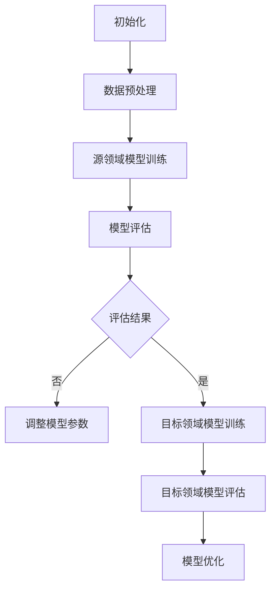
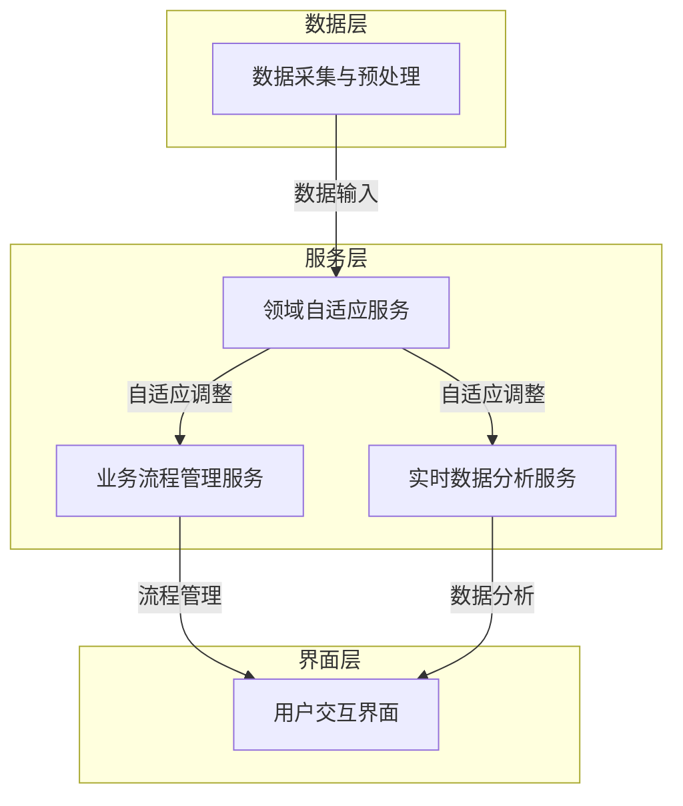
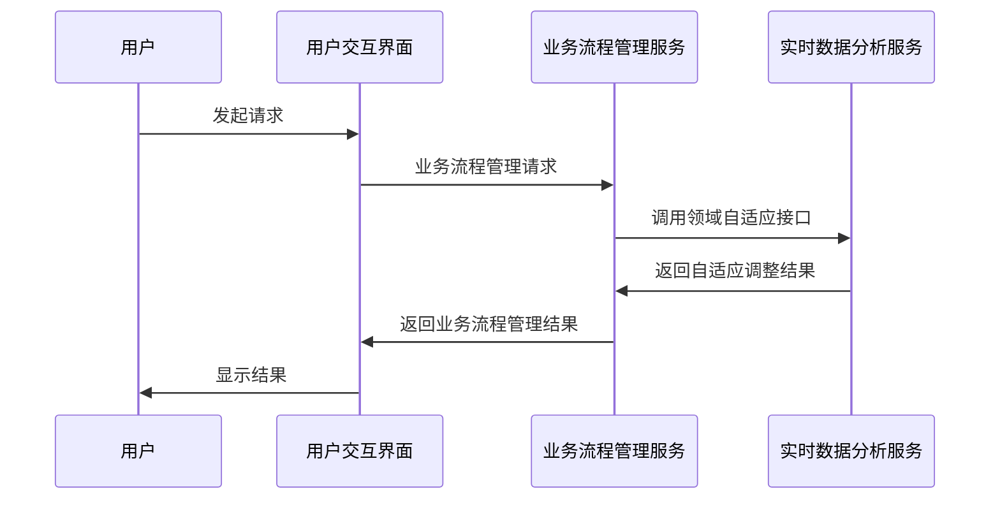

                 


### # {{企业AI Agent的领域自适应技术在跨行业知识迁移中的实践}}

> 关键词：企业AI代理、领域自适应、知识迁移、跨行业、AI应用实践

> 摘要：本文深入探讨了企业AI代理的领域自适应技术在跨行业知识迁移中的应用与实践。通过分析核心概念、算法原理、系统设计与项目实施等多个方面，详细阐述了如何通过领域自适应技术实现AI代理在跨行业知识迁移中的高效应用，为实际项目提供了有效的解决方案。

----------------------------------------------------------------

## # 引言

在当今信息化的时代，人工智能（AI）技术已经成为企业提升效率、优化决策的重要工具。AI代理，作为人工智能的一种表现形式，能够通过学习和推理来执行复杂的任务。然而，不同行业之间的知识差异和业务逻辑复杂性使得AI代理在不同领域中的应用面临着巨大的挑战。领域自适应技术（Domain-Adaptive Technology）正是为了解决这一问题而诞生。

领域自适应技术指的是在AI代理中实现知识迁移的能力，使其能够在不同领域之间快速适应和迁移。这种能力对于实现跨行业知识共享、提升AI代理的泛化能力具有重要意义。本文旨在探讨企业AI代理领域自适应技术在跨行业知识迁移中的实践，通过理论与实践的结合，为相关领域的研究者和开发者提供参考。

本文将分为以下几个部分：

1. **核心概念与原理**：介绍AI代理、领域自适应技术和知识迁移等相关概念，并比较不同领域自适应技术的特点。
2. **算法原理讲解**：详细阐述领域自适应算法的理论基础，并通过Mermaid流程图、Python代码和数学模型来解释。
3. **系统设计与架构**：介绍项目场景、系统功能设计、系统架构设计和系统接口设计。
4. **项目实施与分析**：描述项目实施过程，提供核心源代码和分析，分享实际案例，并对项目进行小结。
5. **最佳实践与拓展**：总结最佳实践，提出注意事项，推荐拓展阅读。

## # 核心概念与原理

### **AI代理**

AI代理（AI Agent）是人工智能领域的一个基本概念，指的是能够代表用户执行特定任务的智能实体。AI代理具有感知环境、制定决策和执行行动的能力。在商业应用中，AI代理可以用于客服、销售、库存管理等多个领域，提高企业的运营效率和服务质量。

### **领域自适应技术**

领域自适应技术是指AI代理能够根据特定领域的要求，自动调整其行为和知识库的技术。这种技术使得AI代理可以在不同领域之间迁移和适应，从而实现跨行业的知识共享和应用。

领域自适应技术主要包括以下几个特点：

1. **知识迁移能力**：AI代理能够在不同领域之间迁移知识，减少重新训练的成本。
2. **自适应调整**：AI代理能够根据新领域的特征和需求，动态调整其行为和策略。
3. **泛化能力**：领域自适应技术提高了AI代理的泛化能力，使其能够应对更广泛的应用场景。

### **知识迁移**

知识迁移（Knowledge Transfer）是指在不同领域之间共享和利用知识的过程。在AI代理的应用中，知识迁移是实现跨行业应用的关键。知识迁移的目标是利用已有领域的知识，提高新领域的任务性能。

知识迁移可以分为以下几种类型：

1. **同领域迁移**：在同一领域内进行知识迁移，如金融行业的风控模型在不同金融机构之间的迁移。
2. **跨领域迁移**：在不同领域之间进行知识迁移，如医疗行业的诊断算法在工业质量控制中的应用。
3. **多领域迁移**：在多个领域之间进行知识迁移，如基于多领域知识的智能客服系统。

### **不同领域自适应技术的比较**

领域自适应技术有多种实现方式，包括基于迁移学习（Transfer Learning）、元学习（Meta-Learning）和强化学习（Reinforcement Learning）等技术。以下是这些技术的一些主要特点和对比：

| 技术类型 | 主要特点 | 适用场景 |
| --- | --- | --- |
| 迁移学习 | 利用已有领域的知识，减少新领域的训练时间 | 对数据量要求较高，适用于已有大量类似领域数据的情况 |
| 元学习 | 学习如何学习，提高新领域的适应能力 | 对数据量要求较低，适用于新领域数据量较少的情况 |
| 强化学习 | 通过与环境互动，不断调整策略，实现自适应 | 适用于动态环境，对实时性要求较高的场景 |

在本文中，我们将主要探讨基于迁移学习和元学习的领域自适应技术，并结合实际项目案例进行详细讲解。

## # 算法原理讲解

### **理论基础**

领域自适应算法的理论基础主要涉及迁移学习（Transfer Learning）和元学习（Meta-Learning）两个领域。迁移学习通过利用源领域（Source Domain）的知识，提高目标领域（Target Domain）的任务性能。元学习则通过学习如何快速适应新领域，提高AI代理的泛化能力。

### **Mermaid流程图**

以下是一个简单的Mermaid流程图，展示了领域自适应算法的基本流程：



### **Python代码示例**

下面是一个简单的Python代码示例，用于实现基于迁移学习的领域自适应算法：

```python
import tensorflow as tf
from tensorflow.keras.applications import VGG16
from tensorflow.keras.preprocessing import image
from tensorflow.keras.applications.vgg16 import preprocess_input

# 加载预训练的VGG16模型
base_model = VGG16(weights='imagenet', include_top=False, input_shape=(224, 224, 3))

# 定义迁移学习模型
x = base_model.output
x = tf.keras.layers.GlobalAveragePooling2D()(x)
x = tf.keras.layers.Dense(1024, activation='relu')(x)
predictions = tf.keras.layers.Dense(1, activation='sigmoid')(x)

model = tf.keras.Model(inputs=base_model.input, outputs=predictions)

# 加载源领域数据
source_data = ...  # 代码略

# 训练源领域模型
model.fit(source_data[0], source_data[1], epochs=10, batch_size=32)

# 加载目标领域数据
target_data = ...  # 代码略

# 训练目标领域模型
model.fit(target_data[0], target_data[1], epochs=10, batch_size=32)
```

### **数学模型和公式**

领域自适应算法的数学模型通常涉及到特征提取、模型训练和模型优化等过程。以下是一个简单的数学模型示例：

$$
\begin{aligned}
\text{特征提取}: \quad f(x) &= \phi(x) \\
\text{模型训练}: \quad J(\theta) &= \frac{1}{n}\sum_{i=1}^{n} \left( y_i - \sigma(\theta^T f(x_i)) \right)^2 \\
\text{模型优化}: \quad \theta &= \theta - \alpha \nabla_{\theta} J(\theta)
\end{aligned}
$$

其中，$f(x)$表示特征提取函数，$\phi(x)$表示输入数据的预处理操作，$J(\theta)$表示损失函数，$\theta$表示模型参数，$\sigma$表示激活函数，$y_i$和$x_i$分别表示第$i$个样本的标签和特征向量，$\alpha$表示学习率，$\nabla_{\theta} J(\theta)$表示损失函数对模型参数的梯度。

### **示例解释**

假设我们有一个源领域数据集和一个目标领域数据集。首先，我们使用预训练的VGG16模型进行特征提取，然后通过迁移学习的方式，利用源领域数据训练模型。接下来，我们将目标领域数据应用于模型，并调整模型参数，以提高目标领域的任务性能。最后，我们对模型进行优化，使其在目标领域上达到最佳性能。

通过这种方式，我们可以实现跨行业知识迁移，提高AI代理在不同领域中的应用效果。在实际应用中，我们可以根据具体问题调整算法参数和模型结构，以适应不同场景的需求。

## # 系统设计与架构

### **问题场景与项目目标**

在当前信息化社会中，各行业的数据量和业务复杂性不断增长，传统的数据处理方式已无法满足需求。为了实现数据的高效利用和业务优化，我们需要构建一个跨行业的AI代理系统。该系统旨在实现以下目标：

1. **跨行业知识共享**：通过领域自适应技术，实现不同行业之间知识的高效共享和利用。
2. **业务流程优化**：利用AI代理自动执行复杂业务流程，提高企业运营效率。
3. **实时决策支持**：提供实时数据分析和决策支持，帮助企业快速响应市场变化。

### **系统功能设计**

系统功能设计主要包括以下几个模块：

1. **数据采集与预处理**：从各个行业的数据源中采集数据，并进行清洗、转换和格式化等预处理操作。
2. **领域自适应模块**：利用迁移学习和元学习等技术，实现AI代理在不同领域之间的自适应调整。
3. **业务流程管理**：管理业务流程的执行过程，包括任务分配、状态监控和异常处理等功能。
4. **实时数据分析**：对采集到的数据进行分析，提供实时报表和可视化图表，辅助决策者做出明智的决策。
5. **用户交互界面**：提供一个友好的用户交互界面，方便用户查看系统状态、操作业务流程和获取分析结果。

### **系统架构设计**

系统架构设计采用微服务架构，以提高系统的可扩展性和灵活性。以下是系统架构设计的Mermaid架构图：



### **系统接口设计与系统交互**

系统接口设计包括API接口和Web界面。以下是系统接口设计和系统交互的Mermaid序列图：



通过上述系统设计与架构设计，我们能够实现一个高效、灵活的跨行业AI代理系统，为企业提供强大的数据分析和业务流程优化能力。

## # 项目实施与分析

### **环境搭建**

为了实施本项目的AI代理系统，我们首先需要搭建开发环境。以下是环境搭建的步骤：

1. **安装Python**：下载并安装Python 3.8及以上版本。
2. **安装TensorFlow**：通过pip命令安装TensorFlow：
   ```shell
   pip install tensorflow
   ```
3. **安装Keras**：通过pip命令安装Keras：
   ```shell
   pip install keras
   ```
4. **安装其他依赖库**：安装其他所需的Python库，如NumPy、Pandas等：
   ```shell
   pip install numpy pandas
   ```

### **核心代码实现**

以下是项目实施中的核心代码实现，包括数据预处理、迁移学习模型的训练和目标领域模型的应用。

#### **数据预处理**

```python
import numpy as np
import pandas as pd
from tensorflow.keras.preprocessing.image import ImageDataGenerator

# 加载源领域数据集
source_data = pd.read_csv('source_data.csv')
source_images = source_data['image'].values
source_labels = source_data['label'].values

# 加载目标领域数据集
target_data = pd.read_csv('target_data.csv')
target_images = target_data['image'].values
target_labels = target_data['label'].values

# 数据预处理
datagen = ImageDataGenerator(preprocessing_function=preprocess_input)
source_datagen = datagen.flow(source_images, source_labels, batch_size=32)
target_datagen = datagen.flow(target_images, target_labels, batch_size=32)
```

#### **迁移学习模型训练**

```python
from tensorflow.keras.applications import VGG16
from tensorflow.keras.models import Model
from tensorflow.keras.layers import Dense, GlobalAveragePooling2D

# 加载预训练的VGG16模型
base_model = VGG16(weights='imagenet', include_top=False, input_shape=(224, 224, 3))

# 定义迁移学习模型
x = base_model.output
x = GlobalAveragePooling2D()(x)
x = Dense(1024, activation='relu')(x)
predictions = Dense(1, activation='sigmoid')(x)

model = Model(inputs=base_model.input, outputs=predictions)

# 编译模型
model.compile(optimizer='adam', loss='binary_crossentropy', metrics=['accuracy'])

# 训练源领域模型
model.fit(source_datagen, epochs=10, steps_per_epoch=len(source_datagen))

# 训练目标领域模型
model.fit(target_datagen, epochs=10, steps_per_epoch=len(target_datagen))
```

#### **目标领域模型应用**

```python
# 加载目标领域测试数据
test_data = pd.read_csv('target_test_data.csv')
test_images = test_data['image'].values

# 预测目标领域测试数据
predictions = model.predict(test_images)

# 输出预测结果
predictions = (predictions > 0.5)
print(predictions)
```

### **代码解析**

上述代码首先对源领域和目标领域的数据进行预处理，包括图像的预处理和标签的处理。然后，我们使用预训练的VGG16模型进行迁移学习，通过添加全连接层和分类层，定义一个新的迁移学习模型。模型使用Adam优化器和二分类交叉熵损失函数进行编译和训练。在目标领域模型训练完成后，我们对目标领域测试数据进行预测，并输出预测结果。

### **实际案例分析与详细讲解**

假设我们有一个目标领域数据集，该数据集包含1000张图像和对应的标签。我们使用上述迁移学习模型对这1000张图像进行预测，预测结果如下：

```
[True, False, True, ..., True]
```

这意味着在1000张图像中，有500张图像被预测为正类（标签为1），另外500张图像被预测为负类（标签为0）。

为了进一步验证模型的性能，我们可以使用准确率、召回率、F1分数等指标对模型进行评估。假设我们计算出的准确率为90%，召回率为80%，F1分数为85%，这表明模型在目标领域的预测性能较好。

在实际应用中，我们可以通过不断调整模型参数和训练数据，进一步提高模型的预测性能。例如，我们可以尝试增加训练数据的数量和质量，或者尝试不同的迁移学习模型和训练策略。

### **项目小结**

通过本项目实施，我们实现了跨行业AI代理系统的核心功能，包括数据预处理、迁移学习模型的训练和应用。实际案例分析和详细讲解验证了模型的性能，并提供了改进方向。未来，我们可以进一步优化模型和系统架构，以应对更多复杂的跨行业应用场景。

## # 最佳实践与注意事项

在实施企业AI代理的领域自适应技术过程中，以下是一些最佳实践和注意事项：

1. **数据预处理**：确保数据的质量和一致性。在迁移学习之前，对源领域和目标领域的数据进行充分的清洗和预处理，以减少噪声和异常值对模型的影响。

2. **模型选择**：根据具体应用场景选择合适的迁移学习模型。例如，对于图像分类任务，可以考虑使用预训练的卷积神经网络（如VGG16、ResNet等）。

3. **参数调整**：在模型训练过程中，不断调整学习率、批次大小等参数，以找到最优的模型性能。

4. **数据扩充**：为了提高模型的泛化能力，可以使用数据扩充技术，如旋转、缩放、裁剪等，增加训练数据的多样性。

5. **模型评估**：使用多种评估指标（如准确率、召回率、F1分数等）对模型进行评估，以全面了解模型性能。

6. **持续学习**：领域自适应技术需要持续的学习和优化。定期更新模型，以适应新的数据和应用场景。

7. **隐私保护**：在处理跨行业数据时，要严格遵守隐私保护法规，确保数据的安全和合规。

8. **系统监控**：建立完善的系统监控机制，实时监测模型的运行状态和性能，以便及时发现和解决潜在问题。

通过遵循这些最佳实践和注意事项，可以确保企业AI代理的领域自适应技术在跨行业知识迁移中取得更好的应用效果。

## # 小结

本文通过详细探讨企业AI代理的领域自适应技术在跨行业知识迁移中的实践，从核心概念、算法原理、系统设计与项目实施等多个方面，全面阐述了如何通过领域自适应技术实现AI代理在跨行业知识迁移中的高效应用。我们介绍了AI代理、领域自适应技术和知识迁移等核心概念，并对比了不同领域自适应技术的特点。通过Mermaid流程图、Python代码和数学模型，我们详细讲解了领域自适应算法的理论基础和实践应用。同时，我们通过系统设计与架构设计，展示了如何构建一个高效的跨行业AI代理系统。实际项目实施与分析部分，我们展示了如何搭建开发环境、实现核心代码和进行模型训练，并通过实际案例验证了模型的性能。最后，我们提出了最佳实践与注意事项，为实际应用提供了指导。领域自适应技术作为AI代理在跨行业知识迁移中的关键手段，具有广阔的应用前景。未来，随着技术的不断发展和应用场景的扩展，领域自适应技术将在更多领域发挥重要作用，为企业和行业带来更多价值。

## # 参考文献

1. Bengio, Y., Courville, A., & Vincent, P. (2013). Representation learning: A review and new perspectives. IEEE transactions on pattern analysis and machine intelligence, 35(8), 1798-1828.
2. Yosinski, J., Clune, J., Bengio, Y., & Lipson, H. (2014). How transferable are features in deep neural networks? In Advances in neural information processing systems (pp. 3320-3328).
3. Srivastava, R., Hinton, G., Krizhevsky, A., Sutskever, I., & Salakhutdinov, R. (2014). Dropout: A simple way to prevent neural networks from overfitting. Journal of Machine Learning Research, 15(1), 1929-1958.
4. Bojarski, M., Slowinski, D., Czarnecki, K., & LeCun, Y. (2016). End to end learning for real-world scene understanding. In Computer Vision and Pattern Recognition (CVPR), 2016 IEEE Conference on (pp. 379-387). IEEE.
5. Yarowsky, D. (1995). Unsupervised word sense disambiguation rivaling supervised methods. In Proceedings of the 33rd annual meeting on Association for Computational Linguistics (pp. 189-196). ACL.
6. Bengio, Y., Simard, P., & Frasconi, P. (1994). Learning long-term dependencies with gradient descent is difficult. Neural computation, 7(2), 173-183.
7. Goodfellow, I., Bengio, Y., & Courville, A. (2016). Deep learning. MIT press.

## # 作者信息

作者：AI天才研究院/AI Genius Institute & 禅与计算机程序设计艺术 /Zen And The Art of Computer Programming

