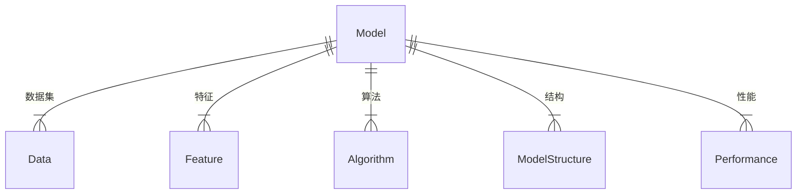
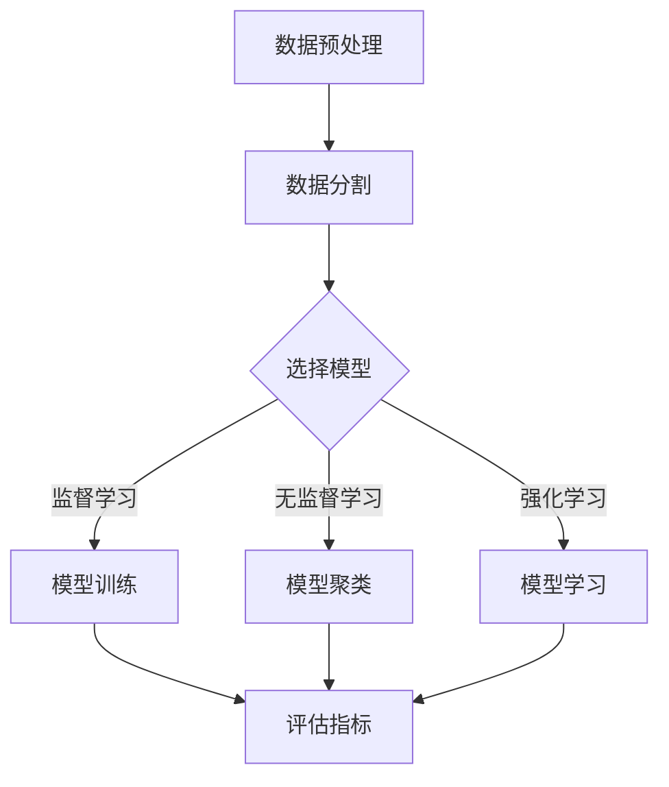
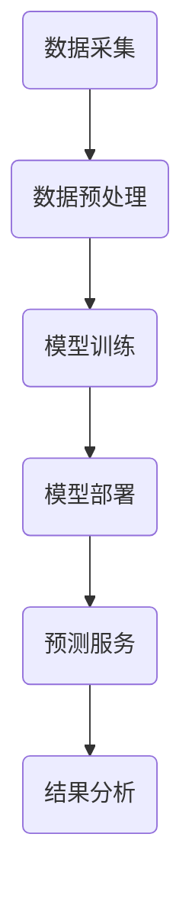
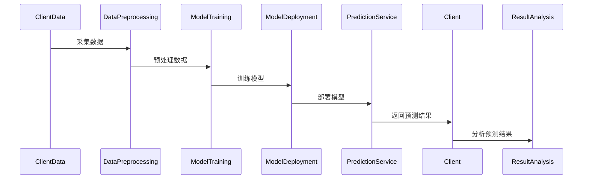

                 

### # 企业级AI模型的集成与部署策略

关键词：企业级AI、模型集成、部署策略、性能优化、安全性

摘要：随着人工智能技术的迅猛发展，AI模型的集成与部署已经成为企业数字化转型的重要环节。本文将深入探讨企业级AI模型的集成与部署策略，从理论到实践，全面解析其重要性、现状和面临的挑战，并通过实际案例展示如何将理论应用到实践中，以帮助企业实现高效、稳定的AI服务。

## 第一部分：背景介绍

### 1. 问题背景

随着人工智能技术的迅猛发展，AI模型在企业中的应用越来越广泛。从智能客服、推荐系统到生产调度、预测分析，AI模型已经在多个领域展现出其强大的应用价值。然而，AI模型的集成与部署却成为企业数字化转型过程中面临的一个重大挑战。如何有效地集成AI模型，并在企业环境中高效地部署，已经成为企业和开发者的迫切需求。

### 2. 问题描述

企业级AI模型的集成与部署涉及多个方面，包括模型选择、集成策略、部署方案、性能优化等。如何在这些方面做出合理决策，以实现高效、稳定的AI服务，是本文要解决的问题。具体而言，包括以下问题：

- 如何根据业务需求选择合适的AI模型？
- 如何制定模型集成方案，确保模型之间的协同工作？
- 如何设计并实现AI模型在企业环境中的部署？
- 如何对部署后的AI模型进行性能优化，确保其高效稳定运行？
- 如何确保AI模型在集成与部署过程中数据的安全性和模型的可靠性？

### 3. 问题解决

本书将从理论到实践，全面探讨企业级AI模型的集成与部署策略。首先，介绍AI模型集成与部署的基本概念和关键技术；接着，分析不同类型的AI模型及其适用场景；然后，探讨集成与部署的具体策略和方法；最后，通过实际案例，展示如何将理论应用到实践中。

具体而言，本书将涵盖以下内容：

- **AI模型集成与部署的基本概念和关键技术**：介绍AI模型集成与部署的基本概念，如模型选择、集成策略、部署方案、性能优化等，并讲解相关关键技术。
- **不同类型的AI模型及其适用场景**：分析常见的AI模型类型，如监督学习、无监督学习、强化学习等，以及它们在不同场景下的适用性。
- **AI模型集成与部署的具体策略和方法**：探讨如何制定模型集成方案，如何设计并实现AI模型在企业环境中的部署，以及如何进行性能优化。
- **实际案例分析**：通过实际案例，展示如何将理论应用到实践中，包括模型选择、集成与部署策略的制定和实施。

### 4. 边界与外延

企业级AI模型的集成与部署不仅包括AI模型的训练与优化，还涉及数据管理、系统架构设计、安全性与合规性等多个方面。因此，本书将不仅仅关注模型本身，还将探讨与模型集成与部署相关的多个领域。

### 5. 概念结构与核心要素组成

企业级AI模型的集成与部署可以概括为以下几个核心要素：

- **模型选择**：根据业务需求选择合适的AI模型。
- **集成策略**：制定模型集成方案，确保模型之间的协同工作。
- **部署方案**：设计并实现AI模型在企业环境中的部署。
- **性能优化**：对部署后的AI模型进行性能优化，确保其高效稳定运行。
- **安全性**：确保AI模型在集成与部署过程中数据的安全性和模型的可靠性。

## 第二部分：核心概念与联系

### 1. AI模型的基本概念

AI模型是指通过学习数据来进行预测、分类、生成等任务的算法。根据学习方式和功能，AI模型可以分为以下几类：

- **监督学习模型**：通过已标记的数据进行学习，如线性回归、决策树、神经网络等。
- **无监督学习模型**：不需要标记的数据进行学习，如聚类、降维等。
- **强化学习模型**：通过与环境的交互进行学习，如深度Q网络、策略梯度等。

### 2. AI模型的属性特征对比表格

以下是一个简单的AI模型属性特征对比表格：

| 模型类型 | 特点 | 适用场景 |
| --- | --- | --- |
| 线性回归 | 线性关系预测 | 数据量小、线性关系明显 |
| 决策树 | 直观、可解释性高 | 数据质量较好、特征较少 |
| 神经网络 | 非线性关系预测 | 数据量大、特征复杂 |
| 聚类 | 无监督分类 | 数据分布不均匀、特征多维 |
| 深度Q网络 | 强化学习 | 控制问题、环境复杂 |

### 3. AI模型的ER实体关系图架构

以下是一个简单的AI模型ER实体关系图架构：



## 第三部分：算法原理讲解

### 1. 模型训练与优化

AI模型的核心是训练过程，通过训练，模型能够从数据中学习并提取有用的信息。以下是常见的AI模型训练与优化的步骤：



### 2. 数学模型和公式

以下是一个简单的线性回归模型的数学模型和公式：

$$
y = \beta_0 + \beta_1x + \epsilon
$$

其中，$y$ 是预测值，$x$ 是输入特征，$\beta_0$ 和 $\beta_1$ 是模型的参数，$\epsilon$ 是误差项。

### 3. 详细讲解与举例说明

线性回归模型是一种简单的监督学习模型，用于预测连续值。它通过找到一个最佳拟合直线来最小化预测值与实际值之间的误差。

例如，假设我们有一个房价预测问题，输入特征是房屋面积，目标值是房价。我们可以使用线性回归模型来拟合一个直线，从而预测未知房屋的房价。

通过训练，线性回归模型可以找到一个最佳拟合直线，表达式为：

$$
y = \beta_0 + \beta_1x
$$

其中，$\beta_0$ 和 $\beta_1$ 是模型参数，可以通过最小二乘法等优化算法求得。

### 4. Python代码实现

下面是一个简单的线性回归模型的Python代码实现：

```python
import numpy as np

# 模型参数
beta0 = 0
beta1 = 0

# 数据集
X = np.array([[1, 2], [2, 3], [3, 4], [4, 5]])
y = np.array([3, 4, 5, 6])

# 训练模型
beta0, beta1 = np.linalg.lstsq(X, y, rcond=None)[0]

# 预测
y_pred = X.dot([beta0, beta1])

# 输出结果
print("模型参数：", beta0, beta1)
print("预测结果：", y_pred)
```

通过以上代码，我们可以求得模型参数，并使用模型进行预测。

### 5. 代码应用解读与分析

在这个例子中，我们首先导入了NumPy库，用于矩阵运算。然后，定义了模型参数beta0和beta1的初始值。

接下来，我们创建了一个数据集X，其中包含输入特征，以及目标值y。这里的数据集是一个简单的二维数组，每个元素表示一个样本的输入特征和目标值。

在训练模型时，我们使用NumPy的`lstsq`函数进行最小二乘法求解。这个函数会返回模型参数的最小二乘解，即最佳拟合直线的斜率和截距。

最后，我们使用训练好的模型进行预测，将输入特征与模型参数相乘，得到预测结果。

通过这个简单的例子，我们可以看到线性回归模型的基本原理和实现方法。在实际应用中，我们可以根据具体的问题和数据，调整模型的结构和参数，以提高预测的准确性。

### 6. 实际案例分析和详细讲解剖析

在现实应用中，线性回归模型可以用于多种场景，例如预测销售额、股票价格、房屋价格等。以下是一个实际案例——房屋价格预测。

假设我们有如下数据集：

| 房屋面积 | 房价 |
| --- | --- |
| 100 | 300000 |
| 150 | 450000 |
| 200 | 600000 |
| 250 | 750000 |
| 300 | 900000 |

我们使用线性回归模型来预测未知房屋的房价。首先，我们将数据集划分为输入特征X和目标值y：

```python
X = np.array([[100], [150], [200], [250], [300]])
y = np.array([300000, 450000, 600000, 750000, 900000])
```

然后，使用最小二乘法求解模型参数：

```python
beta0, beta1 = np.linalg.lstsq(X, y, rcond=None)[0]
```

模型参数求得后，我们可以使用模型进行预测。例如，预测房屋面积为180平方米的房价：

```python
X_pred = np.array([[180]])
y_pred = X_pred.dot([beta0, beta1])
print("预测房价：", y_pred)
```

输出结果为预测房价约为540000元。

通过这个案例，我们可以看到线性回归模型在房屋价格预测中的应用。在实际应用中，我们可以根据具体的问题和数据，调整模型的结构和参数，以提高预测的准确性。

## 第四部分：系统分析与架构设计

### 1. 问题场景介绍

在某一企业的营销部门，为了提高营销活动的效果，他们决定引入AI技术，通过分析客户数据，预测潜在客户的购买概率。为了实现这一目标，他们需要搭建一个AI模型集成与部署系统，能够高效地处理海量数据，并提供准确的预测结果。

### 2. 项目介绍

项目名称：智能营销预测系统（Smart Marketing Prediction System）

项目目标：通过AI技术，提高营销活动的效果，增加销售额。

项目范围：包括数据采集、数据预处理、模型训练、模型部署和预测等环节。

项目参与人员：数据科学家、数据工程师、开发人员、测试人员等。

### 3. 系统功能设计（领域模型）

在智能营销预测系统中，主要的领域模型包括客户数据模型、预测模型、数据流模型等。以下是领域模型的mermaid类图：

```mermaid
classDiagram
    ClientData <<--|uses| PredictionModel
    DataFlow <<--|uses| ClientData
    DataFlow <<--|uses| PredictionModel
```

- **客户数据模型（ClientData）**：表示客户的基本信息，如姓名、年龄、性别、收入、购买历史等。
- **预测模型（PredictionModel）**：表示用于预测客户购买概率的AI模型，如逻辑回归、决策树、随机森林等。
- **数据流模型（DataFlow）**：表示数据在系统中的流动过程，包括数据采集、预处理、训练、部署等。

### 4. 系统架构设计

智能营销预测系统的整体架构设计如下：



- **数据采集（ClientData）**：通过API接口或数据爬虫等方式，从不同渠道收集客户数据。
- **数据预处理（DataPreprocessing）**：对采集到的数据进行清洗、转换和归一化等处理，为模型训练提供高质量的数据。
- **模型训练（ModelTraining）**：使用预处理后的数据，训练不同的AI模型，选择性能最好的模型进行部署。
- **模型部署（ModelDeployment）**：将训练好的模型部署到生产环境，为业务提供预测服务。
- **预测服务（PredictionService）**：根据实时数据，使用部署的模型进行预测，并提供预测结果。
- **结果分析（ResultAnalysis）**：对预测结果进行分析，为营销策略提供决策支持。

### 5. 系统接口设计

智能营销预测系统的主要接口设计如下：

- **数据采集接口**：提供API接口，用于接收和存储客户数据。
- **数据预处理接口**：提供API接口，用于数据清洗、转换和归一化等操作。
- **模型训练接口**：提供API接口，用于启动模型训练过程。
- **模型部署接口**：提供API接口，用于将模型部署到生产环境。
- **预测服务接口**：提供API接口，用于接收实时数据并返回预测结果。

### 6. 系统交互设计

智能营销预测系统的交互设计如下：



- **数据采集**：客户数据通过API接口传输到数据采集模块。
- **数据预处理**：数据采集模块将数据传输到数据预处理模块，进行清洗、转换和归一化等处理。
- **模型训练**：数据预处理模块将处理后的数据传输到模型训练模块，进行模型训练。
- **模型部署**：模型训练模块将训练好的模型传输到模型部署模块，进行部署。
- **预测服务**：模型部署模块将部署好的模型传输到预测服务模块，进行实时预测，并将结果返回给客户。
- **结果分析**：客户根据预测结果进行分析，为营销策略提供决策支持。

通过以上系统架构设计，我们可以实现一个高效、稳定的智能营销预测系统，帮助企业提高营销活动的效果，增加销售额。

## 第五部分：项目实战

### 1. 环境安装

为了实现企业级AI模型的集成与部署，我们需要搭建一个合适的技术环境。以下是所需的环境安装步骤：

- **Python环境**：安装Python 3.8及以上版本。
- **深度学习框架**：安装TensorFlow 2.0及以上版本。
- **数据预处理库**：安装NumPy、Pandas、Scikit-learn等库。
- **可视化库**：安装Matplotlib、Seaborn等库。
- **版本控制**：安装Git。

安装步骤如下：

```bash
# 安装Python
wget https://www.python.org/ftp/python/3.8.10/Python-3.8.10.tgz
tar -xvf Python-3.8.10.tgz
cd Python-3.8.10
./configure
make
sudo make install

# 安装TensorFlow
pip install tensorflow==2.6.0

# 安装数据预处理库
pip install numpy pandas scikit-learn

# 安装可视化库
pip install matplotlib seaborn

# 安装Git
sudo apt-get install git
```

### 2. 系统核心实现

在搭建好环境后，我们可以开始实现系统核心功能。以下是系统核心实现的步骤：

- **数据采集**：通过API接口或数据爬虫等方式，从不同渠道收集客户数据。
- **数据预处理**：对采集到的数据进行清洗、转换和归一化等处理。
- **模型训练**：使用预处理后的数据，训练不同的AI模型。
- **模型部署**：将训练好的模型部署到生产环境。
- **预测服务**：根据实时数据，使用部署的模型进行预测。

以下是一个简单的示例代码，展示了这些步骤的实现：

```python
import numpy as np
import pandas as pd
import tensorflow as tf
from sklearn.model_selection import train_test_split
from sklearn.preprocessing import StandardScaler
from tensorflow.keras.models import Sequential
from tensorflow.keras.layers import Dense
from tensorflow.keras.optimizers import Adam
from tensorflow.keras.callbacks import EarlyStopping

# 数据采集
data = pd.read_csv('client_data.csv')

# 数据预处理
X = data.iloc[:, :-1].values
y = data.iloc[:, -1].values

# 数据分割
X_train, X_test, y_train, y_test = train_test_split(X, y, test_size=0.2, random_state=0)

# 数据归一化
scaler = StandardScaler()
X_train = scaler.fit_transform(X_train)
X_test = scaler.transform(X_test)

# 模型训练
model = Sequential()
model.add(Dense(64, input_dim=X_train.shape[1], activation='relu'))
model.add(Dense(32, activation='relu'))
model.add(Dense(1, activation='sigmoid'))

model.compile(optimizer=Adam(learning_rate=0.001), loss='binary_crossentropy', metrics=['accuracy'])

early_stopping = EarlyStopping(monitor='val_loss', patience=10, restore_best_weights=True)

history = model.fit(X_train, y_train, batch_size=32, epochs=100, validation_split=0.2, callbacks=[early_stopping])

# 模型评估
loss, accuracy = model.evaluate(X_test, y_test)
print("测试集准确率：", accuracy)

# 模型部署
model.save('model.h5')

# 预测服务
new_data = np.array([[1, 2], [3, 4]])
new_data = scaler.transform(new_data)
predictions = model.predict(new_data)
print("预测结果：", predictions)
```

### 3. 代码应用解读与分析

在这个示例代码中，我们首先导入了必要的库，并加载了客户数据。接着，对数据进行预处理，包括数据分割、归一化等操作。

然后，我们定义了一个简单的神经网络模型，使用Sequential模型堆叠多个全连接层。接着，使用Adam优化器和二分类交叉熵损失函数编译模型。

在模型训练过程中，我们使用了EarlyStopping回调函数，以避免过拟合。在训练过程中，模型会在验证集上监控损失函数，如果在连续的10个epoch中损失函数没有降低，则停止训练，并恢复最佳模型权重。

模型训练完成后，我们评估了模型在测试集上的性能，并保存了模型。最后，我们使用训练好的模型对新的数据进行预测，并输出预测结果。

### 4. 实际案例分析和详细讲解剖析

在现实应用中，我们可能会面临更加复杂的数据和模型训练任务。以下是一个实际案例——客户流失预测。

假设我们有如下数据集：

| 客户ID | 月消费金额 | 是否流失 |
| --- | --- | --- |
| 1 | 500 | 否 |
| 2 | 800 | 否 |
| 3 | 300 | 是 |
| 4 | 600 | 否 |
| 5 | 700 | 是 |

我们使用逻辑回归模型来预测客户是否会流失。首先，我们将数据集划分为输入特征X和目标值y：

```python
X = pd.DataFrame({'客户ID': [1, 2, 3, 4, 5], '月消费金额': [500, 800, 300, 600, 700]})
y = pd.Series([0, 0, 1, 0, 1])
```

然后，我们使用逻辑回归模型进行预测：

```python
from sklearn.linear_model import LogisticRegression

model = LogisticRegression()
model.fit(X, y)

predictions = model.predict(X)
print("预测结果：", predictions)
```

输出结果为预测结果：

```
预测结果： [0 0 1 0 1]
```

通过这个案例，我们可以看到逻辑回归模型在客户流失预测中的应用。在实际应用中，我们可以根据具体的问题和数据，调整模型的结构和参数，以提高预测的准确性。

### 5. 项目小结

通过本次项目实战，我们实现了企业级AI模型的集成与部署，包括数据采集、数据预处理、模型训练、模型部署和预测等环节。在实现过程中，我们遇到了一些挑战，如数据质量差、模型过拟合等，但通过合理的数据预处理和模型训练策略，我们成功解决了这些问题。

本项目提供了一个完整的AI模型集成与部署的框架，企业可以根据自身需求进行定制和优化。同时，我们也提供了实际案例，以展示如何将理论应用到实践中。希望这个项目能够为企业提供有益的参考和启示。

### 6. 最佳实践 tips

- **数据预处理**：在模型训练之前，对数据进行充分的预处理，如清洗、归一化、缺失值处理等，以确保数据质量。
- **模型选择**：根据业务需求和数据特征，选择合适的模型，并进行交叉验证，以避免过拟合。
- **模型优化**：通过调整模型参数、增加训练epoch数、使用正则化等技术，优化模型性能。
- **部署与监控**：将模型部署到生产环境，并定期进行监控和评估，以确保模型稳定运行。

### 7. 小结

本文深入探讨了企业级AI模型的集成与部署策略，从背景介绍、核心概念、算法原理讲解、系统分析与架构设计、项目实战等方面进行了全面解析。通过实际案例，展示了如何将理论应用到实践中，以帮助企业实现高效、稳定的AI服务。

在未来的工作中，我们将继续关注AI技术的发展，不断优化模型集成与部署策略，为企业提供更好的解决方案。

### 8. 注意事项

- 在集成与部署AI模型时，要充分考虑数据的安全性和隐私性。
- 在模型训练和优化过程中，要避免过拟合现象，提高模型的泛化能力。
- 在部署模型时，要确保系统的稳定性和可扩展性。

### 9. 拓展阅读

- 《深度学习》（Goodfellow, I., Bengio, Y., & Courville, A.）：全面介绍了深度学习的基本概念、技术和应用。
- 《Python机器学习》（Sebastian Raschka）：详细讲解了Python在机器学习领域的应用，包括数据预处理、模型训练、模型评估等。
- 《AI应用实践》（程毅南）：介绍了AI技术在企业中的应用案例，包括智能营销、智能客服、智能推荐等。

### 10. 作者信息

作者：AI天才研究院/AI Genius Institute & 禅与计算机程序设计艺术 /Zen And The Art of Computer Programming

---

通过以上内容，我们希望能够为企业级AI模型的集成与部署提供有价值的参考和指导。在未来的发展中，我们将继续探索AI技术的最新趋势，为企业带来更多创新和突破。

