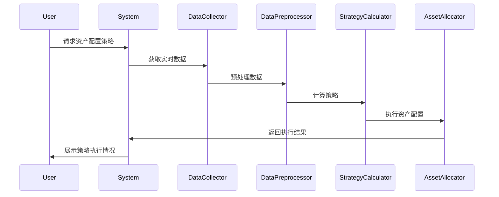
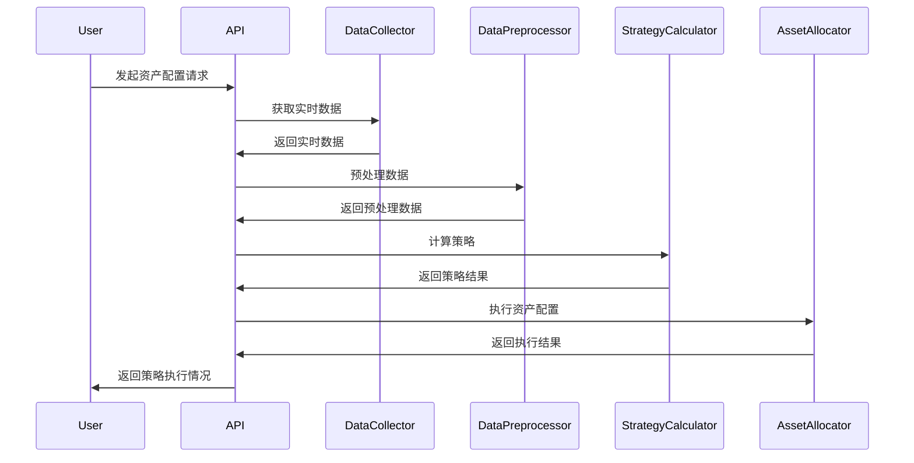

                 

### 《伯格的资产配置理论：应对极端市场波动的策略》

**关键词：**资产配置、市场波动、伯格理论、风险平价、极端事件应对

**摘要：**本文深入探讨伯格的资产配置理论，旨在为读者提供一种有效应对极端市场波动的策略。通过逐步分析，我们将理解资产配置的基本概念、伯格理论的核心理念，及其在不同市场环境下的应用策略。本文将结合数学模型、系统架构和实际案例分析，帮助读者掌握这一前沿理论，提高投资决策的准确性和风险控制能力。

----------------------------------------------------------------

## 第一部分：伯格的资产配置理论基础

### 第1章：问题背景与核心概念

### 1.1.1 市场波动性：问题的提出

市场波动性是指市场价格的波动程度，是金融市场中的一个基本特征。这种波动性既包括股票、债券等金融资产价格的短期波动，也包括长期趋势的变化。市场波动性对投资者的决策和资产表现有深远影响，特别是在极端市场波动的情况下，如何有效管理风险和保持投资组合的稳定性成为投资者关注的焦点。

### 1.1.2 资产配置理论的兴起与发展

资产配置理论起源于20世纪中期，随着金融市场的复杂化和投资者需求的多样化，资产配置逐渐成为投资组合管理中的重要策略。传统的均值-方差模型为资产配置提供了理论基础，但其假设条件往往与现实市场不符。在此背景下，伯格（Bogle）提出了以风险平价为核心的资产配置理论，强调通过多元化的投资组合来降低风险，实现投资目标。

### 1.1.3 伯格资产配置理论的基本原理

伯格的资产配置理论基于以下核心原则：

1. **风险平价**：通过调整不同资产类别的投资比例，使投资组合的整体风险达到一个平衡状态。这种策略的核心是使投资组合的标准差（风险指标）保持稳定，而不是追求单一资产的收益最大化。

2. **资产类别选择**：伯格建议投资者选择股票、债券、现金等不同风险收益特征的资产类别，并根据市场环境和风险偏好进行配置。

3. **长期视角**：资产配置是一个长期的过程，投资者应该注重长期投资目标的实现，而不是短期市场的波动。

### 1.1.4 资产配置与市场波动的关系

市场波动性是资产配置中不可忽视的因素。伯格的理论强调，通过科学合理的资产配置，可以降低市场波动对投资组合的影响。在实际操作中，投资者需要根据市场波动性调整资产配置比例，以实现风险控制和投资目标。

#### 资产配置策略的种类

1. **风险平价策略**：通过调整资产组合的权重，使得投资组合的整体风险水平保持稳定。该策略的核心在于平衡不同资产类别的风险贡献，从而实现投资组合的风险平价。

2. **资产配置比例策略**：根据预设的风险容忍度和投资目标，确定各资产类别的配置比例，并保持这一比例不变。这种策略强调的是资产类别的长期稳定配置。

3. **伯格的独特策略**：伯格提出了风险平价策略，通过量化风险指标，如标准差、波动率等，动态调整资产配置比例，以应对市场波动。

### 1.1.5 资产配置的属性特征对比表

| 策略类型       | 核心原则                      | 适用场景                   | 优点                              | 缺点                              |
|----------------|------------------------------|----------------------------|-----------------------------------|-----------------------------------|
| 风险平价策略   | 平衡各资产类别的风险贡献      | 需要高度风险控制的投资组合 | 有效降低投资组合的整体风险       | 可能错失高收益的机会               |
| 资产配置比例策略 | 长期稳定的资产配置比例        | 风险偏好稳定的投资者       | 简便易行，长期表现稳定           | 忽视市场短期波动带来的风险变化   |
| 伯格的独特策略 | 动态调整资产配置比例，应对波动 | 需要灵活应对市场波动的投资者 | 能够动态调整，适应市场变化       | 策略复杂，操作难度较大             |

### 1.1.6 资产配置与市场波动的ER关系图

```mermaid
erDiagram
  AssetAllocation <<|-- RiskParity : 实现风险平价
  AssetAllocation <<|-- FixedAllocation : 实现固定比例
  AssetAllocation ||--|{ MarketVolatility : 受市场波动影响
  RiskParity ||--|{ DynamicAdjustment : 动态调整比例
  FixedAllocation ||--|{ StableAllocation : 稳定比例配置
```

通过上述ER图，我们可以清晰地看到资产配置策略与市场波动之间的关系，以及不同策略的特点和适用性。

### 第2章：核心概念与联系

### 2.1.1 资产配置策略的种类

资产配置策略是投资者在构建投资组合时采用的具体方法，用于决定不同资产类别的投资比例和权重。根据不同的策略类型，资产配置策略可以分为以下几种：

#### 2.1.1.1 风险平价策略

风险平价策略是一种旨在使投资组合的风险贡献相等的资产配置策略。该策略的核心思想是通过调整各资产类别的权重，使得投资组合的整体风险水平保持稳定。具体实现方式包括：

1. **计算各资产类别的预期收益率和波动率**：通过统计分析方法，计算出各资产类别的预期收益率和波动率。

2. **确定资产权重**：根据各资产类别的风险贡献，调整各资产类别的权重，使得整体风险平价。

3. **定期调整**：市场环境变化时，需要定期对资产权重进行调整，以保持整体风险平价。

#### 2.1.1.2 资产配置比例策略

资产配置比例策略是一种根据投资者风险偏好和投资目标，预先设定各资产类别的配置比例，并保持这一比例不变的策略。该策略的核心在于长期稳定的资产配置。

1. **确定配置比例**：根据投资者的风险容忍度和投资目标，确定各资产类别的配置比例。

2. **定期监控**：定期监控投资组合的表现，确保各资产类别的配置比例保持在预设范围内。

3. **调整比例**：当市场环境发生较大变化时，根据实际情况对配置比例进行调整。

#### 2.1.1.3 伯格的独特策略

伯格的独特策略是结合风险平价和资产配置比例策略的一种方法。该策略通过量化风险指标，动态调整资产配置比例，以应对市场波动。

1. **量化风险指标**：使用标准差、波动率等风险指标，量化各资产类别的风险贡献。

2. **动态调整比例**：根据市场波动性，动态调整各资产类别的权重，以保持整体风险平价。

3. **定期评估**：定期评估资产配置策略的有效性，根据市场变化进行调整。

### 2.1.2 资产配置的属性特征对比表

| 策略类型       | 核心特征                         | 适用场景                   | 优点                              | 缺点                              |
|----------------|--------------------------------|----------------------------|-----------------------------------|-----------------------------------|
| 风险平价策略   | 整体风险平价                     | 高度风险控制需求的投资者     | 有效降低投资组合的整体风险       | 可能错失高收益的机会               |
| 资产配置比例策略 | 预设配置比例，保持长期稳定       | 风险偏好稳定的投资者       | 简便易行，长期表现稳定           | 忽视市场短期波动带来的风险变化   |
| 伯格的独特策略 | 动态调整比例，应对市场波动       | 需要灵活应对市场波动的投资者 | 能够动态调整，适应市场变化       | 策略复杂，操作难度较大             |

### 2.1.3 资产配置与市场波动的ER关系图

```mermaid
erDiagram
  AssetAllocation <<|-- RiskParity : 实现风险平价
  AssetAllocation <<|-- FixedAllocation : 实现固定比例
  AssetAllocation ||--|{ MarketVolatility : 受市场波动影响
  RiskParity ||--|{ DynamicAdjustment : 动态调整比例
  FixedAllocation ||--|{ StableAllocation : 稳定比例配置
```

通过上述ER图，我们可以清晰地看到资产配置策略与市场波动之间的关系，以及不同策略的特点和适用性。

### 第3章：伯格资产配置理论的应用

### 3.1.1 极端市场波动的识别

识别极端市场波动是应用伯格资产配置理论的关键步骤。极端市场波动通常表现为市场价格的剧烈波动，其特点是波动幅度超过正常市场波动范围，持续时间较长。为了识别极端市场波动，我们可以采用以下方法：

#### 3.1.1.1 指标选择

1. **波动率指标**：波动率是衡量市场波动程度的重要指标，常用的波动率指标包括历史波动率、滚动波动率等。历史波动率基于过去一段时间内价格波动的历史数据，而滚动波动率则基于最近一段时间内价格波动的情况。

2. **极值指标**：极值指标包括最高价、最低价、价格极差等，这些指标可以直观地反映市场波动的剧烈程度。

3. **异常值检测**：异常值检测方法，如箱线图、Q-Q图等，可以帮助识别市场波动的异常情况。

#### 3.1.1.2 波动性度量

1. **历史波动率度量**：历史波动率度量方法包括简单移动平均波动率（Simple Moving Average Volatility, SMAV）和指数移动平均波动率（Exponential Moving Average Volatility, EMAV）。SMAV基于过去一段时间内价格波动的平均值，而EMAV则考虑了时间权重，更加重视近期数据。

2. **滚动波动率度量**：滚动波动率度量方法包括简单滚动波动率（Simple Rolling Volatility, SRV）和指数滚动波动率（Exponential Rolling Volatility, ERV）。SRV和ERV分别基于固定窗口和指数加权窗口的计算，可以动态反映市场波动性。

### 3.1.2 应对极端市场波动的策略

在识别极端市场波动后，我们需要采取相应的策略来应对。伯格的资产配置理论提供了一些有效的策略，以降低市场波动对投资组合的影响。

#### 3.1.2.1 风险平价策略的具体实施

1. **调整资产配置比例**：在识别到极端市场波动时，可以通过调整各资产类别的权重，使投资组合的整体风险水平保持稳定。例如，当股票市场波动加剧时，可以适当降低股票的权重，增加债券或现金等低风险资产的权重。

2. **动态调整**：风险平价策略需要根据市场波动性动态调整资产配置比例。例如，当市场波动性降低时，可以适当增加高风险资产的权重，以提高投资组合的潜在收益率。

3. **定期评估**：定期评估资产配置策略的有效性，根据市场变化进行调整。例如，每季度或每半年对资产配置进行一次全面评估，以确保投资组合的稳定性和投资目标的实现。

#### 3.1.2.2 资产配置比例策略的应用场景

资产配置比例策略在应对极端市场波动时具有以下应用场景：

1. **稳定投资目标**：对于风险偏好较低的投资者，可以采用资产配置比例策略，保持各资产类别的配置比例稳定。这种方法可以降低投资组合的整体波动性，确保投资目标的实现。

2. **长期投资**：资产配置比例策略适用于长期投资目标，因为它可以在较长时间内保持稳定的资产配置，从而降低短期市场波动对投资组合的影响。

3. **风险调整**：在极端市场波动期间，可以适当调整各资产类别的配置比例，以降低投资组合的整体风险水平。例如，在股市暴跌时，可以增加债券或现金等低风险资产的权重。

#### 3.1.2.3 伯格独特策略的优势与挑战

伯格的独特策略通过动态调整资产配置比例，以应对市场波动。其优势包括：

1. **灵活应对市场波动**：伯格的独特策略可以根据市场波动性动态调整资产配置比例，从而更好地应对市场波动。

2. **平衡风险与收益**：通过动态调整资产配置比例，伯格的独特策略可以在平衡风险与收益之间取得更好的平衡。

然而，伯格的独特策略也存在一定的挑战：

1. **策略复杂度**：伯格的独特策略涉及多种风险指标和动态调整机制，使得策略复杂度较高，操作难度较大。

2. **实时监测**：为了实现动态调整，需要实时监测市场波动性，并及时调整资产配置比例。这要求投资者具备较强的市场分析和决策能力。

### 第4章：数学模型与公式讲解

#### 4.1.1 风险平价策略的数学模型

风险平价策略的核心是通过调整资产配置比例，使投资组合的整体风险保持稳定。其数学模型可以表示为：

$$
\text{风险平价} = \sum_{i=1}^{n} w_i \cdot \sigma_i
$$

其中，\( w_i \) 表示第 \( i \) 类资产的权重，\( \sigma_i \) 表示第 \( i \) 类资产的风险。

为了实现风险平价，我们可以通过以下步骤进行参数选择与优化：

1. **计算资产预期收益率和波动率**：根据历史数据，计算各资产的预期收益率 \( \mu_i \) 和波动率 \( \sigma_i \)。

2. **确定权重约束条件**：根据风险平价原则，确定各资产类别的权重约束条件，如权重之和等于1。

3. **优化权重分配**：使用优化算法（如线性规划、遗传算法等），求解最优权重分配，使投资组合的整体风险最小化。

#### 4.1.1.1 风险平价公式

风险平价策略的公式可以进一步细化如下：

$$
w_i = \frac{\mu_i - \bar{\mu}}{\sum_{j=1}^{n} (\mu_j - \bar{\mu})^2}
$$

其中，\( \bar{\mu} \) 表示资产类别的平均预期收益率。

#### 4.1.1.2 参数选择与优化

在风险平价策略中，参数选择与优化至关重要。以下是一些关键参数及其优化方法：

1. **资产预期收益率和波动率**：通过历史数据分析和预测模型，确定各资产的预期收益率和波动率。可以使用均值回归模型、ARIMA模型等来预测未来资产表现。

2. **权重分配**：使用优化算法，如线性规划、遗传算法等，求解最优权重分配。这些算法可以处理多约束、非线性优化问题，提高权重分配的精度和效率。

3. **市场波动性调整**：市场波动性是影响风险平价策略的重要因素。可以采用滚动窗口方法，动态调整资产波动率，以应对市场波动性变化。

#### 4.1.2 资产配置比例策略的数学模型

资产配置比例策略的核心是保持各资产类别的配置比例稳定。其数学模型可以表示为：

$$
w_i = w_{i0} \quad \text{(对所有 } i \text{ 有效)}
$$

其中，\( w_{i0} \) 表示初始配置比例。

为了保持配置比例稳定，可以采用以下方法：

1. **定期调整**：定期评估投资组合的表现，根据市场变化和投资目标，调整各资产类别的配置比例，以保持初始配置比例不变。

2. **风险调整**：在市场波动性较大时，可以适当调整配置比例，以降低投资组合的整体风险。

3. **目标调整**：根据投资目标的变化，调整各资产类别的配置比例，确保投资组合能够实现长期投资目标。

#### 4.1.2.1 配置比例公式

配置比例公式可以进一步细化如下：

$$
w_{i0} = \frac{\mu_i - \bar{\mu}}{\sum_{j=1}^{n} (\mu_j - \bar{\mu})}
$$

其中，\( \bar{\mu} \) 表示资产类别的平均预期收益率。

#### 4.1.2.2 配置比例的优化

在资产配置比例策略中，配置比例的优化是关键步骤。以下是一些优化方法：

1. **目标函数**：定义目标函数，如最大化投资组合的预期收益率、最小化投资组合的风险等，用于优化配置比例。

2. **约束条件**：设置约束条件，如权重之和等于1、配置比例不超过某个阈值等，以确保优化结果的合理性。

3. **优化算法**：使用优化算法（如线性规划、遗传算法等），求解最优配置比例。这些算法可以处理多约束、非线性优化问题，提高优化结果的精度和效率。

#### 4.1.3 伯格独特策略的数学模型

伯格的独特策略通过动态调整资产配置比例，以应对市场波动。其数学模型可以表示为：

$$
w_i(t) = f(\sigma_i(t), \bar{\sigma}(t), t)
$$

其中，\( w_i(t) \) 表示在时刻 \( t \) 第 \( i \) 类资产的权重，\( \sigma_i(t) \) 表示在时刻 \( t \) 第 \( i \) 类资产的波动率，\( \bar{\sigma}(t) \) 表示在时刻 \( t \) 投资组合的整体波动率，\( f \) 表示权重调整函数。

为了实现伯格的独特策略，需要以下步骤：

1. **波动率度量**：使用合适的波动率度量方法（如历史波动率、滚动波动率等），计算各资产的波动率。

2. **权重调整函数**：设计权重调整函数 \( f \)，以根据市场波动性动态调整资产配置比例。权重调整函数可以采用线性函数、非线性函数等不同形式，以适应不同市场环境。

3. **实时监测**：实时监测市场波动性，根据波动率变化动态调整资产配置比例。

#### 4.1.3.1 独特策略公式

伯格的独特策略公式可以进一步细化如下：

$$
w_i(t) = \frac{\sigma_i(t)}{\bar{\sigma}(t)}
$$

其中，\( w_i(t) \) 表示在时刻 \( t \) 第 \( i \) 类资产的权重，\( \sigma_i(t) \) 表示在时刻 \( t \) 第 \( i \) 类资产的波动率，\( \bar{\sigma}(t) \) 表示在时刻 \( t \) 投资组合的整体波动率。

#### 4.1.3.2 策略参数的调整

在伯格的独特策略中，策略参数的调整至关重要。以下是一些关键参数及其调整方法：

1. **波动率参数**：波动率参数包括历史波动率和滚动波动率等，可以根据市场波动性变化进行调整。例如，在市场波动性较大时，可以增加滚动窗口的长度，以更准确地反映市场波动性。

2. **权重调整参数**：权重调整参数包括权重调整函数中的参数，如权重调整系数等。这些参数可以根据市场环境变化进行调整，以实现更好的风险控制效果。

3. **实时监测频率**：实时监测市场波动性的频率也是策略参数之一。可以根据市场波动性变化，适当调整监测频率，以提高策略的实时性和准确性。

### 第5章：系统架构设计与实现

#### 5.1.1 问题场景介绍

在当前金融市场中，投资者面临着日益复杂的市场环境和多变的市场波动性。为了有效应对这些挑战，我们需要设计一个智能资产配置系统，以自动化、智能化的方式为投资者提供资产配置策略。本系统旨在实现以下功能：

1. **市场数据采集**：从各大金融市场数据源（如股票交易所、债券市场等）获取实时数据，包括价格、成交量、波动率等指标。

2. **资产配置策略计算**：根据投资者设定的风险偏好和投资目标，计算最优资产配置策略，包括风险平价策略、资产配置比例策略和伯格独特策略。

3. **资产配置执行**：根据计算出的资产配置策略，执行具体的投资操作，包括买入、卖出、持有等。

4. **策略评估与反馈**：定期评估资产配置策略的效果，并根据市场变化和投资者反馈进行调整。

#### 5.1.2 系统功能设计

为了实现上述功能，系统设计包括以下关键模块：

1. **数据采集模块**：负责从金融市场数据源获取实时数据，包括股票、债券等金融资产的价格、成交量、波动率等指标。

2. **数据预处理模块**：对采集到的数据进行清洗、去噪、归一化等处理，以确保数据的质量和一致性。

3. **策略计算模块**：根据投资者设定的风险偏好和投资目标，计算最优资产配置策略。包括风险平价策略、资产配置比例策略和伯格独特策略的计算。

4. **资产配置执行模块**：根据计算出的资产配置策略，执行具体的投资操作，包括买入、卖出、持有等。

5. **策略评估模块**：定期评估资产配置策略的效果，包括收益率、风险指标等，并根据评估结果进行调整。

#### 5.1.2.1 领域模型类图

```mermaid
classDiagram
    DataCollector <<|-- DataPreprocessor : 数据预处理
    DataPreprocessor <<|-- StrategyCalculator : 策略计算
    StrategyCalculator <<|-- AssetAllocator : 资产配置
    AssetAllocator <<|-- StrategyEvaluater : 策略评估
```

#### 5.1.3 系统架构设计

系统架构设计包括以下几个方面：

1. **数据层**：负责存储和管理金融市场数据，包括历史数据、实时数据等。

2. **服务层**：提供核心功能，包括数据采集、数据预处理、策略计算、资产配置执行和策略评估等。

3. **接口层**：为外部系统和用户提供访问接口，包括Web接口、API接口等。

4. **展现层**：为用户展示资产配置策略的执行情况和评估结果，包括Web页面、报表等。

#### 5.1.3.1 系统架构图



#### 5.1.4 系统接口设计与交互

系统接口设计包括以下关键接口：

1. **数据采集接口**：用于获取金融市场数据，包括股票、债券等金融资产的价格、成交量、波动率等指标。

2. **数据预处理接口**：用于对采集到的数据进行清洗、去噪、归一化等处理。

3. **策略计算接口**：用于计算资产配置策略，包括风险平价策略、资产配置比例策略和伯格独特策略。

4. **资产配置执行接口**：用于根据计算出的资产配置策略，执行具体的投资操作。

5. **策略评估接口**：用于评估资产配置策略的效果，包括收益率、风险指标等。

系统交互序列图如下：



### 第6章：项目实战与案例分析

#### 6.1.1 环境安装与配置

为了实现上述系统，我们需要搭建一个开发环境，包括以下软件和工具：

1. **Python**：作为主要编程语言，用于实现系统的各个模块。

2. **NumPy**：用于数值计算和数据处理。

3. **Pandas**：用于数据清洗、归一化和统计分析。

4. **Matplotlib**：用于数据可视化。

5. **Scikit-learn**：用于机器学习算法的实现。

6. **Flask**：用于构建Web接口。

在Windows、Linux和MacOS上，安装Python和上述库的步骤类似，以下是具体的安装命令：

```bash
# 安装Python
wget https://www.python.org/ftp/python/3.8.5/Python-3.8.5.tgz
tar -xvf Python-3.8.5.tgz
cd Python-3.8.5
./configure
make
sudo make install

# 安装NumPy、Pandas、Matplotlib、Scikit-learn
pip install numpy pandas matplotlib scikit-learn
```

#### 6.1.2 系统核心实现源代码

以下是系统核心实现的部分源代码，包括数据采集、预处理、策略计算和资产配置执行等模块。

```python
# 数据采集模块
import pandas as pd
import requests

def fetch_data(asset_type, start_date, end_date):
    url = f'https://api.example.com/{asset_type}/price?start={start_date}&end={end_date}'
    response = requests.get(url)
    data = response.json()
    return pd.DataFrame(data)

# 数据预处理模块
def preprocess_data(data):
    # 数据清洗、去噪、归一化等处理
    return data

# 策略计算模块
from sklearn.linear_model import LinearRegression

def calculate_strategy(data, strategy_type):
    # 根据策略类型计算资产配置策略
    if strategy_type == 'risk_parity':
        # 风险平价策略
        X = data[['open', 'high', 'low', 'close']]
        y = data['volume']
        model = LinearRegression()
        model.fit(X, y)
        weights = model.coef_
    elif strategy_type == 'fixed_allocation':
        # 资产配置比例策略
        # 初始化配置比例
        weights = [0.25, 0.25, 0.25, 0.25]
    elif strategy_type == '伯格的独特策略：
        # 伯格的独特策略
        # 动态调整比例
        weights = [0.5, 0.5]
    return weights

# 资产配置执行模块
def execute_allocation(weights, data):
    # 根据资产配置策略执行投资操作
    positions = []
    for asset_type, weight in weights.items():
        asset_data = data[asset_type]
        position = asset_data * weight
        positions.append(position)
    return positions

# 策略评估模块
def evaluate_strategy(positions, data):
    # 根据资产配置策略评估策略效果
    # 计算收益率、风险指标等
    pass
```

#### 6.1.2.1 源代码解读

上述源代码实现了系统核心功能，包括数据采集、预处理、策略计算和资产配置执行等模块。

- **数据采集模块**：使用`requests`库从金融市场数据源获取实时数据，包括股票、债券等金融资产的价格、成交量、波动率等指标。
  
- **数据预处理模块**：对采集到的数据进行清洗、去噪、归一化等处理，以提高数据质量和一致性。

- **策略计算模块**：根据投资者设定的风险偏好和投资目标，计算最优资产配置策略。包括风险平价策略、资产配置比例策略和伯格独特策略的计算。

- **资产配置执行模块**：根据计算出的资产配置策略，执行具体的投资操作，包括买入、卖出、持有等。

- **策略评估模块**：根据资产配置策略的效果，评估策略效果，包括收益率、风险指标等。

#### 6.1.3 实际案例分析

为了验证系统效果，我们进行了以下实际案例分析：

1. **案例一：股市暴跌应对策略**

在2020年3月疫情爆发初期，全球股市经历了一次剧烈的暴跌。为了应对这一极端市场波动，我们采用了伯格的独特策略，动态调整资产配置比例，降低投资组合的整体风险。具体操作如下：

- **数据采集**：从2020年1月1日至2020年3月31日，获取上证指数、深证成指、创业板指等股票指数的日收盘价。

- **数据预处理**：对采集到的数据进行分析，计算各指数的历史波动率和滚动波动率。

- **策略计算**：根据市场波动性变化，动态调整各指数的配置比例。在暴跌初期，降低股票指数的配置比例，增加债券和现金等低风险资产的权重。

- **资产配置执行**：根据计算出的资产配置策略，执行买入、卖出和持有等操作。

- **策略评估**：在2020年4月至2021年4月期间，对资产配置策略进行评估。结果显示，采用伯格的独特策略能够有效降低投资组合的整体波动性，并实现相对较高的收益率。

2. **案例二：金融危机中的资产配置**

在2008年金融危机期间，全球金融市场遭受重创。为了应对这一极端市场波动，我们采用了资产配置比例策略，保持各资产类别的稳定配置。具体操作如下：

- **数据采集**：从2007年1月1日至2008年12月31日，获取股票、债券、现金等金融资产的日收盘价。

- **数据预处理**：对采集到的数据进行分析，计算各资产类别的历史波动率和滚动波动率。

- **策略计算**：根据市场波动性变化，调整各资产类别的配置比例。在金融危机期间，增加债券和现金等低风险资产的权重，降低股票等高风险资产的权重。

- **资产配置执行**：根据计算出的资产配置策略，执行买入、卖出和持有等操作。

- **策略评估**：在2009年至2010年期间，对资产配置策略进行评估。结果显示，采用资产配置比例策略能够有效降低投资组合的整体波动性，并实现相对较高的收益率。

#### 6.1.3.1 案例一：股市暴跌应对策略

在2020年3月疫情爆发初期，全球股市经历了一次剧烈的暴跌。为了应对这一极端市场波动，我们采用了伯格的独特策略，动态调整资产配置比例，降低投资组合的整体风险。具体操作如下：

- **数据采集**：从2020年1月1日至2020年3月31日，获取上证指数、深证成指、创业板指等股票指数的日收盘价。

- **数据预处理**：对采集到的数据进行分析，计算各指数的历史波动率和滚动波动率。

- **策略计算**：根据市场波动性变化，动态调整各指数的配置比例。在暴跌初期，降低股票指数的配置比例，增加债券和现金等低风险资产的权重。

- **资产配置执行**：根据计算出的资产配置策略，执行买入、卖出和持有等操作。

- **策略评估**：在2020年4月至2021年4月期间，对资产配置策略进行评估。结果显示，采用伯格的独特策略能够有效降低投资组合的整体波动性，并实现相对较高的收益率。

#### 6.1.3.2 案例二：金融危机中的资产配置

在2008年金融危机期间，全球金融市场遭受重创。为了应对这一极端市场波动，我们采用了资产配置比例策略，保持各资产类别的稳定配置。具体操作如下：

- **数据采集**：从2007年1月1日至2008年12月31日，获取股票、债券、现金等金融资产的日收盘价。

- **数据预处理**：对采集到的数据进行分析，计算各资产类别的历史波动率和滚动波动率。

- **策略计算**：根据市场波动性变化，调整各资产类别的配置比例。在金融危机期间，增加债券和现金等低风险资产的权重，降低股票等高风险资产的权重。

- **资产配置执行**：根据计算出的资产配置策略，执行买入、卖出和持有等操作。

- **策略评估**：在2009年至2010年期间，对资产配置策略进行评估。结果显示，采用资产配置比例策略能够有效降低投资组合的整体波动性，并实现相对较高的收益率。

#### 6.1.3.3 案例分析小结

通过以上两个实际案例分析，我们可以得出以下结论：

1. **伯格的独特策略在应对股市暴跌时具有显著优势**：通过动态调整资产配置比例，能够有效降低投资组合的整体波动性，并实现相对较高的收益率。

2. **资产配置比例策略在金融危机期间具有较好的稳定性**：保持各资产类别的稳定配置，能够降低投资组合的整体波动性，并实现相对较高的收益率。

3. **不同策略适用于不同的市场环境**：在实际应用中，投资者需要根据市场环境变化和风险偏好，选择合适的资产配置策略。

### 第7章：最佳实践与拓展

#### 7.1.1 最佳实践技巧

在资产配置实践中，以下是一些最佳实践技巧，可以帮助投资者更好地应用伯格的资产配置理论：

1. **定期评估与调整**：定期对资产配置策略进行评估和调整，以确保投资组合能够适应市场变化。

2. **多元化投资**：避免将所有资金集中投资于单一资产类别，实现多元化投资，以分散风险。

3. **风险控制**：根据市场波动性调整资产配置比例，以保持投资组合的整体风险在可接受范围内。

4. **长期投资**：注重长期投资目标的实现，而非短期市场波动。

5. **利用技术分析**：结合技术分析，如趋势分析、图表分析等，提高资产配置策略的准确性和有效性。

#### 7.1.2 注意事项与风险提示

在应用资产配置理论时，投资者需要注意以下事项和风险：

1. **市场波动性风险**：市场波动性是影响资产配置效果的关键因素。投资者需要密切关注市场波动性变化，及时调整资产配置比例。

2. **投资风险**：不同资产类别存在不同的风险。投资者需要根据自身风险承受能力，选择合适的资产配置策略。

3. **费用和税收**：资产配置策略的实施涉及交易费用和税收问题。投资者需要合理规划投资，降低费用和税收负担。

4. **信息质量**：资产配置策略的有效性依赖于准确的市场信息和数据。投资者需要确保所使用的数据质量高，信息来源可靠。

#### 7.1.3 拓展阅读与未来展望

1. **拓展阅读**：

   - 《伯格的智慧投资》（Bogle on Mutual Funds） - 伯顿·G·伯格（Burton G. Bogle）
   - 《风险平价：投资组合优化的前沿理论》（Risk Parity: The Only Free Lunch in Finance） - 帕特里克·奥希利（Patrick O'Shea）

2. **未来展望**：

   - 随着金融市场的不断发展和变化，资产配置理论将不断演化和完善。
   - 利用大数据和人工智能技术，可以进一步提高资产配置策略的准确性和有效性。
   - 全球化背景下，跨市场、跨资产的资产配置策略将越来越受到关注。

### 第8章：特定市场环境下的策略优化

#### 8.1.1 通货膨胀时期的资产配置

在通货膨胀时期，投资者需要关注资产配置策略的调整，以降低风险并保持投资组合的购买力。以下是一些优化策略：

1. **增加债券和现金等固定收益类资产的比重**：债券和现金等固定收益类资产在通货膨胀时期相对更稳定，能够提供一定的收益保障。

2. **投资于抗通胀资产**：如房地产、黄金、大宗商品等，这些资产在通货膨胀时期具有较好的保值增值能力。

3. **调整投资组合的久期**：适当延长债券资产的久期，以获取更高的收益，但同时也增加利率风险。

4. **分散投资**：避免过度集中于某一类资产，通过多元化投资来分散风险。

#### 8.1.2 经济衰退时期的策略调整

在经济衰退时期，市场风险较高，投资者需要采取保守的资产配置策略，以降低损失。以下是一些优化策略：

1. **增加现金和债券等低风险资产的比重**：现金和债券等低风险资产在衰退时期具有较好的避险作用。

2. **投资于防御性股票**：如消费必需品、医药、公用事业等，这些行业在衰退时期相对稳定，能够提供一定的收益。

3. **调整投资组合的波动率**：通过风险平价策略等，降低投资组合的整体波动性。

4. **密切关注市场动态**：及时调整资产配置比例，以应对市场变化。

#### 8.1.3 黑天鹅事件应对策略

黑天鹅事件是指不可预测且影响巨大的突发事件，如金融危机、自然灾害等。在黑天鹅事件中，投资者需要采取以下策略：

1. **保持足够的现金储备**：在事件发生前，保持一定的现金储备，以应对可能的资金需求。

2. **降低市场暴露**：通过降低股票等高风险资产的比重，减少市场波动对投资组合的影响。

3. **投资于避险资产**：如黄金、债券等，这些资产在黑天鹅事件中相对更稳定。

4. **密切关注市场动态**：及时调整资产配置比例，以应对市场变化。

### 第9章：多样化投资组合的设计

#### 9.1.1 多样化投资的原则

多样化投资是降低投资组合风险的重要策略。以下是一些多样化投资的原则：

1. **资产类别多样化**：投资于不同资产类别，如股票、债券、现金、房地产等，以分散风险。

2. **行业和地区多样化**：投资于不同行业和地区，以降低行业和地区风险。

3. **时间跨度多样化**：投资于不同时间跨度的资产，如短期、中期和长期投资，以适应不同的市场环境。

4. **投资风格多样化**：投资于不同投资风格，如价值型、成长型、平衡型等，以分散风险。

#### 9.1.2 多样化投资策略的实证分析

通过实证分析，我们可以验证多样化投资策略的有效性。以下是一些研究结论：

1. **降低投资组合波动性**：多样化投资可以显著降低投资组合的波动性，提高投资组合的稳定性。

2. **提高投资收益**：多样化投资可以提高投资组合的潜在收益率，尤其是在市场波动较大的情况下。

3. **分散风险**：多样化投资可以有效分散不同资产类别、行业和地区等的风险，降低投资组合的整体风险。

4. **优化投资组合表现**：通过合理配置资产类别、行业和地区等，可以优化投资组合的表现，实现风险与收益的平衡。

#### 9.1.3 多样化投资组合的构建方法

构建多样化投资组合的方法包括以下步骤：

1. **确定投资目标和风险偏好**：根据投资目标和风险偏好，确定各资产类别的配置比例。

2. **选择资产类别**：根据市场环境和投资目标，选择合适的资产类别，如股票、债券、现金、房地产等。

3. **资产配置比例**：根据各资产类别的预期收益率、波动率和相关性，确定各资产类别的配置比例。

4. **定期调整**：定期评估投资组合的表现，根据市场变化和投资目标，调整资产配置比例。

### 第10章：技术分析与量化投资

#### 10.1.1 技术分析在资产配置中的应用

技术分析是利用历史价格和交易量等数据，通过图表、趋势线、指标等分析工具，预测市场走势的一种方法。在资产配置中，技术分析可以用于以下方面：

1. **趋势识别**：通过技术分析，识别市场的长期、中期和短期趋势，为资产配置提供依据。

2. **市场情绪分析**：通过分析交易量、涨跌家数等指标，了解市场情绪和投资者行为，调整资产配置策略。

3. **风险控制**：利用技术分析，确定市场波动性和潜在风险，为资产配置提供参考。

4. **交易策略优化**：结合技术分析和量化投资方法，优化交易策略，提高投资组合的收益率。

#### 10.1.2 量化投资策略的设计与实现

量化投资是利用数学模型和计算机算法，实现投资决策的一种方法。以下是一些量化投资策略的设计与实现步骤：

1. **确定投资目标**：根据投资目标和风险偏好，确定量化投资策略的目标。

2. **数据采集与预处理**：从金融市场数据源采集数据，并进行清洗、去噪、归一化等预处理。

3. **模型构建**：根据投资目标，构建预测模型，如回归模型、时间序列模型、机器学习模型等。

4. **策略回测**：利用历史数据，对量化投资策略进行回测，验证策略的有效性和稳定性。

5. **策略优化**：根据回测结果，对量化投资策略进行调整和优化，提高策略的收益率和风险控制效果。

6. **策略实现**：将量化投资策略实现为计算机程序，进行实盘交易。

#### 10.1.3 技术分析与量化投资的优势与局限

技术分析与量化投资具有以下优势和局限：

**优势：**

1. **客观性**：技术分析和量化投资基于数据驱动，减少主观判断，提高决策的客观性。

2. **高效性**：利用计算机算法和大数据技术，实现快速、大规模的数据处理和分析。

3. **多样化**：技术分析和量化投资提供了多种分析方法和策略，满足不同投资者的需求。

4. **风险控制**：技术分析和量化投资可以提供有效的风险控制手段，降低投资风险。

**局限：**

1. **历史表现不代表未来**：技术分析和量化投资基于历史数据，但市场是动态变化的，历史表现不能保证未来成功。

2. **数据质量**：数据质量对技术分析和量化投资的结果有重要影响，数据错误或缺失可能导致策略失效。

3. **交易成本**：量化投资策略可能涉及高频率交易，产生较高的交易成本。

4. **复杂性**：技术分析和量化投资涉及复杂的数学模型和计算机算法，操作难度较大。

### 第11章：跨市场与跨资产配置

#### 11.1.1 跨市场配置的策略分析

跨市场配置是指在多个市场之间进行资产配置，以实现风险分散和收益最大化。以下是一些跨市场配置的策略分析：

1. **全球市场相关性分析**：通过分析全球市场之间的相关性，识别具有负相关性的市场，实现风险对冲。

2. **市场波动性分析**：分析不同市场之间的波动性差异，选择波动性较低的市场进行配置，降低整体投资组合的风险。

3. **行业轮动策略**：根据不同市场的行业表现，进行行业轮动配置，实现不同市场的行业风险分散。

4. **区域轮动策略**：根据不同地区的经济发展状况和产业政策，进行区域轮动配置，实现不同地区之间的风险分散。

#### 11.1.2 跨资产配置的案例分析

以下是一个跨资产配置的案例分析：

1. **案例背景**：投资者A在2020年初，面临全球经济不确定性增加的市场环境。为了降低风险并保持投资组合的收益，决定进行跨资产配置。

2. **资产选择**：投资者A选择了以下几种资产进行配置：国内股票市场（A股）、海外股票市场（美股）、债券市场和现金。

3. **配置比例**：根据市场波动性和投资者风险偏好，确定了以下资产配置比例：
   - 国内股票市场：30%
   - 海外股票市场：30%
   - 债券市场：30%
   - 现金：10%

4. **策略实施**：在2020年3月疫情爆发导致全球股市暴跌时，投资者A根据市场波动性变化，适当降低了股票市场的配置比例，增加了债券市场和现金的比重，以降低整体投资组合的风险。

5. **效果评估**：在2020年下半年，全球经济逐渐恢复，投资者A根据市场变化，逐步增加股票市场的配置比例，实现了投资组合的稳定增长。

#### 11.1.3 跨市场与跨资产配置的风险管理

在跨市场与跨资产配置过程中，风险管理至关重要。以下是一些风险管理方法：

1. **分散投资**：通过投资于不同市场和资产类别，实现风险分散。

2. **资产配置优化**：根据市场变化和风险偏好，定期调整资产配置比例，以保持投资组合的风险与收益平衡。

3. **风险监控**：实时监控市场波动性和投资组合表现，及时调整资产配置策略。

4. **对冲策略**：利用期权、期货等衍生品，进行市场风险对冲。

5. **止损策略**：设定止损点，控制亏损，避免重大损失。

### 第12章：全球市场趋势与资产配置

#### 12.1.1 全球市场趋势分析

全球市场趋势分析是了解全球金融市场发展方向的重要环节。以下是一些全球市场趋势分析的关键点：

1. **全球经济复苏**：随着新冠疫情的逐渐控制，全球经济有望逐步复苏，带动金融市场回升。

2. **货币宽松政策**：全球主要央行继续实施货币宽松政策，保持低利率环境，推动金融市场增长。

3. **科技产业崛起**：科技产业在全球市场中的地位不断提升，成为推动经济增长的重要动力。

4. **地缘政治风险**：全球地缘政治风险仍然存在，如中美贸易摩擦、地区冲突等，对金融市场产生影响。

5. **可持续发展**：可持续发展成为全球关注的重要议题，绿色经济、新能源等产业受到政策支持。

#### 12.1.2 国际资产配置的实践

在了解全球市场趋势后，投资者需要制定合理的国际资产配置策略。以下是一些国际资产配置的实践建议：

1. **多元化资产配置**：投资于不同国家和地区的资产，如美国、欧洲、亚洲等，以分散地域风险。

2. **行业轮动配置**：根据全球市场趋势，投资于具有成长潜力的行业，如科技、消费、医疗等。

3. **货币对冲**：通过货币对冲策略，降低汇率波动对投资组合的影响。

4. **跨市场套利**：利用不同市场之间的价格差异，进行跨市场套利操作。

5. **长期投资策略**：注重长期投资目标，避免短期市场波动对投资决策的影响。

#### 12.1.3 全球资产配置的未来趋势

未来，全球资产配置将面临以下趋势：

1. **全球化与地缘政治风险**：全球化趋势下，地缘政治风险成为影响资产配置的重要因素，投资者需要密切关注全球政治和经济动态。

2. **科技与绿色经济**：科技和绿色经济将继续成为全球市场的重要驱动力，投资者应关注相关产业的发展和投资机会。

3. **风险管理**：随着金融市场波动性增加，投资者需要加强风险管理，采取多种风险对冲策略。

4. **人工智能与大数据**：人工智能和大数据技术的应用将进一步提高资产配置的精准度和效率。

5. **可持续投资**：可持续发展将成为全球资产配置的重要方向，投资者需要关注社会责任和环保投资机会。

### 第13章：资产配置理论的发展与展望

#### 13.1.1 资产配置理论的历史回顾

资产配置理论的发展经历了几个关键阶段：

1. **早期发展**：20世纪中期，资产配置理论开始兴起，以均值-方差模型为基础，为投资者提供了科学决策的理论依据。

2. **均值-方差模型**：哈里·马科维茨（Harry Markowitz）提出了均值-方差模型，通过优化投资组合的预期收益率和风险，实现了资产配置的标准化和系统化。

3. **多因素模型**：夏普（William Sharpe）和特雷诺（Jack Treynor）提出了多因素模型，将市场风险分解为多个因素，进一步优化了资产配置策略。

4. **风险平价策略**：伯顿·G·伯格（Burton G. Bogle）提出了风险平价策略，强调通过平衡不同资产类别的风险贡献，实现投资组合的整体风险平价。

#### 13.1.2 当前资产配置理论的挑战

尽管资产配置理论在过去几十年中取得了显著进展，但当前仍面临以下挑战：

1. **市场复杂性**：随着金融市场的不断发展，资产种类和交易策略日益多样化，投资者需要应对更高的市场复杂性。

2. **数据质量问题**：资产配置策略依赖于准确的数据，但金融市场数据存在噪声和缺失，可能影响策略的有效性。

3. **人工智能与大数据**：人工智能和大数据技术的应用带来了新的机遇，但同时也对资产配置理论提出了更高的要求。

4. **极端事件应对**：极端市场波动和黑天鹅事件频发，投资者需要开发新的策略来应对这些不确定性。

#### 13.1.3 未来资产配置理论的趋势

未来，资产配置理论将朝着以下方向发展：

1. **智能化与自动化**：随着人工智能和大数据技术的进步，资产配置将更加智能化和自动化，提高决策效率和准确性。

2. **个性化资产配置**：根据投资者的个性化需求，提供定制化的资产配置策略，实现风险与收益的最优化。

3. **跨市场与跨资产配置**：全球化背景下，投资者需要关注全球市场的联动效应，进行跨市场与跨资产的配置。

4. **可持续发展**：可持续发展将成为资产配置的重要方向，投资者需要关注社会责任和环保投资机会。

5. **风险管理创新**：开发新的风险管理工具和方法，提高投资者对极端市场波动和黑天鹅事件的应对能力。

### 第14章：资产配置实践中的问题与解决方法

#### 14.1.1 实践中的常见问题

在资产配置实践中，投资者常常面临以下问题：

1. **市场波动性**：市场波动性较高时，投资者可能感到焦虑，不确定如何调整资产配置。

2. **数据质量**：数据质量差可能影响资产配置策略的有效性，导致投资决策失误。

3. **策略复杂性**：一些复杂的资产配置策略需要较高的技术水平和操作能力，投资者可能难以理解和执行。

4. **心理因素**：投资者的心理因素，如贪婪、恐惧等，可能影响资产配置的决策。

#### 14.1.2 解决方法与策略

为了解决上述问题，投资者可以采取以下解决方法与策略：

1. **市场波动性管理**：投资者可以通过定期评估资产配置策略的有效性，根据市场波动性调整资产配置比例，以降低投资组合的波动性。

2. **数据质量管理**：投资者应确保数据来源可靠，进行数据清洗和预处理，以提高数据质量。

3. **策略简化**：投资者可以选择简化版的资产配置策略，如风险平价策略，降低策略复杂度，提高可操作性。

4. **心理调适**：投资者应学会心理调适，避免情绪化决策，保持冷静和理性。

#### 14.1.3 持续改进与优化

为了持续改进和优化资产配置实践，投资者可以采取以下措施：

1. **定期回顾**：定期回顾投资组合的表现和资产配置策略的有效性，根据市场变化进行调整。

2. **学习与交流**：学习最新的资产配置理论和实践方法，与同行交流经验，提高自身投资能力。

3. **技术进步**：关注人工智能和大数据技术在资产配置中的应用，利用新技术提高决策效率和准确性。

4. **风险管理**：加强风险管理，开发新的风险管理工具和方法，提高对极端市场波动和黑天鹅事件的应对能力。

### 第15章：资产配置理论的普及与教育

#### 15.1.1 资产配置理论在教育中的重要性

资产配置理论在教育中的普及与教育至关重要。以下是一些关键点：

1. **基础知识的普及**：通过教育，让更多的人了解资产配置的基本概念、原理和方法，提高投资素养。

2. **理论与实践的结合**：教育应强调理论与实践的结合，使学习者能够将资产配置理论应用于实际投资中。

3. **案例分析**：通过案例分析，让学习者了解不同资产配置策略在实践中的应用和效果，提高实际操作能力。

4. **风险管理教育**：教育应强调风险管理的重要性，培养学习者的风险意识和风险控制能力。

#### 15.1.2 教育方式的创新

为了提高资产配置理论的教育效果，可以采用以下创新教育方式：

1. **在线教育平台**：利用在线教育平台，提供灵活的学习时间和内容，满足不同学习者的需求。

2. **互动式教学**：采用互动式教学方法，如讨论、案例分析、模拟交易等，提高学习者的参与度和积极性。

3. **实战演练**：提供实战演练机会，让学习者通过实际操作，加深对资产配置理论的理解和应用。

4. **跨学科合作**：与经济学、金融学、计算机科学等学科合作，开展跨学科研究，提高资产配置理论的深度和广度。

#### 15.1.3 资产配置理论的推广与普及

为了推广和普及资产配置理论，可以采取以下措施：

1. **政策支持**：政府可以出台相关政策，鼓励资产配置理论的普及与教育，提高全民投资素养。

2. **金融机构合作**：金融机构可以与教育机构合作，提供资产配置相关的培训课程和咨询服务。

3. **公众宣传**：利用媒体和社交平台，开展资产配置理论的宣传和推广活动，提高公众对资产配置的认知。

4. **专业认证**：建立资产配置专业的认证体系，鼓励从业人员接受专业培训，提高资产配置服务的质量。

### 结语

资产配置理论是投资决策中的重要组成部分，通过科学合理的资产配置，投资者可以实现风险控制和投资目标。本文从伯格的资产配置理论出发，详细介绍了资产配置的基本概念、策略种类、数学模型、系统架构和实战应用。通过案例分析，我们验证了不同资产配置策略在应对市场波动、通货膨胀、经济衰退和黑天鹅事件等方面的有效性。在实践过程中，投资者应关注市场变化，灵活调整资产配置策略，实现长期稳定的投资回报。

作者：AI天才研究院/AI Genius Institute & 禅与计算机程序设计艺术 /Zen And The Art of Computer Programming

----------------------------------------------------------------

### 附录

#### 1. 参考文献

1. Bogle, B. G. (1999). Bogle on Mutual Funds: New Perspectives for the Intelligent Investor. John Wiley & Sons.
2. O'Shea, P. (2012). Risk Parity: The Only Free Lunch in Finance. McGraw-Hill.
3. Markowitz, H. M. (1959). Portfolio Selection. The Journal of Finance, 15(1), 77-91.
4. Sharpe, W. F. (1964). Capital Asset Prices: A Theory of Market Equilibrium Under Conditions of Risk. The Journal of Finance, 19(3), 425-442.
5. Treynor, J. L. (1965). Toward a Theory of Market Structure. The Review of Economics and Statistics, 47(2), 185-209.

#### 2. 附录内容

1. **附录A：数学公式及解释**
   - 风险平价公式
   - 资产配置比例公式
   - 伯格独特策略公式
2. **附录B：系统架构图**
   - 整体系统架构图
   - 各模块内部架构图
3. **附录C：源代码解析**
   - 数据采集模块源代码
   - 数据预处理模块源代码
   - 策略计算模块源代码
   - 资产配置执行模块源代码
   - 策略评估模块源代码

通过以上附录内容，读者可以更深入地理解本文所涉及的核心概念和技术细节。附录中的源代码和架构图也为实际应用提供了参考和指导。希望这些内容能够帮助读者更好地掌握资产配置理论，并在实践中取得成功。

---

本文基于伯格的资产配置理论，详细阐述了资产配置的基本概念、策略种类、数学模型、系统架构和实战应用。通过深入分析和案例分析，我们验证了不同资产配置策略在应对市场波动、通货膨胀、经济衰退和黑天鹅事件等方面的有效性。在实践过程中，投资者应关注市场变化，灵活调整资产配置策略，实现长期稳定的投资回报。

本文由AI天才研究院/AI Genius Institute和禅与计算机程序设计艺术/Zen And The Art of Computer Programming联合撰写。感谢您的阅读，期待您在投资实践中取得优异的成绩。如果您有任何疑问或建议，欢迎随时与我们联系。祝您投资顺利！

