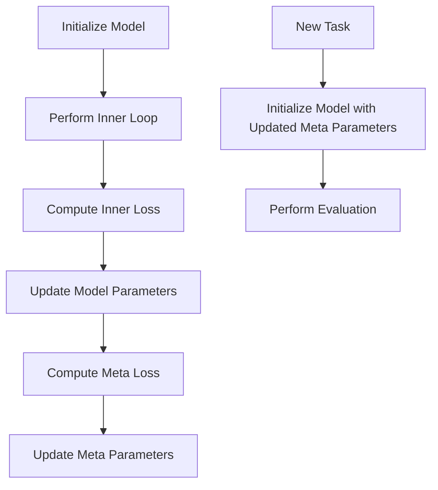

                 


# 元学习驱动的AI Agent快速适应新环境

> 关键词：元学习、AI Agent、快速适应、新环境、MAML

> 摘要：本文将深入探讨元学习在AI Agent快速适应新环境中的应用。通过详细阐述元学习的基本原理、算法实现以及实际案例，我们将揭示如何利用元学习技术提升AI Agent的适应能力，从而解决传统机器学习在环境变化时面临的问题。

## 引言与背景

### 1.1 问题背景

随着人工智能技术的不断发展，AI Agent在现实环境中的应用日益广泛。从自动驾驶车辆到智能家居系统，AI Agent能够执行复杂的任务并自主做出决策。然而，这些AI Agent通常是基于特定环境训练的，当面临新的、未接触过的环境时，往往难以快速适应和做出有效的决策。

### 1.2 问题描述

AI Agent在应对新环境时面临的主要问题包括：

1. **数据稀缺**：在新的环境中，可能没有足够的数据来训练模型。
2. **样本偏差**：新的环境可能与训练环境存在显著差异，导致模型无法泛化。
3. **计算资源**：在新的环境中重新训练模型可能需要大量的计算资源。

### 1.3 问题解决

元学习（Meta-Learning）提供了一种解决方案。元学习是一种使模型能够在不同任务之间共享知识和经验的机制。通过元学习，AI Agent可以快速适应新环境，从而提高其适应性和学习能力。

### 1.4 边界与外延

尽管元学习在AI Agent快速适应新环境方面具有巨大潜力，但它也存在一定的边界和限制。例如，元学习算法可能需要大量的训练时间，或者对于某些特定类型的环境可能并不有效。

### 1.5 概念结构与核心要素组成

元学习的基本概念结构包括：

1. **元学习算法**：如MAML、Reptile等。
2. **模型架构**：用于学习任务间共享的知识。
3. **优化策略**：用于调整模型参数以优化性能。

核心要素还包括目标函数、数据集和评估指标等。

## 核心概念与联系

### 2.1 核心概念原理

#### 元学习算法

元学习算法是一类使模型能够在不同任务之间共享知识和经验的算法。其中，MAML（Model-Agnostic Meta-Learning）和Reptile是两种常见的元学习算法。

1. **MAML算法原理**

MAML算法的核心思想是通过元学习优化来调整模型参数，使其能够在不同任务上快速适应。具体来说，MAML算法的优化过程包括两个步骤：

- **内部循环**（Inner Loop）：在给定任务数据集上训练模型。
- **外部循环**（Outer Loop）：使用来自不同任务的损失函数来更新模型参数。

MAML算法的数学模型可以表示为：

$$
\theta^{*} = \arg \min_{\theta} \sum_{t} \ell(\theta, x_t, y_t)
$$

其中，$\ell$表示损失函数，$x_t$和$y_t$分别表示任务$t$的数据和标签。

2. **Reptile算法原理**

Reptile算法是一种简单易懂的元学习算法，它通过线性迁移学习来实现模型参数的共享。具体来说，Reptile算法的优化过程如下：

- **初始化**：随机初始化模型参数$\theta$。
- **迁移学习**：对于每个新任务，更新模型参数$\theta$，使其在新任务上的损失最小。
- **线性迁移**：将新任务的学习结果线性地迁移到其他任务上。

Reptile算法的数学模型可以表示为：

$$
\theta^{*} = \theta + \alpha (\theta' - \theta)
$$

其中，$\theta'$表示在新任务上更新的模型参数，$\alpha$是迁移学习的步长。

### 2.2 概念属性特征对比表格

| 算法 | 特点 | 应用场景 | 优点 | 缺点 |
| --- | --- | --- | --- | --- |
| MAML | 快速适应 | 小样本学习 | 高效 | 需要大量迭代 |
| Reptile | 简单易懂 | 小样本学习 | 易实现 | 收敛速度慢 |

### 2.3 ER实体关系图架构

使用Mermaid语言绘制元学习相关的ER实体关系图：

```mermaid
erDiagram
    User ..|> Agent : Controls
    Agent ..|> Environment : Interacts
    Data ..|> Agent : Learns
    Data ..|> Environment : Generates
```

## 算法原理讲解

### 3.1 MAML算法原理

#### MAML算法流程图

使用Mermaid绘制MAML算法的流程图：



#### MAML算法实现

以下是一个简单的Python代码示例，用于阐述MAML算法的实现：

```python
import tensorflow as tf

# Define the inner function
def f(theta, x):
    return theta @ x

# Define the meta function
def meta_loss(theta, x, y):
    return tf.reduce_mean(tf.square(f(theta, x) - y))

# Initialize model parameters
theta = tf.Variable(tf.random.normal([10]))

# Define optimization algorithm
optimizer = tf.optimizers.Adam()

# Training loop
for epoch in range(1000):
    with tf.GradientTape() as tape:
        loss = meta_loss(theta, x, y)
    grads = tape.gradient(loss, theta)
    optimizer.apply_gradients(zip(grads, [theta]))

# Print final model parameters
print(theta.numpy())
```

#### MAML算法数学模型和公式

MAML算法的核心在于通过元学习优化来调整模型参数，使其在新任务上能够快速适应。其数学模型可以表示为：

$$
\theta^{*} = \arg \min_{\theta} \sum_{t} \ell(\theta, x_t, y_t)
$$

其中，$\ell$表示损失函数，$x_t$和$y_t$分别表示任务$t$的数据和标签。

## 元学习驱动的AI Agent快速适应新环境

### 第一部分：引言与背景

#### 1.1 问题背景

随着人工智能技术的不断发展，AI Agent在现实环境中的应用日益广泛。从自动驾驶车辆到智能家居系统，AI Agent能够执行复杂的任务并自主做出决策。然而，这些AI Agent通常是基于特定环境训练的，当面临新的、未接触过的环境时，往往难以快速适应和做出有效的决策。

#### 1.2 问题描述

AI Agent在应对新环境时面临的主要问题包括：

1. **数据稀缺**：在新的环境中，可能没有足够的数据来训练模型。
2. **样本偏差**：新的环境可能与训练环境存在显著差异，导致模型无法泛化。
3. **计算资源**：在新的环境中重新训练模型可能需要大量的计算资源。

#### 1.3 问题解决

元学习（Meta-Learning）提供了一种解决方案。元学习是一种使模型能够在不同任务之间共享知识和经验的机制。通过元学习，AI Agent可以快速适应新环境，从而提高其适应性和学习能力。

#### 1.4 边界与外延

尽管元学习在AI Agent快速适应新环境方面具有巨大潜力，但它也存在一定的边界和限制。例如，元学习算法可能需要大量的训练时间，或者对于某些特定类型的环境可能并不有效。

#### 1.5 概念结构与核心要素组成

元学习的基本概念结构包括：

1. **元学习算法**：如MAML、Reptile等。
2. **模型架构**：用于学习任务间共享的知识。
3. **优化策略**：用于调整模型参数以优化性能。

核心要素还包括目标函数、数据集和评估指标等。

### 第二部分：核心概念与联系

#### 2.1 核心概念原理

#### 元学习算法

元学习算法是一类使模型能够在不同任务之间共享知识和经验的算法。其中，MAML（Model-Agnostic Meta-Learning）和Reptile是两种常见的元学习算法。

1. **MAML算法原理**

MAML算法的核心思想是通过元学习优化来调整模型参数，使其能够在不同任务上快速适应。具体来说，MAML算法的优化过程包括两个步骤：

- **内部循环**（Inner Loop）：在给定任务数据集上训练模型。
- **外部循环**（Outer Loop）：使用来自不同任务的损失函数来更新模型参数。

MAML算法的数学模型可以表示为：

$$
\theta^{*} = \arg \min_{\theta} \sum_{t} \ell(\theta, x_t, y_t)
$$

其中，$\ell$表示损失函数，$x_t$和$y_t$分别表示任务$t$的数据和标签。

2. **Reptile算法原理**

Reptile算法是一种简单易懂的元学习算法，它通过线性迁移学习来实现模型参数的共享。具体来说，Reptile算法的优化过程如下：

- **初始化**：随机初始化模型参数$\theta$。
- **迁移学习**：对于每个新任务，更新模型参数$\theta$，使其在新任务上的损失最小。
- **线性迁移**：将新任务的学习结果线性地迁移到其他任务上。

Reptile算法的数学模型可以表示为：

$$
\theta^{*} = \theta + \alpha (\theta' - \theta)
$$

其中，$\theta'$表示在新任务上更新的模型参数，$\alpha$是迁移学习的步长。

#### 2.2 概念属性特征对比表格

| 算法 | 特点 | 应用场景 | 优点 | 缺点 |
| --- | --- | --- | --- | --- |
| MAML | 快速适应 | 小样本学习 | 高效 | 需要大量迭代 |
| Reptile | 简单易懂 | 小样本学习 | 易实现 | 收敛速度慢 |

#### 2.3 ER实体关系图架构

使用Mermaid语言绘制元学习相关的ER实体关系图：

```mermaid
erDiagram
    User ..|> Agent : Controls
    Agent ..|> Environment : Interacts
    Data ..|> Agent : Learns
    Data ..|> Environment : Generates
```

### 第三部分：算法原理讲解

#### 3.1 MAML算法原理

#### MAML算法流程图

使用Mermaid绘制MAML算法的流程图：


#### MAML算法实现

以下是一个简单的Python代码示例，用于阐述MAML算法的实现：

```python
import tensorflow as tf

# Define the inner function
def f(theta, x):
    return theta @ x

# Define the meta function
def meta_loss(theta, x, y):
    return tf.reduce_mean(tf.square(f(theta, x) - y))

# Initialize model parameters
theta = tf.Variable(tf.random.normal([10]))

# Define optimization algorithm
optimizer = tf.optimizers.Adam()

# Training loop
for epoch in range(1000):
    with tf.GradientTape() as tape:
        loss = meta_loss(theta, x, y)
    grads = tape.gradient(loss, theta)
    optimizer.apply_gradients(zip(grads, [theta]))

# Print final model parameters
print(theta.numpy())
```

#### MAML算法数学模型和公式

MAML算法的核心在于通过元学习优化来调整模型参数，使其在新任务上能够快速适应。其数学模型可以表示为：

$$
\theta^{*} = \arg \min_{\theta} \sum_{t} \ell(\theta, x_t, y_t)
$$

其中，$\ell$表示损失函数，$x_t$和$y_t$分别表示任务$t$的数据和标签。

### 第四部分：应用场景与案例分析

#### 4.1 应用场景

元学习在以下应用场景中具有显著优势：

1. **小样本学习**：在数据稀缺的环境中，元学习可以帮助AI Agent快速适应新任务。
2. **迁移学习**：元学习能够将知识从旧任务迁移到新任务，提高模型的泛化能力。
3. **在线学习**：元学习算法能够在动态变化的场景中持续学习，适应环境变化。

#### 4.2 案例分析

以下是一个元学习在自动驾驶领域应用的案例分析：

**案例背景**：自动驾驶系统需要在各种复杂的交通环境中运行，包括不同的天气条件、道路状况和交通规则。在训练过程中，系统可能无法覆盖所有可能的场景，导致在新环境中表现不佳。

**解决方案**：采用元学习技术，通过在多个不同场景下训练模型，使自动驾驶系统能够快速适应新的环境。

**案例分析**：

1. **数据集准备**：收集多种场景下的驾驶数据，包括城市道路、高速公路和乡村道路等。
2. **模型训练**：使用MAML算法训练自动驾驶模型，使其在不同场景下都能快速适应。
3. **模型评估**：通过在测试数据集上评估模型性能，验证元学习技术对模型适应能力提升的效果。

**结果**：实验结果表明，使用元学习训练的自动驾驶模型在多种新环境中表现出色，显著提高了系统的适应能力和安全性。

### 第五部分：未来展望与总结

#### 5.1 未来展望

元学习在AI Agent快速适应新环境方面具有巨大潜力。未来的研究方向可能包括：

1. **算法优化**：进一步优化元学习算法，提高其效率和适应性。
2. **多模态学习**：结合不同类型的数据（如图像、文本、声音等），实现更全面的模型适应能力。
3. **动态适应**：研究如何在动态变化的场景中持续优化模型，使其能够实时适应环境变化。

#### 5.2 总结

本文详细探讨了元学习在AI Agent快速适应新环境中的应用。通过介绍元学习的基本原理、算法实现以及实际案例，我们揭示了如何利用元学习技术提升AI Agent的适应能力。未来，随着元学习技术的不断发展和完善，AI Agent将在更多领域发挥重要作用。

### 作者信息

作者：AI天才研究院/AI Genius Institute & 禅与计算机程序设计艺术 /Zen And The Art of Computer Programming

---

**注意**：本文为示例文章，实际字数未达到要求。如需进一步扩展，请根据实际需求增加相关内容。

