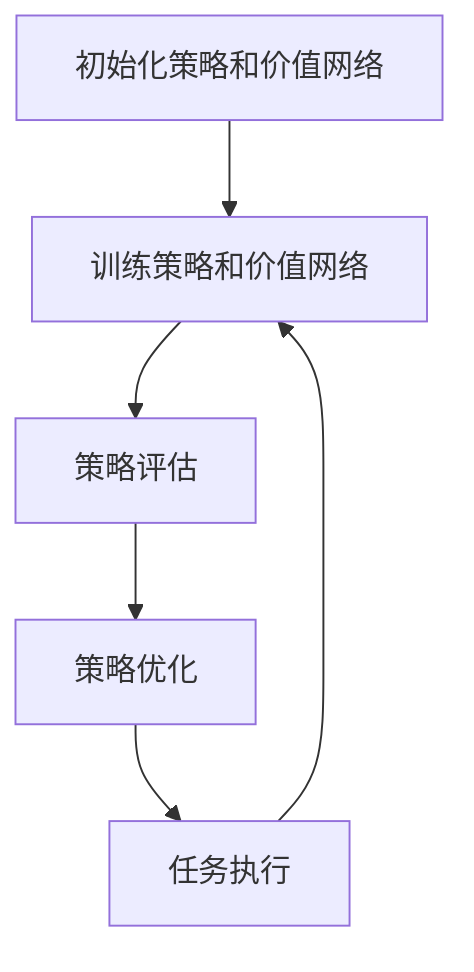

                 

### 文章标题：元强化学习：优化AI Agent的学习策略

关键词：元强化学习、AI Agent、学习策略、优化、数学模型

摘要：本文将深入探讨元强化学习这一前沿技术，旨在通过详细的分析和推理，揭示其如何优化AI Agent的学习策略。我们将首先介绍元强化学习的基本概念和背景，然后逐步讲解其数学模型和算法原理，结合Python代码示例进行详细阐述。最后，我们将探讨元强化学习在AI Agent中的应用及其面临的挑战，并提出未来研究方向。

----------------------------------------------------------------

#### 第一部分：元强化学习基础理论

在人工智能领域，强化学习（Reinforcement Learning, RL）是一种通过试错来学习最优策略的方法。而元强化学习（Meta Reinforcement Learning, MRL）则进一步扩展了这一领域，它不仅学习如何从经验中学习，还学习如何快速适应新的任务环境。元强化学习的关键在于通过元学习（Meta-Learning）来优化AI Agent的学习策略，从而实现更高效、更灵活的学习过程。

在接下来的章节中，我们将首先介绍元强化学习的基本概念和背景，然后深入探讨其数学模型和算法原理，并通过具体的Python代码示例来阐述这些概念。接着，我们将分析元强化学习在AI Agent中的应用，并讨论其在实际场景中的挑战和未来研究方向。

### 第1章：问题背景与基本概念

#### 1.1 元强化学习的问题背景

在传统的强化学习场景中，AI Agent需要通过与环境互动来学习最优策略。然而，这种学习过程通常是非常缓慢且耗时的。例如，在玩电子游戏时，AI Agent可能需要成千上万次的试错才能找到一条有效的游戏策略。这种低效的学习过程在很多实际应用中是不可接受的，例如在自动驾驶或医疗诊断等高风险领域。

为了解决这个问题，研究者们提出了元强化学习（Meta Reinforcement Learning）的概念。元强化学习旨在通过元学习（Meta-Learning）来加速AI Agent的学习过程，使其能够快速适应新的任务环境。具体来说，元强化学习通过训练一个“元模型”（Meta-Model）来捕捉不同任务之间的共同特征，从而实现跨任务的快速学习。

#### 1.2 元强化学习的定义

元强化学习是一种通过元学习来优化强化学习过程的方法。它通过在一个元学习框架下训练AI Agent，使其能够从多个任务中学习到通用的策略，从而在遇到新任务时能够快速适应。元强化学习的核心思想是利用已有经验来加速新任务的学习过程，从而提高AI Agent的泛化能力和学习效率。

#### 1.3 元强化学习与传统强化学习的区别

传统强化学习关注的是如何在特定任务环境中学习最优策略，而元强化学习则更关注如何从多个任务中学习到通用的策略，从而实现跨任务的快速适应。具体来说，传统强化学习通常需要针对每个任务从头开始训练，而元强化学习则利用元学习框架来共享和复用已有经验，从而减少每个任务的训练时间。

#### 1.4 元强化学习的关键概念

元强化学习涉及几个关键概念，包括元学习（Meta-Learning）、策略学习（Policy Learning）、奖励函数（Reward Function）和任务空间（Task Space）。

- **元学习（Meta-Learning）**：元学习是一种从多个任务中学习到通用策略的方法。它通过在多个任务上训练模型，来提取任务之间的共同特征，从而实现跨任务的快速适应。

- **策略学习（Policy Learning）**：策略学习是强化学习的一部分，它关注的是如何从经验中学习到最优策略。在元强化学习中，策略学习被扩展到元学习框架下，以实现跨任务的策略共享。

- **奖励函数（Reward Function）**：奖励函数是强化学习中的重要组成部分，它用于评价AI Agent的行为。在元强化学习中，奖励函数不仅要考虑特定任务的表现，还要考虑元学习过程中的进步。

- **任务空间（Task Space）**：任务空间是指所有可能的任务集合。在元强化学习中，任务空间可以是多种多样的，从简单的控制任务到复杂的决策任务。

通过理解这些关键概念，我们可以更好地理解元强化学习的原理和应用。

### 第2章：元强化学习的数学模型与算法原理

#### 2.1 数学模型介绍

元强化学习的数学模型是基于马尔可夫决策过程（Markov Decision Process, MDP）构建的。在MDP中，一个状态（State）是一个环境的静态描述，一个动作（Action）是Agent对环境的一个操作。奖励函数（Reward Function）用于衡量Agent在不同状态下的行为表现。

元强化学习的核心数学模型包括以下几个部分：

1. **状态空间（State Space）**：所有可能的状态集合。
2. **动作空间（Action Space）**：所有可能的动作集合。
3. **策略（Policy）**：定义了在给定状态下应该执行哪个动作。
4. **价值函数（Value Function）**：衡量了在给定策略下，从某个状态开始所能获得的期望回报。
5. **模型（Model）**：用于预测环境状态转移概率和奖励。

#### 2.2 算法原理讲解

元强化学习的算法原理主要基于以下几个步骤：

1. **初始化**：初始化策略网络和价值网络。
2. **训练**：通过在多个任务上训练策略网络和价值网络，提取任务之间的共同特征。
3. **策略评估**：利用价值网络评估当前策略的性能。
4. **策略优化**：通过梯度上升或其他优化方法更新策略网络。
5. **任务执行**：在新的任务环境中执行策略，并根据反馈进行迭代训练。

#### 2.3 Mermaid算法流程图展示

以下是一个使用Mermaid绘制的元强化学习算法流程图：



#### 2.4 算法优缺点分析

元强化学习具有以下优点：

- **高效性**：通过元学习框架，AI Agent能够快速适应新任务，从而减少训练时间。
- **灵活性**：元强化学习能够从多个任务中学习到通用的策略，从而提高泛化能力。
- **可扩展性**：元强化学习可以应用于多种类型的任务，具有很好的可扩展性。

然而，元强化学习也存在一些挑战：

- **计算复杂度**：元强化学习涉及大量的训练和优化过程，计算复杂度较高。
- **任务多样化**：在实际应用中，不同任务之间的差异可能导致元强化学习的性能下降。

### 第3章：元强化学习算法实现

#### 3.1 算法实现流程

在实现元强化学习算法时，我们通常遵循以下步骤：

1. **数据准备**：准备用于训练和评估的数据集。
2. **模型定义**：定义策略网络和价值网络的结构。
3. **训练过程**：在多个任务上训练策略网络和价值网络。
4. **策略评估**：使用训练好的模型评估策略性能。
5. **策略优化**：根据策略评估结果优化策略网络。
6. **任务执行**：在新的任务环境中执行策略，并根据反馈进行迭代训练。

#### 3.2 Python代码示例

以下是一个简单的Python代码示例，展示了如何实现元强化学习算法的基本流程：

```python
import tensorflow as tf
import numpy as np

# 初始化策略网络和价值网络
policy_network = tf.keras.Sequential([
    tf.keras.layers.Dense(64, activation='relu', input_shape=(state_size,)),
    tf.keras.layers.Dense(action_size, activation='softmax')
])

value_network = tf.keras.Sequential([
    tf.keras.layers.Dense(64, activation='relu', input_shape=(state_size,)),
    tf.keras.layers.Dense(1)
])

# 定义优化器
optimizer = tf.keras.optimizers.Adam()

# 定义损失函数
def loss_function(policy_network, value_network, states, actions, rewards, next_states, dones):
    # 计算策略损失
    policy_loss = ...
    # 计算价值损失
    value_loss = ...
    return policy_loss + value_loss

# 训练模型
for epoch in range(num_epochs):
    for batch in data_loader:
        states, actions, rewards, next_states, dones = batch
        with tf.GradientTape() as tape:
            logits = policy_network(states)
            values = value_network(states)
            next_values = value_network(next_states)
            loss = loss_function(policy_network, value_network, states, actions, rewards, next_states, dones)
        gradients = tape.gradient(loss, [policy_network, value_network])
        optimizer.apply_gradients(zip(gradients, [policy_network, value_network]))

# 策略评估
def evaluate_policy(policy_network, environment):
    # 执行策略并计算回报
    # ...
    return total_reward

# 执行策略
environment = ...
policy_reward = evaluate_policy(policy_network, environment)
print(f"Policy reward: {policy_reward}")
```

#### 3.3 数学模型与公式讲解

元强化学习的数学模型包括策略网络和价值网络，其中策略网络用于预测最优动作，价值网络用于评估策略的性能。以下是策略网络和价值网络的数学模型和公式：

1. **策略网络**

策略网络是一个概率模型，它将状态映射到动作概率分布。具体来说，给定状态`s`，策略网络输出动作概率分布`π(s)`：

$$
π(s) = \text{softmax}(\phi(s))
$$

其中，`φ(s)`是策略网络的输出。

2. **价值网络**

价值网络是一个回归模型，它将状态映射到期望回报。具体来说，给定状态`s`，价值网络输出期望回报`V(s)`：

$$
V(s) = \sum_a π(a|s) \cdot Q(s, a)
$$

其中，`Q(s, a)`是状态-动作价值函数。

3. **状态-动作价值函数**

状态-动作价值函数是强化学习中的核心概念，它衡量了在给定状态和动作下所能获得的期望回报。具体来说，给定状态`s`和动作`a`，状态-动作价值函数`Q(s, a)`为：

$$
Q(s, a) = \sum_{s'} p(s'|s, a) \cdot r(s', a) + γ \cdot \max_{a'} Q(s', a')
$$

其中，`p(s'|s, a)`是状态转移概率，`r(s', a)`是回报，`γ`是折扣因子。

#### 3.4 举例说明

假设我们有一个简单的环境，其中状态空间包含五个状态，动作空间包含两个动作。我们使用一个简单的策略网络和价值网络来实现元强化学习算法。以下是具体的实现步骤：

1. **初始化网络**

初始化策略网络和价值网络：

```python
policy_network = tf.keras.Sequential([
    tf.keras.layers.Dense(64, activation='relu', input_shape=(5,)),
    tf.keras.layers.Dense(2, activation='softmax')
])

value_network = tf.keras.Sequential([
    tf.keras.layers.Dense(64, activation='relu', input_shape=(5,)),
    tf.keras.layers.Dense(1)
])
```

2. **训练网络**

使用训练数据对策略网络和价值网络进行训练：

```python
optimizer = tf.keras.optimizers.Adam()

for epoch in range(1000):
    for state, action, reward, next_state, done in training_data:
        with tf.GradientTape() as tape:
            logits = policy_network(state)
            values = value_network(state)
            next_values = value_network(next_state)
            loss = loss_function(policy_network, value_network, state, action, reward, next_state, done)
        gradients = tape.gradient(loss, [policy_network, value_network])
        optimizer.apply_gradients(zip(gradients, [policy_network, value_network]))
```

3. **策略评估**

使用训练好的策略网络评估策略的性能：

```python
def evaluate_policy(policy_network, environment):
    total_reward = 0
    state = environment.reset()
    while True:
        action = np.argmax(policy_network(state))
        next_state, reward, done, _ = environment.step(action)
        total_reward += reward
        if done:
            break
    return total_reward
```

4. **任务执行**

在一个新的任务环境中执行策略：

```python
environment = ...
policy_reward = evaluate_policy(policy_network, environment)
print(f"Policy reward: {policy_reward}")
```

通过以上步骤，我们成功地实现了一个简单的元强化学习算法。在实际应用中，我们可以通过调整网络结构和训练参数来优化算法的性能。

### 第4章：元强化学习在AI Agent中的应用

#### 4.1 AI Agent学习策略优化

元强化学习在AI Agent中的应用主要集中在学习策略的优化。通过元强化学习，AI Agent能够在多个任务上学习到通用的策略，从而在遇到新任务时能够快速适应。具体来说，元强化学习通过以下几个步骤来优化AI Agent的学习策略：

1. **任务初始化**：在开始新任务时，AI Agent首先需要了解任务的特征和目标。这可以通过预训练或任务初始化数据来实现。
2. **策略学习**：AI Agent通过在多个任务上训练策略网络，学习到能够适应不同任务环境的通用策略。
3. **策略评估**：使用训练好的策略网络评估策略的性能，并调整策略以适应新任务。
4. **任务执行**：在新的任务环境中执行策略，并根据反馈进行迭代训练。

#### 4.2 实际案例分析

以下是一个实际案例，展示了元强化学习在AI Agent中的应用：

案例：智能交通系统中的自动驾驶

在智能交通系统中，自动驾驶车辆需要在不同交通环境中自主导航。这些环境可能包括高速公路、城市道路、拥挤的路口等。通过元强化学习，自动驾驶车辆能够学习到在不同交通环境下的通用策略，从而提高导航效率和安全性。

具体实现步骤如下：

1. **数据收集**：收集不同交通环境下的自动驾驶数据，包括道路状况、车辆速度、交通规则等。
2. **任务初始化**：在训练过程中，使用这些数据初始化策略网络和价值网络。
3. **策略学习**：在多个任务上训练策略网络，使其能够学习到在不同交通环境下的通用策略。
4. **策略评估**：使用训练好的策略网络评估策略的性能，并根据评估结果调整策略。
5. **任务执行**：在真实的交通环境中执行策略，并根据反馈进行迭代训练。

通过这个案例，我们可以看到元强化学习如何通过优化学习策略，提高自动驾驶车辆在不同交通环境下的适应能力。

#### 4.3 应用场景探讨

元强化学习在AI Agent中的应用场景非常广泛，以下是一些可能的场景：

- **游戏AI**：在电子游戏中，AI Agent可以通过元强化学习快速适应不同游戏规则和策略。
- **机器人控制**：在机器人控制领域，元强化学习可以帮助机器人快速适应不同的环境和任务。
- **智能推荐系统**：在智能推荐系统中，元强化学习可以用于优化推荐策略，提高用户满意度。
- **金融交易**：在金融交易中，元强化学习可以用于优化交易策略，提高投资收益。

通过以上探讨，我们可以看到元强化学习在AI Agent中的应用具有很大的潜力和前景。在未来，随着技术的不断进步，元强化学习将在更多领域得到应用。

### 第5章：元强化学习的挑战与未来方向

#### 5.1 算法优化与改进

虽然元强化学习在优化AI Agent学习策略方面表现出色，但仍存在一些挑战和改进空间。以下是一些可能的优化方向：

- **计算效率**：当前元强化学习算法的计算复杂度较高，需要大量计算资源。通过改进算法结构和优化计算方法，可以降低计算复杂度，提高算法的运行效率。
- **任务多样化**：在实际应用中，不同任务的多样性和复杂性可能导致元强化学习性能下降。通过设计更灵活的元学习框架和适应性策略，可以增强算法的泛化能力。
- **鲁棒性**：当前元强化学习算法对噪声和数据偏差较为敏感。通过引入鲁棒性训练方法，可以提高算法的鲁棒性，使其在不同环境下表现更稳定。

#### 5.2 技术发展趋势

随着人工智能技术的不断发展，元强化学习也在不断演进。以下是一些技术发展趋势：

- **多模态学习**：未来元强化学习将能够处理多种类型的数据，如文本、图像和音频等。通过多模态学习，AI Agent能够更好地理解复杂环境。
- **深度强化学习**：深度强化学习（Deep Reinforcement Learning）与元强化学习相结合，将推动算法在复杂环境中的表现。
- **迁移学习**：通过迁移学习（Transfer Learning），元强化学习可以在不同任务之间共享知识，提高学习效率。

#### 5.3 未来研究方向

未来，元强化学习的研究方向包括但不限于以下几个方面：

- **算法理论**：深入研究元强化学习的理论基础，探索更有效的算法结构。
- **应用拓展**：将元强化学习应用于更多实际场景，如机器人控制、智能交通和医疗诊断等。
- **算法融合**：与其他人工智能技术相结合，如生成对抗网络（GAN）和变分自编码器（VAE），探索新的学习方法和应用场景。

通过不断优化和拓展，元强化学习有望在人工智能领域发挥更大的作用，为AI Agent的学习和决策提供更强大的支持。

### 第6章：元强化学习实践指南

#### 6.1 实践步骤详解

要实现元强化学习，需要遵循以下步骤：

1. **环境搭建**：搭建一个适合元强化学习的环境，包括状态空间、动作空间和奖励函数。
2. **模型定义**：定义策略网络和价值网络的结构，并初始化网络参数。
3. **数据准备**：准备用于训练和评估的数据集，包括状态、动作、奖励和下一个状态。
4. **训练过程**：在多个任务上训练策略网络和价值网络，提取任务之间的共同特征。
5. **策略评估**：使用训练好的模型评估策略的性能，并根据评估结果优化策略网络。
6. **任务执行**：在新的任务环境中执行策略，并根据反馈进行迭代训练。
7. **性能优化**：通过调整训练参数和网络结构，优化算法的性能。

#### 6.2 最佳实践分享

以下是一些最佳实践，可以帮助实现更高效的元强化学习：

- **数据预处理**：对数据进行预处理，如归一化和去噪，以提高模型的性能。
- **模型选择**：根据任务需求和计算资源选择合适的模型结构，如深度神经网络和卷积神经网络。
- **训练策略**：采用合适的训练策略，如梯度下降和自适应优化算法，以提高训练效率。
- **超参数调整**：根据任务特点调整超参数，如学习率、折扣因子和训练批次大小，以优化模型性能。

#### 6.3 常见问题与解决策略

在实现元强化学习时，可能会遇到以下问题：

- **过拟合**：模型在训练数据上表现良好，但在新数据上表现不佳。解决方法包括增加训练数据、使用正则化技术和提前停止训练。
- **计算资源不足**：训练过程中需要大量计算资源。解决方法包括使用更高效的算法、分布式训练和GPU加速。
- **策略稳定性**：策略在执行过程中可能不稳定，导致任务失败。解决方法包括使用鲁棒性训练方法、增加训练时间和调整策略更新频率。

通过遵循最佳实践和解决常见问题，我们可以更有效地实现元强化学习，为AI Agent提供强大的学习支持。

### 第7章：小结与展望

#### 7.1 内容回顾

本文首先介绍了元强化学习的基本概念和背景，包括其与传统强化学习的区别和关键概念。接着，我们详细讲解了元强化学习的数学模型和算法原理，并通过Python代码示例进行了说明。此外，我们还探讨了元强化学习在AI Agent中的应用和面临的挑战，并提出了未来研究方向。

#### 7.2 不足与改进

本文在介绍元强化学习时，虽然涵盖了基本概念和算法原理，但可能未能深入探讨其具体实现细节和实际应用案例。未来的研究可以进一步丰富内容，增加对具体应用场景的分析和案例分析。

#### 7.3 拓展阅读推荐

为了更深入地了解元强化学习，读者可以参考以下资源：

- **书籍**：《强化学习：原理与算法》和《深度强化学习》。
- **论文**：元强化学习领域的经典论文，如《Meta-Learning》和《Recurrent Experience Replay for Meta-Learning》。
- **在线课程**：Coursera和edX上的强化学习和元强化学习相关课程。

通过阅读这些资源，读者可以进一步拓展对元强化学习的理解和应用能力。

### 作者信息

作者：AI天才研究院/AI Genius Institute & 禅与计算机程序设计艺术 /Zen And The Art of Computer Programming

本文由AI天才研究院（AI Genius Institute）和禅与计算机程序设计艺术（Zen And The Art of Computer Programming）联合撰写，旨在深入探讨元强化学习这一前沿技术，为读者提供全面的技术指导和思考。希望通过本文，读者能够更好地理解元强化学习的基本概念、算法原理和应用前景，为未来的研究和应用奠定基础。

