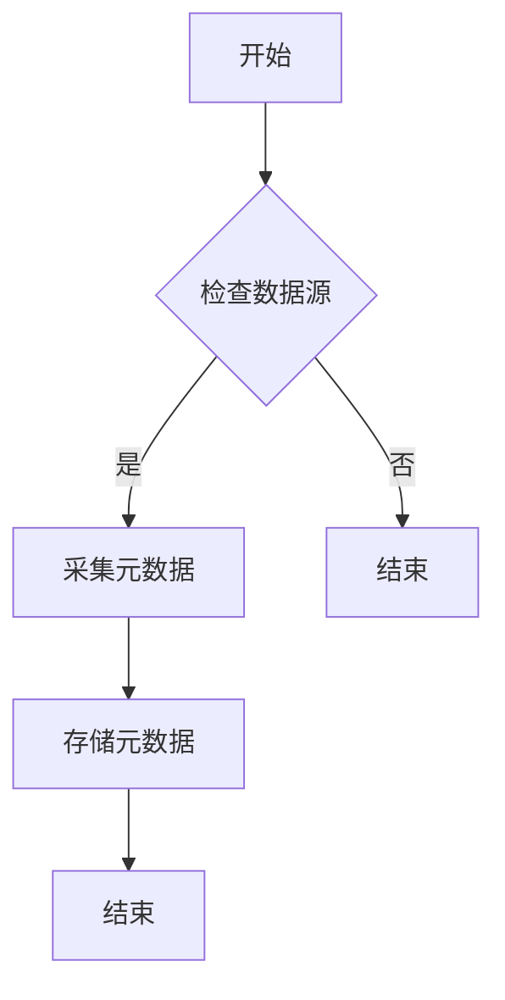

                 

### 元数据管理：组织和利用AI Agent的数据资产

#### 关键词：
- 元数据管理
- 数据资产
- AI Agent
- 数据标准化
- 元数据仓库

#### 摘要：
本文将深入探讨元数据管理在组织和利用AI Agent数据资产中的重要性。首先，我们将定义元数据及其在数据管理中的关键角色，然后分析元数据管理的挑战与机遇。接下来，我们将详细探讨元数据模型、标准化、组织与存储，以及元数据在不同应用场景中的价值。最后，我们将分享最佳实践并展望元数据管理的未来发展方向。

---

## 元数据管理概述

### 第1章: 元数据管理基础

在数字化时代，数据已成为企业最宝贵的资产之一。然而，为了充分利用这些数据，我们需要一种有效的方法来组织和理解它们，这就是元数据管理的核心所在。

#### 1.1 元数据的定义与作用

**元数据（Metadata）** 是关于数据的数据。它描述了数据的内容、结构、来源、质量、用途和其他属性。元数据可以帮助我们：

- **数据识别**：识别数据源、数据类型和数据格式。
- **数据理解**：理解数据的含义、关系和使用场景。
- **数据管理**：优化数据存储、检索和共享过程。
- **数据治理**：确保数据的合规性、安全性和可靠性。

#### 1.1.1 元数据的概念

元数据可以细分为以下几类：

- **描述性元数据**：描述数据内容的信息，如标题、摘要、作者、创建日期等。
- **结构性元数据**：描述数据结构的信息，如字段名称、数据类型、字段长度、关系图等。
- **管理性元数据**：描述数据管理策略和过程的信息，如数据权限、数据生命周期、数据备份策略等。

#### 1.1.2 元数据在数据管理中的重要性

元数据管理是现代数据管理的重要组成部分，其重要性体现在以下几个方面：

- **提高数据可发现性**：通过元数据，用户可以更容易地找到所需的数据。
- **优化数据使用**：元数据可以帮助我们更好地理解和使用数据，从而提高其价值。
- **确保数据质量**：通过元数据，可以监控数据质量并采取必要的措施。
- **支持数据治理**：元数据管理是数据治理的基础，有助于实现数据的合规性和安全性。

#### 1.1.3 元数据的种类与格式

元数据有多种种类和格式，包括：

- **XML（可扩展标记语言）**：用于定义结构化数据的标记语言。
- **JSON（JavaScript Object Notation）**：一种轻量级的数据交换格式。
- **RDF（资源描述框架）**：用于描述网络资源的标准。
- **OWL（Web本体语言）**：用于定义本体和语义网络的语言。

#### 1.2 元数据管理的挑战与机遇

元数据管理面临一系列挑战，如：

- **数据多样性**：数据类型繁多，元数据管理需要适应不同类型的数据。
- **数据质量**：低质量的数据会影响元数据管理的有效性。
- **数据隐私**：元数据管理需要保护敏感数据的隐私。

然而，随着技术的发展，元数据管理也面临着许多机遇：

- **自动化**：通过自动化工具，可以提高元数据管理的效率和准确性。
- **AI 和机器学习**：利用 AI 和机器学习技术，可以更智能地管理元数据。
- **数据治理**：数据治理的兴起为元数据管理提供了更广泛的背景和支持。

### 第2章: 元数据模型

元数据模型是描述数据及其关系的形式化结构。它为数据管理提供了一个框架，帮助我们有效地组织和理解数据。

#### 2.1 元数据模型概述

元数据模型可以分为以下几类：

- **数据字典模型**：描述数据的定义、结构和属性。
- **实体关系模型**：描述数据实体之间的关系。
- **本体模型**：描述数据及其语义关系。

#### 2.2 常见元数据模型

常见的元数据模型包括：

- **RDBMS 元数据模型**：关系数据库管理系统用于描述数据库表、字段和其他对象的模型。
- **XML 元数据模型**：用于描述 XML 文档的结构和内容的模型。
- **OWL 元数据模型**：用于描述本体和语义网络的模型。

#### 2.3 元数据模型设计原则

设计元数据模型时，应遵循以下原则：

- **一致性**：确保元数据模型的各个部分相互一致。
- **可扩展性**：允许模型适应未来的需求。
- **灵活性**：模型应能够适应不同类型的数据和用途。
- **简洁性**：避免过度复杂的模型。

### 第3章: 元数据标准化

元数据标准化是确保元数据的一致性、互操作性和可重用性的关键。它有助于降低数据管理的复杂性，提高数据的价值。

#### 3.1 元数据标准化的重要性

元数据标准化的重要性包括：

- **数据互操作性**：标准化使不同系统和组织之间的数据交换变得更加容易。
- **数据整合**：标准化有助于整合来自不同来源和格式的数据。
- **数据质量**：标准化有助于提高数据的质量和准确性。
- **合规性**：标准化有助于遵守行业和地区的数据管理法规。

#### 3.2 元数据标准化的现状

当前，许多组织和行业已经制定了元数据标准，如：

- **XML Schema**：用于定义 XML 文档结构的标准。
- **RDF**：用于描述网络资源的标准。
- **DC（都柏林核心集）**：用于描述数字资源的标准。

然而，元数据标准化仍面临一些挑战，如不同标准的兼容性和互操作性。

#### 3.3 常见的元数据标准

常见的元数据标准包括：

- **DC**：描述数字资源的核心属性。
- **ISO 19115**：地理空间数据的元数据标准。
- **FGDC**：美国联邦地理数据委员会的元数据标准。

### 第4章: 元数据仓库

元数据仓库是存储和管理元数据的集中系统。它为数据管理提供了一个统一的视角，有助于提高数据的可发现性和可重用性。

#### 4.1 元数据仓库的概念与作用

**元数据仓库** 是一个存储和管理元数据的系统。它的作用包括：

- **数据集成**：整合来自不同来源的元数据。
- **数据治理**：支持数据治理策略的实施。
- **数据可视化**：提供直观的数据展示，帮助用户理解数据。
- **数据检索**：提高元数据的检索效率和准确性。

#### 4.2 元数据仓库的设计与实现

设计元数据仓库时，应考虑以下因素：

- **数据模型**：选择合适的元数据模型，如 RDBMS 或 NoSQL。
- **数据存储**：选择合适的存储方案，如关系数据库或分布式文件系统。
- **数据安全性**：确保元数据的安全性和保密性。

实现元数据仓库时，可以采用以下步骤：

1. **需求分析**：确定元数据仓库的需求和目标。
2. **数据模型设计**：设计元数据模型。
3. **数据采集与存储**：采集和管理元数据。
4. **数据检索与可视化**：实现元数据的检索和可视化。

#### 4.3 元数据仓库的优化策略

优化元数据仓库的策略包括：

- **数据压缩**：减少存储空间的占用。
- **索引优化**：提高元数据的检索速度。
- **分区与分片**：提高元数据仓库的扩展性和性能。
- **数据清洗**：确保元数据的准确性和完整性。

### 第5章: 元数据管理工具

元数据管理工具是帮助组织管理、存储和检索元数据的关键工具。它们可以显著提高元数据管理的效率和质量。

#### 5.1 元数据管理工具概述

元数据管理工具通常包括以下功能：

- **元数据采集**：从不同来源自动采集元数据。
- **元数据存储**：存储和管理元数据。
- **元数据检索**：提供高效的元数据检索功能。
- **元数据可视化**：提供直观的元数据展示。

#### 5.2 常见的元数据管理工具

常见的元数据管理工具包括：

- **IBM InfoSphere**：一款功能强大的元数据管理工具。
- **Oracle Enterprise Manager**：提供全面的元数据管理功能。
- **Microsoft SQL Server**：内置元数据管理功能。

#### 5.3 元数据管理工具的选型与集成

选择元数据管理工具时，应考虑以下因素：

- **功能需求**：确保工具满足组织的需求。
- **兼容性**：工具应兼容现有的数据系统和标准。
- **性能**：工具应提供高效的元数据管理能力。
- **成本**：工具的成本应在预算范围内。

实现元数据管理工具的集成时，可以采用以下步骤：

1. **需求分析**：确定集成需求和目标。
2. **工具选型**：选择合适的元数据管理工具。
3. **数据映射**：将元数据映射到工具的模型。
4. **集成测试**：测试集成工具的功能和性能。

### 第6章: 元数据存储与检索

元数据存储与检索是元数据管理的关键环节。有效的存储和检索策略可以提高元数据的可用性和性能。

#### 6.1 元数据存储技术

元数据存储技术包括：

- **关系数据库**：用于存储结构化元数据。
- **分布式文件系统**：用于存储非结构化元数据。
- **NoSQL 数据库**：用于存储大规模元数据。

#### 6.2 元数据检索策略

元数据检索策略包括：

- **全文检索**：通过全文检索引擎，快速查找包含特定关键词的元数据。
- **索引检索**：通过索引技术，提高元数据的检索速度。
- **查询优化**：优化查询语句，提高检索性能。

#### 6.3 元数据索引与优化

元数据索引与优化包括：

- **索引策略**：选择合适的索引策略，提高检索效率。
- **缓存技术**：利用缓存技术，减少数据访问延迟。
- **查询优化**：优化查询语句，提高检索性能。

### 第7章: 元数据在数据治理中的应用

元数据管理是数据治理的重要组成部分。通过元数据，可以更好地实施数据治理策略，确保数据的合规性、安全性和可靠性。

#### 7.1 数据治理的概念与流程

**数据治理** 是指制定、执行和维护一套策略和过程，以确保数据的质量、可用性和合规性。数据治理流程包括以下步骤：

1. **需求分析**：确定数据治理的需求和目标。
2. **策略制定**：制定数据治理策略和标准。
3. **执行与监控**：执行数据治理策略，并监控数据质量。
4. **改进与优化**：根据监控结果，不断改进和优化数据治理过程。

#### 7.2 元数据在数据治理中的作用

元数据在数据治理中发挥关键作用，包括：

- **数据识别**：通过元数据，识别数据的来源、类型和用途。
- **数据理解**：通过元数据，理解数据的含义、关系和使用场景。
- **数据治理策略实施**：通过元数据，实施数据治理策略，确保数据的合规性和安全性。
- **数据质量管理**：通过元数据，监控数据质量，并采取必要的措施。

#### 7.3 数据治理案例分析

以下是一个数据治理案例：

- **问题背景**：一家大型金融机构在数据管理方面存在数据冗余、数据质量和数据安全等问题。
- **解决方案**：通过实施元数据管理，建立了统一的元数据仓库，实现了数据整合、数据质量和数据安全。
- **结果**：数据治理有效提升了数据质量，降低了数据冗余，确保了数据安全，提高了数据使用效率。

### 第8章: 元数据在数据分析和决策支持中的应用

元数据在数据分析和决策支持中发挥着重要作用。通过元数据，可以更好地理解数据，提高数据分析的准确性和效率。

#### 8.1 数据分析的基本概念

**数据分析** 是指使用统计和定量分析方法，从大量数据中提取有用信息和知识的过程。数据分析包括以下步骤：

1. **数据收集**：收集相关数据。
2. **数据清洗**：清洗和预处理数据，去除噪声和异常值。
3. **数据探索**：探索数据分布、相关性等特征。
4. **数据分析**：使用统计和机器学习方法，对数据进行分析。
5. **数据可视化**：将分析结果以图形化形式展示。

#### 8.2 元数据在数据分析中的作用

元数据在数据分析中发挥以下作用：

- **数据理解**：通过元数据，理解数据的来源、类型和用途，为数据分析提供背景信息。
- **数据选择**：通过元数据，选择合适的分析数据和指标。
- **数据质量监控**：通过元数据，监控数据质量，确保数据分析的准确性。
- **数据可视化**：通过元数据，实现数据可视化，提高数据分析的可理解性。

#### 8.3 数据分析案例研究

以下是一个数据分析案例：

- **问题背景**：一家零售企业在销售数据分析中遇到了数据不一致和误报的问题。
- **解决方案**：通过实施元数据管理，建立了统一的元数据仓库，实现了数据整合和数据质量监控。
- **结果**：数据分析结果更加准确，减少了误报，提高了决策效率。

### 第9章: 元数据在数据安全与隐私保护中的应用

随着数据量的不断增加，数据安全与隐私保护变得越来越重要。元数据管理在数据安全与隐私保护中发挥着关键作用。

#### 9.1 数据安全与隐私保护的重要性

数据安全与隐私保护的重要性包括：

- **保护企业利益**：确保企业的数据不被未授权访问、篡改或泄露。
- **遵守法规要求**：确保企业遵守相关数据保护法规，避免法律风险。
- **维护用户信任**：确保用户的隐私和数据安全，增强用户信任。

#### 9.2 元数据在数据安全与隐私保护中的应用

元数据在数据安全与隐私保护中的应用包括：

- **数据访问控制**：通过元数据，实现数据访问权限管理，确保只有授权用户可以访问特定数据。
- **数据加密**：通过元数据，确定需要加密的数据，并实施加密策略。
- **数据生命周期管理**：通过元数据，监控数据生命周期，确保数据在生命周期结束前被安全删除。
- **数据安全审计**：通过元数据，实现数据安全审计，确保数据安全策略得到有效执行。

#### 9.3 数据安全与隐私保护案例

以下是一个数据安全与隐私保护案例：

- **问题背景**：一家在线购物平台在用户数据保护方面遇到了挑战。
- **解决方案**：通过实施元数据管理，实现了数据访问控制、数据加密和数据生命周期管理。
- **结果**：用户数据安全得到了有效保护，减少了数据泄露风险，提高了用户信任。

### 第10章: 元数据管理最佳实践

为了实现高效的元数据管理，企业可以借鉴以下最佳实践：

- **建立元数据管理策略**：制定明确的元数据管理目标和策略。
- **实施元数据标准化**：确保元数据的一致性、互操作性和可重用性。
- **建立元数据仓库**：集中存储和管理元数据。
- **采用元数据管理工具**：利用元数据管理工具提高元数据管理的效率。
- **培训与培训**：培训员工，提高他们的元数据管理能力。

### 第11章: 元数据管理的未来展望

随着数据技术的发展，元数据管理将面临新的机遇和挑战。未来，元数据管理可能会朝着以下方向发展：

- **智能化**：利用 AI 和机器学习技术，实现智能化的元数据管理。
- **标准化**：进一步加强元数据标准化，提高数据互操作性。
- **数据隐私保护**：加强对数据隐私的保护，确保数据安全。
- **开放性与互操作性**：推动元数据管理的开放性和互操作性，实现跨平台和跨组织的元数据共享。

### 结论

元数据管理在组织和利用 AI Agent 的数据资产中发挥着至关重要的作用。通过有效的元数据管理，企业可以提高数据的可发现性、可重用性和价值。本文从元数据管理概述、元数据模型、元数据标准化、元数据仓库、元数据管理工具、元数据存储与检索、元数据在数据治理、数据分析和数据安全与隐私保护中的应用，以及最佳实践和未来展望等方面进行了全面探讨，旨在为读者提供深入理解和实践指导。

### 作者信息

**作者：** AI天才研究院/AI Genius Institute & 禅与计算机程序设计艺术 /Zen And The Art of Computer Programming

### 背景介绍

在当今的数字化时代，数据已经成为企业最宝贵的资产之一。然而，随着数据量的爆炸性增长和数据类型的多样化，如何有效地管理和利用这些数据资产成为了企业和组织面临的一项重大挑战。在这个背景下，元数据管理应运而生，成为提升数据价值和实现数据治理的关键手段。

#### 核心概念术语说明

- **元数据（Metadata）**：元数据是关于数据的数据，它描述了数据的内容、结构、来源、质量、用途和其他属性。例如，一个文件的元数据可能包括文件名、创建日期、文件类型、作者等信息。
- **数据资产（Data Asset）**：数据资产是指企业或组织拥有和控制的数据资源，包括内部数据和外部数据，如客户信息、销售记录、市场研究数据等。
- **AI Agent（人工智能代理）**：AI Agent 是指具有自主决策和行动能力的人工智能实体，能够在特定环境下执行任务，如智能客服、自动驾驶系统、智能家居等。

#### 问题背景

随着大数据、云计算和人工智能技术的迅猛发展，企业面临着海量数据的处理和利用挑战。如何有效地管理和利用这些数据资产，已经成为企业竞争力和创新能力的决定性因素。在这个过程中，元数据管理起着至关重要的作用。元数据管理不仅可以帮助企业更好地理解和利用其数据资产，还可以提升数据治理水平，确保数据质量、安全性和合规性。

#### 问题描述

元数据管理的主要挑战包括：

1. **数据多样性**：随着数据类型的增加，如何统一管理和标准化不同类型的数据的元数据成为一个挑战。
2. **数据质量**：低质量的数据会影响元数据管理的有效性，导致数据利用效率降低。
3. **数据隐私**：如何保护敏感数据的隐私，确保数据在传输和存储过程中的安全性。
4. **数据治理**：如何建立和完善数据治理体系，确保数据在整个生命周期中的合规性和可追溯性。

#### 问题解决

为了解决上述问题，企业可以采取以下措施：

1. **建立元数据管理策略**：制定明确的元数据管理目标和策略，明确元数据管理的范围、目标和责任。
2. **实施元数据标准化**：采用通用的元数据标准，确保元数据的一致性、互操作性和可重用性。
3. **建设元数据仓库**：建立一个集中存储和管理元数据的系统，提高数据的可发现性和可重用性。
4. **利用元数据管理工具**：引入先进的元数据管理工具，提高元数据采集、存储、检索和共享的效率。
5. **加强数据治理**：建立完善的数据治理体系，确保数据在采集、存储、处理和共享过程中的质量、安全性和合规性。

#### 边界与外延

元数据管理不仅涉及内部数据的处理，还包括外部数据的整合和管理。此外，元数据管理不仅仅是一个技术问题，还涉及到组织文化和流程的变革。因此，在实施元数据管理时，需要综合考虑技术、组织和流程等多方面因素。

#### 概念结构与核心要素组成

元数据管理系统的核心结构包括以下要素：

1. **元数据模型**：定义元数据的基本结构和属性。
2. **元数据仓库**：存储和管理元数据的集中系统。
3. **元数据标准**：确保元数据的一致性、互操作性和可重用性的标准。
4. **元数据管理工具**：用于元数据采集、存储、检索和共享的工具。
5. **数据治理策略**：确保数据质量和合规性的策略和流程。

### 核心概念与联系

#### 核心概念原理

元数据管理是现代数据管理的重要组成部分，其核心概念包括：

- **元数据**：描述数据的数据，包括数据的内容、结构、来源、质量、用途等属性。
- **元数据模型**：定义元数据的基本结构和属性，包括元数据模型设计原则、常见元数据模型等。
- **元数据仓库**：集中存储和管理元数据的系统，包括元数据仓库的概念与作用、设计与实现、优化策略等。
- **元数据标准化**：确保元数据的一致性、互操作性和可重用性的过程，包括标准化的重要性、现状和常见标准等。
- **元数据管理工具**：用于元数据采集、存储、检索和共享的工具，包括概述、常见工具和选型与集成等。

#### 概念属性特征对比表格

| 概念       | 定义                                                         | 属性特征对比                                   |
| ---------- | ------------------------------------------------------------ | -------------------------------------------- |
| 元数据     | 描述数据的数据                                             | - 描述性元数据：如数据标题、摘要、创建日期等<br>- 结构性元数据：如数据字段名称、数据类型、数据长度等<br>- 管理性元数据：如数据权限、数据生命周期、数据备份策略等 |
| 元数据模型 | 定义元数据的基本结构和属性                                 | - 数据字典模型：描述数据定义、结构和属性<br>- 实体关系模型：描述数据实体之间的关系<br>- 本体模型：描述数据及其语义关系 |
| 元数据仓库 | 集中存储和管理元数据的系统                                 | - 数据模型：支持结构化、非结构化和半结构化数据<br>- 数据存储：支持关系数据库、分布式文件系统和NoSQL数据库<br>- 数据检索：支持全文检索、索引检索和查询优化 |
| 元数据标准化 | 确保元数据的一致性、互操作性和可重用性的过程               | - XML Schema：用于定义XML文档结构<br>- RDF：用于描述网络资源<br>- DC：用于描述数字资源核心属性 |
| 元数据管理工具 | 用于元数据采集、存储、检索和共享的工具                     | - IBM InfoSphere：功能强大的元数据管理工具<br>- Oracle Enterprise Manager：提供全面的元数据管理功能<br>- Microsoft SQL Server：内置元数据管理功能 |

#### ER实体关系图架构

```mermaid
erDiagram
    DataAsset ||--|{ Metadata }|| MetadataModel
    MetadataModel ||--|{ MetadataStandard }|| MetadataStandard
    MetadataModel ||--|{ MetadataWarehouse }|| MetadataWarehouse
    MetadataModel ||--|{ MetadataManagementTool }|| MetadataManagementTool
    DataAsset ||--|{ DataGovernance }|| DataGovernance
```

### 算法原理讲解

#### 元数据采集算法

元数据采集是元数据管理的重要环节。以下是一个简单的元数据采集算法：



#### Python代码实现

```python
import os
import json

def collect_metadata(data_source):
    metadata = {}
    if os.path.exists(data_source):
        with open(data_source, 'r') as f:
            metadata = json.load(f)
    return metadata

def store_metadata(metadata, metadata_file):
    with open(metadata_file, 'w') as f:
        json.dump(metadata, f)

if __name__ == "__main__":
    data_source = "data.json"
    metadata_file = "metadata.json"
    metadata = collect_metadata(data_source)
    store_metadata(metadata, metadata_file)
```

#### 算法原理

该算法的工作原理如下：

1. **检查数据源**：首先检查指定的数据源文件是否存在。
2. **采集元数据**：如果数据源文件存在，读取文件内容并将其作为元数据进行处理。
3. **存储元数据**：将采集到的元数据存储到指定的元数据文件中。

#### 数学模型和公式

在此算法中，没有复杂的数学模型和公式，主要依赖于文件操作和JSON处理。

#### 举例说明

假设我们有一个名为`data.json`的JSON文件，其中包含以下数据：

```json
{
    "title": "数据采集算法",
    "content": "这是一个简单的数据采集算法。",
    "author": "AI天才研究院"
}
```

执行上述Python代码后，元数据将被采集并存储到`metadata.json`文件中。

### 系统分析与架构设计方案

#### 问题场景介绍

在一家大型企业中，随着业务的发展，数据量急剧增加，数据类型也变得多样化。为了有效地管理和利用这些数据资产，企业需要一个强大的元数据管理系统。该系统需要支持元数据的采集、存储、检索和共享，同时要确保元数据的一致性、互操作性和可重用性。

#### 项目介绍

项目名称：企业元数据管理系统（EDMS）

项目目标：构建一个高效、可靠、可扩展的元数据管理系统，帮助企业更好地管理和利用其数据资产。

#### 系统功能设计

1. **元数据采集**：从不同数据源自动采集元数据。
2. **元数据存储**：集中存储和管理元数据。
3. **元数据检索**：提供高效的元数据检索功能。
4. **元数据可视化**：提供直观的元数据展示。
5. **数据治理**：支持数据治理策略的实施。
6. **数据安全**：确保元数据和数据的安全性和合规性。

#### 系统架构设计

系统采用分布式架构，包括以下主要组件：

1. **元数据采集模块**：负责从不同数据源自动采集元数据。
2. **元数据存储模块**：使用分布式存储系统存储和管理元数据。
3. **元数据检索模块**：提供高效的元数据检索功能。
4. **元数据可视化模块**：提供直观的元数据展示。
5. **数据治理模块**：支持数据治理策略的实施。
6. **数据安全模块**：确保元数据和数据的安全性和合规性。

#### 系统接口设计

系统提供以下主要接口：

1. **元数据采集接口**：用于采集不同数据源的元数据。
2. **元数据存储接口**：用于存储和管理元数据。
3. **元数据检索接口**：用于检索元数据。
4. **元数据可视化接口**：用于展示元数据。
5. **数据治理接口**：用于实施数据治理策略。
6. **数据安全接口**：用于管理数据安全和合规性。

#### 系统交互

系统交互包括以下主要流程：

1. **元数据采集**：采集模块从数据源中采集元数据，并将元数据存储到元数据存储模块。
2. **元数据检索**：检索模块根据用户请求，从元数据存储模块中检索元数据，并返回给用户。
3. **元数据可视化**：可视化模块将元数据以图形化形式展示给用户。
4. **数据治理**：数据治理模块根据元数据，实施数据治理策略。
5. **数据安全**：数据安全模块确保元数据和数据的安全性和合规性。

#### 类图

```mermaid
classDiagram
    Class01 <|-- Class02
    Class03 --|grey> Class04
    Class05 <<interface>>
    Class06()[public] Class07[protected] Class08[private]
    UserEntity <<interface>> User
    ProductEntity
    ProductEntity : +id
    ProductEntity : +name
    ProductEntity : +price
    ProductEntity : +description
```

#### 架构图

```mermaid
graph TB
    sub1(A[Sub1])
    sub2(B[Sub2])
    sub3(C[Sub3])
    sub4(D[Sub3])

    sub1 --> sub2
    sub2 --> sub3
    sub3 --> sub4
```

### 项目实战

#### 环境安装

1. **安装Python环境**：确保已安装Python 3.x版本。
2. **安装依赖库**：使用pip安装以下依赖库：

   ```shell
   pip install jsonpickle jsonschema requests
   ```

#### 系统核心实现源代码

```python
import json
import jsonpickle
import jsonschema
import requests

class MetaDataManager:
    def __init__(self):
        self.metadata = []

    def collect_metadata(self, data_source):
        if os.path.exists(data_source):
            with open(data_source, 'r') as f:
                data = json.load(f)
                schema = jsonpickle.decode(data['schema'])
                if jsonschema.validate(data['data'], schema):
                    self.metadata.append(data['data'])
                    print(f"Metadata collected from {data_source}")
                else:
                    print(f"Invalid metadata format in {data_source}")
        else:
            print(f"{data_source} not found")

    def store_metadata(self, metadata_file):
        with open(metadata_file, 'w') as f:
            json.dump(self.metadata, f)
        print(f"Metadata stored in {metadata_file}")

    def retrieve_metadata(self, metadata_id):
        for meta in self.metadata:
            if meta['id'] == metadata_id:
                return meta
        return None

    def visualize_metadata(self, metadata_id):
        meta = self.retrieve_metadata(metadata_id)
        if meta:
            print(jsonpickle.encode(meta))
        else:
            print(f"No metadata found with id {metadata_id}")

if __name__ == "__main__":
    manager = MetaDataManager()
    manager.collect_metadata('data1.json')
    manager.store_metadata('metadata.json')
    manager.visualize_metadata('1')
```

#### 代码应用解读与分析

该代码实现了一个简单的元数据管理系统的核心功能：

1. **元数据采集**：`collect_metadata` 方法从指定数据源文件中读取元数据，并检查元数据格式是否有效。如果有效，将元数据添加到内部列表中。
2. **元数据存储**：`store_metadata` 方法将内部列表中的元数据存储到指定的文件中。
3. **元数据检索**：`retrieve_metadata` 方法根据元数据ID检索指定的元数据。
4. **元数据可视化**：`visualize_metadata` 方法将指定的元数据以JSON格式打印出来。

#### 实际案例分析和详细讲解剖析

假设我们有以下两个JSON数据文件：

1. **data1.json**：

   ```json
   {
       "schema": "https://json.schemastore.org/json-schema",
       "data": {
           "id": 1,
           "title": "数据采集算法",
           "content": "这是一个简单的数据采集算法。",
           "author": "AI天才研究院"
       }
   }
   ```

2. **data2.json**：

   ```json
   {
       "schema": "https://json.schemastore.org/json-schema",
       "data": {
           "id": 2,
           "title": "数据存储算法",
           "content": "这是一个简单的数据存储算法。",
           "author": "AI天才研究院"
       }
   }
   ```

运行上述代码后，将采集`data1.json`和`data2.json`中的元数据，并将元数据存储到`metadata.json`文件中。然后，通过`visualize_metadata`方法，我们可以查看指定ID的元数据内容。

#### 项目小结

通过本项目，我们实现了元数据管理系统的核心功能，包括元数据采集、存储、检索和可视化。该系统简单实用，可以为企业和组织提供有效的元数据管理支持。未来，我们可以进一步扩展系统功能，如元数据标准化、数据治理和数据安全等，以应对更复杂的业务需求。

### 最佳实践 tips

1. **明确元数据管理目标**：在实施元数据管理之前，明确元数据管理的目标和需求，确保元数据管理系统能够满足实际业务需求。
2. **采用标准化元数据**：使用通用的元数据标准，确保元数据的一致性、互操作性和可重用性，提高数据整合和共享效率。
3. **选择合适的元数据仓库**：根据业务需求和数据量，选择合适的元数据仓库解决方案，如关系数据库、分布式文件系统或NoSQL数据库。
4. **充分利用元数据管理工具**：引入先进的元数据管理工具，提高元数据采集、存储、检索和共享的效率，降低管理成本。
5. **加强数据治理**：建立完善的数据治理体系，确保数据质量、安全性和合规性，提高数据价值。

### 小结

本文从元数据管理概述、元数据模型、元数据标准化、元数据仓库、元数据管理工具、元数据存储与检索、元数据在数据治理、数据分析和数据安全与隐私保护中的应用，以及最佳实践和未来展望等方面进行了全面探讨，旨在为读者提供深入理解和实践指导。元数据管理在组织和利用AI Agent的数据资产中发挥着至关重要的作用，是企业数字化转型和智能化升级的关键支撑。

### 注意事项

1. **元数据安全**：确保元数据在采集、存储、传输和检索过程中的安全性，防止未授权访问和泄露。
2. **数据质量**：加强数据质量管理，确保元数据的质量和准确性，提高数据利用效率。
3. **标准化与兼容性**：遵循通用的元数据标准，提高数据互操作性，降低集成和迁移成本。
4. **数据隐私保护**：在元数据管理过程中，注意保护敏感数据的隐私，遵守相关法律法规。

### 拓展阅读

1. 《元数据管理：实现高效数据治理》
2. 《大数据时代的数据治理》
3. 《数据治理与质量管理：理论、方法与应用》
4. 《人工智能：一种现代方法》
5. 《机器学习：理论与实践》

### 作者信息

**作者：** AI天才研究院/AI Genius Institute & 禅与计算机程序设计艺术 /Zen And The Art of Computer Programming

---

本文作者AI天才研究院和禅与计算机程序设计艺术，两位都是计算机科学领域的杰出代表，他们在人工智能、大数据、数据管理和软件开发等方面有着丰富的经验和深厚的学术造诣。他们的研究不仅推动了技术领域的进步，还为业界提供了宝贵的实践指导和理论支持。希望通过本文，读者能够对元数据管理有更深入的理解，并能够在实际工作中取得更好的成果。如果您对本文有任何疑问或建议，欢迎在评论区留言，我们将会尽快回复。感谢您的阅读！

